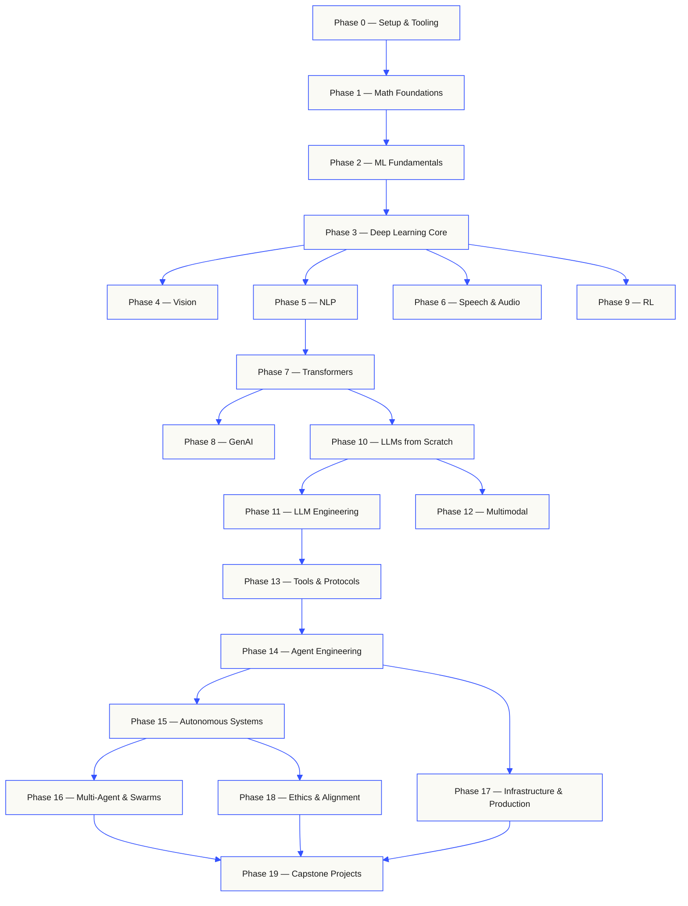
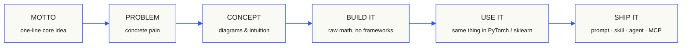

<p align="center">
  
</p>

<p align="center">
  <b>使用你的语言阅读：</b>
  <a href="i18n/es/README.md">西班牙语</a> ·
  <a href="i18n/fr/README.md">法语</a> ·
  <a href="i18n/pt/README.md">葡萄牙语</a> ·
  <a href="i18n/de/README.md">德语</a> ·
  <a href="i18n/it/README.md">意大利语</a> ·
  <a href="i18n/zh/README.md">简体中文</a> ·
  <a href="i18n/ja/README.md">日语</a> ·
  <a href="i18n/ko/README.md">韩语</a> ·
  <a href="i18n/hi/README.md">印地语</a> ·
  <a href="i18n/ar/README.md">阿拉伯语</a> ·
  <a href="i18n/ru/README.md">俄语</a> ·
  <a href="i18n/tr/README.md">土耳其语</a>
  <br><sub>翻译后的落地页已提交到 repo。英文版为规范版本；课程页面在 <code>translations</code> 分支上由机器翻译。详见 <a href="docs/i18n.md">docs/i18n.md</a>。</sub>
</p>

<p align="center">
  <a href="LICENSE"></a>
  <a href="ROADMAP.md"></a>
  <a href="#contents"></a>
  <a href="https://github.com/rohitg00/ai-engineering-from-scratch/stargazers"></a>
  <a href="https://aiengineeringfromscratch.com"></a>
</p>

## 来自 [Agent Memory - 排名第一的持久化记忆 ⭐](https://github.com/rohitg00/agentmemory) 的创建者 <a href="https://github.com/rohitg00/agentmemory/stargazers"></a>，它可自然适配任何 Agent 或聊天助手。

```text
░░░▒▒▒░░░▒▒▒░░░▒▒▒░░░▒▒▒░░░▒▒▒░░░▒▒▒░░░▒▒▒░░░▒▒▒░░░▒▒▒░░░▒▒▒░░░▒▒▒░░░▒▒▒░░░▒▒▒░░░▒▒▒░░░▒▒▒
```

> **84% 的学生已经在使用 AI 工具。只有 18% 的学生认为自己已准备好以
> 专业方式使用这些工具。** 本课程体系将弥合这一差距。
>
> 511 节课。20 个阶段。约 329 小时。Python、TypeScript、Rust、Julia。每节课都会交付
> 一个可复用产物：Prompt、Skill、Agent 或 MCP server。免费、开源、采用 MIT 许可。
>
> 你不只是学习 AI。你还会亲手端到端构建它。

<!-- STATS:START（由 build.js 根据 site/stats.json 生成 — 请勿手动编辑） -->
<p align="center"><sub><b>150,639</b> 位读者 &nbsp;·&nbsp; 过去 30 天内有 <b>241,669</b> 次页面浏览 &nbsp;·&nbsp; 截至 2026-06-07</sub></p>
<!-- STATS:END -->

## 从这里开始：选择你想构建的内容

开始前，你无需浏览全部 511 节课。选择一个目标即可。每个链接
都会在 GitHub 或网站上打开同一套课程，两个版本使用的
课程代码完全相同。

| 你的目标 | 在 GitHub 上学习 | 在网站上学习 |
|---|---|---|
| 我是新手，希望完整学习基础知识 | [Phase 0：环境设置与工具](phases/00-setup-and-tooling/) | [开发环境](https://aiengineeringfromscratch.com/lesson.html?path=phases/00-setup-and-tooling/01-dev-environment) |
| 我掌握 Python，希望学习数学和 ML 基础 | [Phase 1：数学基础](phases/01-math-foundations/) | [线性代数直觉](https://aiengineeringfromscratch.com/lesson.html?path=phases/01-math-foundations/01-linear-algebra-intuition) |
| 我想构建生产级 LLM 应用 | [Phase 11：LLM 工程](phases/11-llm-engineering/) | [Prompt 工程](https://aiengineeringfromscratch.com/lesson.html?path=phases/11-llm-engineering/01-prompt-engineering) |
| 我想构建 Agent | [Phase 14：Agent 工程](phases/14-agent-engineering/) | [Agent 循环](https://aiengineeringfromscratch.com/lesson.html?path=phases/14-agent-engineering/01-the-agent-loop) |
| 我想使用 Model Context Protocol (MCP) 进行构建 | [Model Context Protocol (MCP) 路线](phases/13-tools-and-protocols/README.md#model-context-protocol-mcp-path) | [Model Context Protocol (MCP) 路径](https://aiengineeringfromscratch.com/lesson.html?path=phases/13-tools-and-protocols/06-mcp-fundamentals&learningPath=model-context-protocol) |
| 我想编写并交付 Agent Skills | [Agent Skills 专项路线](phases/13-tools-and-protocols/README.md#agent-skills-fast-path) | [Agent Skills 路径](https://aiengineeringfromscratch.com/lesson.html?path=phases/13-tools-and-protocols/22-skills-and-agent-sdks&learningPath=agent-skills) |
| 我想准备 Claude 认证 | [认证入门指南](certifications/claude/GETTING_STARTED.md) | [认证学院](https://aiengineeringfromscratch.com/certifications.html) |

不确定自己适合从哪里开始？使用 [`start-learning` 分级导师](skills/start-learning/SKILL.md)
或查看[网站先修知识指南](https://aiengineeringfromscratch.com/prereqs.html)。

### 以相同方式使用每节课

1. **阅读** `docs/en.md`，并用自己的话解释核心思想。
2. **输入并构建**重要代码，不要把代码块当作装饰。
3. **运行**课程命令，请从 repository 根目录（即包含 `README.md` 和 `phases/` 的目录）执行。
4. **保留证据**：命令、工作目录、退出码、有意义的输出，以及你修改或生成的产物。
5. 只有当你能够解释输出，并且无需猜测就能做出一项小改动时，才**继续**。

除非课程明确要求切换目录，否则课程页面中的命令路径均相对于
repository 根目录。如果一节课提供多种语言，
请运行你正在学习的语言所对应的实现。

### 克隆并生成你的第一份证据

```bash
git clone https://github.com/rohitg00/ai-engineering-from-scratch.git
cd ai-engineering-from-scratch
python3 phases/00-setup-and-tooling/01-dev-environment/code/verify.py --route beginner
python3 phases/01-math-foundations/01-linear-algebra-intuition/code/vectors.py
```

预检会区分当前需要的要求与之后才需要的工具。每次
必要检查失败时，都会显示检测到的原因和修复命令。
第二条命令运行的是一节零依赖课程，最后会展示 Matrix
乘以 Vector 正是 Neural Network 层内部执行的运算。请保存该
终端输出，作为你的第一份证据。

## 30 秒添加 AI 导师

如果已经安装 Node.js、`npx` 和支持 Skill 的编程 Agent，
只需两条命令，你的编程 Agent 就能成为你的导师。安装或阅读该导师
不需要克隆 repository。可运行的专项路径实验需要
`python3`。Agent Skills host 实验还需要选定一个 host，以及一个可写的
用户或项目 Skill scope。

首先检查本地要求：

```bash
node --version
npx --version
python3 --version
```

然后安装课程 Skills，并在安装程序询问时选择你计划使用的 host 和
scope：

```bash
npx skills add rohitg00/ai-engineering-from-scratch
```

调用语法由 host 决定，而不属于可移植的 `SKILL.md` 格式：

| Host | 开始课程 | 开始 Model Context Protocol (MCP) | 开始 Agent Skills | 运行阶段测验 |
|---|---|---|---|---|
| Codex | `start-learning`, or choose it from `/skills` | `learn-mcp`, or choose it from `/skills` | `learn-agent-skills`, or choose it from `/skills` | `check-understanding 13`, or choose it from `/skills` |
| Claude Code | `/start-learning` | `/learn-mcp` | `/learn-agent-skills` | `/check-understanding 13` |
| 其他兼容 host | `Use start-learning to begin the course.` | `Use learn-mcp to start the Model Context Protocol (MCP) path.` | `Use learn-agent-skills to start the Agent Skills Engineering path.` | `Use check-understanding to quiz me on Phase 13.` |

一份包含十道题的分级测验会根据你已经掌握的知识确定起始阶段，并
将个性化学习计划保存到 `LEARNING.md`。之后，`learn` Skill
每次会话教授一节课：概念、数学、代码、测验。它会直接
从此 repo 串流课程，而 `course-guide` Skill 会将你直接带到
涵盖你所遇问题的确切课程。在 Codex 中，请使用相应方式调用这些 Skills；
`learn` 和 `course-guide`；在 Claude Code 中，使用 `/learn` 和 `/course-guide`；
在其他兼容 host 中，请按名称要求使用该 Skill。

只想学习 Model Context Protocol (MCP)？请使用适用于你的 host 的 MCP 调用方式。它会创建
`MCP-LEARNING.md`，并沿着一条包含 17 节课的路线学习无状态
请求、传输、双向工作、安全性、可靠性、registry
治理和一致性证据。确切顺序和检查点位于
[Model Context Protocol (MCP) manifest](learning-paths/model-context-protocol.json)。

只想学习 Agent Skills？请使用适用于你的 host 的 Agent Skills 调用方式。它
会创建 `AGENT-SKILLS-LEARNING.md`，并沿着一条连贯的五课路线学习：
契约、发现、调用、sandbox 边界，然后是发布评估和
真实 host 可移植性。在 web 上开始时，请使用
[Agent Skills 路径](https://aiengineeringfromscratch.com/lesson.html?path=phases/13-tools-and-protocols/22-skills-and-agent-sdks&learningPath=agent-skills)。

安装程序会列出它能够配置的 host，并询问安装位置。如果
你尚未安装 Node.js、`npx`、`python3`，没有受支持的宿主环境，或尚无可写
作用域，请使用网站或手动阅读 `docs/en.md`。这条路径会教授
可以学习概念，但在预检可用之前，真实 host 的发现、调用、脚本和卸载证据
仍处于待完成状态。请在以下位置阅读课程：
[aiengineeringfromscratch.com](https://aiengineeringfromscratch.com)。

## 运作方式

大多数 AI 材料都以零散片段进行教学。这里一篇论文，那里一篇 Fine-tuning 文章，
其他地方再来一个炫目的 Agent 演示。这些片段很少能够衔接起来。你交付了聊天机器人，却无法
解释它的 Loss 曲线。你把一个函数接入 Agent，却说不清 Attention 在调用它的
Model 内部做了什么。

这套课程体系就是主干。20 个阶段，511 节课，四种语言：Python、TypeScript、
Rust、Julia。一端是线性代数，另一端是自主 Agent swarm。每种算法
都会先从原始数学开始构建。Backpropagation。Tokenizer。Attention。Agent loop。等到
PyTorch 出现时，你已经知道它在底层做什么。

每节课都遵循同一个循环：阅读问题、推导数学、编写代码、运行
测试、保留产物。没有五分钟视频，没有复制粘贴式部署，也不会手把手代劳。
免费、开源，并且可以在你自己的笔记本电脑上运行。

```text
░░░▒▒▒░░░▒▒▒░░░▒▒▒░░░▒▒▒░░░▒▒▒░░░▒▒▒░░░▒▒▒░░░▒▒▒░░░▒▒▒░░░▒▒▒░░░▒▒▒░░░▒▒▒░░░▒▒▒░░░▒▒▒░░░▒▒▒
```

## 课程体系的结构

二十个阶段层层叠加。数学是地基，Agent 和生产系统是屋顶。
如果你已经掌握较低层的内容，可以直接向后学习，但不要跳过后又疑惑为什么
上层内容会出问题。



```text
░░░▒▒▒░░░▒▒▒░░░▒▒▒░░░▒▒▒░░░▒▒▒░░░▒▒▒░░░▒▒▒░░░▒▒▒░░░▒▒▒░░░▒▒▒░░░▒▒▒░░░▒▒▒░░░▒▒▒░░░▒▒▒░░░▒▒▒
```

## 每节课的结构

每节课都位于独立文件夹中，整套课程采用相同结构：

```text
phases/<NN>-<phase-name>/<NN>-<lesson-name>/
├── code/      runnable implementations (Python, TypeScript, Rust, Julia)
├── docs/
│   └── en.md  lesson narrative
└── outputs/   prompts, skills, agents, or MCP servers this lesson produces
```

每节课都遵循六个环节。*动手构建 / 实际使用* 的划分是主线 — 你将实现
先从零实现算法，再通过生产级库运行同样的内容。你
能够理解框架在做什么，因为你亲手编写过它的小型版本。



## 开始使用

有三种开始方式。任选一种。

**选项 A — 在终端中学习（*推荐*）。** 完成 Node.js、
完成上述 `npx`、host 和 scope 预检，将学习 Skills 安装到
兼容 Agent 中，让课程自行推进：

```bash
npx skills add rohitg00/ai-engineering-from-scratch
```

请使用上方针对不同 host 的调用表。安装的 Skills 提供
`start-learning`、`learn`、`course-guide`，以及专项
`learn-mcp` 和 `learn-agent-skills` 路线。课程正文可以
直接从此 repository 串流，无需克隆。若要运行
复制的 repository 代码命令以及可执行的 MCP 或 Agent Skills 实验，则需要本地克隆。
进度保存在你项目中的 `LEARNING.md`、`MCP-LEARNING.md` 或
`AGENT-SKILLS-LEARNING.md`，因此每次会话都能继续。

**选项 B — 阅读。** 在
访问 [aiengineeringfromscratch.com](https://aiengineeringfromscratch.com)，或展开下方的某个 Phase
[目录](#contents)中打开任意已完成课程。无需设置，无需克隆。

**选项 C — 克隆并运行。**

```bash
git clone https://github.com/rohitg00/ai-engineering-from-scratch.git
cd ai-engineering-from-scratch
python3 phases/01-math-foundations/01-linear-algebra-intuition/code/vectors.py
```

克隆还会在 Claude Code 中自动加载学习 Skills，并将每节课的
代码提供给 `learn` 导师进行实际执行，而不只是跟读。

### 先修知识

- 你能够编写代码（任何语言均可；掌握 Python 会有帮助）。
- 你想理解 AI **实际如何工作**，而不只是调用 API。

### 准备 Claude 认证

[Claude 认证学院](certifications/claude/README.md)是一套免费、
一套面向全部四条官方 Claude 认证路线的开源备考项目：
Associate Foundations、Developer Foundations、Architect Foundations 和 Architect
Professional。每条路线都结合了与考试蓝图对应的课程、可运行实验、
诊断测试、Capstone 实践和一套完整的原创模拟考试。

使用 [AI-native GitHub 入门指南](certifications/claude/GETTING_STARTED.md)
可配合 Claude Code、Codex、ChatGPT、Cursor 或其他 Agent 使用。在
在 Codex 中使用 `claude-certification`，在 Claude Code 中使用 `/claude-certification`，或者直接询问
其他 host 中运行以使用 `claude-certification`。它会选择一条 Track，在
`CLAUDE-CERTIFICATION.md` 中创建持久路线，逐步教学，运行
真实实验，并提供基于产物的反馈。同一套课程体系仍然
也可在[认证网站](https://aiengineeringfromscratch.com/certifications.html)上使用。
认证课程有意不纳入 EPUB/PDF 图书工作流，因为实验、评估、路径状态和交互机制本身就是课程的一部分。

该学院是基于公开考试目标的独立学习材料。它与
Anthropic 不存在从属关系，不会复刻真实考试题目，也不能保证
通过考试。

### 学习 Skills

| Skill | 功能 |
|---|---|
| [`start-learning`](skills/start-learning/SKILL.md) | 一次性入门：了解你的学习原因、进行分级测验，并将个性化计划保存到 `LEARNING.md`。 |
| [`learn`](skills/learn/SKILL.md) | 导师循环。先进行热身回顾，再以交互方式教授下一节课，然后完成测验；记录进度和复习队列。 |
| [`course-guide`](skills/course-guide/SKILL.md) | 主题路由器。“我在哪里学习 Attention？”或“我的 Loss 是 NaN” → 提供确切课程及链接。 |
| [`learn-mcp`](skills/learn-mcp/SKILL.md) | 专项 Model Context Protocol (MCP) 导师。创建 `MCP-LEARNING.md`，遵循包含 17 节课的 manifest，并记录传输、安全性、可靠性和一致性证据。 |
| [`learn-agent-skills`](skills/learn-agent-skills/SKILL.md) | 专项 Agent Skills 导师。创建 `AGENT-SKILLS-LEARNING.md`，教授第 22、24、25、26 和 27 课，并记录真实 host 证据。 |
| [`claude-certification`](skills/claude-certification/SKILL.md) | 认证导师。选择 CCAO-F、CCDV-F、CCAR-F 或 CCAR-P；教授每节课；运行实验；评审产物；实施诊断测试和模拟考试；保存进度。 |
| [`find-your-level`](skills/find-your-level/SKILL.md) | 十题分级测验。将你的知识水平映射到起始 Phase，并生成包含小时数估算的个性化路径。 |
| [`check-understanding <phase>`](skills/check-understanding/SKILL.md) | 每个 Phase 的八题测验，包含反馈和需要复习的具体课程。请使用上方调用表中的 Codex、Claude Code 或自然语言形式。 |

```text
░░░▒▒▒░░░▒▒▒░░░▒▒▒░░░▒▒▒░░░▒▒▒░░░▒▒▒░░░▒▒▒░░░▒▒▒░░░▒▒▒░░░▒▒▒░░░▒▒▒░░░▒▒▒░░░▒▒▒░░░▒▒▒░░░▒▒▒
```

## 将核心课程作为书籍阅读

`phases/` 下包含 20 个 Phase 的核心课程会编译成一套六卷本书。EPUB 和 PDF 由 CI 根据相同的核心课程源文件构建，并附加到每个 [GitHub release](https://github.com/rohitg00/ai-engineering-from-scratch/releases)；下方链接始终指向最新 release。卷号表示系列顺序，而不是版本：每份副本都带有注明日期的版本标记，旧版仍可从对应 release 下载。

认证课程有意不转换为书籍。其
AI 导师状态、可运行实验、交互式图表、诊断测试和限时模拟考试
仍作为 GitHub 和网站上的一等内容提供。

| 卷 | 标题 | 阶段 | 下载 |
|-----|-------|--------|----------|
| 1 | 基础 · 数学、工具和经典 Machine Learning | 00-02 | [EPUB](https://github.com/rohitg00/ai-engineering-from-scratch/releases/latest/download/aiefs-vol1-foundations.epub) · [PDF](https://github.com/rohitg00/ai-engineering-from-scratch/releases/latest/download/aiefs-vol1-foundations.pdf) |
| 2 | Deep Learning · 网络、视觉和语音 | 03, 04, 06 | [EPUB](https://github.com/rohitg00/ai-engineering-from-scratch/releases/latest/download/aiefs-vol2-deep-learning.epub) · [PDF](https://github.com/rohitg00/ai-engineering-from-scratch/releases/latest/download/aiefs-vol2-deep-learning.pdf) |
| 3 | 语言 · NLP 基础与 Transformer | 05, 07 | [EPUB](https://github.com/rohitg00/ai-engineering-from-scratch/releases/latest/download/aiefs-vol3-language.epub) · [PDF](https://github.com/rohitg00/ai-engineering-from-scratch/releases/latest/download/aiefs-vol3-language.pdf) |
| 4 | LLM · 生成、Reinforcement Learning、预训练和工程 | 08-11 | [EPUB](https://github.com/rohitg00/ai-engineering-from-scratch/releases/latest/download/aiefs-vol4-llms.epub) · [PDF](https://github.com/rohitg00/ai-engineering-from-scratch/releases/latest/download/aiefs-vol4-llms.pdf) |
| 5 | Agent · Multimodal、协议、自主性和 Swarm | 12-16 | [EPUB](https://github.com/rohitg00/ai-engineering-from-scratch/releases/latest/download/aiefs-vol5-agents.epub) · [PDF](https://github.com/rohitg00/ai-engineering-from-scratch/releases/latest/download/aiefs-vol5-agents.pdf) |
| 6 | 生产 · 基础设施、安全和 Capstone | 17-19 | [EPUB](https://github.com/rohitg00/ai-engineering-from-scratch/releases/latest/download/aiefs-vol6-production.epub) · [PDF](https://github.com/rohitg00/ai-engineering-from-scratch/releases/latest/download/aiefs-vol6-production.pdf) |

本书是快照；这个 repository 是持续更新的版本。每章末尾都有返回课程动画图表、测验和可运行代码的链接。使用 `python3 scripts/build_book.py` 在本地构建（需要 pandoc）；Pipeline 详情见 [book/README.md](book/README.md)。

```text
░░░▒▒▒░░░▒▒▒░░░▒▒▒░░░▒▒▒░░░▒▒▒░░░▒▒▒░░░▒▒▒░░░▒▒▒░░░▒▒▒░░░▒▒▒░░░▒▒▒░░░▒▒▒░░░▒▒▒░░░▒▒▒░░░▒▒▒
```

## 每节课都会交付成果

其他课程通常以*“恭喜，你学会了 X。”*结束。这里的每节课最后都会交付一个
可以安装或粘贴到日常工作流中的**可复用工具**。

<table>
<tr>
<th align="left" width="25%"><br/><sub>FIG_001 · A</sub><br/><b>PROMPTS</b></th>
<th align="left" width="25%"><br/><sub>FIG_001 · B</sub><br/><b>SKILLS</b></th>
<th align="left" width="25%"><br/><sub>FIG_001 · C</sub><br/><b>AGENTS</b></th>
<th align="left" width="25%"><br/><sub>FIG_001 · D</sub><br/><b>MCP SERVERS</b></th>
</tr>
<tr>
<td valign="top">粘贴到任意 AI 助手中，针对特定任务获得专家级帮助。</td>
<td valign="top">放入 Claude、Cursor、Codex、OpenClaw、Hermes，或任何读取 <code>SKILL.md</code> 的 Agent 中。</td>
<td valign="top">将其部署为自主工作单元 — 你已在 Phase 14 中亲手编写了循环。</td>
<td valign="top">接入任何兼容 MCP 的客户端。已在 Phase 13 中完成端到端构建。</td>
</tr>
</table>

> 使用 `python3 scripts/install_skills.py <target>` 安装全部内容。这些都是真正的 Tool，不是作业。
> 完成整套课程时，你将拥有一个包含 511 个产物的作品集，并且真正
> 理解它们，因为它们都是你亲手构建的。

### FIG_002 · 实作示例

阶段 14，第 1 课：Agent loop。约 120 行纯 Python，无依赖。

<table>
<tr>
<td valign="top" width="50%">

**`code/agent_loop.py`** &nbsp; <sub><i>构建它</i></sub>

```python
def run(query, tools):
    history = [user(query)]
    for step in range(MAX_STEPS):
        msg = llm(history)
        if msg.tool_calls:
            for call in msg.tool_calls:
                result = tools[call.name](**call.args)
                history.append(tool_result(call.id, result))
            continue
        return msg.content
    raise StepLimitExceeded
```

</td>
<td valign="top" width="50%">

**`outputs/skill-agent-loop.md`** &nbsp; <sub><i>交付它</i></sub>

```markdown
---
name: agent-loop
description: ReAct-style loop for any tool list
phase: 14
lesson: 01
---

Implement a minimal agent loop that...
```

**`outputs/prompt-debug-agent.md`**

```markdown
You are an agent debugger. Given the trace
of an agent run, identify the step where
the agent went wrong and explain why...
```

</td>
</tr>
</table>

```text
░░░▒▒▒░░░▒▒▒░░░▒▒▒░░░▒▒▒░░░▒▒▒░░░▒▒▒░░░▒▒▒░░░▒▒▒░░░▒▒▒░░░▒▒▒░░░▒▒▒░░░▒▒▒░░░▒▒▒░░░▒▒▒░░░▒▒▒
```

<a id="contents"></a>

## 目录

二十个阶段。点击任意阶段可展开课程列表。

<a id="phase-0"></a>
### Phase 0：环境设置与工具 `12 节课`
> 为后续所有内容准备好你的环境。

| # | 课程 | 类型 | 语言 |
|:---:|--------|:----:|------|
| 01 | [开发环境](phases/00-setup-and-tooling/01-dev-environment/) | 构建 | Python |
| 02 | [Git 与协作](phases/00-setup-and-tooling/02-git-and-collaboration/) | 学习 | — |
| 03 | [GPU 设置与云端](phases/00-setup-and-tooling/03-gpu-setup-and-cloud/) | 构建 | Python |
| 04 | [API 与密钥](phases/00-setup-and-tooling/04-apis-and-keys/) | 构建 | Python |
| 05 | [Jupyter Notebook](phases/00-setup-and-tooling/05-jupyter-notebooks/) | 构建 | Python |
| 06 | [Python 环境](phases/00-setup-and-tooling/06-python-environments/) | 构建 | Shell |
| 07 | [用于 AI 的 Docker](phases/00-setup-and-tooling/07-docker-for-ai/) | 构建 | Docker |
| 08 | [编辑器设置](phases/00-setup-and-tooling/08-editor-setup/) | 构建 | — |
| 09 | [数据管理](phases/00-setup-and-tooling/09-data-management/) | 构建 | Python |
| 10 | [终端与 Shell](phases/00-setup-and-tooling/10-terminal-and-shell/) | 学习 | — |
| 11 | [用于 AI 的 Linux](phases/00-setup-and-tooling/11-linux-for-ai/) | 学习 | — |
| 12 | [调试与性能分析](phases/00-setup-and-tooling/12-debugging-and-profiling/) | 构建 | Python |

<details id="phase-1">
<summary><b>Phase 1 — 数学基础</b> &nbsp;<code>22 节课</code>&nbsp; <em>通过代码理解每种 AI 算法背后的直觉。</em></summary>
<br/>

| # | 课程 | 类型 | 语言 |
|:---:|--------|:----:|------|
| 01 | [Linear Algebra 直觉](phases/01-math-foundations/01-linear-algebra-intuition/) | 学习 | Python, Julia |
| 02 | [Vector、Matrix 与运算](phases/01-math-foundations/02-vectors-matrices-operations/) | 构建 | Python, Julia |
| 03 | [Matrix 变换与 Eigenvalue](phases/01-math-foundations/03-matrix-transformations/) | 构建 | Python, Julia |
| 04 | [用于 ML 的微积分：Derivative 与 Gradient](phases/01-math-foundations/04-calculus-for-ml/) | 学习 | Python |
| 05 | [Chain Rule 与自动微分](phases/01-math-foundations/05-chain-rule-and-autodiff/) | 构建 | Python |
| 06 | [Probability 与 Probability Distribution](phases/01-math-foundations/06-probability-and-distributions/) | 学习 | Python |
| 07 | [贝叶斯定理与统计思维](phases/01-math-foundations/07-bayes-theorem/) | 构建 | Python |
| 08 | [优化：Gradient Descent 系列](phases/01-math-foundations/08-optimization/) | 构建 | Python |
| 09 | [信息论：熵、KL 散度](phases/01-math-foundations/09-information-theory/) | 学习 | Python |
| 10 | [降维：PCA、t-SNE、UMAP](phases/01-math-foundations/10-dimensionality-reduction/) | 构建 | Python |
| 11 | [奇异值分解](phases/01-math-foundations/11-singular-value-decomposition/) | 构建 | Python, Julia |
| 12 | [Tensor 运算](phases/01-math-foundations/12-tensor-operations/) | 构建 | Python |
| 13 | [数值稳定性](phases/01-math-foundations/13-numerical-stability/) | 构建 | Python |
| 14 | [Norm 与距离](phases/01-math-foundations/14-norms-and-distances/) | 构建 | Python |
| 15 | [用于 ML 的统计学](phases/01-math-foundations/15-statistics-for-ml/) | 构建 | Python |
| 16 | [采样方法](phases/01-math-foundations/16-sampling-methods/) | 构建 | Python |
| 17 | [线性方程组](phases/01-math-foundations/17-linear-systems/) | 构建 | Python |
| 18 | [凸优化](phases/01-math-foundations/18-convex-optimization/) | 构建 | Python |
| 19 | [用于 AI 的复数](phases/01-math-foundations/19-complex-numbers/) | 学习 | Python |
| 20 | [Fourier Transform](phases/01-math-foundations/20-fourier-transform/) | 构建 | Python |
| 21 | [用于 ML 的图论](phases/01-math-foundations/21-graph-theory/) | 构建 | Python |
| 22 | [Stochastic Process](phases/01-math-foundations/22-stochastic-processes/) | 学习 | Python |

</details>

<details id="phase-2">
<summary><b>Phase 2 — ML 基础</b> &nbsp;<code>18 节课</code>&nbsp; <em>经典 ML — 仍然是大多数生产级 AI 的支柱。</em></summary>
<br/>

| # | 课程 | 类型 | 语言 |
|:---:|--------|:----:|------|
| 01 | [什么是 Machine Learning](phases/02-ml-fundamentals/01-what-is-machine-learning/) | 学习 | Python |
| 02 | [从零开始构建 Linear Regression](phases/02-ml-fundamentals/02-linear-regression/) | 构建 | Python |
| 03 | [Logistic Regression 与 Classification](phases/02-ml-fundamentals/03-logistic-regression/) | 构建 | Python |
| 04 | [决策树与随机森林](phases/02-ml-fundamentals/04-decision-trees/) | 构建 | Python |
| 05 | [SVM](phases/02-ml-fundamentals/05-support-vector-machines/) | 构建 | Python |
| 06 | [KNN 与距离度量](phases/02-ml-fundamentals/06-knn-and-distances/) | 构建 | Python |
| 07 | [无监督学习：K-Means、DBSCAN](phases/02-ml-fundamentals/07-unsupervised-learning/) | 构建 | Python |
| 08 | [Feature 工程与选择](phases/02-ml-fundamentals/08-feature-engineering/) | 构建 | Python |
| 09 | [Model Evaluation：指标、交叉验证](phases/02-ml-fundamentals/09-model-evaluation/) | 构建 | Python |
| 10 | [偏差、Variance 与学习曲线](phases/02-ml-fundamentals/10-bias-variance/) | 学习 | Python |
| 11 | [集成方法：Boosting、Bagging、Stacking](phases/02-ml-fundamentals/11-ensemble-methods/) | 构建 | Python |
| 12 | [Hyperparameter 调优](phases/02-ml-fundamentals/12-hyperparameter-tuning/) | 构建 | Python |
| 13 | [ML Pipeline 与实验跟踪](phases/02-ml-fundamentals/13-ml-pipelines/) | 构建 | Python |
| 14 | [朴素贝叶斯](phases/02-ml-fundamentals/14-naive-bayes/) | 构建 | Python |
| 15 | [时间序列基础](phases/02-ml-fundamentals/15-time-series/) | 构建 | Python |
| 16 | [异常检测](phases/02-ml-fundamentals/16-anomaly-detection/) | 构建 | Python |
| 17 | [处理不平衡数据](phases/02-ml-fundamentals/17-imbalanced-data/) | 构建 | Python |
| 18 | [Feature 选择](phases/02-ml-fundamentals/18-feature-selection/) | 构建 | Python |

</details>

<details id="phase-3">
<summary><b>Phase 3 — Deep Learning 核心</b> &nbsp;<code>13 节课</code>&nbsp; <em>从第一性原理构建 Neural Network。在亲手构建一个之前，不使用任何框架。</em></summary>
<br/>

| # | 课程 | 类型 | 语言 |
|:---:|--------|:----:|------|
| 01 | [感知机：一切开始的地方](phases/03-deep-learning-core/01-the-perceptron/) | 构建 | Python |
| 02 | [多层网络与前向传播](phases/03-deep-learning-core/02-multi-layer-networks/) | 构建 | Python |
| 03 | [从零开始构建 Backpropagation](phases/03-deep-learning-core/03-backpropagation/) | 构建 | Python |
| 04 | [激活函数：ReLU、Sigmoid、GELU 及其原理](phases/03-deep-learning-core/04-activation-functions/) | 构建 | Python |
| 05 | [Loss Function：MSE、交叉熵、对比学习](phases/03-deep-learning-core/05-loss-functions/) | 构建 | Python |
| 06 | [Optimizer：SGD、Momentum、Adam、AdamW](phases/03-deep-learning-core/06-optimizers/) | 构建 | Python |
| 07 | [正则化：Dropout、权重衰减、BatchNorm](phases/03-deep-learning-core/07-regularization/) | 构建 | Python |
| 08 | [权重初始化与 Training 稳定性](phases/03-deep-learning-core/08-weight-initialization/) | 构建 | Python |
| 09 | [学习率调度与 Warmup](phases/03-deep-learning-core/09-learning-rate-schedules/) | 构建 | Python |
| 10 | [构建你自己的迷你框架](phases/03-deep-learning-core/10-mini-framework/) | 构建 | Python |
| 11 | [PyTorch 入门](phases/03-deep-learning-core/11-intro-to-pytorch/) | 构建 | Python |
| 12 | [JAX 入门](phases/03-deep-learning-core/12-intro-to-jax/) | 构建 | Python |
| 13 | [调试 Neural Network](phases/03-deep-learning-core/13-debugging-neural-networks/) | 构建 | Python |

</details>

<details id="phase-4">
<summary><b>Phase 4 — 计算机视觉</b> &nbsp;<code>28 节课</code>&nbsp; <em>从像素到理解 — 涵盖图像、视频、3D、VLM 和 World Model。</em></summary>
<br/>

| # | 课程 | 类型 | 语言 |
|:---:|--------|:----:|------|
| 01 | [图像基础：像素、通道、色彩空间](phases/04-computer-vision/01-image-fundamentals/) | 学习 | Python |
| 02 | [从零开始构建卷积](phases/04-computer-vision/02-convolutions-from-scratch/) | 构建 | Python |
| 03 | [CNN：从 LeNet 到 ResNet](phases/04-computer-vision/03-cnns-lenet-to-resnet/) | 构建 | Python |
| 04 | [图像 Classification](phases/04-computer-vision/04-image-classification/) | 构建 | Python |
| 05 | [迁移学习与 Fine-tuning](phases/04-computer-vision/05-transfer-learning/) | 构建 | Python |
| 06 | [目标检测 — 从零开始构建 YOLO](phases/04-computer-vision/06-object-detection-yolo/) | 构建 | Python |
| 07 | [语义分割 — U-Net](phases/04-computer-vision/07-semantic-segmentation-unet/) | 构建 | Python |
| 08 | [实例分割 — Mask R-CNN](phases/04-computer-vision/08-instance-segmentation-mask-rcnn/) | 构建 | Python |
| 09 | [图像生成 — GAN](phases/04-computer-vision/09-image-generation-gans/) | 构建 | Python |
| 10 | [图像生成 — Diffusion Model](phases/04-computer-vision/10-image-generation-diffusion/) | 构建 | Python |
| 11 | [Stable Diffusion — 架构与 Fine-tuning](phases/04-computer-vision/11-stable-diffusion/) | 构建 | Python |
| 12 | [视频理解 — 时序建模](phases/04-computer-vision/12-video-understanding/) | 构建 | Python |
| 13 | [3D 视觉：点云、NeRF](phases/04-computer-vision/13-3d-vision-nerf/) | 构建 | Python |
| 14 | [视觉 Transformer (ViT)](phases/04-computer-vision/14-vision-transformers/) | 构建 | Python |
| 15 | [实时视觉：边缘部署](phases/04-computer-vision/15-real-time-edge/) | 构建 | Python |
| 16 | [构建完整的视觉 Pipeline](phases/04-computer-vision/16-vision-pipeline-capstone/) | 构建 | Python |
| 17 | [自监督视觉 — SimCLR、DINO、MAE](phases/04-computer-vision/17-self-supervised-vision/) | 构建 | Python |
| 18 | [开放词汇视觉 — CLIP](phases/04-computer-vision/18-open-vocab-clip/) | 构建 | Python |
| 19 | [OCR 与文档理解](phases/04-computer-vision/19-ocr-document-understanding/) | 构建 | Python |
| 20 | [图像检索与度量学习](phases/04-computer-vision/20-image-retrieval-metric/) | 构建 | Python |
| 21 | [关键点检测与姿态估计](phases/04-computer-vision/21-keypoint-pose/) | 构建 | Python |
| 22 | [从零开始构建 3D Gaussian Splatting](phases/04-computer-vision/22-3d-gaussian-splatting/) | 构建 | Python |
| 23 | [Diffusion Transformer 与 Rectified Flow](phases/04-computer-vision/23-diffusion-transformers-rectified-flow/) | 构建 | Python |
| 24 | [SAM 3 与开放词汇分割](phases/04-computer-vision/24-sam3-open-vocab-segmentation/) | 构建 | Python |
| 25 | [视觉语言 Model (ViT-MLP-LLM)](phases/04-computer-vision/25-vision-language-models/) | 构建 | Python |
| 26 | [单目深度与几何估计](phases/04-computer-vision/26-monocular-depth/) | 构建 | Python |
| 27 | [多目标跟踪与视频记忆](phases/04-computer-vision/27-multi-object-tracking/) | 构建 | Python |
| 28 | [World Model 与视频 Diffusion](phases/04-computer-vision/28-world-models-video-diffusion/) | 构建 | Python |

</details>

<details id="phase-5">
<summary><b>Phase 5 — NLP: 从基础到进阶</b> &nbsp;<code>29 节课</code>&nbsp; <em>语言是通往智能的接口。</em></summary>
<br/>

| # | 课程 | 类型 | 语言 |
|:---:|--------|:----:|------|
| 01 | [文本处理：Tokenization、词干提取、词形还原](phases/05-nlp-foundations-to-advanced/01-text-processing/) | 构建 | Python |
| 02 | [Bag of Words、TF-IDF 与文本表示](phases/05-nlp-foundations-to-advanced/02-bag-of-words-tfidf/) | 构建 | Python |
| 03 | [词 Embedding：从零开始构建 Word2Vec](phases/05-nlp-foundations-to-advanced/03-word-embeddings-word2vec/) | 构建 | Python |
| 04 | [GloVe、FastText 与子词 Embedding](phases/05-nlp-foundations-to-advanced/04-glove-fasttext-subword/) | 构建 | Python |
| 05 | [情感分析](phases/05-nlp-foundations-to-advanced/05-sentiment-analysis/) | 构建 | Python |
| 06 | [命名实体识别 (NER)](phases/05-nlp-foundations-to-advanced/06-named-entity-recognition/) | 构建 | Python |
| 07 | [POS 标注与句法分析](phases/05-nlp-foundations-to-advanced/07-pos-tagging-parsing/) | 构建 | Python |
| 08 | [文本 Classification — 用于文本的 CNN 与 RNN](phases/05-nlp-foundations-to-advanced/08-cnns-rnns-for-text/) | 构建 | Python |
| 09 | [序列到序列 Model](phases/05-nlp-foundations-to-advanced/09-sequence-to-sequence/) | 构建 | Python |
| 10 | [Attention — 突破性进展](phases/05-nlp-foundations-to-advanced/10-attention-mechanism/) | 构建 | Python |
| 11 | [机器翻译](phases/05-nlp-foundations-to-advanced/11-machine-translation/) | 构建 | Python |
| 12 | [文本摘要](phases/05-nlp-foundations-to-advanced/12-text-summarization/) | 构建 | Python |
| 13 | [问答系统](phases/05-nlp-foundations-to-advanced/13-question-answering/) | 构建 | Python |
| 14 | [信息检索与搜索](phases/05-nlp-foundations-to-advanced/14-information-retrieval-search/) | 构建 | Python |
| 15 | [主题建模：LDA、BERTopic](phases/05-nlp-foundations-to-advanced/15-topic-modeling/) | 构建 | Python |
| 16 | [文本生成](phases/05-nlp-foundations-to-advanced/16-text-generation-pre-transformer/) | 构建 | Python |
| 17 | [聊天机器人：从基于规则到 Neural Network](phases/05-nlp-foundations-to-advanced/17-chatbots-rule-to-neural/) | 构建 | Python |
| 18 | [多语言 NLP](phases/05-nlp-foundations-to-advanced/18-multilingual-nlp/) | 构建 | Python |
| 19 | [子词 Tokenization：BPE、WordPiece、Unigram、SentencePiece](phases/05-nlp-foundations-to-advanced/19-subword-tokenization/) | 学习 | Python |
| 20 | [结构化输出与约束解码](phases/05-nlp-foundations-to-advanced/20-structured-outputs-constrained-decoding/) | 构建 | Python |
| 21 | [NLI 与文本蕴含](phases/05-nlp-foundations-to-advanced/21-nli-textual-entailment/) | 学习 | Python |
| 22 | [深入解析 Embedding Model](phases/05-nlp-foundations-to-advanced/22-embedding-models-deep-dive/) | 学习 | Python |
| 23 | [用于 RAG 的分块策略](phases/05-nlp-foundations-to-advanced/23-chunking-strategies-rag/) | 构建 | Python |
| 24 | [共指消解](phases/05-nlp-foundations-to-advanced/24-coreference-resolution/) | 学习 | Python |
| 25 | [实体链接与消歧](phases/05-nlp-foundations-to-advanced/25-entity-linking/) | 构建 | Python |
| 26 | [关系抽取与知识图谱构建](phases/05-nlp-foundations-to-advanced/26-relation-extraction-kg/) | 构建 | Python |
| 27 | [LLM Evaluation：RAGAS、DeepEval、G-Eval](phases/05-nlp-foundations-to-advanced/27-llm-evaluation-frameworks/) | 构建 | Python |
| 28 | [长 Context Evaluation：NIAH、RULER、LongBench、MRCR](phases/05-nlp-foundations-to-advanced/28-long-context-evaluation/) | 学习 | Python |
| 29 | [对话状态跟踪](phases/05-nlp-foundations-to-advanced/29-dialogue-state-tracking/) | 构建 | Python |

</details>

<details id="phase-6">
<summary><b>Phase 6 — 语音与音频</b> &nbsp;<code>17 节课</code>&nbsp; <em>聆听、理解、表达。</em></summary>
<br/>

| # | 课程 | 类型 | 语言 |
|:---:|--------|:----:|------|
| 01 | [音频基础：波形、采样、FFT](phases/06-speech-and-audio/01-audio-fundamentals) | Learn | Python |
| 02 | [频谱图、Mel 刻度与音频 Feature](phases/06-speech-and-audio/02-spectrograms-mel-features) | Build | Python |
| 03 | [音频 Classification](phases/06-speech-and-audio/03-audio-classification) | Build | Python |
| 04 | [语音识别（ASR）](phases/06-speech-and-audio/04-speech-recognition-asr) | Build | Python |
| 05 | [Whisper：架构与 Fine-Tuning](phases/06-speech-and-audio/05-whisper-architecture-finetuning) | Build | Python |
| 06 | [说话人识别与验证](phases/06-speech-and-audio/06-speaker-recognition-verification) | Build | Python |
| 07 | [文本转语音（TTS）](phases/06-speech-and-audio/07-text-to-speech) | Build | Python |
| 08 | [声音克隆与声音转换](phases/06-speech-and-audio/08-voice-cloning-conversion) | Build | Python |
| 09 | [音乐生成](phases/06-speech-and-audio/09-music-generation) | Build | Python |
| 10 | [音频语言 Model](phases/06-speech-and-audio/10-audio-language-models) | Build | Python |
| 11 | [实时音频处理](phases/06-speech-and-audio/11-real-time-audio-processing) | Build | Python |
| 12 | [构建语音助手 Pipeline](phases/06-speech-and-audio/12-voice-assistant-pipeline) | Build | Python |
| 13 | [神经音频编解码器 — EnCodec、SNAC、Mimi、DAC](phases/06-speech-and-audio/13-neural-audio-codecs) | Learn | Python |
| 14 | [语音活动检测与轮次交接](phases/06-speech-and-audio/14-voice-activity-detection-turn-taking) | Build | Python |
| 15 | [流式语音到语音 — Moshi、Hibiki](phases/06-speech-and-audio/15-streaming-speech-to-speech-moshi-hibiki) | Learn | Python |
| 16 | [语音反欺骗与音频水印](phases/06-speech-and-audio/16-anti-spoofing-audio-watermarking) | Build | Python |
| 17 | [音频 Evaluation — WER、MOS、MMAU、排行榜](phases/06-speech-and-audio/17-audio-evaluation-metrics) | Learn | Python |

</details>

<details id="phase-7">
<summary><b>Phase 7 — Transformers 深入解析</b> &nbsp;<code>16 节课</code>&nbsp; <em>改变一切的架构。</em></summary>
<br/>

| # | 课程 | 类型 | 语言 |
|:---:|--------|:----:|------|
| 01 | [为什么选择 Transformers：RNN 的问题](phases/07-transformers-deep-dive/01-why-transformers/) | Learn | Python |
| 02 | [从零构建 Self-Attention](phases/07-transformers-deep-dive/02-self-attention-from-scratch/) | Build | Python |
| 03 | [Multi-Head Attention](phases/07-transformers-deep-dive/03-multi-head-attention/) | Build | Python |
| 04 | [位置编码：正弦编码、RoPE、ALiBi](phases/07-transformers-deep-dive/04-positional-encoding/) | Build | Python |
| 05 | [完整 Transformer：编码器 + 解码器](phases/07-transformers-deep-dive/05-full-transformer/) | Build | Python |
| 06 | [BERT — 掩码语言建模](phases/07-transformers-deep-dive/06-bert-masked-language-modeling/) | Build | Python |
| 07 | [GPT — 因果语言建模](phases/07-transformers-deep-dive/07-gpt-causal-language-modeling/) | Build | Python |
| 08 | [T5、BART — 编码器-解码器 Model](phases/07-transformers-deep-dive/08-t5-bart-encoder-decoder/) | Learn | Python |
| 09 | [视觉 Transformers（ViT）](phases/07-transformers-deep-dive/09-vision-transformers/) | Build | Python |
| 10 | [音频 Transformers — Whisper 架构](phases/07-transformers-deep-dive/10-audio-transformers-whisper/) | Learn | Python |
| 11 | [混合专家（MoE）](phases/07-transformers-deep-dive/11-mixture-of-experts/) | Build | Python |
| 12 | [KV Cache、Flash Attention 与 Inference 优化](phases/07-transformers-deep-dive/12-kv-cache-flash-attention/) | Build | Python |
| 13 | [缩放定律](phases/07-transformers-deep-dive/13-scaling-laws/) | Learn | Python |
| 14 | [从零构建 Transformer](phases/07-transformers-deep-dive/14-build-a-transformer-capstone/) | Build | Python |
| 15 | [Attention 变体 — 滑动窗口、稀疏、差分](phases/07-transformers-deep-dive/15-attention-variants/) | Build | Python |
| 16 | [推测解码 — 草拟、验证、重复](phases/07-transformers-deep-dive/16-speculative-decoding/) | Build | Python |

</details>

<details id="phase-8">
<summary><b>Phase 8 — 生成式 AI</b> &nbsp;<code>15 节课</code>&nbsp; <em>创作图像、视频、音频、3D 等内容。</em></summary>
<br/>

| # | 课程 | 类型 | 语言 |
|:---:|--------|:----:|------|
| 01 | [生成式 Model：分类体系与历史](phases/08-generative-ai/01-generative-models-taxonomy-history/) | Learn | Python |
| 02 | [自编码器与 VAE](phases/08-generative-ai/02-autoencoders-vae/) | Build | Python |
| 03 | [GAN：生成器与判别器](phases/08-generative-ai/03-gans-generator-discriminator/) | Build | Python |
| 04 | [条件 GAN 与 Pix2Pix](phases/08-generative-ai/04-conditional-gans-pix2pix/) | Build | Python |
| 05 | [StyleGAN](phases/08-generative-ai/05-stylegan/) | Build | Python |
| 06 | [Diffusion Model — 从零构建 DDPM](phases/08-generative-ai/06-diffusion-ddpm-from-scratch/) | Build | Python |
| 07 | [潜空间 Diffusion 与 Stable Diffusion](phases/08-generative-ai/07-latent-diffusion-stable-diffusion/) | Build | Python |
| 08 | [ControlNet、LoRA 与条件控制](phases/08-generative-ai/08-controlnet-lora-conditioning/) | Build | Python |
| 09 | [图像修复、图像扩展与编辑](phases/08-generative-ai/09-inpainting-outpainting-editing/) | Build | Python |
| 10 | [视频生成](phases/08-generative-ai/10-video-generation/) | Build | Python |
| 11 | [音频生成](phases/08-generative-ai/11-audio-generation/) | Build | Python |
| 12 | [3D 生成](phases/08-generative-ai/12-3d-generation/) | Build | Python |
| 13 | [流匹配与整流流](phases/08-generative-ai/13-flow-matching-rectified-flows/) | Build | Python |
| 14 | [Evaluation：FID、CLIP 分数](phases/08-generative-ai/14-evaluation-fid-clip-score/) | Build | Python |
| 19 | [视觉自回归建模（VAR）：下一尺度预测](phases/08-generative-ai/19-visual-autoregressive-var/) | Build | Python |

</details>

<details id="phase-9">
<summary><b>Phase 9 — Reinforcement Learning</b> &nbsp;<code>12 节课</code>&nbsp; <em>RLHF 和游戏 AI 的基础。</em></summary>
<br/>

| # | 课程 | 类型 | 语言 |
|:---:|--------|:----:|------|
| 01 | [MDP、状态、动作与奖励](phases/09-reinforcement-learning/01-mdps-states-actions-rewards/) | Learn | Python |
| 02 | [动态规划](phases/09-reinforcement-learning/02-dynamic-programming/) | Build | Python |
| 03 | [蒙特卡洛方法](phases/09-reinforcement-learning/03-monte-carlo-methods/) | Build | Python |
| 04 | [Q-Learning、SARSA](phases/09-reinforcement-learning/04-q-learning-sarsa/) | Build | Python |
| 05 | [深度 Q 网络（DQN）](phases/09-reinforcement-learning/05-dqn/) | Build | Python |
| 06 | [策略 Gradient — REINFORCE](phases/09-reinforcement-learning/06-policy-gradients-reinforce/) | Build | Python |
| 07 | [Actor-Critic — A2C、A3C](phases/09-reinforcement-learning/07-actor-critic-a2c-a3c/) | Build | Python |
| 08 | [PPO](phases/09-reinforcement-learning/08-ppo/) | Build | Python |
| 09 | [奖励建模与 RLHF](phases/09-reinforcement-learning/09-reward-modeling-rlhf/) | Build | Python |
| 10 | [多 Agent RL](phases/09-reinforcement-learning/10-multi-agent-rl/) | Build | Python |
| 11 | [仿真到现实迁移](phases/09-reinforcement-learning/11-sim-to-real-transfer/) | Build | Python |
| 12 | [游戏中的 RL](phases/09-reinforcement-learning/12-rl-for-games/) | Build | Python |

</details>

<details id="phase-10">
<summary><b>Phase 10 — 从零构建 LLMs</b> &nbsp;<code>24 节课</code>&nbsp; <em>构建、训练并理解 LLM。</em></summary>
<br/>

| # | 课程 | 类型 | 语言 |
|:---:|--------|:----:|------|
| 01 | [Tokenizers：BPE、WordPiece、SentencePiece](phases/10-llms-from-scratch/01-tokenizers/) | Build | Python, Rust |
| 02 | [从零构建 Tokenizer](phases/10-llms-from-scratch/02-building-a-tokenizer/) | Build | Python |
| 03 | [预训练数据 Pipeline](phases/10-llms-from-scratch/03-data-pipelines/) | Build | Python |
| 04 | [预训练迷你 GPT（124M）](phases/10-llms-from-scratch/04-pre-training-mini-gpt/) | Build | Python |
| 05 | [分布式 Training、FSDP、DeepSpeed](phases/10-llms-from-scratch/05-scaling-distributed/) | Build | Python |
| 06 | [指令调优 — SFT](phases/10-llms-from-scratch/06-instruction-tuning-sft/) | Build | Python |
| 07 | [RLHF — 奖励 Model + PPO](phases/10-llms-from-scratch/07-rlhf/) | Build | Python |
| 08 | [DPO — 直接偏好优化](phases/10-llms-from-scratch/08-dpo/) | Build | Python |
| 09 | [宪法式 AI 与自我改进](phases/10-llms-from-scratch/09-constitutional-ai-self-improvement/) | Build | Python |
| 10 | [Evaluation — 基准测试、Evals](phases/10-llms-from-scratch/10-evaluation/) | Build | Python |
| 11 | [Quantization：INT8、GPTQ、AWQ、GGUF](phases/10-llms-from-scratch/11-quantization/) | Build | Python |
| 12 | [Inference 优化](phases/10-llms-from-scratch/12-inference-optimization/) | Build | Python |
| 13 | [构建完整的 LLM Pipeline](phases/10-llms-from-scratch/13-building-complete-llm-pipeline/) | Build | Python |
| 14 | [开放 Model：架构详解](phases/10-llms-from-scratch/14-open-models-architecture-walkthroughs/) | Learn | Python |
| 15 | [推测解码与 EAGLE-3](phases/10-llms-from-scratch/15-speculative-decoding-eagle3/) | Build | Python |
| 16 | [差分 Attention（V2）](phases/10-llms-from-scratch/16-differential-attention-v2/) | Build | Python |
| 17 | [原生稀疏 Attention（DeepSeek NSA）](phases/10-llms-from-scratch/17-native-sparse-attention/) | Build | Python |
| 18 | [多 Token 预测（MTP）](phases/10-llms-from-scratch/18-multi-token-prediction/) | Build | Python |
| 19 | [DualPipe 并行](phases/10-llms-from-scratch/19-dualpipe-parallelism/) | Learn | Python |
| 20 | [DeepSeek-V3 架构详解](phases/10-llms-from-scratch/20-deepseek-v3-walkthrough/) | Learn | Python |
| 21 | [Jamba — 混合 SSM-Transformer](phases/10-llms-from-scratch/21-jamba-hybrid-ssm-transformer/) | Learn | Python |
| 22 | [异步与 Hogwild! Inference](phases/10-llms-from-scratch/22-async-hogwild-inference/) | Build | Python |
| 25 | [推测解码与 EAGLE](phases/10-llms-from-scratch/25-speculative-decoding/) | Build | Python |
| 34 | [Gradient Checkpointing 与激活重计算](phases/10-llms-from-scratch/34-gradient-checkpointing/) | Build | Python |

</details>

<details id="phase-11">
<summary><b>Phase 11 — LLM Engineering</b> &nbsp;<code>17 节课</code>&nbsp; <em>让 LLMs 在生产环境中发挥作用。</em></summary>
<br/>

| # | 课程 | 类型 | 语言 |
|:---:|--------|:----:|------|
| 01 | [Prompt Engineering：技术与模式](phases/11-llm-engineering/01-prompt-engineering/) | Build | Python |
| 02 | [少样本、CoT、思维树](phases/11-llm-engineering/02-few-shot-cot/) | Build | Python |
| 03 | [结构化输出](phases/11-llm-engineering/03-structured-outputs/) | Build | Python |
| 04 | [Embeddings 与 Vector 表示](phases/11-llm-engineering/04-embeddings/) | Build | Python |
| 05 | [Context Engineering](phases/11-llm-engineering/05-context-engineering/) | Build | Python |
| 06 | [RAG](phases/11-llm-engineering/06-rag/) | Build | Python |
| 07 | [高级 RAG：分块、重排序](phases/11-llm-engineering/07-advanced-rag/) | Build | Python |
| 08 | [使用 LoRA 与 QLoRA 进行 Fine-Tuning](phases/11-llm-engineering/08-fine-tuning-lora/) | Build | Python |
| 09 | [函数调用与 Tool 使用](phases/11-llm-engineering/09-function-calling/) | Build | Python |
| 10 | [Evaluation 与测试](phases/11-llm-engineering/10-evaluation/) | Build | Python |
| 11 | [缓存、速率限制与成本](phases/11-llm-engineering/11-caching-cost/) | Build | Python |
| 12 | [防护措施与安全](phases/11-llm-engineering/12-guardrails/) | Build | Python |
| 13 | [构建生产级 LLM 应用](phases/11-llm-engineering/13-production-app/) | Build | Python |
| 14 | [Model Context Protocol（MCP）](phases/11-llm-engineering/14-model-context-protocol/) | Build | Python |
| 15 | [Prompt 缓存与 Context 缓存](phases/11-llm-engineering/15-prompt-caching/) | Build | Python |
| 16 | [Agent 状态机 — 图、节点、Checkpoints](phases/11-llm-engineering/16-langgraph-state-machines/) | Build | Python |
| 17 | [Agent 框架的权衡](phases/11-llm-engineering/17-agent-framework-tradeoffs/) | Learn | Python |

</details>

<details id="phase-12">
<summary><b>Phase 12 — Multimodal AI</b> &nbsp;<code>25 节课</code>&nbsp; <em>跨模态地观察、聆听、阅读和推理 — 从 ViT patch 到 computer-use Agent。</em></summary>
<br/>

| # | 课程 | 类型 | 语言 |
|:---:|--------|:----:|------|
| 01 | [视觉 Transformers 与 patch-Token 基元](phases/12-multimodal-ai/01-vision-transformer-patch-tokens/) | Learn | Python |
| 02 | [CLIP 与对比式视觉-语言预训练](phases/12-multimodal-ai/02-clip-contrastive-pretraining/) | Build | Python |
| 03 | [作为模态桥梁的 BLIP-2 Q-Former](phases/12-multimodal-ai/03-blip2-qformer-bridge/) | Build | Python |
| 04 | [Flamingo 与门控 Cross-Attention](phases/12-multimodal-ai/04-flamingo-gated-cross-attention/) | Learn | Python |
| 05 | [LLaVA 与视觉指令调优](phases/12-multimodal-ai/05-llava-visual-instruction-tuning/) | Build | Python |
| 06 | [任意分辨率视觉 — Patch-n'-Pack 与 NaFlex](phases/12-multimodal-ai/06-any-resolution-patch-n-pack/) | Build | Python |
| 07 | [开放权重 VLM 配方：真正重要的因素](phases/12-multimodal-ai/07-open-weight-vlm-recipes/) | Learn | Python |
| 08 | [LLaVA-OneVision：单图、多图、视频](phases/12-multimodal-ai/08-llava-onevision-single-multi-video/) | Build | Python |
| 09 | [Qwen-VL 系列与动态 FPS 视频](phases/12-multimodal-ai/09-qwen-vl-family-dynamic-fps/) | Learn | Python |
| 10 | [InternVL3 原生 Multimodal 预训练](phases/12-multimodal-ai/10-internvl3-native-multimodal/) | Learn | Python |
| 11 | [Chameleon 早期融合纯 Token 架构](phases/12-multimodal-ai/11-chameleon-early-fusion-tokens/) | Build | Python |
| 12 | [用于生成的 Emu3 下一 Token 预测](phases/12-multimodal-ai/12-emu3-next-token-for-generation/) | Learn | Python |
| 13 | [Transfusion 自回归 + Diffusion](phases/12-multimodal-ai/13-transfusion-autoregressive-diffusion/) | Build | Python |
| 14 | [Show-o 离散 Diffusion 统一架构](phases/12-multimodal-ai/14-show-o-discrete-diffusion-unified/) | Learn | Python |
| 15 | [Janus-Pro 解耦 Encoder](phases/12-multimodal-ai/15-janus-pro-decoupled-encoders/) | Build | Python |
| 16 | [MIO 任意到任意流式处理](phases/12-multimodal-ai/16-mio-any-to-any-streaming/) | Learn | Python |
| 17 | [视频-语言时序定位](phases/12-multimodal-ai/17-video-language-temporal-grounding/) | Build | Python |
| 18 | [百万 Token Context 下的长视频](phases/12-multimodal-ai/18-long-video-million-token/) | Build | Python |
| 19 | [音频-语言 Model：从 Whisper 到 AF3](phases/12-multimodal-ai/19-audio-language-whisper-to-af3/) | Build | Python |
| 20 | [Omni Model：Thinker-Talker 流式处理](phases/12-multimodal-ai/20-omni-models-thinker-talker/) | Build | Python |
| 21 | [具身 VLA：RT-2、OpenVLA、π0、GR00T](phases/12-multimodal-ai/21-embodied-vlas-openvla-pi0-groot/) | Learn | Python |
| 22 | [文档与图表理解](phases/12-multimodal-ai/22-document-diagram-understanding/) | Build | Python |
| 23 | [ColPali 视觉原生文档 RAG](phases/12-multimodal-ai/23-colpali-vision-native-rag/) | Build | Python |
| 24 | [Multimodal RAG 与跨模态检索](phases/12-multimodal-ai/24-multimodal-rag-cross-modal/) | Build | Python |
| 25 | [Multimodal Agent 与计算机使用（Capstone）](phases/12-multimodal-ai/25-multimodal-agents-computer-use/) | Build | Python |

</details>

<details id="phase-13">
<summary><b>Phase 13 — Tool 与协议</b> &nbsp;<code>31 节课</code>&nbsp; <em>AI 与现实世界之间的接口。</em></summary>
<br/>

| # | 课程 | 类型 | 语言 |
|:---:|--------|:----:|------|
| 01 | [Tool 接口](phases/13-tools-and-protocols/01-the-tool-interface/) | Learn | Python |
| 02 | [Function Calling 深入解析](phases/13-tools-and-protocols/02-function-calling-deep-dive/) | Build | Python |
| 03 | [并行与流式 Tool Call](phases/13-tools-and-protocols/03-parallel-and-streaming-tool-calls/) | Build | Python |
| 04 | [Structured Output](phases/13-tools-and-protocols/04-structured-output/) | Build | Python |
| 05 | [Tool Schema 设计](phases/13-tools-and-protocols/05-tool-schema-design/) | Learn | Python |
| 06 | [MCP 基础：无状态请求与 JSON-RPC](phases/13-tools-and-protocols/06-mcp-fundamentals/) | Learn | Python |
| 07 | [构建 MCP Server：无状态 Python 与 TypeScript](phases/13-tools-and-protocols/07-building-an-mcp-server/) | Build | Python, TypeScript |
| 08 | [构建 MCP Client：发现、路由与双时代回退](phases/13-tools-and-protocols/08-building-an-mcp-client/) | Build | Python |
| 09 | [MCP Transport：stdio 与无状态 Streamable HTTP](phases/13-tools-and-protocols/09-mcp-transports/) | Learn | Python |
| 10 | [MCP Resources 与 Prompts：面向无状态 Server 的可寻址 Context](phases/13-tools-and-protocols/10-mcp-resources-and-prompts/) | Build | Python |
| 11 | [MCP Model 输入：Sampling 迁移与无状态 MRTR](phases/13-tools-and-protocols/11-mcp-sampling/) | Build | Python |
| 12 | [显式 Scope 与无状态 Elicitation](phases/13-tools-and-protocols/12-mcp-roots-and-elicitation/) | Build | Python |
| 13 | [MCP Tasks 扩展：无状态核心上的持久工作](phases/13-tools-and-protocols/13-mcp-async-tasks/) | Build | Python |
| 14 | [无状态协议上的 MCP Apps](phases/13-tools-and-protocols/14-mcp-apps/) | Build | Python |
| 15 | [MCP 安全：污染的元数据、路由与 MRTR 状态](phases/13-tools-and-protocols/15-mcp-security-tool-poisoning/) | Learn | Python |
| 16 | [MCP 授权：CIMD、Issuer Binding、PKCE 与 Step-Up](phases/13-tools-and-protocols/16-mcp-security-oauth-2-1/) | Build | Python |
| 17 | [无状态 MCP Gateway 与 Registry 准入](phases/13-tools-and-protocols/17-mcp-gateways-and-registries/) | Learn | Python |
| 18 | [生产环境中的 MCP Auth：Issuer-Bound 注册与 Token](phases/13-tools-and-protocols/18-mcp-auth-production/) | Build | Python |
| 19 | [A2A 协议](phases/13-tools-and-protocols/19-a2a-protocol/) | Build | Python |
| 20 | [OpenTelemetry GenAI](phases/13-tools-and-protocols/20-opentelemetry-genai/) | Build | Python |
| 21 | [LLM 路由层](phases/13-tools-and-protocols/21-llm-routing-layer/) | Learn | Python |
| 22 | [Agent Skills：可移植契约与 Runtime 边界](phases/13-tools-and-protocols/22-skills-and-agent-sdks/) | Build | Python |
| 23 | [Capstone：无状态 Tool 生态系统](phases/13-tools-and-protocols/23-capstone-tool-ecosystem/) | Build | Python |
| 24 | [Skill 发现与渐进式披露](phases/13-tools-and-protocols/24-skill-discovery-and-progressive-disclosure/) | Build | Python |
| 25 | [Skill 调用与路由](phases/13-tools-and-protocols/25-skill-invocation-and-routing/) | Build | Python |
| 26 | [Skill 权限、Sandbox 与信任](phases/13-tools-and-protocols/26-skill-permissions-sandboxes-and-trust/) | Build | Python |
| 27 | [Skill Eval、打包与可移植性](phases/13-tools-and-protocols/27-skill-evals-packaging-and-portability/) | Build | Python |
| 28 | [MCP Tool 契约与内容](phases/13-tools-and-protocols/28-mcp-tool-contracts-and-content/) | Build | Python |
| 29 | [MCP 可靠性、取消与流量控制](phases/13-tools-and-protocols/29-mcp-reliability-cancellation-and-flow-control/) | Build | Python |
| 30 | [MCP Registry 供应链：准入、漂移与回滚](phases/13-tools-and-protocols/30-mcp-registry-supply-chain-and-drift/) | Build | Python |
| 31 | [MCP 一致性工程：版本控制、证据与运维](phases/13-tools-and-protocols/31-mcp-conformance-versioning-and-operations/) | Build | Python |

课程 06-18 和 28-31 构成专项
[Model Context Protocol (MCP) 路径](learning-paths/model-context-protocol.json)。其 manifest 顺序
顺序为 06、07、08、09、10、11、12、13、14、15、16、18、17、28、29、30、31。请使用
上方针对不同 host 的 `learn-mcp` 调用方式开始。课程 23
是其中唯一的可选 Capstone，并且还要求先完成课程 19 和 20。

课程 22 和 24-27 构成专项
[Agent Skills 学习路径](learning-paths/agent-skills.json)，从 package
路线，从契约一直延伸至真实 host 发布关卡。请使用上方所示针对不同 host 的
`learn-agent-skills` 调用方式开始；不要按照数字形式的下一课
导航从 22 前往 23。

</details>

<details id="phase-14">
<summary><b>Phase 14 — Agent 工程</b> &nbsp;<code>42 节课</code>&nbsp; <em>从第一性原理构建 Agent — 循环、记忆、规划、框架、benchmark、生产环境和 workbench。</em></summary>
<br/>

| # | 课程 | 类型 | 语言 |
|:---:|--------|:----:|------|
| 01 | [Agent 循环](phases/14-agent-engineering/01-the-agent-loop/) | Build | Python |
| 02 | [ReWOO 与 Plan-and-Execute](phases/14-agent-engineering/02-rewoo-plan-and-execute/) | Build | Python |
| 03 | [Reflexion 与 Verbal Reinforcement Learning](phases/14-agent-engineering/03-reflexion-verbal-rl/) | Build | Python |
| 04 | [Tree of Thoughts 与 LATS](phases/14-agent-engineering/04-tree-of-thoughts-lats/) | Build | Python |
| 05 | [Self-Refine 与 CRITIC](phases/14-agent-engineering/05-self-refine-and-critic/) | Build | Python |
| 06 | [Tool 使用与 Function Calling](phases/14-agent-engineering/06-tool-use-and-function-calling/) | Build | Python |
| 07 | [Agent 记忆 — 虚拟 Context 与记忆分页](phases/14-agent-engineering/07-memory-virtual-context-memgpt/) | Build | Python |
| 08 | [记忆块与休眠时计算](phases/14-agent-engineering/08-memory-blocks-sleep-time-compute/) | Build | Python |
| 09 | [混合记忆 — Vector + 图 + KV](phases/14-agent-engineering/09-hybrid-memory-mem0/) | Build | Python |
| 10 | [Skill 库与终身学习（Voyager）](phases/14-agent-engineering/10-skill-libraries-voyager/) | Build | Python |
| 11 | [使用 HTN 与进化搜索进行规划](phases/14-agent-engineering/11-planning-htn-and-evolutionary/) | Build | Python |
| 12 | [Anthropic 的工作流模式](phases/14-agent-engineering/12-anthropic-workflow-patterns/) | Build | Python |
| 13 | [有状态图编排 — 持久执行与 Checkpoint](phases/14-agent-engineering/13-langgraph-stateful-graphs/) | Build | Python |
| 14 | [Agent 的 Actor Model](phases/14-agent-engineering/14-autogen-actor-model/) | Build | Python |
| 15 | [基于角色的 Agent 团队 — 角色、任务、流程](phases/14-agent-engineering/15-crewai-role-based-crews/) | Build | Python |
| 16 | [OpenAI Agents SDK — Handoff、Guardrail、Tracing](phases/14-agent-engineering/16-openai-agents-sdk/) | Build | Python |
| 17 | [作为库的 Harness — Subagent 与会话存储](phases/14-agent-engineering/17-claude-agent-sdk/) | Build | Python |
| 18 | [生产级 Agent Runtime](phases/14-agent-engineering/18-agno-and-mastra-runtimes/) | Learn | Python |
| 19 | [Benchmark — SWE-bench、GAIA、AgentBench](phases/14-agent-engineering/19-benchmarks-swebench-gaia/) | Learn | Python |
| 20 | [Benchmark — WebArena 与 OSWorld](phases/14-agent-engineering/20-benchmarks-webarena-osworld/) | Learn | Python |
| 21 | [计算机使用 — Claude、OpenAI CUA、Gemini](phases/14-agent-engineering/21-computer-use-agents/) | Build | Python |
| 22 | [语音 Agent — Pipecat 与 LiveKit](phases/14-agent-engineering/22-voice-agents-pipecat-livekit/) | Build | Python |
| 23 | [OpenTelemetry GenAI 语义约定](phases/14-agent-engineering/23-otel-genai-conventions/) | Build | Python |
| 24 | [Agent 可观测性 — Langfuse、Phoenix、Opik](phases/14-agent-engineering/24-agent-observability-platforms/) | Learn | Python |
| 25 | [Multi-Agent 辩论与协作](phases/14-agent-engineering/25-multi-agent-debate/) | Build | Python |
| 26 | [故障模式 — Agent 为何失效](phases/14-agent-engineering/26-failure-modes-agentic/) | Build | Python |
| 27 | [Prompt 注入与 PVE 防御](phases/14-agent-engineering/27-prompt-injection-defense/) | Build | Python |
| 28 | [编排模式 — Supervisor、Swarm、Hierarchical](phases/14-agent-engineering/28-orchestration-patterns/) | Build | Python |
| 29 | [生产级 Runtime — 队列、事件、Cron](phases/14-agent-engineering/29-production-runtimes/) | Learn | Python |
| 30 | [Eval 驱动的 Agent 开发](phases/14-agent-engineering/30-eval-driven-agent-development/) | Build | Python |
| 31 | [Agent Workbench：为何能力强大的 Model 仍会失败](phases/14-agent-engineering/31-agent-workbench-why-models-fail/) | Learn | Python |
| 32 | [最小化 Agent Workbench](phases/14-agent-engineering/32-minimal-agent-workbench/) | Build | Python |
| 33 | [将 Agent 指令作为可执行约束](phases/14-agent-engineering/33-instructions-as-executable-constraints/) | Build | Python |
| 34 | [Repo 记忆与持久状态](phases/14-agent-engineering/34-repo-memory-and-state/) | Build | Python |
| 35 | [Agent 初始化脚本](phases/14-agent-engineering/35-initialization-scripts/) | Build | Python |
| 36 | [Scope 契约与任务边界](phases/14-agent-engineering/36-scope-contracts/) | Build | Python |
| 37 | [Runtime 反馈循环](phases/14-agent-engineering/37-runtime-feedback-loops/) | Build | Python |
| 38 | [验证关卡](phases/14-agent-engineering/38-verification-gates/) | Build | Python |
| 39 | [Reviewer Agent：将构建者与评分者分离](phases/14-agent-engineering/39-reviewer-agent/) | Build | Python |
| 40 | [多会话交接](phases/14-agent-engineering/40-multi-session-handoff/) | Build | Python |
| 41 | [真实 Repo 上的 Workbench](phases/14-agent-engineering/41-workbench-for-real-repos/) | Build | Python |
| 42 | [Capstone：交付可复用的 Agent Workbench 包](phases/14-agent-engineering/42-agent-workbench-capstone/) | Build | Python |

阶段 14 的每节 workbench 课程（31-42）都提供一个 `mission.md`，在 Agent 打开完整课程文档之前向其说明任务。

</details>

<details id="phase-15">
<summary><b>Phase 15 — 自主系统</b> &nbsp;<code>22 节课</code>&nbsp; <em>长时程 Agent、自我改进，以及 2026 年的安全技术栈。</em></summary>
<br/>

| # | 课程 | 类型 | 语言 |
|:---:|--------|:----:|------|
| 01 | [从聊天机器人到长时程 Agent（METR）](phases/15-autonomous-systems/01-long-horizon-agents/) | Learn | Python |
| 02 | [STaR、V-STaR、Quiet-STaR：自学推理](phases/15-autonomous-systems/02-star-family-reasoning/) | Learn | Python |
| 03 | [AlphaEvolve：进化式编码 Agent](phases/15-autonomous-systems/03-alphaevolve-evolutionary-coding/) | Learn | Python |
| 04 | [Darwin Gödel Machine：自修改 Agent](phases/15-autonomous-systems/04-darwin-godel-machine/) | Learn | Python |
| 05 | [AI Scientist v2：研讨会级研究](phases/15-autonomous-systems/05-ai-scientist-v2/) | Learn | Python |
| 06 | [自动化对齐研究（Anthropic AAR）](phases/15-autonomous-systems/06-automated-alignment-research/) | Learn | Python |
| 07 | [递归式自我改进：能力与对齐](phases/15-autonomous-systems/07-recursive-self-improvement/) | Learn | Python |
| 08 | [有界自我改进设计](phases/15-autonomous-systems/08-bounded-self-improvement/) | Learn | Python |
| 09 | [自主编码 Agent 全景（SWE-bench、CodeAct）](phases/15-autonomous-systems/09-coding-agent-landscape/) | Learn | Python |
| 10 | [自主 Agent 的权限模式](phases/15-autonomous-systems/10-claude-code-permission-modes/) | Learn | Python |
| 11 | [浏览器 Agent 与间接 Prompt 注入](phases/15-autonomous-systems/11-browser-agents/) | Learn | Python |
| 12 | [长时间运行 Agent 的持久执行](phases/15-autonomous-systems/12-durable-execution/) | Learn | Python |
| 13 | [操作预算、迭代上限与成本控制器](phases/15-autonomous-systems/13-cost-governors/) | Learn | Python |
| 14 | [终止开关、断路器与 Canary Token](phases/15-autonomous-systems/14-kill-switches-canaries/) | Learn | Python |
| 15 | [HITL：先提议后提交](phases/15-autonomous-systems/15-propose-then-commit/) | Learn | Python |
| 16 | [Checkpoint 与回滚](phases/15-autonomous-systems/16-checkpoints-rollback/) | Learn | Python |
| 17 | [Constitutional AI 与规则覆盖](phases/15-autonomous-systems/17-constitutional-ai/) | Learn | Python |
| 18 | [Llama Guard 与输入/输出 Classification](phases/15-autonomous-systems/18-llama-guard/) | Learn | Python |
| 19 | [Anthropic Responsible Scaling Policy v3.0](phases/15-autonomous-systems/19-anthropic-rsp/) | Learn | Python |
| 20 | [OpenAI Preparedness Framework 与 DeepMind FSF](phases/15-autonomous-systems/20-openai-preparedness-deepmind-fsf/) | Learn | Python |
| 21 | [METR 时间范围与外部 Evaluation](phases/15-autonomous-systems/21-metr-external-evaluation/) | Learn | Python |
| 22 | [CAIS、CAISI 与社会规模风险](phases/15-autonomous-systems/22-cais-caisi-societal-risk/) | Learn | Python |

</details>

<details id="phase-16">
<summary><b>Phase 16 — Multi-Agent 与 Swarms</b> &nbsp;<code>25 节课</code>&nbsp; <em>协作、涌现和集体智能。</em></summary>
<br/>

| # | 课程 | 类型 | 语言 |
|:---:|--------|:----:|------|
| 01 | [为何需要 Multi-Agent](phases/16-multi-agent-and-swarms/01-why-multi-agent/) | Learn | TypeScript |
| 02 | [FIPA-ACL 传承与言语行为](phases/16-multi-agent-and-swarms/02-fipa-acl-heritage/) | Learn | Python |
| 03 | [通信协议](phases/16-multi-agent-and-swarms/03-communication-protocols/) | Build | TypeScript |
| 04 | [Multi-Agent 原语模型](phases/16-multi-agent-and-swarms/04-primitive-model/) | Learn | Python |
| 05 | [Supervisor / Orchestrator-Worker 模式](phases/16-multi-agent-and-swarms/05-supervisor-orchestrator-pattern/) | Build | Python |
| 06 | [分层架构与分解漂移](phases/16-multi-agent-and-swarms/06-hierarchical-architecture/) | Learn | Python |
| 07 | [心智社会与 Multi-Agent 辩论](phases/16-multi-agent-and-swarms/07-society-of-mind-debate/) | Build | Python |
| 08 | [角色专业化 — Planner / Critic / Executor / Verifier](phases/16-multi-agent-and-swarms/08-role-specialization/) | Build | Python |
| 09 | [并行 Swarm 与网络化架构](phases/16-multi-agent-and-swarms/09-parallel-swarm-networks/) | Build | Python |
| 10 | [群聊与发言者选择](phases/16-multi-agent-and-swarms/10-group-chat-speaker-selection/) | Build | Python |
| 11 | [Handoff 与 Routine（无状态编排）](phases/16-multi-agent-and-swarms/11-handoffs-and-routines/) | Build | Python |
| 12 | [A2A — Agent-to-Agent 协议](phases/16-multi-agent-and-swarms/12-a2a-protocol/) | Build | Python |
| 13 | [共享 Memory 与 Blackboard 模式](phases/16-multi-agent-and-swarms/13-shared-memory-blackboard/) | Build | Python |
| 14 | [共识与拜占庭容错](phases/16-multi-agent-and-swarms/14-consensus-and-bft/) | Build | Python |
| 15 | [投票、自洽性与辩论拓扑](phases/16-multi-agent-and-swarms/15-voting-debate-topology/) | Build | Python |
| 16 | [协商与议价](phases/16-multi-agent-and-swarms/16-negotiation-bargaining/) | Build | Python |
| 17 | [生成式 Agent 与涌现模拟](phases/16-multi-agent-and-swarms/17-generative-agents-simulation/) | Build | Python |
| 18 | [心智理论与涌现协调](phases/16-multi-agent-and-swarms/18-theory-of-mind-coordination/) | Build | Python |
| 19 | [Swarm 优化（PSO、ACO）](phases/16-multi-agent-and-swarms/19-swarm-optimization-pso-aco/) | Build | Python |
| 20 | [MARL — MADDPG、QMIX、MAPPO](phases/16-multi-agent-and-swarms/20-marl-maddpg-qmix-mappo/) | Learn | Python |
| 21 | [Agent 经济、Token 激励与声誉](phases/16-multi-agent-and-swarms/21-agent-economies/) | Learn | Python |
| 22 | [生产扩展 — 队列、Checkpoint、持久性](phases/16-multi-agent-and-swarms/22-production-scaling-queues-checkpoints/) | Build | Python |
| 23 | [失败模式 — MAST、群体思维、单一文化](phases/16-multi-agent-and-swarms/23-failure-modes-mast-groupthink/) | Learn | Python |
| 24 | [Evaluation 与协调基准](phases/16-multi-agent-and-swarms/24-evaluation-coordination-benchmarks/) | Learn | Python |
| 25 | [案例研究与 2026 年前沿进展](phases/16-multi-agent-and-swarms/25-case-studies-2026-sota/) | Learn | Python |

</details>

<details id="phase-17">
<summary><b>Phase 17 — 基础设施与生产</b> &nbsp;<code>28 节课</code>&nbsp; <em>将 AI 交付到现实世界。</em></summary>
<br/>

| # | 课程 | 类型 | 语言 |
|:---:|--------|:----:|------|
| 01 | [托管 LLM 平台 — Bedrock、Azure OpenAI、Vertex AI](phases/17-infrastructure-and-production/01-managed-llm-platforms/) | Learn | Python |
| 02 | [Inference 平台经济学 — Fireworks、Together、Baseten、Modal](phases/17-infrastructure-and-production/02-inference-platform-economics/) | Learn | Python |
| 03 | [Kubernetes 上的 GPU 自动扩缩容 — Karpenter、KAI Scheduler](phases/17-infrastructure-and-production/03-gpu-autoscaling-kubernetes/) | Learn | Python |
| 04 | [服务引擎内部机制 — PagedAttention、连续批处理、分块 Prefill](phases/17-infrastructure-and-production/04-vllm-serving-internals/) | Learn | Python |
| 05 | [生产环境中的 EAGLE-3 推测解码](phases/17-infrastructure-and-production/05-eagle3-speculative-decoding/) | Learn | Python |
| 06 | [前缀缓存服务 — RadixAttention 与 KV 复用](phases/17-infrastructure-and-production/06-sglang-radixattention/) | Learn | Python |
| 07 | [硬件专用 Inference 编译 — Blackwell 上的 FP8 与 NVFP4](phases/17-infrastructure-and-production/07-tensorrt-llm-blackwell/) | Learn | Python |
| 08 | [Inference 指标 — TTFT、TPOT、ITL、Goodput、P99](phases/17-infrastructure-and-production/08-inference-metrics-goodput/) | Learn | Python |
| 09 | [生产 Quantization — AWQ、GPTQ、GGUF、FP8、NVFP4](phases/17-infrastructure-and-production/09-production-quantization/) | Learn | Python |
| 10 | [Serverless LLM 的冷启动缓解](phases/17-infrastructure-and-production/10-cold-start-mitigation/) | Learn | Python |
| 11 | [多区域 LLM 服务与 KV Cache 局部性](phases/17-infrastructure-and-production/11-multi-region-kv-locality/) | Learn | Python |
| 12 | [边缘 Inference — ANE、Hexagon、WebGPU、Jetson](phases/17-infrastructure-and-production/12-edge-inference/) | Learn | Python |
| 13 | [LLM 可观测性技术栈选型](phases/17-infrastructure-and-production/13-llm-observability/) | Learn | Python |
| 14 | [Prompt 缓存与语义缓存经济学](phases/17-infrastructure-and-production/14-prompt-semantic-caching/) | Learn | Python |
| 15 | [批量 API — 成为行业标准的五折优惠](phases/17-infrastructure-and-production/15-batch-apis/) | Learn | Python |
| 16 | [将 Model 路由作为降本原语](phases/17-infrastructure-and-production/16-model-routing/) | Learn | Python |
| 17 | [解耦式 Prefill/Decode — NVIDIA Dynamo 与 llm-d](phases/17-infrastructure-and-production/17-disaggregated-prefill-decode/) | Learn | Python |
| 18 | [生产服务技术栈 — KV 卸载与缓存感知路由](phases/17-infrastructure-and-production/18-vllm-production-stack-lmcache/) | Learn | Python |
| 19 | [AI 网关 — LiteLLM、Portkey、Kong、Bifrost](phases/17-infrastructure-and-production/19-ai-gateways/) | Learn | Python |
| 20 | [影子、金丝雀与渐进式部署](phases/17-infrastructure-and-production/20-shadow-canary-progressive/) | Learn | Python |
| 21 | [LLM Feature 的 A/B 测试 — GrowthBook 与 Statsig](phases/17-infrastructure-and-production/21-ab-testing-llm-features/) | Learn | Python |
| 22 | [LLM API 负载测试 — k6、LLMPerf、GenAI-Perf](phases/17-infrastructure-and-production/22-load-testing-llm-apis/) | Build | Python |
| 23 | [AI SRE — Multi-Agent 事件响应](phases/17-infrastructure-and-production/23-sre-for-ai/) | Learn | Python |
| 24 | [LLM 生产环境的混沌工程](phases/17-infrastructure-and-production/24-chaos-engineering-llm/) | Learn | Python |
| 25 | [安全 — 密钥、PII 清理、审计日志](phases/17-infrastructure-and-production/25-security-secrets-audit/) | Learn | Python |
| 26 | [合规 — SOC 2、HIPAA、GDPR、EU AI Act、ISO 42001](phases/17-infrastructure-and-production/26-compliance-frameworks/) | Learn | Python |
| 27 | [LLM FinOps — 单位经济与多租户归因](phases/17-infrastructure-and-production/27-finops-llms/) | Learn | Python |
| 28 | [自托管服务选型 — 使引擎匹配硬件与规模](phases/17-infrastructure-and-production/28-self-hosted-serving-selection/) | Learn | Python |

</details>

<details id="phase-18">
<summary><b>Phase 18 — 伦理、安全 & 对齐</b> &nbsp;<code>30 节课</code>&nbsp; <em>构建造福人类的 AI。这不是可选项。</em></summary>
<br/>

| # | 课程 | 类型 | 语言 |
|:---:|--------|:----:|------|
| 01 | [将指令遵循作为对齐信号](phases/18-ethics-safety-alignment/01-instruction-following-alignment-signal/) | Learn | Python |
| 02 | [奖励破解 & Goodhart 定律](phases/18-ethics-safety-alignment/02-reward-hacking-goodhart/) | Learn | Python |
| 03 | [直接偏好优化系列](phases/18-ethics-safety-alignment/03-direct-preference-optimization-family/) | Learn | Python |
| 04 | [作为 RLHF 放大效应的谄媚行为](phases/18-ethics-safety-alignment/04-sycophancy-rlhf-amplification/) | Learn | Python |
| 05 | [Constitutional AI & RLAIF](phases/18-ethics-safety-alignment/05-constitutional-ai-rlaif/) | Learn | Python |
| 06 | [Mesa-Optimization & 欺骗性对齐](phases/18-ethics-safety-alignment/06-mesa-optimization-deceptive-alignment/) | Learn | Python |
| 07 | [休眠 Agent — 持续欺骗](phases/18-ethics-safety-alignment/07-sleeper-agents-persistent-deception/) | Learn | Python |
| 08 | [前沿 Model 中的 In-Context 密谋](phases/18-ethics-safety-alignment/08-in-context-scheming-frontier-models/) | Learn | Python |
| 09 | [伪装对齐](phases/18-ethics-safety-alignment/09-alignment-faking/) | Learn | Python |
| 10 | [AI 控制 — 面对颠覆仍保持安全](phases/18-ethics-safety-alignment/10-ai-control-subversion/) | Learn | Python |
| 11 | [可扩展监督 & 由弱到强](phases/18-ethics-safety-alignment/11-scalable-oversight-weak-to-strong/) | Learn | Python |
| 12 | [红队测试：PAIR & 自动化攻击](phases/18-ethics-safety-alignment/12-red-teaming-pair-automated-attacks/) | Build | Python |
| 13 | [Many-Shot 越狱](phases/18-ethics-safety-alignment/13-many-shot-jailbreaking/) | Learn | Python |
| 14 | [ASCII Art & 视觉越狱](phases/18-ethics-safety-alignment/14-ascii-art-visual-jailbreaks/) | Build | Python |
| 15 | [间接 Prompt 注入](phases/18-ethics-safety-alignment/15-indirect-prompt-injection/) | Build | Python |
| 16 | [红队 Tool：Garak、Llama Guard、PyRIT](phases/18-ethics-safety-alignment/16-red-team-tooling-garak-llamaguard-pyrit/) | Build | Python |
| 17 | [WMDP & 双重用途能力 Evaluation](phases/18-ethics-safety-alignment/17-wmdp-dual-use-evaluation/) | Learn | Python |
| 18 | [前沿安全框架 — RSP、PF、FSF](phases/18-ethics-safety-alignment/18-frontier-safety-frameworks-rsp-pf-fsf/) | Learn | Python |
| 19 | [Model 福祉研究](phases/18-ethics-safety-alignment/19-model-welfare-research/) | Learn | Python |
| 20 | [偏见 & 表征伤害](phases/18-ethics-safety-alignment/20-bias-representational-harm/) | Build | Python |
| 21 | [公平性标准：群体、个体、反事实](phases/18-ethics-safety-alignment/21-fairness-criteria-group-individual-counterfactual/) | Learn | Python |
| 22 | [LLM 的差分隐私](phases/18-ethics-safety-alignment/22-differential-privacy-for-llms/) | Build | Python |
| 23 | [水印：SynthID、Stable Signature、C2PA](phases/18-ethics-safety-alignment/23-watermarking-synthid-stable-signature-c2pa/) | Build | Python |
| 24 | [监管框架：欧盟、美国、英国、韩国](phases/18-ethics-safety-alignment/24-regulatory-frameworks-eu-us-uk-korea/) | Learn | Python |
| 25 | [EchoLeak & AI CVE](phases/18-ethics-safety-alignment/25-echoleak-cves-for-ai/) | Learn | Python |
| 26 | [Model、系统 & Dataset 卡](phases/18-ethics-safety-alignment/26-model-system-dataset-cards/) | Build | Python |
| 27 | [数据溯源 & Training 数据治理](phases/18-ethics-safety-alignment/27-data-provenance-training-governance/) | Learn | Python |
| 28 | [对齐研究生态系统：MATS、Redwood、Apollo、METR](phases/18-ethics-safety-alignment/28-alignment-research-ecosystem/) | Learn | Python |
| 29 | [审核系统：OpenAI、Perspective、Llama Guard](phases/18-ethics-safety-alignment/29-moderation-systems-openai-perspective-llamaguard/) | Build | Python |
| 30 | [双重用途风险：网络、生物、化学、核](phases/18-ethics-safety-alignment/30-dual-use-risk-cyber-bio-chem-nuclear/) | Learn | Python |

</details>

<details id="phase-19">
<summary><b>Phase 19 — 综合项目</b> &nbsp;<code>85 节课</code>&nbsp; <em>17 个端到端产品 + 9 条深度构建路线。每个项目 20-40 小时；每条路线 4-12 节课。</em></summary>
<br/>

| # | 项目 | 结合内容 | 语言 |
|:---:|---------|----------|------|
| 01 | [终端原生编码 Agent](phases/19-capstone-projects/01-terminal-native-coding-agent/) | P0 P5 P7 P10 P11 P13 P14 P15 P17 P18 | Python |
| 02 | [代码库 RAG（跨 Repo 语义搜索）](phases/19-capstone-projects/02-rag-over-codebase/) | P5 P7 P11 P13 P17 | Python |
| 03 | [实时语音助手（ASR → LLM → TTS）](phases/19-capstone-projects/03-realtime-voice-assistant/) | P6 P7 P11 P13 P14 P17 | Python |
| 04 | [Multimodal 文档问答（视觉优先）](phases/19-capstone-projects/04-multimodal-document-qa/) | P4 P5 P7 P11 P12 P17 | Python |
| 05 | [自主研究 Agent（AI Scientist 级）](phases/19-capstone-projects/05-autonomous-research-agent/) | P0 P2 P3 P7 P10 P14 P15 P16 P18 | Python |
| 06 | [面向 Kubernetes 的 DevOps 故障排查 Agent](phases/19-capstone-projects/06-devops-troubleshooting-agent/) | P11 P13 P14 P15 P17 P18 | Python |
| 07 | [端到端 Fine-tuning Pipeline](phases/19-capstone-projects/07-end-to-end-fine-tuning-pipeline/) | P2 P3 P7 P10 P11 P17 P18 | Python |
| 08 | [生产级 RAG 聊天机器人（受监管垂直领域）](phases/19-capstone-projects/08-production-rag-chatbot/) | P5 P7 P11 P12 P17 P18 | Python |
| 09 | [代码迁移 Agent（Repo 级升级）](phases/19-capstone-projects/09-code-migration-agent/) | P5 P7 P11 P13 P14 P15 P17 | Python |
| 10 | [Multi-Agent 软件工程团队](phases/19-capstone-projects/10-multi-agent-software-team/) | P11 P13 P14 P15 P16 P17 | Python |
| 11 | [LLM 可观测性 & Eval 仪表板](phases/19-capstone-projects/11-llm-observability-dashboard/) | P11 P13 P17 P18 | Python |
| 12 | [视频理解 Pipeline（场景 → 问答）](phases/19-capstone-projects/12-video-understanding-pipeline/) | P4 P6 P7 P11 P12 P17 | Python |
| 13 | [带注册表和治理机制的无状态 MCP Server](phases/19-capstone-projects/13-mcp-server-with-registry/) | P11 P13 P14 P17 P18 | Python |
| 14 | [推测解码 Inference Server](phases/19-capstone-projects/14-speculative-decoding-server/) | P3 P7 P10 P17 | Python |
| 15 | [宪法式安全框架 + 红队演练场](phases/19-capstone-projects/15-constitutional-safety-harness/) | P10 P11 P13 P14 P18 | Python |
| 16 | [GitHub Issue 到 PR 的自主 Agent](phases/19-capstone-projects/16-github-issue-to-pr-agent/) | P11 P13 P14 P15 P17 | Python |
| 17 | [个人 AI 导师 (自适应、Multimodal)](phases/19-capstone-projects/17-personal-ai-tutor/) | P5 P6 P11 P12 P14 P17 P18 | Python |

**深度构建路线** — 从零构建完整子系统的多课系列。

| # | 项目 | 结合内容 | 语言 |
|:---:|---------|----------|------|
| 20 | [Agent 运行框架循环契约](phases/19-capstone-projects/20-agent-harness-loop-contract/) | A. Agent 运行框架 | Python |
| 21 | [带 Schema 验证的 Tool 注册表](phases/19-capstone-projects/21-tool-registry-schema-validation/) | A. Agent 运行框架 | Python |
| 22 | [基于换行分隔 Stdio 的 JSON-RPC 2.0](phases/19-capstone-projects/22-jsonrpc-stdio-transport/) | A. Agent 运行框架 | Python |
| 23 | [函数调用分派器](phases/19-capstone-projects/23-function-call-dispatcher/) | A. Agent 运行框架 | Python |
| 24 | [规划-执行控制流](phases/19-capstone-projects/24-plan-execute-control-flow/) | A. Agent 运行框架 | Python |
| 25 | [验证门禁与观察预算](phases/19-capstone-projects/25-verification-gates-observation-budget/) | A. Agent 运行框架 | Python |
| 26 | [带拒绝列表和路径隔离的 Sandbox Runner](phases/19-capstone-projects/26-sandbox-runner-denylist/) | A. Agent 运行框架 | Python |
| 27 | [使用 Fixture 任务的 Evaluation 运行框架](phases/19-capstone-projects/27-eval-harness-fixture-tasks/) | A. Agent 运行框架 | Python |
| 28 | [使用 OTel GenAI Span 和 Prometheus 指标实现可观测性](phases/19-capstone-projects/28-observability-otel-traces/) | A. Agent 运行框架 | Python |
| 29 | [运行框架上的端到端编码 Agent](phases/19-capstone-projects/29-end-to-end-coding-task-demo/) | A. Agent 运行框架 | Python |
| 30 | [从零构建 BPE Tokenizer](phases/19-capstone-projects/30-bpe-tokenizer-from-scratch/) | B. NLP LLM | Python |
| 31 | [使用滑动窗口的 Token 化 Dataset](phases/19-capstone-projects/31-tokenized-dataset-sliding-window/) | B. NLP LLM | Python |
| 32 | [Token Embedding 与位置 Embedding](phases/19-capstone-projects/32-token-positional-embeddings/) | B. NLP LLM | Python |
| 33 | [Multi-Head Self-Attention](phases/19-capstone-projects/33-multihead-self-attention/) | B. NLP LLM | Python |
| 34 | [从零构建 Transformer Block](phases/19-capstone-projects/34-transformer-block/) | B. NLP LLM | Python |
| 35 | [GPT Model 组装](phases/19-capstone-projects/35-gpt-model-assembly/) | B. NLP LLM | Python |
| 36 | [Training 循环与 Evaluation](phases/19-capstone-projects/36-training-loop-eval/) | B. NLP LLM | Python |
| 37 | [加载预训练权重](phases/19-capstone-projects/37-loading-pretrained-weights/) | B. NLP LLM | Python |
| 38 | [通过替换 Head 进行分类器 Fine-tuning](phases/19-capstone-projects/38-classifier-finetuning/) | B. NLP LLM | Python |
| 39 | [通过监督式 Fine-tuning 进行指令调优](phases/19-capstone-projects/39-instruction-tuning-sft/) | B. NLP LLM | Python |
| 40 | [从零构建 DPO](phases/19-capstone-projects/40-dpo-from-scratch/) | B. NLP LLM | Python |
| 41 | [完整 Evaluation Pipeline](phases/19-capstone-projects/41-eval-pipeline/) | B. NLP LLM | Python |
| 42 | [大型语料库下载器](phases/19-capstone-projects/42-large-corpus-downloader/) | C. 端到端 Training | Python |
| 43 | [HDF5 Token 化语料库](phases/19-capstone-projects/43-hdf5-tokenized-corpus/) | C. 端到端 Training | Python |
| 44 | [带线性 Warmup 的余弦 LR](phases/19-capstone-projects/44-cosine-lr-warmup/) | C. 端到端 Training | Python |
| 45 | [Gradient 裁剪与混合精度](phases/19-capstone-projects/45-gradient-clipping-amp/) | C. 端到端 Training | Python |
| 46 | [Gradient 累积](phases/19-capstone-projects/46-gradient-accumulation/) | C. 端到端 Training | Python |
| 47 | [Checkpoint 保存与恢复](phases/19-capstone-projects/47-checkpoint-save-resume/) | C. 端到端 Training | Python |
| 48 | [从零构建 Distributed Data Parallel 和 FSDP](phases/19-capstone-projects/48-distributed-fsdp-ddp/) | C. 端到端 Training | Python |
| 49 | [Language Model Evaluation 运行框架](phases/19-capstone-projects/49-lm-eval-harness/) | C. 端到端 Training | Python |
| 50 | [假设生成器](phases/19-capstone-projects/50-hypothesis-generator/) | D. 自动化研究 | Python |
| 51 | [文献检索](phases/19-capstone-projects/51-literature-retrieval/) | D. 自动化研究 | Python |
| 52 | [实验 Runner](phases/19-capstone-projects/52-experiment-runner/) | D. 自动化研究 | Python |
| 53 | [结果 Evaluator](phases/19-capstone-projects/53-result-evaluator/) | D. 自动化研究 | Python |
| 54 | [论文撰写器](phases/19-capstone-projects/54-paper-writer/) | D. 自动化研究 | Python |
| 55 | [Critic 循环](phases/19-capstone-projects/55-critic-loop/) | D. 自动化研究 | Python |
| 56 | [迭代调度器](phases/19-capstone-projects/56-iteration-scheduler/) | D. 自动化研究 | Python |
| 57 | [端到端研究 Demo](phases/19-capstone-projects/57-end-to-end-research-demo/) | D. 自动化研究 | Python |
| 58 | [视觉 Encoder Patch](phases/19-capstone-projects/58-vision-encoder-patches/) | E. Multimodal VLM | Python |
| 59 | [视觉 Transformer Encoder](phases/19-capstone-projects/59-vit-transformer/) | E. Multimodal VLM | Python |
| 60 | [用于模态对齐的投影层](phases/19-capstone-projects/60-projection-layer-modality-align/) | E. Multimodal VLM | Python |
| 61 | [Cross-Attention 融合](phases/19-capstone-projects/61-cross-attention-fusion/) | E. Multimodal VLM | Python |
| 62 | [视觉-语言预训练](phases/19-capstone-projects/62-vision-language-pretraining/) | E. Multimodal VLM | Python |
| 63 | [Multimodal Evaluation](phases/19-capstone-projects/63-multimodal-eval/) | E. Multimodal VLM | Python |
| 64 | [分块策略对比](phases/19-capstone-projects/64-chunking-strategies-advanced/) | F. 高级 RAG | Python |
| 65 | [结合 BM25 和密集 Embedding 的混合检索](phases/19-capstone-projects/65-hybrid-retrieval-bm25-dense/) | F. 高级 RAG | Python |
| 66 | [Cross-Encoder 重排序器](phases/19-capstone-projects/66-reranker-cross-encoder/) | F. 高级 RAG | Python |
| 67 | [查询重写：HyDE、Multi-Query 和分解](phases/19-capstone-projects/67-query-rewriting-hyde/) | F. 高级 RAG | Python |
| 68 | [RAG Evaluation：Precision、Recall、MRR、nDCG、Faithfulness、Answer Relevance](phases/19-capstone-projects/68-rag-eval-precision-recall/) | F. 高级 RAG | Python |
| 69 | [端到端 RAG 系统](phases/19-capstone-projects/69-end-to-end-rag-system/) | F. 高级 RAG | Python |
| 70 | [任务规范格式](phases/19-capstone-projects/70-task-spec-format/) | G. Evaluation 框架 | Python |
| 71 | [经典指标](phases/19-capstone-projects/71-classical-metrics/) | G. Evaluation 框架 | Python |
| 72 | [代码执行指标](phases/19-capstone-projects/72-code-exec-metric/) | G. Evaluation 框架 | Python |
| 73 | [Perplexity 与 Calibration](phases/19-capstone-projects/73-perplexity-calibration/) | G. Evaluation 框架 | Python |
| 74 | [排行榜聚合](phases/19-capstone-projects/74-leaderboard-aggregation/) | G. Evaluation 框架 | Python |
| 75 | [端到端 Evaluation Runner](phases/19-capstone-projects/75-end-to-end-eval-runner/) | G. Evaluation 框架 | Python |
| 76 | [从零构建 Collective Ops](phases/19-capstone-projects/76-collective-ops-from-scratch/) | H. 分布式 Training | Python |
| 77 | [从零构建 Data Parallel DDP](phases/19-capstone-projects/77-data-parallel-ddp/) | H. 分布式 Training | Python |
| 78 | [ZeRO Optimizer 状态分片](phases/19-capstone-projects/78-zero-parameter-sharding/) | H. 分布式 Training | Python |
| 79 | [Pipeline Parallel 与气泡分析](phases/19-capstone-projects/79-pipeline-parallel/) | H. 分布式 Training | Python |
| 80 | [分片 Checkpoint 与原子恢复](phases/19-capstone-projects/80-checkpoint-sharded-resume/) | H. 分布式 Training | Python |
| 81 | [端到端分布式 Training](phases/19-capstone-projects/81-end-to-end-distributed-train/) | H. 分布式 Training | Python |
| 82 | [Jailbreak 分类体系](phases/19-capstone-projects/82-jailbreak-taxonomy/) | I. 安全运行框架 | Python |
| 83 | [Prompt 注入检测器](phases/19-capstone-projects/83-prompt-injection-detector/) | I. 安全运行框架 | Python |
| 84 | [拒绝行为 Evaluation](phases/19-capstone-projects/84-refusal-evaluation/) | I. 安全运行框架 | Python |
| 85 | [内容分类器集成](phases/19-capstone-projects/85-content-classifier-integration/) | I. 安全运行框架 | Python |
| 86 | [宪法式规则引擎](phases/19-capstone-projects/86-constitutional-rules-engine/) | I. 安全运行框架 | Python, YAML |
| 87 | [端到端安全门禁](phases/19-capstone-projects/87-end-to-end-safety-gate/) | I. 安全运行框架 | Python |

</details>

```text
░░░▒▒▒░░░▒▒▒░░░▒▒▒░░░▒▒▒░░░▒▒▒░░░▒▒▒░░░▒▒▒░░░▒▒▒░░░▒▒▒░░░▒▒▒░░░▒▒▒░░░▒▒▒░░░▒▒▒░░░▒▒▒░░░▒▒▒
```

## 工具包

每节课都会生成一个可复用产物。完成课程时，你将拥有：

```text
outputs/
├── prompts/      prompt templates for every AI task
└── skills/       SKILL.md files for AI coding agents
```

将它们接入 Claude、Cursor、Codex、OpenClaw、Hermes，或任何
读取一个 SKILL.md / AGENTS.md 目录。真正的工具，而不是作业。

### 将课程 Skills 安装到你的 Agent

两套 Skills，两种安装程序：

**学习 Skills**（`start-learning`、`learn`、`course-guide`、
`learn-mcp`、`learn-agent-skills`、`claude-certification`、`find-your-level`，以及
`check-understanding`）位于 [`skills/`](skills/) 下，并安装到
受支持且具备 Skill 能力的 host，只需一条命令即可完成。安装需要 Node.js 和
`npx`，但不需要克隆 repository，也不需要 Python：

```bash
npx skills add rohitg00/ai-engineering-from-scratch
```

`skills` 会写入安装期间选定的 host 和 scope，例如
`.claude/skills/`、`.cursor/skills/`、`.codex/skills/`，或其他受支持的
Skills 文件夹。请验证选定的 host 能够发现该确切目标位置。

**课程产物。** 此 repo 在以下位置提供 396 个 Skills 和 99 个 Prompts：
`phases/**/outputs/`；通过 `scripts/install_skills.py` 安装。需要
克隆 repo。支持标签筛选、dry-run 和不同 Agent 的目录布局：

```bash
python3 scripts/install_skills.py <target>                                 # every skill, default --layout skills (nested)
python3 scripts/install_skills.py <target> --layout skills                 # same as above, explicit
python3 scripts/install_skills.py <target> --type all                      # skills + prompts + agents
python3 scripts/install_skills.py <target> --phase 14                      # one phase only
python3 scripts/install_skills.py <target> --tag rag                       # filter by tag
python3 scripts/install_skills.py <target> --layout flat                   # flat files
python3 scripts/install_skills.py <target> --dry-run                       # preview without writing
python3 scripts/install_skills.py <target> --force                         # overwrite existing files
```

`<target>` 是你的 Agent 的 Skills 目录（示例：
`~/.claude/skills/`、`~/.cursor/skills/`、`~/.config/openclaw/skills/`、
`.skills/`，或你的 Agent 会读取的任何路径）。

默认情况下，脚本会拒绝覆盖现有目标，并在列出所有冲突路径后
以退出码 1 结束。使用 `--dry-run` 预览
冲突，或使用 `--force` 覆盖。每次非 dry-run 运行都会写入一个
目标中包含 `manifest.json`，其中完整清单按类型分组，并按
阶段排列。请选择你的 Agent 能够读取的布局：

| `--layout`  | 写入路径 |
|---|---|
| `skills`    | `<target>/<name>/SKILL.md`（嵌套约定，Claude / Cursor / Codex / OpenClaw / Hermes 均支持） |
| `by-phase`  | `<target>/phase-NN/<name>.md` |
| `flat`      | `<target>/<name>.md` |

### 将 Agent Workbench 放入你自己的 repo

阶段 14 的 Capstone 提供一套可复用的 Agent Workbench 包（AGENTS.md、schema、
初始化 / 验证 / 交接脚本）。可使用以下命令将其搭建到任意 repo 中：

```bash
python3 scripts/scaffold_workbench.py path/to/your-repo            # full pack + seeds
python3 scripts/scaffold_workbench.py path/to/your-repo --minimal  # skip docs/
python3 scripts/scaffold_workbench.py path/to/your-repo --dry-run  # preview only
python3 scripts/scaffold_workbench.py path/to/your-repo --force    # overwrite
```

你将获得七个已接通的工作台界面、一个初始 `task_board.json`，
以及位于 `schema_version: 1` 的全新 `agent_state.json`。接下来：编辑
任务，编辑 `AGENTS.md`，运行 `scripts/init_agent.py`，将契约交给
你的 Agent 使用。该包的源文件位于
`phases/14-agent-engineering/42-agent-workbench-capstone/outputs/agent-workbench-pack/`。

### 以 JSON 浏览完整课程

`scripts/build_catalog.py` 会遍历磁盘上的每个阶段、每节课程和每个产物，
并在 repo 根目录写入 `catalog.json`。一个文件，包含所有课程事实。

```bash
python3 scripts/build_catalog.py               # writes <repo>/catalog.json
python3 scripts/build_catalog.py --stdout      # to stdout, do not touch repo
python3 scripts/build_catalog.py --out path/to/file.json
```

catalog 从文件系统派生，而不是从 README 派生，因此计数始终与
磁盘上的实际内容一致。你可以将其用于网站构建、下游工具，或
其保持一致，并验证 README 中的计数是否发生偏移。schema 记录在
脚本顶部。

GitHub Action（`.github/workflows/curriculum.yml`）会重新构建 `catalog.json`，
在每个 PR 上运行，并在已提交文件过期时使构建失败。编辑
任何课程后，运行 `python3 scripts/build_catalog.py` 并提交结果，或者
CI 将拒绝该 PR。同一 workflow 会以
仅警告模式运行 `audit_lessons.py`（因此现有偏移不会阻塞贡献者）。

### 对每节课程的 Python 代码执行冒烟检查

`scripts/lesson_run.py` 会对每节课程 `code/` 目录下的每个 `.py` 文件执行字节编译。
默认模式只执行语法检查——不执行代码，也不调用 API，
无需密钥，也不需要重量级 ML 依赖。它能捕获贡献者最常
引入的回归问题（错误缩进、损坏的 f-string、意外编辑）。

```bash
python3 scripts/lesson_run.py                  # syntax-check the whole curriculum
python3 scripts/lesson_run.py --phase 14       # one phase only
python3 scripts/lesson_run.py --json           # JSON report on stdout
python3 scripts/lesson_run.py --strict         # exit 1 if any lesson fails
python3 scripts/lesson_run.py --execute        # actually run, 10s timeout per lesson
```

`--execute` 会运行每节课的 `code/main.py`（或第一个 `.py` 文件），并设置
超时时间为 10 秒。如果课程入口文件以 `# requires: pkg1,
pkg2` 注释开头并列出非 stdlib 依赖，则会跳过该课程并标明原因 `needs <deps>`。
该脚本需主动选择运行，未接入 CI。

仅使用 stdlib，需要 Python 3.10+。设置 `LINK_CHECK_SKIP=domain1,domain2` 可覆盖
默认跳过列表（`twitter.com`、`x.com`、`linkedin.com`、
`instagram.com`、`medium.com` — 这些域名会主动阻止自动化
HEAD/GET）。

## 从哪里开始

| 背景 | 起点 | 预计时间 |
|---|---|---|
| 编程和 AI 新手 | 阶段 0 — 设置 | 约 306 小时 |
| 掌握 Python，刚接触 ML | 阶段 1 — 数学基础 | 约 270 小时 |
| 掌握 ML，刚接触 Deep Learning | 阶段 3 — Deep Learning 核心 | 约 200 小时 |
| 掌握 Deep Learning，希望学习 LLMs 和 Agent | 阶段 10 — 从零构建 LLMs | 约 100 小时 |
| 资深工程师，只想学习 Agent Engineering | 阶段 14 — Agent Engineering | 约 60 小时 |
| 只想构建生产级 MCP 系统 | [Model Context Protocol (MCP) 路径](learning-paths/model-context-protocol.json) | 约 23 小时 15 分钟 |
| 只想构建生产级 Agent Skills | [Agent Skills Engineering 路径](learning-paths/agent-skills.json) | 约 9.5 小时 |

```text
░░░▒▒▒░░░▒▒▒░░░▒▒▒░░░▒▒▒░░░▒▒▒░░░▒▒▒░░░▒▒▒░░░▒▒▒░░░▒▒▒░░░▒▒▒░░░▒▒▒░░░▒▒▒░░░▒▒▒░░░▒▒▒░░░▒▒▒
```

## 为什么这在当下很重要

<table>
<tr>
<th align="left" width="50%"><sub>FIG_003 · A</sub><br/><b>行业信号</b></th>
<th align="left" width="50%"><sub>FIG_003 · B</sub><br/><b>涵盖的基础论文</b></th>
</tr>
<tr>
<td valign="top">

> *"最热门的新编程语言是英语。"*<br/>
> — **Andrej Karpathy**（[推文](https://x.com/karpathy/status/1617979122625712128)）
>
> *"Software Engineering 正在我们眼前被重塑。"*<br/>
> — **Boris Cherny**，Claude Code 创建者
>
> *"Models 会不断变得更好。能够产生复利的 Skill 是**知道该构建什么**。"*<br/>
> — 行业共识，2026

</td>
<td valign="top">

- *Attention Is All You Need* — Vaswani 等，2017 → [阶段 7](#phase-7)
- *Language Models are Few-Shot Learners* (GPT-3) → [阶段 10](#phase-10)
- *Denoising Diffusion Probabilistic Models* → [阶段 8](#phase-8)
- *InstructGPT / RLHF* → [阶段 10](#phase-10)
- *Direct Preference Optimization* → [阶段 10](#phase-10)
- *Chain-of-Thought Prompting* → [阶段 11](#phase-11)
- *ReAct: Reasoning + Acting in LLMs* → [阶段 14](#phase-14)
- *Model Context Protocol* — Anthropic → [阶段 13](#phase-13)

</td>
</tr>
</table>

```text
░░░▒▒▒░░░▒▒▒░░░▒▒▒░░░▒▒▒░░░▒▒▒░░░▒▒▒░░░▒▒▒░░░▒▒▒░░░▒▒▒░░░▒▒▒░░░▒▒▒░░░▒▒▒░░░▒▒▒░░░▒▒▒░░░▒▒▒
```

## 参与贡献

| 目标 | 阅读 |
|---|---|
| 贡献课程或修复问题 | [CONTRIBUTING.md](CONTRIBUTING.md) |
| 为你的团队或学校创建 fork | [FORKING.md](FORKING.md) |
| 课程模板 | [LESSON_TEMPLATE.md](LESSON_TEMPLATE.md) |
| 跟踪进度 | [ROADMAP.md](ROADMAP.md) |
| 术语表 | [glossary/terms.md](glossary/terms.md) |
| 行为准则 | [CODE_OF_CONDUCT.md](CODE_OF_CONDUCT.md) |

提交课程前，请运行不变量检查：

```bash
python3 scripts/audit_lessons.py           # full curriculum
python3 scripts/audit_lessons.py --phase 14  # single phase
python3 scripts/audit_lessons.py --json    # CI-friendly output
```

任何规则失败时，退出码都非零。规则（L001–L010）会验证目录
结构、`docs/en.md` 是否存在及包含 H1、`code/` 是否非空、`quiz.json` schema
（拒绝曾导致 issue #102 的旧版 `q/choices/answer` 键），并
以及课程文档中的相对链接。

```text
░░░▒▒▒░░░▒▒▒░░░▒▒▒░░░▒▒▒░░░▒▒▒░░░▒▒▒░░░▒▒▒░░░▒▒▒░░░▒▒▒░░░▒▒▒░░░▒▒▒░░░▒▒▒░░░▒▒▒░░░▒▒▒░░░▒▒▒
```

## 赞助这项工作

免费、采用 MIT 许可、包含 511 节课。课程仅依靠赞助维护。只接受现金。

**覆盖数据（已于 2026-05-14 验证）：** 每月 55,593 名访客 · 90,709 次页面浏览 · 7.5K stars ·
Twitter/X 是排名第一的获客渠道。

<br />
<br />
<a href="https://vercel.com/open-source-program">
  
</a>

**当前赞助商：** [CodeRabbit](https://coderabbit.link/rohit-ghumare) · [iii](https://iii.dev?utm_source=ai-engineering-from-scratch&utm_medium=readme&utm_campaign=sponsor)

| 等级 | $/月 | 你将获得 |
|------|------|---|
| 支持者 | $25 | 名称列入 BACKERS.md |
| 青铜 | $250 | README 赞助商区块中的纯文本行 + 发布日 tweet |
| Silver | $750 | README 中的小型 logo + 在 API 课程中列为受支持的 provider |
| Gold | $2,000 | README 中的中型 logo + 赞助商页面 + 每季度在 X / LinkedIn 联合推广 |
| Platinum | $5,000 | 首屏 Hero logo + 一节专门的集成课程，最多 1 个合作伙伴 |

完整报价表、硬性规则、定价基准和覆盖数据：[SPONSORS.md](SPONSORS.md)。
通过 [GitHub Sponsors](https://github.com/sponsors/rohitg00) 赞助。

```text
░░░▒▒▒░░░▒▒▒░░░▒▒▒░░░▒▒▒░░░▒▒▒░░░▒▒▒░░░▒▒▒░░░▒▒▒░░░▒▒▒░░░▒▒▒░░░▒▒▒░░░▒▒▒░░░▒▒▒░░░▒▒▒░░░▒▒▒
```

如果这份手册对你有帮助，请为 repo 点 star。这能让项目持续运转。

## 许可证

MIT。你可以任意使用 — fork、教学、销售或交付。欢迎署名，
但不作强制要求。

由 [Rohit Ghumare](https://github.com/rohitg00) 和社区共同维护。

<sub>
  <a href="https://x.com/ghumare64">@ghumare64</a> &nbsp;·&nbsp;
  <a href="https://aiengineeringfromscratch.com">aiengineeringfromscratch.com</a> &nbsp;·&nbsp;
  <a href="https://github.com/rohitg00/ai-engineering-from-scratch/issues/new/choose">报告问题 / 提出建议</a>
</sub>
