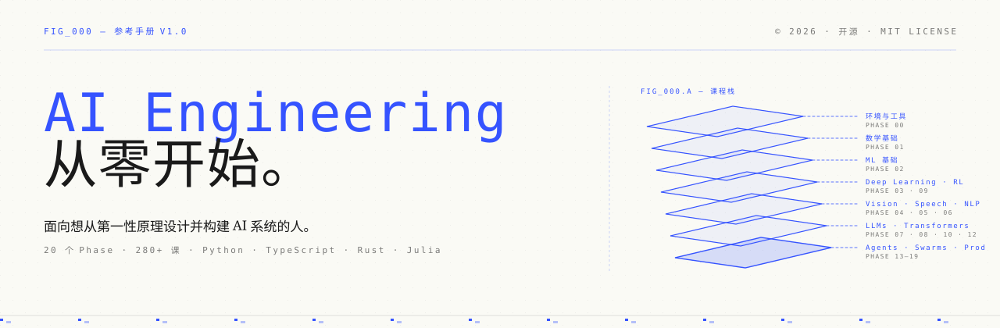
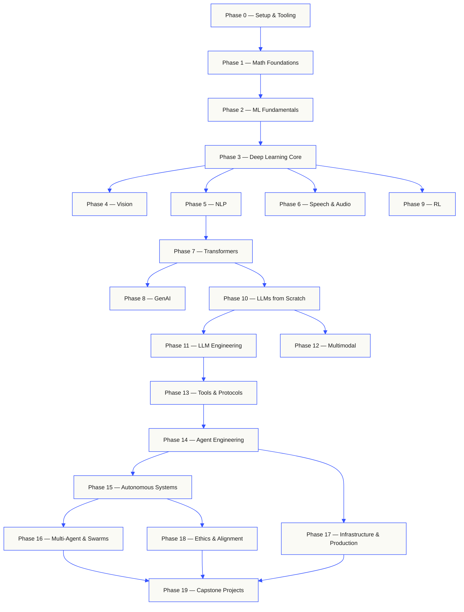
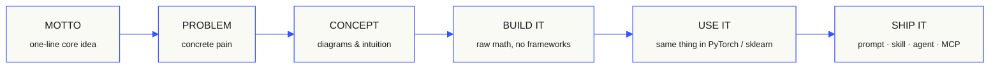
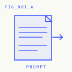
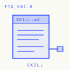
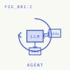
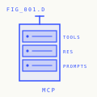

<p align="center">
  
</p>

> Fork 自 [rohitg00/ai-engineering-from-scratch](https://github.com/rohitg00/ai-engineering-from-scratch)。

<p align="center">
  <a href="LICENSE"></a>
  <a href="ROADMAP.md"></a>
  <a href="#contents"></a>
  <a href="https://github.com/rohitg00/ai-engineering-from-scratch/stargazers"></a>
  <a href="https://aiengineeringfromscratch.com"></a>
</p>

```
░░░▒▒▒░░░▒▒▒░░░▒▒▒░░░▒▒▒░░░▒▒▒░░░▒▒▒░░░▒▒▒░░░▒▒▒░░░▒▒▒░░░▒▒▒░░░▒▒▒░░░▒▒▒░░░▒▒▒░░░▒▒▒░░░▒▒▒
```

> **84% 的学生已经在使用 AI 工具。只有 18% 认为自己已准备好以
> 专业方式使用它们。** 这套课程正是为了弥合这道差距。
>
> 435 节课。20 个 Phase。约 320 小时。Python、TypeScript、Rust、Julia。每节课都会产出
> 一个可复用 artifact：prompt、skill、agent、MCP server。免费、开源、MIT。
>
> 你不只是学习 AI。你会亲手构建它。端到端。从零开始。

## 运作方式

大多数 AI 资料都是零散教学。这里一篇 paper，那里一篇 fine-tuning 文章，
别处又有一个炫目的 agent demo。这些碎片很少能真正串起来。你能交付一个 chatbot，却无法
解释它的 loss curve。你把一个 function 接到 agent 上，却说不清在调用它的 model 内部，
attention 究竟在做什么。

这套课程就是主干。20 个 Phase，435 节课，四门语言：Python、TypeScript、
Rust、Julia。一端是 linear algebra，另一端是 autonomous swarms。每个 algorithm
都会先从原始数学手写构建。Backprop。Tokenizer。Attention。Agent loop。等到
PyTorch 出场时，你已经知道它在底层做什么。

每节课都遵循同一个循环：阅读问题，推导数学，编写代码，运行测试，保留 artifact。
没有五分钟视频，没有复制粘贴式部署，也没有手把手托管。免费、开源，并且可以在你自己的笔记本电脑上运行。

```
░░░▒▒▒░░░▒▒▒░░░▒▒▒░░░▒▒▒░░░▒▒▒░░░▒▒▒░░░▒▒▒░░░▒▒▒░░░▒▒▒░░░▒▒▒░░░▒▒▒░░░▒▒▒░░░▒▒▒░░░▒▒▒░░░▒▒▒
```

## 课程结构

二十个 Phase 层层递进。Math 是地基。Agents 和 production 是屋顶。
如果你已经掌握底层内容，可以向后跳，但不要跳过之后又疑惑为什么顶层的东西会出问题。



```
░░░▒▒▒░░░▒▒▒░░░▒▒▒░░░▒▒▒░░░▒▒▒░░░▒▒▒░░░▒▒▒░░░▒▒▒░░░▒▒▒░░░▒▒▒░░░▒▒▒░░░▒▒▒░░░▒▒▒░░░▒▒▒░░░▒▒▒
```

## 一节课的结构

每节课都位于自己的文件夹中，整个课程保持相同结构：

```
phases/<NN>-<phase-name>/<NN>-<lesson-name>/
├── code/      runnable implementations (Python, TypeScript, Rust, Julia)
├── docs/
│   └── en.md  lesson narrative
└── outputs/   prompts, skills, agents, or MCP servers this lesson produces
```

每节课遵循六个节拍。*Build It / Use It* 的拆分是主干 —— 你先从零实现
algorithm，然后再用 production library 运行同一件事。你能理解 framework
在做什么，因为你已经亲手写过一个更小的版本。



## 开始学习

三种入口。选择一种。

**选项 A — 阅读。** 打开
[aiengineeringfromscratch.com](https://aiengineeringfromscratch.com) 上任意已完成课程，或在
[目录](#contents) 下展开一个 Phase。无需配置，无需 clone。

**选项 B — clone 并运行。**

```bash
git clone https://github.com/cluster1900/ai-engineering-from-scratch-zh.git
cd ai-engineering-from-scratch-zh
python phases/01-math-foundations/01-linear-algebra-intuition/code/vectors.py
```

**选项 C — 找到你的水平 *(推荐)*。** 智能跳转到合适位置。在 Claude、Cursor、Codex、OpenClaw、Hermes，或任何已安装课程 skills 的 agent 中：

```bash
/find-your-level
```

十个问题。把你的知识水平映射到起始 Phase，并生成带小时估算的个性化路径。
每个 Phase 结束后：

```bash
/check-understanding 3        # quiz yourself on phase 3
ls phases/03-deep-learning-core/05-loss-functions/outputs/
# ├── prompt-loss-function-selector.md
# └── prompt-loss-debugger.md
```

### 前置要求

- 你会写代码（任何语言都可以；Python 会有帮助）。
- 你想理解 AI **到底如何工作**，而不只是调用 APIs。

### 内置 agent skills（Claude、Cursor、Codex、OpenClaw、Hermes）

| Skill | 作用 |
|---|---|
| [`/find-your-level`](.agents/skills/find-your-level/SKILL.md) | 十题分级测验。将你的知识映射到起始 Phase，并生成带小时估算的个性化路径。 |
| [`/check-understanding <phase>`](.agents/skills/check-understanding/SKILL.md) | 按 Phase 进行测验，共八题，提供反馈和需要复习的具体课程。 |

```
░░░▒▒▒░░░▒▒▒░░░▒▒▒░░░▒▒▒░░░▒▒▒░░░▒▒▒░░░▒▒▒░░░▒▒▒░░░▒▒▒░░░▒▒▒░░░▒▒▒░░░▒▒▒░░░▒▒▒░░░▒▒▒░░░▒▒▒
```

## 每节课都会交付成果

其他课程通常以 *“恭喜，你学会了 X。”* 结束。这里的每节课都会以一个
你可以安装或粘贴到日常工作流中的 **可复用工具** 结束。

<table>
<tr>
<th align="left" width="25%"><br/><sub>FIG_001 · A</sub><br/><b>提示词</b></th>
<th align="left" width="25%"><br/><sub>FIG_001 · B</sub><br/><b>技能</b></th>
<th align="left" width="25%"><br/><sub>FIG_001 · C</sub><br/><b>智能体</b></th>
<th align="left" width="25%"><br/><sub>FIG_001 · D</sub><br/><b>MCP 服务器</b></th>
</tr>
<tr>
<td valign="top">粘贴到任何 AI assistant 中，针对一个狭窄任务获得专家级帮助。</td>
<td valign="top">放入 Claude、Cursor、Codex、OpenClaw、Hermes，或任何读取 <code>SKILL.md</code> 的 agent。</td>
<td valign="top">部署为 autonomous workers —— 你已在 Phase 14 中亲手写过 loop。</td>
<td valign="top">接入任何 MCP-compatible client。在 Phase 13 中端到端构建。</td>
</tr>
</table>

> 用 `python3 scripts/install_skills.py` 一次性安装全部内容。是真工具，不是作业。
> 完成整套课程后，你会拥有一个包含 435 个 artifacts 的作品集，并且真正理解它们，
> 因为它们都是你亲手构建的。

### FIG_002 · 一个完整示例

Phase 14，第 1 课：agent loop。约 120 行纯 Python，无依赖。

<table>
<tr>
<td valign="top" width="50%">

**`code/agent_loop.py`** &nbsp; <sub><i>build it</i></sub>

```python
def run(query, tools):
    history = [user(query)]
    for step in range(MAX_STEPS):
        msg = llm(history)
        if msg.tool_calls:
            for call in msg.tool_calls:
                result = tools[call.name](**call.args)
                history.append(tool_result(call.id, result))
            continue
        return msg.content
    raise StepLimitExceeded
```

</td>
<td valign="top" width="50%">

**`outputs/skill-agent-loop.md`** &nbsp; <sub><i>ship it</i></sub>

```markdown
---
name: agent-loop
description: ReAct-style loop for any tool list
phase: 14
lesson: 01
---

Implement a minimal agent loop that...
```

**`outputs/prompt-debug-agent.md`**

```markdown
You are an agent debugger. Given the trace
of an agent run, identify the step where
the agent went wrong and explain why...
```

</td>
</tr>
</table>

```
░░░▒▒▒░░░▒▒▒░░░▒▒▒░░░▒▒▒░░░▒▒▒░░░▒▒▒░░░▒▒▒░░░▒▒▒░░░▒▒▒░░░▒▒▒░░░▒▒▒░░░▒▒▒░░░▒▒▒░░░▒▒▒░░░▒▒▒
```

<a id="contents"></a>

## 目录

二十个 Phase。点击任意 Phase 展开其课程列表。

<a id="phase-0"></a>
### Phase 0: Setup & Tooling `12 lessons`
> 为后续所有内容准备好你的环境。

| # | 课程 | 类型 | 语言 |
|:---:|--------|:----:|------|
| 01 | [Dev Environment](phases/00-setup-and-tooling/01-dev-environment/) | 构建 | Python |
| 02 | [Git & Collaboration](phases/00-setup-and-tooling/02-git-and-collaboration/) | 学习 | — |
| 03 | [GPU Setup & Cloud](phases/00-setup-and-tooling/03-gpu-setup-and-cloud/) | 构建 | Python |
| 04 | [APIs & Keys](phases/00-setup-and-tooling/04-apis-and-keys/) | 构建 | Python |
| 05 | [Jupyter Notebooks](phases/00-setup-and-tooling/05-jupyter-notebooks/) | 构建 | Python |
| 06 | [Python Environments](phases/00-setup-and-tooling/06-python-environments/) | 构建 | Shell |
| 07 | [Docker for AI](phases/00-setup-and-tooling/07-docker-for-ai/) | 构建 | Docker |
| 08 | [Editor Setup](phases/00-setup-and-tooling/08-editor-setup/) | 构建 | — |
| 09 | [Data Management](phases/00-setup-and-tooling/09-data-management/) | 构建 | Python |
| 10 | [Terminal & Shell](phases/00-setup-and-tooling/10-terminal-and-shell/) | 学习 | — |
| 11 | [Linux for AI](phases/00-setup-and-tooling/11-linux-for-ai/) | 学习 | — |
| 12 | [Debugging & Profiling](phases/00-setup-and-tooling/12-debugging-and-profiling/) | 构建 | Python |

<details id="phase-1">
<summary><b>Phase 1 — Math Foundations</b> &nbsp;<code>22 lessons</code>&nbsp; <em>通过代码理解每个 AI algorithm 背后的直觉。</em></summary>
<br/>

| # | 课程 | 类型 | 语言 |
|:---:|--------|:----:|------|
| 01 | [Linear Algebra Intuition](phases/01-math-foundations/01-linear-algebra-intuition/) | 学习 | Python, Julia |
| 02 | [Vectors, Matrices & Operations](phases/01-math-foundations/02-vectors-matrices-operations/) | 构建 | Python, Julia |
| 03 | [Matrix Transformations & Eigenvalues](phases/01-math-foundations/03-matrix-transformations/) | 构建 | Python, Julia |
| 04 | [Calculus for ML: Derivatives & Gradients](phases/01-math-foundations/04-calculus-for-ml/) | 学习 | Python |
| 05 | [Chain Rule & Automatic Differentiation](phases/01-math-foundations/05-chain-rule-and-autodiff/) | 构建 | Python |
| 06 | [Probability & Distributions](phases/01-math-foundations/06-probability-and-distributions/) | 学习 | Python |
| 07 | [Bayes' Theorem & Statistical Thinking](phases/01-math-foundations/07-bayes-theorem/) | 构建 | Python |
| 08 | [Optimization: Gradient Descent Family](phases/01-math-foundations/08-optimization/) | 构建 | Python |
| 09 | [Information Theory: Entropy, KL Divergence](phases/01-math-foundations/09-information-theory/) | 学习 | Python |
| 10 | [Dimensionality Reduction: PCA, t-SNE, UMAP](phases/01-math-foundations/10-dimensionality-reduction/) | 构建 | Python |
| 11 | [Singular Value Decomposition](phases/01-math-foundations/11-singular-value-decomposition/) | 构建 | Python, Julia |
| 12 | [Tensor Operations](phases/01-math-foundations/12-tensor-operations/) | 构建 | Python |
| 13 | [Numerical Stability](phases/01-math-foundations/13-numerical-stability/) | 构建 | Python |
| 14 | [Norms & Distances](phases/01-math-foundations/14-norms-and-distances/) | 构建 | Python |
| 15 | [Statistics for ML](phases/01-math-foundations/15-statistics-for-ml/) | 构建 | Python |
| 16 | [Sampling Methods](phases/01-math-foundations/16-sampling-methods/) | 构建 | Python |
| 17 | [Linear Systems](phases/01-math-foundations/17-linear-systems/) | 构建 | Python |
| 18 | [Convex Optimization](phases/01-math-foundations/18-convex-optimization/) | 构建 | Python |
| 19 | [Complex Numbers for AI](phases/01-math-foundations/19-complex-numbers/) | 学习 | Python |
| 20 | [The Fourier Transform](phases/01-math-foundations/20-fourier-transform/) | 构建 | Python |
| 21 | [Graph Theory for ML](phases/01-math-foundations/21-graph-theory/) | 构建 | Python |
| 22 | [Stochastic Processes](phases/01-math-foundations/22-stochastic-processes/) | 学习 | Python |

</details>

<details id="phase-2">
<summary><b>Phase 2 — ML Fundamentals</b> &nbsp;<code>18 lessons</code>&nbsp; <em>Classical ML —— 仍然是大多数 production AI 的主干。</em></summary>
<br/>

| # | 课程 | 类型 | 语言 |
|:---:|--------|:----:|------|
| 01 | [What Is Machine Learning](phases/02-ml-fundamentals/01-what-is-machine-learning/) | 学习 | Python |
| 02 | [Linear Regression from Scratch](phases/02-ml-fundamentals/02-linear-regression/) | 构建 | Python |
| 03 | [Logistic Regression & Classification](phases/02-ml-fundamentals/03-logistic-regression/) | 构建 | Python |
| 04 | [Decision Trees & Random Forests](phases/02-ml-fundamentals/04-decision-trees/) | 构建 | Python |
| 05 | [Support Vector Machines](phases/02-ml-fundamentals/05-support-vector-machines/) | 构建 | Python |
| 06 | [KNN & Distance Metrics](phases/02-ml-fundamentals/06-knn-and-distances/) | 构建 | Python |
| 07 | [Unsupervised Learning: K-Means, DBSCAN](phases/02-ml-fundamentals/07-unsupervised-learning/) | 构建 | Python |
| 08 | [Feature Engineering & Selection](phases/02-ml-fundamentals/08-feature-engineering/) | 构建 | Python |
| 09 | [Model Evaluation: Metrics, Cross-Validation](phases/02-ml-fundamentals/09-model-evaluation/) | 构建 | Python |
| 10 | [Bias, Variance & the Learning Curve](phases/02-ml-fundamentals/10-bias-variance/) | 学习 | Python |
| 11 | [Ensemble Methods: Boosting, Bagging, Stacking](phases/02-ml-fundamentals/11-ensemble-methods/) | 构建 | Python |
| 12 | [Hyperparameter Tuning](phases/02-ml-fundamentals/12-hyperparameter-tuning/) | 构建 | Python |
| 13 | [ML Pipelines & Experiment Tracking](phases/02-ml-fundamentals/13-ml-pipelines/) | 构建 | Python |
| 14 | [Naive Bayes](phases/02-ml-fundamentals/14-naive-bayes/) | 构建 | Python |
| 15 | [Time Series Fundamentals](phases/02-ml-fundamentals/15-time-series/) | 构建 | Python |
| 16 | [Anomaly Detection](phases/02-ml-fundamentals/16-anomaly-detection/) | 构建 | Python |
| 17 | [Handling Imbalanced Data](phases/02-ml-fundamentals/17-imbalanced-data/) | 构建 | Python |
| 18 | [Feature Selection](phases/02-ml-fundamentals/18-feature-selection/) | 构建 | Python |

</details>

<details id="phase-3">
<summary><b>Phase 3 — Deep Learning Core</b> &nbsp;<code>13 lessons</code>&nbsp; <em>从 first principles 构建 Neural networks。在你构建一个之前，不使用 frameworks。</em></summary>
<br/>

| # | 课程 | 类型 | 语言 |
|:---:|--------|:----:|------|
| 01 | [The Perceptron: Where It All Started](phases/03-deep-learning-core/01-the-perceptron/) | 构建 | Python |
| 02 | [Multi-Layer Networks & Forward Pass](phases/03-deep-learning-core/02-multi-layer-networks/) | 构建 | Python |
| 03 | [Backpropagation from Scratch](phases/03-deep-learning-core/03-backpropagation/) | 构建 | Python |
| 04 | [Activation Functions: ReLU, Sigmoid, GELU & Why](phases/03-deep-learning-core/04-activation-functions/) | 构建 | Python |
| 05 | [Loss Functions: MSE, Cross-Entropy, Contrastive](phases/03-deep-learning-core/05-loss-functions/) | 构建 | Python |
| 06 | [Optimizers: SGD, Momentum, Adam, AdamW](phases/03-deep-learning-core/06-optimizers/) | 构建 | Python |
| 07 | [Regularization: Dropout, Weight Decay, BatchNorm](phases/03-deep-learning-core/07-regularization/) | 构建 | Python |
| 08 | [Weight Initialization & Training Stability](phases/03-deep-learning-core/08-weight-initialization/) | 构建 | Python |
| 09 | [Learning Rate Schedules & Warmup](phases/03-deep-learning-core/09-learning-rate-schedules/) | 构建 | Python |
| 10 | [Build Your Own Mini Framework](phases/03-deep-learning-core/10-mini-framework/) | 构建 | Python |
| 11 | [Introduction to PyTorch](phases/03-deep-learning-core/11-intro-to-pytorch/) | 构建 | Python |
| 12 | [Introduction to JAX](phases/03-deep-learning-core/12-intro-to-jax/) | 构建 | Python |
| 13 | [Debugging Neural Networks](phases/03-deep-learning-core/13-debugging-neural-networks/) | 构建 | Python |

</details>

<details id="phase-4">
<summary><b>Phase 4 — Computer Vision</b> &nbsp;<code>28 lessons</code>&nbsp; <em>从 pixels 到理解 —— image、video、3D、VLMs 和 world models。</em></summary>
<br/>

| # | 课程 | 类型 | 语言 |
|:---:|--------|:----:|------|
| 01 | [Image Fundamentals: Pixels, Channels, Color Spaces](phases/04-computer-vision/01-image-fundamentals/) | 学习 | Python |
| 02 | [Convolutions from Scratch](phases/04-computer-vision/02-convolutions-from-scratch/) | 构建 | Python |
| 03 | [CNNs: LeNet to ResNet](phases/04-computer-vision/03-cnns-lenet-to-resnet/) | 构建 | Python |
| 04 | [Image Classification](phases/04-computer-vision/04-image-classification/) | 构建 | Python |
| 05 | [Transfer Learning & Fine-Tuning](phases/04-computer-vision/05-transfer-learning/) | 构建 | Python |
| 06 | [Object Detection — YOLO from Scratch](phases/04-computer-vision/06-object-detection-yolo/) | 构建 | Python |
| 07 | [Semantic Segmentation — U-Net](phases/04-computer-vision/07-semantic-segmentation-unet/) | 构建 | Python |
| 08 | [Instance Segmentation — Mask R-CNN](phases/04-computer-vision/08-instance-segmentation-mask-rcnn/) | 构建 | Python |
| 09 | [Image Generation — GANs](phases/04-computer-vision/09-image-generation-gans/) | 构建 | Python |
| 10 | [Image Generation — Diffusion Models](phases/04-computer-vision/10-image-generation-diffusion/) | 构建 | Python |
| 11 | [Stable Diffusion — Architecture & Fine-Tuning](phases/04-computer-vision/11-stable-diffusion/) | 构建 | Python |
| 12 | [Video Understanding — Temporal Modeling](phases/04-computer-vision/12-video-understanding/) | 构建 | Python |
| 13 | [3D Vision: Point Clouds, NeRFs](phases/04-computer-vision/13-3d-vision-nerf/) | 构建 | Python |
| 14 | [Vision Transformers (ViT)](phases/04-computer-vision/14-vision-transformers/) | 构建 | Python |
| 15 | [Real-Time Vision: Edge Deployment](phases/04-computer-vision/15-real-time-edge/) | 构建 | Python |
| 16 | [Build a Complete Vision Pipeline](phases/04-computer-vision/16-vision-pipeline-capstone/) | 构建 | Python |
| 17 | [Self-Supervised Vision — SimCLR, DINO, MAE](phases/04-computer-vision/17-self-supervised-vision/) | 构建 | Python |
| 18 | [Open-Vocabulary Vision — CLIP](phases/04-computer-vision/18-open-vocab-clip/) | 构建 | Python |
| 19 | [OCR & Document Understanding](phases/04-computer-vision/19-ocr-document-understanding/) | 构建 | Python |
| 20 | [Image Retrieval & Metric Learning](phases/04-computer-vision/20-image-retrieval-metric/) | 构建 | Python |
| 21 | [Keypoint Detection & Pose Estimation](phases/04-computer-vision/21-keypoint-pose/) | 构建 | Python |
| 22 | [3D Gaussian Splatting from Scratch](phases/04-computer-vision/22-3d-gaussian-splatting/) | 构建 | Python |
| 23 | [Diffusion Transformers & Rectified Flow](phases/04-computer-vision/23-diffusion-transformers-rectified-flow/) | 构建 | Python |
| 24 | [SAM 3 & Open-Vocabulary Segmentation](phases/04-computer-vision/24-sam3-open-vocab-segmentation/) | 构建 | Python |
| 25 | [Vision-Language Models (ViT-MLP-LLM)](phases/04-computer-vision/25-vision-language-models/) | 构建 | Python |
| 26 | [Monocular Depth & Geometry Estimation](phases/04-computer-vision/26-monocular-depth/) | 构建 | Python |
| 27 | [Multi-Object Tracking & Video Memory](phases/04-computer-vision/27-multi-object-tracking/) | 构建 | Python |
| 28 | [World Models & Video Diffusion](phases/04-computer-vision/28-world-models-video-diffusion/) | 构建 | Python |

</details>

<details id="phase-5">
<summary><b>Phase 5 — NLP: Foundations to Advanced</b> &nbsp;<code>29 lessons</code>&nbsp; <em>语言是通向 intelligence 的接口。</em></summary>
<br/>

| # | 课程 | 类型 | 语言 |
|:---:|--------|:----:|------|
| 01 | [Text Processing: Tokenization, Stemming, Lemmatization](phases/05-nlp-foundations-to-advanced/01-text-processing/) | 构建 | Python |
| 02 | [Bag of Words, TF-IDF & Text Representation](phases/05-nlp-foundations-to-advanced/02-bag-of-words-tfidf/) | 构建 | Python |
| 03 | [Word Embeddings: Word2Vec from Scratch](phases/05-nlp-foundations-to-advanced/03-word-embeddings-word2vec/) | 构建 | Python |
| 04 | [GloVe, FastText & Subword Embeddings](phases/05-nlp-foundations-to-advanced/04-glove-fasttext-subword/) | 构建 | Python |
| 05 | [Sentiment Analysis](phases/05-nlp-foundations-to-advanced/05-sentiment-analysis/) | 构建 | Python |
| 06 | [Named Entity Recognition (NER)](phases/05-nlp-foundations-to-advanced/06-named-entity-recognition/) | 构建 | Python |
| 07 | [POS Tagging & Syntactic Parsing](phases/05-nlp-foundations-to-advanced/07-pos-tagging-parsing/) | 构建 | Python |
| 08 | [Text Classification — CNNs & RNNs for Text](phases/05-nlp-foundations-to-advanced/08-cnns-rnns-for-text/) | 构建 | Python |
| 09 | [Sequence-to-Sequence Models](phases/05-nlp-foundations-to-advanced/09-sequence-to-sequence/) | 构建 | Python |
| 10 | [Attention Mechanism — The Breakthrough](phases/05-nlp-foundations-to-advanced/10-attention-mechanism/) | 构建 | Python |
| 11 | [Machine Translation](phases/05-nlp-foundations-to-advanced/11-machine-translation/) | 构建 | Python |
| 12 | [Text Summarization](phases/05-nlp-foundations-to-advanced/12-text-summarization/) | 构建 | Python |
| 13 | [Question Answering Systems](phases/05-nlp-foundations-to-advanced/13-question-answering/) | 构建 | Python |
| 14 | [Information Retrieval & Search](phases/05-nlp-foundations-to-advanced/14-information-retrieval-search/) | 构建 | Python |
| 15 | [Topic Modeling: LDA, BERTopic](phases/05-nlp-foundations-to-advanced/15-topic-modeling/) | 构建 | Python |
| 16 | [Text Generation](phases/05-nlp-foundations-to-advanced/16-text-generation-pre-transformer/) | 构建 | Python |
| 17 | [Chatbots: Rule-Based to Neural](phases/05-nlp-foundations-to-advanced/17-chatbots-rule-to-neural/) | 构建 | Python |
| 18 | [Multilingual NLP](phases/05-nlp-foundations-to-advanced/18-multilingual-nlp/) | 构建 | Python |
| 19 | [Subword Tokenization: BPE, WordPiece, Unigram, SentencePiece](phases/05-nlp-foundations-to-advanced/19-subword-tokenization/) | 学习 | Python |
| 20 | [Structured Outputs & Constrained Decoding](phases/05-nlp-foundations-to-advanced/20-structured-outputs-constrained-decoding/) | 构建 | Python |
| 21 | [NLI & Textual Entailment](phases/05-nlp-foundations-to-advanced/21-nli-textual-entailment/) | 学习 | Python |
| 22 | [Embedding Models Deep Dive](phases/05-nlp-foundations-to-advanced/22-embedding-models-deep-dive/) | 学习 | Python |
| 23 | [Chunking Strategies for RAG](phases/05-nlp-foundations-to-advanced/23-chunking-strategies-rag/) | 构建 | Python |
| 24 | [Coreference Resolution](phases/05-nlp-foundations-to-advanced/24-coreference-resolution/) | 学习 | Python |
| 25 | [Entity Linking & Disambiguation](phases/05-nlp-foundations-to-advanced/25-entity-linking/) | 构建 | Python |
| 26 | [Relation Extraction & Knowledge Graph Construction](phases/05-nlp-foundations-to-advanced/26-relation-extraction-kg/) | 构建 | Python |
| 27 | [LLM Evaluation: RAGAS, DeepEval, G-Eval](phases/05-nlp-foundations-to-advanced/27-llm-evaluation-frameworks/) | 构建 | Python |
| 28 | [Long-Context Evaluation: NIAH, RULER, LongBench, MRCR](phases/05-nlp-foundations-to-advanced/28-long-context-evaluation/) | 学习 | Python |
| 29 | [Dialogue State Tracking](phases/05-nlp-foundations-to-advanced/29-dialogue-state-tracking/) | 构建 | Python |

</details>

<details id="phase-6">
<summary><b>Phase 6 — Speech & Audio</b> &nbsp;<code>17 lessons</code>&nbsp; <em>听见，理解，表达。</em></summary>
<br/>

| # | 课程 | 类型 | 语言 |
|:---:|--------|:----:|------|
| 01 | [Audio Fundamentals: Waveforms, Sampling, FFT](phases/06-speech-and-audio/01-audio-fundamentals) | 学习 | Python |
| 02 | [Spectrograms, Mel Scale & Audio Features](phases/06-speech-and-audio/02-spectrograms-mel-features) | 构建 | Python |
| 03 | [Audio Classification](phases/06-speech-and-audio/03-audio-classification) | 构建 | Python |
| 04 | [Speech Recognition (ASR)](phases/06-speech-and-audio/04-speech-recognition-asr) | 构建 | Python |
| 05 | [Whisper: Architecture & Fine-Tuning](phases/06-speech-and-audio/05-whisper-architecture-finetuning) | 构建 | Python |
| 06 | [Speaker Recognition & Verification](phases/06-speech-and-audio/06-speaker-recognition-verification) | 构建 | Python |
| 07 | [Text-to-Speech (TTS)](phases/06-speech-and-audio/07-text-to-speech) | 构建 | Python |
| 08 | [Voice Cloning & Voice Conversion](phases/06-speech-and-audio/08-voice-cloning-conversion) | 构建 | Python |
| 09 | [Music Generation](phases/06-speech-and-audio/09-music-generation) | 构建 | Python |
| 10 | [Audio-Language Models](phases/06-speech-and-audio/10-audio-language-models) | 构建 | Python |
| 11 | [Real-Time Audio Processing](phases/06-speech-and-audio/11-real-time-audio-processing) | 构建 | Python |
| 12 | [Build a Voice Assistant Pipeline](phases/06-speech-and-audio/12-voice-assistant-pipeline) | 构建 | Python |
| 13 | [Neural Audio Codecs — EnCodec, SNAC, Mimi, DAC](phases/06-speech-and-audio/13-neural-audio-codecs) | 学习 | Python |
| 14 | [Voice Activity Detection & Turn-Taking](phases/06-speech-and-audio/14-voice-activity-detection-turn-taking) | 构建 | Python |
| 15 | [Streaming Speech-to-Speech — Moshi, Hibiki](phases/06-speech-and-audio/15-streaming-speech-to-speech-moshi-hibiki) | 学习 | Python |
| 16 | [Voice Anti-Spoofing & Audio Watermarking](phases/06-speech-and-audio/16-anti-spoofing-audio-watermarking) | 构建 | Python |
| 17 | [Audio Evaluation — WER, MOS, MMAU, Leaderboards](phases/06-speech-and-audio/17-audio-evaluation-metrics) | 学习 | Python |

</details>

<details id="phase-7">
<summary><b>Phase 7 — Transformers Deep Dive</b> &nbsp;<code>16 lessons</code>&nbsp; <em>改变一切的 architecture。</em></summary>
<br/>

| # | 课程 | 类型 | 语言 |
|:---:|--------|:----:|------|
| 01 | [Why Transformers: The Problems with RNNs](phases/07-transformers-deep-dive/01-why-transformers/) | 学习 | Python |
| 02 | [Self-Attention from Scratch](phases/07-transformers-deep-dive/02-self-attention-from-scratch/) | 构建 | Python |
| 03 | [Multi-Head Attention](phases/07-transformers-deep-dive/03-multi-head-attention/) | 构建 | Python |
| 04 | [Positional Encoding: Sinusoidal, RoPE, ALiBi](phases/07-transformers-deep-dive/04-positional-encoding/) | 构建 | Python |
| 05 | [The Full Transformer: Encoder + Decoder](phases/07-transformers-deep-dive/05-full-transformer/) | 构建 | Python |
| 06 | [BERT — Masked Language Modeling](phases/07-transformers-deep-dive/06-bert-masked-language-modeling/) | 构建 | Python |
| 07 | [GPT — Causal Language Modeling](phases/07-transformers-deep-dive/07-gpt-causal-language-modeling/) | 构建 | Python |
| 08 | [T5, BART — Encoder-Decoder Models](phases/07-transformers-deep-dive/08-t5-bart-encoder-decoder/) | 学习 | Python |
| 09 | [Vision Transformers (ViT)](phases/07-transformers-deep-dive/09-vision-transformers/) | 构建 | Python |
| 10 | [Audio Transformers — Whisper Architecture](phases/07-transformers-deep-dive/10-audio-transformers-whisper/) | 学习 | Python |
| 11 | [Mixture of Experts (MoE)](phases/07-transformers-deep-dive/11-mixture-of-experts/) | 构建 | Python |
| 12 | [KV Cache, Flash Attention & Inference Optimization](phases/07-transformers-deep-dive/12-kv-cache-flash-attention/) | 构建 | Python |
| 13 | [Scaling Laws](phases/07-transformers-deep-dive/13-scaling-laws/) | 学习 | Python |
| 14 | [Build a Transformer from Scratch](phases/07-transformers-deep-dive/14-build-a-transformer-capstone/) | 构建 | Python |
| 15 | [Attention Variants — Sliding Window, Sparse, Differential](phases/07-transformers-deep-dive/15-attention-variants/) | 构建 | Python |
| 16 | [Speculative Decoding — Draft, Verify, Repeat](phases/07-transformers-deep-dive/16-speculative-decoding/) | 构建 | Python |

</details>

<details id="phase-8">
<summary><b>Phase 8 — Generative AI</b> &nbsp;<code>15 lessons</code>&nbsp; <em>创建 images、video、audio、3D，以及更多内容。</em></summary>
<br/>

| # | 课程 | 类型 | 语言 |
|:---:|--------|:----:|------|
| 01 | [Generative Models: Taxonomy & History](phases/08-generative-ai/01-generative-models-taxonomy-history/) | 学习 | Python |
| 02 | [Autoencoders & VAE](phases/08-generative-ai/02-autoencoders-vae/) | 构建 | Python |
| 03 | [GANs: Generator vs Discriminator](phases/08-generative-ai/03-gans-generator-discriminator/) | 构建 | Python |
| 04 | [Conditional GANs & Pix2Pix](phases/08-generative-ai/04-conditional-gans-pix2pix/) | 构建 | Python |
| 05 | [StyleGAN](phases/08-generative-ai/05-stylegan/) | 构建 | Python |
| 06 | [Diffusion Models — DDPM from Scratch](phases/08-generative-ai/06-diffusion-ddpm-from-scratch/) | 构建 | Python |
| 07 | [Latent Diffusion & Stable Diffusion](phases/08-generative-ai/07-latent-diffusion-stable-diffusion/) | 构建 | Python |
| 08 | [ControlNet, LoRA & Conditioning](phases/08-generative-ai/08-controlnet-lora-conditioning/) | 构建 | Python |
| 09 | [Inpainting, Outpainting & Editing](phases/08-generative-ai/09-inpainting-outpainting-editing/) | 构建 | Python |
| 10 | [Video Generation](phases/08-generative-ai/10-video-generation/) | 构建 | Python |
| 11 | [Audio Generation](phases/08-generative-ai/11-audio-generation/) | 构建 | Python |
| 12 | [3D Generation](phases/08-generative-ai/12-3d-generation/) | 构建 | Python |
| 13 | [Flow Matching & Rectified Flows](phases/08-generative-ai/13-flow-matching-rectified-flows/) | 构建 | Python |
| 14 | [Evaluation: FID, CLIP Score](phases/08-generative-ai/14-evaluation-fid-clip-score/) | 构建 | Python |
| 19 | [Visual Autoregressive Modeling (VAR): Next-Scale Prediction](phases/08-generative-ai/19-visual-autoregressive-var/) | 构建 | Python |

</details>

<details id="phase-9">
<summary><b>Phase 9 — Reinforcement Learning</b> &nbsp;<code>12 lessons</code>&nbsp; <em>RLHF 和 game-playing AI 的基础。</em></summary>
<br/>

| # | 课程 | 类型 | 语言 |
|:---:|--------|:----:|------|
| 01 | [MDPs, States, Actions & Rewards](phases/09-reinforcement-learning/01-mdps-states-actions-rewards/) | 学习 | Python |
| 02 | [Dynamic Programming](phases/09-reinforcement-learning/02-dynamic-programming/) | 构建 | Python |
| 03 | [Monte Carlo Methods](phases/09-reinforcement-learning/03-monte-carlo-methods/) | 构建 | Python |
| 04 | [Q-Learning, SARSA](phases/09-reinforcement-learning/04-q-learning-sarsa/) | 构建 | Python |
| 05 | [Deep Q-Networks (DQN)](phases/09-reinforcement-learning/05-dqn/) | 构建 | Python |
| 06 | [Policy Gradients — REINFORCE](phases/09-reinforcement-learning/06-policy-gradients-reinforce/) | 构建 | Python |
| 07 | [Actor-Critic — A2C, A3C](phases/09-reinforcement-learning/07-actor-critic-a2c-a3c/) | 构建 | Python |
| 08 | [PPO](phases/09-reinforcement-learning/08-ppo/) | 构建 | Python |
| 09 | [Reward Modeling & RLHF](phases/09-reinforcement-learning/09-reward-modeling-rlhf/) | 构建 | Python |
| 10 | [Multi-Agent RL](phases/09-reinforcement-learning/10-multi-agent-rl/) | 构建 | Python |
| 11 | [Sim-to-Real Transfer](phases/09-reinforcement-learning/11-sim-to-real-transfer/) | 构建 | Python |
| 12 | [RL for Games](phases/09-reinforcement-learning/12-rl-for-games/) | 构建 | Python |

</details>

<details id="phase-10">
<summary><b>Phase 10 — LLMs from Scratch</b> &nbsp;<code>24 lessons</code>&nbsp; <em>构建、训练并理解 large language models。</em></summary>
<br/>

| # | 课程 | 类型 | 语言 |
|:---:|--------|:----:|------|
| 01 | [Tokenizers: BPE, WordPiece, SentencePiece](phases/10-llms-from-scratch/01-tokenizers/) | 构建 | Python, Rust |
| 02 | [Building a Tokenizer from Scratch](phases/10-llms-from-scratch/02-building-a-tokenizer/) | 构建 | Python |
| 03 | [Data Pipelines for Pre-Training](phases/10-llms-from-scratch/03-data-pipelines/) | 构建 | Python |
| 04 | [Pre-Training a Mini GPT (124M)](phases/10-llms-from-scratch/04-pre-training-mini-gpt/) | 构建 | Python |
| 05 | [Distributed Training, FSDP, DeepSpeed](phases/10-llms-from-scratch/05-scaling-distributed/) | 构建 | Python |
| 06 | [Instruction Tuning — SFT](phases/10-llms-from-scratch/06-instruction-tuning-sft/) | 构建 | Python |
| 07 | [RLHF — Reward Model + PPO](phases/10-llms-from-scratch/07-rlhf/) | 构建 | Python |
| 08 | [DPO — Direct Preference Optimization](phases/10-llms-from-scratch/08-dpo/) | 构建 | Python |
| 09 | [Constitutional AI & Self-Improvement](phases/10-llms-from-scratch/09-constitutional-ai-self-improvement/) | 构建 | Python |
| 10 | [Evaluation — Benchmarks, Evals](phases/10-llms-from-scratch/10-evaluation/) | 构建 | Python |
| 11 | [Quantization: INT8, GPTQ, AWQ, GGUF](phases/10-llms-from-scratch/11-quantization/) | 构建 | Python |
| 12 | [Inference Optimization](phases/10-llms-from-scratch/12-inference-optimization/) | 构建 | Python |
| 13 | [Building a Complete LLM Pipeline](phases/10-llms-from-scratch/13-building-complete-llm-pipeline/) | 构建 | Python |
| 14 | [Open Models: Architecture Walkthroughs](phases/10-llms-from-scratch/14-open-models-architecture-walkthroughs/) | 学习 | Python |
| 15 | [Speculative Decoding and EAGLE-3](phases/10-llms-from-scratch/15-speculative-decoding-eagle3/) | 构建 | Python |
| 16 | [Differential Attention (V2)](phases/10-llms-from-scratch/16-differential-attention-v2/) | 构建 | Python |
| 17 | [Native Sparse Attention (DeepSeek NSA)](phases/10-llms-from-scratch/17-native-sparse-attention/) | 构建 | Python |
| 18 | [Multi-Token Prediction (MTP)](phases/10-llms-from-scratch/18-multi-token-prediction/) | 构建 | Python |
| 19 | [DualPipe Parallelism](phases/10-llms-from-scratch/19-dualpipe-parallelism/) | 学习 | Python |
| 20 | [DeepSeek-V3 Architecture Walkthrough](phases/10-llms-from-scratch/20-deepseek-v3-walkthrough/) | 学习 | Python |
| 21 | [Jamba — Hybrid SSM-Transformer](phases/10-llms-from-scratch/21-jamba-hybrid-ssm-transformer/) | 学习 | Python |
| 22 | [Async and Hogwild! Inference](phases/10-llms-from-scratch/22-async-hogwild-inference/) | 构建 | Python |
| 25 | [Speculative Decoding and EAGLE](phases/10-llms-from-scratch/25-speculative-decoding/) | 构建 | Python |
| 34 | [Gradient Checkpointing and Activation Recomputation](phases/10-llms-from-scratch/34-gradient-checkpointing/) | 构建 | Python |

</details>

<details id="phase-11">
<summary><b>Phase 11 — LLM Engineering</b> &nbsp;<code>17 lessons</code>&nbsp; <em>把 LLMs 用到 production 中。</em></summary>
<br/>

| # | 课程 | 类型 | 语言 |
|:---:|--------|:----:|------|
| 01 | [Prompt Engineering: Techniques & Patterns](phases/11-llm-engineering/01-prompt-engineering/) | 构建 | Python |
| 02 | [Few-Shot, CoT, Tree-of-Thought](phases/11-llm-engineering/02-few-shot-cot/) | 构建 | Python |
| 03 | [Structured Outputs](phases/11-llm-engineering/03-structured-outputs/) | 构建 | Python |
| 04 | [Embeddings & Vector Representations](phases/11-llm-engineering/04-embeddings/) | 构建 | Python |
| 05 | [Context Engineering](phases/11-llm-engineering/05-context-engineering/) | 构建 | Python |
| 06 | [RAG: Retrieval-Augmented Generation](phases/11-llm-engineering/06-rag/) | 构建 | Python |
| 07 | [Advanced RAG: Chunking, Reranking](phases/11-llm-engineering/07-advanced-rag/) | 构建 | Python |
| 08 | [Fine-Tuning with LoRA & QLoRA](phases/11-llm-engineering/08-fine-tuning-lora/) | 构建 | Python |
| 09 | [Function Calling & Tool Use](phases/11-llm-engineering/09-function-calling/) | 构建 | Python |
| 10 | [Evaluation & Testing](phases/11-llm-engineering/10-evaluation/) | 构建 | Python |
| 11 | [Caching, Rate Limiting & Cost](phases/11-llm-engineering/11-caching-cost/) | 构建 | Python |
| 12 | [Guardrails & Safety](phases/11-llm-engineering/12-guardrails/) | 构建 | Python |
| 13 | [Building a Production LLM App](phases/11-llm-engineering/13-production-app/) | 构建 | Python |
| 14 | [Model Context Protocol (MCP)](phases/11-llm-engineering/14-model-context-protocol/) | 构建 | Python |
| 15 | [Prompt Caching & Context Caching](phases/11-llm-engineering/15-prompt-caching/) | 构建 | Python |
| 16 | [LangGraph: State Machines for Agents](phases/11-llm-engineering/16-langgraph-state-machines/) | 构建 | Python |
| 17 | [Agent Framework Tradeoffs](phases/11-llm-engineering/17-agent-framework-tradeoffs/) | 学习 | Python |

</details>

<details id="phase-12">
<summary><b>Phase 12 — Multimodal AI</b> &nbsp;<code>25 lessons</code>&nbsp; <em>跨 modalities 观看、聆听、阅读和推理 —— 从 ViT patches 到 computer-use agents。</em></summary>
<br/>

| # | 课程 | 类型 | 语言 |
|:---:|--------|:----:|------|
| 01 | [Vision Transformers and the Patch-Token Primitive](phases/12-multimodal-ai/01-vision-transformer-patch-tokens/) | 学习 | Python |
| 02 | [CLIP and Contrastive Vision-Language Pretraining](phases/12-multimodal-ai/02-clip-contrastive-pretraining/) | 构建 | Python |
| 03 | [BLIP-2 Q-Former as Modality Bridge](phases/12-multimodal-ai/03-blip2-qformer-bridge/) | 构建 | Python |
| 04 | [Flamingo and Gated Cross-Attention](phases/12-multimodal-ai/04-flamingo-gated-cross-attention/) | 学习 | Python |
| 05 | [LLaVA and Visual Instruction Tuning](phases/12-multimodal-ai/05-llava-visual-instruction-tuning/) | 构建 | Python |
| 06 | [Any-Resolution Vision — Patch-n'-Pack and NaFlex](phases/12-multimodal-ai/06-any-resolution-patch-n-pack/) | 构建 | Python |
| 07 | [Open-Weight VLM Recipes: What Actually Matters](phases/12-multimodal-ai/07-open-weight-vlm-recipes/) | 学习 | Python |
| 08 | [LLaVA-OneVision: Single, Multi, Video](phases/12-multimodal-ai/08-llava-onevision-single-multi-video/) | 构建 | Python |
| 09 | [Qwen-VL Family and Dynamic-FPS Video](phases/12-multimodal-ai/09-qwen-vl-family-dynamic-fps/) | 学习 | Python |
| 10 | [InternVL3 Native Multimodal Pretraining](phases/12-multimodal-ai/10-internvl3-native-multimodal/) | 学习 | Python |
| 11 | [Chameleon Early-Fusion Token-Only](phases/12-multimodal-ai/11-chameleon-early-fusion-tokens/) | 构建 | Python |
| 12 | [Emu3 Next-Token Prediction for Generation](phases/12-multimodal-ai/12-emu3-next-token-for-generation/) | 学习 | Python |
| 13 | [Transfusion Autoregressive + Diffusion](phases/12-multimodal-ai/13-transfusion-autoregressive-diffusion/) | 构建 | Python |
| 14 | [Show-o Discrete-Diffusion Unified](phases/12-multimodal-ai/14-show-o-discrete-diffusion-unified/) | 学习 | Python |
| 15 | [Janus-Pro Decoupled Encoders](phases/12-multimodal-ai/15-janus-pro-decoupled-encoders/) | 构建 | Python |
| 16 | [MIO Any-to-Any Streaming](phases/12-multimodal-ai/16-mio-any-to-any-streaming/) | 学习 | Python |
| 17 | [Video-Language Temporal Grounding](phases/12-multimodal-ai/17-video-language-temporal-grounding/) | 构建 | Python |
| 18 | [Long-Video at Million-Token Context](phases/12-multimodal-ai/18-long-video-million-token/) | 构建 | Python |
| 19 | [Audio-Language Models: Whisper to AF3](phases/12-multimodal-ai/19-audio-language-whisper-to-af3/) | 构建 | Python |
| 20 | [Omni Models: Thinker-Talker Streaming](phases/12-multimodal-ai/20-omni-models-thinker-talker/) | 构建 | Python |
| 21 | [Embodied VLAs: RT-2, OpenVLA, π0, GR00T](phases/12-multimodal-ai/21-embodied-vlas-openvla-pi0-groot/) | 学习 | Python |
| 22 | [Document and Diagram Understanding](phases/12-multimodal-ai/22-document-diagram-understanding/) | 构建 | Python |
| 23 | [ColPali Vision-Native Document RAG](phases/12-multimodal-ai/23-colpali-vision-native-rag/) | 构建 | Python |
| 24 | [Multimodal RAG and Cross-Modal Retrieval](phases/12-multimodal-ai/24-multimodal-rag-cross-modal/) | 构建 | Python |
| 25 | [Multimodal Agents and Computer-Use (Capstone)](phases/12-multimodal-ai/25-multimodal-agents-computer-use/) | 构建 | Python |

</details>

<details id="phase-13">
<summary><b>Phase 13 — Tools & Protocols</b> &nbsp;<code>23 lessons</code>&nbsp; <em>AI 与真实世界之间的接口。</em></summary>
<br/>

| # | 课程 | 类型 | 语言 |
|:---:|--------|:----:|------|
| 01 | [The Tool Interface](phases/13-tools-and-protocols/01-the-tool-interface/) | 学习 | Python |
| 02 | [Function Calling Deep Dive](phases/13-tools-and-protocols/02-function-calling-deep-dive/) | 构建 | Python |
| 03 | [Parallel and Streaming Tool Calls](phases/13-tools-and-protocols/03-parallel-and-streaming-tool-calls/) | 构建 | Python |
| 04 | [Structured Output](phases/13-tools-and-protocols/04-structured-output/) | 构建 | Python |
| 05 | [Tool Schema Design](phases/13-tools-and-protocols/05-tool-schema-design/) | 学习 | Python |
| 06 | [MCP Fundamentals](phases/13-tools-and-protocols/06-mcp-fundamentals/) | 学习 | Python |
| 07 | [Building an MCP Server](phases/13-tools-and-protocols/07-building-an-mcp-server/) | 构建 | Python |
| 08 | [Building an MCP Client](phases/13-tools-and-protocols/08-building-an-mcp-client/) | 构建 | Python |
| 09 | [MCP Transports](phases/13-tools-and-protocols/09-mcp-transports/) | 学习 | Python |
| 10 | [MCP Resources and Prompts](phases/13-tools-and-protocols/10-mcp-resources-and-prompts/) | 构建 | Python |
| 11 | [MCP Sampling](phases/13-tools-and-protocols/11-mcp-sampling/) | 构建 | Python |
| 12 | [MCP Roots and Elicitation](phases/13-tools-and-protocols/12-mcp-roots-and-elicitation/) | 构建 | Python |
| 13 | [MCP Async Tasks](phases/13-tools-and-protocols/13-mcp-async-tasks/) | 构建 | Python |
| 14 | [MCP Apps](phases/13-tools-and-protocols/14-mcp-apps/) | 构建 | Python |
| 15 | [MCP Security I — Tool Poisoning](phases/13-tools-and-protocols/15-mcp-security-tool-poisoning/) | 学习 | Python |
| 16 | [MCP Security II — OAuth 2.1](phases/13-tools-and-protocols/16-mcp-security-oauth-2-1/) | 构建 | Python |
| 17 | [MCP Gateways and Registries](phases/13-tools-and-protocols/17-mcp-gateways-and-registries/) | 学习 | Python |
| 18 | [MCP Auth in Production — DCR + JWKS on iii](phases/13-tools-and-protocols/18-mcp-auth-production/) | 构建 | Python |
| 19 | [A2A Protocol](phases/13-tools-and-protocols/19-a2a-protocol/) | 构建 | Python |
| 20 | [OpenTelemetry GenAI](phases/13-tools-and-protocols/20-opentelemetry-genai/) | 构建 | Python |
| 21 | [LLM Routing Layer](phases/13-tools-and-protocols/21-llm-routing-layer/) | 学习 | Python |
| 22 | [Skills and Agent SDKs](phases/13-tools-and-protocols/22-skills-and-agent-sdks/) | 学习 | Python |
| 23 | [Capstone — Tool Ecosystem](phases/13-tools-and-protocols/23-capstone-tool-ecosystem/) | 构建 | Python |

</details>

<details id="phase-14">
<summary><b>Phase 14 — Agent Engineering</b> &nbsp;<code>42 lessons</code>&nbsp; <em>从 first principles 构建 agents —— loop、memory、planning、frameworks、benchmarks、production、workbench。</em></summary>
<br/>

| # | 课程 | 类型 | 语言 |
|:---:|--------|:----:|------|
| 01 | [The Agent Loop](phases/14-agent-engineering/01-the-agent-loop/) | 构建 | Python |
| 02 | [ReWOO and Plan-and-Execute](phases/14-agent-engineering/02-rewoo-plan-and-execute/) | 构建 | Python |
| 03 | [Reflexion and Verbal Reinforcement Learning](phases/14-agent-engineering/03-reflexion-verbal-rl/) | 构建 | Python |
| 04 | [Tree of Thoughts and LATS](phases/14-agent-engineering/04-tree-of-thoughts-lats/) | 构建 | Python |
| 05 | [Self-Refine and CRITIC](phases/14-agent-engineering/05-self-refine-and-critic/) | 构建 | Python |
| 06 | [Tool Use and Function Calling](phases/14-agent-engineering/06-tool-use-and-function-calling/) | 构建 | Python |
| 07 | [Memory — Virtual Context and MemGPT](phases/14-agent-engineering/07-memory-virtual-context-memgpt/) | 构建 | Python |
| 08 | [Memory Blocks and Sleep-Time Compute](phases/14-agent-engineering/08-memory-blocks-sleep-time-compute/) | 构建 | Python |
| 09 | [Hybrid Memory — Mem0 Vector + Graph + KV](phases/14-agent-engineering/09-hybrid-memory-mem0/) | 构建 | Python |
| 10 | [Skill Libraries and Lifelong Learning — Voyager](phases/14-agent-engineering/10-skill-libraries-voyager/) | 构建 | Python |
| 11 | [Planning with HTN and Evolutionary Search](phases/14-agent-engineering/11-planning-htn-and-evolutionary/) | 构建 | Python |
| 12 | [Anthropic's Workflow Patterns](phases/14-agent-engineering/12-anthropic-workflow-patterns/) | 构建 | Python |
| 13 | [LangGraph — Stateful Graphs and Durable Execution](phases/14-agent-engineering/13-langgraph-stateful-graphs/) | 构建 | Python |
| 14 | [AutoGen v0.4 — Actor Model](phases/14-agent-engineering/14-autogen-actor-model/) | 构建 | Python |
| 15 | [CrewAI — Role-Based Crews and Flows](phases/14-agent-engineering/15-crewai-role-based-crews/) | 构建 | Python |
| 16 | [OpenAI Agents SDK — Handoffs, Guardrails, Tracing](phases/14-agent-engineering/16-openai-agents-sdk/) | 构建 | Python |
| 17 | [Claude Agent SDK — Subagents and Session Store](phases/14-agent-engineering/17-claude-agent-sdk/) | 构建 | Python |
| 18 | [Agno and Mastra — Production Runtimes](phases/14-agent-engineering/18-agno-and-mastra-runtimes/) | 学习 | Python |
| 19 | [Benchmarks — SWE-bench, GAIA, AgentBench](phases/14-agent-engineering/19-benchmarks-swebench-gaia/) | 学习 | Python |
| 20 | [Benchmarks — WebArena and OSWorld](phases/14-agent-engineering/20-benchmarks-webarena-osworld/) | 学习 | Python |
| 21 | [Computer Use — Claude, OpenAI CUA, Gemini](phases/14-agent-engineering/21-computer-use-agents/) | 构建 | Python |
| 22 | [Voice Agents — Pipecat and LiveKit](phases/14-agent-engineering/22-voice-agents-pipecat-livekit/) | 构建 | Python |
| 23 | [OpenTelemetry GenAI Semantic Conventions](phases/14-agent-engineering/23-otel-genai-conventions/) | 构建 | Python |
| 24 | [Agent Observability — Langfuse, Phoenix, Opik](phases/14-agent-engineering/24-agent-observability-platforms/) | 学习 | Python |
| 25 | [Multi-Agent Debate and Collaboration](phases/14-agent-engineering/25-multi-agent-debate/) | 构建 | Python |
| 26 | [Failure Modes — Why Agents Break](phases/14-agent-engineering/26-failure-modes-agentic/) | 构建 | Python |
| 27 | [Prompt Injection and the PVE Defense](phases/14-agent-engineering/27-prompt-injection-defense/) | 构建 | Python |
| 28 | [Orchestration Patterns — Supervisor, Swarm, Hierarchical](phases/14-agent-engineering/28-orchestration-patterns/) | 构建 | Python |
| 29 | [Production Runtimes — Queue, Event, Cron](phases/14-agent-engineering/29-production-runtimes/) | 学习 | Python |
| 30 | [Eval-Driven Agent Development](phases/14-agent-engineering/30-eval-driven-agent-development/) | 构建 | Python |
| 31 | [Agent Workbench: Why Capable Models Still Fail](phases/14-agent-engineering/31-agent-workbench-why-models-fail/) | 学习 | Python |
| 32 | [The Minimal Agent Workbench](phases/14-agent-engineering/32-minimal-agent-workbench/) | 构建 | Python |
| 33 | [Agent Instructions as Executable Constraints](phases/14-agent-engineering/33-instructions-as-executable-constraints/) | 构建 | Python |
| 34 | [Repo Memory and Durable State](phases/14-agent-engineering/34-repo-memory-and-state/) | 构建 | Python |
| 35 | [Initialization Scripts for Agents](phases/14-agent-engineering/35-initialization-scripts/) | 构建 | Python |
| 36 | [Scope Contracts and Task Boundaries](phases/14-agent-engineering/36-scope-contracts/) | 构建 | Python |
| 37 | [Runtime Feedback Loops](phases/14-agent-engineering/37-runtime-feedback-loops/) | 构建 | Python |
| 38 | [Verification Gates](phases/14-agent-engineering/38-verification-gates/) | 构建 | Python |
| 39 | [Reviewer Agent: Separate Builder from Marker](phases/14-agent-engineering/39-reviewer-agent/) | 构建 | Python |
| 40 | [Multi-Session Handoff](phases/14-agent-engineering/40-multi-session-handoff/) | 构建 | Python |
| 41 | [The Workbench on a Real Repo](phases/14-agent-engineering/41-workbench-for-real-repos/) | 构建 | Python |
| 42 | [Capstone: Ship a Reusable Agent Workbench Pack](phases/14-agent-engineering/42-agent-workbench-capstone/) | 构建 | Python |

每个 Phase 14 workbench 课程（31-42）都会交付一个 `mission.md`，在 agent 打开完整课程 docs 之前为它提供任务 brief。

</details>

<details id="phase-15">
<summary><b>Phase 15 — Autonomous Systems</b> &nbsp;<code>22 lessons</code>&nbsp; <em>Long-horizon agents、self-improvement，以及 2026 safety stack。</em></summary>
<br/>

| # | 课程 | 类型 | 语言 |
|:---:|--------|:----:|------|
| 01 | [From Chatbots to Long-Horizon Agents (METR)](phases/15-autonomous-systems/01-long-horizon-agents/) | 学习 | Python |
| 02 | [STaR, V-STaR, Quiet-STaR: Self-Taught Reasoning](phases/15-autonomous-systems/02-star-family-reasoning/) | 学习 | Python |
| 03 | [AlphaEvolve: Evolutionary Coding Agents](phases/15-autonomous-systems/03-alphaevolve-evolutionary-coding/) | 学习 | Python |
| 04 | [Darwin Gödel Machine: Self-Modifying Agents](phases/15-autonomous-systems/04-darwin-godel-machine/) | 学习 | Python |
| 05 | [AI Scientist v2: Workshop-Level Research](phases/15-autonomous-systems/05-ai-scientist-v2/) | 学习 | Python |
| 06 | [Automated Alignment Research (Anthropic AAR)](phases/15-autonomous-systems/06-automated-alignment-research/) | 学习 | Python |
| 07 | [Recursive Self-Improvement: Capability vs Alignment](phases/15-autonomous-systems/07-recursive-self-improvement/) | 学习 | Python |
| 08 | [Bounded Self-Improvement Designs](phases/15-autonomous-systems/08-bounded-self-improvement/) | 学习 | Python |
| 09 | [Autonomous Coding Agent Landscape (SWE-bench, CodeAct)](phases/15-autonomous-systems/09-coding-agent-landscape/) | 学习 | Python |
| 10 | [Claude Code Permission Modes and Auto Mode](phases/15-autonomous-systems/10-claude-code-permission-modes/) | 学习 | Python |
| 11 | [Browser Agents and Indirect Prompt Injection](phases/15-autonomous-systems/11-browser-agents/) | 学习 | Python |
| 12 | [Durable Execution for Long-Running Agents](phases/15-autonomous-systems/12-durable-execution/) | 学习 | Python |
| 13 | [Action Budgets, Iteration Caps, Cost Governors](phases/15-autonomous-systems/13-cost-governors/) | 学习 | Python |
| 14 | [Kill Switches, Circuit Breakers, Canary Tokens](phases/15-autonomous-systems/14-kill-switches-canaries/) | 学习 | Python |
| 15 | [HITL: Propose-Then-Commit](phases/15-autonomous-systems/15-propose-then-commit/) | 学习 | Python |
| 16 | [Checkpoints and Rollback](phases/15-autonomous-systems/16-checkpoints-rollback/) | 学习 | Python |
| 17 | [Constitutional AI and Rule Overrides](phases/15-autonomous-systems/17-constitutional-ai/) | 学习 | Python |
| 18 | [Llama Guard and Input/Output Classification](phases/15-autonomous-systems/18-llama-guard/) | 学习 | Python |
| 19 | [Anthropic Responsible Scaling Policy v3.0](phases/15-autonomous-systems/19-anthropic-rsp/) | 学习 | Python |
| 20 | [OpenAI Preparedness Framework and DeepMind FSF](phases/15-autonomous-systems/20-openai-preparedness-deepmind-fsf/) | 学习 | Python |
| 21 | [METR Time Horizons and External Evaluation](phases/15-autonomous-systems/21-metr-external-evaluation/) | 学习 | Python |
| 22 | [CAIS, CAISI, and Societal-Scale Risk](phases/15-autonomous-systems/22-cais-caisi-societal-risk/) | 学习 | Python |

</details>

<details id="phase-16">
<summary><b>Phase 16 — Multi-Agent & Swarms</b> &nbsp;<code>25 lessons</code>&nbsp; <em>Coordination、emergence 和 collective intelligence。</em></summary>
<br/>

| # | 课程 | 类型 | 语言 |
|:---:|--------|:----:|------|
| 01 | [Why Multi-Agent](phases/16-multi-agent-and-swarms/01-why-multi-agent/) | 学习 | TypeScript |
| 02 | [FIPA-ACL Heritage and Speech Acts](phases/16-multi-agent-and-swarms/02-fipa-acl-heritage/) | 学习 | Python |
| 03 | [Communication Protocols](phases/16-multi-agent-and-swarms/03-communication-protocols/) | 构建 | TypeScript |
| 04 | [The Multi-Agent Primitive Model](phases/16-multi-agent-and-swarms/04-primitive-model/) | 学习 | Python |
| 05 | [Supervisor / Orchestrator-Worker Pattern](phases/16-multi-agent-and-swarms/05-supervisor-orchestrator-pattern/) | 构建 | Python |
| 06 | [Hierarchical Architecture and Decomposition Drift](phases/16-multi-agent-and-swarms/06-hierarchical-architecture/) | 学习 | Python |
| 07 | [Society of Mind and Multi-Agent Debate](phases/16-multi-agent-and-swarms/07-society-of-mind-debate/) | 构建 | Python |
| 08 | [Role Specialization — Planner / Critic / Executor / Verifier](phases/16-multi-agent-and-swarms/08-role-specialization/) | 构建 | Python |
| 09 | [Parallel Swarm and Networked Architectures](phases/16-multi-agent-and-swarms/09-parallel-swarm-networks/) | 构建 | Python |
| 10 | [Group Chat and Speaker Selection](phases/16-multi-agent-and-swarms/10-group-chat-speaker-selection/) | 构建 | Python |
| 11 | [Handoffs and Routines (Stateless Orchestration)](phases/16-multi-agent-and-swarms/11-handoffs-and-routines/) | 构建 | Python |
| 12 | [A2A — The Agent-to-Agent Protocol](phases/16-multi-agent-and-swarms/12-a2a-protocol/) | 构建 | Python |
| 13 | [Shared Memory and Blackboard Patterns](phases/16-multi-agent-and-swarms/13-shared-memory-blackboard/) | 构建 | Python |
| 14 | [Consensus and Byzantine Fault Tolerance](phases/16-multi-agent-and-swarms/14-consensus-and-bft/) | 构建 | Python |
| 15 | [Voting, Self-Consistency, and Debate Topology](phases/16-multi-agent-and-swarms/15-voting-debate-topology/) | 构建 | Python |
| 16 | [Negotiation and Bargaining](phases/16-multi-agent-and-swarms/16-negotiation-bargaining/) | 构建 | Python |
| 17 | [Generative Agents and Emergent Simulation](phases/16-multi-agent-and-swarms/17-generative-agents-simulation/) | 构建 | Python |
| 18 | [Theory of Mind and Emergent Coordination](phases/16-multi-agent-and-swarms/18-theory-of-mind-coordination/) | 构建 | Python |
| 19 | [Swarm Optimization (PSO, ACO)](phases/16-multi-agent-and-swarms/19-swarm-optimization-pso-aco/) | 构建 | Python |
| 20 | [MARL — MADDPG, QMIX, MAPPO](phases/16-multi-agent-and-swarms/20-marl-maddpg-qmix-mappo/) | 学习 | Python |
| 21 | [Agent Economies, Token Incentives, Reputation](phases/16-multi-agent-and-swarms/21-agent-economies/) | 学习 | Python |
| 22 | [Production Scaling — Queues, Checkpoints, Durability](phases/16-multi-agent-and-swarms/22-production-scaling-queues-checkpoints/) | 构建 | Python |
| 23 | [Failure Modes — MAST, Groupthink, Monoculture](phases/16-multi-agent-and-swarms/23-failure-modes-mast-groupthink/) | 学习 | Python |
| 24 | [Evaluation and Coordination Benchmarks](phases/16-multi-agent-and-swarms/24-evaluation-coordination-benchmarks/) | 学习 | Python |
| 25 | [Case Studies and 2026 State of the Art](phases/16-multi-agent-and-swarms/25-case-studies-2026-sota/) | 学习 | Python |

</details>

<details id="phase-17">
<summary><b>Phase 17 — Infrastructure & Production</b> &nbsp;<code>28 lessons</code>&nbsp; <em>将 AI 交付到真实世界。</em></summary>
<br/>

| # | 课程 | 类型 | 语言 |
|:---:|--------|:----:|------|
| 01 | Managed LLM Platforms — Bedrock, Azure OpenAI, Vertex AI | 学习 | Python |
| 02 | Inference Platform Economics — Fireworks, Together, Baseten, Modal | 学习 | Python |
| 03 | GPU Autoscaling on Kubernetes — Karpenter, KAI Scheduler | 学习 | Python |
| 04 | vLLM Serving Internals — PagedAttention, Continuous Batching, Chunked Prefill | 学习 | Python |
| 05 | EAGLE-3 Speculative Decoding in Production | 学习 | Python |
| 06 | SGLang and RadixAttention for Prefix-Heavy Workloads | 学习 | Python |
| 07 | TensorRT-LLM on Blackwell with FP8 and NVFP4 | 学习 | Python |
| 08 | Inference Metrics — TTFT, TPOT, ITL, Goodput, P99 | 学习 | Python |
| 09 | Production Quantization — AWQ, GPTQ, GGUF, FP8, NVFP4 | 学习 | Python |
| 10 | Cold Start Mitigation for Serverless LLMs | 学习 | Python |
| 11 | Multi-Region LLM Serving and KV Cache Locality | 学习 | Python |
| 12 | Edge Inference — ANE, Hexagon, WebGPU, Jetson | 学习 | Python |
| 13 | LLM Observability Stack Selection | 学习 | Python |
| 14 | Prompt Caching and Semantic Caching Economics | 学习 | Python |
| 15 | Batch APIs — the 50% Discount as Industry Standard | 学习 | Python |
| 16 | Model Routing as a Cost-Reduction Primitive | 学习 | Python |
| 17 | Disaggregated Prefill/Decode — NVIDIA Dynamo and llm-d | 学习 | Python |
| 18 | vLLM Production Stack with LMCache KV Offloading | 学习 | Python |
| 19 | AI Gateways — LiteLLM, Portkey, Kong, Bifrost | 学习 | Python |
| 20 | Shadow, Canary, and Progressive Deployment | 学习 | Python |
| 21 | A/B Testing LLM Features — GrowthBook and Statsig | 学习 | Python |
| 22 | Load Testing LLM APIs — k6, LLMPerf, GenAI-Perf | 构建 | Python |
| 23 | SRE for AI — Multi-Agent Incident Response | 学习 | Python |
| 24 | Chaos Engineering for LLM Production | 学习 | Python |
| 25 | Security — Secrets, PII Scrubbing, Audit Logs | 学习 | Python |
| 26 | Compliance — SOC 2, HIPAA, GDPR, EU AI Act, ISO 42001 | 学习 | Python |
| 27 | FinOps for LLMs — Unit Economics and Multi-Tenant Attribution | 学习 | Python |
| 28 | Self-Hosted Serving Selection — llama.cpp, Ollama, TGI, vLLM, SGLang | 学习 | Python |

</details>

<details id="phase-18">
<summary><b>Phase 18 — Ethics, Safety & Alignment</b> &nbsp;<code>30 lessons</code>&nbsp; <em>构建帮助人类的 AI。这不是可选项。</em></summary>
<br/>

| # | 课程 | 类型 | 语言 |
|:---:|--------|:----:|------|
| 01 | [Instruction-Following as Alignment Signal](phases/18-ethics-safety-alignment/01-instruction-following-alignment-signal/) | 学习 | Python |
| 02 | [Reward Hacking & Goodhart's Law](phases/18-ethics-safety-alignment/02-reward-hacking-goodhart/) | 学习 | Python |
| 03 | [Direct Preference Optimization Family](phases/18-ethics-safety-alignment/03-direct-preference-optimization-family/) | 学习 | Python |
| 04 | [Sycophancy as RLHF Amplification](phases/18-ethics-safety-alignment/04-sycophancy-rlhf-amplification/) | 学习 | Python |
| 05 | [Constitutional AI & RLAIF](phases/18-ethics-safety-alignment/05-constitutional-ai-rlaif/) | 学习 | Python |
| 06 | [Mesa-Optimization & Deceptive Alignment](phases/18-ethics-safety-alignment/06-mesa-optimization-deceptive-alignment/) | 学习 | Python |
| 07 | [Sleeper Agents — Persistent Deception](phases/18-ethics-safety-alignment/07-sleeper-agents-persistent-deception/) | 学习 | Python |
| 08 | [In-Context Scheming in Frontier Models](phases/18-ethics-safety-alignment/08-in-context-scheming-frontier-models/) | 学习 | Python |
| 09 | [Alignment Faking](phases/18-ethics-safety-alignment/09-alignment-faking/) | 学习 | Python |
| 10 | [AI Control — Safety Despite Subversion](phases/18-ethics-safety-alignment/10-ai-control-subversion/) | 学习 | Python |
| 11 | [Scalable Oversight & Weak-to-Strong](phases/18-ethics-safety-alignment/11-scalable-oversight-weak-to-strong/) | 学习 | Python |
| 12 | [Red-Teaming: PAIR & Automated Attacks](phases/18-ethics-safety-alignment/12-red-teaming-pair-automated-attacks/) | 构建 | Python |
| 13 | [Many-Shot Jailbreaking](phases/18-ethics-safety-alignment/13-many-shot-jailbreaking/) | 学习 | Python |
| 14 | [ASCII Art & Visual Jailbreaks](phases/18-ethics-safety-alignment/14-ascii-art-visual-jailbreaks/) | 构建 | Python |
| 15 | [Indirect Prompt Injection](phases/18-ethics-safety-alignment/15-indirect-prompt-injection/) | 构建 | Python |
| 16 | [Red-Team Tooling: Garak, Llama Guard, PyRIT](phases/18-ethics-safety-alignment/16-red-team-tooling-garak-llamaguard-pyrit/) | 构建 | Python |
| 17 | [WMDP & Dual-Use Capability Evaluation](phases/18-ethics-safety-alignment/17-wmdp-dual-use-evaluation/) | 学习 | Python |
| 18 | [Frontier Safety Frameworks — RSP, PF, FSF](phases/18-ethics-safety-alignment/18-frontier-safety-frameworks-rsp-pf-fsf/) | 学习 | Python |
| 19 | [Model Welfare Research](phases/18-ethics-safety-alignment/19-model-welfare-research/) | 学习 | Python |
| 20 | [Bias & Representational Harm](phases/18-ethics-safety-alignment/20-bias-representational-harm/) | 构建 | Python |
| 21 | [Fairness Criteria: Group, Individual, Counterfactual](phases/18-ethics-safety-alignment/21-fairness-criteria-group-individual-counterfactual/) | 学习 | Python |
| 22 | [Differential Privacy for LLMs](phases/18-ethics-safety-alignment/22-differential-privacy-for-llms/) | 构建 | Python |
| 23 | [Watermarking: SynthID, Stable Signature, C2PA](phases/18-ethics-safety-alignment/23-watermarking-synthid-stable-signature-c2pa/) | 构建 | Python |
| 24 | [Regulatory Frameworks: EU, US, UK, Korea](phases/18-ethics-safety-alignment/24-regulatory-frameworks-eu-us-uk-korea/) | 学习 | Python |
| 25 | [EchoLeak & CVEs for AI](phases/18-ethics-safety-alignment/25-echoleak-cves-for-ai/) | 学习 | Python |
| 26 | [Model, System & Dataset Cards](phases/18-ethics-safety-alignment/26-model-system-dataset-cards/) | 构建 | Python |
| 27 | [Data Provenance & Training-Data Governance](phases/18-ethics-safety-alignment/27-data-provenance-training-governance/) | 学习 | Python |
| 28 | [Alignment Research Ecosystem: MATS, Redwood, Apollo, METR](phases/18-ethics-safety-alignment/28-alignment-research-ecosystem/) | 学习 | Python |
| 29 | [Moderation Systems: OpenAI, Perspective, Llama Guard](phases/18-ethics-safety-alignment/29-moderation-systems-openai-perspective-llamaguard/) | 构建 | Python |
| 30 | [Dual-Use Risk: Cyber, Bio, Chem, Nuclear](phases/18-ethics-safety-alignment/30-dual-use-risk-cyber-bio-chem-nuclear/) | 学习 | Python |

</details>

<details id="phase-19">
<summary><b>Phase 19 — Capstone Projects</b> &nbsp;<code>17 projects</code>&nbsp; <em>2026 年可端到端交付的产品，每个 20-40 小时。</em></summary>
<br/>

| # | 项目 | 组合内容 | 语言 |
|:---:|---------|----------|------|
| 01 | [Terminal-Native Coding Agent](phases/19-capstone-projects/01-terminal-native-coding-agent/) | P0 P5 P7 P10 P11 P13 P14 P15 P17 P18 | Python |
| 02 | [RAG over Codebase (Cross-Repo Semantic Search)](phases/19-capstone-projects/02-rag-over-codebase/) | P5 P7 P11 P13 P17 | Python |
| 03 | [Real-Time Voice Assistant (ASR → LLM → TTS)](phases/19-capstone-projects/03-realtime-voice-assistant/) | P6 P7 P11 P13 P14 P17 | Python |
| 04 | [Multimodal Document QA (Vision-First)](phases/19-capstone-projects/04-multimodal-document-qa/) | P4 P5 P7 P11 P12 P17 | Python |
| 05 | [Autonomous Research Agent (AI-Scientist Class)](phases/19-capstone-projects/05-autonomous-research-agent/) | P0 P2 P3 P7 P10 P14 P15 P16 P18 | Python |
| 06 | [DevOps Troubleshooting Agent for Kubernetes](phases/19-capstone-projects/06-devops-troubleshooting-agent/) | P11 P13 P14 P15 P17 P18 | Python |
| 07 | [End-to-End Fine-Tuning Pipeline](phases/19-capstone-projects/07-end-to-end-fine-tuning-pipeline/) | P2 P3 P7 P10 P11 P17 P18 | Python |
| 08 | [Production RAG Chatbot (Regulated Vertical)](phases/19-capstone-projects/08-production-rag-chatbot/) | P5 P7 P11 P12 P17 P18 | Python |
| 09 | [Code Migration Agent (Repo-Level Upgrade)](phases/19-capstone-projects/09-code-migration-agent/) | P5 P7 P11 P13 P14 P15 P17 | Python |
| 10 | [Multi-Agent Software Engineering Team](phases/19-capstone-projects/10-multi-agent-software-team/) | P11 P13 P14 P15 P16 P17 | Python |
| 11 | [LLM Observability & Eval Dashboard](phases/19-capstone-projects/11-llm-observability-dashboard/) | P11 P13 P17 P18 | Python |
| 12 | [Video Understanding Pipeline (Scene → QA)](phases/19-capstone-projects/12-video-understanding-pipeline/) | P4 P6 P7 P11 P12 P17 | Python |
| 13 | [MCP Server with Registry and Governance](phases/19-capstone-projects/13-mcp-server-with-registry/) | P11 P13 P14 P17 P18 | Python |
| 14 | [Speculative-Decoding Inference Server](phases/19-capstone-projects/14-speculative-decoding-server/) | P3 P7 P10 P17 | Python |
| 15 | [Constitutional Safety Harness + Red-Team Range](phases/19-capstone-projects/15-constitutional-safety-harness/) | P10 P11 P13 P14 P18 | Python |
| 16 | [GitHub Issue-to-PR Autonomous Agent](phases/19-capstone-projects/16-github-issue-to-pr-agent/) | P11 P13 P14 P15 P17 | Python |
| 17 | [Personal AI Tutor (Adaptive, Multimodal)](phases/19-capstone-projects/17-personal-ai-tutor/) | P5 P6 P11 P12 P14 P17 P18 | Python |

</details>

```
░░░▒▒▒░░░▒▒▒░░░▒▒▒░░░▒▒▒░░░▒▒▒░░░▒▒▒░░░▒▒▒░░░▒▒▒░░░▒▒▒░░░▒▒▒░░░▒▒▒░░░▒▒▒░░░▒▒▒░░░▒▒▒░░░▒▒▒
```

## 工具包

每节课都会产出一个可复用 artifact。完成后你会拥有：

```
outputs/
├── prompts/      prompt templates for every AI task
└── skills/       SKILL.md files for AI coding agents
```

用 `npx skills add` 安装它们。接入 Claude、Cursor、Codex、OpenClaw、Hermes，或任何读取 SKILL.md / AGENTS.md 目录的 agent。是真工具，不是作业。

### 将所有课程 skill 安装到你的 agent 中

这个 repo 在 `phases/**/outputs/` 下提供 378 个 skills 和 99 个 prompts。

**推荐：通过 [skills.sh](https://skills.sh) 安装。** 无需 clone，无需 Python，并会自动检测你的 agent skills 目录：

```bash
npx skills add rohitg00/ai-engineering-from-scratch                       # every skill
npx skills add rohitg00/ai-engineering-from-scratch --skill agent-loop    # one skill
npx skills add rohitg00/ai-engineering-from-scratch --phase 14            # one phase
```

`skills` 会写入你的 agent 会读取的目录：`.claude/skills/`、`.cursor/skills/`、`.codex/skills/`、OpenClaw 的 skills folder、Hermes 的 bundle path，或任何支持 SKILL.md 的工具。一个命令，覆盖每种 agent。

**进阶：通过 `scripts/install_skills.py` 离线安装 / 自定义 layout。** 需要先 clone repo。适合需要 tag filters、dry-run 或非默认 layout 的场景：

```bash
python3 scripts/install_skills.py <target>                                 # every skill, default --layout skills (nested)
python3 scripts/install_skills.py <target> --layout skills                 # same as above, explicit
python3 scripts/install_skills.py <target> --type all                      # skills + prompts + agents
python3 scripts/install_skills.py <target> --phase 14                      # one phase only
python3 scripts/install_skills.py <target> --tag rag                       # filter by tag
python3 scripts/install_skills.py <target> --layout flat                   # flat files
python3 scripts/install_skills.py <target> --dry-run                       # preview without writing
python3 scripts/install_skills.py <target> --force                         # overwrite existing files
```

`<target>` 是你的 agent 的 skills 目录，例如 `~/.claude/skills/`、`~/.cursor/skills/`、`~/.config/openclaw/skills/`、`.skills/`，或 agent 会读取的任意路径。

默认情况下，如果目标位置已有文件，脚本会拒绝覆盖，并在列出所有冲突路径后以 code 1 退出。使用 `--dry-run` 预览冲突，或使用 `--force` 覆盖。每次非 dry-run 运行都会在目标目录写入一个 `manifest.json`，其中包含按 type 和 phase 分组的完整清单。选择你的 agent 能读取的 layout：

| `--layout`  | 写入路径 |
|---|---|
| `skills`    | `<target>/<name>/SKILL.md`（nested convention，Claude / Cursor / Codex / OpenClaw / Hermes 均支持） |
| `by-phase`  | `<target>/phase-NN/<name>.md` |
| `flat`      | `<target>/<name>.md` |

### 将 agent workbench 放入你自己的 repo

Phase 14 capstone 提供一个可复用的 Agent Workbench pack（AGENTS.md、schemas、init / verify / handoff scripts）。用以下命令将它 scaffold 到任意 repo：

```bash
python3 scripts/scaffold_workbench.py path/to/your-repo            # full pack + seeds
python3 scripts/scaffold_workbench.py path/to/your-repo --minimal  # skip docs/
python3 scripts/scaffold_workbench.py path/to/your-repo --dry-run  # preview only
python3 scripts/scaffold_workbench.py path/to/your-repo --force    # overwrite
```

你会得到已连接好的七个 workbench surfaces、一个 starter `task_board.json`，以及一个位于 `schema_version: 1` 的全新 `agent_state.json`。然后：编辑 task，编辑 `AGENTS.md`，运行 `scripts/init_agent.py`，把 contract 交给你的 agent。pack source 位于 `phases/14-agent-engineering/42-agent-workbench-capstone/outputs/agent-workbench-pack/`。

### 以 JSON 浏览整个课程

`scripts/build_catalog.py` 会遍历磁盘上的每个 Phase、每节课、每个 artifact，并在 repo root 写入 `catalog.json`。一个文件，包含课程的全部事实源。

```bash
python3 scripts/build_catalog.py               # writes <repo>/catalog.json
python3 scripts/build_catalog.py --stdout      # to stdout, do not touch repo
python3 scripts/build_catalog.py --out path/to/file.json
```

catalog 来源于 filesystem，而不是 README，因此计数始终与磁盘上的实际内容一致。可将它用于 site builds、下游 tooling，或验证 README 计数是否发生漂移。Schema 记录在脚本顶部。

GitHub Action（`.github/workflows/curriculum.yml`）会在每个 PR 上重建 `catalog.json`，如果已提交文件过期，就让 build 失败。编辑任意课程后，运行 `python3 scripts/build_catalog.py` 并提交结果，否则 CI 会拒绝 PR。同一个 workflow 会以 warn-only 模式运行 `audit_lessons.py`（因此已有漂移不会阻塞 contributors）。

### Smoke-check 每节课的 Python 代码

`scripts/lesson_run.py` 会 byte-compile 每节课 `code/` 目录下的每个 `.py` 文件。默认模式只做 syntax-check —— 不执行代码，不需要 API keys，也不需要 heavy ML deps。它能捕获 contributors 最常引入的 regressions（错误缩进、损坏的 f-strings、误改内容）。

```bash
python3 scripts/lesson_run.py                  # syntax-check the whole curriculum
python3 scripts/lesson_run.py --phase 14       # one phase only
python3 scripts/lesson_run.py --json           # JSON report on stdout
python3 scripts/lesson_run.py --strict         # exit 1 if any lesson fails
python3 scripts/lesson_run.py --execute        # actually run, 10s timeout per lesson
```

`--execute` 会以 10 秒 timeout 运行每节课的 `code/main.py`（或第一个 `.py` 文件）。如果课程入口文件以 `# requires: pkg1, pkg2` 注释开头并列出非 stdlib deps，该课程会以原因 `needs <deps>` 被跳过。该脚本是 opt-in，未接入 CI。

仅使用 stdlib，Python 3.10+。设置 `LINK_CHECK_SKIP=domain1,domain2` 可覆盖默认 skip-list（`twitter.com`、`x.com`、`linkedin.com`、`instagram.com`、`medium.com` —— 这些 domains 会强力阻止自动化 HEAD/GET）。

## 从哪里开始

| 背景 | 起点 | 预计时间 |
|---|---|---|
| 编程和 AI 新手 | Phase 0 — Setup | ~306 小时 |
| 会 Python，ML 新手 | Phase 1 — Math Foundations | ~270 小时 |
| 会 ML，Deep Learning 新手 | Phase 3 — Deep Learning Core | ~200 小时 |
| 会 Deep Learning，想学 LLMs 和 agents | Phase 10 — LLMs from Scratch | ~100 小时 |
| Senior engineer，只想学 agent engineering | Phase 14 — Agent Engineering | ~60 小时 |

```
░░░▒▒▒░░░▒▒▒░░░▒▒▒░░░▒▒▒░░░▒▒▒░░░▒▒▒░░░▒▒▒░░░▒▒▒░░░▒▒▒░░░▒▒▒░░░▒▒▒░░░▒▒▒░░░▒▒▒░░░▒▒▒░░░▒▒▒
```

## 为什么此刻很重要

<table>
<tr>
<th align="left" width="50%"><sub>FIG_003 · A</sub><br/><b>行业信号</b></th>
<th align="left" width="50%"><sub>FIG_003 · B</sub><br/><b>覆盖的基础 paper</b></th>
</tr>
<tr>
<td valign="top">

> *"The hottest new programming language is English."*<br/>
> — **Andrej Karpathy** ([tweet](https://x.com/karpathy/status/1617979122625712128))

> *"Software engineering is being remade in front of our eyes."*<br/>
> — **Boris Cherny**，Claude Code 创建者

> *"Models will keep getting better. The skill that compounds is **knowing what to build**."*<br/>
> — 行业共识，2026

</td>
<td valign="top">

- *Attention Is All You Need* — Vaswani et al., 2017 → [Phase 7](#phase-7)
- *Language Models are Few-Shot Learners* (GPT-3) → [Phase 10](#phase-10)
- *Denoising Diffusion Probabilistic Models* → [Phase 8](#phase-8)
- *InstructGPT / RLHF* → [Phase 10](#phase-10)
- *Direct Preference Optimization* → [Phase 10](#phase-10)
- *Chain-of-Thought Prompting* → [Phase 11](#phase-11)
- *ReAct: Reasoning + Acting in LLMs* → [Phase 14](#phase-14)
- *Model Context Protocol* — Anthropic → [Phase 13](#phase-13)

</td>
</tr>
</table>

```
░░░▒▒▒░░░▒▒▒░░░▒▒▒░░░▒▒▒░░░▒▒▒░░░▒▒▒░░░▒▒▒░░░▒▒▒░░░▒▒▒░░░▒▒▒░░░▒▒▒░░░▒▒▒░░░▒▒▒░░░▒▒▒░░░▒▒▒
```

## 贡献

| 目标 | 阅读 |
|---|---|
| 贡献一节课或修复问题 | [CONTRIBUTING.md](CONTRIBUTING.md) |
| 为你的团队或学校 fork | [FORKING.md](FORKING.md) |
| 课程模板 | [LESSON_TEMPLATE.md](LESSON_TEMPLATE.md) |
| 跟踪进度 | [ROADMAP.md](ROADMAP.md) |
| 术语表 | [glossary/terms.md](glossary/terms.md) |
| 行为准则 | [CODE_OF_CONDUCT.md](CODE_OF_CONDUCT.md) |

提交课程前，运行 invariant check：

```bash
python3 scripts/audit_lessons.py           # full curriculum
python3 scripts/audit_lessons.py --phase 14  # single phase
python3 scripts/audit_lessons.py --json    # CI-friendly output
```

当任何规则失败时，exit code 非零。规则（L001–L010）会校验目录
shape、`docs/en.md` 是否存在 + H1、`code/` 是否非空、`quiz.json` schema
（拒绝导致 issue #102 的 legacy `q/choices/answer` keys），以及
课程 docs 中的相对链接。

```
░░░▒▒▒░░░▒▒▒░░░▒▒▒░░░▒▒▒░░░▒▒▒░░░▒▒▒░░░▒▒▒░░░▒▒▒░░░▒▒▒░░░▒▒▒░░░▒▒▒░░░▒▒▒░░░▒▒▒░░░▒▒▒░░░▒▒▒
```

## 赞助这项工作

免费，MIT-licensed，435 节课。课程完全依靠 sponsorship 维护。只接受现金。

**触达（2026-05-14 已验证）：** 55,593 月访问者 · 90,709 page views · 7.5K stars ·
Twitter/X 是 #1 acquisition channel。

**当前 sponsors:** [CodeRabbit](https://coderabbit.link/rohit-ghumare) · [iii](https://iii.dev?utm_source=ai-engineering-from-scratch&utm_medium=readme&utm_campaign=sponsor)

| 等级 | $/mo | 你将获得 |
|------|------|---|
| Backer | $25 | 名字列入 BACKERS.md |
| Bronze | $250 | README sponsor block 中的纯文本行 + launch-day tweet |
| Silver | $750 | README 中的小 logo + 在 API lessons 中列为一个 supported provider |
| Gold | $2,000 | README 中等 logo + sponsor page + 每季度 X / LinkedIn 联合展示 |
| Platinum | $5,000 | 首屏 Hero logo + 一节 dedicated integration lesson，最多 1 个 partner |

完整 rate card、硬性规则、pricing anchors 和 reach data：[SPONSORS.md](SPONSORS.md)。
通过 [GitHub Sponsors](https://github.com/sponsors/rohitg00) 注册。

```
░░░▒▒▒░░░▒▒▒░░░▒▒▒░░░▒▒▒░░░▒▒▒░░░▒▒▒░░░▒▒▒░░░▒▒▒░░░▒▒▒░░░▒▒▒░░░▒▒▒░░░▒▒▒░░░▒▒▒░░░▒▒▒░░░▒▒▒
```

## Star history

<a href="https://star-history.com/#rohitg00/ai-engineering-from-scratch&Date">
  <picture>
    <source media="(prefers-color-scheme: dark)" srcset="https://api.star-history.com/svg?repos=rohitg00/ai-engineering-from-scratch&type=Date&theme=dark">
    
  </picture>
</a>

如果这本手册帮到了你，请给 repo 点 star。它能让这个项目继续存在。

## License

MIT。按你想要的方式使用它 —— fork、教学、出售、交付都可以。欢迎署名，
但不强制。

由 [Rohit Ghumare](https://github.com/rohitg00) 和社区维护。

<sub>
  <a href="https://x.com/ghumare64">@ghumare64</a> &nbsp;·&nbsp;
  <a href="https://aiengineeringfromscratch.com">aiengineeringfromscratch.com</a> &nbsp;·&nbsp;
  <a href="https://github.com/rohitg00/ai-engineering-from-scratch/issues/new/choose">报告 / 建议</a>
</sub>
