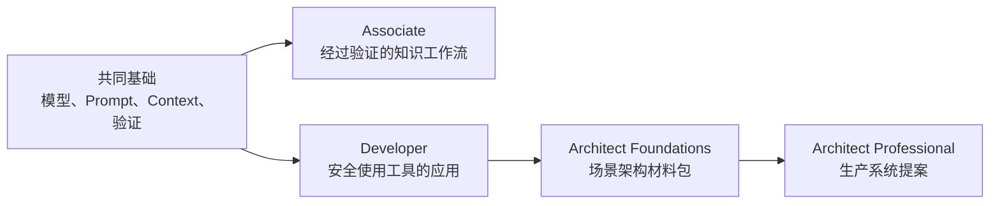

# Claude 认证课程

> 通过构建考试所描述的系统，学习答案背后的判断方法。

**状态：** 本地预览
**指南版本：** 1.0
**指南生效日期：** 2026 年 7 月
**最后验证日期：** 2026-08-09

这套免费课程涵盖：

| 考试 | 认证 | 题数 | 时间 | 费用 | 核心路线 |
|------|------------|------:|-----:|----:|-----------:|
| CCAO-F | Claude Certified Associate - Foundations | 60 | 120 分钟 | $99 | 9 节课 |
| CCDV-F | Claude Certified Developer - Foundations | 53 | 120 分钟 | $125 | 15 节课 |
| CCAR-F | Claude Certified Architect - Foundations | 60 | 120 分钟 | $125 | 21 节课 |
| CCAR-P | Claude Certified Architect - Professional | 63 | 120 分钟 | $175 | 25 节课 |

四份指南均采用 100 至 1,000 分的量表，通过分数为 720，并说明认证有效期为 12 个月。由于项目详情可能发生变化，请在报名前通过官方指南确认相关信息。

截至 2026 年 8 月 9 日的验证结果，官方考试报名仅面向 Claude Partner Network 组织的成员，并要求使用受认可的合作伙伴公司电子邮箱。这套课程仍然向所有人开放，包括只希望学习相关技能而不参加考试的学习者。由于资格要求可能发生变化，请在付款或安排考试前查看当前的
[认证 FAQ](https://anthropic-partners.skilljar.com/page/faq-certifications)。

## 通过 GitHub 和 AI 导师学习

这是一套 AI 原生课程。Claude Code、Codex、ChatGPT、Cursor 或其他 Agent 可以逐步教授整条路线、运行已检入的实验、评审你构建的产物、组织课程测验，并从保存的进度继续学习。

请先阅读 [GitHub 学习者指南](GETTING_STARTED.md)，或者安装
[可移植认证导师 Skill](../../skills/claude-certification/SKILL.md)：

```bash
npx skills add rohitg00/ai-engineering-from-scratch
```

然后让你的 Agent 运行：

```text
/claude-certification
```

克隆代码仓库后，本地 Claude Code 会话会从 `.claude/skills/` 中发现同一个 Skill。不支持斜杠命令的工具可以直接读取 `GETTING_STARTED.md` 和导师 Skill。学习者进度保存在 `CLAUDE-CERTIFICATION.md` 中；学习者作业保存在 `learning-artifacts/claude/` 下。已检入的 `outputs/` 文件始终作为参考产物，绝不会被覆盖。

## 你将构建什么

这些路径共享基础知识，之后会按照角色分化：



- Associate：带有证据和升级机制、受治理的知识工作流。
- Developer：协议优先的 Claude 应用，包括工具、测试、安全性和评估。
- Architect Foundations：架构决策记录、威胁模型、评估器、Context 计划和故障恢复 Runbook。
- Architect Professional：完整的需求发现到运营架构材料包，包括 RAG、集成、评估、治理、SLA 和所有权。

每条路径都包含一个简短的诊断测试和一套原创完整模拟考试，其题目数量与公开指南一致。题目构成会在合理取整范围内遵循考试蓝图权重。它不会模仿或复制真实考试题目。

## GitHub 课程索引

导师会读取每个选定的路径文件，以确定学习顺序。这个完整索引也让每节共享课程都可以直接通过 GitHub 浏览。

| # | 课程 |
|---:|--------|
| 00 | [学习决策，而不是词汇](lessons/00-certification-strategy/) |
| 01 | [选择能够承载工作的最小界面](lessons/01-claude-product-and-model-landscape/) |
| 02 | [在失败代价高昂的地方投入能力](lessons/02-model-selection-and-token-economics/) |
| 03 | [把请求转化为可测试的契约](lessons/03-prompting-and-task-decomposition/) |
| 04 | [把每项事实放入正确类型的 Context](lessons/04-context-knowledge-memory-and-caching/) |
| 05 | [验证主张，而不是置信度](lessons/05-output-evaluation-and-validation/) |
| 06 | [为能力设置权限边界](lessons/06-governance-safety-and-responsible-use/) |
| 07 | [先设计交接，再设计自动化](lessons/07-workflow-design-and-human-handoffs/) |
| 08 | [Messages API 是状态机](lessons/08-messages-api-and-application-lifecycle/) |
| 09 | [Structured Output 是不可信的契约](lessons/09-structured-output-and-defensive-parsing/) |
| 10 | [工具循环是受控委派](lessons/10-tool-use-and-agentic-loops/) |
| 11 | [MCP 将能力与 Host 分离](lessons/11-mcp-server-design-and-integration/) |
| 12 | [Agent SDK 是执行框架，而不是权限](lessons/12-claude-agent-sdk-and-hooks/) |
| 13 | [安全存在于 Prompt 之外](lessons/13-application-security-and-secrets/) |
| 14 | [Evals 将 Agent 行为转化为工程证据](lessons/14-evals-testing-debugging-and-observability/) |
| 15 | [Claude Code 通过共享约束实现规模化](lessons/15-claude-code-for-development-teams/) |
| 16 | [Multi-Agent 编排与委派](lessons/16-multi-agent-orchestration-and-delegation/) |
| 17 | [Agent SDK 会话、Subagent 和 Context](lessons/17-agent-sdk-sessions-subagents-and-context/) |
| 18 | [工具契约、错误和渐进式发现](lessons/18-tool-contracts-errors-and-progressive-discovery/) |
| 19 | [Claude Code Memory、规则、Skills 和 CI](lessons/19-claude-code-memory-rules-skills-and-ci/) |
| 20 | [可靠提取、批处理和独立评审者](lessons/20-reliable-extraction-batch-and-reviewers/) |
| 21 | [让大规模 Context 可观测](lessons/21-long-context-reliability-provenance-and-escalation/) |
| 22 | [业务发现、需求和 SLA](lessons/22-business-discovery-requirements-and-slas/) |
| 23 | [端到端架构与价值权衡](lessons/23-end-to-end-architecture-and-value-tradeoffs/) |
| 24 | [RAG、检索和数据管道](lessons/24-rag-retrieval-and-data-pipelines/) |
| 25 | [集成协议、身份和最小权限](lessons/25-integration-protocols-identity-and-least-privilege/) |
| 26 | [生产环境可观测性、延迟和成本](lessons/26-production-observability-latency-and-cost/) |
| 27 | [企业治理、合规和人工评审](lessons/27-enterprise-governance-compliance-and-hitl/) |
| 28 | [利益相关者沟通、ADR 和生命周期所有权](lessons/28-stakeholder-communication-adrs-and-lifecycle/) |
| 29 | [交付一周的工作成果，而不是完美的 Prompt](lessons/29-associate-workflow-capstone/) |
| 30 | [交付一个经得起论证的 Claude 应用](lessons/30-developer-application-capstone/) |
| 31 | [在六种 Context 中为同一个架构进行辩护](lessons/31-architect-foundations-scenario-capstone/) |
| 32 | [Architect Professional 系统 Capstone](lessons/32-architect-professional-system-capstone/) |

## 本地预览

在代码仓库根目录运行：

```bash
node site/build.js
python3 scripts/audit_certifications.py
python3 -m http.server 4173 --bind 127.0.0.1
```

然后打开：

```text
http://127.0.0.1:4173/site/certifications.html
```

服务器必须从代码仓库根目录启动，这样课程查看器才能继续读取尚未推送的本地课程文件。

认证课程通过 GitHub 和网站发布。它特意独立于 EPUB/PDF 图书工作流，因为导师状态、可运行实验、评估和交互机制都是课程的一部分。

## 研究记录

- [CCAR-F 精确机制审查](references/ccar-f-exact-mechanics.md)
- [Anthropic Academy 官方对等映射](research/official-academy-parity.md)
- [官方考试蓝图映射](research/official-blueprint-map.md)
- [来源验证台账](research/source-verification-ledger.md)
- [YouTube 来源审查](research/youtube-source-review.md)
- [近期社区信号](research/recent-community-signal.md)

## 独立性和考试诚信

这是一套独立的社区课程。它与 Anthropic 没有隶属关系，也未获得 Anthropic 的认可、赞助或授权。Claude 和认证名称仅用于标识所学习的项目。

课程使用公开考试目标和原创场景，不使用保密考试内容。如果你参加考试，请遵守其保密协议和考生行为规则。
