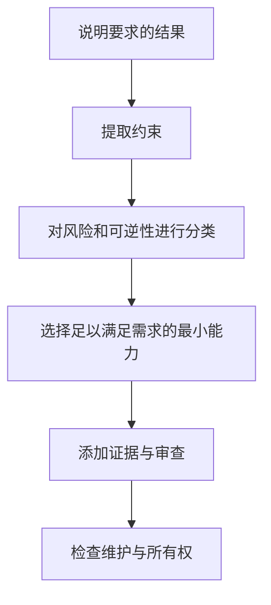

# 学习如何决策，而不是背诵术语

> 认证蓝图是一张决策地图，其中每项决策都应能由称职的从业者给出有理有据的辩护。若把它当作术语列表，你学到的将是考试中最没有用的部分。

**Type:** Learn
**Languages:** Python
**Prerequisites:** None
**Time:** ~75 分钟

## 学习目标

- 将认证蓝图转换为加权学习计划。
- 区分稳定的工程原则与可能发生变化的产品细节。
- 构建记录决策、理由和官方来源的证据账本。
- 在不使用题库或重建真实试题的情况下练习场景判断。
- 根据各领域表现定义准备度关卡，而不是依赖一次看起来不错的模拟考试分数。

## 问题

Maya 花了两周时间背诵功能名称。她可以定义 Project、context window 和 connector。然后，她遇到了一个场景题。

一个团队希望汇总一份机密周报。源文件每周五都会变化。最终摘要将发送给高管。选项包括将报告粘贴到新 chat、将其添加到旧 Project、连接实时来源，以及构建自定义应用程序。每个选项都能生成摘要。只有一个选项符合更新频率、审查要求、数据策略和维护负担方面的约束。

Maya 在记忆中搜索 connector 的定义。但这个场景问的是如何做出决策。

这种区别决定了整套课程的方向。官方指南描述了选择产品、验证输出、管理知识和升级风险等任务。定义可以帮助完成这些任务，但不能替你执行这些任务。

考试还使用 scaled score。练习百分比不是官方分数，任何社区模拟考试都无法预测结果。你的任务是培养足够的判断力，使陌生场景仍然显得结构清晰。

## 概念

### 蓝图是一种岗位模型

每个领域都代表目标角色预期承担的一部分工作。权重估算该领域在计分考试中所占的比例。权重不代表难度。一个权重较小的领域仍可能包含困难问题。权重告诉你应如何分配练习时间。

对于 Associate Foundations，权重最大的领域是输出评估与验证。这是一个信号。这个角色并不只是会向 Claude 请求答案的人，而是能够判断答案是否适合使用的人。

阅读每项目标时，请使用三个标签：

1. **Know：** 必须记住的事实或词汇。
2. **Do：** 必须执行的流程。
3. **Decide：** 必须根据约束解决的权衡。

大多数薄弱的学习计划在 Know 上投入过多。大多数场景题则集中在 Do 和 Decide 上。

### 稳定原则与可变事实

有些知识变化缓慢：

- 敏感数据需要经过批准的处理路径。
- 一项主张在进入具有实际后果的交付物之前需要证据。
- 持久指令应简洁、范围明确并得到维护。
- 不可逆操作应接受比可逆草稿更严格的审查。
- 当较小的模型能够满足测量得出的要求时，使用更大的模型是一种浪费。

另一些知识可能在本课编写之日与你学习之日之间发生变化：

- 模型名称、价格和 context limit。
- 方案资格和功能可用性。
- 产品导航和界面标签。
- Connector 能力和批准行为。
- 认证费用、策略和访问规则。

第二组知识必须附带验证日期和官方来源。本课程已根据 2026 年 7 月发布的 1.0 版指南进行核验。在安排考试前，请再次打开当前官方指南与认证 FAQ。

### 场景决策栈

当多个答案听起来都合理时，请按以下顺序检查场景：



足以满足需求的最小能力非常重要。如果直接 chat 可以安全地产生一次性草稿，managed Project 可能没有必要。如果来源每天都会变化，粘贴的副本可能会过时。如果工作流会执行具有实际后果的操作，便利性不能凌驾于审批之上。

### 错误答案通常只是在局部正确

好的干扰项很少是完全荒谬的。它们通常解决了错误的问题、忽略了某项约束，或者添加了不必要的机制。

常见形式包括：

- **能力与需求不匹配：** 该功能可以完成任务，但无法满足指定的隐私或时效要求。
- **默认使用最强能力：** 在没有经过测量的需求时选择最大的模型。
- **仅通过 prompt 修复：** 当失败实际源于过时知识或缺失来源时，却选择重写 prompt。
- **没有所有权的自动化：** 工作流没有审查者、升级路径或维护负责人。
- **执行之后才应用策略：** 先处理敏感材料，之后才进行分类。
- **一次成功的示例：** 将一份精美输出视为可靠性的证据。

### 构建证据账本

你的笔记应该记录决策，而不是复制段落。每个目标使用一个条目：

```json
{
  "objective": "选择何时需要人工验证",
  "decision_rule": "当错误可能造成实质性伤害，或者主张缺少权威证据时，要求独立审查",
  "counterexample": "低风险的头脑风暴列表可以由作者在正常编辑过程中审查",
  "artifact": "主张-证据 Matrix",
  "official_source": "URL 和验证日期",
  "confidence": "已练习"
}
```

反例至关重要。如果你无法指出一条规则不应在何时应用，你很可能只是记住了一句口号，而没有学会它的边界。

## 动手构建

创建一个包含七行的 Associate Foundations 账本，每个领域一行。每一行都要写明：

- 领域权重。
- 你预计需要做出的两个决策。
- 一项能够证明你可以完成相关工作的产物。
- 一种你希望能够快速识别的失败模式。
- 一个官方来源。
- 你当前的信心水平：未接触、已理解、已练习或已计时。

然后按比例分配十个小时的学习时间。从数学分配结果开始，但根据薄弱程度进行调整。一个你已经能够熟练完成的 21% 权重领域，可能比一个你从未接触过的 12% 权重领域需要更少的补救时间。

使用以下公式：

```text
领域小时数 = 总小时数 x 领域权重 x 薄弱系数
```

对最终数值进行归一化，使它们的总和重新等于你的可用时间。对于不熟悉的领域，使用 1.5 的薄弱系数是合理的。不要使用系数来逃避你不喜欢的高权重内容。

最后，为练习题建立错误日志。记录：

- 你做出的决策。
- 你遗漏的约束。
- 所选选项看起来有吸引力的原因。
- 本可得出更好答案的规则。
- 同一规则适用的新场景。

复习错误日志比反复参加同一套模拟考试更有价值。

### 使用学习节奏，而不是临时堆砌

将以下四阶段节奏作为课程学习的启发式方法。你可以将其扩展到四周，也可以根据实际拥有的时间进行压缩：

1. **Orient：** 阅读当前指南，完成一套从未接触过的诊断测试，并将每个错误映射到一个目标和信心水平。
2. **Build：** 完成必修课程和学习者拥有的产物。实际运行测试，不要把代码、策略或架构示例仅仅当作说明文字。
3. **Transfer：** 解决新场景，说明每个看似合理的备选方案为何不成立，并使用错误日志修复薄弱领域。
4. **Simulate：** 按照公开的闭卷规则完成全新的计时题组，复习猜对的问题，并在评估前立即停止添加新材料。

在选择补救方式之前，先对每个错误进行分类：

- **记忆缺口：** 你不知道某个稳定事实或定义。
- **过时事实：** 你记住的产品细节需要通过当前官方来源重新核验。
- **遗漏约束：** 你忽略了隐私、时效、延迟、成本、权限或可逆性。
- **顺序错误：** 你选择了有效操作，但将其放在生命周期中的错误阶段。
- **使用界面混淆：** 你选择了一个有能力完成任务的产品或工具，但它并不是足以满足需求且可维护的最小选择。
- **证据失败：** 你将信心、存在引用或一次成功运行当作证明。
- **过度工程化：** 你在场景需要之前就添加了架构。

错误类别决定修复方式。过时事实需要查阅文档。遗漏约束需要新的场景。顺序错误需要生命周期图。反复阅读同一段解释并不是通用的学习策略。

## 交互实验

使用路线图 figure 修改领域信心和可用小时数。观察一个薄弱的高权重领域如何改变学习顺序，而不是平等对待每项目标。

```figure
00-certification-route-map
```

## 实践实验

运行本地场景评分器，然后修改一个信心标签并观察加权学习顺序。破坏领域权重或已分配小时数，并确认 runner 会拒绝无效计划。

## 交付产物

`outputs/readiness-plan.json` 中填写完成的产物是一份完整的十小时 Associate Foundations 计划。它包含全部七个蓝图领域、当前信心、每个领域的两个决策、一种失败模式、一个官方来源、一项要生成的具体产物、四阶段练习节奏，以及错误答案分类体系。

## 验证

在不使用 API key 的情况下验证该数据包及其测试：

```bash
cd certifications/claude/lessons/00-certification-strategy/code
python3 main.py
python3 -m unittest discover tests -v
```

validator 会证明领域权重与已分配小时数相符、每个来源都标有日期且属于官方来源、每个领域都有练习证据，并且补救措施覆盖不同的失败类别。示例通过后，请将已填写的值替换为你自己的值。

## Capstone 联系

六道题的测验会检查你能否根据权重、注明日期的事实、约束和错误证据进行推理。将经过验证的计划带入你所选路线的 Capstone。在 Associate 路线中，它会成为第 29 课的覆盖范围与准备度记录。

## 实际应用

通过四轮完成课程。

**第一轮：Orient。** 阅读当前指南，完成一次诊断测试，并标记薄弱领域。在完成诊断测试之前，不要学习诊断题的答案。

**第二轮：Build。** 完成课程及其产物。在不查阅笔记的情况下运行工作周 Capstone。Capstone 会迫使你将产品选择、知识维护、prompting、验证、治理和交接整合到同一个工作流中。

**第三轮：Explain。** 对每项决策说明为什么最佳备选方案在给定约束下仍然不成立。解释能够暴露浅层信心。

**第四轮：Time。** 在闭卷条件下完成完整的模拟考试。复习每一道题，包括猜对的问题。猜对并不等于掌握。

一套保守的准备度关卡是：

- 两套全新计时练习的成绩达到或超过你的目标。
- 按原始练习分数计算，没有任何领域低于 75%。
- 每项 Capstone 产物均已完成。
- 每道错题都能根据遗漏的约束进行解释。
- 完成一次完整模拟考试后至少剩余十分钟。

这是一个学习关卡，并不是对 Anthropic scaled score 的预测。

## 考试决策模式

- 优先选择满足所有明确约束的选项，而不是功能最多的选项。
- 将 current、confidential、recurring、approved、auditable 和 executive 等词视为架构输入。
- 区分内容质量和工作流质量。即使答案很好，如果它是通过未经批准的数据路径生成的，仍然是错误的解决方案。
- 当时效性很重要时，优先选择持续维护的来源，而不是复制的快照。
- 在后果严重、不确定性高或不可逆性高的情况下加入人工审查。
- 根据当前官方材料核验产品事实，而不是相信记忆中的界面。

## 常见陷阱

- 使用真实试题题库。这会违反项目规则，并且训练的是识别能力，而不是判断力。
- 认为较长的答案更可能正确。
- 背诵没有日期的确切价格。
- 将最大的模型等同于最安全的选择。
- 参加大量低质量模拟考试，而不是研究解释。
- 将熟悉的场景视为自己能够处理陌生场景的证据。
- 将原始练习百分比与官方 scaled score 混淆。

## 练习

1. 从每个领域选择一个目标，并将其标记为 Know、Do 或 Decide。为每个标签给出理由。
2. 编写一个不需要 Project 的场景，再编写一个 Project 是最简单且可维护选择的场景。
3. 在本课程中找出一个可能发生变化的产品事实。通过官方来源验证该事实，并记录日期。
4. 将薄弱的错误日志条目“我忘记答案了”改写为对遗漏约束的解释。
5. 设计一套个人准备度关卡，使其比一次模拟考试分数更严格，同时又能在你的可用时间内实现。

## 关键术语

| 术语 | 含义 |
|---|---|
| Blueprint | 用于定义考试范围的官方领域与目标地图 |
| Scaled score | 经过转换的考试分数，不等于原始答对百分比 |
| Distractor | 在阅读不完整的情况下看似合理的错误选项 |
| Decision rule | 在已知约束下从多个备选方案中做出选择的可复用方法 |
| Evidence ledger | 将目标与规则、产物及官方来源关联起来的带日期记录 |
| Readiness gate | 尝试下一评估阶段之前必须满足的一组条件 |

## 延伸阅读

- [Anthropic Partner 认证目录](https://anthropic-partners.skilljar.com/page/partner-certifications)
- [Anthropic 认证 FAQ](https://anthropic-partners.skilljar.com/page/faq-certifications)
- [Claude Certified Associate Foundations 考试指南](https://everpath-course-content.s3-accelerate.amazonaws.com/instructor%2F6nizmqk8tpzpfjvt6qmmav7rh%2Fpublic%2F1783542847%2FClaude+Certified+Associate+%E2%80%93+Foundations+Exam+Guide.pdf)
- [CCAR-F 精确机制审查](../../../references/ccar-f-exact-mechanics.md)
- [Prompt Engineering：技术与模式](../../../../../phases/11-llm-engineering/01-prompt-engineering/)
- [评估与测试 LLM 应用程序](../../../../../phases/11-llm-engineering/10-evaluation/)
