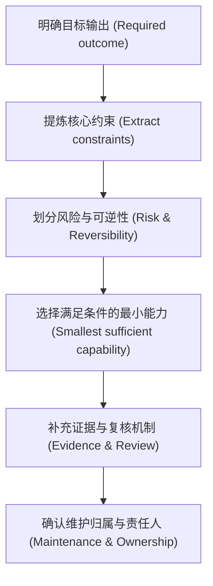

# 考核核心是决策，而非词汇死记

> 认证考试大纲（Blueprint）是一张可供合格从业者据理捍卫的决策全景图。若仅将其视为术语清单，你所复习的将是整场考试中最无价值的部分。

**Type:** Learn
**Languages:** Python
**Prerequisites:** None
**Time:** ~75 minutes

## 学习目标

- 将认证考试大纲（Blueprint）转化为具有权重分配的学习备考计划。
- 将稳定的工程原理与随时可能变动的产品功能细节明确剥离开来。
- 构建证据台账（Evidence Ledger），严密记录每项技术决策、权衡理由与官方权威信源。
- 深度演练场景判断能力，杜绝依赖泄题题库（Dumps）或试图死记真题。
- 基于各能力维度的实际表现设立就绪关卡（Readiness Gate），而非依赖单次偶然的高分模拟考成绩。

## 问题背景

Maya 花了两周时间死记硬背各种功能名称。她能够熟练背诵什么是 Project（项目）、Context Window（上下文窗口）以及 Connector（连接器）。然而，当她面对真实的业务场景题时，立刻陷入了困境。

题目场景如下：一个团队希望对一份高度保密的周报进行自动摘要。源文件在每周五都会更新，最终生成的摘要将直接呈送给企业高管。题目给出的备选方案包括：直接将周报全文粘贴到新的聊天会话中；将其作为参考文件添加到已有的旧 Project 中；配置 Connector 实时连接数据源；或者专门开发一套定制化应用。从功能上看，每一个选项理论上都能生成一份摘要，但只有一个选项能够同时满足数据更新频次、严格审计复核、数据合规策略以及后期维护成本等多重约束。

Maya 拼命在记忆中检索 Connector 的标准定义，但题目的考点根本不是名词解释，而是工程决策。

这种本质区别贯穿了整套认证课程体系。官方考纲指南所描述的能力考核全部指向具体任务：例如根据场景选择最匹配的产品形态、验证大模型生成内容的可靠性、搭建与维护长效知识库、评估潜在风险并在必要时触发人工升级流程。静态的概念定义或许能辅助你理解，但它永远无法代替你做出合理的架构决断。

此外，认证考试采用换算分（Scaled Score）机制。练习过程中的简单百分比正确率并不等同于官方最终成绩，任何非官方社区模拟题也都无法精准预测实际结果。你的真正目标是建立一套足够严密扎实的判断框架，使得面对从未见过的复杂场景时，依然能够条分缕析地推导出最优解。

## 核心概念

### 考试大纲即岗位能力模型

考纲中的每一个 Domain（考点领域）都代表了目标专业岗位日常工作中的一部分核心职责。官方标明的权重比例，直接反映了该领域在计分题目中所占的考查比重。但请牢记：权重并不等同于题目难度。一个权重较低的领域同样可能包含极具深度的复杂考题；权重真正的作用是指导你如何科学地分配复习精力。

以 Associate Foundations（基础合规与助理架构师）认证为例，权重最高的核心领域正是“输出评估与内容验证（Output Evaluation and Validation）”。这是一个极其明确的行业信号：该岗位绝不仅仅是一个会写 Prompt 向 Claude 索取答案的人，而必须是能够严格判断该输出是否具备可交付性、合规性与安全性的技术把关人。

在研读考纲的每一项具体目标（Objective）时，请务必使用以下三种标签进行分类标注：

1. **Know（知晓）：** 必须准确记忆的硬性事实、规范限制或专业术语。
2. **Do（执行）：** 必须亲手完成的标准工程操作或实施流程。
3. **Decide（决策）：** 必须在相互冲突的多重约束条件下权衡取舍的决策能力。

绝大多数低效的复习计划往往在 Know（概念记忆）上过度倾斜，而真实的场景型考题绝大多数都在深入考察 Do（操作执行）与 Decide（架构决策）。

### 稳定工程原则与易变产品细节

技术体系中的知识具有不同的半衰期，我们需要明确区分：

具有长久有效性的稳定工程原则：
- 敏感数据与保密资产必须走经过合规审批的处理链路。
- 任何未经核实的模型断言在纳入重要交付物前必须具备权威事实证据支持。
- 持久化系统指令（System Prompts）应当保持精炼、职责明确且有持续的维护机制。
- 不可逆的写入与外部调用操作，必须比可反复修改的草稿内容施加更严格的人工审查。
- 当较小尺寸或较低成本的模型已能充分满足量化指标时，盲目使用超大模型即是工程浪费。

而极易随时间推移、版本迭代而变动的具体产品细节：
- 模型的最新代号、API 调用定价以及上下文窗口大小上限。
- 各种订阅套餐（Pro / Team / Enterprise）的权益范围与功能可用性边界。
- 控制台界面布局、导航菜单以及功能按钮的具体文案。
- Connector 的官方支持列表以及组织内授权审批逻辑。
- 认证考试的报名费用、重考政策以及题量时间规定。

对于第二类信息，所有记录必须附带明确的核实日期与官方来源链接。本课程体系完全基于 2026 年 7 月发布的 1.0 版官方指南进行基准对齐。在正式预约并参加考试之前，务必再次打开最新的官方考纲指南与认证 FAQ 进行核实确认。

### 场景题决策调用栈

当题目的多个选项乍看起来都言之成理时，请按照以下标准调用栈顺序逐层审查业务场景：


```mermaid
flowchart TD
    A["明确目标输出 (Required outcome)"] --> B["提炼核心约束 (Extract constraints)"]
    B --> C["划分风险与可逆性 (Risk & Reversibility)"]
    C --> D["选择满足条件的最小能力 (Smallest sufficient capability)"]
    D --> E["补充证据与复核机制 (Evidence & Review)"]
    E --> F["确认维护归属与责任人 (Maintenance & Ownership)"]
```

“满足条件的最小充分能力（Smallest sufficient capability）”是最高频的判别法则。如果一次性的交互对话就能安全达成目标草稿，就没有必要引入结构复杂的持久化 Project；如果数据源每小时都在更新，单纯复制粘贴静态文本就会带来严重的知识过时风险；如果工作流涉及资金划拨或外部系统不可逆修改，操作便捷性绝不能凌驾于人工审查与权限隔离之上。

### 干扰项通常在局部看似合理

优秀的干扰项（Distractors）极少是荒谬的低级错误。它们往往能够解决一部分问题，但却忽略了某一关键约束，或者盲目引入了非必要的复杂架构。

常见的典型干扰项形态包括：
- **功能可用但场景不匹配（Capability without fit）：** 该功能技术上能跑通任务，但在隐私隔离、数据保鲜度或 SLA 延迟要求下无法达标。
- **默认无脑拉满算力（Maximum power by default）：** 在没有明确量化瓶颈的前提下，直接选用最昂贵的大模型。
- **仅靠微调 Prompt 试图修复根本缺陷（Prompt-only repair）：** 问题的根源在于外部知识过时或权威证据缺失，却企图只通过修改提示词来掩盖幻觉。
- **缺乏责任归属的过度自动化（Automation without ownership）：** 构建了复杂的全自动流程，却没有设置兜底的人工审查员、异常上报路径或资产维护责任人。
- **先执行后定级（Policy after execution）：** 未经合规过滤便直接将数据送入模型处理，事后再来补做敏感分类。
- **单一孤证当成普遍可靠（One successful example）：** 仅仅因为一次生成效果惊艳，就主观断定系统具备生产级稳定性。

### 构建证据台账 (Evidence Ledger)

你的复习笔记应当系统性地记录决策脉络，而非整段复制官方文档。针对考纲中的每一个考核目标，建立一条结构化条目：

```json
{
  "objective": "选择何时必须引入人工复核 (Human verification)",
  "decision_rule": "当错误可能造成重大实质性损害，或模型断言缺乏权威信源佐证时，强制要求独立人工审查",
  "counterexample": "低风险的头脑风暴构思清单，可由作者本人在日常编辑流中自行轻量审阅",
  "artifact": "claim-evidence matrix (主张-证据矩阵)",
  "official_source": "官方考纲指南 URL 与核验日期",
  "confidence": "practiced"
}
```

其中“反例（Counterexample）”的梳理至关重要。如果你无法清晰界定一条规则在何时不适用，说明你只是死记了一条空洞的教条，并未真正掌握其工程边界。

## 动手构建

针对 Associate Foundations 考纲的全部 7 个核心领域，亲手创建一份包含 7 行的证据台账。每一行必须如实填报：

- 该考点领域的官方权重百分比。
- 你预计在该领域中必须独立做出的两项典型工程决策。
- 一项足以证明你具备该项实操能力的交付物（Artifact）。
- 一个你能够快速敏锐识别的典型失效模式（Failure mode）。
- 一项经过日期核验的官方权威文档信源。
- 你当前的掌握置信度：unseen（未涉足）、understood（已理解概念）、practiced（已有实战经验）或 timed（限时演练达标）。

随后，按比例将 10 个小时的备考时间科学分配给各个领域。先依据官方权重计算出基准学时，再根据你的薄弱项引入加权乘数。例如：一个占 21% 权重但你早已非常熟练的领域，其实际分配学时可以适当让位于一个占 12% 权重但你从未接触过的陌生盲区。

使用以下计算公式：

```text
领域分配学时 = 总可用学时 x 考点权重 x 薄弱项调节乘数
```

最后将计算出的学时归一化，确保总和严格等于你的可用总时长。对于完全陌生的弱项领域，1.5 的调节乘数是较为合理的设定；切忌通过随意调小乘数来逃避那些高权重但枯燥的攻坚考点。

最后，为你的模拟题练习建立系统化的“错题分析日志（Error Log）”，严格记录：
- 你当时做出的具体选择。
- 你在审题中漏掉的核心约束条件。
- 为什么当时那个错误选项会对你产生迷惑性。
- 哪一条具体的工程决策准则本可以指引你选出正确答案。
- 构建一个适用该准则的全新同构业务场景。

反复复盘错题日志的价值，远胜于一遍又一遍刷同一套毫无变化的模拟试卷。

### 建立严密节奏，拒绝考前突击

建议将备考过程划分为四个系统化阶段。你可以将其按部就班地平摊到四个星期，也可以根据实际可用时间紧凑压缩执行：

1. **Orient（定向诊断）：** 完整通读最新考纲指南，在不查阅任何资料的前提下完成一套未曾见过的诊断题，将所有错题精准映射到考纲目标与置信度层级。
2. **Build（动手构建）：** 完整学完对应课程并产出由你独立构建的实战产物。务必在本地环境运行测试套件验证，严禁将代码、安全合规策略与架构设计仅当作概念文本泛泛浏览。
3. **Transfer（迁移应用）：** 针对全新的陌生业务场景进行推导演练，详细阐明为何每个高迷惑性的备选方案均无法胜出，并基于错题日志精准弥补薄弱领域。
4. **Simulate（全真模拟）：** 严格按照官方闭卷与计时规范完成全新的全真模拟测试，逐一复盘哪怕是偶然猜对的题目，并在考前最后阶段停止引入未经消化的全新碎片知识。

在采取补救措施之前，务必将每一个丢分点准确分类：
- **Recall gap（记忆断层）：** 遗漏了稳定的硬性事实或基础定义。
- **Stale fact（知识陈旧）：** 记住了已经过时变动的产品特性，需要重新核实最新文档。
- **Missed constraint（忽略约束）：** 忽视了题干中的隐私合规、保鲜周期、SLA 延迟、成本预算、操作权限或可逆性限制。
- **Sequence error（时序颠倒）：** 在错误的生命周期阶段执行了本该在别处执行的操作。
- **Surface confusion（表面选型混乱）：** 选择了能跑通但并非“满足条件的最小维护成本”的产品形态或工具。
- **Evidence failure（证据缺失）：** 盲目把模型的自信语气、表面引用标注或单次偶然成功直接当作生产级证据。
- **Overengineering（过度工程化）：** 在场景尚未提出诉求前，盲目堆砌多 Agent 或复杂微服务架构。

分类直接决定了补救手段。陈旧知识需要查阅官方最新文档，忽略约束需要强化场景审题训练，时序颠倒需要重新梳理架构生命周期全景图。简单重复看书并不是万能的复习方法。

## Interactive Lab (交互式实验)

通过下方的路线图图表（Route-map figure），动态调节各考点领域的掌握置信度与可用学习学时。观察当一个权重极高且基础薄弱的领域发生变动时，系统是如何重新编排你的最佳学习路径，而不是机械地平分精力。

```figure
00-certification-route-map
```

## Practice Lab (实战演练)

在本地运行场景评分测试器，尝试修改其中一个领域的置信度标签，观察生成的加权备考顺序变化。尝试故意破坏领域权重配比或分配总学时，验证校验器是否会严格拦截并拒绝无效的学习计划。

## Shipped Artifact (交付产物)

位于 `outputs/readiness-plan.json` 的参考产物是一份完整的 10 小时制 Associate Foundations 备考作战计划。它覆盖了全部 7 个考纲领域、当前置信度评级、每个领域两项核心工程决策、典型失效模式、经过核验的官方权威文档信源、具体交付的验证实物、四阶段备考推进节奏以及完整的错题分类分析法。

## Verify It (验证步骤)

无需任何商业 API Key 即可在本地完整校验该产物及其配套自动化测试：

```bash
cd certifications/claude/lessons/00-certification-strategy/code
python3 main.py
python3 -m unittest discover tests -v
```

该校验脚本会自动证明：各领域权重与分配学时严格平账；每条信源均附带官方日期与标准出处；每个领域均具备实操证据支撑；补救策略精准覆盖了各类独立的失效维度。待示例用例全部通过后，即可将其中的占位内容替换为你本人的个性化真实备考数据。

## Capstone Connection (项目连接)

配套的 6 道自测题将全面检验你是否能够基于权重分配、时效事实、多维约束以及错误归因进行严密推理。在你的认证冲刺阶段，这份经过本地校验的作战计划将直接转化为毕业设计（Capstone）的进度与就绪度台账。在 Associate 认证路线中，它将直接作为第 29 课的综合覆盖度与最终考核就绪凭证。

## 实践应用

建议分四轮贯穿整套备考课程：

**第一轮：定向摸底（Orient）。** 研读最新官方指南，闭卷完成一次诊断自测，系统标出薄弱领域。在整套测试做完之前，绝对不要提前翻看参考答案。

**第二轮：动手实操（Build）。** 逐课攻克并亲手编写配套的代码与工程产物。在不查阅备忘笔记的情况下独立跑通最终的综合实战项目。综合项目会将产品形态选型、长效知识维护、精准 Prompt 设计、可靠性验证、安全合规治理以及人机协同交接全面打通，融为一体。

**第三轮：辩证阐释（Explain）。** 针对每一个核心决策，清晰说明为什么最看似可行的替代方案在已知约束条件下必须被否决。阐明原因的过程能立刻撕破虚假的自信假象。

**第四轮：全真限时（Time）。** 严格在闭卷与倒计时环境下完成整套全真模拟卷。严谨复盘每一道题，包括那些凭运气猜对的题目。靠直觉蒙对绝不代表真正掌握。

一份审慎可靠的考试就绪关卡（Readiness Gate）应当满足：
- 连续两次全新的限时模拟套卷成绩稳稳达到或超越你的目标分。
- 在原始模拟题得分中，没有任何单个领域的得分率低于 75%。
- 每一项综合实战产物均在本地环境真实跑通并通过全部测试。
- 每一道错题都能用“未识别到的关键约束条件”进行清晰归因并记录入册。
- 在全真模拟卷作答完毕后，至少能够留出 10 分钟以上的充裕检查时间。

这套就绪标准是一套严谨的学习把关机制，并不等同于对 Anthropic 官方折算分数的机械预测。

## 考试决策模式

- 优先选择完美满足所有明确约束的方案，而不是堆砌功能最繁复的选项。
- 将题干中的“实时最新（current）”、“保密敏感（confidential）”、“周期循环（recurring）”、“经过合规审批（approved）”、“可被审计（auditable）”以及“高管呈送（executive）”等修饰词，直接视为系统架构设计的硬性输入边界。
- 将生成内容的表面质量与系统架构的工作流质量严格区分开来。即便生成了一份看似完美的分析草稿，但若是通过未经企业授权的数据通道获取的，它依然是不合格的错误方案。
- 在要求数据保鲜度的场景下，优先选用具备动态同步维护机制的数据源，而非依靠手动复制粘贴的静态快照。
- 在潜在影响重大、结果高度不确定或操作不可逆的环节，坚决引入独立的人工审查屏障。
- 严密对照官方最新发布的权威材料核验产品参数，绝不可凭记忆中旧版本的界面印象妄下断言。

## 常见陷阱

- 使用泄露的真题题库（Dumps）。这不仅严重违反认证诚信协议，更会把你训练成机械背答案的机器，完全丧失在真实场景中的架构决断力。
- 误认为选项文案越长、解释越详尽就越可能是正确答案。
- 死记没有明确日期的具体定价与规格数值。
- 误以为选用最大号的模型就一定是最稳妥安全的技术选型。
- 盲目刷大量低质量的社区野题，却从来不静下心来推敲高质量解析。
- 误以为做过一道眼熟的场景题，就代表自己能够解决同类变种的新问题。
- 将练习题的原始百分比正确率直接混淆为官方最终的 Scaled Score（标准换算分）。

## 课后习题

1. 从考纲的各个领域中分别挑选出一个具体目标，明确为其打上 Know、Do 或 Decide 标签，并写出你的判定依据。
2. 构思两个业务场景：一个场景下引入 Project 完全是画蛇添足的过度设计；另一个场景下 Project 则是维护成本最低的最佳选型。
3. 在本课程中找出一条可能随时间发生变动的产品具体参数，通过 Anthropic 官方权威信源核验其最新状态，并记录当前的核准日期。
4. 将错题本中一句模糊敷衍的记录（如“我当时选错了”）重新改写为基于“遗漏了哪项核心业务约束”的专业归因复盘。
5. 为自己制定一套个性化的考前就绪关卡准则，要求其严谨度显著超越单次刷题分数，且完全可在你的备考周期内切实达成。

## 核心术语

| 术语 (Term) | 核心内涵解释 |
|---|---|
| Blueprint (考纲大纲) | 官方发布的领域与技能目标图谱，用于严格界定认证考查范围与能力矩阵 |
| Scaled score (标准换算分) | 官方经过统计学标准转换后的统一分值系统，并非简单的原始答对题目百分比 |
| Distractor (迷惑干扰项) | 专门设计的极具迷惑性的错误选项，在片面或不严密的审题下极易误判为正确 |
| Decision rule (决策准则) | 在已知业务约束与技术边界下，从多个备选架构方案中做出科学取舍的可复用原则 |
| Evidence ledger (证据台账) | 一份具备日期核验的系统化记录，将考纲目标与决策规则、验证实物及官方信源紧密绑定 |
| Readiness gate (就绪关卡) | 在正式参加下一阶段高风险评估或真实认证前，必须严格达标的一组前置硬性量化条件 |

## 延伸阅读

- [Anthropic 合作伙伴认证官方目录](https://anthropic-partners.skilljar.com/page/partner-certifications)
- [Anthropic 官方认证常见问题与政策 (FAQ)](https://anthropic-partners.skilljar.com/page/faq-certifications)
- [Claude Certified Associate Foundations 官方考试指南](https://everpath-course-content.s3-accelerate.amazonaws.com/instructor%2F6nizmqk8tpzpfjvt6qmmav7rh%2Fpublic%2F1783542847%2FClaude+Certified+Associate+%E2%80%93+Foundations+Exam+Guide.pdf)
- [CCAR-F 核心技术机制精要解析](../../../references/ccar-f-exact-mechanics.md)
- [Prompt 工程：架构模式与技术实践](../../../../../phases/11-llm-engineering/01-prompt-engineering/)
- [大语言模型应用评估与质量测试](../../../../../phases/11-llm-engineering/10-evaluation/)
