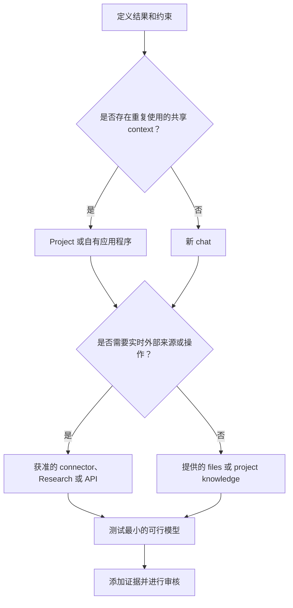

# 选择能够承载工作的最小界面

> 产品选择是在知识工作尺度上进行架构设计。错误的界面可能让正确的输出变得陈旧、无法审核或造成不必要的高昂成本。

**Type:** Learn
**Languages:** Python
**Prerequisites:** [学习决策，而不是词汇](../../00-certification-strategy/), [托管式 LLM 平台](../../../../../phases/17-infrastructure-and-production/01-managed-llm-platforms/)
**Time:** ~90 分钟

## 学习目标

- 在 chat、Projects、Research、files and Artifacts、connectors 和编程式界面之间作出选择。
- 解释 Haiku、Sonnet 和 Opus 的持久角色，而不依赖特定模型版本。
- 根据质量、速度、成本、时效性和治理约束匹配界面与模型。
- 使用架构决策记录比较直接使用 Anthropic、Amazon Bedrock、Google Vertex AI 和 Microsoft Foundry 的部署路径。
- 判断 memory、project knowledge 或新 conversation 何时才是正确的连续性机制。
- 使用官方来源和验证日期标记可能变化的产品事实。

## 问题

一位运营负责人每周准备一份竞争对手简报。她打开上周的 chat，粘贴三个新链接，要求更新，然后转发结果。

输出看起来很完善。但它也引用了上一轮 conversation 中的旧产品价格，遗漏了内部文档中的政策变更，并包含一项没有来源的竞争对手声明。失败并非始于措辞，而是始于所选择的工作界面。

旧 chat 携带了陈旧的 context。粘贴链接并不能保证研究全面。内部政策不属于可用 knowledge。工作流中也没有声明验证步骤。

考试目标称为产品与模型选择，但真正的技能是边界设计。你要决定 Claude 可以看到什么、记住什么、检索什么、创建什么，以及任务值得投入多少推理能力。

## 概念

### 从工作开始，而不是从功能菜单开始

从六个维度描述任务：

| 维度 | 问题 |
|---|---|
| 重复性 | 这是一次性、重复性还是持续性任务？ |
| Knowledge | 所需来源是小型、大型、私有还是持续变化的？ |
| 时效性 | 昨天的副本今天是否可能已经错误？ |
| 输出 | 结果是回复、报告、文件、分析还是可复用工作流？ |
| 后果 | 如果结果错误或操作并非有意执行，会发生什么？ |
| 协作 | 只有一个人使用，还是必须由团队共享和维护？ |

只有完成这些判断之后，才选择界面。

### Chat 适合边界明确的对话式工作

对于输入清晰的一次性任务，新 chat 通常是正确的默认选择。它提供了一个干净的 context 边界。可将其用于起草、头脑风暴、解释、转换给定文本和简短分析。

当旧假设悄悄影响新工作时，长期运行的 chat 会变得危险。当目标发生变化、context 中包含相互冲突的指令，或者你无法说明哪些早期消息仍然重要时，应重新开始。如果需要保持连续性，请先提取一份简短且经过验证的交接说明。

Chat search 和 memory 可以找回之前的 context，但不能替代经过批准的事实来源。Memory 适合存储偏好和持久的工作 context。政策、价格表或客户记录应放在有明确负责人和日期的维护系统中。

### Projects 是受到维护的 context 边界

Project 将聚焦的 chats、project instructions 和 knowledge base 组合在一起。当同一份稳定 context 支撑重复性工作时，它更加合适，例如品牌指南、研究项目、操作流程或客户合作项目。

它的优势不只是存储，而是可重复性。每次新 conversation 都从一个经过明确设计的边界内开始。

风险在于配置陈旧。包含上一季度政策的 Project 可能会持续作出同样的错误决策。每个 Project 都需要负责人、来源清单、审核周期和移除流程。

官方产品行为会发生变化。截至 2026 年 8 月 8 日检查时，Anthropic 的帮助材料说明，Projects 可以包含 instructions 和上传的 knowledge，并且在 knowledge 接近 context 限制时使用 retrieval。可用性、限制和套餐要求必须在当前帮助中心重新验证。

### Cowork 是可引导的任务循环

Cowork 是面向多步骤知识工作的产品界面，不是独立的部署路径，也不是本课的考试目标。截至 2026 年 8 月 9 日验证时，Anthropic 当前的帮助材料描述了一种由结果驱动的任务循环：你描述结果、审核方案、观察进度，并在工作运行过程中进行引导或重新定向。Projects 可以为相关任务提供常驻的 files、links、instructions 和 memory。Skills 提供可复用工作流，而 plugins 可以打包 skills、connectors、agents 和 hooks。

当结果是真实文件或跨批准来源的协调任务，并且工作可受益于人工引导时，可使用 Cowork。文件边界应保持狭窄：当前文档说明，本地访问仅限于已连接的文件夹，文件操作需要经过 permissions，永久删除则需要显式批准。对于敏感文件、陌生 plugins、具有重大后果的操作或广泛的 computer access，应使用人工批准，密切关注任务，并审核生成的文件。长期运行的循环不会把责任转移给模型。

### Research 适合多来源调查

当任务需要广泛收集信息、多次搜索、综合分析和 citations 时，使用 Research。直接 web search 更适合查询范围狭窄的当前事实。Research 更适合比较市场、审阅多篇论文，或协调公开来源与已连接的内部材料等问题。

Research 不会消除判断来源的必要性。长篇报告仍可能引用薄弱证据、合并来自不同日期的声明，或遗漏私有约束。应把 citations 视为通往证据的导航，而不是自动成立的证明。

### Files 和 Artifacts 让输出可供检查

根据后续用途选择输出形式。如果答案只会被阅读后丢弃，inline text 就很合适。如果必须比较字段，结构化表格更好。如果结果将进入业务流程，则可下载的文档或 spreadsheet 更合适。

Artifact 应公开假设、来源、日期和未解决事项。隐藏不确定性的精美文件，比带有清晰证据列的朴素表格更难审核。

文件创建和编辑能力可能因界面、套餐、文件类型和大小而异。在围绕这些能力设计重复性工作流之前，应验证当前限制。

### Connectors 用复制换取实时且受权限控制的访问

Connectors 让 Claude 能够从外部服务检索信息，或在其中执行操作。当来源时效性很重要，且手动复制粘贴会产生偏差时，它们很有用。

不要仅仅因为存在某个 connector 就选择它。需要检查：

- 它是 read-only，还是可以修改数据。
- 它继承了已连接账户的哪些 permissions。
- 每项操作是否都需要批准。
- conversation 会保留哪些数据。
- 是否必须由组织管理员启用。
- connector 是否会公开你需要的确切内容类型。

截至 2026 年 8 月 8 日检查时，官方文档说明 Google Workspace connectors 可以搜索 Gmail、处理 Calendar 和 Drive，并要求对操作进行显式批准。文档还记录了相关限制，包括可能无法查看的内容。这些细节都属于可能变化的产品事实。

### API 和编码界面适合由自己掌控的软件行为

当你需要确定性集成、自定义界面、自动化测试、版本化配置，或在软件系统内重复执行时，应转向 API、Claude Code 或 agent runtime。

不要为了回避学习如何配置 Project 而构建应用程序。当工作流需要 chat 产品无法表达的契约时，则应该构建应用程序，例如 typed output schema、由应用程序控制的 authorization，或每次发布时执行的自动化 evaluation。

### 部署是 control plane 决策

选择工作界面与选择 Claude 在何处运行是两个不同的决策。Project 可以是适合员工使用的界面，而另一套独立应用程序则使用 cloud-hosted API。不要用“Claude”一词掩盖这两个选择。

截至 2026 年 8 月 9 日验证时，Anthropic 官方文档描述了企业架构审核应比较的四条部署路径：

| 路径 | Control plane 与采购 | 特别适合以下情况 | 批准前重新检查 |
|---|---|---|---|
| Claude for Enterprise 和直接 Claude API | Anthropic 管理面向人员的产品和第一方 API 服务。Enterprise seats 与直接 API workspaces 是不同的使用形态。 | 可以接受直接向 Anthropic 采购、第一方产品访问很重要，并且不强制要求使用 cloud marketplace。 | Enterprise identity 和 seat policy、API authentication、workspace budgets、data terms、可用功能和模型生命周期。 |
| Amazon Bedrock | AWS-native authentication、billing、regions、quotas 和由 AWS 管理的 inference boundaries。 | 组织已经通过 AWS IAM、AWS 采购和 AWS compliance controls 治理生产环境中的 AI。 | Model access、regional endpoint、功能差异、AWS data handling、quotas 和确切的 Bedrock API generation。 |
| Google Vertex AI | Google Cloud project identity、billing，以及 global、multi-region 或 regional endpoints。 | 工作负载属于现有 Google Cloud landing zone，并使用其 IAM、billing、logging 和 residency controls。 | 模型与功能支持、endpoint geography、provisioned 与 pay-as-you-go capacity，以及 Google Cloud data handling。 |
| Microsoft Foundry | Azure-native endpoints 和 authentication，并通过 Azure Marketplace billing。当前文档描述了 Azure-hosted 与 Anthropic-hosted 两种选择。 | Azure 采购、Entra identity、Azure RBAC 和 Foundry operations 已经是获准路径。 | Hosting option、deployment type、region 或 data zone、模型与功能支持，以及当前 processor terms。 |

这些行不是排名，而是 ownership 地图。最佳路径是以最少的新 control planes 满足组织约束的路径。

将直接使用 Anthropic 视为一个采购系列，但要明确列出其 controls。Claude for Enterprise 管理具名人员和共享工作。直接 Claude API 通过 API organizations 和 workspaces 管理应用程序工作负载。Seat 不等于 API capacity，API spend limit 也不等于 seat policy。

合作 cloud 在各层由谁运营和处理方面也有所不同。截至 2026 年 8 月 9 日验证时，Anthropic 的 data-retention 文档说明，对于第一方 Claude API 和 Microsoft Foundry，Anthropic 是 data processor；对于 Amazon Bedrock 和 Google Cloud，则由 cloud provider 担任 data processor。Foundry 还提供不同 hosting choices，其边界必须查阅当前 Foundry 页面。应记录确切的 offering、region 和 hosting option，而不是只写“Azure”或“AWS”。

### 对需求评分，而不是对 provider 评分

在与 vendor 会面之前先写下决策标准：

| 标准 | 架构问题 |
|---|---|
| Cloud commitment | 已经存在哪些 landing zones、network controls、logging systems 和 support teams？ |
| Procurement | 使用量必须通过 cloud marketplace 结算，还是通过与 Anthropic 的直接协议结算？ |
| Compliance 与 data boundary | 谁是 processor、inference 在哪里运行、哪些内容可以离开边界，以及适用哪些 retention terms？ |
| Identity | 人员使用 enterprise SSO 和 SCIM，还是工作负载使用 cloud identity、federation 或 scoped API credentials？ |
| Seats 与 budgets | 你购买的是 named-user access、application tokens、provisioned capacity，还是其中多种？限制在哪里执行？ |
| Operational control | 谁负责 model enablement、quotas、regions、logs、incident response、deprecation work 和 feature verification？ |

根据实际工作负载为每项标准分配权重，给每条路径评分并写出简短理由，然后计算结果。没有理由的分数只是装饰。复制到另一个组织的分数则是错误信息。

最后编写一份架构决策记录。说明所选路径、被拒绝的替代方案、后果和审核触发条件。Cloud commitment、processor terms、必需功能或采购方式都可能改变，因此已经接受的决策仍然需要审核日期。

### 模型系列代表角色，而不是地位等级

持久的系列模式如下：

- **Haiku：** 对于范围狭窄、规定明确且高吞吐量的工作，优先考虑速度和低成本。
- **Sonnet：** 为大多数专业工作流平衡能力、latency 和成本。
- **Opus：** 对最困难的推理、综合分析和 agentic 工作优先考虑能力，前提是测得的质量能够证明额外成本或 latency 合理。

确切的 generations、aliases、prices、context limits、output limits、thinking modes 和 platform availability 都会发生变化。绝不要把版本表当作永久知识来教授。应使用实时 models overview 和 pricing 页面。

选择需要证据。使用最小的可行模型运行有代表性的示例。只有在修复 prompt、context 和 validation design 后仍存在测得的失败时，才升级模型。



## 构建它

创建一份包含两个关联决策的产品选择记录。

首先，为每周竞争对手简报选择工作界面。

1. 明确输出：一份带来源附录的两页高管简报。
2. 设置时效性：公开声明不早于七天；内部产品事实来自当前获准的 ROADMAP。
3. 对广泛的公开信息收集使用 Research，对内部文档使用获准的 connector 或受维护的 Project 来源。
4. 通过在两个模型系列层级上测试一份有五个来源的代表性简报来选择模型。
5. 比较事实覆盖率、无依据声明、latency 和审核时间。
6. 要求一名人工负责人批准最终声明。
7. 记录每项可变事实所使用的产品文档和日期。

决策记录应包含被拒绝的替代方案。解释为什么复用旧 chat 会因陈旧 context 而落败，以及如果原生工作流能够满足要求，为什么自定义应用程序还为时过早。

其次，为应用程序工作负载完成一份部署决策 Matrix：

1. 在分配分数前，写出具体的工作负载和六项部署标准。
2. 比较 Claude for Enterprise 与直接 API access、Amazon Bedrock、Google Vertex AI 和 Microsoft Foundry。
3. 根据此工作负载，为每项标准赋予一到五的权重。
4. 为每个候选方案给出一到五的适配分数，并为每项标准写明理由。
5. 将每项可能变化的平台声明链接到当前官方文档，并记录验证日期。
6. 选择加权适配分数最高的方案，然后编写 ADR 后果和审核触发条件。

不要操纵权重来强行选中偏好的 provider。如果某项强制 compliance rule 会淘汰一条路径，应在评分前将其声明为 gate。

## Interactive Lab

使用模型适配图修改重复性、时效性、后果、协作和输出约束。目的不是寻找一个普遍最佳的界面，而是观察哪项约束会让更简单的界面不再适用。

```figure
01-claude-model-fit
```

## Practice Lab

运行本地适配评分器，然后让更便宜的模型在一个 gate 上失败，或让更简单的界面满足全部约束。修改部署权重、破坏某个候选方案的分数，或移除带日期的证据。推荐结果必须因证据而改变，而不能因产品或 cloud 偏好而改变。

## Shipped Artifact

`outputs/product-selection-record.json` 包含一份已填写的每周竞争对手简报工作界面决策，以及面向受监管 Azure 应用程序的部署 Matrix 和 ADR。部署部分覆盖当前全部四条路径、六项加权标准、特定于场景的理由、带日期的官方证据、后果和审核触发条件。

## Verify It

运行确定性 validator 及其测试：

```bash
cd certifications/claude/lessons/01-claude-product-and-model-landscape/code
python3 main.py
python3 -m unittest discover tests -v
```

Validator 会拒绝缺少日期的产品事实、benchmark 中不存在的模型选择、缺失的人工 ownership、没有被拒绝替代方案的决策、不完整的部署路径、计算偏差、忽略最高加权适配分数的 ADR，以及缺少官方证据的记录。请将填写完成的记录调整为适用于你负责的一项重复性工作流。

## Capstone Connection

本课 quiz 测试在约束变化时对产品与模型适配度的判断。该 artifact 会把产品选择和来源边界决策输入 capstone 29 至 32，在这些项目中，你必须说明为什么更小或更原生的界面不适用。

## 使用它

开始工作前，使用这张简洁的决策卡：

```text
结果：
重复性：
所需来源和时效性：
敏感性：
输出形式：
人工负责人：
所选界面：
所选模型系列：
所选部署路径：
Cloud commitment 和采购路径：
Data boundary 和 processor：
人员 seats 与应用程序 budget：
更小或更简单的替代方案为什么不适用：
可变事实验证日期：
```

如果无法填写来源和负责人字段，就还没有准备好编写 prompt。

进行模型选择时，应保留一组小型比较集。十个有代表性的任务比一个极端示例更有用。应包含简单、普通、有歧义和容易失败的案例。衡量较小模型能否通过要求。不要只比较文字风格。

## 考试决策模式

- 一次性、边界明确的转换通常从新 chat 开始。
- 使用共享稳定 context 的重复性工作适合使用受到维护的 Project。
- 广泛、最新且涉及多个来源的调查适合使用 Research。
- 实时外部数据或外部操作适合使用获准的 connector 或自有集成。
- 结构化、自动化且可测试的行为适合使用 API 或编码界面。
- 现有 AWS 治理和采购体系可能让 Bedrock 成为运营变化最小的选择。
- 现有 Google Cloud 治理和 endpoint 要求可能让 Vertex AI 成为运营变化最小的选择。
- 现有 Azure 采购、identity 和 Foundry operations 可能让 Microsoft Foundry 成为运营变化最小的选择。
- 当直接采购和第一方 controls 可接受时，直接使用 Anthropic 可能很合适，但 enterprise seats 和 API 工作负载仍然是相互独立的决策。
- 选择能够满足测得质量要求的最小模型，而不是声誉最强的模型。
- 当旧 context 更可能造成污染而不是提供帮助时，重新开始。

## 常见陷阱

- 因为方便而复用旧 chat。
- 把 memory 当作权威数据库。
- 只上传一次文件，却假设它会一直保持最新。
- 使用 Research 查询一个简单事实。
- 授予 connector 超出任务所需的权限。
- 把当前模型价格硬编码到永久决策规则中。
- 在测试 Sonnet 或 Haiku 能否达到目标之前就选择 Opus。
- 在受到维护的原生界面已经足够时构建自定义应用程序。
- 根据功能宣传选择 cloud，却忽略采购、identity 和 incident ownership。
- 把 named-user seat 当作 application capacity，或把 API budget 当作 seat policy。
- 只写“运行在我们的 cloud 中”，却不记录确切的 offering、hosting option、endpoint geography 和 processor。
- 把今天的模型与功能支持冻结到永久 provider Matrix 中。

## 练习

1. 分别为一次性改写、重复性政策 Q&A 工作流、包含五个来源的市场报告，以及自动化 ticket classifier 选择界面。为每项选择进行论证。
2. 创建两个 connector 不如文件上传的案例。
3. 在五个代表性任务上比较小型和大型模型。在运行前定义成功标准。
4. 审计你使用的一个 Project。列出其负责人、陈旧来源、persistent instructions 和审核日期。
5. 在官方帮助中心找到一项当前产品限制，把它记录为带日期的事实，而不是永久规则。
6. 针对组织中的一个应用程序，为四条部署路径评分，然后修改 cloud-commitment 权重，并说明 ADR 是否应该改变。

## 关键术语

| 术语 | 含义 |
|---|---|
| Work surface | 管理 inputs、context、tools 和 outputs 的产品边界 |
| Project knowledge | 为 Project 内 conversations 维护的 files 或 sources |
| Memory | 由用户控制、源自先前工作的连续性机制，与权威来源数据相互独立 |
| Connector | 指向外部服务或数据源且受权限控制的链接 |
| Research | 一种多步骤的信息收集与综合能力 |
| Smallest sufficient capability | 满足所有测量要求的最简单界面和模型 |
| Deployment path | 人员或应用程序访问 Claude 的商业和运营路径 |
| Control plane | 管理 identity、policy、billing、quotas、deployment 和运营配置的系统 |
| Architecture decision record | 记录决策、context、替代方案、后果和审核触发条件，并带有日期的文档 |

## 延伸阅读

- [Models overview](https://platform.claude.com/docs/en/about-claude/models/overview)
- [Authentication](https://platform.claude.com/docs/en/manage-claude/authentication)
- [Workspaces](https://platform.claude.com/docs/en/manage-claude/workspaces)
- [Set up single sign-on](https://support.claude.com/en/articles/13132885-set-up-single-sign-on-sso)
- [Claude Enterprise spend limits](https://platform.claude.com/docs/en/manage-claude/spend-limits-api)
- [API and data retention](https://platform.claude.com/docs/en/manage-claude/api-and-data-retention)
- [Claude in Amazon Bedrock](https://platform.claude.com/docs/en/build-with-claude/claude-in-amazon-bedrock)
- [Claude on Google Cloud](https://platform.claude.com/docs/en/build-with-claude/claude-on-vertex-ai)
- [Claude in Microsoft Foundry](https://platform.claude.com/docs/en/build-with-claude/claude-in-microsoft-foundry)
- [What are Projects?](https://support.claude.com/en/articles/9517075-what-are-projects)
- [Get started with Claude Cowork](https://support.claude.com/en/articles/13345190-get-started-with-claude-cowork)
- [Use Claude Cowork safely](https://support.claude.com/en/articles/13364135-use-claude-cowork-safely)
- [Use Skills in Claude](https://support.claude.com/en/articles/12512180-use-skills-in-claude)
- [Install Cowork plugins](https://claude.com/docs/cowork/guide/plugins)
- [When to use web search, extended thinking, and Research](https://support.claude.com/en/articles/11095361-when-should-i-use-web-search-extended-thinking-and-research)
- [Use connectors to extend Claude](https://support.claude.com/en/articles/11176164-use-connectors-to-extend-claude-s-capabilities)
- [Use Google Workspace connectors](https://support.claude.com/en/articles/10166901-use-google-workspace-connectors)
- [Context Engineering](../../../../../phases/11-llm-engineering/05-context-engineering/)
- [Model Routing](../../../../../phases/17-infrastructure-and-production/16-model-routing/)
