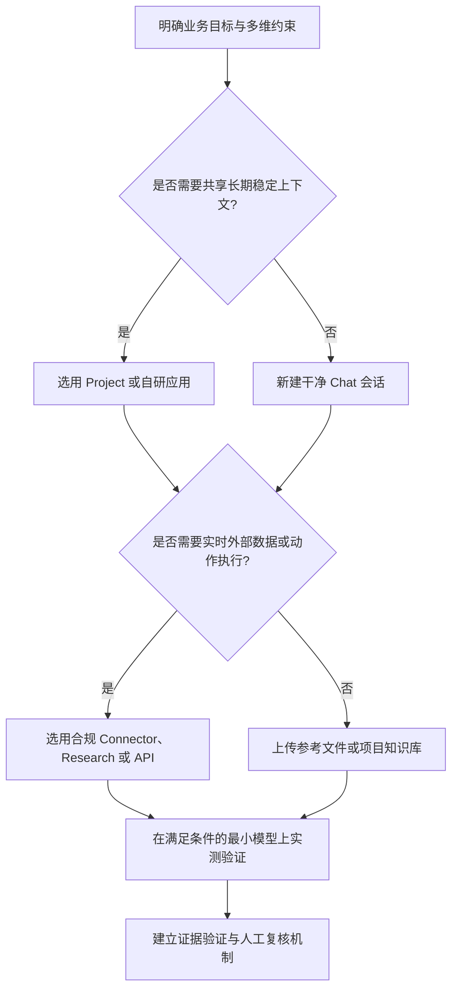

# 选用足以承载任务的最小工作界面

> 产品形态选型是知识工作层面的系统架构设计。选错工作界面会使原本正确的输出变得过时陈旧、无法审查，甚至产生不必要的昂贵开销。

**Type:** Learn
**Languages:** Python
**Prerequisites:** [考核核心是决策，而非词汇死记](../../00-certification-strategy/), [Managed LLM Platforms](../../../../../phases/17-infrastructure-and-production/01-managed-llm-platforms/)
**Time:** ~90 minutes

## 学习目标

- 在 Chat（对话）、Projects（项目）、Research（深度调研）、文件与 Artifacts、Connectors（连接器）以及编程式 API 界面之间做出精准选型。
- 脱离具体模型小版本号，深入理解 Haiku、Sonnet 与 Opus 模型家族恒定的定位与分工。
- 将产品界面与模型选型与质量、响应时延（Latency）、Token 成本、数据保鲜度以及合规治理约束全面匹配。
- 借助架构决策记录（ADR），客观对比 Anthropic 原生直接采购、Amazon Bedrock、Google Vertex AI 以及 Microsoft Foundry 等主流部署路径。
- 明确识别何时应采用 Memory（记忆）、Project Knowledge（项目知识库）或直接新建干净会话来维系上下文连续性。
- 对易变的产品功能与参数标注权威官方文档来源及核验日期。

## 问题背景

某业务运营负责人需要每周撰写一份竞品动态简报。她的操作习惯是：直接打开上周的历史会话，向输入框粘贴三个新的网页链接，要求 Claude 输出最新更新，然后顺手将结果抄送给全团队。

生成的内容表面上文采斐然、条理清晰。然而，简报中却援引了上上周旧对话中早已作废的竞品旧价格，漏掉了企业内部近期刚更新的合规政策，并且包含了一条没有任何权威信源佐证的竞品谣言。这次交付事故的根源，不在于 Prompt 的措辞技巧，而在于从一开始就选错了工作承载界面（Surface）。

历史会话沉淀了污染严重的历史脏上下文；简单复制粘贴链接无法保障信息检索的广度与严肃性；内部合规新政根本不在当前会话的知识视野内；而且整个工作流缺乏关键的事实断言验证机制。

认证考试的这一考点虽然命名为“产品与模型选型”，但其真正的核心技术内涵是**边界设计（Boundary Design）**。作为架构师，你必须精准划定：Claude 能够看什么、能够记住什么、能够检索什么、能够生成什么，以及这项任务究竟值得分配多少推理算力。

## 核心概念

### 从业务任务特征出发，而非被动浏览功能菜单

请从以下六个核心维度深入拆解并评估业务任务：

| 评估维度 | 核心架构考量 |
|---|---|
| 复发频次 (Recurrence) | 任务是一次性临时需求、周期性重复执行，还是全天候持续运转？ |
| 知识来源 (Knowledge) | 所需知识属于轻量文本、海量文件、机密私有资产，还是处于高频变动中？ |
| 保鲜度要求 (Freshness) | 昨天的知识快照在今天是否可能直接失效甚至造成误导？ |
| 输出形态 (Output) | 最终交付物是一段简短回复、严谨报告、文件表格、结构化数据，还是可复用工作流？ |
| 潜在影响 (Consequence) | 一旦生成错误或触发非预期动作，会造成何种程度的业务损害？ |
| 协同方式 (Collaboration) | 仅供单人本地自用，还是需要整个团队共同维护与共享标准上下文？ |

只有在理清上述六大维度之后，才能做出科学的工作界面选型。

### Chat：适用于边界明确的一次性会话任务

对于具有明确输入内容的一次性任务，直接新建一个干净的 Chat 会话通常是最佳默认选型。它能为你提供清爽隔离的上下文边界。非常适合用于起草文稿、创意头脑风暴、答疑解惑、对用户提供的即时文本进行转换重写，以及短篇快速分析。

然而，长期不清理的超长会话极具风险：陈旧的先验假设会在不知不觉中暗中污染新的任务输出。一旦业务目标发生偏移、上下文充斥着相互冲突的历史指令，或者你已经无法说清哪些历史消息仍在对模型产生隐性影响时，必须果断重置会话。若必须继承前序讨论结论，应在重置前提取出一份经过人工核验确认的精炼摘要进行交接（Handoff）。

会话搜索与 Memory（记忆）功能能够辅助唤起历史信息，但它们绝不能替代经过合规审批的权威真理之源（Single Source of Truth）。Memory 更适合记录用户的个人工作偏好与长期协作习惯；而公司政策、基准价目表或客户核心档案，必须托管在具备明确责任归属、定期维护与日期版本管理的制度化系统中。

### Projects：具备制度化维护的共享上下文边界

Project 功能通过整合项目系统级指令（Project Instructions）与专属知识库（Knowledge Base），将一组相关的定向会话聚合在统一边界下。当相同且稳定的上下文需要持续支撑重复性工作时（例如品牌调性规范、专项研究课题、标准作业程序 SOP 或客户交付专案），Project 是极佳的承载载体。

其核心价值不仅在于提供集中存储，更在于**流程可复用性（Repeatability）**。团队成员发起的每一个新会话，都站在预先对齐的严谨认知边界之上。

但其最大的隐患是配置老化（Stale Configuration）。若一个 Project 内沉淀了上个季度已废止的政策文件，它就会极其稳定且反复地诱发同样的业务误判。每个 Project 必须明确指定资产责任人、定期盘点知识源清单、设立周期性审查机制，并执行过期资产清理淘汰流程。

请注意：官方产品功能处于持续演进中。根据 2026 年 8 月 8 日核验的 Anthropic 官方支持文档，Project 支持内置指令与本地上传知识库，并在知识体量逼近上下文上限时自动触发检索机制（RAG）。具体可用性、容量上限与订阅计划限制，请在实践时务必查阅当前最新的官方帮助中心。

### Cowork：具备人机交互控制的任务循环体系

Cowork 是一套面向多步骤复杂知识工作的产品级交互界面，它不是独立的云部署路径，也不是本节课的硬性考纲目标。根据 2026 年 8 月 9 日核验的官方资料，Cowork 展现了一套目标驱动的任务循环机制：由用户定义最终交付目标，模型拆解实现方案，用户全程监控执行进度，并能在运行期间随时介入干预、纠偏或重新定向。Project 可为其提供持久化的文件、链接、指令规范和任务记忆；Skills（技能）负责封装可复用的标准作业流；Plugins（插件）则可进一步将 Skills、Connectors、Agents 以及生命周期 Hooks 打包整合。

当任务目标是交付一份真实的本地文件、或是需要跨多个合规授权数据源协同推进，且高度依赖人类实时把控节奏时，Cowork 能够发挥巨大价值。在此过程中，务必将本地文件访问边界收紧：官方文档明确说明本地目录访问必须限定在显式连接的白名单文件夹内，所有文件变更操作严格继承系统权限，任何永久性删除均需人类显式审批。面对高敏感数据、未经验证的第三方插件、具有重大影响的操作或大范围系统权限时，必须坚持人工逐步授权，保持密切跟进审查，切不可因为流程具备自动化能力就放弃技术责任。

### Research：适用于跨多源的深度全网调查

当任务需要大范围收集信息、并发执行多轮搜索、跨源综合分析并提供精准引用时，应当选用 Research 模式。普通的网页搜索（Web Search）更适合检索具体、狭窄的即时事实；而 Research 则擅长应对跨行业市场格局调研、多篇学术论文综述，或者将公开资讯与企业内部关联资料进行对账核实等复杂课题。

但 Research 并不会减轻人类对信源质量进行把关的审校负担。一份篇幅宏大的长篇报告，依然可能引用低权威度的二手信源、将不同时间节点的数据混为一谈，或者遗漏未公开的私有业务约束。请牢记：引用标注（Citations）只是通往原始证据的导航指针，绝不等于已证实的事实真理。

### 文件与 Artifacts：让交付输出可直观审查与沉淀

交付物形态的选型取决于其后续的流转链路。如果内容仅供阅读且阅后即弃，采用内联聊天文本即可；如果需要对比多维指标，结构化 Markdown 表格更为清晰；如果结果需要沉淀并流转到后续业务审批流中，生成可独立下载的文档或电子表格是更优解。

优秀的 Artifact 应当主动暴露核心假设、引用来源、生效日期以及尚存的不确定性。一份排版精美却刻意隐去置信度盲区的报告，其可审查性远低于一份带有明确证据溯源列的纯朴表格。

由于不同订阅级别、不同界面以及文件类型对文件生成与编辑能力的支持边界各异，在设计长期运行的自动化流水线前，务必查阅最新的官方规格说明。

### Connectors：以受控权限打通动态实时数据流

Connectors 允许 Claude 在严格授权的前提下直接检索外部服务或执行操作。当底层数据对保鲜度要求极高，且手动复制粘贴容易产生数据漂移（Drift）时，Connectors 是理想方案。

绝不能仅仅因为某个服务存在 Connector 就盲目接入。接入前必须严格核实：
- 该 Connector 是仅支持只读检索，还是具备数据写入与修改权限？
- 它具体继承了所连接用户账号的哪些细粒度访问权限？
- 每一次外部写入或变更动作，是否都需要人类显式确认审批？
- 随会话沉淀下来的数据保留策略（Data Retention）是怎样的？
- 该 Connector 是否需要组织管理员在后台全局开启白名单？
- 它所暴露的数据字段是否精准契合你的业务需要？

根据 2026 年 8 月 8 日核验的官方文档，Google Workspace Connectors 支持检索 Gmail、读取 Google Calendar 与 Drive，并要求所有关键动作必须经过用户显式确认。文档同时列明了当前尚未完全支持展示的内容边界。这些属于极易随版本演进的产品事实细节。

### 编程式 API 与代码运行环境：面向自研可控软件系统

当你需要确定性系统集成、定制化交互前端、自动化单元测试套件、代码化版本管理，或者嵌入在微服务流水线中高频重复调用时，应当果断转向 Claude API、Claude Code 或专用的 Agent 运行时环境。

切记：不要仅仅为了逃避学习配置 Project，就贸然投入大量研发资源去从零手写代码；但如果工作流需要聊天产品无法表达的强契约约束（例如强类型的 JSON 模式校验、应用层专属细粒度鉴权、或每次发版时的自动化回归评测流水线），那么自研代码化应用则是不可替代的必然选择。

### 部署路径是控制平面的架构决策

选定人机交互界面与决定 Claude 的底层计算运行托管环境，是两个完全独立的架构维度。一个 Project 可以完美充当企业内部员工的日常协作界面，而企业核心自研系统则可能同时调用托管在公有云上的企业级 API。在架构评审中，绝不能笼统用一个模糊的“Claude”将这两层抉择混为一谈。

根据 2026 年 8 月 9 日核验的 Anthropic 官方文档，企业架构评审中必须严肃对比以下四种合规部署路径：

| 部署路径 | 控制平面与采购商务链路 | 核心适用场景 | 架构决策前必须核验的事实 |
|---|---|---|---|
| Claude for Enterprise 与原生 Claude API | 由 Anthropic 官方统一管控人机交互产品控制台与第一方底层 API 基础设施。企业坐席（Seats）与直接 API 工作空间（Workspaces）分属不同消费模型。 | 组织认可直接与 Anthropic 建立商业直签合同，高度看重原生第一方新特性最快上线，且无需强制走云厂商 Marketplace 采购。 | 企业 SSO 与 SCIM 身份同步机制、坐席分配策略、API 密钥权限隔离、组织工作空间预算上限、官方数据保留协议（Data Terms）以及模型版本生命周期。 |
| Amazon Bedrock | 完全基于 AWS 原生鉴权（IAM）、统一账单、AWS 区域资源配额（Quotas）以及 AWS 托管的企业推理网络边界。 | 企业的生产级 AI 体系已经深度绑定 AWS 生态，严格依赖 AWS IAM 细粒度审计、企业统一签署的 AWS EDP 采购折扣以及合规控制基线。 | 模型访问权限申请状态、具体部署区域（Region）终端节点、功能特性差异、AWS 数据处理协议、并发吞吐配额以及所使用的具体 Bedrock API 规范版本。 |
| Google Vertex AI | 依托 Google Cloud 项目身份体系、统一 Google 结算账单，支持全球、多区域（Multi-region）或特定区域部署。 | 目标业务负载已经部署在现有的 Google Cloud Landing Zone 内，严格要求复用 GCP IAM、专属组织账单体系、Audit Logging 审计日志及数据驻留（Data Residency）要求。 | 对应区域的模型与特性支持矩阵、终端节点地理合规边界、预置吞吐容量（Provisioned Throughput）与按量计费模式权衡，以及 Google Cloud 数据隐私条款。 |
| Microsoft Foundry | 采用 Azure 原生终端节点与鉴权体系，结合 Azure Marketplace 账单划扣。官方文档同时列出 Azure 托管（Azure-hosted）与 Anthropic 托管两种承载形态。 | 组织的采购合同、Entra ID 统一身份治理、Azure RBAC 权限管理以及 Foundry 平台化治理体系已被确立为企业内部唯一合规技术路径。 | 具体的托管承载选项、部署拓扑类型、目标区域与数据驻留合规区（Data Zone）、模型与特性支持清单，以及当前生效的数据处理者条款（Processor Terms）。 |

上述四种路径不存在绝对的优劣排名，它们代表了不同的**基础设施责任归属图谱**。最优的技术决策，永远是在完全满足企业合规约束的前提下，引入最少新控制平面的路径。

对于 Anthropic 直签体系，必须清醒区分两种不同形态：Claude for Enterprise 面向企业真实员工坐席与团队知识沉淀；而第一方 Claude API 则通过组织与工作空间管控应用负载的 Token 消耗。企业员工坐席不是 API 调用配额，API 的花费上限也绝不能代替员工账号的权限治理。

此外，不同公有云合作伙伴在数据处理者（Data Processor）的法律责任划分上存在本质区别。根据 2026 年 8 月 9 日核验的官方数据保留文档：在原生 Claude API 与 Microsoft Foundry 中，Anthropic 作为数据处理者；而在 Amazon Bedrock 与 Google Cloud 中，底层公有云厂商才是法定数据处理者。同时 Foundry 还存在不同的托管形态，其责任边界必须查阅当前 Foundry 页面确认。在撰写 ADR 架构决议时，必须准确记录具体的产品型号、部署区域与承载模式，切忌笼统含糊地仅标注“AWS”或“Azure”。

### 基于量化需求评分，而非主观偏好厂商

在同云厂商谈判前，务必预先制定客观量化的评估准则：

| 评估维度 | 核心架构考量 |
|---|---|
| 云基础设施沉淀 (Cloud commitment) | 企业现有已经跑通且通过安全评审的 Landing Zone、VPC 网络隔离、集中日志湖以及专业运维支撑团队分布在何处？ |
| 商务采购渠道 (Procurement) | 采购开销是否必须冲抵已签署的云厂商长期消费承诺协议（Commitment），还是可以同 Anthropic 单独签单？ |
| 合规与数据边界 (Compliance & data boundary) | 法定数据处理者是谁？模型推理在哪个物理区域运行？是否有任何元数据流出网络边界？数据留存政策如何定义？ |
| 身份与鉴权体系 (Identity) | 人员访问是否支持 SAML/SSO 与 SCIM 自动化生命周期管理？应用负载是否支持基于角色（IAM Role）的临时联邦凭证或受限 API Key？ |
| 坐席与预算管理 (Seats and budgets) | 采购的实体是具名用户坐席、应用 Token 吞吐量、预置吞吐容量，还是混合形态？配额上限由哪个控制平面实施硬拦截？ |
| 运维运营控制权 (Operational control) | 谁负责模型白名单开通、区域配额申请、指标监控日志分析、故障应急响应、模型弃用迁移以及新特性兼容验证？ |

根据实际业务负载为各维度分配权重，逐项填写打分与简要判定理由，严密推导结论。没有理由支撑的打分只是装饰，从外部企业机械照搬的评分表更是危险的误导。

最终必须沉淀为一份正式的架构决策记录（ADR）。明确记录最终选定的路径、被否决的备选方案、预期产生的连锁技术后果以及后续触发重新评审的重估机制。由于企业云战略采购协议、数据条款或厂商产品能力会动态调整，任何已通过的决策必须附带明确的复审到期日。

### 模型家族是角色分工，而非身份地位的象征

Claude 家族各层级模型的核心角色分工长期保持稳定：

- **Haiku：** 极致追求超低延迟与低成本，适用于任务狭窄、规则高度明确、并发量巨大的高频工作负载。
- **Sonnet：** 完美平衡卓越智能、响应时延与调用成本，是绝大多数企业级专业工作流的黄金主力基准。
- **Opus：** 专为最顶尖的复杂长程推理、跨领域深度综合分析以及自主 Agent 工作流设计，仅在经过量化评估证明其显著质量提升足以抵消额外成本与耗时时选用。

具体的模型迭代代际、命名别名（Aliases）、定价明细、上下文窗口上限、单次输出 Token 阈值、思考模式（Extended Thinking）支持以及云平台支持矩阵，均会随时间推移而演变。绝不要把静态的版本矩阵当作固定知识来记忆，务必以官方实时的模型概览与定价官方文档为准。

模型选型必须依赖量化数据支撑。先在可行的最小模型上运行具有代表性的测试用例集；只有在确认已经充分优化了 Prompt 质量、完善了上下文注入并建立了健全的防御性校验，却仍然存在实质性质量瓶颈时，才考虑向上升级模型。


```mermaid
flowchart TD
    A["明确业务目标与多维约束"] --> B{"是否需要共享长期稳定上下文?"}
    B -->|"是"| C["选用 Project 或自研应用"]
    B -->|"否"| D["新建干净 Chat 会话"]
    C --> E{"是否需要实时外部数据或动作执行?"}
    D --> E
    E -->|"是"| F["选用合规 Connector、Research 或 API"]
    E -->|"否"| G["上传参考文件或项目知识库"]
    F --> H["在满足条件的最小模型上实测验证"]
    G --> H
    H --> I["建立证据验证与人工复核机制"]
```

## 动手构建

编写一份由两项紧密关联决策构成的产品选型全流程架构记录。

第一部分：针对每周竞品动态简报，完成人机工作界面的选型决策。
1. 明确目标输出：一份带权威信源附录的 2 页高管决策简报。
2. 设定保鲜度底线：公开市场资讯的发布时间不得超过 7 天；内部产品战略规划事实必须严格对应当前已通过审批的最新路线图版本。
3. 界面组合设计：选用 Research 模式负责全网大范围信息聚合，内部参考文件则通过已受控启用的 Connector 或严格维护的 Project 知识库提供。
4. 模型选型评测：在两个不同层级的模型梯队上，分别用包含 5 个真实信源的典型任务进行回归基准测试。
5. 综合量化评估：严密对比事实覆盖率、未经证实的幻觉断言数量、端到端响应耗时以及人工二次审阅耗时。
6. 设置责任机制：强制要求指定的人类业务负责人对最终报告中的全部断言签字归档。
7. 权威信源归档：对决策中涉及的每一项易变产品参数，如实记录对应的官方文档 URL 与核查日期。

在决策记录中，必须完整列出被否决的替代方案，并写出具体理由：清晰解释为什么复用旧对话会被陈旧上下文污染，以及为什么在原生产品已能满足需求的前提下盲目自研全新应用属于过早过度设计。

第二部分：针对生产级应用负载，完成一套完整的云部署决策矩阵与 ADR：
1. 在打分之前，明确业务负载特征与全部 6 项部署评估指标。
2. 全面横向对比 Claude for Enterprise 与原生 API、Amazon Bedrock、Google Vertex AI 以及 Microsoft Foundry。
3. 结合具体负载实际，为每个指标设定 1 到 5 分的业务权重。
4. 为每个参评路径在每个指标上给出 1 到 5 分的适配度打分，并逐一附带具体的判定依据。
5. 针对每条涉及平台特性的论据，提供官方最新文档链接及核验日期。
6. 自动计算综合加权得分最高者作为选定方案，并撰写包含连锁后果与重审触发条件的正式 ADR 文档。

切忌为了强行迎合主观喜好的云厂商而恶意篡改权重配比。如果某项硬性安全合规红线足以一票否决某个路径，应在打分前将其作为硬性把关门槛明确排除。

## 交互式实验

通过下方的模型适配交互图表（Model-fit figure），动态调整任务的复发频次、数据保鲜度、风险等级、团队协作规模与输出格式约束。核心目的不是寻找一个放之四海而皆准的万能界面，而是深刻观察到底是哪一项具体的硬性约束使得轻量级的简单界面彻底无法胜任。

```figure
01-claude-model-fit
```

## 实战演练

在本地运行选型打分校验器，尝试修改参数，让成本更低的小模型在某一测试关卡中挂掉，或者构造一组边界使得最简化的原生界面能够通过所有测试。尝试调整部署权重、破坏候选方案的得分逻辑，或刻意剔除附带日期的权威证据。观察推荐结论是如何完全基于客观事实证据而发生迁移，而非受制于对某款产品或云厂商的盲目偏好。

## 交付产物

`outputs/product-selection-record.json` 包含一份填报完备的实战范例：既包含针对每周竞品简报的工作界面选型结论，又包含针对某受监管金融场景 Azure 应用的云部署打分矩阵与正式 ADR。部署部分严格覆盖了当前 4 大主流路径、6 项加权评估维度、场景专属判定依据、附带核验日期的官方信源、后续架构影响以及明确的复审触发机制。

## 验证方法

在本地终端运行确定性校验脚本及其自动化测试集：

```bash
cd certifications/claude/lessons/01-claude-product-and-model-landscape/code
python3 main.py
python3 -m unittest discover tests -v
```

校验器具备严格的防御性拦截逻辑：它会自动拒绝任何未标注核验日期的产品参数、拒绝未经基准评测验证的模型选型、拦截缺少人类责任人签字的流程、拦截未阐明否决理由的决策草案、校验 4 种部署路径的完整性、检查加权算法的数学准确性、否决背离最高得分的违规 ADR，并严查官方信源凭证。在示例通过后，请将其改造为你所负责的真实业务流程。

## 项目连接

本课自测题重点考察在多维约束剧烈变动时，你是否能做出最优的产品形态与模型组合决断。所沉淀的选型决策记录将作为核心基石，直接输入到第 29 课至第 32 课的高阶毕业设计（Capstones）中，届时你必须在答辩中充分论证为何不能采用更轻量或更原生替代界面的深层理由。

## 实践应用

在启动任何实际开发工作前，建议在便签上填写这份速查决策卡：

```text
业务目标 (Outcome):
复发频次 (Recurrence):
依赖知识源与保鲜度要求 (Required sources and freshness):
数据敏感度等级 (Sensitivity):
期望交付物形态 (Output form):
流程责任人 (Human owner):
选定工作界面 (Chosen surface):
选定模型家族层级 (Chosen model family):
选定底层部署路径 (Chosen deployment path):
云厂商商务承诺与采购通路 (Cloud commitment and procurement route):
数据隔离边界与法定处理者 (Data boundary and processor):
人员坐席与应用 Token 预算划分 (Human seats versus application budget):
为何更轻量或更简单的替代方案无法满足要求 (Why smaller or simpler alternatives fail):
易变产品参数核验日期 (Changeable facts verified on):
```

如果你连关键的数据源出处和业务责任人都无法清晰定义，说明当前完全不具备开始编写 Prompt 的前置条件。

在进行模型基准选型时，务必维护一套精简的对照评测集。10 个涵盖简单、日常、模糊边界以及极易报错的高质量代表性场景，远比 1 个精心挑选的个案有用得多。核心在于客观量化小模型是否能跨过及格线，绝不可仅凭输出文本的文采风格主观定论。

## 考试决策模式

- 孤立、一次性且边界清晰的文本处理与代码转换，首选在新建的干净 Chat 会话中执行。
- 具有长期固定背景、需团队共享标准指令的周期性重复工作，坚决建立制度化维护的 Project。
- 面向大范围、动态时效、跨多个公开信息源的深度综述与对账，优先选用 Research 模式。
- 业务依赖高频变动的外部实时系统，或需直接驱动外部服务动作，优先接入合规 Connectors 或自建集成。
- 追求高可控的确定性架构、格式化数据交换、自动化测试与持续集成，坚决走编程式 API 或专业代码环境。
- 组织若已重度依赖 AWS 的企业安全规范与采购商务协议，Bedrock 通常是引入额外运维负担最小的路径。
- 组织若已深度依托 Google Cloud 的 Landing Zone 与特定区域合规控制，Vertex AI 通常是运维冲击最小的路径。
- 组织若深度绑定 Azure 采购框架、Entra ID 鉴权并已建立 Foundry 运营体系，Microsoft Foundry 是推进阻力最小的解法。
- 当组织认可与 Anthropic 商业直签，且极其看重第一方新特性的敏捷交付时，Anthropic 官方路径十分契合；但必须将员工坐席和系统 API 预算严格分开管理。
- 坚持选用经过实际量化评测满足质量底线的最小模型，绝不盲信模型的江湖声望。
- 当历史对话上下文对新任务产生潜在污染风险大于参考价值时，必须立刻重置并新建会话。

## 常见陷阱

- 图省事而长期复用同一个历史对话窗口，任由陈旧上下文反复污染输出。
- 将 Memory（记忆）误当成企业级权威数据库或单一真理源。
- 仅仅在 Project 中上传了一次文件，就理所当然地假定该知识库永远处于最新状态。
- 为一个查字典式的简单事实检索，杀鸡用牛刀地开启高耗时的 Research 模式。
- 给予 Connector 超出实际业务所需的过高修改或删除权限。
- 将当前某款模型的具体单价写死在长期的系统架构设计规范中。
- 在尚未评测 Sonnet 或 Haiku 是否已能达标之前，闭眼直接全量上线昂贵的 Opus。
- 原生开箱即用的功能界面已完全能解决问题，却盲目投入研发力量去自研多余的定制应用。
- 仅仅因为云厂商的新闻宣传通稿就拍脑袋敲定平台，完全无视后期的采购审批、身份集成与故障责任链路。
- 混淆具名员工坐席（Seats）与系统 API 调用配额，或试图用 API 消费限额去代替人员账号权限治理。
- 在架构文档中草率写下“运行在我们的内网云上”，却对具体的服务承载选项、数据处理者与地理终端节点只字不提。
- 把当下的模型版本和特性支持清单，当成永久不变的平台事实固化下来。

## 课后习题

1. 分别为一次性文案润色、企业内部政策问答知识库、跨 5 家竞争对手的市场周报以及客服工单自动分类分流四种场景选定最优工作界面，并阐明架构理由。
2. 构造两个具体场景，证明在某些特定约束下，直接上传静态文件反而比配置 Connector 更加稳妥可靠。
3. 选取 5 个具有业务代表性的测试任务，在小模型与大模型之间进行横向盲测。在执行测试前，预先写下严格的通过验收指标。
4. 对你正在使用的一个 Project 进行全面合规盘点：列出其资产负责人、是否存在陈旧过时文件、系统指令是否过于冗余，并给出下一次强制审查的明确日期。
5. 在官方帮助中心中查找一项最新的产品功能阈值限制，以附带核查日期的形式记录下来，严禁记为永久规律。
6. 为你团队的一个核心系统针对 4 种云部署路径进行定量打分，随后调大基础设施历史包袱的权重，观察并解释最终的 ADR 决议是否应当随之调整。

## 核心术语

| 术语 (Term) | 核心内涵解释 |
|---|---|
| Work surface (工作界面) | 用户或程序与大模型交互的产品边界形态，统一管控输入、上下文、工具及输出 |
| Project knowledge (项目知识库) | 专门上传并维护在特定 Project 边界内、供该项目下所有会话共享的参考文件与知识源 |
| Memory (模型记忆) | 用户可显式查看与删除的长期个性化记忆机制，与系统权威数据库存在本质区别 |
| Connector (外部连接器) | 在严格细粒度权限控制下，连通外部业务系统与数据源的受控双向集成组件 |
| Research (深度调研) | 具备自动多步信息检索、跨源交叉对比、逻辑综合提炼并标注引用的复合工作模式 |
| Smallest sufficient capability (最小充分能力) | 在完全满足所有量化指标与业务约束的前提下，复杂度最低、成本最优的界面与模型选型原则 |
| Deployment path (部署路径) | 企业最终采购、鉴权接入并运维托管大模型基础设施的商业与技术通路 |
| Control plane (控制平面) | 集中管理身份鉴权、合规策略、计费限额、资源配额及运维监控的核心管理系统 |
| Architecture decision record (ADR, 架构决策记录) | 结构化记录重大技术决策背景、备选方案优劣对比、最终决议、预期后果及重审触发条件的正式工程文档 |

## 延伸阅读

- [Claude 模型家族官方全景概览](https://platform.claude.com/docs/en/about-claude/models/overview)
- [API 鉴权与访问控制指南](https://platform.claude.com/docs/en/manage-claude/authentication)
- [Workspaces 多租户工作空间管理规范](https://platform.claude.com/docs/en/manage-claude/workspaces)
- [企业级单点登录 (SSO) 配置指南](https://support.claude.com/en/articles/13132885-set-up-single-sign-on-sso)
- [Claude Enterprise 消费限额与预算管控](https://platform.claude.com/docs/en/manage-claude/spend-limits-api)
- [官方 API 与数据留存安全政策](https://platform.claude.com/docs/en/manage-claude/api-and-data-retention)
- [在 Amazon Bedrock 中使用 Claude](https://platform.claude.com/docs/en/build-with-claude/claude-in-amazon-bedrock)
- [在 Google Cloud Vertex AI 中使用 Claude](https://platform.claude.com/docs/en/build-with-claude/claude-on-vertex-ai)
- [在 Microsoft Foundry 中使用 Claude](https://platform.claude.com/docs/en/build-with-claude/claude-in-microsoft-foundry)
- [什么是 Claude Projects？产品功能全解](https://support.claude.com/en/articles/9517075-what-are-projects)
- [Claude Cowork 快速入门手册](https://support.claude.com/en/articles/13345190-get-started-with-claude-cowork)
- [Claude Cowork 安全合规使用规范](https://support.claude.com/en/articles/13364135-use-claude-cowork-safely)
- [在 Claude 中高效使用 Skills](https://support.claude.com/en/articles/12512180-use-skills-in-claude)
- [安装与配置 Cowork 插件体系](https://claude.com/docs/cowork/guide/plugins)
- [何时选用网络搜索、深度思考与 Research 模式](https://support.claude.com/en/articles/11095361-when-should-i-use-web-search-extended-thinking-and-research)
- [利用 Connectors 扩展 Claude 外部能力](https://support.claude.com/en/articles/11176164-use-connectors-to-extend-claude-s-capabilities)
- [Google Workspace Connectors 深度配置指南](https://support.claude.com/en/articles/10166901-use-google-workspace-connectors)
- [上下文工程 (Context Engineering) 核心实践](../../../../../phases/11-llm-engineering/05-context-engineering/)
- [生产级模型动态路由 (Model Routing) 架构](../../../../../phases/17-infrastructure-and-production/16-model-routing/)
