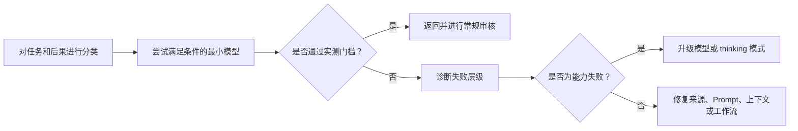

# 在失败代价高昂之处投入能力

> 模型选择不是排名练习，而是在质量、延迟、上下文和成本之间进行分配的问题。

**Type:** Learn
**Languages:** Python
**Prerequisites:** [选择能够承载工作的最小 Surface](../../01-claude-product-and-model-landscape/), [缓存、速率限制与成本优化](../../../../../phases/11-llm-engineering/11-caching-cost/)
**Time:** ~90 分钟

## 学习目标

- 在不依赖背诵价格表的情况下估算 Token 和工作流成本。
- 使用实测的质量、延迟和后果选择模型。
- 解释 Sampling 的非确定性，以及为什么发布声明需要重复评估。
- 仅在核验当前模型和平台后选择 speed、effort 和 thinking 设置。
- 区分模型失败与 Prompt、上下文、来源和工作流失败。
- 将路由、缓存、批处理和输出限制作为不同的优化杠杆使用。

## 问题

一个支持团队将每个请求都路由到能力最强的模型。第一个月看起来很成功。质量很高，但响应时间不稳定，账单是预测值的四倍。

经理的应对方式是把所有请求都迁移到最快的模型。成本下降了。现在，升级摘要会遗漏例外情况，复杂退款案例收到的建议虽然自信，却并不完整。

这两种设计都将模型名称当作政策，却都没有描述实际工作。

生产决策始于失败的代价。内部头脑风暴中的一个拼写错误代价很低。退款决策中遗漏一个例外情况的代价则更高。模型、Prompt、上下文、来源质量和审核流程应当反映这种差异。

## 概念

### Token 是工作负载的度量单位

模型处理的是 Token，而不是页面或单词。输入 Token 包括指令、对话历史、提供的文档、工具定义和检索到的内容。输出 Token 包括响应，以及根据产品或 API 的不同，由当前定价说明的与推理相关的计算量或其他计费单位。

在规划时，将输入分为四类：

```text
总输入 = 稳定指令 + 任务输入 + 检索到的知识 + 之前的轮次
总输出 = 请求的答案 + 结构化元数据
```

不要将所有输入隐藏在一个数字中。稳定指令可能受益于缓存。检索到的知识可以裁剪。之前的轮次可以总结或丢弃。任务输入通常无法移除。

### 使用实时价格前先使用变量

价格会变化。持久有效的公式不会变化：

```text
请求成本 = input_tokens / 1,000,000 x input_rate
         + output_tokens / 1,000,000 x output_rate
         + 工具或功能费用
```

对于一个工作流：

```text
工作流成本 = 请求成本 x 每个案例的请求数 x 每月案例数
           + 审核成本
           + 失败与返工成本
```

审核和返工很重要。如果一个更便宜的模型造成两倍的人工作业修正量，它可能反而是更昂贵的选择。

考虑一个仅用于说明、并非当前价格的费率表。模型 A 的输入成本为 1 个单位，输出成本为 5 个单位。模型 B 分别为 3 个和 15 个单位。一个案例使用 20,000 个输入 Token 和 2,000 个输出 Token。模型 B 每次调用的成本是模型 A 的三倍。如果模型 A 能通过 98% 的分诊案例，并且可以检测出困难案例，就将普通工作路由到 A，并升级其余不确定案例。如果无法安全地检测困难案例，那么路由设计就是不完整的。

### 质量需要门槛，而不是感觉

在测试模型之前，先定义最低可接受结果。实用的维度包括：

- 必需事实齐全。
- 不含无依据的主张。
- 遵循指令。
- 输出 schema 有效。
- 延迟低于工作流限制。
- 人工修正时间低于阈值。
- 保留安全和隐私控制。

最佳模型是能够以足够余量通过所有必要门槛的最低成本选项。只有平均质量是不够的。一个模型可能总体得分很高，却在每个高后果边缘案例上失败。

### Sampling 产生的是分布，而不是重放

在每个生成的 Token 上，语言模型都对可能的后续内容有一个概率分布。Sampling 从该分布中进行选择。对于接受 temperature 设置的模型，该设置会改变分布的集中程度，但不会让模型推理变成确定性函数。

Anthropic 官方 API 文档指出，即使 temperature 为零，也并非完全确定。相同请求通过第一方 API 和合作伙伴云也可能产生不同结果。固定的模型 ID 可以稳定模型权重，但 Anthropic 的模型版本文档也指出，路由、安全分类器和 Sampling 逻辑等服务基础设施仍可能发生变化。

这改变了证据的认定方式：

- 一次通过的响应只能证明该次响应通过了。
- 一个平均值会掩盖尾部失败和不同运行之间的变化。
- 确定性 validator 可以检查 schema 和算术，但无法让生成变得确定。
- 对同一个有版本记录的任务进行重复试验，可以揭示最低质量、方差、严重失败和尾部延迟。
- 模型、Prompt、工具、平台或服务模式发生变化时，需要重新进行比较。

对于小型学习练习，每个配置至少进行三次独立运行。生产环境的样本量必须由观察到的风险和方差决定，而不是由这个最低要求决定。分别比较不同风险切片，并优先采用最低关键案例质量和 p95 延迟等门槛，而不是一个漂亮的平均值。

Sampling 控制本身也是可变的产品事实。截至 2026 年 8 月 9 日核验，当前 Anthropic Messages 指南指出，Claude 4.7 及更高版本会拒绝非默认的 `temperature`、`top_p` 或 `top_k` 值。仍受支持的旧模型可能继续接受其中一些设置。在未检查当前模型和平台文档前，绝不要从旧请求中复制 Sampling 设置。

### 诊断失败所在的层级

当输出表现不佳时，应判断失败源自何处：

1. **需求失败：** 从未定义成功标准。
2. **来源失败：** 缺少必要事实，或事实已经过时。
3. **上下文失败：** 相关证据被掩埋、截断，或与相互冲突的材料混合。
4. **Prompt 失败：** 指令或输出标准不明确。
5. **模型失败：** 即使输入和标准良好，模型仍缺乏所需能力。
6. **工作流失败：** 缺少审核、升级或工具行为。

升级模型主要有助于解决第五层问题。它可能暂时掩盖其他层的问题，从而使系统更难调试。

### 延迟包含多个组成部分

用户感受到的不只是总体墙钟时间：

- 首次出现可见输出前的时间。
- 流式数据块之间的时间。
- 总生成时间。
- 工具和检索时间。
- 人工审批时间。

能力更强的模型可能每次调用耗时更长，但能减少重试次数。较小的模型可能响应很快，却会产生更多循环。应衡量完整工作流。

### 按照可观测约束进行路由

一个简单的路由政策可以将工作分为三个通道：

| 通道 | 示例 | 政策 |
|---|---|---|
| 常规 | 格式化提供的更新 | 快速模型，严格模板 |
| 模糊 | 比较相互冲突的备注 | 均衡模型，要求提供来源 |
| 高后果 | 建议一项例外 | 高能力模型加上强制审核 |

分类器本身也可能失败。尽可能使用确定性信号：文档长度、任务类型、敏感度标签、请求的操作或用户的明确选择。记录路由决策并审核错误路由。



### 缓存、批处理和限制解决不同问题

**Prompt caching** 可以在当前模型和平台支持时，降低重复处理稳定 Prompt 前缀的成本和延迟，但它无法让过时的指令变得正确。

**Semantic caching** 会为足够相似的请求复用先前结果。它需要新鲜度政策，并且对于个性化、快速变化或高后果的工作存在风险。

**Batch processing** 用响应时间换取成本和吞吐量。它适合夜间分类或批量提取等离线工作，不适合需要用户等待的交互式工作。

**输出限制** 可以防止不必要的冗长响应。如果设置低于任务要求，也会截断工作。应请求最小但有用的输出，并验证其完整性。

**上下文裁剪** 会在无关输入产生计费并干扰模型之前将其移除。更多上下文并不等于更多知识。

### 配置是一个带日期的组合

模型选择只是配置杠杆之一：

| 杠杆 | 它改变什么 | 衡量什么 |
|---|---|---|
| 模型 | 基础能力、价格、支持的功能和生命周期 | 按风险切片划分的质量、成本、延迟、兼容性 |
| Speed | 支持 fast mode 时的服务速度，通常伴随价格溢价 | 每秒输出 Token 数、首个 Token 时间、p95 延迟、可接受结果成本 |
| Effort | 在支持时，模型在文本、thinking 和工具使用中投入的工作量和 Token 消耗 | 质量、工具调用次数、输出 Token、延迟、成本 |
| Thinking | 在支持时，模型是否以及如何分配显式推理 | 困难案例质量、thinking Token、总输出、延迟、成本 |
| Prompt 和输出契约 | 指令、证据边界、格式和请求长度 | 指令遵循情况、schema 有效性、修正时间 |
| Sampling | 仍接受随机性控制的模型生成设置 | 结果变化、严重失败、风格多样性 |

截至 2026 年 8 月 9 日核验，官方模型概览将 `claude-sonnet-5` 和 `claude-opus-5` 列为准确的 Claude API ID。Sonnet 5 默认启用 adaptive thinking，接受 disabled thinking，并支持产物中使用的 low 和 high effort 值。Opus 5 接受 adaptive thinking 和产物中使用的 medium effort 值。

Fast mode 的适用范围更窄。当前官方文档列出了 Opus 5 和 Opus 4.8，而非 Sonnet 5，并将该功能限制在 Claude API，包括 Managed Agents，而不包括合作伙伴平台。它是一项需要访问权限的 research preview，要求设置 `speed: "fast"` 并添加 `anthropic-beta: fast-mode-2026-02-01` header。它使用相同模型提供更快推理和溢价定价，并不承诺更高的智能水平。可用性、支持情况和价格可能各自独立变化。

不要在路由代码或学习笔记中构建永久兼容性 Matrix。每次实验前：

1. 记录准确的模型 ID 和平台。
2. 打开当前官方页面，检查模型支持、thinking、effort、speed 和定价。
3. 为每个候选配置标记带日期和来源的 `docs-supported` 或 `docs-unsupported`。文档支持并不能证明你的账户拥有 preview 访问权限。
4. 不要试验不受支持的组合，也不要假定它会静默回退。
5. 在相同任务集和门槛上重复运行受支持的配置。

在平台允许时，每次只改变一个杠杆。如果支持情况迫使你同时更改模型和 speed，应将其称为一种路由替代方案，而不是证明结果仅由 speed 导致。

### 缩放考试分数不是百分比

截至 2026 年 8 月 9 日核验，Anthropic 认证 FAQ 指出，成绩采用 100 至 1,000 的缩放分数，最低及格分数为 720。缩放用于对难度可能不同的考试卷进行等值处理。

因此，720 绝不能作为原始及格线为 72% 正确率的证据。本课程的测验和模拟考试百分比是原始练习分数。它们无法转换为官方缩放分数，也不能预测考试结果。

## 手动构建

为每周运营工作流创建一个包含十个案例的模型选择 benchmark。

- 四个常规格式化和 Classification 案例。
- 三个模糊的综合案例。
- 两个包含相互冲突来源材料的案例。
- 一个必须升级给人工处理的高后果案例。

在运行任何模型前定义 rubric：

```json
{
  "required_facts": 4,
  "unsupported_claims_allowed": 0,
  "format_valid": true,
  "latency_seconds_max": 20,
  "human_correction_minutes_max": 3,
  "consequential_case_must_escalate": true
}
```

首先测试可能适用的最小模型系列。记录输入和输出 Token、延迟、rubric 分数和修正时间。只升级失败的案例。将路由工作流与把全部十个案例都发送给更大模型的做法进行比较。

你的报告必须回答：

- 哪些案例可以安全使用较小的模型？
- 哪种可观测信号会将案例向上路由？
- 哪些失败不是模型失败？
- 在示例工作量下，路由可以节省多少成本？
- 当 router 无法确定时会发生什么？

然后为一个模糊或高后果案例创建 mode-trials 产物：

1. 在查看结果前，定义最低质量、最大 p95 延迟、最大平均成本和最少重复运行次数。
2. 提出至少三个在 speed、effort 或 thinking 上存在差异的配置。
3. 在当前官方文档中核验每一个准确的模型和平台组合。保留一个文档明确不支持的组合作为被拒绝的选项。
4. 使用相同 Prompt、来源、工具和评分 rubric，将每个受支持的配置至少运行三次。
5. 记录每次运行的质量、延迟、成本和结果 fingerprint。
6. 根据原始运行结果核对最低质量、p95 延迟和平均成本。
7. 选择通过所有门槛且成本最低的受支持配置。

提供的产物比较了一个模型上的 low 与 high effort、adaptive 与 disabled thinking、standard 与 fast 服务方式，以及一个不受支持的 fast 组合。其中的 `standard` speed 是表示省略请求字段的规范化实验标签。其 fast 配置则单独记录了所需的 preview 访问权限、请求字段和 beta header。这是一个带日期的示例，不是可复用的兼容性表，也不能证明账户具有相应权限。

## 交互式实验

使用风险图调整后果、不确定性、可逆性和审核强度。它能在优化 Token 消耗前，让错误通过的隐藏成本变得可见。

```figure
02-responsible-ai-risk
```

## 实践实验

运行十案例路由 benchmark。修改一个高后果案例，使其跳过审核、复制案例 ID，或错误陈述路由成本，并观察确定性验证失败。然后删除一次重复的 mode 运行、更改核对后的 p95 值、尝试文档明确不支持的 mode，或选择一个未通过成本门槛的配置。修复证据，而不是放宽门槛。

## 交付产物

`outputs/model-routing-benchmark.json` 保留了涵盖常规、模糊、来源冲突和高后果工作的十案例路由契约。其中包括实测门槛、选定通道、Token 估算、审核时间，以及路由方案与所有案例都使用更大模型方案之间的比较。

`outputs/mode-trials.json` 是应用配置产物。它记录当前文档证据、speed、effort、thinking、fast-mode 请求前提、重复运行质量、p95 延迟、平均成本、不受支持的组合、选定的 mode 和重新运行触发条件。

支持声明均基于官方文档并带有日期，其状态使用 `docs-supported`，而非 live-request-verified。质量、延迟和成本值是说明性练习数据，并非 provider 运行或 benchmark 结果。请使用你自己的任务集和账户所得的重复运行结果替换它们。

## 验证

在不调用 provider 的情况下验证 benchmark：

```bash
cd certifications/claude/lessons/02-model-selection-and-token-economics/code
python3 main.py
python3 -m unittest discover tests -v
```

validator 会保留原始 benchmark 检查，并单独验证 mode trials。它要求提供当前官方支持证据、明确的说明性测量标签、fast-mode 请求前提、每个 `docs-supported` mode 至少三次重复运行、观测到的结果 fingerprint、核对后的摘要、一个未经尝试的 `docs-unsupported` 选项，以及选择成本最低且通过门槛的配置。它不会硬编码任何关于未来哪个模型支持哪种 mode 的声明。

## Capstone 关联

测验会检验路由、失败层级诊断和成本推理。将经过验证的 benchmark 用作 Capstone 29 至 32 中的模型选择证据，然后使用你自己的代表性案例结果替换说明性测量值。

## 实际应用

使用以下决策语句：

```text
对于[任务类别]，选择[模型系列或 mode]，因为它在[重复运行次数]中通过了
[质量门槛]，并满足[p95 延迟和平均成本限制]。当[可观测条件]出现时进行升级，
并在达到[后果阈值]时要求执行[审核规则]。
已于[日期]在官方文档中检查模型、平台、speed、effort 和 thinking 支持情况。
```

如果你的理由只是“它更智能”，那么这项决策还没有完成。

运行 benchmark 前，请查看实时模型概览和定价页面。将准确的模型标识符保存在 benchmark 结果中，而不是不随时间变化的政策中。这可以防止模型别名的变化在不易察觉的情况下使证据失效。

将不受支持的配置保留在决策记录中，而不要放进生产请求。拒绝这些配置的原因解释了为什么没有测试某个看似诱人的 mode，并为未来的重新核验建立了明确触发条件。

## 考试决策模式

- 在为更多能力付费前，先修复缺失的标准、来源和上下文。
- 使用能够通过代表性质量门槛的最小模型。
- 将人工修正和失败成本纳入考虑，而不只是 Token 价格。
- 使用可观测信号将高后果或模糊工作向上路由。
- 仅在工作流能够容忍延迟完成时使用 Batch。
- 仅在新鲜度和隔离条件允许时缓存稳定且可复用的材料。
- 将模型功能、定价和限制视为带日期的事实。
- 重复进行概率性评估；较低的 temperature 或固定模型 ID 并不能保证输出相同。
- 将 speed、effort 和 thinking 作为需要衡量的配置选择进行比较，而不是将其视为等级。
- 将 720 视为缩放认证分数，绝不能视为原始百分比。

## 常见陷阱

- 根据模型系列的声誉而不是任务 benchmark 做出选择。
- 只用一个简单示例比较模型。
- 报告平均质量，却隐藏关键案例失败。
- 将每个不良输出都称为模型限制。
- 不断添加上下文，导致成本与干扰同时上升。
- 在底层来源发生变化后继续复用缓存输出。
- 从成本模型中遗漏审核时间。
- 使用不透明且没有审计记录的分类器进行路由。
- 因为一次运行通过或 temperature 较低，就宣称 Prompt 是确定性的。
- 从不同模型或平台复制 speed、effort、thinking 或 Sampling 设置。
- 对不受支持的 mode 进行静默降级，而不是以关闭方式失败并记录不兼容情况。
- 比较平均延迟，却隐藏违反用户目标的尾部延迟。
- 将 720 的缩放考试门槛转换成原始 72% 的目标。

## 练习

1. 使用符号计算一个包含 50,000 个案例和两个模型层级的工作流月度成本。
2. 为支持工作流编写三个确定性路由信号。
3. 将五个失败诊断为需求、来源、上下文、Prompt、模型或工作流问题。
4. 找出一项应使用 Batch processing 的任务，以及一项必须保持交互式的任务。
5. 在官方文档中核验一项当前 thinking 功能，并记录模型、平台和日期。
6. 将一个配置运行三次，保留结果 fingerprint，并解释单次运行会隐藏什么。
7. 在官方文档中找到一个当前不受支持的 mode 组合，记录它但不要发送请求。

## 关键术语

| 术语 | 含义 |
|---|---|
| Token economics | 输入、输出、请求量、模型费率和工作流成本之间的关系 |
| Quality gate | 候选配置必须通过的可衡量阈值 |
| Routing | 根据任务信号选择模型或执行通道 |
| Escalation | 将不确定或高后果工作交给能力更强的模型或人工审核 |
| Prompt caching | 为稳定的 Prompt 材料复用 provider 端计算 |
| Rework cost | 修正不合格输出所需的人工或机器工作量 |
| Sampling | 从模型概率分布中选择生成的 Token |
| Mode trial | 对一个准确的模型、平台、speed、effort 和 thinking 配置进行带日期的重复评估 |
| Tail latency | p95 等高百分位延迟指标，可揭示被平均值隐藏的慢请求 |
| Scaled score | 用于对不同考试卷进行等值处理的转换后考试结果，而不是原始正确率百分比 |

## 延伸阅读

- [模型概览](https://platform.claude.com/docs/en/about-claude/models/overview)
- [Create a Message API 参考](https://platform.claude.com/docs/en/api/messages/create)
- [使用 Messages](https://platform.claude.com/docs/en/build-with-claude/working-with-messages)
- [模型 ID 与版本管理](https://platform.claude.com/docs/en/about-claude/models/model-ids-and-versions)
- [Claude Sonnet 5 新功能](https://platform.claude.com/docs/en/about-claude/models/whats-new-sonnet-5)
- [Claude Opus 5 新功能](https://platform.claude.com/docs/en/about-claude/models/whats-new-opus-5)
- [Claude 定价](https://platform.claude.com/docs/en/about-claude/pricing)
- [Thinking](https://platform.claude.com/docs/en/build-with-claude/thinking)
- [Effort](https://platform.claude.com/docs/en/build-with-claude/effort)
- [Fast mode](https://platform.claude.com/docs/en/build-with-claude/fast-mode)
- [Prompt caching](https://platform.claude.com/docs/en/build-with-claude/prompt-caching)
- [Batch processing](https://platform.claude.com/docs/en/build-with-claude/batch-processing)
- [Anthropic 认证 FAQ](https://anthropic-partners.skilljar.com/page/faq-certifications)
- [缓存、速率限制与成本优化](../../../../../phases/11-llm-engineering/11-caching-cost/)
- [Prompt 与 Semantic Caching 的经济性](../../../../../phases/17-infrastructure-and-production/14-prompt-semantic-caching/)
- [将模型路由用作降低成本的基本方法](../../../../../phases/17-infrastructure-and-production/16-model-routing/)
