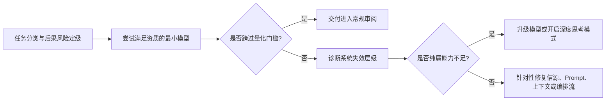

# 将强推理能力投入在失败代价高昂的关键处

> 模型选型绝非简单的跑分天梯榜排序，而是在输出质量、响应时延、上下文容量以及 Token 成本之间进行的全局资源分配。

**Type:** Learn
**Languages:** Python
**Prerequisites:** [选用足以承载任务的最小工作界面](../../01-claude-product-and-model-landscape/), [Caching, Rate Limiting and Cost Optimization](../../../../../phases/11-llm-engineering/11-caching-cost/)
**Time:** ~90 minutes

## 学习目标

- 脱离死记硬背的具体价格表，建立对 Token 消耗与工作流总体拥有成本（TCO）的严密估算模型。
- 基于实测质量、端到端时延（Latency）以及业务失败后果的严重程度进行科学的模型选型。
- 深刻理解采样概率分布的非确定性（Non-determinism），以及为何生产级评估必须基于多次重复实验。
- 在查验当前模型与平台最新官方文档的前提下，合理配置 Speed（推理加速）、Effort（思考努力程度）与 Thinking（深度思考）等运行参数。
- 准确剖析系统失效层级，将模型推理能力不足与 Prompt 缺陷、上下文污染、数据源陈旧及工作流缺失清晰剥离开来。
- 将动态路由（Routing）、Prompt 缓存（Caching）、离线批处理（Batching）以及输出长度截断作为相互独立的成本优化抓手。

## 问题背景

某客户支持团队将收到的每一笔客服工单，全部无脑路由至当前性能最强、单价最贵的大模型。在第一个月，项目看似大获成功：回复质量上乘，满意度颇高；然而，系统响应耗时极度不稳定，月底的 API 账单金额更是直接超出预算预期的整整四倍。

业务主管急躁地采取了一刀切的补救手段：将所有业务流量立刻强行切换至体积最小、速度最快的轻量模型。账单成本确实应声暴跌，但代价极其惨重：工单上报摘要中遗漏了大量关键的异常限制条件，复杂的资金退款争议更是得到了语气极其肯定却遗漏了退款细则条款的错误解答。

这两种极端做法本质上都是把“模型型号代号”直接当成了治理策略，完全脱离了对具体工作负载本质特征的解构。

生产环境的工程决策必须从**“业务失败的代价（Cost of Failure）”**切入。企业内部头脑风暴草稿里出现一个错别字，其纠错成本几乎为零；但在正式退款审计仲裁中遗漏一项例外条款，其潜在业务损失与合规处罚则极为昂贵。系统底层的模型梯队、提示词工程、上下文质量、事实信源纯度以及人工复核闭环，都必须精准映射并反映这一核心风险差异。

## 核心概念

### Token 是工作负载的基本度量衡

大语言模型处理的是 Token，而非人类直观看到的排版页数或自然单词。系统消耗的输入 Token（Input Tokens）包括：系统级指令、多轮历史对话、外部注入的参考文件、工具定义元数据（Tool Definitions）以及检索增强返回的文本块；而输出 Token（Output Tokens）则包含最终返回给用户的文本内容，以及根据不同 API 协议或运行时环境计费的隐式思考推理 Token（Thinking Tokens）。

在规划系统容量时，请将输入与输出严格拆解为四个独立核算桶：

```text
总输入 Token = 静态稳定指令 + 任务即时输入 + 动态检索知识 + 历史多轮上下文
总输出 Token = 期望目标回复 + 结构化元数据
```

绝不可将所有输入笼统归纳为一个粗暴的数字。静态的系统指令最适合通过 Prompt Caching（提示词缓存）大幅压降成本；动态检索回来的知识片段应当经过相关性重排剪枝；历史轮次会话应当定期总结或直接丢弃；只有当前任务的具体即时输入才是不可删减的硬开销。

### 建立参数化成本方程，而非死记变动的单价

API 定价随时可能下调或变动，但底层的经济学公式长久不变：

```text
单次请求成本 = (输入 Token 数 / 1,000,000) x 输入单价
             + (输出 Token 数 / 1,000,000) x 输出单价
             + 额外工具或专项功能附加费
```

而映射到宏观业务工作流的整体成本方程为：

```text
业务工作流总成本 = 单次请求成本 x 单个案例平均调用次数 x 每月案例总数
                 + 人工复核审查成本
                 + 失败重跑与人工纠错补偿成本 (Rework Cost)
```

人工复核与返工成本至关重要。选用单价便宜但错误率高的小模型，如果导致人工纠错成本暴增一倍，其综合总成本往往反而远超直接选用高精度模型。

看一个说明性示例（非实时价格）：假定模型 A 的输入单价为 1 单位，输出单价为 5 单位；模型 B 的单价分别为 3 与 15 单位。某类工单平均消耗 20,000 输入 Token 与 2,000 输出 Token，模型 B 的单次调用成本恰好是模型 A 的 3 倍。如果评测证明模型 A 在 98% 的常规分类场景下均能稳定达标，且系统具备精准识别疑难边缘案例的能力，那么最佳策略显然是将绝大多数流量路由给 A，仅将小部分疑难请求升级给 B；反之，若系统缺乏可靠的边缘案例识别能力，这种盲目路由就会引入巨大的质量崩盘风险。

### 质量需要明确量化的门槛，而非模糊的主观感受

在对模型进行横向对比前，必须预先确立不可妥协的及格线。推荐的度量维度包括：
- 核心必备事实的覆盖完备度。
- 完全杜绝未经证实的虚构断言（幻觉断言数为 0）。
- 严格遵循指令约束（格式、字数、语域）。
- 结构化输出 Schema 100% 校验合法。
- 端到端响应延迟低于系统规定的 SLA 阈值。
- 人工后续介入修改耗时低于预设时间上限。
- 安全隐私与红线合规规则得到完整保留。

最优的模型，永远是**在留有足够安全冗余的前提下、能够稳定跨过上述所有硬性指标的最便宜选型**。切忌仅看平均分：一个平均分看似亮眼的模型，可能在所有高风险核心边缘案例上全面溃败。

### 采样产生的是概率分布，而非确定性重放

在生成每一个后续 Token 时，大语言模型计算出的都是所有候选词的概率分布。所谓的解码采样（Sampling）正是从该分布中抽取下一个词。在支持 Temperature 调节的模型上，调节 Temperature 只是改变了概率分布的平滑平坦程度，它绝不可能将一个概率采样过程变成传统软件意义上的纯确定性函数。

Anthropic 官方 API 文档明确指出：即使将 `temperature` 显式设为 0，也不保证输出具备 100% 的确定性。在第一方 API 或公有云托管环境中，完全相同的请求在不同时间依然可能产生存在微小差异的输出。尽管固定模型版本 ID（如 pinning model ID）能够稳定底层模型权重，但官方文档同样提醒：底层的集群服务基础设施（如负载均衡路由、前置安全过滤分类器、以及采样底座调度逻辑）依然会发生环境微调。

这一物理客观事实彻底颠覆了工程评估的证据标准：
- 单次跑通一次用例，仅能证明该用例在该特定时刻成功了一次，绝不代表系统可靠。
- 单纯计算平均分往往掩盖了极端的长尾崩溃（Tail Failures）以及不同运行轮次间的巨大方差。
- 确定性断言代码能够校验 JSON Schema 和数学运算，但无法消除模型生成文本本身的随机波动。
- 针对固定版本测试集的**多次独立重复实验**，才能揭示系统最低质量底线、方差波动、致命错误率及 p95 长尾延迟。
- 只要模型型号、Prompt、集成工具、云平台底座或推理服务模式发生任何变更，所有基准对比必须从头重新跑一遍。

对于学习型实验，每套配置至少执行 3 次独立重复测试；而在真实生产环境中，采样样本量必须严格取决于业务容错率与实测方差。务必将高危风险切片独立评测，优先考核最严苛案例的底线表现与 p95 延迟，而不是陶醉在单次理想的平均值中。

此外，采样控制参数本身属于易变的产品事实。根据 2026 年 8 月 9 日核验的官方 Messages API 指南：Claude 4.7 及更高代际模型已严格禁止自定义传入非默认的 `temperature`、`top_p` 或 `top_k` 参数；而部分旧版受支持模型可能仍兼容这些字段。绝不可将旧项目代码中的采样参数盲目复制到针对新模型的请求中。

### 系统性诊断失效层级

当模型生成的内容不及预期时，请依照以下 6 个层级逐级排查根因：

1. **需求定义失效 (Requirement failure)：** 业务目标模糊，根本没有明确定义何为合格输出。
2. **知识源失效 (Source failure)：** 依赖的关键事实在提供的数据源中本身就残缺、错误或已过期。
3. **上下文失效 (Context failure)：** 核心证据被海量无关冗余淹没、因窗口超限被截断，或混杂了自相矛盾的上下文。
4. **提示词失效 (Prompt failure)：** 任务指令含糊不清，输出格式与判别边界缺乏规范。
5. **模型能力失效 (Model failure)：** 在输入数据与考核标准完全充分完备的前提下，模型本身的认知推理能力确实无法攻克难题。
6. **工作流编排失效 (Workflow failure)：** 流程中缺乏必要的人工复核、分流升级机制，或外部工具调用逻辑设计缺陷。

无脑升级更高级的大模型，本质上只能改善第 5 层的“模型能力失效”。在前面几层存在硬伤时强行换大模型，往往只是用昂贵的算力暂时掩盖系统缺陷，反而会让系统的根本 Bug 变得更加难以定位。

### 延迟包含多个不同物理组成部分

在用户体验维度，真实的延迟绝非仅仅是秒表记录的端到端总时间，它包含：
- TTFT（Time to First Token，首字输出耗时）。
- Token 流式传输吞吐速率（Tokens per second）。
- 模型完整生成结束耗时。
- 外部工具执行与向量数据库检索往返耗时。
- 工作流中等待人工审批的操作耗时。

能力更强的大模型单次调用耗时可能更长，但它往往能一次性成功，减少由于格式错误引发的自动重试；小模型单次秒级响应，却可能频繁因为解析崩溃陷入死循环。必须以端到端整套工作流的最终完成时间进行综合考量。

### 基于可量化观测的确定性特征进行动态路由

一个健全的分流策略通常将业务负载划分为三条泳道：

| 业务泳道 | 典型任务场景 | 对应的分流治理策略 |
|---|---|---|
| 常规例行 (Routine) | 针对输入文本进行结构化清洗与格式转换 | 选用超快轻量模型，搭配严苛的模板校验 |
| 边界模糊 (Ambiguous) | 对多份存在微小分歧的会议纪要进行综合提炼 | 选用平衡型主力模型，强化信源一致性交叉校验 |
| 后果重大 (Consequential) | 推荐高风险资金垫付或破格审批例外项 | 选用最强推理模型，且必须引入强制人工复核关卡 |

分流器（Classifier）本身也是有出错概率的。尽可能优先采用**确定性物理信号**作为路由判定依据：如文档字节大小、预定义的业务任务标签、数据安全密级、所调用的具体外部动作，或由前端用户显式下拉选择。系统必须对路由决策进行全量日志归档，并对路由偏差进行定期审计。


```mermaid
flowchart LR
    A["任务分类与后果风险定级"] --> B["尝试满足资质的最小模型"]
    B --> C{"是否跨过量化门槛?"}
    C -->|"是"| D["交付进入常规审阅"]
    C -->|"否"| E["诊断系统失效层级"]
    E --> F{"是否纯属能力不足?"}
    F -->|"是"| G["升级模型或开启深度思考模式"]
    F -->|"否"| H["针对性修复信源、Prompt、上下文或编排流"]
```

### 缓存、批处理与输出截断解决的是截然不同的工程问题

- **Prompt 缓存 (Prompt Caching)：** 在模型与底层云平台支持的前提下，对高频复用的长静态提示词前缀免去重复计算，大幅削减成本与首字延迟。但它无法让本就过时的静态指令自动变正确。
- **语义缓存 (Semantic Caching)：** 当新请求与历史请求在语义上高度相似时，直接复用历史结果。它高度依赖数据保鲜期策略；在面向高度个性化、动态更新或高风险交易场景时使用极具危险性。
- **批处理模式 (Batch Processing)：** 允许以牺牲即时响应时间为代价，换取大幅度的成本折扣与更高的吞吐限额。极度契合隔夜全量数据清洗、离线打标与日志提炼等非实时离线任务，绝不可用于用户在前端焦急等待的在线实时交互。
- **输出截断限制 (Max Output Tokens)：** 坚决防止模型因陷入逻辑死循环或无节制唠叨而烧光 Token。但若阈值设得过小，会导致关键结果被粗暴切断。应当只要求模型输出最精简充分的有效内容，并通过程序校验输出是否被异常截断。
- **上下文剪枝 (Context Pruning)：** 在把上下文送入模型计费前，果断剔除无关噪声。注入更多上下文并不等同于注入了更多有效知识，冗余信息只会分散模型的注意力。

### 运行时配置是一套附带核验日期的技术组合包

模型型号本身只是整体运行时配置（Configuration）中的一个调节杠杆：

| 配置杠杆 | 具体改变的核心行为 | 核心量化评估指标 |
|---|---|---|
| Model (模型代号) | 基准推理能力、基础定价、原生特性支持列表及生命周期状态 | 各风险切片的实际质量、总成本、响应延迟及生态兼容性 |
| Speed (服务推理速度) | 在平台支持的前提下开启特定高速服务通道，通常伴随一定价格溢价 | 每秒生成 Token 速率、首字延迟 TTFT、p95 延迟及有效交付单位成本 |
| Effort (思考努力程度) | 在受支持模型上调节模型在文本、推理及工具调用上投入的算力深度 | 复杂任务质量、工具调用轮次、输出 Token 消耗、延迟与成本 |
| Thinking (深度思考模式) | 是否以及如何分配显式思考推理 Token 预算 | 攻关疑难长程推理的通过率、思考 Token 占比、总开销与延迟 |
| Prompt 与输出契约 | 系统指令规范、证据引用边界、严格 Schema 结构与长度约束 | 指令遵循严格度、JSON 合法率及人工后续修复耗时 |
| Sampling (采样随机性) | 在依然支持该参数的模型上调节生成随机性 | 输出变异方差、极端致命错误率及语言文风多样性 |

根据 2026 年 8 月 9 日核验的官方模型全景文档：在原生 Claude API 中，当前官方 ID 为 `claude-sonnet-5` 与 `claude-opus-5`。Sonnet 5 默认开启自适应思考（Adaptive Thinking），允许显式禁用思考，并支持实战演练中使用的低（low）与高（high）两档 Effort 设定；Opus 5 支持自适应思考以及中档（medium）Effort 设定。

而 Fast Mode（加速模式）的支持边界更为严苛：当前官方文档仅在 Opus 5 与 Opus 4.8 上支持该特性，并未覆盖 Sonnet 5；且该能力仅限第一方 Claude API（包括托管 Agent 运行时），尚未向第三方合作伙伴云全面开放。作为需要申请白名单的预览特性，它要求在请求中显式设置 `speed: "fast"` 并附带特殊的 Beta 请求头 `anthropic-beta: fast-mode-2026-02-01`。它在底层运行相同权重的模型，提供更快的推理生成速度，但计费存在溢价，并不代表模型智商上限有所提升。相关功能支持度与价格随时可能更新。

在编写路由代码或复习笔记时，绝不要把某天的兼容性矩阵当成固定真理写死。在开展任何实验前：
1. 记录具体的模型 ID 与目标部署平台。
2. 打开当前最新的官方文档，逐一核对 Model、Thinking、Effort、Speed 与 Pricing 的支持现状。
3. 将候选配置明确打上附带官方出处与核查日期的 `docs-supported`（文档明确支持）或 `docs-unsupported`（文档明确不支持）标签。请注意：官方文档列出支持并不等于你的特定账号已开通预览资格。
4. 绝不盲目去测试文档已明确标注不支持的非法配置组合，更不能妄想底层会自动优雅降级。
5. 针对受支持的配置，在相同测试集与统一及格线前展开多次独立重复实验。

在平台条件允许时，每次只调整一个变量杠杆进行对照实验。如果由于平台支持限制迫使你同时更换了模型和速度通道，应当将其诚实定义为一次“综合路由方案重选”，绝不能轻率地将结果归功于速度通道单点带来的变化。

### 认证标准换算分绝非原始答对百分比

根据 2026 年 8 月 9 日核验的 Anthropic 官方认证 FAQ：考试最终成绩采用标准换算分（Scaled Score）系统报告，满分刻度为 100 至 1,000 分，官方统一设定的合格及格线为 720 分。之所以引入标准分机制，是为了在统计学上平衡拉平不同批次试卷可能存在的题目难度客观差异。

因此，720 分绝不代表你只要在原始题目中答对 72% 就能及格！本课程中所有的练习题得分与模拟考百分比，均为原始实操正确率。它们无法直接换算为官方最终的换算分，绝不能盲目将其作为实际考试过关的硬性推论。

## 动手构建

针对周度运营分析工作流，亲手构建包含 10 个业务用例的模型选型基准评测集：
- 4 个常规的文本格式整理与数据分类工单。
- 3 个需要多源综合比对的模糊分析用例。
- 2 个包含相互矛盾底层参考材料的冲突仲裁用例。
- 1 个必须触发系统告警、坚决上报人工处理的高风险用例。

在运行任何模型之前，首先以代码化规范锁死评估红线（Rubric）：

```json
{
  "required_facts": 4,
  "unsupported_claims_allowed": 0,
  "format_valid": true,
  "latency_seconds_max": 20,
  "human_correction_minutes_max": 3,
  "consequential_case_must_escalate": true
}
```

评测时，首先在满足条件的最小模型上跑完全部 10 个用例。详细记录输入与输出 Token 数量、端到端响应延迟、红线达标分数以及人工后续修改耗时。仅对未达标的用例执行升级；最后对比“智能动态路由”与“所有用例一律无脑调用大模型”两种方案的综合成本。

评测交付报告必须清晰回答以下关键问题：
- 哪些用例可以放心地完全托付给轻量小模型？
- 促使系统将某个用例向上升级的具体可观测信号是什么？
- 评测中发现的失败点，哪些根本不是模型能力不足造成的？
- 在设定的月度调用量下，动态路由能为企业具体节省多少绝对成本？
- 当分流路由器自身面临不确定性时，系统的安全兜底机制是什么？

随后，针对其中一个模糊或高风险用例，创建一份专门的“运行模式测试记录（Mode-trials Artifact）”：
1. 在查看评测数据前，预先锁死最低质量标准、p95 延迟上限、单次平均成本上限，以及重复运行次数下限。
2. 提出至少 3 组涵盖不同 Speed、Effort 或 Thinking 组合的候选运行时配置。
3. 对照当前官方最新文档核实每一个模型与平台的具体组合，并在设计中显式保留一组官方已明确标注不支持的配置作为被否决的对照项。
4. 对每个受支持的配置，在完全相同的 Prompt、参考资料、工具与评分规则下，独立重复测试至少 3 次。
5. 忠实记录每一次运行的质量得分、实测时延、Token 账单开销以及最终结果的特征指纹（Outcome Fingerprint）。
6. 从多次原始运行中汇总提炼出真实的最低质量、p95 延迟与平均成本。
7. 最终选定在全部通过各项严苛硬门槛的前提下，综合成本最低的合法配置。

交付的参考范例中完整对比了高低 Effort 档位、自适应与关闭 Thinking、标准服务与加速通道，以及一组被文档否决的非法加速配置。范例中的 `standard` 速度是省略请求字段的标准归一化命名，而 `fast` 加速模式则明确记录了所需的白名单资格、请求字段以及特定的 Beta 请求头。这是一份附带核验日期的实战规范范例，绝不能作为静态兼容性速查表使用。

## 交互式实验

通过下方的负责任 AI 风险图表（Risk figure），交互式调整潜在后果严重度、业务不确定性、行为可逆性以及人工审查强度。它能让你在开始优化 Token 账单之前，直观透视一个漏报错误（False Pass）所潜藏的真实破坏性代价。

```figure
02-responsible-ai-risk
```

## 实战演练

在本地运行 10 用例路由基准测试。尝试将高风险用例的人工复核标识刻意篡改关闭、故意制造重复的用例 ID，或人为虚报路由后的成本总额，观察确定性验证器是如何当场拦截报错的。接着，在模式测试中尝试删掉某组配置的重复测试数据、篡改汇总的 p95 指标、强行运行文档不支持的模式，或强行指定一套成本超标的配置。必须通过严密补全客观实验证据来解决校验失败，严禁擅自调低及格门槛。

## 交付产物

`outputs/model-routing-benchmark.json` 固化了跨越常规、模糊、冲突信源及重大后果 4 类场景的 10 用例路由规范，内含实测把关指标、选定泳道、Token 开销估算、人工审阅耗时，以及全量动态路由与全量大模型单跑的综合经济学对比。

`outputs/mode-trials.json` 则是完整的运行时配置实战记录。它详细沉淀了官方文档证据、Speed、Effort、Thinking、加速模式前置依赖、多轮质量波动、p95 延迟、平均成本开销、被驳回的不兼容组合、最终胜出选型以及未来的重审触发机制。

所有支持性断言均附带官方最新文档核查日期，并打上 `docs-supported` 状态标记；其中所附带的质量、延迟与成本数据均为用于教学演练的典型参考数据，非生产环境实跑结果。请将其替换为你自己真实业务集跑出的真实数据。

## 验证方法

无需调用任何商业 API，即可在本地直接完成整个基准测试方案与配置测试的自动化验证：

```bash
cd certifications/claude/lessons/02-model-selection-and-token-economics/code
python3 main.py
python3 -m unittest discover tests -v
```

该校验脚本不仅完全覆盖原始基准测试的各项严苛指标，还会对模式实验展开深度校验：强制要求附带官方核验凭证、要求显式标注实验性模拟数据标签、检查加速模式的依赖头完整性、要求每组受支持模式至少具备 3 次独立重复测试记录、核实输出指纹一致性、验证汇总指标的数学真实性、确认文档不支持项未被冒失执行，并核准最终选定的是跨过及格线且成本最低的最优配置。它绝不会在代码中机械硬编码哪款未来模型支持何种模式。

## 项目连接

配套自测题重点考察流量路由决策、系统失效层级定位以及精确的成本收益核算。在第 29 课至第 32 课的高阶毕业设计中，这份通过本地校验的基准套件将直接作为你进行模型选型论证的核心证据；届时你必须将演练数据替换为你本人实际业务切片中的真实跑测结果。

## 实践应用

在进行技术选型决策时，请严格套用以下架构决议模版：

```text
针对 [特定业务任务分类]，我们最终选定 [模型家族代号或运行模式]，
因为该方案在 [N 次独立重复测试] 中稳定通过了 [质量及格红线]，
且表现严格控制在 [p95 延迟上限与平均成本上限] 之内。
当检测到 [明确的可观测业务特征] 时，系统将自动向上分流升级；
当触碰 [特定后果影响阈值] 时，强制要求执行 [人工复核规程]。
针对该模型、部署底座、Speed、Effort 以及 Thinking 的最新官方支持矩阵，
已于 [核验日期] 对照官方最新权威文档完成严格核实。
```

如果你的决策理由仅仅停留在“因为这个模型显得更聪明”，说明你根本没有完成合格的架构决策。

在运行基准测试前，务必重温官方的模型概览与定价文档。将精确的模型版本 ID 记录在测试结果集中，而非写死在通用的长效治理策略里，以此防止因平台模型别名重定向而悄然导致历史技术证据失效。

在架构决策记录中如实保留那些文档不支持的配置组合，而不是直接在代码中悄悄尝试请求。记录它们被否决的依据，能清晰解释为何不尝试某些看似诱人的功能，并为将来的功能重新验证提供清晰明确的触发点。

## 考试决策模式

- 在掏钱升级更强大的大模型算力之前，必须首先排查并修补缺失的评估标准、陈旧的信源以及杂乱的上下文。
- 坚持选用在典型评测集上能稳定跨过质量红线的最小模型。
- 成本核算必须将后续人工复核耗时与业务差错返工代价全面纳入，绝不可只盯着单次调用的 Token 标价。
- 基于显式、可量化的物理观测信号，将模糊或高风险任务动态向上分流升级。
- 仅在工作流能够容忍分钟级甚至小时级交付延迟时，才开启 Batch 离线批处理。
- 仅在数据保鲜度与租户安全隔离允许时，才复用持久化 Prompt 缓存。
- 将所有模型特性支持、单价参数与上下文阈值，严格视为具有时效性的动态事实。
- 面对概率分布输出，必须坚持多次重复评测；将 Temperature 设低或固定模型版本，绝不等于获得纯确定性输出。
- 将 Speed、Effort 以及 Thinking 视为需要实测权衡的具体配置杠杆，而非象征高端的标签。
- 牢记 720 分是标准统计换算分，绝不可将其误判为原始答对 72% 题目。

## 常见陷阱

- 迷信某款模型系列的江湖声誉，脱离具体任务评测拍脑袋敲定选型。
- 仅拿一个简单跑通的理想案例，就草率断定模型全面达标。
- 大谈平均准确率，却蓄意遮丑隐藏高危核心案例的致命崩溃。
- 将输出内容不及预期的锅，一律甩给“底层大模型智商不够”。
- 毫无克制地疯狂填充上下文，导致计费暴增的同时模型的注意力严重分散。
- 在底层数据源已经更新失效后，仍然盲目调用历史缓存的过期结果。
- 在成本预算核算中，完全忽略昂贵的人工审查与后续排查工时。
- 依靠黑盒不可见的模糊分类器做路由分流，且缺乏全链路审计日志。
- 仅仅因为跑通了一次测试或 Temperature 设为了 0，就武断宣布该 Prompt 是确定性的。
- 从其他模型或第三方云平台，直接盲目生搬硬套 Speed、Effort、Thinking 或采样参数。
- 面对平台不支持的特性时，不采取严格失败拦截（Fail-closed）并记录归档，而是任由系统静默降级。
- 仅对比平均耗时，故意忽略严重突破用户 SLA 底线的长尾 p95 延迟。
- 把 720 分的官方认证及格线，直接除以 10 误当成 72% 正确率标准。

## 课后习题

1. 为一个每月处理 50,000 笔工单且采用双梯队模型分流的客服系统，推导并写出参数化的月度 TCO 总成本核算公式。
2. 为一个客户技术支持业务流，提炼出 3 个完全确定性、可被代码精确识别的路由分流信号。
3. 从你的实际项目中提炼 5 个失败案例，精准将其归类为需求定义、信源、上下文、提示词、模型能力还是工作流编排失效。
4. 找出两个具体的业务场景：一个强烈推荐使用 Batch 批处理降低成本，另一个则绝对必须保持实时在线交互。
5. 在官方最新技术文档中核查一项深度思考（Thinking）相关的功能特性，详细记录其支持的模型 ID、运行底座及当前核验日期。
6. 将一组固定的配置重复运行 3 次，提取其输出特征指纹，深入阐述如果仅跑 1 次测试将会掩盖哪些潜在的技术缺陷。
7. 在官方文档中找出一组当前明确标注不兼容的参数组合，以不发起实际 API 请求的形式将其规范记录入架构决策备忘录中。

## 核心术语

| 术语 (Term) | 核心内涵解释 |
|---|---|
| Token economics (Token 经济学) | 输入、输出、请求并发量、模型单价以及业务工作流总体成本之间的系统性量化核算体系 |
| Quality gate (质量把关门槛) | 候选技术配置在正式获准投产前，必须无条件跨过的可量化硬性指标门槛 |
| Routing (动态流量路由) | 根据任务特征的可观测物理信号，将请求精准分发至对应模型或处理泳道的控制逻辑 |
| Escalation (分流升级) | 当检测到高业务不确定性或重大失败后果时，将任务移交给更强模型或强制引入人工介入的机制 |
| Prompt caching (提示词缓存) | 在服务端对长文本稳定提示词前缀免除重复计算与重复计费的高性能优化技术 |
| Rework cost (返工纠错成本) | 纠正大模型产生的低劣或错误输出时，所耗费的额外机器算力与高昂人工修正成本总和 |
| Sampling (概率采样) | 大模型在自回归解码过程中，依据预测概率分布挑选下一个 Token 的非确定性物理过程 |
| Mode trial (模式评测实验) | 针对特定的模型、平台底座、Speed、Effort 及 Thinking 配置组合，所展开的附带日期的系统性重复实测 |
| Tail latency (长尾时延) | 如 p95、p99 等高百分位延迟度量指标，用于精准暴露被平均耗时掩盖的严重卡顿慢请求 |
| Scaled score (标准换算分) | 官方为消除不同批次试卷难度差异而进行的统计学标准转换分，绝非原始答对题目百分比 |

## 延伸阅读

- [Claude 模型家族规格概览](https://platform.claude.com/docs/en/about-claude/models/overview)
- [Messages API 创建请求官方参考](https://platform.claude.com/docs/en/api/messages/create)
- [Messages API 生产级调用实践指南](https://platform.claude.com/docs/en/build-with-claude/working-with-messages)
- [模型版本演进与固定 ID 命名规范](https://platform.claude.com/docs/en/about-claude/models/model-ids-and-versions)
- [Claude Sonnet 5 核心新特性深度解读](https://platform.claude.com/docs/en/about-claude/models/whats-new-sonnet-5)
- [Claude Opus 5 核心能力深度解读](https://platform.claude.com/docs/en/about-claude/models/whats-new-opus-5)
- [Claude 官方 API 定价标准指南](https://platform.claude.com/docs/en/about-claude/pricing)
- [深度思考 (Thinking) 模式配置实践](https://platform.claude.com/docs/en/build-with-claude/thinking)
- [Effort 算力努力程度调节参数解析](https://platform.claude.com/docs/en/build-with-claude/effort)
- [Fast mode 推理加速通道白皮书](https://platform.claude.com/docs/en/build-with-claude/fast-mode)
- [Prompt Caching 提示词缓存最佳实践](https://platform.claude.com/docs/en/build-with-claude/prompt-caching)
- [Batch Processing 离线批处理开发指南](https://platform.claude.com/docs/en/build-with-claude/batch-processing)
- [Anthropic 官方认证政策与常见问题解答](https://anthropic-partners.skilljar.com/page/faq-certifications)
- [缓存优化、速率限制与系统成本控制](../../../../../phases/11-llm-engineering/11-caching-cost/)
- [Prompt 与语义缓存的生产经济学](../../../../../phases/17-infrastructure-and-production/14-prompt-semantic-caching/)
- [模型路由：降本增效的核心工程原语](../../../../../phases/17-infrastructure-and-production/16-model-routing/)
