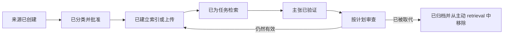

# 将每项事实放入正确类型的上下文中

> 上下文是临时的 Attention。知识是持续维护的证据。记忆提供连续性。缓存实现复用。将它们混为一谈会产生自信但过时的答案。

**Type:** Learn
**Languages:** Python
**Prerequisites:** [将请求转化为可测试的契约](../../03-prompting-and-task-decomposition/), [上下文工程](../../../../../phases/11-llm-engineering/05-context-engineering/)
**Time:** ~105 分钟

## Learning Objectives

- 区分聊天上下文、Project instructions、Project knowledge、memory、connectors、retrieval 和 API prompt caching。
- 决定哪些内容应持久保存、检索、总结、刷新或丢弃。
- 构建包含权威性、所有权、敏感性和时效性元数据的来源注册表。
- 在不删除必需证据的前提下减少上下文过载。
- 说明 Claude 的哪些产品行为可能发生变化，必须通过当前文档进行核验。

## 问题

一个团队为季度规划创建了 Claude Project。他们上传了政策文件、会议记录、销售导出数据和一份旧产品 ROADMAP。他们还添加了 Project instructions，其中写道：“使用最新批准的计划。”

三个月后，Claude 推荐了旧 ROADMAP 中的发布日期。这个日期存在于 Project knowledge 中，也出现在多份历史会议记录里，但与 connector 中保存的较新决策相冲突。由于上下文中包含多条重复证据来支持错误答案，因此响应听起来十分确定。

团队将其称为幻觉。实际上，这主要是知识管理失败。他们把 Project 当作文档仓库，把 memory 当作权威来源，并把 retrieval 当作真实性保证。

更多上下文并不等同于更好的上下文。可信赖的系统知道哪些事实是临时的、哪些是权威的，以及由谁负责确保它们保持最新。

## 概念

### 七种机制，七项职责

Claude 可以通过多种机制接收或复用信息。它们的具体可用性、限制和名称可能随套餐和产品而变化。持久不变的区别在于它们各自承担的职责。

| 机制 | 主要职责 | 主要风险 |
|---|---|---|
| 当前聊天上下文 | 承载当前对话 | 旧轮次占用 Attention 或产生冲突 |
| Project instructions | 设置可复用的行为和约束 | 宽泛的指令变得过时或含糊 |
| Project knowledge | 提供一组持续维护的参考资料 | 文件缺少所有权或时效性控制 |
| Memory | 在不同对话之间保留有用的连续性 | 被记住的偏好被误认为已批准的事实 |
| Connectors | 在当前权限下访问外部系统 | 对来源权限、同步或时效性的理解有误 |
| Retrieval | 从更大的语料库中选择相关片段 | 看似相关的文本不完整或权威性较低 |
| Prompt caching | 高效复用稳定的 API prompt 前缀 | 动态内容被缓存，或缓存失效机制被忽略 |

一项功能可以支持多种职责，但明确这些区别能够避免类别错误。Memory 可以提醒 Claude 你偏好简洁的报告。它不应在没有明确依据的情况下成为当前退款政策的来源。Connector 可以暴露最新文件，但不能证明该文件已经获得批准。

### 上下文存在 Attention 预算

更大的上下文窗口提高的是容量，而不是确定性。每增加一份文档，都会加剧 Attention 竞争，并增加一次出现矛盾的机会。

可以将其理解为四层：

```text
上下文包 = 治理指令
         + 任务特定输入
         + 检索到的权威证据
         + 最少量的连续性信息
```

让稳定的指令保持稳定。只添加当前决策所需的任务输入。使用元数据和权威性规则检索证据。只有在先前对话会改变当前任务时，才携带这些对话。

长对话通常会积累已放弃的计划、已纠正的事实和格式实验。与其无限延续对话，不如使用经过验证的简报开始新对话，这样可能更安全。只有在将决策与讨论分开后再进行总结。

### Retrieval 是选择，而不是验证

Retrieval 系统通常根据相关性对片段进行排序。相关性无法回答以下问题：

- 这个来源是否已获批准？
- 它是否为当前有效版本？
- 它涵盖了完整规则，还是只有一个摘录？
- 是否存在与之冲突的更高权威性来源？
- 当前用户是否可以访问该来源？

为每个来源附加元数据，并在语义相关性排序之前或同时进行过滤。最小注册表包括：

| 字段 | 问题 |
|---|---|
| 来源 ID | 主张能否追溯到该来源？ |
| 负责人 | 谁对准确性负责？ |
| 权威性 | 它是政策、流程、记录还是草稿？ |
| 生效日期 | 它从何时开始有效？ |
| 审查日期 | 何时必须再次检查？ |
| 敏感性 | 谁可以处理或查看它？ |
| 取代对象 | 哪个较早的来源不再具有权威性？ |
| Retrieval 标签 | 它涵盖哪些任务和地区？ |

没有负责人或审查日期的文档应作为隔离候选项，而不是自动摄取。

### Instructions 和 knowledge 并不相同

Instructions 描述行为。Knowledge 提供证据。

一条 instruction 可能是：

```text
对于退款问题，引用适用的章节并披露地区冲突。
```

Knowledge 应包含实际获得批准的退款政策。将政策正文放入行为指令中会增加维护难度。将行为规则放入任意的 knowledge 文件中，则可能导致它们很容易被忽略。

当 Project instructions 与用户请求或提供的来源冲突时，解决方式取决于产品的指令层级和组织政策。不要虚构层级。测试实际使用界面，并记录预期的优先级。

### Memory 提供连续性，而不是记录系统

Memory 适合保存稳定的偏好和持续上下文，例如偏好的语气、重复出现的目标，或者某个项目存在这一事实。当被记住的主张被当作当前运营事实时，它就会变得危险。

依赖 memory 之前，先问三个问题：

1. 这个事实是否可能已经变化？
2. 是否存在检查成本较低的权威来源？
3. 如果记住的事实有误，会产生什么后果？

如果信息可能发生漂移且后果重要，就应进行验证。在工作流中，标记来自 memory 的上下文，并继续引用实际的记录来源。

### Prompt caching 是一种经济机制

API prompt caching 可以减少对稳定前缀的重复处理。它不会提高真实性，也不会创建长期 memory。

当当前 API 的 caching 行为支持以下模式时，将可复用内容放在动态内容之前：

```text
稳定前缀：system 规则 + tool 定义 + 已批准的参考语料库
动态后缀：用户请求 + 最新 retrieval + 当前状态
```

适合缓存的内容通常规模较大、会被重复使用且保持稳定。不适合缓存的内容会随每次请求变化，或包含不应在获批边界之外持续存在的数据。

缓存生命周期、最小大小、定价、模型支持和失效行为都是可能变化的产品事实。请在当前官方文档中核验这些信息。设计的正确性不得依赖过时的缓存。

### 上下文质量需要生命周期责任归属

知识具有生命周期：



真正困难的工作不是上传，而是批准、刷新和退役。

## Build It

### 步骤 1：盘点上下文

针对一个重复执行的工作流，列出每个信息来源并进行分类：

```text
行为指令：
任务输入：
权威知识：
参考知识：
对话连续性：
外部连接数据：
临时计算：
```

如果一个项目出现在多个类别中，请确定哪一份副本具有权威性，以及如何移除重复内容。

### 步骤 2：创建来源注册表

为每个来源创建一个简单的表格或 JSON 记录：

```json
{
  "source_id": "refund-policy-uk",
  "owner": "customer-operations",
  "authority": "approved-policy",
  "effective_date": "2026-07-01",
  "review_date": "2026-10-01",
  "sensitivity": "internal",
  "supersedes": "refund-policy-uk-2025"
}
```

这里的日期仅用于示例。请使用你的实际记录。拒绝或标记审查日期已经过去的来源。

### 步骤 3：设计支持拒绝作答的 retrieval

定义 retrieval 契约：

- 按用户权限、地区、产品和活跃状态进行过滤。
- 优先使用已批准的政策，而不是讨论记录。
- 检索足够的上下文文本，以保留例外情况。
- 随片段返回来源 ID 和生效日期。
- 缺少所需权威来源时拒绝作答。
- 披露冲突，而不是在不可见的情况下合并冲突内容。

测试正常案例、过时来源、权限不匹配、冲突和范围外问题。

### 步骤 4：为 prompt 分配预算

测量或估算每个上下文分区。如果 prompt 过载，请按以下顺序进行缩减：

1. 删除重复和已被取代的资料。
2. 排除无关的对话轮次。
3. 检索范围更窄的权威章节，同时保留足够的上下文。
4. 使用经过验证的决策记录替换讨论历史。
5. 在验证边界处分解任务。

不要首先删除安全约束或必需证据。

### 步骤 5：建立维护机制

指定负责人和维护节奏：

| 资产 | 负责人 | 审查触发条件 | 退役规则 |
|---|---|---|---|
| Project instructions | 工作流负责人 | 流程发生变化 | 替换旧版本 |
| 政策 knowledge | 政策负责人 | 获得批准或到达审查日期 | 移除已被取代的副本 |
| Retrieval 索引 | 平台负责人 | 来源更新 | 重新建立索引并验证 |
| 评估集 | 质量负责人 | 出现新的失败类型 | 添加代表性案例 |

知识管理是产品的一部分，而不是上线后的清理工作。

## Interactive Lab

使用 context-cache figure 调整稳定前缀大小、请求量、缓存命中率、来源时效性和失效行为。比较成本节省与正确性边界：只有当复用的前缀仍然获得批准时，缓存命中才有价值。

```figure
04-context-cache
```

## Practice Lab

运行上下文规划器。尝试缓存动态账户来源、在没有新批准的情况下重新启用已被取代的政策，或让 prompt 超出预算。运行器必须将正确性和生命周期规则置于缓存节省之前。

## Shipped Artifact

`outputs/context-registry.json` 是为退款工作流填写完成的来源注册表。它区分了行为指令、已批准的政策、已被取代的草稿、对话连续性和动态连接数据。它还包含 prompt 预算和明确的 caching 政策。

## Verify It

验证注册表：

```bash
cd certifications/claude/lessons/04-context-knowledge-memory-and-caching/code
python3 main.py
python3 -m unittest discover tests -v
```

验证器检查来源 ID 是否唯一、日期是否符合 ISO 格式、所有权、权威性、活跃状态与被取代状态、预算总额，以及是否只有稳定且不含机密信息的来源进入缓存前缀。

## Capstone Connection

测验检查来源权威性、retrieval 限制、caching 适用性和上下文重置决策。在第 29 至 32 个 capstone 中，将注册表和 cache 政策用作来源追踪和上下文预算产物。

## Use It

### 考试决策模式

当场景涉及重复工作、过时答案或缺失上下文时：

1. 确定缺失内容属于行为、证据、连续性还是外部数据。
2. 将其放入为该职责设计的机制中。
3. 添加权威性、时效性、敏感性和所有权控制。
4. 测试 retrieval 和权限失败。
5. 只有在正确性得到确认后才使用 caching。

### 常见陷阱

- **上传所有内容：** 数据量会增加矛盾和维护成本。
- **将 memory 当作事实：** 连续性被误认为记录来源。
- **将 connector 当作批准：** 能够访问文件被误认为文件具有权威性。
- **将 retrieval 当作证明：** 在不检查来源追踪或完整性的情况下接受相关片段。
- **一个永不结束的聊天：** 已纠正和已放弃的上下文仍保持活跃。
- **将 cache 当作 memory：** 期待 API 优化机制保存持久的用户状态。
- **没有退役路径：** 已被取代的文件永远保持可检索状态。

### 练习

1. 将一个真实工作流中的十个项目归类到七种机制中。
2. 为五个来源创建注册表，并确定哪些来源不应进入主动 retrieval。
3. 使用四层上下文包重写一个过载的 prompt。
4. 设计五项 retrieval 失败测试，包括过时证据和未经授权的访问。
5. 决定在项目一周结束时应持久保存、总结或丢弃哪些内容。解释每项决策。

## 关键术语

- **Context：** 当前请求中模型可以使用的信息。
- **Project instructions：** 与 Claude Project 关联的可复用行为指导。
- **Project knowledge：** 与 Project 关联的参考资料。
- **Memory：** 由产品支持的跨对话连续性，具体取决于当前功能行为。
- **Connector：** 在已配置权限下暴露外部数据或能力的集成。
- **Retrieval：** 为请求从更大的语料库中选择相关资料。
- **Prompt caching：** 复用符合条件的 prompt 内容，以减少重复的 API 处理。
- **记录来源：** 某项事实的权威系统或文档。
- **时效性：** 信息对于其预期用途而言是否足够新。

## 延伸阅读

- [Anthropic Help Center：什么是 Projects？](https://support.claude.com/en/articles/9517075-what-are-projects)
- [Anthropic Help Center：使用 Claude 的聊天搜索和 memory 延续先前上下文](https://support.claude.com/en/articles/11817273-use-claude-s-chat-search-and-memory-to-build-on-previous-context)
- [Anthropic Help Center：使用 connectors 扩展 Claude 的能力](https://support.claude.com/en/articles/11176164-use-connectors-to-extend-claude-s-capabilities)
- [Anthropic：Prompt caching](https://platform.claude.com/docs/en/build-with-claude/prompt-caching)
- [AI Engineering from Scratch：RAG](../../../../../phases/11-llm-engineering/06-rag/)
- [AI Engineering from Scratch：Repository Memory and State](../../../../../phases/14-agent-engineering/34-repo-memory-and-state/)

Projects、memory、connectors、retrieval 模式和 prompt caching 的名称、可用性、限制、保留行为及定价都可能发生变化。这些来源已于 2026-08-08 完成核验。在部署或备考之前，请核验当前的官方产品与隐私文档。
