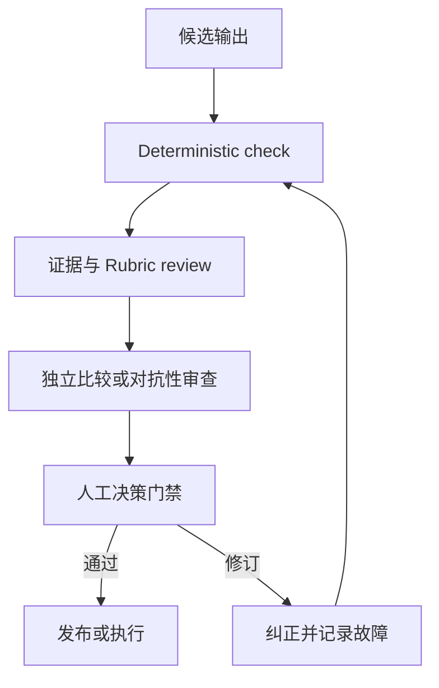

# 验证主张，而不是置信程度

> 流畅度体现的是表达质量。验证提供的证据则表明输出能够安全地完成其任务。

**Type:** Learn
**Languages:** Python
**Prerequisites:** [将请求转化为可测试的契约](../../03-prompting-and-task-decomposition/), [将每项事实放入正确类型的 Context](../../04-context-knowledge-memory-and-caching/), [评估与测试](../../../../../phases/11-llm-engineering/10-evaluation/)
**Time:** ~115 分钟

## 学习目标

- 针对准确性、完整性、一致性、受众适配度、偏见和格式构建任务特定的标准。
- 将影响重大的主张追溯到权威证据。
- 结合 Deterministic check、Rubric grader、Independent review 和人工判断。
- 诊断幻觉、遗漏、矛盾、范围和引用错误。
- 在选择修复方式之前，根据模型能力限制诊断意外输出。
- 将生产环境故障转化为持久的评估用例。

## 问题

Claude 根据客户数据和内部政策生成每周高管简报。简报开篇有力、建议简洁，而且每个章节都有引用。管理层根据这份简报批准了一项政策变更。

后来，一位分析师发现了三个问题。其中一条引用指向了一份提及该主题但并不支持相关主张的文档。在汇总过程中，一小部分客户群体消失了。一项建议超出了团队的权限。

这份文档之所以看似经过验证，是因为它带有引用，而且语气专业。没有人测试覆盖范围、Entailment 或操作权限范围。

这正是输出评估在 Claude Certified Associate 考试蓝图中占比最大的原因。实用的 Claude workflow 不会在文本出现时停止，而会在结果通过与其后果相称的检查时停止。

## 概念

### 从输出的任务开始

评估标准应取决于输出所支持的决策。头脑风暴列表和监管申报文件需要不同的证据和审查方式。

可以从以下六个维度入手：

1. **准确性：** 事实主张是否有依据，计算是否正确？
2. **完整性：** 所需项目、群体、例外情况和注意事项是否齐全？
3. **一致性：** 各章节、数字、标签和建议是否相互一致？
4. **受众适配度：** 预期读者能否理解并据此采取行动？
5. **公平性与安全性：** 输出是否引入了无正当理由的偏见、泄露了数据或超出了政策范围？
6. **格式合规性：** 输出是否满足人员和系统的结构要求？

这些是类别，而不是分数。请将它们转化为可观测的测试。

薄弱的标准：

```text
报告准确且完整。
```

可测试的标准：

```text
每项定量主张都必须与所提供的数据集核对一致。
每项建议都必须引用至少一项支持性发现和一项治理约束。
全部七个运营区域都必须出现，或标记为“无数据”。
摘要必须说明两个最大的不确定因素。
```

### 将主张追溯到证据

引用只是指针。验证要判断指向的证据是否支持确切的主张。

创建 claim-evidence Matrix：

| 主张 ID | 主张 | 来源 | 支持类型 | 权威性 | 审查结果 |
|---|---|---|---|---|---|
| C-01 | 北部区域的退货量上升 | 数据集第 120-184 行 | 直接计算 | 主要数据 | 通过 |
| C-02 | 培训导致了这一变化 | 访谈记录 7 | 推测性 | 轶事性 | 失败 |
| C-03 | 退款需要审批 | 政策 4.2 | 直接引用 | 已批准政策 | 通过 |

该 Matrix 将四个常见问题区分开来：

- 来源是否存在？
- 对于这项主张，该来源是否具有权威性？
- 它是否能够 Entail 该主张，而不只是讨论同一主题？
- 主张是否强于证据？

报告即使包含正确的引用，也仍可能夸大因果关系。“发生在……之后”并不能证明“由……导致”。

### 在重试之前诊断具体属性

意外输出并不是有用的诊断。通用重试通常会重现同一故障，因为它没有改变故障原因。

Anthropic 的入门能力课程围绕模型的四项属性组织诊断。应将它们用作实用的故障树，而不是四个彼此孤立的标签：

| 属性 | 故障信号 | 针对性响应 |
|---|---|---|
| Next-token prediction | 答案流畅且看似可信，但没有依据 | 使用提供的证据支持影响重大的主张，要求在证据不足时放弃作答，并验证 Entailment |
| 知识 | 任务依赖近期、罕见、私有或存在争议的事实 | 添加当前的权威来源并明确展示不确定性，而不是依赖参数化记忆 |
| 工作记忆 | 重要 Context 被埋没、未包含在当前会话中，或与过多材料相互竞争 | 仅检索相关 Context、拆分任务、总结状态并验证覆盖范围 |
| Steerability | 指令含糊、相互冲突、过长或无法检查 | 将请求改写为包含优先级、示例、约束和验收测试的简洁契约 |

多项属性可能同时发生故障。一个很长的政策问题可能超出有效工作记忆，同时还要求模型回答其知识范围以外的事实。记录一项主要属性、所有促成问题的属性、支持诊断的证据，以及针对每项原因的修复措施。

可选的 AI Fluency 4D 检查为同一决策补充了人的层面：

- **Delegation：** 决定哪些工作应当委派，哪些判断必须由人完成。
- **Description：** 提供系统所需的 Context、目标、约束和成功标准。
- **Discernment：** 评估结果是否准确、实用且恰当。
- **Diligence：** 在整个 workflow 中落实隐私、归属、政策和问责要求。

这些检查不能替代任务特定的评估。它们可以帮助你选择正确的评估者和修复方式，而不是把每次故障都视为“prompt 写得不好”。

### 使用分层验证

任何单一评估者都不够充分。应组合多个层级：



**Deterministic check** 是代码或精确规则。使用它们检查 schema 有效性、必填字段、行总数、范围、引用 ID 是否存在、禁用术语和权限标志。

**Rubric review** 处理需要解释的质量属性，例如摘要是否保留了关键例外情况。模型可以依据 rubric 评分，但 grader 本身也需要测试。

**Independent review 或对抗性审查** 通过单独的检查流程寻找缺乏支持的主张、遗漏的群体、冲突和不安全的建议。独立性很重要。让同一次生成自行宣告正确，会造成相互关联的盲区。

**人工审查** 负责处理后果、模糊的权衡和组织权限。人员不应重复每一项机械检查，而应收到证据、不确定性、失败的检查以及需要判断的决策。

### 让评估者与属性相匹配

为每项属性使用成本最低且可靠的评估者：

| 属性 | 首选的可靠评估者 |
|---|---|
| 有效 JSON | Parser 或 schema validator |
| 算术总数 | Deterministic calculation |
| 确切的必填字段 | Programmatic assertion |
| 含义得到保留 | 基于 rubric 的比较 |
| 主张得到段落支持 | 包含引用片段的证据审查 |
| 恰当的高管语气 | 人员或经过测试的 Rubric grader |
| 影响重大的公平性决策 | 具备资质的人员依据政策进行审查 |

不要让 LLM 判断代码可以精确确定的事项。不要强迫代码决定依赖 Context 的道德权衡。

### 幻觉不是单一类型的故障

在修复之前对缺陷进行分类：

- **Fabrication：** 捏造了事实或来源。
- **Misattribution：** 将真实主张归给了错误的来源。
- **Overreach：** 结论强于证据。
- **Omission：** 缺少必需的事实、群体或例外情况。
- **Contradiction：** 输出中的两个部分不可能同时为真。
- **Scope violation：** 响应超出了请求或权限范围。
- **Staleness：** 曾经有效的事实已不再是当前事实。
- **Format failure：** 下游系统无法使用该内容。

不同的缺陷需要不同的修复方式。Fabrication 可能需要限制来源并允许放弃作答。Omission 可能需要覆盖范围检查清单。Contradiction 可能需要一致性核对流程。Format failure 可能需要结构化输出和 parser validation。

### Evaluation set 应体现风险

实用的 Evaluation set 不应只包含常规示例。还应包括：

- 常见且具有代表性的任务。
- 重要的边界用例。
- 先前观察到的故障。
- 缺失和相互冲突的证据。
- 来源文本中的对抗性指令。
- 涉及隐私、公平性或未授权操作的用例。
- 接近长度和格式限制的输入。

按风险组跟踪性能。95% 的总体分数可能掩盖最重要用例只有 40% 通过率的事实。

为重大 prompt 或模型变更保留一个 held-out set。如果反复针对每个用例进行调优，workflow 可能只会记住测试形式，而无法泛化。

### 在没有品牌偏见的情况下比较输出

比较 prompt 或模型变体时：

1. 使用相同的用例和标准。
2. 在可行的情况下隐藏每项结果由哪个系统生成。
3. 随机排列展示顺序。
4. 在给出总体偏好之前，先为各个维度评分。
5. 调查审查者之间的分歧。
6. 进行足够次数的重复运行，以观察不稳定性。

一项受到偏爱的输出只是一个轶事。部署决策需要观察代表性风险范围内的结果分布。

## 构建

### 第 1 步：定义 Release gate

按三个级别编写 gate：

```text
Blocker：缺乏支持且影响重大的主张、暴露受限数据、总数无效
Required：覆盖所有区域、引用可解析、建议未超出权限
Quality：摘要简洁、标题易读、尽量减少重复
```

Blocker 会阻止发布。根据政策，质量问题可能允许发布，但需要创建修复工单。这样可以避免视觉或文风偏好与安全故障争夺优先级。

### 第 2 步：构建验证记录

针对每次运行记录：

```json
{
  "workflow_version": "brief-v3",
  "source_snapshot": "2026-W31",
  "checks": {
    "schema": "pass",
    "totals_reconcile": "pass",
    "claim_support": "fail",
    "privacy": "pass"
  },
  "failed_claims": ["C-08"],
  "uncertainties": ["西部区域样本不完整"],
  "reviewer_decision": "revise"
}
```

这些值仅用于说明。在生产环境中，应将你的保留和隐私政策应用于验证日志。

对于意外结果，请附上一段简短的诊断：

```json
{
  "primaryProperty": "knowledge",
  "contributingProperties": ["next-token-prediction"],
  "evidence": "被引用的政策发布于模型所获得的来源快照之后。",
  "targetedFix": "检索当前已批准的政策，并重新运行主张支持检查。",
  "humanCompetency": "discernment"
}
```

单独的标签没有用。证据和针对性修复能使诊断变得可测试。

### 第 3 步：分离生成和审查

向审查者提供草稿、标准和来源证据。不要允许它在不作说明的情况下直接重写。

```text
每项发现返回一行：
claim_id | severity | evidence | criterion | proposed correction

如果提供的来源均不支持某项主张，请将其标记为 unsupported。
不要捏造替代证据。
```

随后，generator 可以根据明确的发现列表进行修订。保留原始发现和修正内容，以便审计。

### 第 4 步：校准 grader

创建通过、临界和失败输出的示例。让具备资质的审查者对它们进行标注。将自动 grader 的决策与人工参考结果进行比较。

首先检查 False pass，因为它们会放行不良输出。然后检查 False failure，因为它们会浪费审查能力。记录人工判断存在合理分歧的情况，而不是强行制造虚假一致。

### 第 5 步：闭合反馈循环

每次重大的生产环境故障都应至少产生一项持久产物：

- 一个新的评估用例。
- 一项更明确的标准。
- 一项 Deterministic check。
- 一项来源管理修复。
- 一项 prompt 或 workflow 变更。
- 一个监控信号或升级规则。

不要只修复单份报告。应改进放行该报告的系统。

## 交互式实验

使用文档和 vision pipeline，检查从输入证据到提取字段、主张、验证发现和发布决策的每次转换。切换失败的视觉提取或缺乏支持的主张，并观察哪个 gate 必须阻止发布。

```figure
05-document-vision-pipeline
```

## 实践实验

在填写完成的 claim Matrix 上运行 release scorer。将 Blocker 决策改为 publish、让某项主张指向缺失来源、将精确总数分配给模型 judge，或从意外输出诊断中移除一项能力属性，然后确认发布验证失败。

## 交付产物

`outputs/claim-validation-record.json` 是一份填写完成的审查材料包，其中包含 claim-evidence Matrix、四属性能力诊断、Release gate、评估者分配、不确定性，以及最终的 `revise` 决策。它有意包含一项失败的因果主张，以便展示 Blocker 路径。

## 验证

运行 Deterministic check：

```bash
cd certifications/claude/lessons/05-output-evaluation-and-validation/code
python3 main.py
python3 -m unittest discover tests -v
```

validator 会证明 claim ID 是唯一的、每项来源引用都能解析、能力诊断包含全部四项属性及一项针对性修复、精确属性使用 Deterministic evaluator，而且 Blocker 失败时不能生成 publish 决策。

## Capstone 关联

测验会测试 Entailment、评估者选择、分组故障和 Regression 学习。将此材料包用作 Capstone 29 至 32 的验证与审查者证据。

## 应用

### 考试决策模式

当被问及如何提高输出质量时：

1. 定义输出的用途和后果。
2. 选择明确且针对任务的标准。
3. 对精确属性使用精确检查。
4. 将重要主张追溯到权威证据。
5. 对模糊或影响重大的情况保留 Independent review 和人工审查。
6. 将观察到的故障反馈到 Evaluation set 中。

### 常见陷阱

- **将流畅度视为正确性：** 表达精致的答案也可能是错的。
- **将引用存在视为支持：** 链接内容可能无法 Entail 该主张。
- **单一总体分数：** 关键风险群体会消失在平均值中。
- **只进行自我审查：** generator 和 reviewer 共享假设与遗漏。
- **使用 LLM 进行精确算术：** Deterministic check 成本更低，也更可靠。
- **没有材料包的人工审查：** 审查者只收到文本，没有主张、证据或失败的检查。
- **只测试顺利路径：** 缺失、冲突、过时和对抗性输入仍然不可见。
- **只修复症状：** 报告被修改了，但失败用例从未进入测试套件。

### 练习

1. 将五个主观质量目标转化为可观测的标准。
2. 为一页报告构建 claim-evidence Matrix，并标记 Overreach。
3. 为十项检查分配 Deterministic、rubric、Independent 或人工评估者。
4. 创建一个包含四个常规用例、三个边界用例和三个高风险用例的 Evaluation set。
5. 对两项输出进行盲测比较，并记录审查者存在分歧的地方。

## 关键术语

- **Entailment：** 证据是否真正支持所陈述的主张。
- **Evaluation set：** 用于衡量行为的一组代表性用例和风险聚焦用例。
- **Deterministic check：** 对一项具有确切预期的属性执行的、可重复的程序化测试。
- **Rubric grader：** 应用既定定性标准的人员或模型评估者。
- **Independent review：** 不依赖 generator 自我判断的独立评估流程。
- **Release gate：** 输出在发布或用于采取行动之前必须满足的条件。
- **False pass：** 无效输出被评估者错误地接受。
- **Regression：** 先前通过的行为在变更后失败。

## 延伸阅读

- [Anthropic：定义成功标准并构建评估](https://platform.claude.com/docs/en/test-and-evaluate/develop-tests)
- [Anthropic：评估工具](https://platform.claude.com/docs/en/test-and-evaluate/eval-tool)
- [Anthropic：减少幻觉](https://platform.claude.com/docs/en/test-and-evaluate/strengthen-guardrails/reduce-hallucinations)
- [Anthropic Academy：AI 能力与局限](https://anthropic.skilljar.com/ai-capabilities-and-limitations)
- [Anthropic Academy：AI Fluency Framework 与基础](https://anthropic.skilljar.com/ai-fluency-framework-foundations)
- [AI Engineering from Scratch：高级 RAG 与评估](../../../../../phases/11-llm-engineering/07-advanced-rag/)
- [AI Engineering from Scratch：Reviewer Agent](../../../../../phases/14-agent-engineering/39-reviewer-agent/)
- [AI Engineering from Scratch：公平性标准](../../../../../phases/18-ethics-safety-alignment/21-fairness-criteria-group-individual-counterfactual/)

评估工具、模型行为和产品界面可能会发生变化。这些官方参考资料已于 2026-08-08 完成核验。每当模型、prompt、来源、工具或 workflow 政策发生变化时，都应重新验证 grader 和 threshold。
