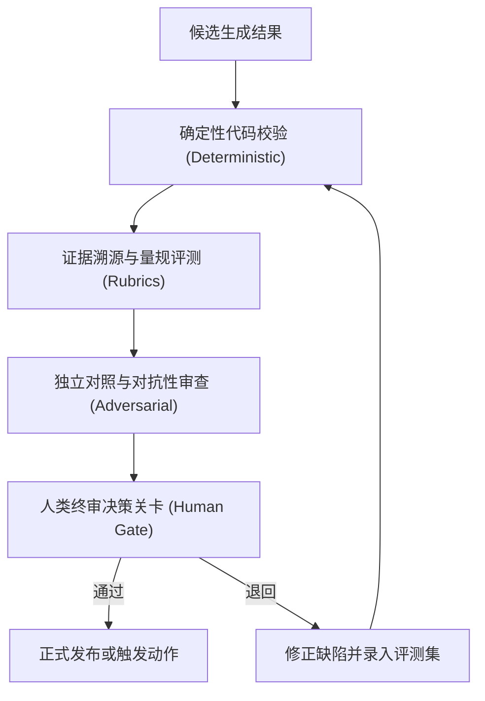

# 检验断言真伪，而非轻信模型语气

> 流畅度仅代表文本的表面表达技巧，而严格的工程校验才是证明输出能够安全承担业务职责的硬核证据。

**Type:** Learn
**Languages:** Python
**Prerequisites:** [将模糊需求转化为可测试的契约](../../03-prompting-and-task-decomposition/), [将各类事实置于适得其所的上下文容器中](../../04-context-knowledge-memory-and-caching/), [Evaluation and Testing](../../../../../phases/11-llm-engineering/10-evaluation/)
**Time:** ~115 minutes

## 学习目标

- 针对具体业务任务，精准构建涵盖准确性、完整性、前后一致性、受众适配度、公平偏见以及格式合规的量化评估体系。
- 建立端到端溯源链路，将输出中每一项具有实质后果的关键断言锚定至权威证据。
- 将代码确定性校验、标准量规（Rubric）自动化评测、独立对抗审查与人类专业决断进行多层有机结合。
- 深度剖析并精准诊断纯捏造、归因错位、过度推断、重要遗漏、逻辑冲突以及格式崩溃等失效缺陷。
- 在盲目着手修改提示词之前，优先透过大模型核心底层能力边界精准诊断异常输出根因。
- 将线上生产环境暴露的严重缺陷与差错，制度化转化为永久沉淀的回归评测基准用例。

## 问题背景

某业务系统每周自动调用 Claude 处理客户支持数据并结合企业内部规章，生成一份面向高管的决策简报。这份报告行文精炼、立论扎实，并在每个小节都严谨地附上了引用文献标注。公司管理层对其深信不疑，并基于其中的分析建议正式签发了一项重大的业务规章变更。

数周后，一位资深数据分析师在复盘时揭露了三个致命暗坑：第一，报告中的一项核心引用虽然指向了一篇确实讨论该话题的内部文档，但原文根本不支持报告得出的推论；第二，在做跨区域数据汇聚时，一个重要但小众的客户群体被模型在计算中直接丢弃遗漏；第三，报告提出的一项关键建议，严重越过了该团队的法定组织职权。

这份文档之所以能一路绿灯通过审核，仅仅是因为它通篇附带了看起来极其正规的引用角标，且行文语气显得极其专业客观。在整个流转链路中，没有任何人对其覆盖完备度、语义逻辑蕴涵（Entailment）以及行为职权边界做过实质性的检验。

这正是为什么在 Claude Certified Associate 认证考纲大纲中，“输出评估与验证（Output Evaluation and Validation）”会被列为权重最高的核心领域。一个真正具备生产价值的企业级 Claude 工作流，绝不会在屏幕吐完最后一段文字时就草草收场；它必须在输出结果通过与其业务风险完全相称的多层严格把关后，才准正式交付。

## 核心概念

### 从输出的最终业务使命出发定义标准

评测准则的设计必须严格服务于该输出最终所支撑的实际决策。一份供团队内部头脑风暴的草稿创意清单，与一份提交给金融监管机构的法定审计报告，在证据链纯度与审查严苛度上有着天壤之别。

请从以下六个维度构建全方位的质检网络：

1. **准确性 (Accuracy):** 所有的事实性断言是否均有确凿依据？数学统计计算是否百分之百准确无误？
2. **完整性 (Completeness):** 核心条款、目标人群、统计样本、例外免责声明以及必要前置约束是否全量在线？
3. **一致性 (Consistency):** 各章节之间、图表数据与正文论述之间、前后标签与最终建议之间是否存在逻辑矛盾？
4. **受众适配度 (Audience fit):** 目标受众（如执行层工程师或非技术背景的董事会高管）能否准确理解并基于此展开决策？
5. **公平与合规安全 (Fairness and safety):** 输出是否引入了不合理的偏见歧视？是否违规泄露了敏感隐私？是否超越了合规政策红线？
6. **格式契约遵循 (Format compliance):** 交付成果的数据结构、排版字段与编码规范是否完全满足下游系统与人员的解析标准？

请注意：上述维度属于抽象分类，绝不可直接当成打分标准。必须将其转化为具有明确**可观测性（Observable）**的确定性测试。

模糊不可测的无效标准：
```text
这份报告必须保证内容准确、数据完整且专业可靠。
```

具有严密工程可测试性的量化标准：
```text
报告中所有定量统计数字，必须与输入数据集中的原始记录在数学上百分之百平账。
提出的每一条改进措施，必须同时关联至少一个支撑性的业务发现与一项现行规章约束。
必须完整覆盖全部 7 个业务大区，若某大区数据缺失必须显式标记为“暂无数据”。
报告开篇摘要必须明确揭示当前置信度最低的两个最大不确定性风险项。
```

### 将关键断言精准溯源至底层事实证据

引用标注（Citations）充其量只是一个超链接指针。严肃的工程校验必须深入追问：被指向的原始证据文本，在逻辑语义上是否真正完整**蕴涵（Entailment）**了该具体断言。

构建端到端的“断言-证据对照矩阵（Claim-Evidence Matrix）”：

| 断言 ID | 具体输出断言 | 关联底层信源 | 证据支撑性质 | 信源权威等级 | 最终审查结论 |
|---|---|---|---|---|---|
| C-01 | 北部大区的退货率较上月激增了 14% | 原始数据流水第 120-184 行 | 确定性直接计算 | 一手核心事实数据 | 通过 (Pass) |
| C-02 | 员工服务意识培训是导致退货激增的主因 | 内部员工访谈便签第 7 条 | 主观猜测性推断 | 缺乏对照组的传闻 | 不通过 (Fail) |
| C-03 | 超过 500 美元的退款必须由总监审批 | 客服规章手册第 4.2 条 | 原文精准逐字引用 | 经审批的现行制度 | 通过 (Pass) |

对照矩阵能将混乱的审查拆解为四个清晰可判定的工程问题：
- 该引用的证据文件在物理上是否真实存在？
- 该信源在涉及此类业务结论时是否具备法定权威效力？
- 该证据是否在逻辑上严密推出了该断言，还是仅仅碰巧提及了同一话题？
- 模型输出的断言语气，是否超越了底层证据所能支撑的客观强度？

一份报告哪怕引用的全部文献都真实存在，依然可能犯下严重的因果倒置或过度推断。“发生在某事之后”绝不等于“由某事引起”。

### 在盲目重试前，先依据大模型四大核心底层特性定位根因

简单地抱怨“输出结果不及预期”不具备任何诊断价值；盲目点击重试按钮往往只会原汁原味地复现同样的崩溃，因为引发崩溃的底层诱因从未被触及。

Anthropic 官方核心能力课程将大模型的基础故障树归纳为四大物理特性。请将其作为系统性的排查武器库，而非孤立的概念标签：

| 核心底层特性 | 典型故障表征 | 针对性的工程根治方案 |
|---|---|---|
| Next-token prediction (自回归词元预测机制) | 输出文采极其流畅、看似言之成理，但在核心事实上纯属无中生有的凭空捏造 | 将关键断言强行锚定在提供的证据切片内，强制启用安全拒答（Abstention），严格做逻辑蕴涵校验 |
| Knowledge (参数化知识的局限性) | 任务依赖最新时效资讯、罕见生僻知识、企业私有机密或存在激烈争议的事实 | 坚决放弃对模型内部预训练参数记忆的依赖，通过检索实时注入权威一手信源并主动暴露不确定性 |
| Working memory (有限工作记忆/上下文注意力) | 关键线索被海量无关冗余淹没、跨轮次遗忘、或因上下文超限发生注意力崩溃 | 大刀阔斧精简上下文，拆解长程流水线，将历史讨论提炼为经过核准的状态摘要并核查覆盖度 |
| Steerability (指令可控性与遵循度) | 系统指令冗长含糊、前后规则自相矛盾、或者缺乏明确可判定的验收边界 | 彻底重构 Prompt 契约，设立精炼的优先级仲裁规则，补充临界反例与可程序化校验的验收断言 |

多个特性往往交织并发。例如：一个长篇复杂的政策问答任务，既可能突破了有效的工作记忆容量，同时又向模型索取了其预训练知识库之外的私有规章。请务必准确识别首要根本特性（Primary Property）与伴随诱因，提供详实的归因证据，并针对每一项根因开出精准的工程处方。

同时，辅以 Anthropic AI Fluency 4D 框架从人机协同视角审视这一决断：
- **Delegation (分权委托):** 明确界定哪些机械工作可以放心交给模型，哪些决定性判断必须由人类牢牢掌控。
- **Description (意图阐述):** 为模型注入清晰的上下文视野、业务终局目标、负向红线以及成功验收指标。
- **Discernment (敏锐鉴别):** 具备对模型生成成果进行专业辨伪的能力，洞察其准确性、适用性与潜在偏见。
- **Diligence (尽职合规):** 在全生命周期中贯彻数据隐私保护、知识产权合规、事实严谨溯源与全流程责任归属。

这一思维模型能够帮助你挑选最匹配的质检工具与修复手段，彻底戒除将一切问题敷衍为“Prompt 没写好”的粗放作风。

### 构筑多层纵深防御验证体系

没有任何单一的质检手段能够包打天下。必须将不同工具按能力组合为流水线：


```mermaid
flowchart TD
    A["候选生成结果"] --> B["确定性代码校验 (Deterministic)"]
    B --> C["证据溯源与量规评测 (Rubrics)"]
    C --> D["独立对照与对抗性审查 (Adversarial)"]
    D --> E["人类终审决策关卡 (Human Gate)"]
    E -->|"通过"| F["正式发布或触发动作"]
    E -->|"退回"| G["修正缺陷并录入评测集"]
    G --> B
```

**确定性代码校验 (Deterministic checks)：** 依托纯代码或确定性正则表达式执行。用于 100% 校验 JSON Schema 规范性、必填字段完备性、行项加总计算平账、数值区间、引用 ID 是否在输入中存在、黑名单敏感词过滤以及权限标识位校验。

**标准量规评测 (Rubric review)：** 专门应对需要一定语义理解与主观判别的软性质量，例如“摘要是否准确保留了最核心的例外情况”。虽然可以借助大模型充当裁判（LLM-as-a-Judge），但该裁判模型本身的评判标准同样必须经过严密的校准与测试。

**独立对抗审查 (Independent review)：** 启动一个与原生成环境物理隔离的独立会话，专门扮演红队挑刺角色，专项排查未经证实的断言、被遗漏的客群、上下文逻辑冲突以及越权建议。**独立性是生命线**：让同一个模型实例在同一会话中自己审查自己，只会导致系统陷入相同的逻辑盲区。

**人类终审把关 (Human review)：** 全权把控业务后果影响、复杂的战略取舍以及法律层面的合规权责。人类专家不应该在低级的格式检查上耗费精力，系统呈送给人类的应当是一份高度结构化的决断包：包含底层事实证据、尚未消除的不确定性、前序自动化校验失败清单，以及需要人类凭借经验拍板的核心决策点。

### 将评估工具与被测属性精准匹配

坚决遵循“使用成本最低且绝对可靠的工具”原则：

| 待测属性特征 | 最优首选评估工具 |
|---|---|
| JSON 语法与类型合法性 | 编程语言原生 Parser 或 JSON Schema 校验器 |
| 报表数据相加平账 | 确定性代码加法运算断言 |
| 关键必填字段是否存在 | 确定性单元测试断言代码 |
| 文本核心语义是否被篡改 | 严格基于量规（Rubric）的语义对比评测 |
| 断言是否得到特定段落支撑 | 提取带原文逐字引用片段的证据对照复核 |
| 行文语调是否符合高管习惯 | 人类专家审阅或经过充分校准的量规评测模型 |
| 关乎重大公平性或重大决策 | 必须由具备业务资质的人类专家依据合规政策审查 |

绝对不要大炮打蚊子般地让大模型去心算多位数加法；更绝对不要试图用几行僵化的正则表达式去判定复杂的伦理合规抉择。

### “幻觉”不是单一的偶发故障，必须进行工程细分

在着手修补之前，必须给缺陷精确归类：
- **Fabrication (纯粹捏造):** 凭空捏造了一个根本不存在的事实、数据或引用信源。
- **Misattribution (归因张冠李戴):** 引用了一个真实存在的文件，但该文件根本不包含所声称的论点。
- **Overreach (推论过度伸展):** 结论语气过于绝对，远远超出了底层证据所能支撑的客观严谨程度。
- **Omission (关键信息遗漏):** 关键的数据切片、特定受众群体或法定免责例外条款被模型在归纳中丢弃。
- **Contradiction (内部逻辑冲突):** 同一份输出的不同章节之间，出现了无法自圆其说的矛盾数据或结论。
- **Scope violation (超越业务范围):** 输出内容超出了初始请求的授权范围，或提出了超越该团队职权的建议。
- **Staleness (知识时效过期):** 引用了曾经生效但如今已被新规废止作废的历史陈旧信息。
- **Format failure (格式崩溃):** 输出由于缺少闭合标签或语法错误，导致下游解析程序直接抛出异常。

不同的缺陷形态对应截然不同的修复技术路径。面对纯粹捏造，需要收紧检索输入并启用强制拒答；面对关键遗漏，需要建立显式的清单覆盖度检查机制；面对内部冲突，需要追加一致性平账审查环节；面对格式崩溃，则需引入强类型的结构化输出与 Parser 拦截重试。

### 评测用例集本质是企业风险图谱的映射

一套合格的评测集绝不能只有清一色的标准理想用例，必须战略性涵盖：
- 高频日常业务场景。
- 极易诱发逻辑混淆的复杂边缘用例。
- 历史上在线上生产环境真实踩过的故障缺陷。
- 刻意剔除必要证据或包含相互冲突线索的残缺用例。
- 隐藏在参考文档内部的 Prompt 注入对抗样本。
- 极易触碰隐私保护红线、公平性偏见或诱导越权的操作用例。
- 紧贴长度窗口极限或格式极端复杂的临界用例。

务必按风险分级监控系统的通过率表现。95% 的综合高分，完全可能掩盖了系统在最核心、最具破坏力的高危用例上只有 40% 通过率的致命危机。

严守测试隔离原则：永远为大版本的 Prompt 重构与模型迭代保留一套从未参与过日常调优的独立留出集（Held-out Set）。如果你每天都对着同一批测试题反复修改 Prompt，系统很快就会退化为针对这几道题的机械死记硬背，彻底丧失真实的泛化能力。

### 消除评测对比中的品牌与主观偏见

在评估不同版本的 Prompt 或横向对比不同模型时：
1. 保持输入用例集与评分准则的绝对冻结与统一。
2. 在条件允许时，对评测人员或裁判模型进行双盲处理（隐藏具体的模型名称）。
3. 随机打乱展示顺序，消除首选偏差（Position Bias）。
4. 先针对各项细分维度分别打分，再给出综合偏好结论。
5. 深入调查不同评审员之间发生评判分歧的根因。
6. 坚持多次独立重复实测，充分捕捉概率分布引发的质量波动。

“某人觉得这次生成的文笔特别棒”只是毫无说服力的主观个案。生产级的投产决策必须建立在覆盖各类典型风险的统计分布表现之上。

## 动手构建

### 第一步：制定三级发布把关门槛 (Release Gates)

建立清晰的三级质量红线矩阵：

```text
一票否决红线 (Blocker): 出现无证据支撑的高危实质断言、泄露机密敏感数据、核心数据加总数学平账失败
硬性达标要求 (Required): 覆盖全部业务大区、所有引用文献均可物理溯源、改进建议完全符合组织法定职权
软性改进项 (Quality): 语言高度精炼简明、段落标题清晰易读、最大限度避免无意义的句式重复
```

只要触碰 Blocker 红线，系统必须当场熔断，坚决禁止对外发布或执行；而 Quality 维度的瑕疵，则允许在登记工程工单后先行按流程流转。这种明确的分级能确保团队注意力始终死死钉在安全与合规底线之上。

### 第二步：建立结构化验证审查档案

在每次流水线运行后，自动生成并归档对应的验证元数据：

```json
{
  "workflow_version": "brief-v3",
  "source_snapshot": "2026-W31",
  "checks": {
    "schema": "pass",
    "totals_reconcile": "pass",
    "claim_support": "fail",
    "privacy": "pass"
  },
  "failed_claims": ["C-08"],
  "uncertainties": ["西部大区统计样本数据存在缺失"],
  "reviewer_decision": "revise"
}
```

针对任何未通过校验的异常结果，系统必须强制关联一份精炼的底层能力归因分析：

```json
{
  "primaryProperty": "knowledge",
  "contributingProperties": ["next-token-prediction"],
  "evidence": "报告中引用的政策文件的实际发布日期，明显晚于模型当前所挂载的知识库快照生效时间。",
  "targetedFix": "从受控文档库中拉取经最新审批生效的现行政策，并重新执行断言证据链比对校验。",
  "humanCompetency": "discernment"
}
```

单纯打一个标签没有任何实操价值，唯有详实的归因证据与精准的修复方案，才能让技术诊断具备可验证性。

### 第三步：生成与审查流程彻底解耦

向审查智能体输入待审文稿、评估准则以及底层参考依据，但**绝对不赋予它直接静默修改文稿的权限**：

```text
请逐项输出审查发现，每条发现占据一行：
断言 ID | 严重程度等级 | 关联底层证据 | 违反的具体准则 | 建议的具体修正方案

若随附的所有信源均无法证明某项断言，必须果断标记为“缺乏证据支撑”。
严禁审查程序私自凭空编造替代证据。
```

原始生成模块随后对照这份清晰的缺陷发现清单进行定向修补。系统必须完整归档初始缺陷与最终修复记录，以保障全链路可审计可追溯。

### 第四步：裁判标准系统化校准 (Calibration)

人工精心构建涵盖明确达标（Pass）、模糊临界（Borderline）以及明确不合格（Fail）的黄金测试范例集。交由具备业务资质的人类专家进行独立标注，以此为基准，对自动化评分模型展开多轮校准对比。

在复盘时，首先严查**漏报错误（False Passes，即放过了本该拦截的有毒内容）**，因为这直接将致命风险推向了生产环境；其次审查**误报错误（False Failures，即冤枉了合格内容）**，因为这会严重浪费宝贵的专家复核精力。针对人类专家之间确实存在合理分歧的模糊灰色地带，应如实归档分歧逻辑，严禁强行追求虚假的一致。

### 第五步：构建全流程质量闭环体系

在线上生产中发生的任何一次具有实质危害的业务差错，都必须倒逼系统产生至少一项永久沉淀的工程资产：
- 沉淀一个全新的对抗评测基准用例。
- 设立一条更加严密量化的业务审核准则。
- 编写一段确定性的前置拦截校验代码。
- 对底层知识库的准入保鲜机制进行一次专项治理修复。
- 优化现有的 Prompt 契约或重构流水线编排逻辑。
- 增设一项动态监控告警指标或收紧人工升级阈值。

切忌仅仅人工手动修改一下那份错误的报告了事；真正合格的工程师，永远在致力于完善那个能够彻底杜绝该类错误再次通行的系统。

## 交互式实验

通过下方的文档与多模态视觉处理管线图表（Document-vision-pipeline figure），交互式观察从原始证据输入、关键字段抽取、断言提炼、质检验收发现，直至最终放行决断的全流程状态变迁。尝试故意模拟一次图像视觉提取失败或制造一条缺乏证据支撑的断言，观察系统是如何自动触发红线把关机制并果断阻断发布的。

```figure
05-document-vision-pipeline
```

## 实战演练

在本地运行放行决策评分程序。尝试将包含致命 Blocker 缺陷的判定强行篡改为“同意发布 (publish)”、将某项断言蓄意指向一个不存在的信源 ID、将纯数学加总平账任务荒谬地指派给大模型评判，或者在异常诊断报告中刻意漏掉某项核心能力维度。观察确定性验证器是如何当场抛出异常并拦截发布的。

## 交付产物

`outputs/claim-validation-record.json` 包含一份填报完备的质检验收交付工程包。内含完整的断言-证据对照矩阵、四维度底层能力缺陷诊断、三级发布门槛矩阵、质检工具职责矩阵、待核实不确定项清单，以及一个最终判定为 `revise`（退回修改）的真实决议。范例中刻意包含了一条因果推断过度伸展的失败断言，以此直观展示系统拦截阻断机制的具体运转。

## 验证方法

在本地终端执行自动化测试套件：

```bash
cd certifications/claude/lessons/05-output-evaluation-and-validation/code
python3 main.py
python3 -m unittest discover tests -v
```

该校验脚本会自动证明：所有 Claim ID 全局唯一；每一处信源引用均能物理正向解析；底层能力诊断完整覆盖全部四项核心属性并附带明确修复方案；确定性指标全部使用确定性代码进行质检；且存在 Blocker 级别缺陷的记录绝对无法得到 `publish` 的放行决议。

## 项目连接

配套自测题重点考察逻辑蕴涵判别、质检工具精准匹配、切片风险暴露以及回归评测闭环。在第 29 课至第 32 课的高阶毕业设计中，本课沉淀的验收体系将直接作为证明你的复杂系统具备高可靠内容把关能力的决定性证据。

## 实践应用

### 考试决策模式

在解答考纲中涉及“如何提升大模型输出质量”的场景考题时，请严格套用以下架构决断路径：
1. 明确界定该输出在具体业务中的终局用途与潜在失败代价。
2. 制定明确、量化、面向该任务特性的验收准则。
3. 对确定性属性一律坚决采用确定性代码进行硬核检验。
4. 将所有关键事实断言，严格追溯至具备法定效力的权威证据。
5. 在面对主观模糊性或重大业务影响时，坚决引入独立对抗审查与人类终审机制。
6. 将真实暴露出的所有缺陷漏洞，第一时间反哺扩充至长效回归评测集。

### 常见陷阱

- **误把流畅当成正确：** 辞藻华丽、对仗工整的回答，在内部事实上完全可能是彻头彻尾的谎言。
- **误把带有引用当成证据确凿：** 角标链接指向的文件可能只是泛泛讨论了该主题，根本不支持该断言。
- **过度迷信单一的综合平均分：** 亮眼的平均及格率，往往将致命的高危核心业务案例掩盖在统计数字中。
- **仅搞自我审查：** 让同一个生成模型在同一会话中审查自己，由于共享上下文与认知盲区，极难发现深层漏洞。
- **差遣大模型做精确算术计算：** 采用确定性代码进行数学相加，成本百倍降低且百分之百准确。
- **让人类专家裸审大段散文：** 审查员只收到整篇自然语言长文，却没有任何断言对照表、底层信源指针或异常告警标记，审查效率低下且极易走神漏审。
- **测试集只测一马平川的“开心路径” (Happy Paths)：** 从不测试证据缺失、信源冲突、恶意注入等真实险境。
- **治标不治本的“打地鼠”修补：** 发现报告错误后随手在界面上人工改掉错别字，却从来不把该失败用例沉淀入测试库中。

### 课后习题

1. 将 5 个业务中常见的主观质量诉求，彻底重构改写为严密、可观测的量化验收准则。
2. 针对一份典型的单页分析报告，从零搭建断言-证据对照矩阵，并精准揪出其中过度推断的脆弱断言。
3. 列出 10 项具体的软件质检需求，明确为每一项分配最优的首选评估工具（代码确定性、量规模型、独立审查或人类终审）。
4. 亲手构建包含 10 个用例的评测集，要求严格包含 4 个常规标准用例、3 个临界边缘用例以及 3 个高危对抗用例。
5. 针对两组模型输出开展一次双盲对比评测，详细记录并深入剖析不同评审员之间发生评判分歧的核心原因。

## 核心术语

- **Entailment (语义蕴涵):** 底层事实证据在逻辑严密性上，是否真正且充分地推导出了模型所陈述的具体业务断言。
- **Evaluation set (评测基准用例集):** 一组精心设计的、兼顾高频典型场景与长尾高危场景的结构化测试样本合集。
- **Deterministic check (确定性代码校验):** 通过硬编码逻辑或规则引擎实现的可完全无歧义复现的自动化测试手段。
- **Rubric grader (量规评分工具):** 由具备专业资质的人类专家或经过严密校准的评测模型，依据明确的多维度质检准则所展开的定性评测。
- **Independent review (独立审查机制):** 物理隔离的二次审查通道，完全独立于初次生成模型，杜绝盲目共情与盲区共振。
- **Release gate (发布把关门槛):** 交付成果在正式获准对外分发、上线生效或触发外部动作前，必须无条件跨过的质量把关卡点。
- **False pass (漏报通过):** 包含了严重事实错误或违背了合规红线的糟糕输出，被系统质检机制错误地判定为及格放行。
- **Regression (质量倒退/退化):** 原本在旧版本中能够稳定通过的测试用例，在系统进行提示词微调或模型升级后突然挂掉的失效现象。

## 延伸阅读

- [Anthropic 官方开发指南：定义成功标准与构建评估体系](https://platform.claude.com/docs/en/test-and-evaluate/develop-tests)
- [Anthropic 官方 Evaluation Tool 评测工具实践指南](https://platform.claude.com/docs/en/test-and-evaluate/eval-tool)
- [Anthropic 官方安全指南：最大限度降低模型幻觉风险](https://platform.claude.com/docs/en/test-and-evaluate/strengthen-guardrails/reduce-hallucinations)
- [Anthropic Academy：大模型核心能力边界与物理局限性解析](https://anthropic.skilljar.com/ai-capabilities-and-limitations)
- [Anthropic Academy：AI Fluency 4D 核心素养框架与基石](https://anthropic.skilljar.com/ai-fluency-framework-foundations)
- [从零手写进阶 RAG 检索与系统化评估体系](../../../../../phases/11-llm-engineering/07-advanced-rag/)
- [Agent 架构：独立 Reviewer 审查智能体设计模式](../../../../../phases/14-agent-engineering/39-reviewer-agent/)
- [大模型伦理与安全对齐：公平性判别准则与反事实评估](../../../../../phases/18-ethics-safety-alignment/21-fairness-criteria-group-individual-counterfactual/)

评测工具、大模型生成行为以及官方控制台特性处于动态发展中。上述参考资料核验于 2026 年 8 月 8 日。每当模型版本、系统指令、事实知识库或业务安全政策发生变更时，务必重新校准质检工具与发布把关门槛。
