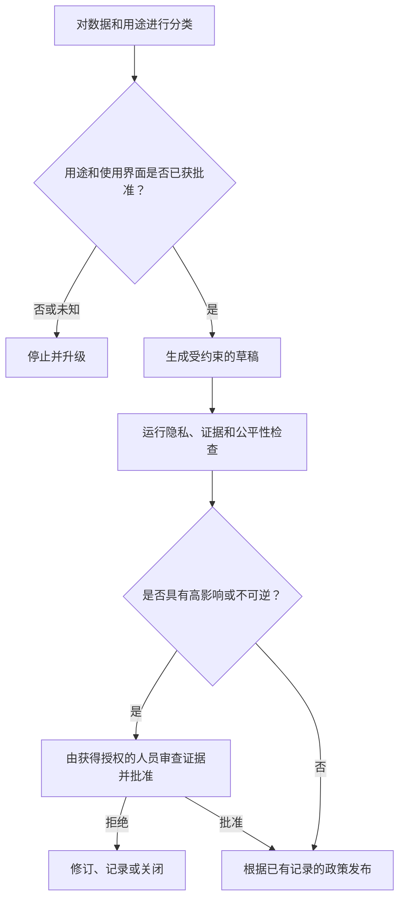

# 用职权约束能力

> 模型可以生成答案，但它未必有权查看数据、作出决策或执行操作。

**Type:** Learn
**Languages:** Python
**Prerequisites:** [将每项事实放入正确类型的上下文](../../04-context-knowledge-memory-and-caching/), [验证主张，而非置信度](../../05-output-evaluation-and-validation/), [Guardrails](../../../../../phases/11-llm-engineering/12-guardrails/)
**Time:** ~110 分钟

## 学习目标

- 在选择 Claude 使用界面或工作流之前，对信息和用例进行分类。
- 区分技术能力、组织许可和人工职权。
- 为隐私、安全、偏差、透明度、保留和滥用设计控制措施。
- 根据后果、可逆性和歧义程度设置人工审查。
- 为不安全或不合规行为构建事件处理和升级路径。

## 问题

一位客户成功经理希望加快账户审查。他们将支持记录、合同摘录和续约备注粘贴到未经批准的个人 AI 账户中。Claude 生成了有用的摘要，因此经理要求它按照续约风险对客户进行排名，并自动发送特别优惠。

在考虑输出质量之前，该工作流已经存在多项问题：

- 记录中包含个人数据和商业敏感数据。
- 没有人检查适用的产品条款和保留控制。
- 排名可能导致不同客户群体受到不均等对待。
- 经理无权自动批准折扣。
- 没有来源、审查过程或已发送消息的记录。

在 prompt 中添加“保护隐私”并不能修复系统。治理规定了谁可以使用哪些数据、用于什么目的、在什么界面上使用、需要哪些控制措施，以及最终由谁承担责任。

## 概念

### 处理前先分类

从数据和决策入手，而不是从模型入手。

一个简单的组织分类可能如下：

| 类别 | 示例 | 典型控制方向 |
|---|---|---|
| 公开 | 已发布的文档 | 验证完整性和归属 |
| 内部 | 非公开的流程备注 | 使用已批准的账户和访问控制 |
| 机密 | 合同、客户详细信息 | 仅使用最低限度的必要数据、严格权限、审查保留策略 |
| 受限 | 机密信息、受监管记录、高度敏感的标识符 | 禁止使用，或要求使用经过专门批准的受控工作流 |

这些标签只是示例，并非普遍适用的规则。请使用你所在组织的实际政策和法律指导。

还要对用例进行分类。为人工审查者汇总文本不同于决定资格或发送具有约束力的通信。低敏感度输入仍然可能支持高影响决策。

在接收请求时提出五个问题：

1. 哪些数据会进入工作流？
2. 获得批准的用途是什么？
3. 谁可以访问输入和输出？
4. 后续可能作出什么决策或执行什么操作？
5. 记录可以保留多长时间？

如果其中一个答案未知，正确的下一步可能是澄清政策，而不是生成内容。

### 能力、权限和职权相互独立

Claude 在技术上可能能够起草优惠方案。Connector 可能拥有访问客户记录的权限。但这两者都不意味着该工作流有权批准折扣或发送消息。

使用三道关卡：

```text
能力：系统能否执行该操作？
权限：此身份是否可以访问所需的数据或工具？
职权：此角色是否可以作出或执行该决策？
```

三者都必须通过。工具权限应该遵循最小权限原则。只向工作流提供其已批准用途所需的数据和操作。如果后果重大，应将读取、起草、批准和执行角色分开。

### 尽量减少数据并限制用途

用途限制意味着，获准用于一项工作的数据并不会自动获准用于另一项工作。为解决事件而收集的支持记录可能未获准用于客户画像分析。

数据最小化要求使用足够完成任务的最少输入：

- 不需要身份信息时删除姓名。
- 使用限定范围的引用替代精确标识符。
- 仅检索相关章节，而不是完整记录。
- 避免将机密信息放入 prompt 或日志。
- 将输出限制为下一步所需的字段。

最小化可以减少暴露、prompt 大小和意外的二次使用。它不能取代经过批准的使用界面和有记录的政策。

### 产品条款是可变化的事实

数据使用、保留、区域处理、管理控制和功能可用性可能因消费者产品、商业产品、API 使用方式、套餐和配置设置而异。这些事实也可能发生变化。

不要将对某个 Claude 使用界面的假设套用到另一个界面。部署前，请根据以下方面核验当前官方条款和你所在组织的合同：

- 提交的数据是否会被使用，以及如何使用。
- 默认和可配置的保留方式。
- 删除行为和法律例外情况。
- 管理访问权限和审计能力。
- 区域或数据驻留选项。
- Connector 和第三方数据处理方式。

在工作流决策日志中记录来源和核验日期。

### 人工审查应设置在决策边界

“Human in the loop”过于模糊。应明确这个人能看到什么、决定什么，以及能够阻止什么。

当以下一个或多个因素较高时，应设置更严格的审查：

- 对人员、财务、权利、安全或声誉造成的后果。
- 操作的不可逆性。
- 政策或证据中的歧义。
- 案例的新颖性。
- 操作执行后检测错误的难度。



审查者需要查看来源证据、模型输出、不确定性、政策约束和拟执行的操作。只有一个批准按钮会让监督流于形式。

### 公平性需要明确的人群和结果

仅仅要求模型保持无偏见并不能解决偏差问题。需要明确：

- 谁会受到影响？
- 什么结果会被分配或拒绝？
- 哪些属性或代理变量可能造成不合理的差异？
- 将使用什么比较方法和阈值？
- 谁有资格解释结果？
- 存在哪些申诉或纠正路径？

在合法且适当的情况下，针对相关群体分段进行测试。同时调查数据不平衡和工作流设计。即使进行人工审查，如果审查者看到的是相同的误导性证据，也可能重现相同的偏差。

对于涉及就业、信贷、住房、医疗、教育、公共服务或法定权利的决策，应让具备资质的政策、法律和领域负责人参与。本课程不构成法律建议。

### 透明度应服务于受影响的人

有效的透明度说明包括：

- 当政策要求披露时，说明 AI 提供了实质性协助。
- 哪些信息影响了结果。
- 还存在哪些不确定性或限制。
- 谁作出了最终决策。
- 如何请求纠正或提出申诉。

不要为了满足模糊的透明度要求而暴露隐藏的系统指令、安全控制、个人数据或专有推理。应以实现问责所需的层级解释流程和证据。

### Guardrails 需要纵深防御

Prompt 指令只是其中一层。稳健的工作流还可以包括：

- 输入分类和访问控制。
- 机密信息和个人数据检测。
- 可信来源检索过滤器。
- 工具 allowlist 和限定范围的凭据。
- 结构化输出和确定性验证。
- 内容和政策检查。
- 在执行后果重大的操作前进行审批。
- 速率和支出限制。
- 采用适当保留策略的审计日志。
- 监控、回滚和事件响应。

假设来源内容可能包含恶意指令。将检索到的文档视为数据，而不是命令。明确限定其边界，并将工具授权置于模型文本之外。

### 事件需要预先准备处理路径

事件可能包括隐私暴露、不安全建议、未经授权的工具使用、系统性偏差、prompt injection 或反复出现的无依据输出。

在发布前做好准备：

1. **检测：** 定义信号和报告渠道。
2. **遏制：** 暂停工作流、撤销凭据或禁用操作路径。
3. **保全：** 保留获准保存的证据，同时避免扩散敏感数据。
4. **通知：** 遵循组织和法律规定的升级规则。
5. **纠正：** 修复数据、权限、prompt、模型或工作流控制。
6. **学习：** 添加评估用例和监控措施，防止问题再次发生。

在未核查实际政策和司法管辖规定前，不要承诺删除数据、通知时间或给出法律结论。

## 动手构建

### 第 1 步：编写用例卡

```text
用途：
数据类别：
受影响的人：
允许的来源：
获准使用的 Claude 界面：
允许的输出：
禁止的操作：
人工决策负责人：
保留规则：
事件负责人：
```

用途、数据类别或操作职权发生变化时，必须获得明确批准。

### 第 2 步：创建控制图

将每项风险映射到预防性、检测性和纠正性控制：

| 风险 | 预防 | 检测 | 纠正 |
|---|---|---|---|
| 个人数据暴露 | 最小化输入并进行遮盖 | 扫描 prompt 和输出 | 遏制、通知、轮换访问凭据 |
| 无依据的建议 | 限制来源 | 主张与证据验证 | 阻止并修订 |
| 未经授权的操作 | 只读工具和审批 | 审计尝试执行的操作 | 撤销凭据并调查 |
| 不均等对待 | 定义标准和具有代表性的测试 | 分段评估 | 重新设计数据、政策或工作流 |

单一控制措施很少能够覆盖完整的故障路径。

### 第 3 步：设计审批资料包

审查者应该收到：

- 拟议的决策或操作。
- 支持性和冲突性证据。
- 数据和政策分类。
- 自动检查结果。
- 已知的不确定性。
- 可逆性和受影响的人群。
- 明确的批准、修订、拒绝和升级选项。

将人工决策与模型建议分开跟踪。

### 第 4 步：开展威胁研讨

至少测试以下情况：

- 意外出现受限数据。
- 已连接的文档包含要求忽略政策的指令。
- 用户请求的用途超出批准范围。
- 模型提出超出角色职权的操作。
- 评估显示某个受影响群体存在差异。
- 第三方 Connector 不可用或行为发生变化。

记录由哪项控制措施检测问题，以及接下来由谁采取行动。

## 交互实验

使用置信度风险图调整证据置信度、后果、可逆性和受影响的人群。该交互演示了为什么在职权或影响较高时，即使输出具有高置信度，仍然可能需要审查。

```figure
06-data-analysis-confidence
```

## 实践实验

运行治理评分器。将分析置信度提高到 1.0、移除人工关卡，或允许不可信内容授权变更操作。结果应该表明，置信度永远无法取代职权或后果控制。

## 交付产物

`outputs/responsible-use-control-map.json` 是一个填写完整的客户续约辅助治理资料包。它包含获准用途、数据类别、禁止的操作、预防性、检测性和纠正性控制、人工审批资料包以及事件负责人。

## 验证

验证控制措施：

```bash
cd certifications/claude/lessons/06-governance-safety-and-responsible-use/code
python3 main.py
python3 -m unittest discover tests -v
```

验证器会拒绝缺失控制层、没有负责人的事件、缺少已授权人工关卡的高影响操作，以及任何允许不可信内容授权变更操作的设计。

## Capstone 关联

测验会检查能力与职权的区别、最小化、特定使用界面的条款、审查质量、injection 边界和公平性响应。将此资料包带入 Associate capstone 29 和 Professional Architect capstone 32，作为治理和审批证据。

## 实际应用

### 考试决策模式

在治理场景中：

1. 对数据、用途和后果进行分类。
2. 检查当前获准使用的产品条款和组织政策。
3. 最小化输入和权限。
4. 将生成内容与决定或执行操作的职权分开。
5. 在高影响或不可逆操作前设置有实质意义的人工关卡。
6. 保留证据、可审计性、申诉机制和事件响应。

### 常见陷阱

- **仅靠 prompt 治理：** 一条语句无法强制执行访问或保留规则。
- **将技术访问权限视为职权：** 把 Connector 权限误认为业务批准。
- **对所有使用界面应用同一条隐私规则：** 产品和合同行为存在差异。
- **现在收集，以后再找用途：** 二次用途未获批准。
- **人工盖章：** 审查者缺少证据或无权拒绝。
- **通过指令实现公平：** 没有定义人群、衡量方法或申诉路径。
- **最大化日志记录：** 审计数据会产生新的隐私和安全风险。
- **确信合规：** 工作流在没有专业审查的情况下作出法律判断。

### 练习

1. 对你所在组织的三个工作流中的数据和操作进行分类。
2. 为一个 Claude 辅助流程创建用例卡。
3. 构建包含预防性、检测性和纠正性控制的控制图。
4. 使用最小权限原则重新设计范围过大的 Connector 权限。
5. 为一项后果重大的建议编写审批资料包。
6. 通过桌面推演模拟一次事件，并确定首个遏制操作。

## 关键术语

- **用途限制：** 仅将数据用于获准的目标。
- **数据最小化：** 仅处理实现该目标所必需的信息。
- **最小权限：** 授予所需的最小访问和操作范围。
- **人工决策关卡：** 一个明确的节点，获得授权的人员可以在此检查、拒绝、修订或批准。
- **纵深防御：** 在故障路径中设置多层控制。
- **Prompt injection：** 不可信内容试图改变模型或工具行为。
- **申诉路径：** 受影响的人对结果提出异议或要求纠正的流程。
- **事件响应：** 预先准备的检测、遏制、通知、纠正和学习措施。

## 延伸阅读

- [Anthropic：API 和数据保留](https://platform.claude.com/docs/en/manage-claude/api-and-data-retention)
- [Anthropic Privacy Center](https://privacy.anthropic.com/)
- [Anthropic Trust Center](https://trust.anthropic.com/)
- [Anthropic：Responsible Scaling Policy](https://www.anthropic.com/responsible-scaling-policy)
- [Anthropic：减少 prompt 泄露](https://platform.claude.com/docs/en/test-and-evaluate/strengthen-guardrails/reduce-prompt-leak)
- [AI Engineering from Scratch：安全、机密信息与审计](../../../../../phases/17-infrastructure-and-production/25-security-secrets-audit/)
- [AI Engineering from Scratch：合规框架](../../../../../phases/17-infrastructure-and-production/26-compliance-frameworks/)
- [AI Engineering from Scratch：公平性标准](../../../../../phases/18-ethics-safety-alignment/21-fairness-criteria-group-individual-counterfactual/)

隐私、保留、管理控制、产品条款和监管义务会发生变化，也可能因使用界面、套餐、合同、地点和设置而异。这些官方来源已于 2026-08-08 核验。在处理敏感数据或自动执行后果重大的决策前，请核验当前条款并获取所在组织具备资质人员的指导。
