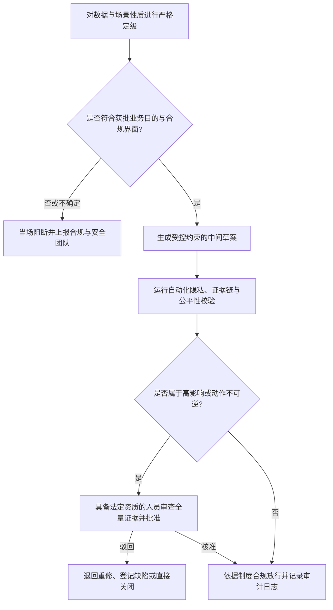

# 以制度权威规约技术能力

> 模型技术上能够输出答案，绝不代表它获得了查看该数据、做出该决策或触发该动作的合法授权。

**Type:** Learn
**Languages:** Python
**Prerequisites:** [将各类事实置于适得其所的上下文容器中](../../04-context-knowledge-memory-and-caching/), [检验断言真伪，而非轻信模型语气](../../05-output-evaluation-and-validation/), [Guardrails](../../../../../phases/11-llm-engineering/12-guardrails/)
**Time:** ~110 minutes

## 学习目标

- 在选定 Claude 产品界面或编排工作流之前，首先对业务数据密级与应用场景性质完成严格定级。
- 将系统的技术能力（Capability）、组织系统访问权限（Permission）与人类法定决策权威（Authority）三者彻底剥离。
- 针对数据隐私、网络安全、算法偏见、透明度说明、数据留存期与恶意滥用，建立全方位的纵深防御控制体系。
- 依据业务后果严重程度、动作物理可逆性以及政策模糊度，精准部署人工复核把关卡点。
- 针对安全失控或违规越权行为，构建具备明确行动预案的安全事故响应与分级升级上报机制。

## 问题背景

某客户成功经理为了追求更高的工单处理效率，直接将包含客户完整客服录音文本、商业合同节选以及续约谈判敏感便签，一股脑复制粘贴到了其未经企业 IT 审批备案的个人消费级 AI 账号中。Claude 迅速生成了非常具有参考价值的摘要，该经理便乘胜追击，要求模型自动根据客户续约风险进行评级打分，并直接通过系统自动对外推送差异化专属优惠折扣券。

在还没讨论输出质量之前，这条工作流就已经有好几处失败：
- 录音文本中充斥着真实的个人身份隐私（PII）与企业高度保密的商业机密。
- 没有任何人核实过该个人账号所适用的具体产品隐私条款、数据留存政策以及是否会被用于模型二次训练。
- 模型的黑盒排序打分算法，极易在不同客户群体之间诱发不公平的歧视性待遇。
- 该客户经理在公司章程中根本不具备擅自签发折扣合同的法定财务授权。
- 全流程没有任何可供审计的事实溯源底稿、人工复核签字记录或邮件发送审计日志。

在提示词里加上“保护隐私”，修不好这套系统。真正的 AI 治理工程，必须以铁的制度严密界定：究竟谁被允许使用何种数据、出于何种经审批的特定业务目的、在何种经过安全审计的产品界面上、施加何种防御性控制，以及由哪位具体的自然人承担最终的法律责任。

## 核心概念

### 在开始处理之前，必须首先完成定级

架构设计的起点永远是数据资产与决策属性本身，绝非大模型。

企业通用的数据分类基准参考矩阵：

| 数据密级 | 典型业务数据范例 | 核心控制准则与治理方向 |
|---|---|---|
| 公开数据 (Public) | 官方已对外公开发布的技术产品文档 | 重点校验数据完整性、准确性与合规引用标注 |
| 内部数据 (Internal) | 不对外公开的日常业务流程指南与内部知识库 | 仅限在经企业审批认证的租户账号与访问控制内处理 |
| 机密数据 (Confidential) | 商务合同原件、核心客户敏感资产明细 | 遵循最小必要数据原则，执行最严权限隔离与留存审计 |
| 绝密/受限 (Restricted) | 系统凭据密钥、强监管行业病历、高敏身份证件 | 默认绝对禁止输入，或必须经由专门安全法务审批的受控环境 |

上述分类标签仅为参考，实际工作中必须严格对照你所在企业的现行安全规范与属地法律指引。

对应用场景（Use Case）本身的定级同样至关重要。仅仅让模型提炼一段供人工参考的内部工作草稿，与让模型自动裁定用户是否具备贷款资质或直接向外部客户发送具有法律约束力的承诺函，有着本质区别。即使输入的只是一份低敏感度的公开文本，一旦其直接驱动一项高影响的重大业务决断，该场景依然属于高危工作流。

在任何 AI 流程立项受理（Intake）阶段，必须强制回答以下五个核心问题：
1. 究竟有哪些具体数据将流经该工作流？
2. 该流程已获正式合规审批的唯一特定业务目的是什么？
3. 谁获准访问原始输入数据以及模型生成的最终输出？
4. 该输出将直接引发或驱动何种后续业务决策与物理动作？
5. 相关的上下文日志、交互记录最多获准在系统中留存多少天？

只要上述任何一个问题答案尚处于模糊未知状态，当前最紧迫的动作就是立刻暂停推进并厘清合规政策，而不是盲目启动模型生成。

### 技术能力、系统权限与制度权威不可混淆

Claude 在技术上完全有能力撰写一份极具诱惑力的打折促销公文；接入的 Connector 在技术访问控制上也许碰巧能读取整张客户明细表。但这**绝不意味着该工作流在企业制度上获得了擅自批准折扣、或有权向客户群发邮件的法定授权**。

架构设计必须设立三重严格把关（Three Gates）：

```text
技术能力 (Capability): 算法与模型在技术上能否完成该项信息处理操作？
系统权限 (Permission): 当前的操作身份是否在技术凭据上获准访问该目标数据或外部工具？
制度权威 (Authority): 当前操作角色在组织架构与合规制度上，是否有权做出并执行该项业务决断？
```

唯有当上述三重门槛全部无条件通过时，系统才准放行执行。在外部工具集成中，必须严格恪守最小权限原则（Least Privilege）：只向工作流暴露其获批业务目的所绝对必需的字段与动作。在影响重大的场景中，必须将读取数据（Read）、起草建议（Draft）、合规审批（Approve）以及执行落地（Execute）四大角色在物理与流程上进行彻底分离。

### 严守目的限制与数据最小化原则

目的限制原则（Purpose Limitation）明确规定：为了某一业务目的获准采集处理的数据，绝不能在未重新获得显式授权的前提下，私自挪用于其他无关场景。客服团队为了排查定位线上 Bug 所收集的客户工单录音，绝不能在未经合规评审的情况下直接用于给销售团队做客户画像分析与商业转化推荐。

数据最小化原则（Data Minimization）要求向模型输入的上下文必须遵循“满足需要的最小充分集”：
- 只要业务不需要核实具体身份，在预处理阶段坚决抹去所有真实姓名与联系方式。
- 将具体身份证号或银行卡号替换为作用域受限的随机匿名代号（Tokenized Reference）。
- 仅按需检索与问题紧密相关的具体规章条款，严禁无脑把整本手册几十万字全塞进去。
- 严禁将 API 密钥、数据库连接密码等机密凭证写入 Prompt、上下文或落盘日志。
- 将模型的最终输出字段，严格限制为下游系统流转所必需的最小数据结构。

数据最小化不仅能从物理上大幅收敛泄露暴露面，还能显著压降 Token 开销并消除上下文无关噪音引发的次生风险。但请牢记：数据脱敏手段绝不能替代合规审批界面的正规采购。

### 产品隐私条款是动态时效事实

不同订阅形态、消费级与企业级商业合同、底层 API、不同云平台环境以及用户在后台的隐私开关设置，会导致底层数据处理协议、数据留存周期、计算所处物理地理区域以及管理员合规管控能力存在巨大差异。这些产品事实随时可能随政策升级而发生调整。

绝不可将某一界面的安全假定，盲目套用到另一个产品形态中。在项目正式部署投产前，必须基于企业签订的正式商业合同，逐项核实以下关键法律事实：
- 提交的数据是否会被官方保留？是否会被用于模型二次训练或服务改善？
- 默认的数据留存时长（Data Retention）是几天？是否支持企业自主配置或申请零留存？
- 数据主动删除机制的具体触发逻辑，以及法律豁免留存条款的边界。
- 企业管理员是否具备全局操作日志审计与合规导出能力。
- 模型推理计算是否支持严格限定在特定国家或地理合规区域（Data Residency）。
- 外部 Connector 在流经第三方 SaaS 服务时的数据处理与转发协议。

必须在架构决策记录中，白纸黑字附带当前核查的官方信源链接与核准日期。

### 人工复核必须部署在关键决策分水岭

泛泛而谈的“人类介入（Human-in-the-loop）”往往沦为空洞口号。必须在工程上严格界定：这名人类审核员在界面上具体看到了哪些核心依据、有权拍板做出何种决断，以及是否有能力紧急叫停流程。

当且仅当任务满足以下一个或多个特征时，必须设置强制的人工把关卡点：
- 决策直接关乎公民人身安全、财产权益、法定权利、健康医疗或企业重大声誉。
- 外部工具操作具有物理上的不可逆性（如转账付款、物理删除生产库或群发通知）。
- 业务规章政策存在高度模糊性，或提供的底层事实证据存在激烈冲突。
- 业务案例属于历史上从未遇到过的新型未知边缘场景。
- 一旦产生差错，在事后极难被及时发现或挽回纠偏。


```mermaid
flowchart TD
    A["对数据与场景性质进行严格定级"] --> B{"是否符合获批业务目的与合规界面?"}
    B -->|"否或不确定"| C["当场阻断并上报合规与安全团队"]
    B -->|"是"| D["生成受控约束的中间草案"]
    D --> E["运行自动化隐私、证据链与公平性校验"]
    E --> F{"是否属于高影响或动作不可逆?"}
    F -->|"是"| G["具备法定资质的人员审查全量证据并批准"]
    F -->|"否"| H["依据制度合规放行并记录审计日志"]
    G -->|"驳回"| I["退回重修、登记缺陷或直接关闭"]
    G -->|"核准"| H
```

呈送给人类审查员的，必须是一套证据确凿的决策数据包：包含底层原始证据摘录、模型生成提议、置信度盲区、前序自动化校验失败记录以及预期的外部操作影响。仅仅提供一个孤零零的“一键同意”按钮，只会催生敷衍了事的形式主义橡皮图章。

### 公平性需要明确受众群体与量化目标

对抗算法偏见绝不是在 Prompt 中念经般加上“请务必保持公平公正”就能解决的。严肃的工程治理必须明确：
- 该项业务流的具体受众群体涵盖哪些细分人群？
- 系统正在分配或扣留的关键业务资源与决策机会是什么？
- 哪些显式特征或隐式代理变量（Proxies）可能在不同人群间诱发不合理的差别待遇？
- 评测系统将采用何种量化比对指标与统计差异及格线？
- 由哪位具备业务资质的合规专家负责解读评测结果？
- 一旦个体遭受不公对待，系统为其保留了何种便捷的申诉修正通道？

在法律允许的前提下，按细分群体切片开展公平性基准测试。深入排查训练数据失衡与系统流程编排两方面的深层诱因。必须清醒地认识到：如果向人类审查员提供的仍然是存在系统性偏见的事实切片，人类审查同样会原封不动地继承并放大这些偏见。

在涉及招聘雇佣、信用授信、住房资格、医疗诊断、公共教育资源分配或司法权益等法定高危敏感领域，必须第一时间引入法务、合规与对应业务领域的专业团队介入。

### 透明度必须真正服务于受影响者

真正有价值的系统透明度应当做到：
- 在法规或企业合规制度要求时，主动向受影响用户显式披露“该内容由 AI 辅助生成”。
- 清晰阐明影响最终决策的核心事实依据与关键判定因素。
- 坦诚揭示系统存在的已知不确定性、盲区或模型局限性。
- 明确向受众公示对该决策负最终责任的实体或自然人。
- 提供清晰明确的申诉反馈渠道与事实修正指引。

绝不能为了虚无缥缈的所谓“绝对透明”，而去盲目向外界泄露底层的系统指令、防护代码安全机制、内部员工敏感信息或企业核心算法机密。透明度的精髓是在问责可追溯的层面上，清晰阐释处理逻辑与证据链条。

### 防护栏必须坚持纵深防御架构

提示词指令只是系统中最脆弱的第一道防线。生产级鲁棒架构必须构建纵深防御体系（Defense in Depth）：
- 请求输入阶段的数据密级分类与前置访问控制拦截。
- 敏感隐私数据与系统凭证密钥的实时扫描过滤。
- 限制仅能从经过企业数字签名的权威受信知识源拉取检索。
- 严格限制外部工具白名单，并为工具调用分配极低权限的临时联邦凭证。
- 强制推行结构化输出 Schema 并执行硬编码确定性校验。
- 部署独立于主模型的安全合规与违规内容审查管道。
- 涉及外部不可逆物理动作前，必须强制走人工审批流。
- 严格设定 API 速率限制（Rate Limits）与全局消费预算硬阈值。
- 建立全链路审计追踪日志，并配置符合法律法规的留存期。
- 建立完善的实时异常监控、一键版本回滚与故障应急响应机制。

在架构设计中，必须默认所有外部传入的资料均可能夹带恶意攻击指令。坚决把外部检索到的文档当作纯文本数据（Data）处理，严禁将其直接混为执行指令（Commands）。通过严密的分隔符进行物理隔离，将工具执行的鉴权控制逻辑牢牢锁定在模型文本视野之外的代码层面。

### 建立系统化的安全事故响应预案

AI 生产事故的形态极为多样：隐私数据意外泄露、模型给出了具有致命危险的指导、外部工具发生越权越狱调用、系统展现出严重的群体偏见歧视、遭遇恶意 Prompt 注入攻击，或者关键业务断言大规模失真。

在系统正式发布上线之前，必须确立六步应急响应预案：
1. **Detect (敏锐监测):** 明确界定异常告警指标，畅通内外部举报反馈通道。
2. **Contain (紧急止损):** 具备一键暂停工作流、吊销 API 凭据或紧急切断外部工具写权限的开关。
3. **Preserve (取证保全):** 在杜绝敏感数据二次扩散的前提下，完整固化保留现场故障证据链。
4. **Notify (合规通报):** 严格依照企业内部安全协议与属地法律时限要求，向上级及监管机构合规报备。
5. **Correct (根因根治):** 针对性修补数据源缺陷、调整权限策略、重构提示词或加固工作流代码。
6. **Learn (复盘沉淀):** 将本次事故抽象为全新的对抗评测用例，并将其纳入日常回归监控体系，杜绝历史故障二次发生。

切忌在未充分核实具体法律条款与属地司法管辖权之前，向受影响方做出有关即刻彻底销毁数据或免除责任的轻率承诺。

## 动手构建

### 第一步：编写业务用例卡片 (Use-Case Card)

在开展系统研发前，严格填报此卡片并提交合规归档：

```text
获批业务目的 (Purpose):
涉及数据密级 (Data classes):
潜在受影响人群 (Affected people):
获准接入的权威信源 (Allowed sources):
经审批合规的 Claude 界面 (Approved Claude surface):
允许输出的字段与形态 (Allowed outputs):
严禁执行的越权行为 (Prohibited actions):
最终责任人与决策审批官 (Human decision owner):
数据法定留存期规则 (Retention rule):
安全事故应急责任人 (Incident owner):
```

凡涉及业务目的变更、引入新密级数据或申请外部动作权限，必须强制走二次审批流。

### 第二步：建立控制矩阵图谱 (Control Map)

将潜在的业务安全风险，系统性映射为“事前预防、事中监测、事后纠偏”三道防线：

| 核心风险项 | 预防性控制 (Prevent) | 监测性控制 (Detect) | 纠偏性控制 (Correct) |
|---|---|---|---|
| 个人身份隐私数据泄露 | 输入前置自动扫描脱敏与字段最小化剪枝 | 针对 Prompt 与模型输出做高频敏感模式实时扫描 | 立即熔断阻断链路、通报安全团队、一键轮换访问凭证 |
| 输出未经证实的错误推论 | 将知识检索范围死死限定在权威信源白名单内 | 自动化运行断言-证据对照矩阵校验 | 坚决阻断对外发布并强制退回上一阶段修改 |
| 外部工具发生未授权动作 | 工具接入默认全配置为只读，外部写入强制人工审批 | 对所有工具尝试发起的调用动作实施全量审计追踪 | 立即吊销该应用系统访问令牌，并启动越权事故溯源排查 |
| 不同客群遭受不公差异化待遇 | 明确公平性准则并构建覆盖各类人群的评测基准 | 按细分客群定期切片跑测统计差异指标 | 彻底复盘原始数据偏差，重构业务决策模型或人工复核规则 |

没有任何单一控制能够单独抵御全部攻击路径，三道防线缺一不可。

### 第三步：设计高管终审审批包 (Approval Packet)

向负责最后把关的人类决策者呈送高度结构化的审批数据流：
- 拟采纳的最终业务决策或待执行动作。
- 支撑该决断的关键事实证据与相反分歧记录。
- 数据资产密级与合规政策条款索引。
- 前置各项自动化校验的通过状态与具体得分。
- 系统当前已知的置信度盲区与不确定性列表。
- 该动作是否具备物理可逆性，以及受影响群体的规模。
- 界面上必须提供结构化、明确的选项：**同意 (Approve)**、**退回修改 (Revise)**、**直接驳回 (Reject)** 以及 **向上升级 (Escalate)**。

将人类的最终签字决断，与模型的算法生成建议在数据库中明确分离存储归档。

### 第四步：开展全真威胁建模红蓝对抗演练 (Threat Workshop)

组织团队系统性演练以下六类极限边界：
- 知识库中意外混入了未脱敏的绝密敏感数据。
- 某份外部参考文档中被蓄意植入了诱导模型忽视安全政策的恶意 Prompt 注入指令。
- 前端用户尝试输入超出审批范围的未授权业务诉求。
- 模型在输出中建议直接执行一项超越该账号权限的高危操作。
- 针对受影响群体的切片评测显示通过率存在严重的统计学分布差异。
- 某个第三方外部 Connector 突然发生网络故障离线或返回了异常数据格式。

详细记录哪一项防御性控制率先成功捕获了险情，以及下一棒由哪位具体安全责任人接管处置。

## 交互式实验

通过下方的分析置信度与潜在风险图表（Confidence-risk figure），交互式调整事实证据置信度、决策潜在破坏力、动作可逆性以及受影响人群规模。深入领会：为什么即便模型给出的输出置信度高达 1.0，只要其面临重大业务影响或涉及法定权威，系统依然必须强制保留人类终审把关卡点。

```figure
06-data-analysis-confidence
```

## 实战演练

在本地运行治理决策评分器。尝试把模型分析的置信度人为拉满至 1.0、刻意抹去人工审批流程，或故意构造允许不可信文本直接触发数据库数据修改的高危逻辑。观察校验器是如何果断拦截报错的：它将有力证明**无论模型语气多么自信，它永远无法代替人类制度权威与后果防线**。

## 交付产物

`outputs/responsible-use-control-map.json` 包含一份填报完备的客户续约流治理工程包。内含经过正式审批的业务目的、涉及数据密级划分、明确的禁止越权动作清单、覆盖全流程的三道防线控制矩阵、人类审批数据包格式规范，以及明确的安全应急事故责任人。

## 验证方法

在本地终端执行确定性安全策略校验：

```bash
cd certifications/claude/lessons/06-governance-safety-and-responsible-use/code
python3 main.py
python3 -m unittest discover tests -v
```

该校验脚本会自动证明：控制矩阵完整具备三道防线；安全事故具备具体的应急负责人；重大影响动作必须强制走人工授权关卡；并坚决否决任何允许外部不可信数据直接驱动外部系统状态变更的高危系统设计。

## 项目连接

配套自测题重点考察能力与权威的解耦、数据最小化原则、具体界面隐私条款差异、人工把关质量、Prompt 注入物理隔离以及算法偏见应对。在第 29 课的 Associate 毕业设计与第 32 课的 Professional Architect 毕业设计中，本治理工程包将直接作为你向评审委员会提交的安全架构与合规落地核心凭据。

## 实践应用

### 考试决策模式

在解答考纲中涉及数据治理与负责任 AI 场景题时，请严格遵循以下思考顺序：
1. 首先对数据密级、获批业务目的以及潜在失败后果进行严格定级。
2. 核验当前具体使用的产品界面所适用的正式合同条款与企业内部规章。
3. 对输入数据与外部工具访问权限施加极致的数据最小化与最小特权控制。
4. 坚决将技术生成能力，与做出决断的法定制度权威清晰剥离。
5. 在高业务影响或动作不可逆的关键节点，设立绝非橡皮图章的实质性人类终审门槛。
6. 完善事实底稿溯源链、审计可追溯性、用户申诉通道以及全套应急响应预案。

### 常见陷阱

- **企图单靠 Prompt 搞安全治理：** 自然语言指令绝不可能在物理上保证数据不落盘或限制数据留存周期。
- **误把技术连通性当成业务授权：** 仅仅因为 Connector 拥有读取数据库的凭据，就误当成该操作获得了合规审批。
- **用一套隐私假设通吃所有产品界面：** 混淆个人网页版、企业版租户与底层 API 之间巨大的数据保护协议差异。
- **先大肆搜集数据，日后再想怎么利用：** 严重的违背目的限制原则，极易引发次生合规灾难。
- **把人类专家变成走过场的橡皮图章：** 审查员既看不到底层原始证据，也不具备驳回权，导致人工复核彻底沦为形式主义。
- **企图靠口头警告消除算法偏见：** 从未定义过具体的受影响群体、量化指标基线与事后申诉机制。
- **盲目记录所有原始数据当作审计日志：** 审计日志本身未经脱敏，反而造成严重的大规模敏感数据泄露隐患。
- **脱离法务指导擅自做出合规承诺：** 在未经专业法务团队研判的情况下，擅自向客户做出有关满足特定法规条款的断言。

### 课后习题

1. 从你当前负责的业务系统中挑选 3 个不同的 AI 工作流，严格为其涉及的数据资产与执行动作完成权威定级。
2. 为一个即将引入 Claude 辅助的真实业务场景，完整编写一份规范的业务用例卡片（Use-Case Card）。
3. 针对一个高风险业务流程，亲手搭建覆盖“事前预防、事中监测、事后纠偏”三道防线的系统控制矩阵。
4. 针对一个被过度赋予了全局超级权限的外部 Connector，利用最小特权原则完成精细化安全重构。
5. 为一项面临高危经济后果的模型建议，设计一套包含证据、置信度盲区与可逆性评估的结构化审批数据包。
6. 组织一次团队桌面演练（Tabletop Exercise），模拟一次线上隐私数据意外泄露事故，并明确列出第一分钟应当执行的止损动作。

## 核心术语

- **Purpose limitation (目的限制原则):** 明确规定数据仅能用于最初获准审批的特定业务目标，严禁擅自挪用于未经评估的次生场景。
- **Data minimization (数据最小化原则):** 在数据处理与交互过程中，仅提取并注入实现该特定业务目标所绝对必需的最小限度信息。
- **Least privilege (最小特权原则):** 仅向特定的程序、人员或外部工具授予其履行本职工作所必需的最小范围访问权限与动作范围。
- **Human decision gate (人类决策把关卡点):** 流程中设立的法定控制卡点，由具备相应业务资质的人员在此审查全量证据，并有权执行批准、修改或驳回。
- **Defense in depth (纵深防御体系):** 绝不依赖单一的安全防护措施，而是在攻击链路与失效路径的全流程部署多层互补的控制屏障。
- **Prompt injection (提示词注入攻击):** 外部不可信的数据内容中夹带恶意伪造的系统指令，企图诱导模型突破安全防御或篡改工具行为的攻击手段。
- **Appeal path (申诉与修正通道):** 明确向受到自动化系统决策影响的最终利益相关者提供的、可申请人工复审并在证实有误时强制纠错的制度化通道。
- **Incident response (安全事故应急响应机制):** 预先建立的涵盖险情监测、紧急止损隔离、证据链保全、多方合规通报、技术修复与复盘沉淀的标准响应预案。

## 延伸阅读

- [Anthropic 官方开发指南：API 鉴权与数据留存安全规范](https://platform.claude.com/docs/en/manage-claude/api-and-data-retention)
- [Anthropic 官方隐私政策中心 (Privacy Center)](https://privacy.anthropic.com/)
- [Anthropic 企业信赖中心 (Trust Center)](https://trust.anthropic.com/)
- [Anthropic 负责任扩展政策 (RSP, Responsible Scaling Policy)](https://www.anthropic.com/responsible-scaling-policy)
- [Anthropic 官方安全实践：最大限度防止提示词泄露与注入](https://platform.claude.com/docs/en/test-and-evaluate/strengthen-guardrails/reduce-prompt-leak)
- [AI 系统安全架构：机密凭证治理与审计日志追踪](../../../../../phases/17-infrastructure-and-production/25-security-secrets-audit/)
- [企业级生产环境合规框架体系与实践指南](../../../../../phases/17-infrastructure-and-production/26-compliance-frameworks/)
- [大模型伦理对齐：算法公平性判别准则与反事实评估](../../../../../phases/18-ethics-safety-alignment/21-fairness-criteria-group-individual-counterfactual/)

有关数据隐私、留存周期、后台管控能力、商业条款以及属地监管政策处于快速演进中，且因所处地理区域、采购方案与功能配置而各异。上述官方资料核验于 2026 年 8 月 8 日。在将敏感业务数据接入模型或推进高影响自动化决策之前，务必对照当前官方文档核实最新条款，并在专业法务团队指导下推进。
