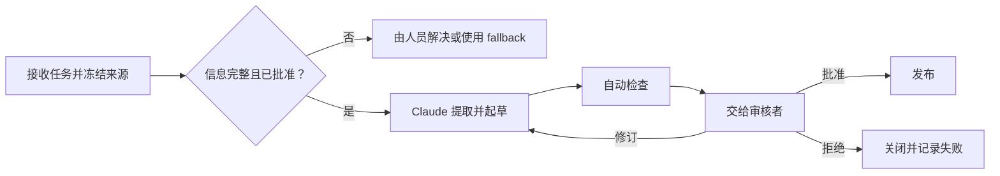

# 在自动化之前设计交接

> 工作流不会在 Claude 完成任务时结束。只有当下一个人能够验证、决策、行动并恢复时，工作流才算完整。

**Type:** Learn
**Languages:** Python
**Prerequisites:** [验证主张，而非置信度](../../05-output-evaluation-and-validation/), [为能力划定权限边界](../../06-governance-safety-and-responsible-use/), [Anthropic 工作流模式](../../../../../phases/14-agent-engineering/12-anthropic-workflow-patterns/)
**Time:** ~105 分钟

## 学习目标

- 在选择 Claude 应参与的位置之前，绘制当前工作流。
- 决定应辅助、自动化、重新设计还是拒绝某个工作流步骤。
- 明确步骤的输入、输出、负责人、关卡、fallback 和服务预期。
- 构建能够保留证据、不确定性和权限的人工交接材料包。
- 衡量工作流价值，同时将审核、故障和维护成本纳入考虑。

## 问题

某产品团队将每周发布简报自动化。Claude 读取 issue 摘要、起草简报，并在每周五将其发布到共享频道。

前两份简报节省了时间。第三份包含一项已被移出范围的功能。第四份遗漏了一个尚未解决的安全问题。过去负责汇编简报的工程师认为现在由产品经理负责审核。产品经理则认为自动发布的内容已经获得批准。

团队自动化了文本生成，却删除了职责归属模型。数据不完整时，没有来源截止点、审批关卡、升级路径或 fallback。

成功的工作流不是一串模型调用，而是一条由明确证据和可恢复状态支撑的职责链。

## 概念

### 首先绘制当前状态

在加入 Claude 之前，先观察工作实际如何流转：

- 什么事件会启动工作？
- 谁提供每项输入？
- 哪些系统是 source of record？
- 人们在哪些环节运用判断？
- 哪些异常消耗的时间最多？
- 谁批准结果？
- 随后会执行什么下游操作？
- 如何检测故障并从中恢复？

不要只记录理想流程。跟踪几个真实案例。非正式检查通常承载着关键知识。如果在没有将这些检查编码或明确分配给负责人的情况下移除它们，质量就会下降，而新工作流表面上却显得效率更高。

### 选择干预方式，而不只是选择工具

对于每个步骤，从四种干预方式中选择：

1. **辅助：** Claude 提议、总结、提取或起草内容，而人员仍然是操作者。
2. **自动化：** 系统在政策约束下执行范围明确、经过充分测试且可逆的步骤。
3. **重新设计：** 当前步骤是由低质量输入或重复系统造成的浪费，因此应将其移除或重构。
4. **拒绝：** 由于数据、后果、歧义或政策导致风险不可接受，该步骤不应使用 Claude。

自动化并不总是成熟度最高的选择。如果分析师花费数小时核对两个相互冲突的电子表格，更快地生成核对说明并不能解决来源冲突。

### 将每个步骤定义为契约

每个步骤都应包含：

```text
触发条件：
负责人：
允许的输入和来源：
转换：
输出 schema：
通过标准：
超时或服务预期：
升级条件：
Fallback：
下一负责人：
```

这份契约让你能够独立测试每个步骤，并防止职责在系统之间消失。

对于发布简报的提取步骤：

```text
触发条件：周四 15:00 冻结来源
负责人：发布协调员
输入：已批准的 tracker 视图和已签署的安全状态
输出：包含来源 ID 和状态的结构化候选项
通过标准：涵盖所有必需团队；标记未解决字段
升级条件：缺少安全状态或发布状态存在冲突
Fallback：协调员使用手动模板
下一负责人：产品经理验证纳入决策
```

### 根据后果和可逆性设置控制措施

两个问题决定自动化的深度：

1. 如果结果错误，后果有多严重？
2. 能否在造成损害之前以较低成本撤销操作？

| 后果 | 可逆 | 设计方向 |
|---|---|---|
| 低 | 是 | 可以考虑采用带监控的有界自动化 |
| 高 | 是 | 先生成或暂存，再要求发布前审核 |
| 低 | 否 | 增加确认、审计并缩小范围 |
| 高 | 否 | 保留由获授权人员执行的决策关卡和可靠的 fallback |

存储待审核草稿不同于向数千名客户发送消息。应将操作权限视为一项独立能力。

### 选择与依赖关系匹配的工作流模式

Claude 工作流通常使用少数几种模式：

- **Prompt chaining：** 固定序列，其中每个阶段都可接受检查。
- **Routing：** 对工作进行分类，并将其发送到专门路径。
- **Parallelization：** 并行运行相互独立的分析并协调结果。
- **Orchestrator-workers：** 协调器将可变工作拆分为子任务并综合结果。
- **Evaluator-optimizer：** 生成内容、根据标准审核，并持续修订，直到通过关卡或达到限制。

优先选择能够表达实际工作的最简单模式。固定的五阶段报告不需要开放式 agent。Routing 工作流需要可观测的路由信号，并为模糊案例提供 fallback。



### 交接本身就是产品

交接应尽量减少重复查找。向下一位负责人提供：

- 所需决策和截止时间。
- 工作流的范围和版本。
- 来源 ID 和时效状态。
- 候选输出。
- 已通过和未通过的检查。
- 已知的不确定性和冲突。
- 已执行的操作。
- 可选操作：批准、修订、拒绝、升级。
- Fallback 和恢复说明。

不要将关键注意事项埋在长篇对话记录的末尾。应围绕决策组织交接内容。

接收者必须知道哪些责任仍归自己承担。“请审核”并不完整。“请确认 R-14 和 R-19 是否获准对外发布；其他所有检查均已通过”才具有可操作性。

### 在故障中保留状态

长工作流会发生故障。API 会超时，connector 会返回部分数据，审核者会错过截止时间，输入也可能在生成后发生变化。

在有意义的边界设置 checkpoint：

- 来源快照已接受。
- 提取结果已验证。
- 草稿版本已生成。
- 审核发现已记录。
- 审批已记录。
- 外部操作已完成。

尽可能让重试具备 idempotency。重新生成草稿通常是安全的。在没有 idempotency key 的情况下重新执行发送或财务操作，可能会重复造成损害。

在上线前定义手动 fallback。如果当前没有员工能够执行某个 fallback，那么这种韧性只是虚构的。

### 衡量工作流，而不是演示

同时跟踪价值和风险：

```text
净价值 = 节省的时间
       - 人工审核时间
       - 纠正和事件成本
       - 平台和模型成本
       - 维护成本
```

有用的运营指标包括：

- 端到端完成时间。
- 排队和审核时间。
- 首次通过率。
- 高严重性错误通过率。
- 升级率和 fallback 使用率。
- 每个案例的返工量。
- 每个已接受结果的成本。
- 来源时效性故障。
- 用户纠正和申诉结果。

如果审核变得更加困难，即使生成阶段更快，也不一定能缩短端到端时间。

### 根据利益相关者沟通限制

高管需要预期价值、风险边界和就绪证据。操作者需要确切的输入、故障信号和 fallback 步骤。审核者需要标准和权限。安全与政策负责人需要数据流、权限、保留策略和事件控制措施。

不要将能力演示当作生产证据。明确说明测试了什么、使用了哪些案例、哪些职责仍由人员承担，以及哪些当前产品事实需要重新验证。

## 构建它

### 第 1 步：绘制一个真实案例

使用角色和系统绘制当前流程。标出：

- 等待时间。
- 返工循环。
- 判断点。
- Source of record 查询。
- 外部操作。
- 已知异常。

询问操作者，哪项非正式检查能够防止最严重的错误。

### 第 2 步：为候选干预方式评分

针对每个步骤，按 1 到 5 分进行评分：

| 因素 | 问题 |
|---|---|
| 重复性 | 相同的转换是否会反复发生？ |
| 清晰度 | 能否写出通过标准？ |
| 数据审批 | 输入是否已获得批准并受到控制？ |
| 可逆性 | 错误操作能否被阻止或撤销？ |
| 可检测性 | 能否在造成损害前发现故障？ |

低分意味着更适合辅助、重新设计或拒绝，而不是自动化。

### 第 3 步：编写未来状态契约

定义每个步骤、负责人、关卡、checkpoint、fallback 和服务预期。明确写出手动路径。然后让操作者、审核者和政策负责人分别演练一个正常案例和一个异常案例。

### 第 4 步：构建交接材料包

使用稳定的模板：

```text
所需决策：
截止时间和负责人：
工作流和来源版本：
候选结果：
证据：
已通过的检查：
未通过的检查：
不确定性：
可执行的操作：
Fallback：
```

拒绝缺少必要阻断项或来源版本的材料包。

### 第 5 步：以 shadow mode 试运行

让 Claude 与现有流程并行运行，但不允许其执行外部操作。比较结果和审核工作量。应包含异常，而不只是简单案例。只有在关卡通过且事件负责人准备就绪后，才能进入有限发布阶段。

## Interactive Lab

使用审核阈值 figure 调整后果、可逆性、歧义和证据完整性。控制方式应从有界自动化转为强制审核，避免工作流在进入不可逆状态前缺少审核。

```figure
07-human-review-threshold
```

## Practice Lab

运行交接评分器。从发布步骤中移除负责人、checkpoint、fallback 或审批，并观察契约验证失败。然后清除尚未解决的审核检查，比较建议的下一步操作。

## Shipped Artifact

`outputs/workflow-handoff-packet.json` 是一份已填写的发布简报工作流，包含步骤负责人、关卡、checkpoint、fallback、服务预期和可执行的审核者材料包。

## Verify It

在本地验证工作流：

```bash
cd certifications/claude/lessons/07-workflow-design-and-human-handoffs/code
python3 main.py
python3 -m unittest discover tests -v
```

validator 会检查每个步骤是否包含负责人、关卡、升级方式、fallback 和下一负责人；不可逆发布是否需要人工审批；以及交接内容是否明确列出未通过的检查和可选决策。

## Capstone Connection

测验会考查当前状态绘制、重新设计、交接内容、重试安全性、职责归属和 shadow mode 就绪情况。将通过验证的材料包作为 Associate capstone 29 的运营与审核者交接材料提交。

## 使用它

### 考试决策模式

对于工作流场景：

1. 绘制当前决策、证据、角色和异常路径。
2. 在实现自动化之前消除流程浪费。
3. 选择符合依赖关系的最简单模式。
4. 在高后果或不可逆边界保留人工权限。
5. 发送包含证据和未通过检查的结构化交接材料。
6. 在上线前定义 checkpoint、fallback、监控和职责归属。

### 常见陷阱

- **自动化文本，却删除负责人：** 没有人知道该由谁批准。
- **将演示视为部署证据：** 常规示例掩盖了异常情况和运营问题。
- **为固定流程使用开放式 agent：** 复杂性增加，却没有带来价值。
- **并行处理存在依赖的工作：** 在证据得到验证之前就开始综合。
- **将 human in the loop 当作口号：** 不存在审核材料包或拒绝权限。
- **没有来源截止点：** 输入在输出审批期间发生变化。
- **重试所有操作：** 不可逆操作可能执行两次。
- **将节省时间作为唯一指标：** 审核、纠正、故障和维护成本被忽略。

### 练习

1. 绘制一个重复发生的工作流，并找出一项非正式质量检查。
2. 将每个步骤归类为辅助、自动化、重新设计或拒绝。
3. 为价值最高的候选步骤编写步骤契约。
4. 为只有五分钟审核时间的审核者设计交接材料包。
5. 进行一次桌面故障演练：来源在审批后、发布前发生变化。
6. 定义五项能够揭示工作流是否创造净价值的指标。

## 关键术语

- **Current-state map：** 对工作当前实际流转方式的描述。
- **Step contract：** 工作流步骤的触发条件、负责人、输入、转换、输出、关卡、升级方式、fallback 和下一负责人。
- **Handoff packet：** 为下一位责任人准备的结构化状态和证据。
- **Checkpoint：** 经过验证的阶段之后，用于持久恢复的节点。
- **Idempotency：** 重复执行某项操作不会重复产生其效果的性质。
- **Shadow mode：** 运行新工作流，但不允许其控制实际结果。
- **Fallback：** 当自动化路径不安全或不可用时采用的、经过测试的替代路径。
- **Source cutoff：** 确定输出所代表输入范围的版本边界。

## 延伸阅读

- [Anthropic：构建有效的 agent](https://www.anthropic.com/research/building-effective-agents)
- [Anthropic：定义成功标准并构建评估](https://platform.claude.com/docs/en/test-and-evaluate/develop-tests)
- [AI Engineering from Scratch：Scope Contracts](../../../../../phases/14-agent-engineering/36-scope-contracts/)
- [AI Engineering from Scratch：Verification Gates](../../../../../phases/14-agent-engineering/38-verification-gates/)
- [AI Engineering from Scratch：Multi-Session Handoff](../../../../../phases/14-agent-engineering/40-multi-session-handoff/)
- [AI Engineering from Scratch：Propose Then Commit](../../../../../phases/15-autonomous-systems/15-propose-then-commit/)

Claude 产品功能、connector 行为、模型能力、限制和成本可能发生变化。这些来源已于 2026-08-08 完成核查。在将工作流从 shadow mode 转入生产环境之前，请重新核实最新官方文档和组织控制措施。
