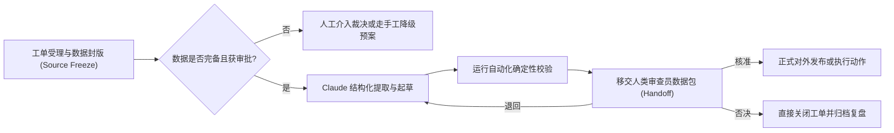

# 在推进自动化前，先设计好人机交接契约

> 一个工作流绝不会在 Claude 吐完文本的那一刻宣告结束；只有当下游的自然人能够顺利核验、决断、落地并在异常时从容恢复时，流程才算闭环。

**Type:** Learn
**Languages:** Python
**Prerequisites:** [Validate the Claim, Not the Confidence](../../05-output-evaluation-and-validation/), [Put Authority Around Capability](../../06-governance-safety-and-responsible-use/), [Anthropic Workflow Patterns](../../../../../phases/14-agent-engineering/12-anthropic-workflow-patterns/)
**Time:** ~105 minutes

## 学习目标

- 在盲目决定将 Claude 接入系统之前，首先对现有业务的真实流转全景展开系统化测绘。
- 理性决断针对业务流程中的特定步骤究竟应当采取辅助（Assist）、自动化（Automate）、重构（Redesign）还是直接驳回（Reject）。
- 为每个流程步骤精确界定输入、输出、责任人、准入准出把关门槛、异常回退兜底以及 SLA 服务预期。
- 构建能够完整保留事实证据链、置信度盲区与法定制度权威的结构化人机交接数据包（Handoff Packets）。
- 客观量化评估工作流的真实业务净价值，全面纳入人工复核、差错返工以及长期系统维护成本。

## 问题背景

某产品研发团队尝试将其每周的版本发布简报流程进行“端到端全自动化改造”。系统由定时脚本驱动，每周五自动调用 Claude 读取项目看板上的 Issue 摘要，起草发布简报，并直接自动推送到公司全员公共大群中。

在最初两周，这套自动化机制确实为团队节省了时间。然而到了第三周，简报中赫然出现了一项因技术阻碍早已在周三被移出本期发版范围的高危新特性；第四周，简报更是漏掉了一个尚未闭环确认的重大线上安全隐患警告。过去负责手动汇总简报的资深工程师以为产品经理在后台默默承担了审阅职责；而产品经理则误以为既然文字已经被机器人自动发到了大群，说明前置环节早已经过架构师的审批。

团队仅仅自动化了自然语言文本的拼接生产，却在不知不觉中彻底抹杀了流程中的**责任归属模型（Ownership Model）**。这里没有明确的数据源封版时间点（Source Cutoff）、没有正式的人工核准把关门槛、没有异常上报升级通道，更没有任何在数据残缺时可供执行的降级兜底预案。

一个真正成功的企业级生产工作流，绝不是一串单纯的大模型 API 调用链；它是一条责任边界泾渭分明、事实依据清晰可查、且具备随时安全容错恢复能力的责任链条。

## 核心概念

### 首先测绘现状的真实流转全景

在引入 Claude 之前，必须深入一线实地观察业务在现实中究竟是如何运转的：
- 究竟是哪一个外部事件或定时信号触发了流程的启动？
- 每一个输入数据字段究竟由哪位具体员工或哪个系统提供？
- 哪些系统被认定为具备法律效力的单一法定真理源（Sources of Record）？
- 流程在流转到哪一步时，高度依赖人类专家的主观专业经验进行裁决？
- 哪些非标准例外情况消耗了日常大部分的工时？
- 最终的交付成果具体必须由哪位具备法定资质的主管签字核准？
- 该成果后续会直接触发哪些关键的下游系统动作？
- 一旦发生系统差错，是如何被发现、定位并实施容错挽回的？

切忌仅仅对着纸面上理想化的“标准作业规范”闭门造车。必须亲自跟班跟踪几个真实的生产案例。很多非正式的潜规则检查，往往沉淀了团队最宝贵的核心业务隐性知识。如果你在未将其代码化或制度化指定责任人的前提下就轻率将其删除，系统质量必然崩塌，而表面上看新流程却显得“格外敏捷高效”。

### 挑选最适宜的介入策略，而非执念于上工具

针对流程中的每一个具体环节，必须从以下四种介入手段中做出理性抉择：

1. **辅助赋能 (Assist):** Claude 负责提炼摘要、提取实体或起草初稿，但人类专家始终担任核心操作者与最终拍板人。
2. **受控自动化 (Automate):** 系统在受到严格测试且符合安全政策的前提下，全自动执行某个边界狭窄、可逆且已被充分验证的操作。
3. **流程重构 (Redesign):** 现存的该步骤本质上是由于输入数据源脏乱或跨部门系统重复冗余造成的无谓浪费，应当果断予以裁剪或结构性重塑。
4. **坚决驳回 (Reject):** 由于输入数据极其敏感、业务失败后果过于惨重、规则极度模糊或法规政策明令禁止，坚决严禁在此环节引入大模型。

实现全自动化绝不代表架构成熟度的最高境界。如果两名业务分析师每天花费数小时在人工对账两张自相矛盾的电子表格，那么让大模型以毫秒级速度生成一段更流畅的对账解释，根本没有触及底层数据源冲突的根本病灶。

### 将每个流转步骤定义为严密的工程契约

流水线中的每一个处理步骤，都必须以契约化规范白纸黑字严格定义：

```text
触发条件 (Trigger):
责任人 (Owner):
允许接入的输入与权威信源 (Allowed inputs and sources):
执行的具体转换逻辑 (Transformation):
输出交付的数据 Schema (Output schema):
准入准出验收门槛 (Pass criteria):
处理超时与 SLA 服务预期 (Timeout or service expectation):
触发异常升级的条件 (Escalation condition):
降级兜底预案 (Fallback):
交付的下游承接责任人 (Next owner):
```

契约化设计使得每一个处理环节都能开展独立的单元测试，坚决杜绝技术职责在复杂系统缝隙中被推诿淡化。

以发布简报的信息提取步骤为例：
```text
触发条件: 每周四下午 15:00 数据源冻结封版 (Source Freeze)
责任人: 发版协调专员 (Release Coordinator)
允许输入: 经产品委员会签发的 Jira 看板视图以及安全负责人数字签名的安全审计状态
输出形态: 带有唯一 Issue ID 与明确状态的结构化候选清单
验收门槛: 涵盖全部核心业务研发线；所有字段必须完整填充无盲区
升级条件: 缺少安全负责人的签字状态，或不同看板状态发生冲突
降级预案: 发版协调专员手动回退采用预置的 Markdown 手工模版执行
下游承接人: 产品总监（负责核验特性的发布范围准入）
```

### 依据破坏力与物理可逆性部署控制权

决定自动化深浅的关键在于回答两个本质问题：
1. 一旦模型在此处犯错，造成的实际破坏性后果有多严重？
2. 在酿成不可挽回的实际损失之前，该动作能否以极低成本被物理撤销？

| 破坏力严重程度 | 物理上是否可撤销 | 针对性的系统架构治理方向 |
|---|---|---|
| 低 | 是 | 允许在严密实时监控下推行受控自动化 |
| 高 | 是 | 允许自动起草或暂存，但向外部正式发布前强制人工复核 |
| 低 | 否 | 引入二次确认交互、保留全量审计日志并严格限制操作范围 |
| 高 | 否 | 坚决保留具备法定资质的人类终审把关卡点，并配备完善的降级预案 |

将一份草稿暂存在内部数据库以供审核，与直接向数万名外部客户群发短信，在风险级别上有着天壤之别。系统必须将“直接触发外部动作的权威”作为一项独立的特权实体进行隔离治理。

### 选用精准匹配依赖关系的编排模式

构建 Claude 业务工作流时，应当优先考虑以下几类经典的架构模式：

- **提示词链 (Prompt chaining):** 确定性的线性串行流水线，每个阶段的交付物均能被独立程序化校验。
- **动态分流路由 (Routing):** 依据输入任务的客观物理特征，精准分发至专职的定制处理通道。
- **并行化处理 (Parallelization):** 对多个彼此无数据依赖的子任务展开并发提取，最终进行汇总对账。
- **编排器-工作者体系 (Orchestrator-workers):** 由中心协调大脑将动态多变的长程任务拆解为子任务并分发给 Worker，最后进行综合提炼。
- **评测-优化循环 (Evaluator-optimizer):** 候选结果生成后，由专职校验器对照准则评判并循环纠偏，直至跨过及格线或触碰重试上限。

坚决奉行奥卡姆剃刀原则：优先选用能够承载业务的最简架构模式。一个固定的五步汇报流程，根本不需要搞一个不可控的自由漫游型自主 Agent；而在路由工作流中，必须采用可观测的物理特征信号，并为模糊临界用例配备明确的异常回退通道。


```mermaid
flowchart LR
    A["工单受理与数据封版 (Source Freeze)"] --> B{"数据是否完备且获审批?"}
    B -->|"否"| C["人工介入裁决或走手工降级预案"]
    B -->|"是"| D["Claude 结构化提取与起草"]
    D --> E["运行自动化确定性校验"]
    E --> F["移交人类审查员数据包 (Handoff)"]
    F -->|"核准"| G["正式对外发布或执行动作"]
    F -->|"退回"| D
    F -->|"否决"| H["直接关闭工单并归档复盘"]
```

### 把人机交接本身当作核心产品来精心打磨

人机交接数据包（Handoff Packet）的使命是彻底消除下游接收者的二次信息检索成本。向下一棒责任人完整呈送：
- 需要其做出决断的具体决策项以及最后截止时间。
- 当前执行的系统版本号与输入信源快照版本。
- 事实信源唯一标识（Source ID）与保鲜时效状态。
- 模型生成的候选成果建议。
- 前置自动化检查中通过项与未通过项的完整明细。
- 系统当前已知的置信度盲区与事实冲突。
- 系统迄今为止已经自动执行完毕的前置操作记录。
- 界面明确提供结构化决断选项：**批准 (Approve)**、**退回重修 (Revise)**、**直接驳回 (Reject)** 以及 **向上升级 (Escalate)**。
- 紧急情况下的手动降级与故障恢复操作指南。

绝对不要把核心的例外预警隐藏在数十页对话记录的末尾。人机交接界面必须完全围绕着“辅助人类做出决策”为中心展开架构。

下游审查员必须极其明确地知道哪些职责仍然由其完全掌控。一句模糊的“请查看附件”是失职的；而“请重点核实 R-14 与 R-19 两项特性是否具备向外部公开发布的正式授权；其余所有自动化校验均已 100% 通过”，才具备极强的可操作性。

### 贯穿故障全链路的状态持久化与容错断点

长程流水线随时可能遭遇物理中断：API 发生网络超时、第三方 Connector 返回残缺片段、人工审查员超期未处理，或者外部数据源在生成完毕后发生突发变更。

必须在具有确定性验证意义的边界设立状态快照断点（Checkpoints）：
- 原始信源快照被成功锁定接受。
- 结构化提取结果通过合法性校验。
- 初版中间文稿生成完毕。
- 自动化质检验收结果与缺陷清单归档入库。
- 人工审查员的批准签字被持久化记录。
- 外部物理动作成功执行完毕。

在设计系统重试机制时，必须严格实现**幂等性（Idempotency）**。重新尝试一次文本草稿的生成通常是安全的；但在缺乏全局唯一幂等键（Idempotency Key）的前提下盲目重试一条对外推送或资金结算动作，极易引发灾难性的重复划扣事故。

在系统正式上线投产前，必须在本地跑通手工降级预案。一个在企业内部没有任何现有员工懂得如何手动操作的纸面降级预案，只是一种虚假的系统韧性幻觉。

### 综合衡量工作流整体产出，拒绝唯 Demo 论

必须将业务创造的价值，与伴随而来的各类隐性风险成本合并核算：

```text
系统真实业务净价值 = 实际节省的纯工时价值
                   - 人工后续复核消耗的工时成本
                   - 差错修正与线上事故处理成本
                   - 底层公有云与大模型 API 账单成本
                   - 工作流长期的日常维护治理成本
```

推荐跟踪的生产级核心运维指标包括：
- 业务端到端全链路交付总耗时。
- 任务在待审队列中的积压时间与实际人工审阅耗时。
- 首次提交即通过校验的比率（First-pass Acceptance Rate）。
- 高危致命缺陷的漏报通过率（High-severity False-pass Rate）。
- 触发人工升级与回退手工预案的比例。
- 单个案例发生人工返工修改的平均频次。
- 达成一个有效及格交付成果的综合摊销成本。
- 信源过期失效引发的拦截故障频次。
- 最终用户的差错修正与申诉处理结果。

如果上游生成步骤虽然提速了，但却导致下游人类专家的审阅排查负担成倍加重，那么整个系统在端到端维度实际上是净亏损的。

### 针对不同利益相关方量身呈现系统边界

- **高管决策层：** 重点汇报预期的业务净价值、明确的安全合规红线以及已就绪的投产证据。
- **一线操作人员：** 详细说明合法的输入边界、异常报错信号以及清晰的手动降级操作规范。
- **审查复核人员：** 明确提供可观测的验收判定标准以及行使驳回权的组织制度依据。
- **安全与法务团队：** 详尽披露端到端数据流向图、细粒度鉴权策略、数据留存周期以及全套安全应急预案。

切忌拿一段惊艳的局部 Demo 去忽悠利益相关方。诚实阐明该系统究竟在哪些代表性用例上做过严格测试、哪些关键职责仍然牢牢由人类把控，以及当前依赖的各项产品事实在何时需要被重新核准。

## 动手构建

### 第一步：测绘现状端到端泳道图

绘制当前纯人工流程的现状流转图，准确标注出各个操作角色与依赖的业务系统：
- 任务停滞等待工时。
- 因返工纠错而出现的逆向死循环。
- 必须依靠人工经验拍板的决策卡点。
- 查阅法定真理源的具体时间节点。
- 触发外部系统状态变更的动作。
- 日常最高频出现的特殊例外场景。

深入访谈一线业务员：“在你的日常操作中，究竟是哪一项哪怕未经成文规定的内部默契检查，帮团队挡住了最致命的重大差错？”

### 第二步：对各步骤的介入策略进行量化打分

为流程中的每一个步骤，在以下 5 个维度进行 1 到 5 分的客观评估：

| 评估维度 | 核心量化考量 |
|---|---|
| 重复程度 (Repetition) | 这一信息转换动作是否属于高频、高度雷同的机械操作？ |
| 边界清晰度 (Clarity) | 能否用确定性的自然语言或代码写出明确的及格验收标准？ |
| 数据合规准入 (Data approval) | 输入数据是否属于已经过审批合规且受控的数据集？ |
| 物理可逆性 (Reversibility) | 一旦发生业务误判，该操作能否被低成本阻断或撤销重来？ |
| 故障可监测性 (Detectability) | 差错能否在酿成实际外部破坏之前被系统或人工敏锐发现？ |

只要某一步骤在上述维度中出现低分，应当坚决考虑采用辅助、重构或直接驳回策略，严禁冒进推进全自动无人值守。

### 第三步：制定未来目标态工程契约

为全新流水线中的每一个步骤，逐一定义 Trigger、Owner、Gate、Checkpoint、Fallback 以及 SLA 预期。将手工降级通道落实到文档中，并邀请一线业务员、合规审查员与安全专家共同推演一个常规案例与一个极端异常案例。

### 第四步：构建人机交接数据包模版

确立标准的数据包呈现格式：

```text
待决断事项 (Decision required):
截止时间与指定责任人 (Deadline and owner):
工作流版本与数据源快照版本 (Workflow and source versions):
模型生成的候选方案 (Candidate result):
支撑断言的事实证据 (Evidence):
已通过的自动化检查项 (Checks passed):
未通过的异常检查项 (Checks failed):
当前已知的不确定项 (Uncertainty):
界面可执行的动作 (Actions available):
紧急降级回退指南 (Fallback):
```

任何遗漏了 Blocker 级缺陷未决明细、或缺失信源快照版本号的数据包，系统必须予以强行拦截。

### 第五步：实施影子模式（Shadow Mode）灰度试运行

让全新研发的 Claude 工作流与现有的生产老流程并行静默运转，**坚决不赋予模型直接触发外部真实动作的写权限**。在完全相同的输入下，严密比对两者的输出质量与人工二次审阅耗时。在测试集中必须大量混入真实的棘手边缘案例，严禁只测标准理想用例。唯有当各项量化把关门槛全部稳定通过、且各环节安全应急责任人已全员就绪时，才准获准启动小流量受控切流。

## Interactive Lab (交互式实验)

通过下方的人工审查阈值图表（Review-threshold figure），动态调整业务后果破坏力、动作可逆性、规则模糊度以及事实证据完备性。深入体悟：系统控制权是如何在风险攀升的过程中，平滑地从受控自动化过渡到强制性的人机交接审查，从而在触碰不可逆物理状态之前牢牢筑起安全防线。

```figure
07-human-review-threshold
```

## Practice Lab (实战演练)

在本地运行人机交接评分程序。尝试从发布步骤中故意抹去责任人（Owner）、删除容错断点（Checkpoint）、剔除降级预案（Fallback）或撤销高管审批，观察契约校验器是如何报错的；随后尝试手动解除审查未通过项，观察系统推荐的下一执行动作是如何发生正向迁移的。

## Shipped Artifact (交付产物)

`outputs/workflow-handoff-packet.json` 包含一份填报完备的发布简报业务工作流工程包。内含每个处理步骤的具体责任人、准入准出把关门槛、状态快照断点、手工降级回退指南、SLA 服务预期，以及一份结构高度清晰、可立即供人类审查员拍板的人机交接数据包。

## Verify It (验证步骤)

在本地终端执行自动化合规与契约校验：

```bash
cd certifications/claude/lessons/07-workflow-design-and-human-handoffs/code
python3 main.py
python3 -m unittest discover tests -v
```

该校验脚本会自动证明：流水线中的每一个处理步骤均严格具备 Owner、Gate、Escalation、Fallback 以及 Next Owner；具有不可逆物理影响的对外发布动作必须强制包含人类审查签字授权；且交付给人机交接界面的数据包必须完整列出所有失败的检查项以及合法的候选决断选项。

## Capstone Connection (项目连接)

配套自测题重点考察现状测绘、流程重构决策、交接数据包要素、重试幂等安全性、流程责任归属以及影子模式投产准则。在 Associate 认证的第 29 课毕业设计中，本工作流与交接工程包将直接作为你向评审委员会提交的生产级运维流程与人机协同交付物。

## 实践应用

### 考试决策模式

在解答考纲中涉及工作流编排与人机协同的场景考题时，请严格套用以下思考步骤：
1. 完整梳理题干中的核心决策点、事实证据依据、各岗位职责以及异常处置通道。
2. 在盲目编写代码搞自动化之前，优先剔除流程中由于信源冲突引发的无效内耗（重构）。
3. 选用精准契合子任务数据依赖关系的最简架构模式。
4. 在破坏力巨大或物理不可逆的操作边界前，坚决捍卫实质性的人类终审权威。
5. 向下游审查员呈送结构化的证据、置信度盲区与异常清单，坚决杜绝让其在海量原文中裸审。
6. 在正式上线投产前，必须预先定义好快照断点、手动降级预案、全链路监控以及明确的责任人。

### 常见陷阱

- **只顾自动化文字生成，彻底删除了责任人模型：** 最终导致事故发生时没有任何人知道该对该输出负责。
- **把局部惊艳的 Demo 当成生产就绪的凭证：** 理想化的个案演示完全掩盖了极端边缘用例与真实的运维泥潭。
- **对一个固定死板的五步流程滥用漫游型自主 Agent：** 凭空引入了巨大的系统复杂度与不可控的不确定性。
- **将存在强依赖的串行步骤强行并行化：** 导致下游的综合分析在底层事实尚未核验通过前便抢跑启动。
- **把“人机协同”搞成一句空洞的口号：** 审查员既拿不到结构化的证据数据包，也不具备驳回权，沦为走过场的橡皮图章。
- **缺乏数据源封版冻结机制 (Source Cutoff)：** 在下游专家正在审阅报告的同时，底层的原始数据却在不断发生漂移变更。
- **对所有失败调用盲目搞全局重试：** 在缺乏幂等性保障的情况下，极易导致对外部的不可逆动作被灾难性重复执行。
- **将“节省了多少工时”作为衡量价值的唯一指标：** 彻底掩盖了高昂的人工二次排查、事故公关以及系统长期的维护成本。

### 课后习题

1. 测绘你当前团队中的一个核心周期性业务流，敏锐挖掘并记录一项尚未写进正式制度的一线非正式质检小窍门。
2. 对你所测绘的流程中的各个步骤展开逐一量化打分，明确将其分别打上辅助、自动化、重构或驳回标签。
3. 挑选其中价值最高的单一环节，亲手编写一份严谨的步骤契约规范（Step Contract）。
4. 为一名每天只有 5 分钟碎片时间的业务总监，设计一份极致精炼的人机交接审查数据包模版。
5. 组织一次桌面推演演练：假定底层数据源在业务报告获得审批之后、对外正式发布前一分钟突发变更，系统应当如何处置？
6. 设计 5 个互补的量化运营监控指标，能够全面透视该工作流究竟是在为企业创造真实净收益还是在引发负资产。

## 核心术语

- **Current-state map (现状全景图):** 真实反映当前业务在现实中各角色与系统间实际流转交互路径的客观测绘图谱。
- **Step contract (步骤契约):** 严格规范流水线中某个特定步骤的触发条件、责任人、输入源、转换逻辑、输出格式、验收门槛、升级条件、降级预案及下游接收者的工程协议。
- **Handoff packet (人机交接数据包):** 为下一棒人类审查员精心提炼准备的、高度结构化的上下文决策支持数据包。
- **Checkpoint (容错快照断点):** 在某阶段经过严格验证通过后建立的持久化状态快照，用于支持系统发生中断后的断点容错恢复。
- **Idempotency (操作幂等性):** 无论对某个操作执行一次还是多次重复请求，所产生的系统副作用与状态变更均完全一致的工程属性。
- **Shadow mode (影子模式运行):** 让新研发的自动化流水线在生产环境中与现有老流程并行静默跑测，但不允许其直接驱动最终物理决策的灰度验证机制。
- **Fallback (手动降级预案):** 当自动化系统遭遇未预期故障、网络离线或判定为高危不可信时，由人工无缝接管业务的备用操作路径。
- **Source cutoff (数据源封版时限):** 明确固化特定交付物所依赖的全部底层输入数据版本的物理时间截断点。

## 延伸阅读

- [Anthropic 官方研究白皮书：构建高效可靠的 Agent 体系](https://www.anthropic.com/research/building-effective-agents)
- [Anthropic 官方开发指南：定义成功标准与构建评估体系](https://platform.claude.com/docs/en/test-and-evaluate/develop-tests)
- [从零手写 Agent 工程：作用域契约 (Scope Contracts)](../../../../../phases/14-agent-engineering/36-scope-contracts/)
- [从零手写 Agent 工程：多阶段验证关卡 (Verification Gates)](../../../../../phases/14-agent-engineering/38-verification-gates/)
- [从零手写 Agent 工程：跨会话状态平滑交接 (Multi-Session Handoff)](../../../../../phases/14-agent-engineering/40-multi-session-handoff/)
- [自主智能系统设计：提议后提交 (Propose Then Commit) 模式](../../../../../phases/15-autonomous-systems/15-propose-then-commit/)

Claude 产品特性、Connector 外部集成行为、大模型核心能力边界、配额限制以及定价随时可能更新。上述官方资料核验于 2026 年 8 月 8 日。在将工作流从影子模式正式切换至生产发布之前，务必对照当前官方最新文档核准最新规范，并确保各项组织管理防线已全部就绪。
