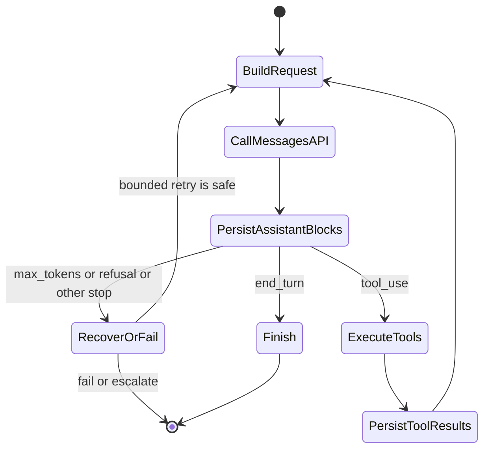

# Messages API 是一个状态机

> API 不会记住你的对话。你的应用程序会，而一个位置错误的内容块就可能破坏整个循环。

**Type:** Build
**Languages:** Python
**Prerequisites:** [在失败代价高昂之处投入能力](../../02-model-selection-and-token-economics/), [将请求转化为可测试的契约](../../03-prompting-and-task-decomposition/), [将每项事实放入正确类型的上下文](../../04-context-knowledge-memory-and-caching/)
**Time:** ~120 分钟

## Learning Objectives

- 将 Claude 请求建模为显式的应用程序状态转换
- 分别选择 SDK 或 raw REST，以及同步、Streaming 或 Batch 交付方式
- 使用明确的资产边界构建图像和文档内容块
- 保留有类型的响应块，并根据 `stop_reason` 进行分支处理
- 强制实施会话、重试、超时、保留和上下文预算规范
- 在不依赖实时 API key 的情况下测试完整生命周期

## 揭示协议的失败案例

一名工程师发送了以下序列：

1. 用户询问：“订单 A-17 在哪里？”
2. Claude 返回一个 ID 为 `toolu_01` 的 `tool_use` 块。
3. 应用程序运行 `lookup_order`。
4. 应用程序在一个新请求中仅发送工具结果。

第二个请求失败，或者 Claude 的响应表现得像它从未请求过该工具。

这里没有任何神秘之处。Messages API 是无状态的。客户端没有重新发送包含原始 `tool_use` 块的 assistant 消息。`tool_result` 不是一项可以独立存在的事实。它通过 ID 回答一个特定的工具请求，并且位于由你的代码负责维护的对话序列中。

框架会替你维护该数组，因此很容易忽略这一点。认证要求你在这种便利层之下进行推理。亲手构建一次原始状态机。此后，每个 SDK、Agent 框架和托管运行时都会更容易调试。

## 一个请求，一次转换

请求向模型提供模型配置、system 指令、消息、Token 控制参数以及可选能力。响应提供内容块、用量元数据和生成停止的原因。接下来发生什么，由你的应用程序决定。

```json
{
  "model": "<current-model-id>",
  "max_tokens": 800,
  "system": "仅根据经过验证的订单数据回答。",
  "messages": [
    {
      "role": "user",
      "content": "订单 A-17 在哪里？"
    }
  ]
}
```

确切的模型标识符和可选请求字段会发生变化。将它们视为配置，在平台允许的情况下固定经过审慎选择的版本，并在当前的 [Models overview](https://platform.claude.com/docs/en/about-claude/models/overview) 中进行核验。持久不变的契约是：客户端提交上下文，并接收有类型的响应。



这张图比记住某个 SDK 方法更有用。每条箭头都代表一项应用程序职责。你可以对其进行记录、测试、重试或拒绝。

## 选择两个相互独立的访问模式

客户端库和完成模式回答的是不同问题。请分别进行选择。

| 客户端 | 适合使用的情况 | 仍由你负责 |
|---|---|---|
| 官方 SDK | 你的语言受到支持，并且你需要有类型的请求和响应模型、有类型的错误、header 管理、默认重试、分页和 Streaming 累积辅助工具 | 应用程序状态、`stop_reason` 策略、重试安全性、工具授权、日志记录和最终验证 |
| raw REST | 运行时没有受支持的 SDK、受限环境禁止引入该依赖，或者你需要自定义 HTTP transport 或协议级 fixture | 身份验证和版本 header、JSON 类型、SSE framing、超时、重试、错误映射、向前兼容性和连接清理 |

对于受支持的生产语言，SDK 是更安全的默认选项，因为它消除了协议层的繁琐工作，而不是因为它负责应用程序生命周期。当 raw REST 带来的额外控制足以抵偿额外测试负担时，它才是合适的选择。[Python SDK guide](https://platform.claude.com/docs/en/cli-sdks-libraries/sdks/python) 记录了同步和异步客户端、有类型的模型、Streaming 辅助工具、默认重试和原始响应访问方式。[API overview](https://platform.claude.com/docs/en/api/overview) 则是直接的 HTTP 契约。

接下来，选择一个或多个结果的到达方式：

| 完成模式 | 最适用的场景 | 完成证据 | 不适用的场景 |
|---|---|---|---|
| Synchronous Message | 一个交互式请求，并且必须获得完整响应后才能继续 | 一个已解析的 `Message`，其 `stop_reason` 已得到处理 | 渐进式渲染或大型离线队列 |
| Streaming Message | 一个交互式请求或长响应，并且局部显示或首个 Token 到达时间十分重要 | 累积内容、终止事件 `message_stop` 和最终消息元数据 | 根据局部 delta 执行不可逆操作 |
| Message Batch | 大量可以稍后完成的独立请求 | 异步处理后，根据稳定的 `custom_id` 对每个条目的结果完成核对 | 对话式工具循环或逐 Token 用户反馈 |

异步 SDK 客户端并不等同于 Message Batches。它允许你的进程并发等待普通 HTTP 工作。Message Batch 是服务器端异步工作负载，包含已存储的输入和结果、每个条目的处理结果以及后续核对流程。当前的 [batch processing guide](https://platform.claude.com/docs/en/build-with-claude/batch-processing) 还指出，结果不会按照提交顺序排列，因此必须通过 `custom_id` 确认身份。

## 内容是有类型块组成的序列

不要将响应简化为 `response.content[0].text`。Claude 可以在一条消息中返回多个块：

- `text` 包含面向用户或中间过程的语言。
- `tool_use` 指定工具名称、提供结构化输入，并携带唯一的请求 ID。
- 启用相应功能后，`thinking` 可以携带 Extended thinking 数据。
- 随着时间推移，服务提供商的功能可能引入其他块类型。

防御性代码会根据 `type` 进行分支，显式处理支持的块，并记录未知块，而不会悄悄将它们视为文本。这在版本变更期间尤为重要。假设每个块都有 `text` 属性的解析器，会把有效的工具请求变成空答案。

一次完整的工具往返具有严格顺序：

```json
[
  {
    "role": "user",
    "content": "订单 A-17 在哪里？"
  },
  {
    "role": "assistant",
    "content": [
      {
        "type": "tool_use",
        "id": "toolu_01",
        "name": "lookup_order",
        "input": {"id": "A-17"}
      }
    ]
  },
  {
    "role": "user",
    "content": [
      {
        "type": "tool_result",
        "tool_use_id": "toolu_01",
        "content": "{\"status\":\"ready\"}"
      }
    ]
  }
]
```

assistant 请求在前，使用 user role 的结果紧随其后。`tool_use_id` 必须与原始 ID 完全匹配。当多个工具调用同时到达时，应为每个调用返回结果，并保留它们之间的对应关系。

## Stop reason 是控制信号

文本可能写着“我现在就去检查”，但响应实际上因为工具调用而停止。文本可能看似完整，但生成过程其实在达到 Token 限制时停止。请根据协议信号进行分支处理。

| 信号 | 应用程序解释 | 安全响应 |
|---|---|---|
| `end_turn` | Claude 已完成当前轮次 | 验证并呈现答案 |
| `tool_use` | 请求了一个或多个客户端工具 | 验证、授权、执行、追加结果并继续 |
| `max_tokens` | 配置的输出预算终止了生成 | 将输出视为可能不完整；仅在有明确方案时重试 |
| `stop_sequence` | 配置的序列终止了生成 | 确认该边界对你的契约有效 |
| `pause_turn` | 服务器端操作可能需要继续执行 | 遵循当前特定功能的继续执行契约 |
| `refusal` | 模型拒绝了请求 | 保留拒绝结果，并使用已批准的回退或升级方案 |
| `model_context_window_exceeded` | 生成内容填满了模型的上下文窗口 | 将响应视为已截断，并重新设计上下文预算 |

产品说明，核验日期为 2026-08-08：受支持的 stop reason 和继续执行要求可能发生变化。当前事实来源是 [Handling stop reasons](https://platform.claude.com/docs/en/build-with-claude/handling-stop-reasons)。代码遇到未知值时应采用封闭式失败，并捕获足够的元数据以便诊断。

绝不要编写 `while stop_reason != "end_turn"`。这会把每个陌生状态都转化为另一次请求，从而造成失控循环。应编写穷尽式分支，并设置最大轮次数、墙钟时间截止期限和每个工具的预算。

## 客户端负责对话状态

Messages API 服务不会保留隐藏的 chat 对象。每次调用都会接收由你选择发送的上下文。这赋予了你控制权，但也意味着你必须负责会话规范。

请维持以下边界：

1. **用户隔离。** 绝不要为另一个 tenant 重用某个 tenant 的消息数组。
2. **System 分离。** 将可信指令与不可信的文档内容分开。
3. **规范化存储。** 持久化有类型的块，而不是无法重建工具 ID 的扁平化 transcript。
4. **上下文预算。** 衡量输入增长，并在达到限制前进行压缩，同时保留事实和未完成的义务。
5. **保留策略。** 只存储产品所需的内容。在写入日志前移除 secret 和敏感字段。
6. **幂等性。** 在没有稳定 operation key 的情况下，网络重试绝不能重复付款、发送电子邮件或执行部署。

如果你要总结一个长会话，请保留活跃的工具请求、用户约束、已验证事实、未解决问题、批准状态和源数据引用。遗漏“不要发送”约束的流畅摘要，在运营层面依然是错误的。

## Multimodal 请求是有类型的资产传输

文本、图像和文档应位于同一个有序内容数组中。先说明任务，再提供资产；使用与媒体相匹配的块类型，并明确指定来源。

```json
{
  "model": "<current-model-id>",
  "max_tokens": 400,
  "messages": [
    {
      "role": "user",
      "content": [
        {
          "type": "text",
          "text": "将图表与已批准的政策文档进行比较。"
        },
        {
          "type": "image",
          "source": {
            "type": "base64",
            "media_type": "image/png",
            "data": "<base64-image-bytes>"
          }
        },
        {
          "type": "document",
          "source": {
            "type": "file",
            "file_id": "<application-owned-file-id>"
          }
        }
      ]
    }
  ]
}
```

图像可以使用 `base64`、`url` 或 Files API 的 `file` 来源。PDF 可以在 `document` 块中使用 URL、base64 或 Files API 来源。块顺序是 prompt 的一部分：将指令和信任上下文放在靠近其所约束资产的位置。在 [Vision](https://platform.claude.com/docs/en/build-with-claude/vision) 和 [PDF support](https://platform.claude.com/docs/en/build-with-claude/pdf-support) 中核验当前的媒体和模型约束。

Files API 改变的是复用和保留方式，而不是内容块的含义。上传一次，接收不透明的 `file_id`，然后在后续 Messages 请求中引用它，而不必重新发送字节。它适用于在许多请求中重复使用的政策 PDF 或图像。

产品说明，核验日期为 2026-08-09：[Files API](https://platform.claude.com/docs/en/build-with-claude/files) 目前处于 beta 阶段，并且当 Message 引用文件时，当前使用 `files-api-2025-04-14` beta header。文件的作用域是 workspace，上传后不可更改，并会一直保留到被删除为止。该 workspace 中的任何 API key 都可以引用这些文件。请将当前 header、平台可用性、限制和下载规则视为易变信息，并在实现前查阅指南。

| 来源 | 跨越边界的数据 | 复用和保留职责 |
|---|---|---|
| 内联 base64 | 编码后的字节随每个请求传输 | 不要记录 payload；明确请求保留策略和大小限制 |
| URL | 服务提供商从远程 origin 获取资产 | 授权 origin、避免包含 secret 的 URL，并考虑 origin 日志和可用性 |
| Files API `file_id` | 标识符引用存储在 API workspace 中的字节 | 对应用程序拥有的 ID 使用 allowlist、记录负责人和用途、强制执行 workspace 隔离，并在保留期限结束时删除 |

`file_id` 并不能证明当前 tenant 有权使用该文件。应将它绑定到一条应用程序记录，该记录包含 tenant、workspace、媒体类型、敏感级别、内容哈希值、上传时间和删除截止时间。绝不要接受任意由模型或用户提供的 ID 并直接转发。不要在普通跟踪记录中存储原始图像字节、PDF 文本、签名 URL 和不透明的文件 ID；应改为记录内容哈希值和策略决策。

## Streaming 改变交付方式，而不改变含义

Streaming 让用户能够在完整消息到达前看到输出。它并不会消除组装和验证最终响应的必要性。

典型的事件处理遵循以下形式：

```python
text_parts = []

for event in stream:
    if event.type == "content_block_delta" and event.delta.type == "text_delta":
        text_parts.append(event.delta.text)
    elif event.type == "message_delta":
        final_stop_reason = event.delta.stop_reason
    elif event.type == "message_stop":
        complete = True
```

如果体验能够因此受益，可以渲染临时文本，但不要根据局部 stream 触发不可逆操作。工具输入也可能以增量形式到达。应将它缓冲到块完整为止，只解析一次，然后进行验证和授权。

连接中断会产生歧义。跟踪完整的终止事件是否已经到达。如果没有，则将本次尝试标记为不完整。在安全的情况下重试只读请求。对于修改状态的操作，在再次执行任何操作前检查幂等性记录。

有关当前事件类型和 SDK 辅助工具，请参阅 [Streaming Messages](https://platform.claude.com/docs/en/build-with-claude/streaming)。

## Batch、Cache 和 Thinking 解决不同问题

这些功能经常被混为一谈，因为它们都会改变成本或延迟。但它们的用途各不相同。

**Message Batches** 以异步方式处理大量独立请求。它们牺牲即时响应延迟，以换取吞吐量和更有利的 Batch 成本。可将其用于离线 Classification、提取、评估或迁移。不要将其用于需要立即获得下一条答案的交互式工具循环。使用自定义 ID 跟踪每个请求，并处理部分 Batch 失败。请参阅 [Batch processing](https://platform.claude.com/docs/en/build-with-claude/batch-processing)。

**Prompt caching** 复用稳定的 prompt 前缀。将持久的 system 指令、工具定义和共享参考资料放在变化频繁的用户内容之前。更改已缓存前缀中的一个字节，就可能使后续复用失效。Cache hit 能够改善首个 Token 到达时间和输入成本，但不会扩展上下文窗口，也不会使过时事实变得正确。请参阅 [Prompt caching](https://platform.claude.com/docs/en/build-with-claude/prompt-caching)。

**Extended thinking** 为能够从中获益的任务分配推理工作。它会消耗预算、改变响应块，并且对跨工具轮次保留 thinking 块有特定功能规则。不要编辑或伪造已签名的 thinking 内容。不要凭惯性为简单提取任务启用它。应在 eval set 上比较质量、延迟和成本。请参阅 [Extended thinking](https://platform.claude.com/docs/en/build-with-claude/extended-thinking)。

考试中的推理方式很简单：根据工作负载选择机制。离线独立任务适合 Batch。重复出现的稳定前缀适合 caching。能够获得可测量质量提升的困难推理适合 thinking。快速交付 Token 则适合 Streaming。

## 离线构建生命周期和资产边界

`code/main.py` 中的可运行模拟器接收脚本化的服务提供商响应。它让隐藏的客户端工作变得可见：

- 存储每个 assistant 内容块。
- 执行请求的工具。
- 返回匹配的 `tool_result` 块。
- 重新发送完整状态。
- 拒绝未知 stop reason。
- 终止失控循环。
- 仅在 `message_stop` 到达后收集模拟 stream。
- 分别选择 SDK 或 REST，以及 sync、stream 或 batch。
- 构建并验证图像和可复用文件内容块。
- 拒绝不在应用程序自有 allowlist 中的文件 ID。
- 生成不包含资产字节或文件 ID 的哈希边界账本。

运行它：

```bash
cd certifications/claude/lessons/08-messages-api-and-application-lifecycle/code
python3 main.py
python3 -m unittest discover tests -v
```

本课中的代码不会导入 SDK、读取凭据、上传文件、获取 URL 或调用模型。`multimodal_lab_fixture()` 使用一个单像素合成图像和一个离线占位文件 ID。在私有实验中，只有在完成身份验证的上传后，才可以用真实 SDK 调用替换 `ScriptedTransport.create()`，并替换该占位符。保持状态机、allowlist 和账本不变。

## Interactive Lab

使用生命周期图逐步检查用户输入、assistant 内容块、工具执行、相关联的结果和终止 stop reason。破坏该顺序，观察哪一次状态转换会变得无效。

```figure
08-messages-lifecycle
```

## Practice Lab

运行脚本化生命周期，然后移除 assistant 的 `tool_use` 消息、更改关联 ID，或者在没有 `message_stop` 的情况下结束 stream。接下来，将可复用文件 ID 改为 owned allowlist 之外的 ID、破坏图像 base64，或者要求访问选择器同时提供 Batch 处理和渐进式 Token。每项失败都应该映射到一个具名的协议错误或数据边界错误，而不是触发 prompt 重试。

## Shipped Artifact

`outputs/messages-lifecycle-transcript.json` 保留了完全不依赖服务提供商的完整工具往返记录。`outputs/multimodal-request-fixture.json` 新增了四项访问决策、一个混合图像与文档请求、应用程序自有的文件 allowlist，以及经过脱敏的资产边界账本。运行 `python3 main.py` 会打印这两个 fixture。单元测试套件会在没有网络访问的情况下验证每个已签入产物。

## Verify It

```bash
cd certifications/claude/lessons/08-messages-api-and-application-lifecycle/code
python3 main.py
python3 -m unittest discover tests -v
```

## Capstone Connection

测验会在陌生场景下检查相同的协议决策。将经过验证的 transcript 用作 Developer capstone 30 以及 Architect capstone 31 和 32 的生命周期证据。

## 超越单轮交互的应用程序生命周期

生产级 Claude 应用程序拥有的状态远不止“请求”和“响应”。

```mermaid
flowchart LR
    Intake[Validate intake] --> Authorize[Authorize capabilities]
    Authorize --> Invoke[Invoke model]
    Invoke --> Parse[Parse typed blocks]
    Parse --> Act[Execute approved tools]
    Act --> Verify[Verify result and final state]
    Verify --> Deliver[Deliver or escalate]
    Deliver --> Observe[Record trace and metrics]
    Observe --> Evaluate[Run regression evals]
    Evaluate --> Improve[Version prompt, model, tools, or code]
    Improve --> Intake
```



模型错误只是其中一种失败类别。此外还有 transport 超时、rate limit、格式错误的应用程序状态、schema 不匹配、授权拒绝、工具失败、过时 cache、用户取消和部署 Regression。请分别为它们添加标签。对超时有效的重试可能会让授权失败变得更糟。

在每条跟踪记录中记录 system 指令、模型选择、工具目录、输出 schema 和应用程序代码的版本。如果缺少这些标识符，你就无法重现 Regression，也无法公平比较 eval 运行结果。

## 考试决策规则

- 如果场景丢失了早期消息，应先怀疑客户端负责的状态，而不是模型记忆。
- 如果工具结果被拒绝，请检查 role 顺序和匹配的 tool-use ID。
- 如果输出看起来被截断，请先检查 `stop_reason` 和用量，再更改 prompt。
- 如果用户需要即时渐进式显示，请选择 Streaming，而不是 Batch。
- 如果数千个独立任务可以稍后完成，请选择 Message Batches。
- 如果受支持的 SDK 能够满足 transport 需求，请优先使用其有类型的模型和辅助工具；将生命周期策略保留在应用程序代码中。
- 如果受限运行时需要 raw REST，请为 header、错误、SSE、重试和未知字段安排显式测试。
- 如果某项资产会重复使用，请比较内联传输与 Files API 复用，并制定明确的删除策略。
- 如果 `file_id` 未绑定到已验证身份的 tenant 和 workspace，请在发送请求前拒绝它。
- 如果一个长共享前缀反复出现，请评估 Prompt caching。
- 如果重试可能重复某项副作用，请先要求幂等性或核对机制。
- 如果出现新的 stop reason，请采用封闭式失败，并依据当前文档进行更新。

## 练习

1. 添加一个包含两个 `tool_use` 块的脚本化响应。断言两个结果均出现在随后的一条 user 消息中，并且 ID 正确。
2. 为 `max_tokens` 添加显式处理。返回一个有类型的不完整结果，而不是将局部文本显示为最终结果。
3. 模拟一个在 `message_stop` 之前断开的 stream。记录一次不完整尝试，并证明没有执行任何不可逆操作。
4. 在不存储原始用户消息的情况下，将 tenant 和 prompt 版本元数据添加到跟踪记录。
5. 使用一个由 URL 支持的图像扩展 Multimodal fixture。在不发起网络调用的情况下记录其 origin、授权、保留和失败边界。

## 延伸阅读

- [Messages API reference](https://platform.claude.com/docs/en/api/messages)
- [Messages examples](https://platform.claude.com/docs/en/api/messages-examples)
- [Python SDK](https://platform.claude.com/docs/en/cli-sdks-libraries/sdks/python)
- [Vision](https://platform.claude.com/docs/en/build-with-claude/vision)
- [PDF support](https://platform.claude.com/docs/en/build-with-claude/pdf-support)
- [Files API](https://platform.claude.com/docs/en/build-with-claude/files)
- [Handling stop reasons](https://platform.claude.com/docs/en/build-with-claude/handling-stop-reasons)
- [Streaming Messages](https://platform.claude.com/docs/en/build-with-claude/streaming)
- [Batch processing](https://platform.claude.com/docs/en/build-with-claude/batch-processing)
- [Prompt caching](https://platform.claude.com/docs/en/build-with-claude/prompt-caching)
- [Extended thinking](https://platform.claude.com/docs/en/build-with-claude/extended-thinking)
