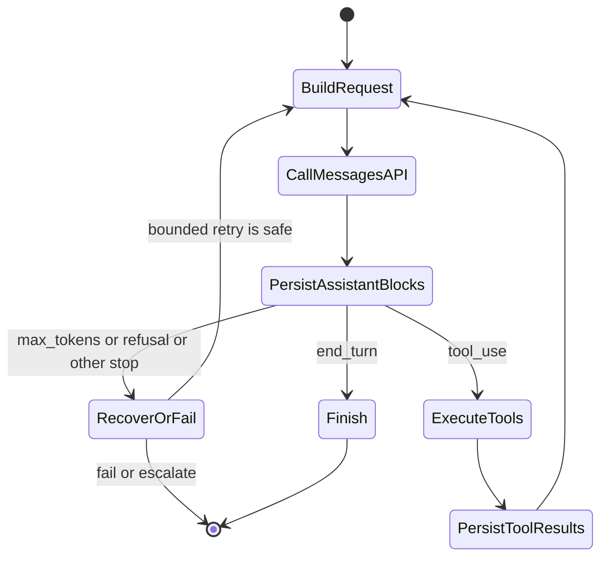

# Messages API 本质是状态机

> API 本身不会记录你的对话历史。你的应用程序才是状态的持有者，而任何一个位置放错的内容块（Content Block）都会直接破坏整个循环。

**Type:** Build
**Languages:** Python
**Prerequisites:** [Spend Capability Where Failure Is Expensive](../../02-model-selection-and-token-economics/), [Turn a Request Into a Testable Contract](../../03-prompting-and-task-decomposition/), [Put Each Fact in the Right Kind of Context](../../04-context-knowledge-memory-and-caching/)
**Time:** ~120 minutes

## 学习目标

- 将每个 Claude 请求建模为显式的应用程序状态转换（State Transition）
- 将 SDK 与原生 REST API 的选择，与同步、流式（Streaming）或批处理（Batch）交付模式正交解耦
- 构建包含显式资产边界的图像和文档内容块（Content Blocks）
- 完整保留类型化响应块并基于 `stop_reason` 进行安全分支路由
- 执行严格的会话隔离、重试、超时、数据留存和上下文预算治理
- 在完全不依赖真实 API Key 的前提下离线测试完整的生命周期

## 问题背景

一位工程师发送了如下序列：

1. 用户询问：“订单 A-17 在哪里？”
2. Claude 返回了一个带有 ID `toolu_01` 的 `tool_use` 块。
3. 应用程序在本地执行了 `lookup_order`。
4. 应用程序在全新的请求中仅发送了工具结果（`tool_result`）。

第二个请求直接报错失败，或者 Claude 的回复表现得好像它从未请求过该工具一样。

这其中没有任何神秘之处。Messages API 是完全无状态的（Stateless）。客户端漏掉了重新发送包含最初 `tool_use` 块的 assistant 消息。`tool_result` 并不是一个孤立存在的事实。它必须通过 ID 回应某个特定的工具调用请求，并且必须处于由你的代码所持有的对话序列上下文之内。

上层框架往往很容易让人忽略这一点，因为它们会自动在后台维护消息数组。然而认证考试要求你深入到底层协议进行推理。一旦你亲手手写并构建过一次底层的原始状态机，之后无论调试任何 SDK、智能体框架还是托管运行时，都会变得清晰透彻。

## 核心概念

### 单次请求，单次转换 (One Request, One Transition)

一个请求向模型提供系统指令、上下文消息、Token 控制参数以及可选的功能配置。响应则返回内容块、用量元数据（Usage Metadata）以及生成停止的原因。你的应用程序负责决定下一步发生什么。

```json
{
  "model": "<current-model-id>",
  "max_tokens": 800,
  "system": "Answer from verified order data only.",
  "messages": [
    {
      "role": "user",
      "content": "Where is order A-17?"
    }
  ]
}
```

具体的模型标识符和可选请求字段可能会随时间变化。请将它们视为配置项，在平台允许的情况下显式锁定具体版本，并查阅最新的 [Models 概览](https://platform.claude.com/docs/en/about-claude/models/overview)。持久不变的核心契约在于：你的客户端提交完整的上下文，并接收类型化的结构化响应。


```mermaid
stateDiagram-v2
    [*] --> BuildRequest
    BuildRequest --> CallMessagesAPI
    CallMessagesAPI --> PersistAssistantBlocks
    PersistAssistantBlocks --> Finish: end_turn
    PersistAssistantBlocks --> ExecuteTools: tool_use
    PersistAssistantBlocks --> RecoverOrFail: max_tokens or refusal or other stop
    ExecuteTools --> PersistToolResults
    PersistToolResults --> BuildRequest
    RecoverOrFail --> BuildRequest: bounded retry is safe
    RecoverOrFail --> [*]: fail or escalate
    Finish --> [*]
```

这张状态图比死记硬背 SDK 方法更加实用。图中的每一个箭头都是应用程序的显式职责。你可以对它进行记录、测试、重试或拒绝。

### 客户端库与交付模式的解耦选择 (Choose Two Independent Access Patterns)

客户端库（SDK vs 原生 REST）与结果交付模式解决的是两个完全不同维度的问题，应当独立决策。

| 客户端形态 | 推荐使用场景 | 应用程序仍然负责拥有的职责 |
|---|---|---|
| 官方 SDK | 所用语言受官方支持，且希望获得类型化的请求与响应模型、类型化异常、请求头管理、重试默认值、分页以及流式聚合辅助工具 | 应用程序状态管理、`stop_reason` 处理策略、重试安全性、工具执行授权、审计日志与最终输出校验 |
| 原生 REST | 运行环境没有受支持的 SDK、受约束环境禁止引入外部依赖，或者需要自定义 HTTP 传输层 / 协议级测试夹具 | 认证与版本请求头、JSON 类型安全、SSE 帧解析、超时、重试逻辑、错误映射、向前兼容性以及连接生命周期清理 |

官方 SDK 是主流生产语言中更安全的首选，因为它屏蔽了底层协议管道琐碎细节，但这并不意味着它接管了应用生命周期的逻辑判断。原生 REST 则适合在对其额外控制权能证明其额外测试负担合规的场景下使用。[Python SDK 指南](https://platform.claude.com/docs/en/cli-sdks-libraries/sdks/python) 详细介绍了同步与异步客户端、类型化模型、流式处理助手、默认重试机制及原始响应访问。[API 概览](https://platform.claude.com/docs/en/api/overview) 则给出了直接的 HTTP 协议规范。

接下来，再独立决定单个或多个结果如何交付：

| 交付模式 (Completion Pattern) | 最佳适配场景 | 完成凭据 (Completion Evidence) | 不适合场景 |
|---|---|---|---|
| 同步消息 (Synchronous Message) | 单次交互式请求，在继续后续操作前必须拿到完整响应 | 单个已解析且处理了 `stop_reason` 的 `Message` 对象 | 渐进式渲染展示或离线大规模排队作业 |
| 流式消息 (Streaming Message) | 单次交互或长文本响应，前台局部渲染或首字延迟（TTFT）至关重要 | 累积的内容块，加上终止标识 `message_stop` 及最终消息元数据 | 基于流式增量中间片段触发不可逆业务操作 |
| 批量消息 (Message Batch) | 包含海量独立请求，允许在稍后异步完成处理 | 异步处理完成后，通过稳定的 `custom_id` 逐项对齐和调和的结果 | 交互式多轮工具循环或逐 Token 实时用户反馈 |

异步 SDK 客户端（Async SDK Client）并不等同于批量消息（Message Batches）。异步客户端只是让你的进程能够并发等待常规的 HTTP 交互；而 Message Batch 是服务端异步负载，具备持久化的输入与结果存储、单项完成状态追踪以及事后对齐特性。正如当前的[批处理指南](https://platform.claude.com/docs/en/build-with-claude/batch-processing)所指出的，批处理返回的结果不保证提交顺序，因此唯一标识和归属必须依赖 `custom_id`。

### 内容是类型化块的有序序列 (Content Is a Sequence of Typed Blocks)

切勿简单地将模型响应归约为 `response.content[0].text`。Claude 可以在单条消息中同时返回多个内容块：

- `text`：包含面向用户呈现的语言或中间文本。
- `tool_use`：声明要调用的工具名称、提供结构化输入参数，并附带全局唯一的请求 ID。
- `thinking`：当启用扩展思考能力时，携带模型的思维链推理数据。
- 随着提供商功能演进，未来还可能引入更多内容块类型。

具备防御性的代码应当通过 `type` 进行分支切换，显式处理受支持的块类型，并在记录未知块日志的同时绝不静默将其降级为普通文本。在版本升级过程中，这一点极为关键。若解析器假定每个内容块都包含 `text` 属性，就会直接把合法的工具请求误判为空回答。

完整的工具调用闭环具有严格的序列顺序：

```json
[
  {
    "role": "user",
    "content": "Where is order A-17?"
  },
  {
    "role": "assistant",
    "content": [
      {
        "type": "tool_use",
        "id": "toolu_01",
        "name": "lookup_order",
        "input": {"id": "A-17"}
      }
    ]
  },
  {
    "role": "user",
    "content": [
      {
        "type": "tool_result",
        "tool_use_id": "toolu_01",
        "content": "{\"status\":\"ready\"}"
      }
    ]
  }
]
```

assistant 发起的请求必须在前，紧随其后的是包含结果的 user 角色消息。`tool_use_id` 必须与最初的调用 ID 完全严格匹配。如果模型一次性发起了多个并发工具调用，必须为每一个调用都返回对应的结果，并精确保持其关联关系。

### 停止原因是核心控制信号 (Stop Reasons Are Control Signals)

文本可能写着“我现在来为您查询”，但实际上响应停止的原因是触发了工具调用；文本看起来可能很完整，但实际生成却可能因触达 Token 上限而中断。请务必根据协议信号进行分支处理：

| 信号 (Signal) | 应用程序语义解读 | 安全的处理响应 |
|---|---|---|
| `end_turn` | Claude 已自然完成当前轮次生成 | 校验输出内容并呈现最终答案 |
| `tool_use` | 模型请求调用一个或多个客户端工具 | 校验参数、执行权限授权、执行工具、追加结果并继续对话 |
| `max_tokens` | 输出已达到配置的最大 Token 预算上限 | 视输出可能不完整；只有具备针对性续写计划时才可重试 |
| `stop_sequence` | 命中了预先配置的停止序列 | 确认截断边界是否符合预期业务契约 |
| `pause_turn` | 服务端长时操作可能需要延续执行 | 遵循对应功能的特定续传契约协议 |
| `refusal` | 模型因安全合规原因拒绝了请求 | 保留拒绝记录并走审批合规的降级或升级（Escalation）流程 |
| `model_context_window_exceeded` | 生成内容填满了模型的上下文窗口 | 将响应视为已被截断，并重新设计优化上下文预算 |

产品说明（2026-08-08 校验）：支持的停止原因与续传契约可能会持续演进。权威信源请查阅官方的[停止原因处理指南](https://platform.claude.com/docs/en/build-with-claude/handling-stop-reasons)。代码应对未知枚举值采取 Fail-Closed（故障关闭）策略，并捕获充分的诊断元数据。

永远不要编写 `while stop_reason != "end_turn"` 这样的死循环。这会将所有未知状态错误地转化为重复请求，从而引发不可控的死循环。必须编写穷尽式的条件分支，并设置最大轮次上限、物理时钟超时限制以及单工具调用预算。

### 客户端拥有完整的会话状态 (The Client Owns Conversation State)

Messages API 服务端不会在后台默默维护隐藏的聊天会话对象。每次调用接收到的完全由你显式传入的上下文决定。这赋予了系统高度确定性，但也意味着保持会话健康纯粹是你的工程职责。

必须守住以下关键边界：

1. **租户用户隔离 (User isolation)：** 绝对不能将一个租户的消息历史传递给另一个租户。
2. **系统指令隔离 (System separation)：** 将受信任的系统提示词与不可信的文档或用户内容物理隔离。
3. **规范化存储 (Canonical storage)：** 持久化存储类型化内容块，而非扁平化的无格式纯文本，否则将无法重建工具调用 ID 关联。
4. **上下文预算控制 (Context budgeting)：** 监控输入 Token 的增长趋势，在逼近窗口前执行压缩与摘要，同时必须保留核心事实和待履行的承诺。
5. **数据留存策略 (Retention policy)：** 仅保留产品运营必需的数据。在写入日志前必须对密码凭据和敏感 PII 字段脱敏。
6. **幂等性保障 (Idempotency)：** 网络重试必须配备稳定的业务幂等键（Idempotency Key），防止重复扣款、重复发邮件或重复触发部署。

若要对长会话进行上下文压缩，必须保留活动的工具请求、用户约束、已验证事实、未决疑问、审批状态以及溯源引用。一段看似流畅但把“请勿发送”这一限制删掉的摘要，在工程运营层面是灾难性的。

### 多模态请求是类型化的资产传递 (Multimodal Requests Are Typed Asset Transfers)

文本、图片和文档必须统一归入一个有序的内容块数组中。在资产之前显式陈述分析任务，采用与媒体类型匹配的专用块类型，并保持数据源定义清晰显式。

```json
{
  "model": "<current-model-id>",
  "max_tokens": 400,
  "messages": [
    {
      "role": "user",
      "content": [
        {
          "type": "text",
          "text": "Compare the chart with the approved policy document."
        },
        {
          "type": "image",
          "source": {
            "type": "base64",
            "media_type": "image/png",
            "data": "<base64-image-bytes>"
          }
        },
        {
          "type": "document",
          "source": {
            "type": "file",
            "file_id": "<application-owned-file-id>"
          }
        }
      ]
    }
  ]
}
```

图像可以采用 `base64`、`url` 或 Files API 的 `file` 数据源。PDF 文档可以在 `document` 块内采用 URL、base64 或 Files API 来源。块的排列顺序同样是提示词工程的一部分：请将指令与信任上下文紧贴其所约束的资产放置。关于媒体规格与模型限制，请查阅官方 [Vision 指南](https://platform.claude.com/docs/en/build-with-claude/vision) 与 [PDF 支持文档](https://platform.claude.com/docs/en/build-with-claude/pdf-support)。

Files API 改变的是资产复用和生命周期留存方式，而非内容块的内在语义。上传一次后获得一个不透明的 `file_id`，后续在多次 Messages 请求中直接引用该 ID，无需重复通过网络上传原始字节流。这非常适合跨多个请求反复复用的合规政策 PDF 或基准图表。

产品说明（2026-08-09 校验）：[Files API](https://platform.claude.com/docs/en/build-with-claude/files) 目前处于 Beta 阶段，在 Messages 中引用文件时需携带 `files-api-2025-04-14` Beta 请求头。文件归属于工作区级别，上传后不可修改，并持续持久化直到被主动删除。同一工作区下的任意 API Key 均可引用这些文件。请将具体的请求头、平台可用性、配额限制和下载规则视为动态配置，在实施前查阅官方最新文档。

| 数据源类型 | 跨越网络边界的数据 | 复用与留存治理职责 |
|---|---|---|
| 内联 Base64 (Inline base64) | 编码后的字节流随每次请求重复发送 | 切勿将负载记录到应用日志；对请求大小上限与留存进行显式限制 |
| 远程 URL | 服务端直接从远程源地址拉取资产 | 必须对目标域名配置白名单，避免包含敏感密钥的 URL，评估源端日志留存与高可用性 |
| Files API `file_id` | 引用存储在 API 工作区内的资产标识符 | 白名单校验应用持有的 ID，记录所有者与用途，强制工作区租户隔离，留存期满自动删除 |

单凭一个 `file_id` 字符串并不能证明当前租户拥有该文件的访问权。应用程序必须将其绑定到内部数据库记录中，包含租户 ID、工作区、媒体类型、敏感度等级、内容哈希、上传时间与过期删除时间戳。绝对不要盲目信任模型或用户传入的任意 ID 并将其转发给 API。在追踪日志（Traces）中，坚决剔除原始图像字节、PDF 提取文本、带签名的临时 URL 以及不透明的文件 ID；统一记录内容哈希值与策略决策日志。

### 流式处理改变交付体验，而非业务语义 (Streaming Changes Delivery, Not Meaning)

流式传输使用户能够在完整消息生成完毕之前实时看到输出，但这并没有免除应用程序组装并校验最终完整响应的必要性。

典型的事件处理遵循以下模式：

```python
text_parts = []

for event in stream:
    if event.type == "content_block_delta" and event.delta.type == "text_delta":
        text_parts.append(event.delta.text)
    elif event.type == "message_delta":
        final_stop_reason = event.delta.stop_reason
    elif event.type == "message_stop":
        complete = True
```

如果用户体验需要，可以在前端渲染暂定文本，但绝不要依据部分流式增量直接触发不可逆的业务副作用。工具调用的输入参数同样可能是流式增量到达的。必须在缓冲区累积直到该块完全闭合后，进行一次性解析、结构校验与权限审核。

网络连接意外中断会引入状态不确定性。必须全程跟踪是否收到了代表正常结束的终端事件（如 `message_stop`）。若未收到，则标记该次尝试不完整。对于只读请求，可以在安全策略下重试；而对于有状态或变更操作，在任何重试前必须先查验幂等性记录。

有关最新事件类型和 SDK 辅助方法，请参阅[流式消息指南](https://platform.claude.com/docs/en/build-with-claude/streaming)。

### 批处理、缓存与思考解决不同维度的问题 (Batch, Cache, and Thinking Solve Different Problems)

这三项功能经常被混为一谈，因为它们都会影响成本或延迟表现。然而它们的设计目标截然不同：

**批量消息 (Message Batches)** 异步处理大规模独立请求。它们用即时响应延迟换取吞吐量与显著的批处理成本折扣。适用于离线文本分类、知识抽取、离线评测或数据迁移。切勿将其用于需要即时响应的多轮交互式工具循环。通过自定义的 `custom_id` 追踪每个请求，并优雅处理批次内的部分失败项。参阅[批处理指南](https://platform.claude.com/docs/en/build-with-claude/batch-processing)。

**提示词缓存 (Prompt caching)** 复用稳定的提示词前缀。应将持久不变的系统指令、工具定义和公共参考物料放置在动态变化的用户内容之前。缓存前缀内哪怕变更单个字节，都会导致后续缓存完全失效。缓存命中可以大幅改善首字生成延迟（TTFT）并降低输入成本，但它并不会扩充物理上下文窗口上限，更无法把过期陈旧的事实变正确。参阅[提示词缓存指南](https://platform.claude.com/docs/en/build-with-claude/prompt-caching)。

**扩展思考 (Extended thinking)** 为需要深度推理的任务分配显式的推理计算预算。它会消耗输出 Token 预算，改变响应内容块结构，并且在跨多轮工具调用时有着严格的思维链块保留规则。切勿篡改或伪造带签名的 thinking 内容。切勿在没有评测支撑的情况下，盲目将其用于简单的信息抽取任务。应在评测集上量化对比质量提升、延迟开销与成本支出。参阅[扩展思考指南](https://platform.claude.com/docs/en/build-with-claude/extended-thinking)。

认证考试的解题思维非常明确：根据工作负载特性匹配机制。离线海量独立作业选择 Batch；高频重复的稳定前缀选择 Caching；具有实测质量提升的高难度推理选择 Thinking；追求前台交互流畅度选择 Streaming。

### 离线构建生命周期与资产安全边界 (Build the Lifecycle and Asset Boundary Offline)

`code/main.py` 中的可运行模拟器接收脚本化（Scripted）的提供商响应，将平时隐藏在客户端内部的底层工作显式暴露出来：

- 持久化保存 assistant 返回的每一个内容块。
- 本地执行被请求的工具。
- 返回匹配且对应的 `tool_result` 结果块。
- 重新提交完整的对话状态历史。
- 拒绝未知的非预期停止原因。
- 及时拦截并熔断死循环。
- 仅在收到 `message_stop` 事件后才完成流式内容归集。
- 将 SDK 与 REST 选型决策同同步、流式、批量交付模式正交解耦。
- 构建并校验图像与可复用文件的内容块格式。
- 坚决拒绝超出应用自有白名单范围的文件 ID。
- 输出不含资产原始字节和文件 ID 的哈希边界安全账本（Hashed Boundary Ledger）。

运行验证：

```bash
cd certifications/claude/lessons/08-messages-api-and-application-lifecycle/code
python3 main.py
python3 -m unittest discover tests -v
```

本课程中的所有代码均未导入外部真实 SDK、未读取任何机密凭证、未上传真实文件、未发起网络请求，也未调用远程真实模型。`multimodal_lab_fixture()` 使用单像素合成图像和离线占位符文件 ID 进行模拟。在私有实验中，你可以将 `ScriptedTransport.create()` 替换为真实的 SDK 调用，并在完成鉴权上传后替换占位 ID，而上层的状态机、白名单逻辑与安全账本无需做任何变动。

## Interactive Lab (交互式实验)

通过生命周期图示，逐步单步演练用户输入、assistant 内容块、工具执行、关联结果以及最终终止停止原因的状态流转。尝试破坏其中的调用顺序，观察哪一个状态转换会触发非法协议错误。

```figure
08-messages-lifecycle
```

## Practice Lab (实战演练)

运行脚本化的生命周期模拟器，然后尝试故意删掉 assistant 的 `tool_use` 消息、修改关联的 correlation ID，或者在未触发 `message_stop` 时强行中断流。接下来，将可复用文件 ID 修改为不在内部白名单中的非法值、故意损坏图片的 Base64 编码，或者同时请求批处理与流式 Token。确保每一个异常都能精准映射为清晰命名的协议错误或数据边界拦截错误，而不是退化为无意义的提示词重试。

## Shipped Artifact (交付产物)

`outputs/messages-lifecycle-transcript.json` 记录了完全脱离外部依赖的完整工具闭环交互实录。`outputs/multimodal-request-fixture.json` 则补充了四项架构访问决策、一个混合图像与文档的复杂请求示例、应用持有的文件白名单以及脱敏后的资产边界安全账本。运行 `python3 main.py` 会在终端打印这两份夹具内容。单元测试套件在不依赖网络的情况下对所有签入产物进行自动化回归校验。

## Verify It (验证方法)

```bash
cd certifications/claude/lessons/08-messages-api-and-application-lifecycle/code
python3 main.py
python3 -m unittest discover tests -v
```

## Capstone Connection (项目连接)

配套测验将在不同业务场景下考察这些核心协议决策。所验证的生命周期交互实录将作为关键证据，直接服务于 Developer Capstone 30 以及 Architect Capstone 31 和 32 的架构落地。

## 超越单轮对话的应用生命周期 (Application Lifecycle Beyond One Turn)

在生产环境中，一个成熟的 Claude 应用所包含的状态远不止简单的“发送请求”和“接收响应”。


```mermaid
flowchart LR
    Intake[校验输入数据] --> Authorize[鉴权与能力授权]
    Authorize --> Invoke[调用模型推理]
    Invoke --> Parse[解析类型化内容块]
    Parse --> Act[执行受控工具]
    Act --> Verify[验证结果与最终状态]
    Verify --> Deliver[输出交付或转人工升级]
    Deliver --> Observe[记录追踪链路与指标]
    Observe --> Evaluate[执行回归评测]
    Evaluate --> Improve[迭代提示词/模型/工具/代码版本]
    Improve --> Intake
```

模型生成错误仅仅是诸多故障分类中的一种。在工程实践中，你还会遇到传输超时、限流（Rate Limit）、应用状态畸变、Schema 不匹配、鉴权拦截、外部工具执行失败、缓存陈旧、用户主动取消以及发布版本回归。必须对这些错误类型进行独立归类与打标。适用于超时的重试机制若被盲目套用在权限失败上，只会加剧系统风险。

在每条追踪链路（Trace）中，务必对系统指令版本、模型选型、工具目录版本、输出 Schema 版本以及应用代码版本打上显式标记。缺乏这些版本标识，你将无法有效复现线上回归问题，更无法在评测对比中得到公平可信的结论。

## 考试决策准则 (Exam Decision Rules)

- 若场景中出现前序对话消息丢失，优先排查客户端维护的会话状态缺陷，而非误以为模型内部存在记忆机制。
- 若工具调用结果被拒绝，仔细核对消息角色（Role）交替顺序以及 `tool_use_id` 是否精确匹配。
- 若模型输出似乎被截断，在盲目修改提示词之前，首先检查 `stop_reason` 和 Token 用量。
- 若终端用户需要即时看到渐进式文字渲染，必须选择 Streaming，而非 Batch。
- 若系统需要离线处理成千上万个非实时的独立任务，果断选用 Message Batches。
- 若当前语言有官方支持的 SDK 且满足传输要求，优先利用其类型化模型与重试辅助能力，但生命周期策略仍须收拢在业务代码中。
- 若受限环境必须手写原生 REST 调用，必须为请求头、错误码映射、SSE 解析、重试策略及未知字段兼容性分配专项测试预算。
- 若某一多媒体资产在多个请求间频繁重复使用，对比内联传输与 Files API 的复用收益，并建立显式的生命周期删除策略。
- 若接收到的 `file_id` 无法与已鉴权的当前租户和工作区绑定，必须在发起 API 请求前直接予以拦截拒绝。
- 若长会话包含大篇幅重复且稳定的公共前缀，系统性评估引入 Prompt Caching 的可行性。
- 若重试操作可能导致外部副作用重复触发，必须强制前置引入幂等键检查或状态核对机制。
- 若协议返回未知的 `stop_reason`，坚决执行 Fail-Closed 策略，并根据最新官方文档更新枚举映射。

## 课后练习 (Exercises)

1. 在模拟测试中新增一个包含两个 `tool_use` 块的响应。编写断言验证紧接着的用户消息中同时包含两个携带正确 ID 的 `tool_result` 块。
2. 针对 `max_tokens` 停止原因编写专门的处理逻辑，向调用方返回显式的“未完成（incomplete）”类型化结果，而不是误将截断的文本作为最终答案展示。
3. 模拟一个在收到 `message_stop` 之前意外断开连接的流式传输过程，记录未完成尝试，并编写测试证明该分支绝对不会触发任何不可逆的业务操作。
4. 在追踪元数据中追加租户 ID 与提示词版本号，同时确保用户原始消息文本完全被脱敏遮蔽。
5. 扩展多模态夹具以支持基于 URL 的图像引入，在不发起真实网络请求的前提下，完整记录其源域名、授权策略、留存期限及降级失败边界。

## 延伸阅读 (Further Reading)

- [Messages API 参考文档](https://platform.claude.com/docs/en/api/messages)
- [Messages 调用示例](https://platform.claude.com/docs/en/api/messages-examples)
- [Python SDK 指南](https://platform.claude.com/docs/en/cli-sdks-libraries/sdks/python)
- [Vision 视觉多模态文档](https://platform.claude.com/docs/en/build-with-claude/vision)
- [PDF 解析与支持](https://platform.claude.com/docs/en/build-with-claude/pdf-support)
- [Files API 开发指南](https://platform.claude.com/docs/en/build-with-claude/files)
- [处理停止原因 (Stop Reasons)](https://platform.claude.com/docs/en/build-with-claude/handling-stop-reasons)
- [流式消息传输 (Streaming Messages)](https://platform.claude.com/docs/en/build-with-claude/streaming)
- [批量处理 (Batch Processing)](https://platform.claude.com/docs/en/build-with-claude/batch-processing)
- [提示词缓存 (Prompt Caching)](https://platform.claude.com/docs/en/build-with-claude/prompt-caching)
- [扩展思考 (Extended Thinking)](https://platform.claude.com/docs/en/build-with-claude/extended-thinking)
