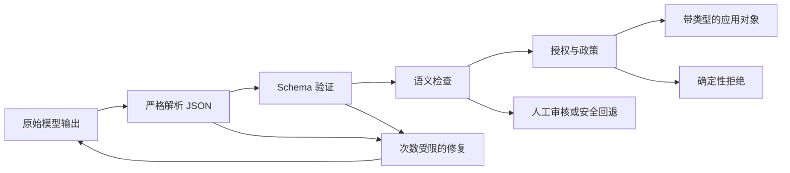

# 结构化输出是一份不可信的契约

> 有效的 JSON 并不等于有效的业务决策。先解析字节，再验证结构、核实语义，最后才允许执行操作。

**Type:** Build
**Languages:** Python
**Prerequisites:** [验证声明，而非置信度](../../05-output-evaluation-and-validation/), [Messages API 是一个状态机](../../08-messages-api-and-application-lifecycle/)
**Time:** ~95 分钟

## 学习目标

- 区分 JSON 语法、schema 有效性、语义有效性和授权
- 设计严格限定的 schema，使无效状态难以表达
- 解析 Claude 输出，避免不安全的清理或乐观的类型强制转换
- 通过次数受限且包含充分证据的重试来修复无效响应
- 演进输出契约，同时避免在无提示的情况下破坏消费者
- 在对抗性输入和流式处理边界测试结构化输出

## 本应失败的 JSON

你的支持应用请求一个 1 到 5 的优先级。响应如下：

```json
{
  "category": "billing",
  "priority": 9,
  "summary": "Customer reports a duplicate charge",
  "needs_human": false
}
```

JSON parser 成功了。该对象包含所有预期的 key。应用将其作为最高紧急优先级进行路由，跳过人工审核，并通知值班工程师。

模型并未违反 JSON。是你的应用没有执行契约。

结构化输出有四道关卡：

1. **语法：** 是否恰好存在一个可解析的 JSON value？
2. **结构：** 该 value 是否符合类型、必填字段、enum、边界和附加属性规则？
3. **语义：** 各字段是否与领域事实及其他字段一致？
4. **权限：** 所请求的下游操作是否被允许？

通过前一道关卡绝不意味着也通过了后续关卡。



## 提示返回 JSON 并不构成契约

“仅返回 JSON”是一条指令。它可以提高成功概率，但无法杜绝无效输出，无法防止 schema 漂移，也无法验证业务语义。

当当前模型和 API 支持 structured outputs 时，你可以提供 JSON Schema，并要求平台约束生成过程。这会减少语法和结构错误，但仍无法证明引用的订单确实存在、退款已获授权，或分类是正确的。

产品说明，核验于 2026-08-09：structured-output 的可用性、支持的 schema keyword、与其他功能的不兼容情况以及模型支持范围都可能发生变化。发布前请查阅 [Structured outputs](https://platform.claude.com/docs/en/build-with-claude/structured-outputs)。即使启用了 constrained decoding，也要保留应用侧验证。

应用拥有 schema。应当像对待 API 一样对其进行版本管理。

```json
{
  "$id": "support-triage-v1",
  "type": "object",
  "required": ["category", "priority", "summary", "needs_human"],
  "additionalProperties": false,
  "properties": {
    "category": {
      "type": "string",
      "enum": ["billing", "bug", "account", "other"]
    },
    "priority": {
      "type": "integer",
      "minimum": 1,
      "maximum": 5
    },
    "summary": {
      "type": "string",
      "minLength": 1,
      "maxLength": 240
    },
    "needs_human": {
      "type": "boolean"
    }
  }
}
```

这个 schema 的严格性是有依据的。消费者恰好需要四个字段。意外出现的 `debug_context` 字段可能会将私密文本带入日志。整数边界可以阻止 `9`，enum 则可以避免分类拼写不一致导致分析数据碎片化。

## 根据消费者的决策设计 Schema

不要从“Claude 能生成什么？”开始，而要从“下一个确定性组件必须做出什么决策？”开始。

如果消费者需要选择队列，就给它一个 enum。如果它需要按优先级排序，就给它一个有界整数。如果不确定性会改变路由方式，就显式表示不确定性，而不是期待它出现在自由文本中。

比较以下两份契约：

```json
{"answer": "Probably a billing issue. It seems urgent."}
```

```json
{
  "category": "billing",
  "priority": 4,
  "evidence_ids": ["invoice-483", "message-12"],
  "uncertainty": "medium",
  "needs_human": true
}
```

第二个对象使路由和验证成为可能。它仍然可能出错，但可以接受检查。

遵循以下设计规则：

- 优先使用 enum，而不是自由格式的标签。
- 仅当每个有效响应都能提供某字段时，才将其设为必填字段。
- 有意使用 `null` 表示“已知不存在”，不要将其作为通用逃生通道。
- 除非消费者有意支持扩展，否则拒绝附加属性。
- 限制字符串和数组的大小，以控制成本和存储空间。
- 当事实必须可追溯时，加入证据标识符。
- 将操作编码为提议，而不是授权证明。
- 为 schema 提供稳定的名称和版本。

避免使用一个巨大的 schema，通过数十个可选字段表示互不相关的模式。应使用 tagged union 或独立的 endpoint 契约。当所有字段都是可选字段时，无效状态会成倍增加。

## 严格解析

乐观清理会掩盖错误。考虑以下模式：

```python
raw = raw.replace("```json", "").replace("```", "")
payload = json.loads(raw)
```

它看起来很友好，但会在生成后改变契约。包含说明文字、两个 JSON 对象或用户可控围栏文本的响应，可能被转换为某种内容，而模型从未真正将该内容作为单个 value 返回。

应优先采用严格解析：

```python
payload = json.loads(raw)
validate_against_schema(payload)
```

如果契约规定只能有一个 JSON 对象，就拒绝 Markdown 围栏和尾随文本。记录错误类别，之后的修复尝试便可以接收准确的错误信息。

不要静默执行类型强制转换：

- `"4"` 不是整数。
- `1` 不是 boolean。
- `"false"` 不是 false。
- 逗号分隔的字符串不是数组。
- 缺失字段不等于安全的默认值，除非 schema 声明了该默认值，并且应用有意应用它。

Python 中有一种情况尤其微妙：`bool` 是 `int` 的子类。简单的 `isinstance(True, int)` 检查会在要求整数时接受 boolean。可运行的 validator 会显式拒绝它。

## 验证结构后再验证语义

Schema 可以证明 `invoice_id` 是字符串，但无法证明该发票存在，或属于已认证用户。

语义检查使用可信的应用数据：

```python
if payload["invoice_id"] not in invoices_for(authenticated_user):
    raise SemanticError("invoice is not visible to this user")

if payload["refund_amount"] > verified_charge_amount:
    raise SemanticError("refund exceeds verified charge")
```

跨字段规则同样重要。当 `uncertainty: high` 时，`needs_human: false` 可能是无效的。提议的 `action: close_account` 可能需要 approval Token。引用 ID 必须能够解析到真正支持该声明的来源。

模型可以协助生成提议。确定性代码负责验证身份、所有权、金额边界、权限和状态转换。

## 在预算限制内修复

无效输出并不总是必须导致失败。对于低风险任务，如果修正过程不会虚构缺失证据，语法或 schema 错误可能可以修复。

修复循环应包含：

1. 原始任务和未经修改的可信上下文。
2. Schema 或准确的契约摘要。
3. 由机器生成且包含字段路径的验证错误。
4. 严格的最大尝试次数。
5. 最终回退或升级处理方式。

```text
修复上一次输出。
仅返回一个 JSON 对象，不要包含任何外围文本。
验证错误：
- $.priority：应为 1 到 5 之间的整数
- $.needs_human：缺少必填字段
不要虚构来源中不存在的证据。
```

不要把原始异常 dump、secret、数据库记录或任意不可信字符串粘贴到更高信任级别的指令区域。验证反馈是数据。为其设置明确边界，并将可信修复指令与之分离。

两次尝试通常足以表明错误是随机格式问题，还是更深层的契约不匹配。无限重试会消耗预算，并可能放大 prompt injection payload。记录尝试次数、Token、延迟和重复的错误指纹。

如果来源缺少必需证据，修复 JSON 就是错误的操作。应返回显式的不完整状态或升级处理。

## Tool 输入和最终输出是不同的契约

Claude tool use 也会提供结构化输入，但它服务于不同的边界。

- Tool 输入 schema 帮助模型构造调用。
- Tool handler 仍然需要验证 value 并授权调用者。
- 当 tool result 来自远程服务时，它是不可信的外部数据。
- 最终应用输出拥有自己的消费者侧 schema。

不要将宽泛的内部 tool schema 复用为公开响应契约。内部字段可能暴露实现细节或 secret。应将经过验证的 tool result 映射到最小化的最终对象。

同样，绝不能仅仅因为最终 JSON 包含 `"approved": true` 就执行操作。批准来自经过认证的应用状态，而不是模型输出。

当 tool use 作为结构化输出机制时，应了解 CCAR-F 指南使用的三种公开 `tool_choice` 决策：

| 选择 | 模型行为 | 适用场景 |
|---|---|---|
| `auto` | 模型可以调用 tool，也可以返回对话文本 | 两种路径都有效 |
| `any` | 模型必须调用所提供 tool 中的一个 | 需要带类型的 tool result，但有多个 schema 可用 |
| `{"type":"tool","name":"extract_metadata"}` | 必须选择指定的 tool | 后续工作开始前必须完成一项已知提取操作 |

对于最终的机器可读响应，如果当前原生 structured output 接口支持所需的 schema 和功能组合，应优先使用它。当工作流确实需要选择或调用 tool 时，再使用 tool schema。无论采用哪种方式，语义检查和授权仍然是应用需要完成的工作。

## Pydantic 是 Validator 实现，而不是契约

公开的 CCAR-F 指南将 Pydantic 与 JSON Schema 验证及验证重试循环并列提及。在 Python 中，Pydantic model 可以生成 schema，根据其配置强制转换或拒绝输入，并表示跨字段验证。它无法使模型声明变为事实，也无法授予下游权限。

本 repository 坚持 stdlib 优先，因此可运行 lab 直接实现了相关检查。如果你的生产应用已经使用 Pydantic，请显式映射同样的四道关卡：

```text
JSON 解析 -> Pydantic 结构验证 -> 领域验证 -> 授权
```

检查类型强制转换行为。将 `"4"` 静默转换为 `4` 的 validator 在某个外部边界可能是合适的，但在另一个边界可能完全不可接受。将次数受限的字段级验证错误提供给修复流程，并在来源缺少必需证据时升级处理。

## 流式传输产生的是部分语法

通过 stream 接收的 JSON 在相关 content block 结束之前都是不完整的。前缀 `{"category":"bill` 尚未无效，它只是还没完成。

缓冲结构化 block。除非你使用专为增量 JSON 设计的 parser，并且理解它的部分状态语义，否则不要反复解析每个字符。不要因为某个必填字段碰巧提前出现，就触发下游操作。

Block 完成后：

1. 确认 stream 到达有效的终止事件。
2. 只解析一次。
3. 验证 schema。
4. 验证语义和政策。
5. 原子提交下游状态转换。

如果 stream 断开，应丢弃或隔离部分对象。UI 可以显示临时文本，但应用契约尚未完成。

## Schema 演进是一种 API 迁移

假设 version 1 以整数形式返回 `priority`。Version 2 将其替换为 `severity: "low" | "medium" | "high"`。先部署 prompt 会破坏旧消费者；先部署消费者则可能拒绝旧输出。

使用以下策略之一：

- 添加契约版本字段，并在迁移期间同时支持两个版本。
- 在经过严格规划的兼容窗口内部署 tolerant reader。
- 并行生成并比较结果，然后再切换。
- 在 adapter 边界将新输出转换为旧的内部类型。

绝不要静默更改 schema。在 trace 中记录 schema version、prompt version、model version 和 validator version。Regression eval 必须覆盖新旧示例、边界 value、省略字段、意外字段、恶意字符串和大型输入。

## 构建 Validator 和修复循环

`code/main.py` 在没有外部依赖的情况下实现了 JSON Schema 的一个实用子集。它可以验证对象、必填字段、附加属性、基本类型、enum、数值边界、字符串边界、数组和嵌套路径。然后，它将 validator 封装进一个次数受限的 extractor 中。

运行：

```bash
cd certifications/claude/lessons/09-structured-output-and-defensive-parsing/code
python3 main.py
python3 -m unittest discover tests -v
```

第一个脚本化响应在需要整数的位置使用了 `"high"`。第二个响应修复了该字段。测试可以证明 Markdown 围栏、缺失字段、以 Boolean 充当整数、意外字段以及耗尽重试次数的情况都会显式失败。

在生产环境中，应优先使用应用技术栈所支持的成熟 validator。手写子集的目的在于揭示库执行的检查，而不是取代完整的 JSON Schema 实现。

## Interactive Lab

使用恢复流程图，将候选输出依次送入语法、schema、语义和授权关卡。将修复预算用于一个结构错误，然后把该结果与必须升级处理的缺失证据错误进行比较。

```figure
09-structured-output-recovery
```

## Practice Lab

运行次数受限的 extractor，然后分别提交带围栏的 JSON、Boolean 整数、意外字段以及两次无效尝试。判断每种错误应由语法、结构、语义还是授权负责。

## Shipped Artifact

`outputs/validated-triage.json` 是由无需 provider 的修复 demo 生成的完整契约。运行 `python3 main.py` 以重新生成它，然后运行单元测试套件。其中一项测试会将已检入的 artifact 与 `demo()` 进行比较，其余测试覆盖围栏、缺失字段、Boolean 整数、附加属性、次数受限的修复以及重试耗尽。

## Verify It

```bash
cd certifications/claude/lessons/09-structured-output-and-defensive-parsing/code
python3 main.py
python3 -m unittest discover tests -v
```

## Capstone Connection

测验会检查每种错误应由哪一道关卡负责。在 Developer capstone 30 和 Architect capstone 31、32 中使用经过验证的对象和修复证据。

## 考试决策规则

- 如果输出可以解析，但违反范围或 enum 约束，应选择 schema 验证，而不是 prompt 清理。
- 如果输出符合 schema，但与可信记录冲突，应选择语义验证。
- 如果对象提议执行特权操作，应根据应用身份和政策进行授权。
- 如果格式暂时失败，应使用包含准确验证反馈且次数受限的修复流程。
- 如果缺少证据，应升级处理或返回显式的不完整状态，而不是修复事实。
- 如果流式传输尚未完成，不要把契约当作已经完成而进行解析或操作。
- 如果 schema 发生变化，应像对待任何公开 API 一样对其进行版本管理和迁移。
- 如果可以使用 constrained generation，就用它减少错误，但仍需保留下游验证。

## 练习

1. 添加 `evidence_ids`，将其定义为有界字符串数组。分别为有效列表、整数元素和超过自定限制的列表编写测试。
2. 添加跨字段规则：`uncertainty: high` 要求 `needs_human: true`。
3. 创建一个语义 validator，确认发票属于已认证用户，同时不向模型暴露完整的发票记录。
4. 添加 `contract_version` 字段，并实现从 version 1 到 version 2 的 adapter。
5. 向 validator 提交十个对抗性字符串：围栏、重复对象、意外字段、转义控制文本、超长摘要、Boolean 整数和嵌套的 prompt injection 文本。
6. 在独立的生产 sandbox 中将分类契约重新创建为 Pydantic model。比较严格行为和强制转换行为，但不要将 Pydantic 添加为本课程的依赖。

## 延伸阅读

- [Structured outputs](https://platform.claude.com/docs/en/build-with-claude/structured-outputs)
- [Messages API 参考](https://platform.claude.com/docs/en/api/messages)
- [Tool use 概述](https://platform.claude.com/docs/en/agents-and-tools/tool-use/overview)
- [提高输出一致性](https://platform.claude.com/docs/en/test-and-evaluate/strengthen-guardrails/increase-consistency)
- [JSON Schema 规范](https://json-schema.org/specification)
- [Claude Certified Architect Foundations 考试指南](https://everpath-course-content.s3-accelerate.amazonaws.com/instructor%2F6nizmqk8tpzpfjvt6qmmav7rh%2Fpublic%2F1783542750%2FClaude+Certified+Architect+%E2%80%93+Foundations+Exam+Guide.pdf)
