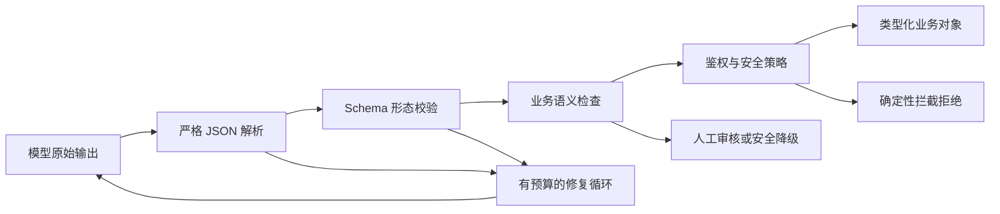

# 结构化输出本质是不可信契约

> 合法的 JSON 语法并不等于合法的业务决策。必须先解析原始字节、校验数据形态（Shape）、验证业务语义（Semantics），最后才能授权执行下游操作。

**Type:** Build
**Languages:** Python
**Prerequisites:** [Validate the Claim, Not the Confidence](../../05-output-evaluation-and-validation/), [The Messages API Is a State Machine](../../08-messages-api-and-application-lifecycle/)
**Time:** ~95 minutes

## 学习目标

- 严格区分 JSON 语法有效性、Schema 契约形态、业务语义合法性以及系统授权边界
- 设计严密的 JSON Schema，使非法状态在结构层面难以被表达
- 在不采用不安全文本清洗或乐观类型强转的前提下防御性解析 Claude 输出
- 通过有上限、携带精准校验错误的修复循环（Repair Loop）自愈非法响应
- 在不静默破坏下游消费者的前提下完成结构化输出契约的平滑版本演进
- 在对抗样本和流式边界条件下全面测试结构化输出链路

## 问题背景

你的客服分诊应用要求模型输出 1 到 5 之间的优先级。模型返回了如下响应：

```json
{
  "category": "billing",
  "priority": 9,
  "summary": "Customer reports a duplicate charge",
  "needs_human": false
}
```

标准的 JSON 解析器解析成功。对象中包含了期望的每一个键。应用程序将其作为最高级别的紧急事件分发，跳过了人工审核，并直接通过 PagerDuty 呼叫了值班工程师。

模型并没有违反 JSON 语法规则。真正失败的是你的应用程序没有在业务层落实契约约束。

结构化输出的处理链路必须经历四道关卡：

1. **语法关 (Syntax)：** 输出是否为且仅为一个可被合法解析的 JSON 值？
2. **形态关 (Shape)：** 该值是否完全符合字段类型、必填字段、枚举项、数值上下限以及禁止额外属性（`additionalProperties: false`）的约束？
3. **语义关 (Semantics)：** 字段内容是否与领域已知事实及上下文自洽，字段之间是否存在逻辑冲突？
4. **权限关 (Authority)：** 模型请求触发的下游动作是否得到了系统安全策略与当前用户身份的显式授权？

通过前一道关卡，绝不代表自然通过后一道关卡。


```mermaid
flowchart LR
    Raw[模型原始输出] --> Parse[严格 JSON 解析]
    Parse --> Schema[Schema 形态校验]
    Schema --> Meaning[业务语义检查]
    Meaning --> Policy[鉴权与安全策略]
    Policy --> Consume[类型化业务对象]
    Parse --> Repair[有预算的修复循环]
    Schema --> Repair
    Meaning --> Escalate[人工审核或安全降级]
    Policy --> Deny[确定性拦截拒绝]
    Repair --> Raw
```

## 核心概念

### 仅在提示词中索要 JSON 绝非安全契约 (Prompting for JSON Is Not a Contract)

“仅返回 JSON 格式”只是一句自然语言指令。它能够提高概率，但绝无法从物理上杜绝非法输出，无法抵御 Schema 漂移，更无法验证业务内容的真实含义。

当所选模型和 API 支持结构化输出功能（Structured Outputs）时，你可以传入 JSON Schema 并要求平台在解码层面实施约束生成（Constrained Decoding）。这能大幅消除语法和形态层面的错误，但它依然无法证明引用的订单真实存在、退款申请是否已被批准，或是问题分类是否完全符合业务事实。

产品说明（2026-08-09 校验）：结构化输出功能的可用性、支持的 Schema 关键字、与其他特性的兼容性以及具体的模型支持情况会持续演进。在投产前请查阅官方[结构化输出文档](https://platform.claude.com/docs/en/build-with-claude/structured-outputs)。即便开启了解码约束，应用程序侧的独立校验逻辑依然必不可少。

应用程序才是 Schema 的真正所有者，应当像对待公共 API 一样对其进行显式版本化管理。

```json
{
  "$id": "support-triage-v1",
  "type": "object",
  "required": ["category", "priority", "summary", "needs_human"],
  "additionalProperties": false,
  "properties": {
    "category": {
      "type": "string",
      "enum": ["billing", "bug", "account", "other"]
    },
    "priority": {
      "type": "integer",
      "minimum": 1,
      "maximum": 5
    },
    "summary": {
      "type": "string",
      "minLength": 1,
      "maxLength": 240
    },
    "needs_human": {
      "type": "boolean"
    }
  }
}
```

这种严谨的 Schema 规则完全契合生产要求：下游消费者仅期望恰好四个字段；意外出现的 `debug_context` 字段可能会将内部隐私数据意外泄露至日志中；整数边界约束直接拦截了非法的 `9`；枚举约束防止了分类拼写五花八门从而污染报表分析。

### 以消费者的决策需求为导向设计 Schema (Design Schemas From Consumer Decisions)

不要从“Claude 能够生成什么”出发，而要从“下游确定性程序必须根据什么进行决策”出发。

如果消费者需要选择工单队列，给它一个清晰的枚举；如果消费者需要对任务排期排序，给它一个带明确边界的整数；如果系统的不确定性会改变路由逻辑，直接在字段中显式建模不确定性，而不是指望它淹没在自由文本中。

对比以下两份契约：

```json
{"answer": "Probably a billing issue. It seems urgent."}
```

```json
{
  "category": "billing",
  "priority": 4,
  "evidence_ids": ["invoice-483", "message-12"],
  "uncertainty": "medium",
  "needs_human": true
}
```

第二个对象使下游的自动化路由和校验成为可能。尽管其中的事实仍有可能出错，但它具备高度的可审查性。

遵循以下核心设计准则：

- 优先使用枚举（Enums）替代自由格式的文本标签。
- 仅当每个合法响应都必定能提供该数据时，才将字段声明为必填（Required）。
- 审慎且显式地使用 `null` 来表达“明确的缺失”，切勿将其作为笼统的逃生后门。
- 除非下游消费者明确支持扩展字段，否则坚决禁止额外属性（`additionalProperties: false`）。
- 对字符串长度和数组大小设定明确上限，有效控制 Token 成本与数据库存储开销。
- 当结论必须具备可追溯性时，强制包含证据凭证标识符（`evidence_ids`）。
- 将动作意图建模为“建议（Proposal）”，而非“已授权（Authorization）”的既成事实。
- 为每个 Schema 赋予稳定的命名与版本号标识。

避免设计一个用数十个可选字段拼凑而成的“万能通用大对象”。应当使用带标签的联合类型（Tagged Union）或独立的端点契约。当每个字段都变成可选时，系统的非法中间状态组合将呈爆炸式增长。

### 坚决执行严格解析 (Parse Strictly)

盲目乐观的文本清洗往往会掩盖严重的问题。考虑以下常见的不良反模式：

```python
raw = raw.replace("```json", "").replace("```", "")
payload = json.loads(raw)
```

这种做法看似友好宽容，实则在模型生成后悄悄篡改了契约边界。一个包含大段解释性自然语言、多个散乱 JSON 对象，或受到恶意提示词注入的代码围栏文本，可能会被强行拼接成一个模型从未真正按单一结构输出过的畸形对象。

坚持严格解析策略：

```python
payload = json.loads(raw)
validate_against_schema(payload)
```

如果契约规定必须返回单一的 JSON 对象，直接拒绝带有 Markdown 代码块包裹和尾部多余解释文本的响应。显式捕获并归类该错误类型。这样后续的修复尝试才能够获得高度精准的机器可读报错信息。

坚决杜绝静默类型强转：

- `"4"` 绝不是合法的 integer。
- `1` 绝不是合法的 boolean。
- `"false"` 绝不能当作 false 处理。
- 逗号分隔的普通字符串绝不是 array。
- 字段缺失绝不能擅自等同于安全默认值，除非 Schema 显式声明了该默认值且应用在业务层审慎适用了该规则。

在 Python 中存在一个极为隐蔽的语法陷阱：`bool` 是 `int` 的子类。简单的 `isinstance(True, int)` 会判定为真，从而将布尔值错误地放行为整型。可运行的校验器显式排除了这一风险。

### 形态合法之后，必须校验业务语义 (Validate Meaning After Shape)

Schema 只能证明 `invoice_id` 是一个合法的字符串类型，但它绝无法证明该发票在核心业务系统中真实存在，更无法证明它属于当前已鉴权的用户。

业务语义检查依赖受信任的后端数据源：

```python
if payload["invoice_id"] not in invoices_for(authenticated_user):
    raise SemanticError("invoice is not visible to this user")

if payload["refund_amount"] > verified_charge_amount:
    raise SemanticError("refund exceeds verified charge")
```

跨字段联合约束同样关键。当 `uncertainty: high` 时，`needs_human: false` 应当判定为非法业务状态；拟议的 `action: close_account` 必须要求提供前置审批令牌；引用的事实凭据 ID 必须真实对应到能够支撑该论断的源文档片段。

模型的作用是辅助生成业务提议。确定性的业务代码负责核实身份合法性、数据所有权归属、资金上下限安全边界、细粒度操作权限以及状态机流转规则。

### 设立严格预算的修复循环 (Repair With a Budget)

输出非法并不必然意味着任务直接彻底失败。如果是低风险场景，且不需要无中生有凭空捏造缺失凭据的前提下，语法或 Schema 错误通常是可以通过重试自愈修复的。

一个健壮的修复循环必须包含：

1. 原始的业务任务说明与未被篡改的受信任上下文。
2. 目标 Schema 或精准提炼的契约规则摘要。
3. 机器自动生成的、精确到字段路径的校验错误清单。
4. 严格设定的最大重试尝试轮次。
5. 最终失败时的确定性降级或转人工升级机制。

```text
Repair the previous output.
Return one JSON object and no surrounding text.
Validation errors:
- $.priority: expected integer from 1 through 5
- $.needs_human: required field is missing
Do not invent evidence that was not present in the source.
```

切勿把原始的异常堆栈轨迹、内部机密凭据、敏感数据库字段或不受信的任意内容直接拼接到高特权指令区域中。校验反馈本身也是数据，应当做好物理边界隔离，并与受信任的修复指令明确区分开来。

通常两次修复尝试就足以清晰判定：该失败究竟是一次偶然的格式抖动，还是根本性的契约失配。无限重试只会白白烧毁 Token 预算，甚至可能放大提示词注入攻击的风险。必须全程统计重试次数、消耗的 Token 量、端到端延迟以及重复出现的错误指纹。

如果原始输入中根本缺乏必要的决策事实依据，此时强行修复 JSON 格式是完全错误的应对方向。应当向调用方返回显式的“信息缺失（incomplete）”状态，或直接上报人工。

### 工具输入与最终输出属于完全不同的契约边界 (Tool Inputs and Final Outputs Are Different Contracts)

Claude 的 Tool Use 同样会接收结构化输入，但它服务于完全不同的交互边界：

- 工具输入 Schema 是为了指引模型如何正确构造函数调用。
- 工具处理函数在执行前，依然必须严格校验参数取值并对调用方进行身份鉴权。
- 当工具结果来自外部第三方服务时，其返回值属于不可信的外部输入。
- 最终面向应用消费者的输出具有独立的用户侧响应 Schema。

绝不能直接将内部宽松繁复的工具 Schema 作为对外暴露的响应契约。内部工具字段极易泄露底层实现细节或敏感系统凭据。务必将经过校验的工具调用结果精简映射为最小化的最终业务对象。

同理，绝对不要因为模型最终输出的 JSON 中包含了 `"approved": true` 就盲目触发特权动作。真正的审批授权必须来自于业务系统中经过加密鉴权的真实状态，而非模型生成的文本内容。

当采用工具调用来实现结构化数据抽取时，需要掌握 CCAR-F 考试大纲中所涉及的三种官方 `tool_choice` 模式：

| 模式选项 | 模型行为表现 | 推荐适用场景 |
|---|---|---|
| `auto` | 模型可自主决定调用工具或直接返回对话文本 | 两种路径在业务上均可接受 |
| `any` | 模型必须在所提供的工具列表中选择调用其一 | 必须获得类型化工具结果，但存在多种合法 Schema |
| `{"type":"tool","name":"extract_metadata"}` | 模型被强制要求调用指定的具体工具 | 在后续流程前必须首先完成特定单项信息抽取 |

对于最终的机器可读响应，只要当前原生结构化输出（Native Structured Outputs）能力支持目标 Schema 与所需特性，优先采用原生方案。当业务流本身确实涉及工具选择或调用执行时，才使用工具 Schema。在这两种场景下，语义校验与权限核验始终是应用程序必须承担的工作。

### Pydantic 是校验器的一种实现，而非契约本身 (Pydantic Is a Validator Implementation, Not the Contract)

CCAR-F 官方指南中将 Pydantic 与 JSON Schema 校验以及“校验-重试”循环并列提及。在 Python 生态中，Pydantic 模型能够自动导出 Schema、根据配置对输入进行强转或拦截，并表达复杂的跨字段联合校验逻辑。但它并不能证明模型陈述的事实属实，更无法自动赋予下游系统执行权限。

本仓库坚持 Stdlib-First（标准库优先）原则以保证教学透明度，因此随堂实战 Lab 直接手写实现了相关核心校验。如果你的生产应用已经引入了 Pydantic，请显式映射同样的四道关卡：

```text
JSON 解析 -> Pydantic 形态校验 -> 业务领域校验 -> 系统权限核准
```

格外警惕库函数的自动类型强转行为。一个会静默将 `"4"` 强转为 `4` 的校验器，在某些外部数据接入边界可能是友好的，但在严苛的高安全交易边界则是完全无法接受的。将精准到字段级别的校验错误反馈给修复循环，并在原素材缺乏支撑依据时果断转入人工介入流程。

### 流式传输产生的是局部中间语法 (Streaming Produces Partial Syntax)

通过流式传输接收到的 JSON，在该内容块正式关闭前始终是不完整的。类似 `{"category":"bill` 这样的片段此时并非格式错误，它仅仅是尚未传输完成。

应当完整缓冲结构化内容块。除非你使用了专门针对增量 JSON 设计的流式解析器并充分理解其局部状态语义，否则切勿在每收到一个字符时反复解析。绝对不要仅仅因为某个关键必填字段提前在流中出现，就提前触发下游业务操作。

当内容块传输完毕后：

1. 确认流确实接收到了合法的终止结束事件。
2. 执行恰好一次完整的严格解析。
3. 校验 Schema 形态约束。
4. 校验业务语义与安全权限。
5. 以原子操作方式提交下游业务状态变更。

如果流式连接在途中意外中断，必须丢弃或隔离暂存的残缺对象。前端 UI 可以向用户临时呈现预览文本，但后端的应用契约绝未达成。

### Schema 演进等同于公共 API 升级迁移 (Schema Evolution Is an API Migration)

假设版本 1 将 `priority` 定义为整数。版本 2 将其重构为 `severity: "low" | "medium" | "high"`。如果先部署新版提示词，旧版下游消费者解析将直接崩溃；如果先部署下游消费者代码，它可能会直接拒绝旧版模型输出。

可采用以下平滑迁移策略之一：

- 在 Schema 中引入契约版本号字段（`contract_version`），在迁移过渡期内同时兼容新旧两个版本。
- 部署一个在明确规划的兼容周期内具备容错读取能力的消费者（Tolerant Reader）。
- 在正式切换流量前，进行双写并行生成并交叉比对输出质量。
- 在边界适配器层（Adapter Boundary）将新版输出转换为旧版内部数据类型。

绝对不要在未通知下游的情况下静默变更 Schema。必须在每一条追踪日志中记录 Schema 版本号、提示词版本号、模型版本号以及校验器版本号。回归评测集必须全面覆盖新旧样本、临界极值、缺省字段、多余未知字段、恶意对抗字符串以及海量输入文本。

### 构建校验器与自愈修复循环 (Build the Validator and Repair Loop)

`code/main.py` 在零第三方依赖的前提下，实现了一个功能完备的 JSON Schema 核心子集。它支持对复杂对象、必填项、禁止额外属性、原生基础类型、枚举、数值上下限、字符串长度约束、数组以及嵌套路径进行全量校验，并将其封装在一个具备有界重试能力的提取器中。

运行验证：

```bash
cd certifications/claude/lessons/09-structured-output-and-defensive-parsing/code
python3 main.py
python3 -m unittest discover tests -v
```

第一个脚本化响应在需要整数的位置故意返回了 `"high"`。第二个响应精准修复了该字段。单元测试证明了 Markdown 代码块围栏、缺失必填字段、布尔值混充整型、意外未知字段以及重试超限等情况均能被显式拦截并报错。

在生产环境中，优先选用所在技术栈成熟的主流校验库。本课手写轻量校验器子集的目的，是为了彻底弄懂底层库背后所执行的核心检查，而非在生产中替代标准完整的 JSON Schema 实现。

## Interactive Lab (交互式实验)

通过自愈恢复图示，观察候选输出如何依次穿过语法关、形态关、语义关和权限关。演练将有限的修复预算投入到自愈结构格式错误中，并将此结果与因缺乏原始事实凭据而必须升级人工处理的场景进行对比。

```figure
09-structured-output-recovery
```

## Practice Lab (实战演练)

运行带边界约束的抽取器，然后依次输入包含 Markdown 围栏的 JSON、布尔值整型、意外未知属性以及连续两次均非法的畸形响应。准确判断每种失败情况分别属于语法关、形态关、语义关还是权限关的职责范畴。

## Shipped Artifact (交付产物)

`outputs/validated-triage.json` 是通过离线自愈修复演示所生成的完整达标契约产物。运行 `python3 main.py` 即可在本地重现它，并随后运行单元测试套件。测试用例对比了签入的产物与 `demo()` 函数的输出，其余测试则系统覆盖了代码块围栏、字段缺失、布尔整型陷阱、额外属性拦截、有界修复以及超限重试等关键边界场景。

## Verify It (验证方法)

```bash
cd certifications/claude/lessons/09-structured-output-and-defensive-parsing/code
python3 main.py
python3 -m unittest discover tests -v
```

## Capstone Connection (项目连接)

配套测验将考核学员在陌生业务场景中精准归类各类异常归属关卡的能力。经充分验证的业务对象与修复证据链，将直接作为关键支撑材料纳入 Developer Capstone 30 以及 Architect Capstone 31 和 32 的实施方案中。

## 考试决策准则 (Exam Decision Rules)

- 若输出能够成功解析但违反了数值区间或枚举项，应当选用 Schema 形态校验进行拦截，而非在提示词中追加模糊的免责声明。
- 若输出完全匹配 Schema 定义但与数据库中的受信任真实记录相矛盾，应当选用业务语义检查进行拦截。
- 若提取出的对象提议执行特权业务动作，必须完全基于应用层真实用户身份与系统权限策略进行鉴权核准。
- 若格式校验偶发失败，利用携带精准校验错误明细的受限修复循环进行针对性自愈。
- 若核心事实凭据缺失，应当果断转人工升级或返回明确的未决状态，绝不能试图通过修复循环“脑补”虚构事实。
- 若流式传输尚未完全结束，严禁将其作为已生效契约进行提前解析或触发下游动作。
- 若 Schema 需要调整变更，必须像对待任何对外公开的 API 一样进行显式版本控制与平滑双轨迁移。
- 若平台提供了解码约束（Constrained Generation）能力，积极启用以大幅削减格式错误，但应用层的事后防御性校验绝不可废弃。

## 课后练习 (Exercises)

1. 在 Schema 中新增 `evidence_ids` 字段并约束为带长度上限的字符串数组。编写测试用例覆盖合规列表、元素类型为整型的非法列表，以及元素数量超限的列表。
2. 增加一条跨字段联合业务校验规则：当 `uncertainty: high` 时，强制要求 `needs_human: true`。
3. 构建一个语义校验器，用来确认发票归属于当前已认证的用户，同时确保整个发票的完整敏感数据不会被泄露给模型。
4. 新增 `contract_version` 契约版本号字段，并手写实现一个将版本 1 格式平滑转换为版本 2 格式的边界适配器（Adapter）。
5. 针对校验器设计十组对抗性输入：Markdown 围栏文本、重复键值对象、非法未知字段、转义控制字符、超长文本、布尔混充整型以及嵌套的提示词注入语言。
6. 在独立的生产沙箱实验中，使用 Pydantic 将分诊工单契约重构为数据模型。在不向本课程引入额外依赖的前提下，对比 Pydantic 的严格模式（Strict Mode）与强转模式（Coercion）的行为差异。

## 延伸阅读 (Further Reading)

- [结构化输出指南 (Structured Outputs)](https://platform.claude.com/docs/en/build-with-claude/structured-outputs)
- [Messages API 参考手册](https://platform.claude.com/docs/en/api/messages)
- [工具使用概览 (Tool Use Overview)](https://platform.claude.com/docs/en/agents-and-tools/tool-use/overview)
- [提高输出一致性与护栏建设](https://platform.claude.com/docs/en/test-and-evaluate/strengthen-guardrails/increase-consistency)
- [JSON Schema 官方规范](https://json-schema.org/specification)
- [Claude Certified Architect Foundations 考试大纲](https://everpath-course-content.s3-accelerate.amazonaws.com/instructor%2F6nizmqk8tpzpfjvt6qmmav7rh%2Fpublic%2F1783542750%2FClaude+Certified+Architect+%E2%80%93+Foundations+Exam+Guide.pdf)
