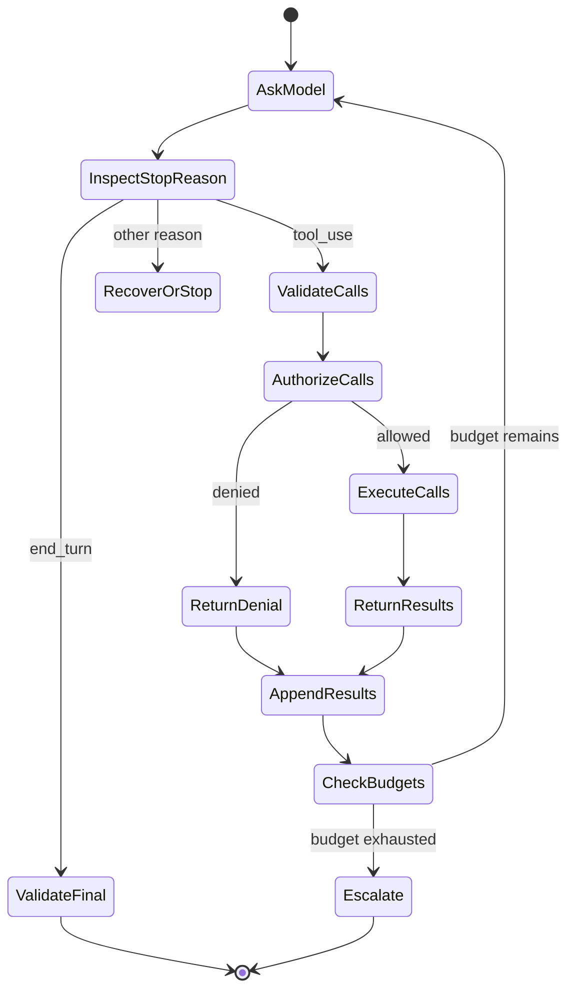

# 工具循环是一种受控委托

> Claude 可以提出操作建议。你的应用负责验证请求、授予能力、观察结果，并决定是否继续循环。

**Type:** Build
**Languages:** Python
**Prerequisites:** [Messages API 是一个状态机](../../08-messages-api-and-application-lifecycle/), [Structured Output 是一份不受信任的契约](../../09-structured-output-and-defensive-parsing/)
**Time:** ~130 分钟

## 学习目标

- 实现完整的 `tool_use` 和 `tool_result` 协议循环
- 设计职责明确的工具契约，并选择其执行边界
- 将模型对工具的选择与确定性授权分离
- 比较手写循环、SDK Tool Runner 和 managed agents
- 将失败作为类型化结果返回，并消费可操作的运行时事件
- 限制自主性，并在路径已知时选择固定工作流

## 重复执行付款操作的 Agent

一个账单助理收到“退还重复收取的费用”。Claude 请求调用 `issue_refund`。应用执行该操作。最终文本到达前，响应连接中断。应用重试整个轮次，Claude 再次请求该工具，客户因此收到两次退款。

问题不在于模型使用了工具，而在于应用混淆了语言生成与事务控制。

可靠的工具循环具有两份契约：

1. 模型可以使用结构化参数提出调用某项具名能力。
2. 确定性的应用代码决定该能力是否执行、如何执行，以及最多执行多少次。

工具使用扩展了 Claude 的触达范围，但没有赋予 Claude 权限。

## 框架之前的线协议契约

客户端工具在请求中声明。每个声明都会向模型提供名称、描述和 JSON Schema 输入契约。

```json
{
  "name": "lookup_order",
  "description": "使用准确的公开订单 ID 查询一笔订单。返回状态和最后更新时间。此工具绝不会更改订单。",
  "input_schema": {
    "type": "object",
    "required": ["order_id"],
    "additionalProperties": false,
    "properties": {
      "order_id": {
        "type": "string",
        "description": "格式为 A-12345 的订单 ID"
      }
    }
  }
}
```

Claude 可能返回：

```json
{
  "stop_reason": "tool_use",
  "content": [
    {
      "type": "tool_use",
      "id": "toolu_7f3",
      "name": "lookup_order",
      "input": {"order_id": "A-12345"}
    }
  ]
}
```

你的客户端保留完整的 assistant content，验证并运行工具，然后追加：

```json
{
  "role": "user",
  "content": [
    {
      "type": "tool_result",
      "tool_use_id": "toolu_7f3",
      "content": "{\"found\":true,\"status\":\"in_transit\"}"
    }
  ]
}
```

匹配 ID 并非装饰。它将结果与某个请求关联起来。在协议所期望的对话历史中，assistant message 必须紧邻结果序列之前。

有关当前 SDK 和 API 的结构，请参阅[实现客户端工具](https://platform.claude.com/docs/en/agents-and-tools/tool-use/implement-tool-use)。

## 循环具有显式状态



每次状态转换都可能失败。响应可能缺少工具 ID。工具名称可能未知。参数可能违反 Schema。授权可能拒绝调用。handler 可能超时。结果可能过大。Claude 可能请求另一个工具。最终答案仍可能无法满足其输出契约。

不要用一个宽泛的 `try/except` 和通用重试来隐藏这些状态。应当对它们进行分类，并根据失败类别选择恢复方式。

## 工具设计就是接口设计

Claude 根据工具接口选择工具。人类应当无需阅读 handler 就能推断何时使用每个工具。

### 让每个工具只承担一项职责

`manage_customer` 含义模糊。它可能执行搜索、编辑、退款、暂停或删除。职责单一的工具目录更易选择，也更易保护：

- `get_customer_profile`
- `list_customer_invoices`
- `propose_refund`
- `issue_approved_refund`

提议与执行之间的分离至关重要。低风险工具可以计算建议退款金额。高风险工具则需要由模型之外的系统生成经过身份验证的审批 Token。

### 编写用于选择的描述，而不是内部文档

有效的描述应说明工具的作用、何时使用、何时不应使用，以及结果的含义。它不应粘贴整份 API 手册。

不佳：

```text
调用 Commerce 服务中的 GET /v3/orders/{id}。
```

更好：

```text
从 commerce 系统读取一笔现有订单的当前状态。
仅当用户提供准确的订单 ID 时使用。此工具为只读工具。
不要用它按电子邮件进行搜索，也不要用它修改配送详情。
```

描述中的示例可以阐明复杂格式，但每个 Token 都会随工具目录重复出现。应衡量示例对选择准确性的改善是否足以抵消其上下文成本。

### 让无效调用难以表达

使用枚举、必填字段、边界和 `additionalProperties: false`。拆分互斥模式。当范围明确的领域值能够满足需求时，应避免自由形式的 shell 命令、SQL、URL 和文件系统路径。

Schema 会引导生成，但 handler 仍然必须进行验证。绝不要因为模型生成的输入来自 Schema，就假定它是安全的。

## 保持工具目录精简且区分明确

更多工具并不总能带来更强的能力。名称重叠和过长的工具目录会造成选择歧义并消耗上下文。

从实际任务所需的最少工具开始。当 eval 显示存在能力缺口时再添加工具。当轨迹显示存在混淆时，删除或合并工具。

使用以下问题进行判断：

- 从名称和描述来看，两个工具是否可以互换？
- 通用代码工具或 CLI 工具是否已经能在 sandbox 中完成此任务？
- Agent 是否每一轮都需要这项能力？
- 该能力能否放在 Skill 中，仅在相关时加载？
- 是否应当由独立 subagent 获得该工具，而不是主 Agent？
- 标准化的 MCP server 是否能让多个 host 安全地共享它？

工具数量不是架构评分。正确选择和受控执行才是。

## 验证之后再授权

安全的执行边界遵循以下顺序：

1. 根据 allowlist 解析工具名称。
2. 验证输入类型和边界。
3. 从应用而不是参数中绑定经过身份验证的身份和 tenant context。
4. 检查能力范围和资源所有权。
5. 对会产生重大后果的操作要求审批。
6. 应用幂等性、超时、速率和大小限制。
7. 在可用的最小范围 sandbox 中执行。
8. 将结果返回 Claude 或写入日志前进行脱敏。

如果工具参数包含 `user_id`，不要将其作为可信身份。应将其与经过身份验证的会话进行比较，或者彻底移除模型对该字段的控制权。

对于变更操作，审批记录应绑定用户、操作、规范化参数、有效期和操作 ID。对话文本中的“用户之前同意过”并不是安全的审批 Token。

## 将失败作为结果返回

handler 失败并不必然导致应用崩溃。如果 Claude 收到简洁且真实的工具结果，它可能可以恢复。

```json
{
  "type": "tool_result",
  "tool_use_id": "toolu_7f3",
  "is_error": true,
  "content": "订单服务超时。订单状态未发生变化。允许重试一次。"
}
```

良好的错误内容会告诉模型：

- 什么操作失败了。
- 是否产生了任何副作用。
- 重试是否安全。
- 可以进行哪种修正。

不要暴露 stack trace、环境值、数据库查询、access token 或内部 hostname。将这些信息保存在受保护的 telemetry 中，并实施脱敏和访问控制。

验证失败可以包含字段路径。策略拒绝不应诱导模型寻找绕过方式。诸如“此 Agent 无权发起退款”这样的拒绝信息，比列举每一条安全规则更安全。

根据你的设计，未知工具应转换为相关联的错误结果或终止性协议错误。绝不要动态导入并运行由模型命名的 handler。

## 多次和并行工具调用

Claude 可以在一个响应中请求多个工具。只有当这些调用彼此独立、只读且可以安全调整顺序时，才并行执行。

两次搜索通常可以并发运行。“创建发票”之后“发送发票”存在依赖关系，必须保持顺序执行。对同一记录执行两次写入可能产生冲突。付款和电子邮件可能需要事务或补偿工作流。

为每个请求的 `tool_use` ID 返回一个 `tool_result`。保留足够的顺序信息，以便重建轨迹。如果某个并行调用失败，应报告每个调用的结果，而不是假装整个批次全部成功。

产品说明，核验于 2026-08-08：用于自动执行工具和并行调用的 helper API 因 SDK 而异。它们不会免除应用的授权责任。请查阅当前的[工具使用概览](https://platform.claude.com/docs/en/agents-and-tools/tool-use/overview)。

## 限制 Agent

除了 `end_turn`，Agent 循环还需要其他终止条件：

- 最大模型轮数。
- 全局和每个工具的最大工具调用次数。
- 实际时间期限。
- Token 和费用预算。
- 最大连续错误数。
- 相同调用的最大重复次数。
- 用户取消。
- 必需的人工审批。
- 经过验证的最终状态谓词。

最终状态谓词比判断响应听起来是否完整更可靠。部署 Agent 只有在预期版本处于健康状态时才算成功，而不是在它说出“已部署”时。研究 Agent 只有在所需主张具有可解析的来源时才算成功，而不是在它生成一份长篇报告时。

记录轨迹：prompt 版本、模型、stop reason、工具名称、规范化参数指纹、决策、延迟、结果类别和状态变化。对敏感值进行脱敏。

## 工作流还是 Agent

当步骤和分支已知时，使用固定工作流。当路径取决于观察结果，并且模型必须在多个工具之间进行选择时，使用 Agent。

| 任务 | 更好的默认选择 | 原因 |
|---|---|---|
| 提取字段、验证、存储 | 工作流 | 顺序已知且契约清晰 |
| 分类后路由到一个队列 | 工作流 | 分支集合有限 |
| 调查不熟悉的 repository 缺陷 | Agent | 搜索路径取决于调查结果 |
| 验证重复收费后退款 | 带审批的工作流 | 操作会产生重大后果且控制措施已知 |
| 跨不断变化的内部系统收集证据 | 有界 Agent | 工具选择取决于缺失的证据 |

只有当任务有价值、环境可通过工具访问、错误可检测并且能够恢复时，自主性才是合理的。如果错误无法检测，增加更多 Agent 轮次只会掩盖风险。

## 选择需要自行掌控多少循环逻辑

通过工作流判断关卡后，选择满足运行要求的最小 harness。

| 运行时 | 它负责处理的内容 | 你的应用仍需处理的内容 | 适用场景 |
|---|---|---|---|
| 手写 Messages 循环 | 仅处理你实现的协议工作 | 完整历史记录、stop reason、Schema 和策略、执行、重试、预算、trace 以及恢复 | 需要线协议级控制、受限运行时、自定义状态机，或者进行协议教学和测试 |
| SDK Tool Runner | 工具声明 helper、`tool_use` 与 `tool_result` 排序、消息状态更新，以及可选的逐轮 streaming | 授权、sandbox、幂等性、错误披露、迭代限制、可观测性和最终状态证明 | 受支持的 SDK 符合需求，并且客户端工具仍在你的应用控制下运行 |
| Claude Managed Agents | 具有已配置 sandbox、内置工具和事件驱动执行能力的远程 Agent、session 和 environment harness | Agent 配置、数据边界审批、自定义工具执行、确认决策、事件持久化、业务授权和结果验证 | 需要托管 session 和 sandbox 边界，并且接受其当前 beta、平台和事件契约 |

本课代码特意采用第一种方案。它公开了每一次状态转换。迁移到 [Tool Runner](https://platform.claude.com/docs/en/agents-and-tools/tool-use/tool-runner) 可以移除重复的循环管道代码，但无法让退款操作自动变得安全。应设置迭代上限，拦截或封装工具执行，保留应用审批，并验证最终状态。

产品说明，核验于 2026-08-09：[Claude Managed Agents](https://platform.claude.com/docs/en/managed-agents/overview) 当前处于 public beta 阶段，并使用带版本的 beta 契约。它提供 managed agents、environments、sessions、内置工具和 server-sent event streaming。应将 header、资源、事件类型、工具集、限制和 provider 可用性视为易变内容。不要仅仅因为任务被称为 Agent 就选择它。

managed-agent 集成是事件消费者，而不是最终文本调用。应用发送用户事件，消费持久化的 session 和 Agent 事件，并跟踪状态。自定义工具调用或受权限控制的工具可能通过 `requires_action` 暂停 session；应用使用结果或确认决策解析所引用的事件 ID。SSE 连接关闭并不代表成功。应对持久化事件和终止状态进行协调核对。第 12 课通过离线事件 fixture 实现了这一边界；当前资料是 [Session event stream](https://platform.claude.com/docs/en/managed-agents/events-and-streaming)。

## 第一方并不意味着只有一种执行边界

根据代码和数据的执行位置、授权主体以及发现方式对能力进行分类。

| Surface | 执行和数据边界 | 用途 | 不要假定 |
|---|---|---|---|
| Messages server tool | Anthropic 执行受支持的工具，例如 web search、web fetch、code execution 和 tool search | provider 端执行和数据策略符合要求的受支持第一方能力 | 在通常情况下，你的应用会收到需要执行的客户端 `tool_use` |
| Anthropic-schema client tool | Anthropic 定义训练中使用的 Schema；你的应用执行 bash、text editor、memory 或 computer use 等工具 | 标准 Schema 能提高模型熟悉度，但必须由客户端负责执行的常见操作 | 第一方 Schema 意味着由 provider 执行或自动获得授权 |
| Managed-agent built-in | 已配置的 managed 或 self-hosted Agent environment 执行其工具集 | 符合该运行时 sandbox 和权限策略的 repository 与 web 工作 | 启用工具集即授予业务权限，或不再需要确认 |
| Custom client tool | 你的应用验证并执行其 JSON Schema 契约 | 私有业务操作、范围明确的领域 API 和精确的应用策略 | 符合 Schema 的输入就是身份、授权或幂等性证据 |
| Skill | 受支持的运行时加载可复用的指令、参考资料、脚本或资源 | 只应在相关时披露的流程 | Skill 本身就是执行或授权边界 |
| MCP | MCP client 或 connector 调用标准化的外部 server | 通过显式 server、身份和 transport 边界在兼容 host 之间共享的能力或上下文 | server discovery 会让返回的每个工具都变得安全或相关 |

Skill 和工具通常互为补充，而不是二选一。退款审核 Skill 可以教授流程，而 custom client tool 则公开经过批准的操作。当多个 host 需要相同的标准接口时，MCP 可以承载该操作。只有在 provider 执行的 server tool 的网络、保留和结果语义符合数据要求时，才选择它。只有当你的 sandbox 和操作验证器已准备好执行 Anthropic-schema client tool 时，才选择这种工具。

当前执行类别记录在[工具使用的工作原理](https://platform.claude.com/docs/en/agents-and-tools/tool-use/how-tool-use-works)中，而 managed harness 拥有独立的[工具配置](https://platform.claude.com/docs/en/managed-agents/tools)。版本和模型兼容性会发生变化，因此应在 trace 中持久化所选工具的类型和版本。

## 构建循环

`code/main.py` 实现了工具 registry 和原始循环。它支持多次调用、Schema 检查、变更工具审批、handler 错误、未知工具、correlation ID 和轮次预算。其离线决策 lab 还会根据明确的需求，在工作流、手写循环、SDK Tool Runner 和 managed agents 之间进行选择。它也会将执行 surface 与可选 Skill 组合起来，而不是假装 Skill 就是工具。

```bash
cd certifications/claude/lessons/10-tool-use-and-agentic-loops/code
python3 main.py
python3 -m unittest discover tests -v
```

阅读 demo 打印的 transcript。找到 assistant 的 `tool_use` block，以及紧随其后的 user `tool_result`。然后检查其后打印的决策 fixture。修改 managed-agent 案例，使其不接受 beta，并让决策在任何运行时启动之前失败。协议和架构的正确性应当清晰可见，而不是依赖假设。

## 交互式 Lab

使用工具循环图分配轮次、工具调用、时间和审批预算。触发重复调用或被拒绝的变更操作，并观察哪个确定性终止条件停止循环。

```figure
10-tool-loop-budget
```

## 实践 Lab

运行工具循环，然后测试未知工具、无效参数、被拒绝的变更操作、多次调用、handler 错误和耗尽的轮次预算。确认每个结果都保留其 tool-use ID。接下来，根据执行边界和授权所有者，对 provider server tool、Anthropic-schema client tool、private custom tool、Skill 支持的流程和 MCP service 进行分类。

## 交付产物

`outputs/tool-loop-transcript.json` 是由 `demo()` 生成的完整关联执行 transcript。`outputs/runtime-and-tool-surface-decisions.json` 是一份带日期、不依赖 provider 的比较，涵盖四种运行时和四种能力组合。运行 `python3 main.py` 检查两者，并执行单元测试套件，以验证产物、Schema 边界、审批拒绝、运行时关卡、执行边界、handler 失败和失控预防。

## 验证

```bash
cd certifications/claude/lessons/10-tool-use-and-agentic-loops/code
python3 main.py
python3 -m unittest discover tests -v
```

## Capstone 衔接

测验会考查提议与授权的区别、工具描述、幂等性、并行性、最终状态检查和工作流选择。将经过验证的 transcript 带入 Developer capstone 30，以及 Architect capstone 31 和 32，作为工具边界证据。

## 考试决策规则

- Claude 对工具的选择只是一项提议，绝不等同于授权。
- 先验证 Schema，再检查策略，最后执行。
- 使用范围明确的名称和描述，区分各工具的适用场景。
- 在能够安全恢复时，返回简洁且相互关联的错误。
- 对可重试的副作用要求幂等性或协调核对。
- 只有在调用彼此独立且顺序无关时，才并行执行。
- 在预算耗尽、调用重复、用户取消或出现无法识别的控制状态时停止。
- 当路径已知时，优先选择确定性工作流。
- 当客户端执行符合需求，并且自定义线协议控制没有额外价值时，优先选择 SDK Tool Runner。
- 只有在确实需要 managed runtime，并且接受 beta 和数据边界时，才选择 managed agents。
- 将 managed session 视为事件状态机；通过事件 ID 解析 `requires_action`，绝不要根据断开的 stream 推断成功。
- 根据执行位置区分 server-executed tools、Anthropic-schema client tools、managed built-ins 和 custom client tools。
- 将 Skill 视为流程，将 MCP 视为连接边界；二者都不会授予授权。
- 评估工具轨迹和最终状态，而不仅仅是最终文本。

## 练习

1. 添加需要审批 Token 的 `issue_refund`。证明对话文本无法替代该 Token。
2. 在一个响应中添加两个只读调用，并发执行它们，同时保留确定性的结果关联。
3. 让一个工具在产生副作用后超时。在重试前添加幂等性 key 和协调核对检查。
4. 添加重复调用检测器，在同一个规范化工具请求出现两次后停止。
5. 将一个 private custom tool 改造为由两个 host 共享的 MCP 能力。明确哪些身份验证、同意、结果过滤和可用性责任转移到 server 边界，哪些责任仍由各个 host 承担。

## 延伸阅读

- [工具使用概览](https://platform.claude.com/docs/en/agents-and-tools/tool-use/overview)
- [实现客户端工具](https://platform.claude.com/docs/en/agents-and-tools/tool-use/implement-tool-use)
- [处理工具错误](https://platform.claude.com/docs/en/agents-and-tools/tool-use/implement-tool-use#handling-tool-use-and-tool-result-content-blocks)
- [Tool Runner](https://platform.claude.com/docs/en/agents-and-tools/tool-use/tool-runner)
- [工具使用的工作原理](https://platform.claude.com/docs/en/agents-and-tools/tool-use/how-tool-use-works)
- [Claude Managed Agents](https://platform.claude.com/docs/en/managed-agents/overview)
- [Session event stream](https://platform.claude.com/docs/en/managed-agents/events-and-streaming)
- [Managed-agent tools](https://platform.claude.com/docs/en/managed-agents/tools)
- [构建有效的 Agent](https://www.anthropic.com/research/building-effective-agents)
- [处理 stop reason](https://platform.claude.com/docs/en/build-with-claude/handling-stop-reasons)
