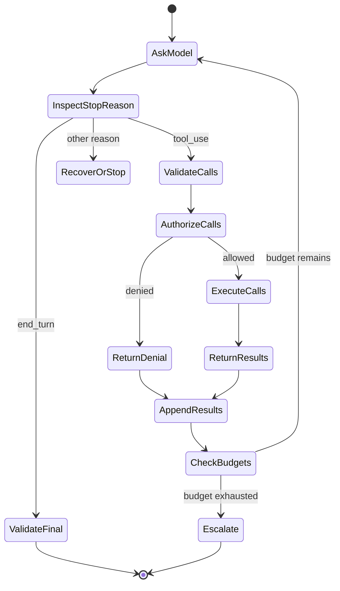

# 工具循环本质是受控委托

> Claude 可以提议执行某项操作。但必须由你的应用程序负责校验请求、授予能力、观察执行结果，并决定整个循环是否继续。

**Type:** Build
**Languages:** Python
**Prerequisites:** [The Messages API Is a State Machine](../../08-messages-api-and-application-lifecycle/), [Structured Output Is an Untrusted Contract](../../09-structured-output-and-defensive-parsing/)
**Time:** ~130 minutes

## 学习目标

- 完整实现底层的 `tool_use` 与 `tool_result` 协议循环
- 设计职责专注的工具契约并明确其执行边界
- 将模型对工具的选择（Selection）与确定性的系统鉴权授权（Authorization）严格解耦
- 对比手写循环、SDK Tool Runner 与托管智能体（Managed Agents）的架构权衡
- 将工具执行失败转化为结构化类型化结果，并响应可操作的运行时事件
- 严格限制自主度边界，并在已知业务路径时坚决选用确定性工作流

## 问题背景

一个财务计费助手接收到用户指令：“退还重复收取的费用。”Claude 请求调用 `issue_refund`。应用程序执行了退款操作。但在最终回复文本返回给客户端之前，网络连接意外断开。应用程序对整个轮次发起了盲目重试，Claude 再次请求调用该工具，最终导致客户收到了两笔退款。

问题不在于模型使用了工具。真正的问题在于应用程序把不可靠的自然语言生成与严格的事务控制（Transaction Control）混为一谈。

一个高可用的工具循环包含两层契约：

1. 模型可以提议调用某个命名的能力，并传入结构化参数。
2. 确定性的应用程序代码决定是否执行、如何执行，以及该能力最多被允许执行多少次。

工具使用赋予了 Claude 触达外部世界的能力，但绝没有赋予 Claude 擅自决策的特权。

## 核心概念

### 上层框架之前的底层通信协议契约 (The Wire Contract Before the Framework)

客户端工具在发给模型的请求中进行声明。每次声明都向模型提供名称、清晰的描述以及一份 JSON Schema 输入契约。

```json
{
  "name": "lookup_order",
  "description": "Look up one order by its exact public order ID. Returns status and last update. This tool never changes an order.",
  "input_schema": {
    "type": "object",
    "required": ["order_id"],
    "additionalProperties": false,
    "properties": {
      "order_id": {
        "type": "string",
        "description": "Order ID in the form A-12345"
      }
    }
  }
}
```

Claude 可能会返回如下响应：

```json
{
  "stop_reason": "tool_use",
  "content": [
    {
      "type": "tool_use",
      "id": "toolu_7f3",
      "name": "lookup_order",
      "input": {"order_id": "A-12345"}
    }
  ]
}
```

你的客户端必须完整保留上述 assistant 内容块，在本地完成校验并执行工具，随后在 user 角色中追加结果：

```json
{
  "role": "user",
  "content": [
    {
      "type": "tool_result",
      "tool_use_id": "toolu_7f3",
      "content": "{\"found\":true,\"status\":\"in_transit\"}"
    }
  ]
}
```

相互匹配的 ID 绝非可有可无的装饰。它负责将工具执行结果与单次具体调用精确关联。在协议所约定的对话历史序列中，包含调用请求的 assistant 消息必须紧邻在工具结果序列之前。

关于 SDK 与 API 的最新数据结构规范，请参阅[实现客户端工具文档](https://platform.claude.com/docs/en/agents-and-tools/tool-use/implement-tool-use)。

### 循环具备显式的状态流转 (The Loop Has Explicit States)


```mermaid
stateDiagram-v2
    [*] --> AskModel
    AskModel --> InspectStopReason
    InspectStopReason --> ValidateFinal: end_turn
    InspectStopReason --> ValidateCalls: tool_use
    InspectStopReason --> RecoverOrStop: other reason
    ValidateCalls --> AuthorizeCalls
    AuthorizeCalls --> ExecuteCalls: allowed
    AuthorizeCalls --> ReturnDenial: denied
    ExecuteCalls --> ReturnResults
    ReturnDenial --> AppendResults
    ReturnResults --> AppendResults
    AppendResults --> CheckBudgets
    CheckBudgets --> AskModel: budget remains
    CheckBudgets --> Escalate: budget exhausted
    ValidateFinal --> [*]
    Escalate --> [*]
```

每一个状态转换点都有可能发生故障。响应可能遗漏工具 ID；工具名称可能不在注册表中；参数可能违反 Schema 规范；安全鉴权可能拒绝执行；处理函数可能执行超时；返回结果可能超出体积限制；Claude 可能会请求下一个工具；最终自然语言回复依然可能未能满足业务输出契约。

切勿把这些状态全部粗暴地隐藏在一个通用的 `try/except` 和盲目重试之下。必须对错误进行精准分类，并根据失败类别采取针对性的恢复策略。

### 工具设计本质是接口设计 (Tool Design Is Interface Design)

Claude 是依据工具的对外接口定义来进行选择的。一个人类开发者应当无需阅读工具内部实现源码，就能准确判断何时该调用该工具。

#### 坚持单一职责原则 (Give Each Tool One Job)

类似 `manage_customer` 的命名过于模糊。它可能涵盖搜索、修改、退款、冻结或注销等各种行为。一个职责专注精细的工具目录不仅更容易被模型准确命中，也更容易进行安全管控：

- `get_customer_profile`
- `list_customer_invoices`
- `propose_refund`
- `issue_approved_refund`

将“提议（Proposal）”与“执行（Execution）”在接口层面严格解耦极为重要。低风险工具可以计算推荐的退款金额；而高风险的执行工具则必须强制要求传入在模型外部经过加密鉴权生成的审批令牌。

#### 编写供模型选择的说明，而非复制内部技术文档 (Write Selection Descriptions, Not Internal Documentation)

一份高效的工具描述应当清晰说明该工具做什么、何时使用、何时绝对不要使用，以及返回结果的具体业务含义。切勿直接粘贴整页底层 API 手册。

反面教材：

```text
Calls GET /v3/orders/{id} in the Commerce service.
```

良好示范：

```text
Read the current status of one existing order from the commerce system.
Use only when the user supplies an exact order ID. This tool is read-only.
Do not use it to search by email or to modify shipment details.
```

在描述中包含调用示例确实有助于模型理解复杂的格式，但工具目录中的每个 Token 都会在每一轮请求中重复计费。必须通过评测实测示例对工具命中率的改善是否值得其付出的上下文成本。

#### 在结构上消除非法调用的表达空间 (Make Invalid Calls Hard to Express)

积极使用枚举、必填字段、数值范围约束以及 `additionalProperties: false`。将互斥的操作模式拆分为不同字段或不同工具。当特定领域的枚举值足够满足需求时，坚决避免开放自由格式的 Shell 命令、原始 SQL 查询、任意 URL 或文件系统路径。

Schema 负责约束模型生成，但具体执行函数依然必须亲自进行二次防御校验。绝对不要仅仅因为输入来自合法 Schema 就假设其天然安全。

### 保持工具目录紧凑且区分度高 (Keep the Tool Catalog Small and Distinct)

工具数量越多，并不等于系统的能力越强。重叠模糊的命名和冗长臃肿的目录会导致模型选择歧义并大量消耗宝贵的上下文预算。

从满足真实核心任务所需的最小工具集开始。仅当评测暴露出明确的能力短板时才新增工具；当追踪轨迹显示模型出现调用混淆时，坚决移除或合并工具。

设计时请自问以下问题：

- 两个工具从名称和描述上看是否存在重叠或可互换性？
- 通用的沙箱代码执行或 CLI 工具是否已经能够胜任该任务？
- 智能体是否在每一轮对话中都必须持有该能力？
- 该能力是否更适合封装为 Skill，仅在触发相关场景时动态按需加载？
- 该工具是否应当分发给专门的子智能体（Subagent），而非全部堆砌在主智能体上？
- 是否应当通过标准化的 MCP 服务让多个宿主安全共享该能力？

工具数量绝不是衡量架构成熟度的指标，调用的准确率与执行的可控性才是。

### 鉴权必须发生在参数校验之后 (Authorization Happens After Validation)

安全的工具执行边界必须严格遵循以下执行次序：

1. 依据工具名称白名单核对是否存在。
2. 校验输入参数的数据类型与数值上下限。
3. 从经过鉴权的应用会话绑定用户身份与租户上下文，绝不信任模型传入的用户标识。
4. 检查操作权限范围与目标资源的所有权归属。
5. 针对高影响度的变更操作强制要求人工审批凭证。
6. 应用业务幂等性检查、超时控制、频次限流与结果体积限制。
7. 在可用范围内最小权限的隔离沙箱中执行。
8. 在将结果回传给 Claude 或写入持久化日志前，严格执行敏感数据脱敏。

如果工具参数中包含了 `user_id`，绝不能将其作为信任凭证。必须将其与已鉴权的当前会话进行比对校验，或者干脆将其从模型的输入参数中剔除。

对于数据变更操作，审批凭证必须与具体用户、目标动作、归一化参数、失效时间以及全局唯一操作 ID 强力绑定。对话文本中出现“用户刚才说同意了”绝不能等同于合法的审批凭证。

### 将执行失败转化为结构化工具结果 (Return Failures as Results)

工具执行函数报错并不意味着整个应用程序必须崩溃。只要 Claude 能够收到一份真实、扼要的工具错误结果，它往往具备自主调整并自愈的能力。

```json
{
  "type": "tool_result",
  "tool_use_id": "toolu_7f3",
  "is_error": true,
  "content": "Order service timed out. No order state was changed. Retry is allowed once."
}
```

一份高质量的错误提示应当明确告知模型：

- 具体是什么发生了失败。
- 是否已经产生了任何局部副作用。
- 此时发起重试是否安全。
- 能够采取何种纠偏措施。

切勿将底层的崩溃堆栈、环境变量、SQL 语句、访问凭据或内网主机名直接暴露在工具结果中。应将技术诊断细节保留在受访问控制保护的脱敏遥测系统中。

校验失败可以精确提供字段路径。但对于安全策略拦截，绝不应提供过多元数据引导模型寻找绕过绕道的方法。类似“当前智能体无权执行退款”的简明拒绝，远比枚举每一条内部安全规则更安全。

对于请求未注册的未知工具，根据系统设计，可以返回关联的错误结果，也可以直接终止并报协议错误。绝对不要动态 `import` 并直接运行模型给出的任意函数名。

### 批量与并发工具调用处理 (Multiple and Parallel Tool Calls)

Claude 可能会在单次响应中同时请求调用多个工具。仅当这些调用彼此独立、属于只读性质且执行顺序可任意调换时，才允许并行并发执行。

例如两次并行的信息检索通常可以并发发起。但“创建发票”紧接着“发送发票”则存在严格的时序依赖，必须串行执行。对同一条记录的两次并发写入可能会引发冲突；一笔扣款和一封邮件可能需要分布式事务或补偿工作流支持。

必须针对每一次请求的 `tool_use` ID 分别返回一份对应的 `tool_result`。保持充分的因果时序以便事后能够完整还原执行轨迹。如果并发调用中有一个失败，应当如实分别汇报各项的执行结果，而不是假装整个批次全部成功。

产品说明（2026-08-08 校验）：各语言 SDK 提供的自动工具执行和并发调用辅助 API 会有差异，但它们绝无法代为履行应用层应负的安全鉴权职责。请查阅最新的[工具使用概览文档](https://platform.claude.com/docs/en/agents-and-tools/tool-use/overview)。

### 为智能体循环设定多维安全边界 (Bound the Agent)

一个工业级智能体循环必须具备超越简单等待 `end_turn` 的多维终止条件：

- 最大交互轮次上限。
- 全局及单工具最大调用次数上限。
- 物理时钟超时限制。
- Token 消耗与计费金额预算上限。
- 连续失败错误次数上限。
- 相同调用的连续重复次数上限（防止震荡循环）。
- 接收到用户主动取消信号。
- 命中强制人工审批节点。
- 最终状态断言（Final-state predicate）校验通过。

最终状态断言远比主观判断回复文本“听起来是否很完整”要可靠得多。对于部署智能体，当且仅当目标版本在集群中健康就绪时才算成功，而不是只要它说了“已部署”；对于调研智能体，当且仅当所有关键论断都能在权威信源中检索到对应依据时才算完成，而不是只要它输出了一篇长篇大论。

完整记录执行轨迹：提示词版本、模型版本、停止原因、调用工具名称、归一化参数指纹、业务决策、端到端耗时、结果类别以及状态变更详情。写入前注意脱敏。

### 工作流与智能体的架构选型 (Workflow or Agent)

当业务步骤和分支路径确定已知时，坚定选用确定性工作流（Workflow）；当执行路径高度依赖中间观察结果且必须由模型根据上下文在多种工具间动态抉择时，才选用智能体（Agent）。

| 任务场景 | 推荐选型 | 核心架构理由 |
|---|---|---|
| 字段抽取、校验、写入数据库 | Workflow (工作流) | 明确的执行时序与清晰的接口契约 |
| 文本分类并路由至特定工单队列 | Workflow (工作流) | 有限且封闭的分支路径 |
| 排查陌生代码仓库中的缺陷定位 | Agent (智能体) | 搜索与探索路径高度依赖中间发现 |
| 确认重复扣费后执行退款 | 带审批的 Workflow | 高风险动作，具有成熟确定的控制流 |
| 跨多个变动内部系统搜集调查线索 | 受控 Agent (智能体) | 工具选择完全取决于当前缺失的事实证据 |

仅当任务具有显著业务价值、外部环境支持工具交互、中间错误可被精准检测，且系统具备故障恢复机制时，引入自主性才是合理的。如果系统根本无法检测出模型犯下的错误，那么增加再多的智能体轮次也只会加速掩盖系统风险。

### 明确所要掌控的循环层级 (Choose How Much Loop to Own)

在完成工作流与智能体的选型判断后，选择满足业务运维诉求的最小技术底座：

| 运行时底座 | 底座代为处理的工作 | 应用程序仍需负责的工作 | 推荐选型场景 |
|---|---|---|---|
| 手写 Messages 底层循环 | 仅处理你自己手写的网络协议转换 | 完整历史记录、停止原因路由、Schema 校验与安全策略、工具执行、重试、预算管控、追踪与故障恢复 | 需要协议级精细控制、资源高度受限环境、定制复杂状态机，或用于底层协议教学与深度测试 |
| SDK Tool Runner | 工具声明辅助、`tool_use` 与 `tool_result` 时序串联、消息状态自动更新，以及可选的单轮流式处理 | 安全鉴权、沙箱隔离、幂等性保证、错误信息脱敏、循环轮次上限、系统可观测性与最终状态验证 | 受支持的主流 SDK 契合技术栈，且客户端工具依然处于应用程序自身严密受控之下 |
| Claude 托管智能体 (Managed Agents) | 远端智能体/会话/环境的完整底座，包含预配置沙箱、内置工具以及事件驱动执行机制 | 智能体配置、数据边界审批、自定义工具执行、人工确认决策、事件持久化存储、业务级权限核准与结果真实性验证 | 业务明确需要托管会话与沙箱隔离边界，且能够完全接受其当前的 Beta 状态、平台规范与事件契约 |

本课中的配套代码故意采用了第一种“手写底层循环”的方案，以便将每一个状态转换透明呈现。在实际工程中迁移到 [Tool Runner](https://platform.claude.com/docs/en/agents-and-tools/tool-use/tool-runner) 能够大幅剔除重复冗余的样板代码，但绝不会自动让一笔退款操作变得安全合规。务必设定迭代上限、拦截并包裹工具执行逻辑、保留应用层审批卡点，并严格验证最终业务状态。

产品说明（2026-08-09 校验）：[Claude Managed Agents](https://platform.claude.com/docs/en/managed-agents/overview) 目前处于公开 Beta 阶段，采用带版本号的 Beta 契约。它提供了托管智能体、执行环境、持久会话、内置工具集以及基于 SSE 的事件流机制。请将具体的请求头、云端资源、事件类型、工具集支持、配额限制及提供商可用性视为动态演进规范。绝对不要仅仅因为任务冠以“Agent”之名就盲目采用该方案。

托管智能体集成本质上是事件消费者（Event Consumer），而非简单的“等待最终回复”。应用程序发送用户事件，消费持久化的会话与智能体事件，并实时跟踪状态。当触发自定义工具调用或需要权限授权的敏感操作时，托管会话会暂停并处于 `requires_action` 状态；应用程序必须使用对应事件 ID 提交执行结果或人工确认决定以恢复执行。SSE 连接意外断开绝不代表执行成功。必须根据持久化事件与终端状态进行完整对齐调和。课程 12 将针对离线事件夹具完整实现这一边界；权威规范详见[会话事件流指南](https://platform.claude.com/docs/en/managed-agents/events-and-streaming)。

### 第一方并不意味着单一的执行边界 (First-Party Does Not Mean One Execution Boundary)

根据代码与数据在何处执行、由谁负责鉴权授权，以及如何被智能体发现，系统能力通常划分为不同形态：

| 能力形态 | 执行与数据物理边界 | 典型适用场景 | 切勿错误假设 |
|---|---|---|---|
| Messages 服务端工具 (Server tool) | Anthropic 服务端直接执行受支持的工具（如网络搜索、页面拉取、代码执行、工具检索） | 所支持的第一方成熟能力，且其云端执行模式与数据合规策略完全符合业务要求 | 应用程序普通情况下绝不会收到客户端 `tool_use` 要求本地执行 |
| Anthropic 标准 Schema 客户端工具 | Anthropic 官方预定义且经过针对性训练的 Schema；由你的本地应用亲自执行（如 bash、文本编辑器、内存记忆、计算机使用） | 通用标准化操作，标准 Schema 能大幅提高模型熟悉度，但执行权仍由客户端牢牢持有 | 第一方 Schema 绝不等于在云端执行，更不代表天然获得了自动执行授权 |
| 托管智能体内置工具 (Managed built-in) | 在配置好的托管沙箱或自托管智能体容器环境中执行工具集 | 代码仓库操作与 Web 任务，其执行契约契合该运行时的沙箱与权限配置 | 启用了工具集并不等于自动获得了业务授权，亦不能省略人工确认环节 |
| 自定义客户端工具 (Custom client tool) | 你的应用程序自行校验并执行专有的 JSON Schema 契约 | 私有业务逻辑操作、受保护的领域内部 API 以及精细化的应用定制安全策略 | Schema 校验通过绝不等于拥有了用户身份凭证、执行权限或幂等性保证 |
| 技能组件 (Skill) | 受支持的运行时动态加载可复用的结构化提示词指令、参考资料、脚本或静态资产 | 仅在被特定场景触发时才应当向模型暴露的具体操作流程 | Skill 本身并不构成代码物理执行或安全鉴权的物理隔离边界 |
| 模型上下文协议 (MCP) | MCP 客户端或连接器通过标准化协议跨进程/跨网络调用外部独立服务 | 跨多个兼容宿主安全共享能力或上下文，具备显式的独立进程、身份与传输边界 | 服务端暴露发现的所有工具并不自动代表全部安全或当前任务相关 |

Skill 与 Tool 往往是相辅相成的互补关系，而非二选一的替代品。例如，一个“退款合规审核 Skill”可以教会模型如何严格核对退款流程，而底层的“自定义客户端工具”则负责对外暴露真实受控的退款接口。当多个应用宿主都需要接入该标准接口时，MCP 则是理想的协议载体。仅当提供商在网络通信、数据留存和输出结果的合规语义完全符合要求时，才选用服务端工具；仅当本地沙箱与动作校验拦截器已经完备就绪时，才引入标准 Schema 客户端工具。

当前的工具执行分类详见[工具使用工作原理指南](https://platform.claude.com/docs/en/agents-and-tools/tool-use/how-tool-use-works)，而托管智能体底座则具有独立的[工具配置文档](https://platform.claude.com/docs/en/managed-agents/tools)。版本支持与模型兼容性会随时间变化，请始终在追踪链路中记录所选用的工具类型与版本。

### 构建工具循环与架构选型决策系统 (Build the Loop)

`code/main.py` 完整实现了一套轻量级工具注册表与底层无状态工具循环。它支持并发多工具调用、Schema 自动校验、高危变更操作审批拦截、工具处理异常封装、未知工具处理、调用 ID 精确关联以及最大轮次预算限制。其内置的离线选型决策 Lab 能够根据显式业务输入，在确定性工作流、手写底层循环、SDK Tool Runner 以及托管智能体之间进行严谨的技术选型，并支持将执行能力与 Skill 规范组合使用，而不是把 Skill 错误混为工具。

运行验证：

```bash
cd certifications/claude/lessons/10-tool-use-and-agentic-loops/code
python3 main.py
python3 -m unittest discover tests -v
```

仔细研读 Demo 打印出的调用实录。找到 assistant 返回的 `tool_use` 内容块以及随后的 user 角色 `tool_result`。随后检查打印出的选型决策夹具。尝试调整托管智能体案例的输入条件使其不接受 Beta 契约，观察该选型决策如何在启动任何运行时之前就确定性地拦截失败。协议层面的正确性与架构设计的严密性必须是肉眼可见且可断言测试的。

## Interactive Lab (交互式实验)

通过工具循环预算图示，配置交互轮次、单工具调用次数、物理超时时间以及人工审批预算。演练触发重复调用或拒绝未经授权的变更操作，观察哪一个确定性终止条件会最终阻断循环。

```figure
10-tool-loop-budget
```

## Practice Lab (实战演练)

运行工具循环，依次输入未注册的工具名、非法格式参数、被拦截拒绝的变更操作、单轮多工具并发调用、处理函数抛出异常以及轮次预算耗尽的边界测试用例。确认每一个返回的工具结果都严格保留了其 `tool_use_id`。接下来，针对服务端工具、标准 Schema 客户端工具、私有自定义工具、Skill 驱动的流程以及 MCP 服务，逐一划分其代码执行物理边界与安全鉴权责任主体。

## Shipped Artifact (交付产物)

`outputs/tool-loop-transcript.json` 记录了由 `demo()` 生成的完整类型化工具交互轨迹实录。`outputs/runtime-and-tool-surface-decisions.json` 则提供了一份不依赖外部环境的权威架构决策比对报告，系统对比了四种运行时底座与四种能力组合方案。运行 `python3 main.py` 即可查看这两份夹具，运行单元测试套件可自动验证产物格式、Schema 边界拦截、审批拒绝逻辑、运行时准入关卡、执行边界隔离、异常封装以及防死循环熔断机制。

## Verify It (验证方法)

```bash
cd certifications/claude/lessons/10-tool-use-and-agentic-loops/code
python3 main.py
python3 -m unittest discover tests -v
```

## Capstone Connection (项目连接)

配套测验将深入考察提议与授权的边界划分、工具描述编写准则、幂等性保障、并发执行安全、最终状态断言以及工作流与智能体的选型判断。将通过验证的调用轨迹作为重要的工具安全边界证据，直接整合至 Developer Capstone 30 以及 Architect Capstone 31 和 32 中。

## 考试决策准则 (Exam Decision Rules)

- Claude 对工具的选择仅仅是一项“调用提议”，绝不能等同于“已获得系统授权”。
- 必须先校验 Schema 形态，再执行业务安全鉴权，全部通过后方可执行具体代码。
- 工具命名与描述必须清晰专注，精准传达何时适用、何时严禁适用。
- 当工具失败且存在安全自愈空间时，向模型返回扼要且关联 ID 的结构化错误结果。
- 凡涉及可重试的写操作或外部副作用，必须强制配备幂等键或状态核对机制。
- 仅当多个工具调用彼此完全独立且时序不敏感时，才允许并行执行。
- 必须设立轮次上限、工具频次配额、超时限制、重复调用熔断以及未知状态熔断等安全边界。
- 当业务处理逻辑具有固定已知步骤与明确分支时，坚决优先选用确定性工作流。
- 当客户端本地执行满足业务需求且无需定制底层传输细节时，优先使用 SDK Tool Runner。
- 仅当系统明确具备托管运行时需求，且业务团队完全接受其当前的 Beta 状态与数据物理边界时，才选用托管智能体。
- 将托管智能体会话视为事件驱动的状态机；通过事件 ID 解决 `requires_action` 挂起状态，绝不根据断开的 SSE 流误判执行成功。
- 根据代码与数据的物理执行节点，严格区分服务端执行工具、标准 Schema 客户端工具、托管内置工具以及自定义私有工具。
- 将 Skill 定位为操作规程指南，将 MCP 定位为标准化连接协议边界；两者本身均不自动授予业务操作特权。
- 评估智能体时，必须综合审计其完整的工具调用轨迹与最终业务状态真实性，而非仅仅阅读最终生成的回复文本。

## 课后练习 (Exercises)

1. 新增一个需要审批令牌的 `issue_refund` 工具。编写测试用例证明：即便对话文本中包含大量用户同意语句，只要未提供合法的加密令牌，调用就会被坚决拦截拒绝。
2. 在单次模型响应中注入两个只读工具调用，并在应用程序中并发执行它们。编写断言验证两个结果均能按精确的调用 ID 正确组装并回传。
3. 模拟一个工具在产生局部副作用之后意外超时的场景。在允许重试之前，引入业务幂等键与状态核对机制。
4. 编写一个防震荡检测器：当模型连续两次发起归一化参数完全相同的工具调用时，立即主动熔断并终止循环。
5. 将一个私有自定义工具重构为供两个不同宿主同时接入的 MCP 服务端能力。清晰梳理身份鉴权、用户授权同意、返回结果过滤以及服务高可用保障中，哪些职责上移到了 MCP 服务边界，哪些职责依然保留在各自宿主端。

## 延伸阅读 (Further Reading)

- [工具使用概览 (Tool Use Overview)](https://platform.claude.com/docs/en/agents-and-tools/tool-use/overview)
- [实现客户端工具开发指南](https://platform.claude.com/docs/en/agents-and-tools/tool-use/implement-tool-use)
- [工具错误处理最佳实践](https://platform.claude.com/docs/en/agents-and-tools/tool-use/implement-tool-use#handling-tool-use-and-tool-result-content-blocks)
- [SDK Tool Runner 使用指南](https://platform.claude.com/docs/en/agents-and-tools/tool-use/tool-runner)
- [工具使用底层机制详解](https://platform.claude.com/docs/en/agents-and-tools/tool-use/how-tool-use-works)
- [Claude 托管智能体开发指南 (Managed Agents)](https://platform.claude.com/docs/en/managed-agents/overview)
- [托管智能体会话事件流规范](https://platform.claude.com/docs/en/managed-agents/events-and-streaming)
- [托管智能体工具配置规范](https://platform.claude.com/docs/en/managed-agents/tools)
- [构建高效的智能体系统 (Building Effective Agents)](https://www.anthropic.com/research/building-effective-agents)
- [处理停止原因 (Handling Stop Reasons)](https://platform.claude.com/docs/en/build-with-claude/handling-stop-reasons)
