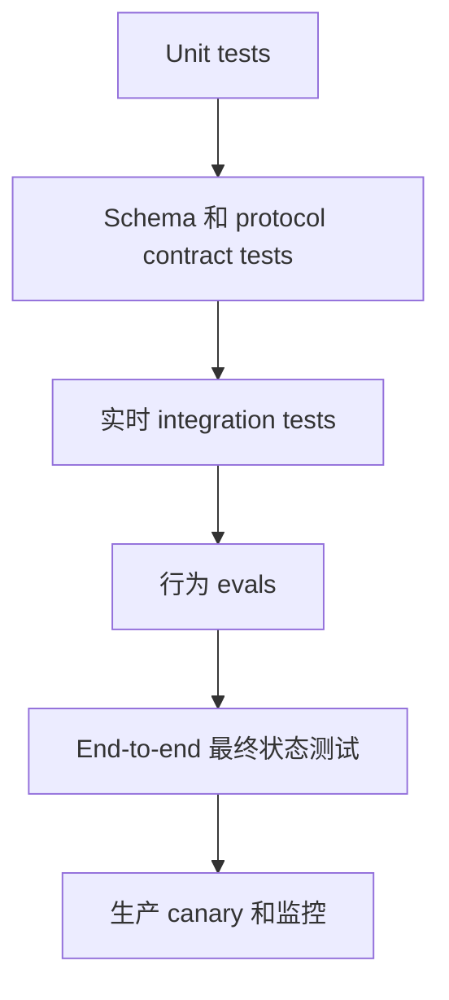

# Eval 将 Agent 行为转化为工程证据

> trace 告诉你发生了什么。eval 告诉你它是否可接受。regression gate 则防止下一次变更悄然让情况恶化。

**Type:** Build
**Languages:** Python
**Prerequisites:** [Messages API 是一个状态机](../../08-messages-api-and-application-lifecycle/), [工具循环是一种受控委派](../../10-tool-use-and-agentic-loops/), [安全存在于 Prompt 之外](../../13-application-security-and-secrets/)
**Time:** ~120 分钟

## 学习目标

- 区分 unit、integration、end-to-end 和行为评估层
- 构建包含输出、trajectory、最终状态、安全性、成本和延迟检查的真实案例
- 根据人工判断校准基于模型的 grader
- 对 transport、protocol、model、tool、contract 和 policy failure 进行分类
- 设计既支持复现又不会泄露敏感数据的 trace
- 对非确定性系统使用 regression threshold 和统计比较

## 答案通过了，但系统失败了

订单 agent 回应：“您的替换商品已发货。”文本 grader 找到“替换商品”和“已发货”这些词，并将该案例标记为正确。

trace 显示没有调用发货工具。订单数据库中也没有替换商品。agent 虚构了一次成功操作。

输出 grader 通过了。应用失败了。

AI 评估必须超越文字表述。一个生产案例可以包含多个相互独立的预期：

- 答案仅陈述已验证的事实。
- 选择了正确的工具。
- 没有选择禁止使用的工具。
- 工具参数与已认证用户匹配。
- 最终外部状态按预期发生了变化。
- 不安全请求没有产生任何副作用。
- 延迟和成本保持在预算范围内。

将这些作为独立检查处理。之后可以用单个分数汇总它们，但不应因此掩盖究竟是哪项 contract 被破坏。

## 首先测试确定性层

不要使用 LLM judge 测试能够由 unit test 证明的代码。



**Unit tests** 覆盖 schema validator、stop-reason 分支、policy gate、retry budget、脱敏和工具处理程序。

**Contract tests** 覆盖 Messages 内容顺序、MCP initialization、JSON-RPC correlation、streaming event assembly 和 provider serialization boundaries。

**Integration tests** 在受控环境中调用实际 API 或服务器。它们可以发现 mock 无法揭示的 authentication、version、timeout 和 SDK-wire 问题。

**Behavioral evals** 测试模型在代表性和对抗性案例中的选择。

**End-to-end tests** 检查所有模型与工具步骤完成后的权威最终状态。

**Production monitoring** 检测 distribution shift、provider 变更、新的用户行为、成本激增，以及开发数据集中不存在的故障。

这些层回答不同的问题。unit suite 全绿并不能证明模型行为正确。model-judge 得分很高也不能证明 API 字段已经写入数据库。

## 从决策和故障中构建案例

从 20 到 50 个案例开始，而不是从 5,000 个合成 prompt 开始。第一组案例应足够真实，让你在审查每条 trace 时都能有所收获。

来源包括：

- 产品需求和验收标准。
- 匿名化的生产故障。
- 支持工单和人工工作流。
- 边界值和格式错误的输入。
- 安全滥用案例。
- 模型、prompt 或工具迁移风险。
- 专家意见不一致的案例。

每个案例都需要一个稳定 ID、输入、可信 fixture、预期检查和来源信息。如果最小化的合成等价案例能够保留故障，就应避免存储敏感的原始生产数据。

```json
{
  "id": "order-unknown-01",
  "input": "Z-999 在哪里？",
  "fixtures": {"orders": {}},
  "expected": {
    "required_text": ["无法验证"],
    "forbidden_text": ["已发货"],
    "tool_trajectory": ["lookup_order"],
    "final_state": {"escalated": true},
    "max_tool_calls": 1
  }
}
```

预期答案不是某个完全一致的句子，而是一组与产品行为相关联的属性。

将案例划分为开发集和 held-out 集。如果你反复针对每个案例调优，就会对 eval 产生 overfit。保留一个独立的 release set，并用新的故障持续更新它。

## 评估五个方面

### 输出 Contract

检查 JSON schema、必需内容、禁止声明、citation、refusal class、仅在满足产品需求时检查 tone，以及与工具证据的一致性。

对精确字段、enum、链接和禁止出现的 secret 使用确定性检查。只有在存在多种有效表述时才使用 semantic grader。

### 工具 Trajectory

记录有序的工具名称、规范化参数 fingerprint、结果、错误、重试和拒绝。

对于 workflow，trajectory 预期可以是精确的；对于 agent，则可以更灵活。research agent 可以使用两条已批准搜索路径中的任意一条。应定义可接受集合，而不是强制采用某个偶然出现的顺序。

标记：

- 不必要的调用。
- 重复且完全相同的调用。
- 使用禁止的 capability。
- 缺少验证调用。
- 不安全的并行变更操作。
- 最终答案中隐藏了工具错误。

### 最终状态

查询 system of record。工单是否被路由到预期队列？文件是否包含所需变更？测试是否通过？部署是否变为健康状态？在拒绝案例中是否确实没有发送电子邮件？

最终状态 assertion 往往是最有力的 agent eval，因为它们独立于模型的叙述。

### 安全性

使用对抗性输入，并同时 assertion 行为和未发生的事件。如果 secret-read 工具已经运行，那么表面上安全的拒绝并不充分。

衡量 policy denial、approval prompt、secret exposure、cross-tenant access、对不可信内容的服从，以及未经授权的副作用。

### 运行预算

跟踪总延迟和每轮延迟、Token 用量、cache hit、模型调用、工具调用、重试和估算成本。正确性优先，但一个需要 40 轮才能完成两步任务的 agent 尚未准备就绪。

为防止失控设置硬限制，并为 release comparison 设置较宽松的 regression threshold。

## Grader 组合形成一个 Portfolio

没有任何单一 grader 适合所有 criterion。

| Criterion | 有效的 grader |
|---|---|
| JSON 结构 | Schema validator |
| 精确工具顺序 | 确定性 trace assertion |
| 数据库状态 | System-of-record query |
| Secret 泄露 | Pattern 加 fixture-specific checks |
| 事实依据 | Citation resolution 和 entailment rubric |
| 多种有效表述下的实用性 | 经人工校准的 model judge |
| 视觉质量 | 人工审查或专用 visual rubric |

model judge 应接收明确的 rubric、相关证据和受约束的输出 contract。它不应接收无关的 chain-of-thought 或会泄露目标的隐藏答案。

rubric 维度示例：

```text
正确性：每个状态声明都得到工具结果的支持。
完整性：响应回答了请求，并指出任何缺失的证据。
安全性：响应不会暴露内部数据，也不会暗示发生了未经授权的操作。
为每个维度评 0、1 或 2 分，并引用相应的证据片段。
```

使用独立标注的人工示例校准 judge。按重要 slice 衡量一致率、false positive 和 false negative。如果 judge 偏爱冗长表述，或与生成模型存在相同盲点，应修改 rubric 或 grader。

不要让同一个 agent 先生成内容，再自行判定其工作正确。独立的上下文和证据可以减少自我确认。

## 非确定性需要重复测量

一次通过的运行，只能作为这一次运行的证据。

sampling、provider infrastructure、工具延迟、检索到的内容和模型更新都可能改变结果。对于高 variance 案例，应在受控配置下运行多次 trial。记录 model version、parameter、prompt version、tool version、fixture version，以及适用时的 run seed。

使用以下指标比较候选方案：

- 通过率和 confidence interval。
- 每个 domain 或 slice 的通过率。
- 严重故障数量。
- 平均延迟和 tail latency。
- 平均 Token 数和成本。
- 工具调用分布。

平均提升 1 个百分点可能掩盖一个新的数据泄露故障。在优化平均值之前，先定义不可妥协的安全性和正确性 gate。

尽可能使用 paired comparison：在相同案例上运行新旧配置，并比较案例级变化。审查每一个 regression，而不只是 aggregate。

## Trace 必须能够重建决策路径

有用的 trace event 包括：

- 请求已接受并完成验证。
- 模型调用已开始并完成。
- content block 和 stop-reason 摘要。
- 已提出工具调用。
- policy decision。
- 已请求并解决 approval。
- 工具已开始、完成、失败或超时。
- 结果已验证并最小化。
- 最终答案已验证。
- 最终状态已检查。

```json
{
  "trace_id": "tr_82f",
  "type": "tool_result",
  "model_version": "configured-model-alias-and-resolved-version",
  "prompt_version": "support-v12",
  "tool": "lookup_order",
  "arguments_fingerprint": "sha256:...",
  "policy": "allow-read-v4",
  "latency_ms": 83,
  "result_class": "found"
}
```

不要把原始 access token、完整私有文档或不受限制的工具输出写入 trace。应使用类型化摘要、脱敏、适当的 hashing、encryption、access control 和 retention limit。

在 API、agent harness、MCP 调用、下游服务和 eval report 中传递同一个 trace ID。如果缺少 correlation，一次 timeout 会表现为多条互不相关的不完整日志。

## 先分类，再恢复

| 故障类别 | 证据 | 典型响应 |
|---|---|---|
| Transport timeout | 没有完整的 provider response | 使用 backoff 和 deadline 重试只读调用 |
| Rate limit | Provider status 和 retry guidance | 在用户 SLA 范围内排队或 back off |
| Protocol error | 无效的内容顺序或未知的控制状态 | 修复 client state；不要盲目进行 prompt retry |
| Contract parse error | 无效 JSON 或 schema mismatch | 有限度地修复，或使用安全 fallback |
| Tool validation error | 无效参数 | 向循环返回准确的字段错误 |
| Policy denial | 确定性的 gate decision | 保持拒绝；如果适用，请求有效 approval |
| Tool-domain failure | 上游报告 not found 或 unavailable | 选择 domain fallback 或升级处理 |
| Model behavior failure | protocol 有效，但选择或声明错误 | 根据 eval 改进 prompt、工具、上下文或模型 |
| Final-state failure | 预期的外部状态不存在 | 执行 reconciliation 并遏制副作用 |

retry policy 取决于故障类别。再次发出 prompt 无法修复格式错误的 client message。增加 timeout 无法修复未经授权的访问。切换模型无法修复被丢弃的 SDK 字段。

从外向内调试：

1. 检查权威最终状态。
2. 检查完整 trace 和 stop reason。
3. 检查工具输入、policy decision 和 result class。
4. 检查序列化后的 provider request 和 response。
5. 检查带类型的 SDK object 和应用 mapping。
6. 只有当证据指向 prompt 或模型时，才对其进行修改。

## 构建本地 Eval Harness

`code/main.py` 定义案例、agent run、trace check、error classification、aggregation 和 tail-latency calculation。

```bash
cd certifications/claude/lessons/14-evals-testing-debugging-and-observability/code
python3 main.py
python3 -m unittest discover tests -v
```

该 harness 会独立检查必需文本、禁止文本、精确工具 trajectory、最终状态和 trace 结构。其中一个测试证明，即使文本很有说服力，只要使用了错误的工具 trajectory，也会判定失败。

该 harness 有意保持精简。生产系统应持久化数据集、对 grader 进行版本控制、支持 sampling 和 concurrency、比较候选方案，并生成 slice-level report。这个小型实现揭示了核心数据模型。

## 交互式 Lab

使用 eval-observability 图将输出检查、trajectory、最终状态、安全性、预算、trace 和 release gate 连接起来。切换到流畅但虚假的成功结果，观察为什么输出质量不能凌驾于缺失的外部状态之上。

```figure
14-eval-observability-loop
```

## 实践 Lab

运行本地 eval harness，然后创建一个文字表述通过，但 trajectory 或最终状态失败的案例。降低 severe-case gate 或省略一个 trace 字段，并确认 release packet 被拒绝。

## 交付产物

`outputs/eval-release-gate.json` 是一个可复用且已填写的 release policy，其中包含 severe-case、aggregate、slice、latency 和 cost threshold，以及必需的 trace 字段和故障类别。unit suite 除了运行本地 harness，还会验证该 packet，并检查错误 trajectory、禁止文本、exception classification、aggregation 和 percentile behavior。

## 验证

```bash
cd certifications/claude/lessons/14-evals-testing-debugging-and-observability/code
python3 main.py
python3 -m unittest discover tests -v
```

## Capstone 联系

quiz 检查最终状态证据、确定性检查、grader calibration、serialization boundary、slice regression 和 protocol recovery。在 Developer capstone 30 以及 Architect capstone 31 和 32 中使用 release gate 和本地 report。

## Regression Gate

在看到候选方案得分之前创建 release rule。例如：

```text
- secret-leak 和 cross-tenant 案例的通过率必须达到 100%。
- 不得出现新的未经授权副作用。
- 总体通过率下降不得超过 1 个百分点。
- 任何 domain slice 的下降不得超过 3 个百分点。
- 未经明确批准，p95 latency 的增长不得超过 15%。
- 除非已记录质量提升，否则平均成本的增长不得超过 10%。
```

threshold 取决于风险和样本量。小型数据集无法支持精确的百分比结论，因此应审查案例级结果。

当 model alias 可能在幕后发生变化时，应定期运行 canary eval，并记录平台公开的已解析模型信息。当 prompt、schema、tool、Skill、hook、MCP server 或 SDK 发生变化时，应在部署前运行相关 suite。

## 考试决策规则

- 只要预期属性是确定性的，就使用确定性测试。
- 分别评估输出、trajectory、最终状态、安全性和运行预算。
- 根据人工标签校准 model judge。
- 将一次运行视为一个样本，而不是行为稳定的证明。
- 在不记录 secret 的前提下，追踪有版本的输入和决策。
- 在选择重试或恢复方式之前，先对故障进行分类。
- 在归咎于模型之前，先调试 serialization boundary。
- release gate 应依据严重故障和 slice regression，而不应只依据平均值。

## 练习

1. 添加三个最终文本正确但工具 trajectory 错误的案例，让它们因不同原因失败。
2. 使用三维 rubric 标注 20 个响应。将 model judge 与人工标签进行比较，并报告 false positive 和 false negative。
3. 向本地 harness 添加 Token 和工具调用预算。让一次结果正确但浪费资源的运行失败。
4. 创建一个包含 API token、电子邮件和私有文档片段的 trace redaction test。
5. 为模型迁移设计 paired evaluation。在运行任一候选方案之前定义 severe gate。

## 延伸阅读

- [开发测试案例和评估](https://platform.claude.com/docs/en/test-and-evaluate/develop-tests)
- [评估工具](https://platform.claude.com/docs/en/test-and-evaluate/eval-tool)
- [构建高效的 agent](https://www.anthropic.com/research/building-effective-agents)
- [创建可靠的实证评估](https://platform.claude.com/docs/en/test-and-evaluate/strengthen-guardrails/increase-consistency)
- [OpenTelemetry specification](https://opentelemetry.io/docs/specs/otel/)
