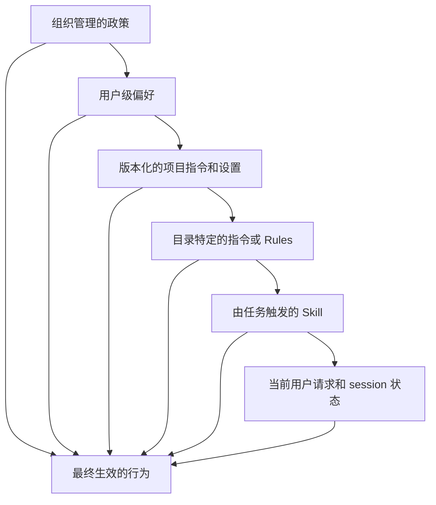

# Claude Code 通过共享约束实现规模化协作

> 团队不需要一个巨型 Prompt。它需要一份精简的项目契约、可复用的流程、确定性检查和版本化配置。

**Type:** Learn
**Languages:** Python
**Prerequisites:** [Agent SDK 是执行框架，而不是权限](../../12-claude-agent-sdk-and-hooks/), [Evals 将 Agent 行为转化为工程证据](../../14-evals-testing-debugging-and-observability/)
**Time:** ~170 分钟

## 学习目标

- 设计一份可用于项目入门的精简 `CLAUDE.md`
- 将指令、设置、Rules、Skills、agents、hooks 和 MCP 配置放在正确的作用域
- 在不丢失审批边界的情况下使用 permission modes、Context 恢复、goals、loops、worktrees 和 schedules
- 对 Model、Prompt、plugin 和团队配置变更进行版本管理
- 将 Claude Code 作为受约束的贡献者集成到 CI 中，而不是未经审查的部署者
- 通过产物、测试、traces 和恢复点评估团队工作流

## 900 行的指令文件

某个团队把每一次纠正都添加到 `CLAUDE.md` 中。它包含架构历史、API 文档、风格偏好、发布步骤、安全规则、示例、故障排除方法以及特定任务的操作手册。

Claude 每个 session 都会读取它。重要命令与过时说明争夺 Context。开发者不再审查变更，因为这个文件太大了。其中一行旧指令要求使用已经弃用的测试命令，导致 Agent 反复运行错误的测试套件并报告成功。

这个团队并没有创建 memory，而是制造了 Context 债务。

`CLAUDE.md` 应当像一份精准的入门脚本：说明这个 repository 是什么、如何浏览它、如何构建和测试它、哪些约束并不显而易见，以及更深入的文档位于何处。

## 将信息放在最窄且持久的作用域

Claude Code 可以从多个作用域加载配置和指令。确切的层级和文件名属于产品细节，但设计原则是稳定的：宽泛政策应放在宽泛作用域中，项目事实应放在 repository 中，任务流程则只应在相关时加载。



项目任务不应轻易削弱宽泛控制。狭窄范围的指令也不应被复制到全局。请查阅当前的 [Claude Code settings](https://code.claude.com/docs/en/settings) 和 [Memory](https://code.claude.com/docs/en/memory) 文档，了解已安装版本中准确的优先级、托管政策位置、imports 和发现行为。

当不同来源发生冲突时，应明确展示优先级。不要依赖两句互相矛盾的话，然后寄希望于 Model 会选择更安全的一句。

## 编写精简的 CLAUDE.md

从 Claude 会反复需要的事实开始：

```markdown
# Repository 指南

## 用途
这个 repository 是一个用于分派支持工单的 Python 服务。

## 命令
- 安装：`python3 -m venv .venv && .venv/bin/pip install -r requirements.txt`
- 聚焦测试：`python3 -m unittest discover tests -v`
- 完整验证：`./scripts/validate.sh`

## 布局
- `src/`：应用代码
- `tests/`：单元测试和集成测试
- `docs/architecture.md`：边界和决策记录

## 约束
- 绝不提交凭据或 `.env` 文件。
- 除非任务明确要求变更，否则应保持公共 API 兼容性。
- 部署或发送外部消息之前必须获得明确批准。
```

应包含：

- 用途和技术栈。
- 规范的构建、测试、lint 和运行命令。
- 重要目录映射。
- repository 特定的风格或架构规则。
- 安全边界和公开操作边界。
- 指向更深入权威文档的链接。

应排除：

- Claude 已经知道的通用建议。
- 完整的 API 参考资料。
- 临时任务状态。
- secrets 或环境值。
- 仅由某个专用工作流使用的指令。
- 未被强制执行或审查的规则。

从小处开始。当同一个问题在多个 session 中反复得到纠正时，判断它究竟应放入 `CLAUDE.md`、Rule、Skill、hook、测试，还是实际代码中。对于“始终运行 formatter”这一要求，最强的修复方式可能是 post-edit hook 和 CI 检查，而不是再添加一句话。

## Rules、Skills、Commands 和 Agents

这些界面解决不同的问题。

### Rules

对于适用于某类文件或 repository 某个区域的约束，使用 Rules 或目录作用域指令。编辑数据库迁移时，前端规则不应占用 Context。

让每条规则保持连贯且可测试。说明执行机制和唯一事实来源。避免在根目录文件和目录文件中重复相同指令，因为内容漂移将不可避免。

### Skills

Skill 将可复用流程、参考资料、脚本和资源打包在一起。它的简短描述可以帮助 Claude 决定何时加载完整内容。

数据库迁移审查、发布说明生成、安全威胁建模或内部文档风格等工作适合使用 Skill。保持核心 session Prompt 精简。将 Skill 与 repository 一同进行版本管理，或者通过经过批准的分发机制管理。

渐进式披露才是其优势。一个始终加载并包含整本手册的 Skill，只不过是另一个 system prompt。

### Commands

Commands 提供由用户明确调用的工作流。当开发者需要主动启动 `/release-check` 或 `/review-migration` 等操作时，它们非常适用。

将 command arguments 视为不可信输入。Command 不会绕过 Tool 授权或审批。

### Agents

自定义 agents 或 subagents 定义隔离的角色、Tool 集合和指令。它们适用于独立审查、狭窄领域的专业工作，或具有独立所有权的并行工作。

只读 reviewer 不应继承编辑和部署 Tool。如果独立性非常重要，generator 和 evaluator 不应共享隐藏的推理过程。

产品说明，核验日期 2026-08-09：确切的文件系统位置、frontmatter fields、command 行为和 agent 配置会不断演变。请使用当前的 [Claude Code 文档](https://code.claude.com/docs/en/overview)，并为 repository 中的示例标注其目标版本。

## Settings 就是代码

团队 settings 控制权限、环境、hooks、Model 行为、MCP servers、plugins 和其他产品能力。应像审查生产代码一样审查它们。

区分不同作用域：

- 组织政策用于不可协商的限制。
- 提交到 repository 的项目 settings 用于共享的安全默认值。
- 本地 settings 用于不应提交的机器特定路径或实验。
- 环境变量用于 secret 名称和部署特定值。

绝不要在 settings 中提交 Token。绝不要假设 deny pattern 就是 sandbox。应使用无害 fixtures 测试权限行为。

变更 settings 时：

1. 说明预期行为。
2. 固定或记录相关 Claude Code 版本。
3. 添加聚焦的验收测试或手动验证脚本。
4. 分别运行一个被拒绝的操作和一个被允许的操作。
5. 审查最终合并生效的配置。
6. 提供回滚指令。

settings 文件能够被解析，并不能证明已安装版本支持其中的每一个 key。

## Permission Modes 设定基线

Permission mode 控制 Claude 提出 Tool call 时会发生什么。它不会改变 repository 政策、授予凭据，也不会让外部操作变得可逆。

产品说明，核验日期 2026-08-09：当前 Claude Code 文档包含以下确切的 modes。它们是否可用以及 UI labels 会因产品界面、方案、provider、Model、管理员政策和已安装版本而异。

| Mode | 实际边界 | 合适用途 |
|---|---|---|
| `default` | 读取可以继续；编辑和命令可能触发提示 | 首次使用、敏感 repository |
| `acceptEdits` | 文件编辑和常见文件系统操作可以继续；其他命令仍会触发提示 | 结合 diff 审查的本地代码迭代 |
| `plan` | 可以读取和探索；在 auto mode 可用时，经 classifier 批准的命令可以运行，但源码编辑仍会被阻止 | 先批准范围和方法 |
| `auto` | 由独立 classifier 评估操作；明确的 ask controls 仍可触发提示 | 在可信方向上进行 research-preview 自主操作 |
| `dontAsk` | 所有原本会触发提示的操作都被拒绝；只有预先批准的工作可以继续 | 严格受限的 CI 和脚本 |
| `bypassPermissions` | 绕过内置权限检查；配置的 deny、ask 和用户交互控制仍然有效 | 不含有价值凭据的隔离 container 或 VM |

在支持的环境中，可以对 session 使用 `--permission-mode <mode>`，或使用 `permissions.defaultMode` setting。随后，权限规则通过 `deny`、`ask` 和 `allow` patterns 进一步限制 calls。显式 deny 和 ask 规则、组织 connector controls，以及所需的用户交互会在所有 modes 下执行，包括 `bypassPermissions`。硬边界应放在 deny rule、sandbox、凭据作用域、branch protection 或 hook 中，而不是写在一句可能被 auto-mode transcript 后续压缩掉的话里。

`acceptEdits` 的含义仅仅是编辑所需的确认步骤更少。它不会自动接受发布、部署、任意 shell 命令或消息。`auto` 是 research preview，而不是安全证明。普通 laptop 上不适合使用 `bypassPermissions`，仅仅因为 session 位于 Git worktree 中也不足以成为使用它的理由。

## Hooks 将建议转化为检查

将 hooks 用于确定性的生命周期操作：

- 在 Tool 执行前阻止读取 secret 路径。
- 阻止向受保护 branch 提交。
- 外部写入前要求批准。
- 编辑后格式化变更文件。
- 代码变更后运行聚焦测试。
- 对 Tool 输出进行脱敏。
- 记录审计事件。
- 在必要检查产生证据之前阻止任务完成。

保持 hooks 快速。缓慢的 hook 会反复运行并严重影响交互延迟。使用 timeouts，并明确失败行为。安全 hook 无法评估请求时应采取封闭式失败。

Claude Code 以 JSON 形式传递 hook 输入。command hook 有两条不同的控制路径：

- 以 `0` 退出，并向 stdout 输出一个 JSON object，以进行结构化控制。
- 以 `2` 退出，并向 stderr 输出原因，以执行特定于事件的阻止操作。

不要将二者混用。Claude Code 只在退出码为 `0` 时处理结构化 JSON；退出码为 `2` 时输出的 JSON 会被忽略。对于大多数事件，退出码 `1` 表示非阻塞错误，因此政策 hook 不能依赖普通 Unix 失败语义。

`PreToolUse` 和 `PermissionRequest` 使用的输出结构也不同。`PreToolUse` hook 可以通过 `hookSpecificOutput.permissionDecision` 执行 allow、deny、ask 或 defer：

```json
{
  "hookSpecificOutput": {
    "hookEventName": "PreToolUse",
    "permissionDecision": "deny",
    "permissionDecisionReason": "发布操作需要由人类控制的工作流"
  }
}
```

`PermissionRequest` hook 只在 Claude Code 即将提示用户，或者由于无法提示而不得不拒绝时运行。它使用嵌套的 decision object：

```json
{
  "hookSpecificOutput": {
    "hookEventName": "PermissionRequest",
    "decision": {
      "behavior": "deny",
      "message": "外部发布需要人类进行交互式批准",
      "interrupt": false
    }
  }
}
```

allow decision 无法覆盖匹配的 deny 或 ask rule。退出码 `2` 会阻止 `PreToolUse` call 并拒绝 `PermissionRequest`，但不同事件的行为有所不同：例如，`PostToolUse` hook 在操作完成后运行，因此无法撤销操作。在将任何 hook 视为强制执行机制之前，请先阅读事件表。

适当时，将共享 hooks 存放在经过审查的项目代码中，但要确保受约束的 Agent 无法悄悄改写政策，然后执行被禁止的操作。组织控制、repository 权限和 sandbox 边界必须保护 hook 层。

## MCP 和 Plugins 是已安装的能力

MCP server 或 plugin 可以添加 Tools、Prompts、hooks、agents、Skills、commands 或语言智能。安装操作会改变攻击面和 Context 范围。

团队审查应涵盖：

- 发布者和源码 repository。
- 确切版本和更新政策。
- 安装的组件。
- Tool 和文件系统权限。
- 网络目标地址。
- 请求的 secrets 和环境变量。
- 在 headless 或 CI 环境中的行为。
- 卸载和回滚步骤。

优先使用小型的批准目录。在支持的情况下固定版本。在具有代表性的 repository 和 eval set 上测试升级。不要为了使用一个本可通过已审查的本地 Skill 实现的小流程，而安装一个大型 plugin。

Plugins 和 MCP 并不能互相替代。MCP 对外部能力连接进行标准化。plugin 对 Claude Code 扩展进行打包。Skill 承载流程和辅助材料。应根据需求做出选择，而不是根据机制的流行程度做出选择。

## Sessions 需要严格的恢复纪律

Claude Code sessions 可以帮助开发者恢复工作、创建调查分支并保留本地 Context。Session 历史并不是系统的事实来源。

恢复会产生重要后果的工作之前：

- 检查当前 Git status 和 diff。
- 重新运行相关测试。
- 核对外部副作用。
- 确认 branch 和 repository root。
- 审查待处理的批准。
- 检查指令、Tools 或 Model 配置是否发生变化。

当累积的 Context 产生漂移，或正在跨越 tenant 或保密边界时，应清除当前 session 或启动新 session。使用 compaction 保持连续性，但不要把它当成所有约束都得以保留的证明。

当 repository 政策允许时，提交小型恢复点。Session summary 无法取代源代码控制。

不同的 session commands 适用于不同任务：

| Mechanism | 效果 | 使用时机 |
|---|---|---|
| `/context` | 显示哪些内容正在占用 Context window | 诊断 memory、skills、tools 和消息膨胀 |
| `/compact [focus]` | 用聚焦的 summary 替换此前的 conversation | 使用更少历史记录继续同一任务 |
| Automatic compaction | 接近限制时清除旧 Tool 输出，然后生成 summary | 普通长 session 的连续工作 |
| `/clear` | 启动空 conversation；旧 conversation 仍可恢复 | 切换到不相关的工作或新的信任边界 |
| `/rewind` 或连按两次 `Esc` | 从 checkpoint 恢复代码、conversation，或对其进行总结 | 恢复受跟踪的编辑，或移除错误的 conversation 分支 |

Compaction 可能丢失普通 transcript 指令。项目根目录的 `CLAUDE.md` 和 auto memory 会重新加载，而路径作用域的 rules 会在再次读取匹配文件时重新加载。将持久约束放入版本化配置中，并在 compaction 后重新说明当前验收边界。

Rewind 是便捷功能，不是源代码控制。它会跟踪 Claude Code 直接执行的文件编辑，但不会跟踪 shell commands、外部系统或大多数 subagents 所做的变更。使用 `context: fork` 运行的前台 Skills 是例外：它们的直接编辑会被跟踪。在重试操作前，检查 Git 和外部状态。

## 不同的 Autonomy 具有不同的停止条件

不要将每一种重复工作流都视为相同的 loop。

### Goal Sessions

`/goal <condition>` 会在上一轮结束时启动新一轮，直到一个独立的 small-model evaluator 判定条件已满足。evaluator 读取 conversation 中的证据；它不会独立运行测试或检查文件。应说明可测量的结果、用于证明结果的命令，以及必须始终满足的约束。时间或轮次条款对 evaluator 可见，但它并不是硬性运行时限制；硬限制应在 goal session 外部执行。

```text
/goal tests/auth 以状态码 0 退出且 lint 无错误，不得修改 fixtures，否则在 15 轮后停止
```

一个 session 中只能有一个活跃 goal。`/goal clear` 会停止它。goal 不会改变权限，因此 default mode 仍可能触发提示。将 goal 与 auto mode 配合可以减少普通提示，但显式 ask controls 仍可触发提示。这也更需要隔离环境、deny rules、budgets 和可观察证据。

### Session 内 Loops 和定时 Prompts

`/loop 5m check whether CI finished` 会在当前 CLI session 保持打开时安排一个 Prompt。如果没有固定间隔，Claude 可以选择下一次延迟时间。这些任务继承 session 的 Tools 和权限，在不同轮次之间运行，并不属于持久化的作业基础设施。

请选择正确的持久化调度器：

- 对于保存的 Prompt、选定的 repositories、connectors，以及 schedule、API 或 GitHub trigger，使用 cloud Routine。Routines 是 research preview，并且会在没有批准提示的情况下自主运行，因此应移除所有未使用的 connector，并严格限制 branch 权限。
- 当机器和本地未提交文件属于预期边界时，使用 Desktop scheduled task。
- 当 trigger 和权限应存在于经过审查的 repository workflow 配置中时，使用 GitHub Actions。

`/schedule` 会在可用时创建或管理 cloud Routines。产品 flags、limits、账户资格和确切的调度行为都对版本敏感；持久的设计应包含自足的 Prompt、明确的成功条件、最小身份权限和可审计结果。

## 并行工作需要隔离文件

即使两个 agents 的 Prompts 指定了不同任务，它们编辑同一个 checkout 时仍可能相互覆盖。请在 worktrees 中启动独立的 Claude Code sessions：

```bash
claude --worktree auth-hardening
claude --worktree docs-refresh
```

当前 Claude Code 默认会在独立的 `worktree-<name>` branch 上创建 `.claude/worktrees/<name>/`。为每个 session 指定 owner、文件边界、验收测试和集成契约。自定义 subagent 需要并行编辑时，可以声明 `isolation: worktree`。

Worktrees 会隔离工作文件和 branches。它们共享 repository Git metadata、项目 plugins 和已保存的权限批准，但不会隔离网络、凭据、数据库或其他副作用。在将运行称为已隔离之前，应审查这些共享界面。通过正常 Git 审查进行集成，而不是在活跃 checkouts 之间复制文件。

## Managed Review 与 GitHub Action 并不相同

产品说明，核验日期 2026-08-09：Anthropic 托管的 Code Review GitHub integration 是面向 Team 和 Enterprise 方案的 research preview。它会针对 pull requests 运行一组专用 agents，并可以添加带有严重性标签的 inline findings。它能够读取 `CLAUDE.md` 和 `REVIEW.md` 作为审查指导。它的 findings 不会批准或阻止 pull request；branch protection 和确定性检查仍然决定 merge gate。

官方 `anthropics/claude-code-action@v1` 会在你自己的 GitHub Actions workflow 中运行 Claude Code。它可以响应经过授权的 `@claude` mention，也可以根据 repository events 和 cron schedules 运行固定 Prompt。workflow 控制 checkout depth、GitHub token permissions、secret source、Tools、settings、Model 和轮次限制。

```yaml
name: bounded-claude-review
on:
  pull_request:
    types: [opened, synchronize]
permissions:
  contents: read
  pull-requests: read
  id-token: write
jobs:
  review:
    runs-on: ubuntu-latest
    steps:
      - uses: actions/checkout@v6
      - uses: anthropics/claude-code-action@v1
        with:
          anthropic_api_key: ${{ secrets.ANTHROPIC_API_KEY }}
          prompt: "审查这个 pull request，只输出有证据支持的 findings。"
          claude_args: "--max-turns 6 --allowedTools Read,Grep,Glob"
```

将凭据保存在 GitHub Secrets 或 workload identity 中，只授予必要的 workflow 权限，并在 merge 前审查所有变更。需要更严格供应链固定策略的组织，可以将 actions 固定到经过审查的 commit SHA，同时跟踪文档所述的主版本。

## 在 CI 中使用 Headless Claude Code

Headless 执行可以在自动化中分析代码、生成结构化输出或提出 patches。它也移除了通常能够发现危险请求的交互式人工参与者。

将 CI 用例设计为受约束的作业：


控制措施包括：

- 最小化 repository 和 Token 权限。
- 不得访问无关的 secrets。
- 固定依赖和配置。
- 网络 allowlist。
- 轮次、时间和成本限制。
- 结构化输出 schema。
- 产物和 trace 保留。
- 不得直接 push 到受保护 branch。
- 在 merge、部署、发送消息或发布 issue comments 前进行人工审查。

使用短期自动化凭据。将 pull request 文本和 repository 文件视为不可信内容。不要向评估不可信贡献的作业暴露高权限 Token。

当前的 headless flags、结构化 streaming modes 和权限选项会不断变化。请查阅已安装 CLI 对应的官方 [Headless mode](https://code.claude.com/docs/en/headless) 文档。在你自己的 repository 中为命令示例标注版本。

## 从 Plan 到证据的团队工作流

一个可靠的开发循环如下：

1. Claude 读取精简的项目契约。
2. 它检查相关代码，并在大范围编辑前编写 plan。
3. 当选择会产生外部影响时，由开发者确认范围。
4. Claude 进行小型且连贯的变更。
5. Hooks 执行格式化和聚焦检查。
6. Claude 检查失败并修复根本原因。
7. 构建出的产物能够端到端运行。
8. 独立审查检查 diff 和证据。
9. 正常的源代码控制保护机制管理 merge 和部署。

对于视觉变更，应运行真实构建并检查 screenshots。对于 APIs，应检查真实传输数据和序列化结果。对于 CLIs，应运行构建后的产物。当这些证据要求是 repository 特定要求时，团队指令应明确说明。

## 对所有会改变行为的内容进行版本管理

记录：

- Claude Code 版本。
- Model 配置或 alias。
- 根目录和目录级指令。
- settings 和 hooks。
- Skills、commands、agents、plugins 和 MCP servers。
- 自动化使用的 Prompt 和输出 schema 版本。

其中任意一项发生变化时，都应运行具有代表性的工作流 eval。比较正确性、安全性、轮次、延迟和成本。Model 升级可以改善整体推理能力，同时改变某个关键工作流中的 Tool 选择。

永久固定版本并不是答案。受控升级才是。使用兼容性窗口、canary repositories、回归测试套件和回滚路径。

## 团队配置审查

审查以下假设变更：

```json
{
  "permissions": {
    "allow": ["Bash(*)", "Read(**)"]
  },
  "mcpServers": {
    "company": {
      "command": "npx",
      "args": ["latest-company-server"]
    }
  }
}
```

其中的问题包括：过于宽泛的 shell 和文件系统访问权限、未固定版本的 package、不明确的 server 来源、没有网络边界、没有 secret 方案，以及没有审批政策。能力更强的配置并不会自动成为更好的团队配置。

reviewer 应要求提供能力清单，并将每项权限缩小到实际工作流所需的范围。然后使用真实的已安装版本，分别测试一个被允许的操作和一个被拒绝的操作。

## Interactive Lab

```figure
15-team-agent-loop
```

使用交互式循环，让一个拟议的团队变更依次经历指令、执行、确定性验证、审查和恢复。改变作用域和强制执行控制，观察仅依靠 Prompt 的规则会在何处失去作为可靠团队边界的能力。

## Practice Lab

审计上述假设变更，缩小 shell 和文件系统的权限范围，并定义一个允许 fixture、一个拒绝 fixture，以及一个回滚条件。

## Shipped Artifact

填写完成的 [`outputs/team-configuration-review.md`](../outputs/team-configuration-review.md) 会将审查转化为可复用的能力、权限、Context、autonomy、隔离、调度、强制执行和恢复记录。[`outputs/permission-request-decision.json`](../outputs/permission-request-decision.json) 是一个经过验证的 `PermissionRequest` hook decision，用于拒绝外部发布。

## Verify It

为你的 repository 编辑一个副本，然后运行确定性 verifier：

```bash
cd certifications/claude/lessons/15-claude-code-for-development-teams
python3 code/main.py
python3 -m unittest discover -s code/tests -v
```

verifier 会检查必要的所有权、允许和拒绝 fixtures、版本化配置，以及回滚证据。在你生成证据后，包含六道题的课程 quiz 会检查这些决策规则。

## Capstone Connection

将完成的审查作为团队配置和 CI 控制附录，带入 Developer capstone。

## 考试决策规则

- 保持 `CLAUDE.md` 精简，并聚焦于项目特定内容。
- 将信息放在最窄且持久的作用域。
- 使用 Skills 承载可复用任务流程，使用 hooks 执行确定性生命周期检查。
- 将 settings、plugins 和 MCP servers 视为需要审查的代码和能力。
- 使用 `acceptEdits` 提高编辑速度，使用 `dontAsk` 执行预先批准的自动化，仅在一次性的隔离运行环境中使用 bypass。
- 根据各自不同的恢复用途使用 `/context`、聚焦的 `/compact`、`/clear` 和 `/rewind`。
- 使用证据、权限、时间和成本限制 `/goal`、`/loop`、Routines 和 scheduled jobs。
- 为并行写入者提供独立 worktrees 和明确所有权。
- 将 secrets 保存在受保护环境或 secret-manager 边界内。
- 恢复 session 前核对 Git 和外部状态。
- 为 headless CI 提供最小化的 Tokens、Tools、网络、时间和权限。
- Agent 自动化完成后，仍必须经过正常审查和受保护的 merge 路径。
- 对配置变更进行版本管理和 Evaluation。

## 练习

1. 分别在 `default`、`acceptEdits`、`plan` 和 `dontAsk` 下运行同一个无害编辑；记录哪些边界发生了变化。
2. 对一个 fixture session 执行 compact，然后验证哪些项目、路径和 Skill 指令会重新加载。
3. 为同一个 CI 任务编写一个受约束的 `/goal` 条件和一个独立的 `/loop` Prompt。解释它们停止条件的差异。
4. 启动两个 owner 互不重叠的一次性 worktree sessions，然后通过经过审查的 diff 进行集成。
5. 同时实现一个 `PreToolUse` JSON denial 和一个 `PermissionRequest` denial。分别证明退出码 `0` 和退出码 `2` 的行为。
6. 针对同一个 pull request，比较 managed Code Review 与只读的 `anthropics/claude-code-action@v1` workflow。

## 延伸阅读

- [Claude Code 概览](https://code.claude.com/docs/en/overview)
- [Claude Code memory](https://code.claude.com/docs/en/memory)
- [Claude Code settings](https://code.claude.com/docs/en/settings)
- [Claude Code hooks 指南](https://code.claude.com/docs/en/hooks-guide)
- [Claude Code permission modes](https://code.claude.com/docs/en/permission-modes)
- [Claude Code commands](https://code.claude.com/docs/en/commands)
- [Claude Code checkpointing](https://code.claude.com/docs/en/checkpointing)
- [Claude Code goals](https://code.claude.com/docs/en/goal)
- [Claude Code scheduled tasks](https://code.claude.com/docs/en/scheduled-tasks)
- [Claude Code Routines](https://code.claude.com/docs/en/routines)
- [Claude Code worktrees](https://code.claude.com/docs/en/worktrees)
- [Claude Code managed Code Review](https://code.claude.com/docs/en/code-review)
- [Claude Code GitHub Actions](https://code.claude.com/docs/en/github-actions)
- [Claude Code headless mode](https://code.claude.com/docs/en/headless)
- [Claude Code security](https://code.claude.com/docs/en/security)
- [Agent Skills](https://platform.claude.com/docs/en/agents-and-tools/agent-skills/overview)
