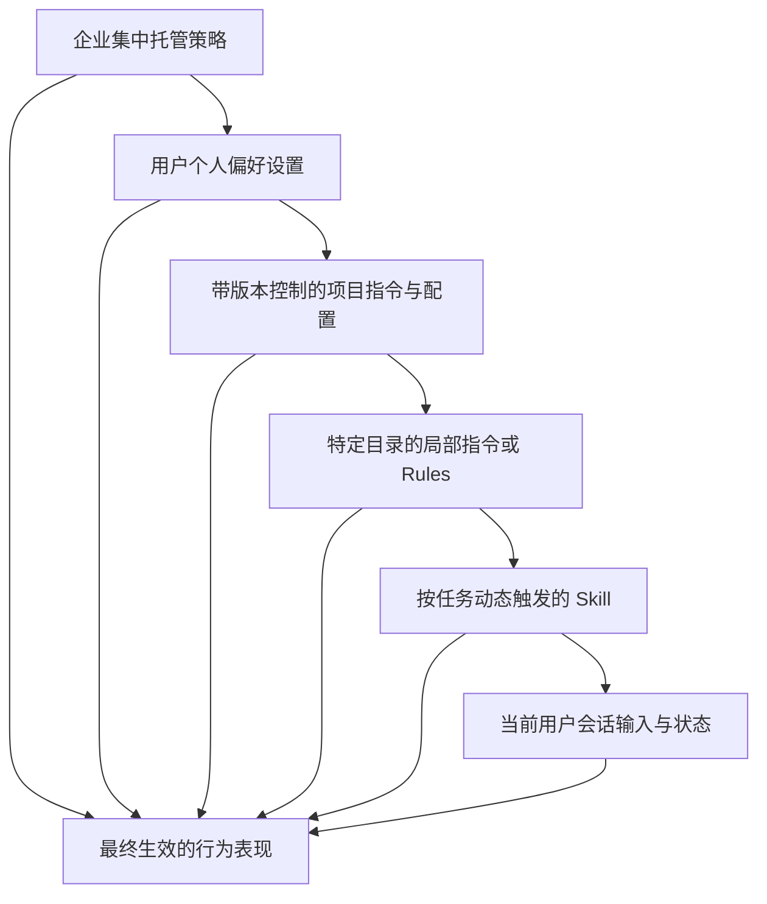

# Claude Code 借助共享约束实现团队规模化应用

> 团队不需要一份 900 行的庞大提示词。团队需要的是精炼的项目契约、可复用的操作规程、确定性的校验门禁，以及版本化的工程配置。

**Type:** Learn
**Languages:** Python
**Prerequisites:** [The Agent SDK Is a Harness, Not Permission](../../12-claude-agent-sdk-and-hooks/), [Evals Turn Agent Behavior Into Engineering Evidence](../../14-evals-testing-debugging-and-observability/)
**Time:** ~170 minutes

## 学习目标

- 设计一份紧凑精炼、能够充当新人入职指南的 `CLAUDE.md` 项目契约
- 将系统指令、配置设置、规则 (Rules)、技能 (Skills)、自定义智能体、Hook 以及 MCP 挂载在最精确的作用域
- 熟练操作权限模式、上下文恢复机制、目标会话、循环、Worktree 以及定时调度，同时严密守住人工审批边界
- 对模型选型、系统提示词、插件以及团队全局配置变更实施严格的版本控制
- 将 Claude Code 作为受限的贡献者平滑接入 CI 自动化流水线，而非缺乏人工审查的任意发布者
- 基于真实产物、自动化测试、执行轨迹以及回滚断点客观评估团队智能体工作流

## 问题背景

一个研发团队习惯性地把每一次对模型的纠偏与补丁通通塞进 `CLAUDE.md`。这份文件逐渐堆砌了架构历史、API 接口文档、代码风格偏好、发版流水线步骤、安全注意事项、调用示例、故障排查手册，以及针对特定任务的操作指南。

最终，文件膨胀到了 900 行。Claude 在每次启动会话时都必须被迫完整阅读它。核心的构建命令与陈旧过时的解释性文本相互争抢上下文窗口。开发者们也因篇幅过于臃肿而放弃了对其变更的人工审查。其中某一行甚至过时地指导模型运行一条早已废弃的测试命令，导致智能体在跑了错误的测试套件后，频繁误报任务执行成功。

团队并没有建立起高效的系统记忆，他们实质上堆积了巨大的“上下文技术债务”。

一份优秀的 `CLAUDE.md` 应当像一份精准精练的新人入职引导说明：明确本仓库是什么、如何快速浏览代码、如何正确编译与运行测试、有哪些不言自明的关键约束，以及更深度的权威文档存放何处。

## 核心概念

### 将信息放置在最窄且持久的作用域 (Put Information at Its Narrowest Durable Scope)

Claude Code 能够从多个不同层级的作用域中加载配置与上下文指令。具体的目录层级与文件命名属于产品实现细节，但底层的架构设计原则高度通用且稳定：全局通用的强安全策略应当置于最宽泛的顶层，具体代码仓库的事实规则应当沉淀在仓库中，而特定任务的操作规程则应当仅在被触发时按需动态加载。


```mermaid
flowchart TB
    Managed[企业集中托管策略] --> User[用户个人偏好设置]
    User --> Project[带版本控制的项目指令与配置]
    Project --> Directory[特定目录的局部指令或 Rules]
    Directory --> Skill[按任务动态触发的 Skill]
    Skill --> Session[当前用户会话输入与状态]
    Managed --> Effective[最终生效的行为表现]
    User --> Effective
    Project --> Effective
    Directory --> Effective
    Skill --> Effective
    Session --> Effective
```

宽泛的高层控制规则绝不能轻易被某个局部项目中的单次任务所弱化；局部的狭窄指令也绝不应无脑复制到全局配置中污染其他项目。在本地安装的具体版本中，请查阅官方关于 [Claude Code 配置设置](https://code.claude.com/docs/en/settings) 以及 [Memory 记忆系统](https://code.claude.com/docs/en/memory) 的权威文档，以掌握精确的优先级继承顺序、企业托管策略路径、导入机制与动态发现行为。

当不同来源的指令发生冲突时，必须使生效优先级透明可见。绝不要依赖两句自相矛盾的自然语言，妄想模型能碰巧猜中并选择更安全的那一个。

### 撰写精简高效的 CLAUDE.md (Write a Lean CLAUDE.md)

专注于记录 Claude 在高频日常工作中反复必需的核心事实：

```markdown
# 仓库开发指南

## 核心定位
本仓库是一个采用 Python 编写的微服务，专门负责客户支持工单的智能分诊与路由。

## 常用命令
- 依赖安装：`python3 -m venv .venv && .venv/bin/pip install -r requirements.txt`
- 定向测试：`python3 -m unittest discover tests -v`
- 全量验证：`./scripts/validate.sh`

## 代码布局
- `src/`：核心应用业务代码
- `tests/`：单元测试与集成测试
- `docs/architecture.md`：架构边界说明与技术决策记录 (ADR)

## 开发约束
- 严禁提交包含机密密钥凭证的 `.env` 文件。
- 必须保持既有公开 API 的向前兼容性，除非明确要求变更契约。
- 在执行发布部署或对外发送消息前，必须强制弹窗请求人工审批。
```

必须收录的关键信息：

- 系统的业务定位与核心技术栈。
- 规范的构建、测试、代码风格检查 (Lint) 以及本地运行命令。
- 核心目录布局与关键模块导航图。
- 仓库专属的特定代码风格规范或架构设计红线。
- 安全底线与涉及外部影响的审批要求。
- 指向更详尽权威文档的超链接引用。

坚决剔除的无关信息：

- Claude 自身已经深刻掌握的通用编程常识。
- 整页复制粘贴的 API 参考手册。
- 临时的阶段性任务推进状态。
- 真实的密钥凭证或敏感生产环境变量值。
- 仅用于某一个极其特定专属工作流的操作步骤。
- 团队从未打算真正执行审查或缺乏自动化手段约束的口头规则。

从小切入。当某项纠偏在多个会话中被频繁重复提出时，首先严谨判断它究竟应当被写进 `CLAUDE.md`、抽象为局部 Rule、提炼为 Skill、编写为生命周期 Hook、补充为单元测试，还是直接在底层代码中做硬性重构。对于“每次编辑代码后务必运行格式化”这类要求，最有效的工程解法是一个执行后 Hook 结合 CI 流水线门禁，而非在文档里多写一句苍白的祈使句。

### 明确 Rules、Skills、Commands 与 Agents 的职责划分 (Rules, Skills, Commands, and Agents)

不同的扩展形态各自服务于截然不同的工程场景：

#### 规则机制 (Rules)

利用 Rules 或目录级配置来约束特定文件家族或仓库特定子模块。一个前端组件规范绝不应在编辑后端数据库迁移脚本时平白无故占用宝贵的上下文窗口。

保持每一条规则内聚且具备可测试性。指明具体的约束机制与权威单一信源。坚决避免在根目录与子目录文件中重复复制相同的语句，否则未来的版本漂移将不可避免。

#### 技能组件 (Skills)

技能组件负责封装可复用的业务规程、参考规范、自动化脚本与静态资产。其简短的前置描述能够帮助 Claude 在规划阶段精准判断何时才需要将其完整内容动态加载进上下文。

适用于数据库迁移审查、发版更新日志起草、安全威胁建模分析，或是公司专属的技术文档编写规范。保持主会话提示词精简专注。将 Skill 连同代码仓库一同进行版本控制，或通过企业受信任的规范源分发。

渐进式披露（Progressive Disclosure）是其核心价值。如果一个 Skill 被设置为全局常驻加载且内部塞入了一整本使用手册，那么它就退化成了一份更糟糕的系统提示词。

#### 斜杠命令 (Commands)

命令提供了由人类开发者显式触发的标准工作流。适用于开发者需要主动发起特定阶段性操作的场景，例如运行 `/release-check` 或 `/review-migration`。

将传入命令的参数视为不受信任的外部输入。调用命令绝不能绕过系统已有的工具鉴权与人工审批门禁。

#### 自定义智能体 (Agents)

自定义智能体或子智能体负责定义物理隔离的角色、专属工具集以及特定系统指令。适用于独立的客观代码审查、狭窄领域的专家任务，或是权责划分清晰的并行协作。

只读的安全审查智能体绝对不应继承写文件与部署发布工具；如果需要保证评审的客观独立性，生成器智能体与评估器智能体之间绝不能共享内部的隐藏思维链。

产品说明（2026-08-09 校验）：具体的文件路径规范、Frontmatter 属性、命令行为以及智能体配置细节会随版本演进。请以最新的 [Claude Code 官方文档](https://code.claude.com/docs/en/overview) 为准，并在仓库示例中显式标注其所适配的版本号。

### 配置文件即生产代码 (Settings Are Code)

团队的配置直接决定了权限范围、运行环境、生命周期 Hook、模型行为、MCP 服务端挂载以及插件生态能力。必须像对待生产核心代码一样对配置文件实施严密的代码审查（Code Review）。

严格划分配置作用域：

- 企业管理策略（Organization policy）：承载全公司非可协商的硬性合规限制。
- 项目全局配置（Project settings）：签入版本控制系统，为全体团队成员提供安全的默认配置。
- 本地私有配置（Local settings）：配置开发机专属的本地路径或个人临时实验，坚决禁止签入版本控制。
- 环境变量（Environment variables）：承载机密变量名称与具体部署环境的动态注入值。

严禁在配置文件中明文提交任何访问 Token。绝不要误以为配置了一条文件名正则黑名单就等于拥有了物理沙箱。使用无害的测试夹具对权限逻辑进行实际拦截测试。

在变更配置设置时：

1. 明确陈述本次变更所期望实现的业务行为。
2. 锁定或显式记录所对应的 Claude Code 具体版本号。
3. 补充针对性的验收测试用例或手动验证脚本。
4. 分别执行一次被允许的合法操作与一次被禁止的违规操作。
5. 审查各层级合并后的最终生效配置。
6. 提供清晰的操作回滚方案。

一份能够被正确解析的 JSON 配置文件，绝不代表当前安装的具体版本支持并落实了其中的每一个属性键。

### 权限模式奠定安全基线 (Permission Modes Set a Baseline)

权限模式用于控制当 Claude 提议发起工具调用时系统的默认拦截行为。它绝不会改变仓库固有的安全策略、不会凭空赋予额外的凭证，更无法让已经发生的外部操作具备可逆性。

产品说明（2026-08-09 校验）：最新的 Claude Code 官方定义了如下精确的权限模式。具体模式的可用性及界面交互标签可能因平台形态、订阅计划、云端模型、管理员策略以及本地版本而存在差异：

| 权限模式 | 实际运行边界 | 最佳适用场景 |
|---|---|---|
| `default` (默认模式) | 只读操作自动放行；涉及修改文件或执行命令时弹窗向用户请求确认 | 初次接触的新仓库、高安全敏感度代码库 |
| `acceptEdits` (接受编辑) | 本地文件修改与常见文件系统操作自动放行；其他系统命令仍会弹窗确认 | 本地快速代码迭代，配合 Git Diff 进行事后审查 |
| `plan` (只读规划模式) | 只读检索与代码浏览自动放行；在支持 auto 模式的环境下可运行经分类器核准的只读命令，但源码写操作坚决被阻断 | 方案设计阶段，优先拉齐任务范围与技术路线 |
| `auto` (自动模式) | 由独立的分类器动态评估动作风险；配置了显式 ask 规则的敏感操作依然会弹窗确认 | 属于研究预览特性 (Research Preview)，适用于方向受信任的探索 |
| `dontAsk` (静默模式) | 凡是需要弹窗请求用户确认的操作一律直接判定拒绝；仅放行预先全量核准的非交互操作 | 严密受限的自动化 CI 流水线与后台无人值守脚本 |
| `bypassPermissions` (绕过权限) | 绕过内置的默认权限确认逻辑；但配置的显式 deny、ask 规则以及必要的用户交互仍然严格生效 | 完全隔离的专用容器或无任何敏感凭据的临时虚拟机 |

在单次会话中使用 `--permission-mode <mode>` 指定，或在受支持的环境中配置 `permissions.defaultMode`。在此基础上，通过细粒度的 `deny`、`ask` 与 `allow` 规则进一步约束工具调用。在包括 `bypassPermissions` 在内的所有模式下，显式配置的 deny 与 ask 规则、企业连接器限制以及强制用户交互始终严格生效。不可妥协的硬性防线必须依托 deny 规则、物理沙箱、凭证权限最小化、分支保护或 Hook 强行落实，绝不能寄托于一句在多轮对话后可能会被模型摘要丢失的自然语言。

`acceptEdits` 的语义非常明确：仅仅是让代码编辑流程更流畅，它绝不代表可以自动发布软件包、自动触发线上部署、自动运行任意 Shell 脚本或自动发送外部消息；`auto` 属于研究预览特性，绝不等于安全证明；而在开发者的日常主力办公电脑上，仅仅因为在一个 Git Worktree 中工作就开启 `bypassPermissions` 是极其不负责任的危险行为。

### 借助 Hook 将口头建议转化为强制门禁 (Hooks Turn Advice Into Checks)

利用生命周期 Hook 落实确定性的自动化动作：

- 在工具实际执行前，直接阻断对敏感机密路径的读取。
- 坚决阻断向受保护的核心分支直接执行 Git Commit。
- 对涉及外部数据变更的写操作强制弹窗要求人工确认。
- 在代码文件编辑完成后，自动触发代码格式化工具。
- 在核心代码变更后，自动触发定向的重点单元测试。
- 对工具返回的原始数据进行敏感信息脱敏。
- 记录结构化的企业安全审计追踪事件。
- 在未提供充分的验证证据前，强制阻止任务宣告完成。

保持 Hook 代码极速轻量。一个执行缓慢的 Hook 会在每一轮交互中反复触发，彻底摧毁实时开发交互体验。必须设置执行超时与清晰的失败判定语义。用于安全拦截的 Hook 当无法正常评估当前请求时，必须坚决执行故障关闭（Fail-Closed）阻断策略。

Claude Code 将 Hook 的输入参数以 JSON 格式传递给脚本。一个命令行 Hook 具有两条截然不同的控制出口：

- 退出码为 `0`，并向标准输出 (stdout) 打印结构化的 JSON 对象，以实施精细化控制。
- 退出码为 `2`，并向标准错误 (stderr) 打印原因文本，以针对当前特定事件执行阻塞中断操作。

切勿将二者混淆。Claude Code 仅在退出码为 `0` 时才解析 stdout 中的结构化 JSON；伴随退出码 `2` 打印的 JSON 会被直接忽略。而在大多数事件中，退出码 `1` 仅代表非阻塞性的常规执行报错，因此安全策略 Hook 绝不能依赖传统 Unix 的非零退出语义。

`PreToolUse` 与 `PermissionRequest` 的输出数据结构有着严格区分。`PreToolUse` Hook 可以通过 `hookSpecificOutput.permissionDecision` 做出 allow、deny、ask 或 defer 的明确决策：

```json
{
  "hookSpecificOutput": {
    "hookEventName": "PreToolUse",
    "permissionDecision": "deny",
    "permissionDecisionReason": "Publishing requires a human-controlled workflow"
  }
}
```

而 `PermissionRequest` Hook 仅在 Claude Code 即将向用户弹出确认框时触发，或者在无法向用户弹窗而不得不拒绝时触发。它采用嵌套的 decision 决策结构：

```json
{
  "hookSpecificOutput": {
    "hookEventName": "PermissionRequest",
    "decision": {
      "behavior": "deny",
      "message": "External publishing requires interactive human approval",
      "interrupt": false
    }
  }
}
```

Hook 判定为 allow 的决策，绝不能覆写既有的显式 deny 或 ask 规则。退出码 `2` 能够强行阻断 `PreToolUse` 调用并拒绝 `PermissionRequest`，但各事件的行为存在物理差异：例如，`PostToolUse` Hook 在动作已经执行完毕后才触发，它根本无法撤销已经产生的物理副作用。在将任何 Hook 视为防御机制前，必须深入查阅事件生命周期规范。

将共享的 Hook 签入经过严格评审的代码仓库中，同时必须确保受限的智能体自身在当前权限下绝无可能静默修改该 Hook 脚本并转而执行违规操作。企业集中管理策略、严格的文件系统权限以及沙箱边界必须对 Hook 脚本形成严密保护。

### MCP 与插件是已安装的能力资产 (MCP and Plugins Are Installed Capability)

接入一个外部 MCP 服务或安装一个插件，能够为智能体直接扩展工具、提示词模板、生命周期 Hook、自定义智能体、Skill 技能、斜杠命令或特定语言的语言服务器（LSP）支持。每一次安装都实质性地扩充了系统的受攻击面与上下文开销。

团队在技术准入评审中必须严格审查：

- 插件发布者背景及其源码托管仓库。
- 锁定的具体版本号与自动更新策略。
- 该插件实际向系统注册的具体组件清单。
- 所索取的工具调用权限与文件系统读写范围。
- 涉及出站通信的外部目标域名。
- 所索要的环境变量与访问机密。
- 在无头交互 (Headless) 或 CI 环境中的行为兼容性。
- 清晰的卸载与事故回滚操作指南。

优先维护一份小而精的企业核准插件目录。在支持的场景下显式锁定版本哈希。在具有代表性的典型仓库与评测集上对插件升级进行先行验证。绝不要仅仅为了使用某一项轻量操作规程而引入庞大的外部复杂插件，这完全可以通过一份经过代码审查的本地 Skill 轻松替代。

插件与 MCP 绝非同义词。MCP 负责跨进程、跨网络规范化外部服务连接；插件负责打包与分发 Claude Code 的扩展功能；而 Skill 则专注于承载特定领域的业务规程与支持物料。根据实际架构痛点进行选型，切勿盲从技术名词的热度。

### 会话管理需要严谨的恢复纪律 (Sessions Need Recovery Discipline)

Claude Code 的会话持久化能力能够帮助开发者平滑恢复工作进度、分叉探索替代方案，并维持本地上下文连续性。但会话历史记录绝非系统的权威单一信源。

在恢复高风险任务之前，必须执行严格的“状态核对纪律”：

- 查看当前的 Git Status 与实际变更的 Diff。
- 重新运行受影响模块的单元测试与集成测试。
- 与外部系统核对是否已经产生了实际的副作用。
- 确认当前所在的代码分支与工作区根路径。
- 重新复核先前尚未履行的审批请求。
- 检查系统提示词、底层工具集或模型配置在此期间是否发生了外部变更。

当多轮对话累积的历史上下文导致模型开始发生语义漂移，或者当前任务即将跨越租户与保密边界时，应当坚决清理当前会话或开启一个崭新的会话。上下文压缩（Compaction）只是为了延续对话连贯性，绝不能作为证明所有约束条件依然完整存活的依据。

在代码仓库策略允许的前提下，小步快跑提交 Git Commit 作为持久的恢复断点。模型生成的会话摘要无论写得多么流畅，都绝对无法替代真实的版本控制系统。

根据业务诉求选用不同的会话管理指令：

| 控制机制 | 产生的实际影响 | 推荐适用场景 |
|---|---|---|
| `/context` | 清晰展示当前究竟有哪些内容在消耗上下文窗口 | 诊断系统记忆、Skills、工具列表以及消息体积的膨胀源头 |
| `/compact [focus]` | 将先前的冗长对话替换为围绕指定焦点的精炼摘要 | 沿着当前任务继续深挖，同时清理冗余历史 |
| 自动上下文压缩 | 自动清理陈旧的工具输出，并在逼近窗口上限时执行摘要 | 日常长效会话的标准平滑延续保障 |
| `/clear` | 开启一个全新的干净对话；旧会话依然保存在本地可被恢复 | 切换至互不相干的新任务，或跨越全新的信任边界 |
| `/rewind` 或双击 `Esc` | 将代码文件、对话状态或摘要平滑恢复至指定的检查点 | 撤销某次受跟踪的文件修改，或砍掉某个失败的对话分支 |

上下文压缩极易丢失分散在早期交互中的细节约束。项目根目录的 `CLAUDE.md` 与自动记忆会被重新全量加载，而基于文件路径匹配的局部 Rules 则会在再次读取相关文件时重新激活。将不可妥协的硬性约束始终固化在带有版本控制的配置文件中，并在压缩执行后向智能体显式重申当前的验收标准。

代码回退（Rewind）只是一层便捷的本地撤销辅助，绝不是版本控制系统本身。它主要跟踪由 Claude Code 直接发起的文件修改，但无法跟踪由 Shell 命令、外部系统或绝大多数子智能体所引入的文件变动（唯一的例外是声明了 `context: fork` 的前台 Skill，其直接编辑会被纳入跟踪）。在重新尝试发起操作前，务必亲自查看 Git 与外部系统的真实状态。

### 自主行为具有截然不同的终止条件 (Autonomy Has Different Stop Conditions)

切勿把所有循环重复的工作流一概而论：

#### 目标会话模式 (Goal Sessions)

`/goal <condition>` 使得 Claude 在前一轮任务结束后自动继续发起下一轮交互，直到一个独立的轻量模型评测器判定该条件已彻底满足为止。需要注意的是：该评测器纯粹是通过阅读对话实录中的上下文凭据做出判定的，它并不会亲自在外部沙箱中独立运行测试或检索真实文件。必须向其提供客观可度量的期望结果、证明该结果的具体测试命令，以及全程必须坚守的不变性约束。在指令中约定的时间或轮次限制对评测器是可见的，但它们并不构成运行时的硬性限制；硬性的轮次与超时限制必须在目标会话外部进行强力配置。

```text
/goal tests/auth 运行退出码为 0 且静态检查 clean，过程中严禁篡改测试夹具，若超过 15 轮则强制停止
```

一个会话中同时只能激活一个目标。运行 `/goal clear` 可主动终止该目标。设定目标并不会自动放宽既有的权限模式，因此在 default 默认模式下系统仍会频繁向用户弹窗请求确认。将目标模式与 auto 自动模式结合使用固然可以削减日常弹窗，但显式配置的 ask 规则依然会严格弹窗拦截。这种高自主度组合极大增加了对独立隔离环境、deny 拦截规则、消耗预算以及可审计客观证据链的刚性依赖。

#### 会话内循环与定时调度提示词 (In-Session Loops and Scheduled Prompts)

`/loop 5m check whether CI finished` 允许在当前终端 CLI 会话保持打开的前提下，定时发起某项周期性任务。由于没有硬编码固定间隔，Claude 可以根据当前上下文自主决定下一次触发的延迟时间。这些循环任务完全继承当前会话的工具集与权限模式，穿插在各轮交互之间执行，但它们绝不构成高可用的持久化作业基础设施。

根据运行边界选用合适的持久化调度机制：

- **云端 Routines (例行任务)：** 适用于配置了预设提示词、特定代码仓库、连接器，并由定时 Cron、API 调用或 GitHub 事件触发的场景。Routines 属于研究预览特性，以全自主方式运行且绝无人工确认弹窗，因此必须剔除一切不必要的连接器，并严格限制其分支写入权限。
- **Desktop 桌面定时任务：** 当任务的物理边界明确依赖开发者本地电脑以及未提交的本地工作区文件时选用。
- **GitHub Actions：** 当触发条件、运行环境与权限策略应当完全托管在经过严格代码审查的仓库工作流配置中时，坚决优先选用。

在支持的环境下，运行 `/schedule` 可直接创建或管理云端 Routines。具体的产品特性、配额上限、账户准入资质以及调度语义会随版本演进；而持久不变的架构核心始终是：自内聚的提示词设计、显式的成功验收条件、最小化的身份权限，以及可被完整审计的客观输出结果。

### 并行开发需要物理隔离的工作区文件 (Parallel Work Needs Isolated Files)

让两个智能体在同一个本地工作副本（Checkout）中并发修改代码，哪怕它们各自接收到的任务风马牛不相及，也极易互相覆写彼此的成果。应当利用 Git Worktree 为独立的 Claude Code 会话开辟完全物理隔离的工作目录：

```bash
claude --worktree auth-hardening
claude --worktree docs-refresh
```

最新的 Claude Code 在默认配置下会自动在 `.claude/worktrees/<name>/` 路径下开辟目录，并切出专属的 `worktree-<name>` 分支。为每一个并行会话分配明确的负责人、文件修改范围、验收测试集以及集成契约。在配置自定义子智能体时，若其确实需要并行修改代码，可为其显式声明 `isolation: worktree`。

Worktree 能够有效隔离本地工作区文件与 Git 分支。但必须清醒认识到：它们依然深度共享仓库底层的 `.git` 元数据目录、项目级插件以及已持久化的权限审批记录；更无法对网络出站、环境变量凭证、外部数据库或第三方服务的副作用实现物理隔离。在宣称任务已实现“完全隔离”之前，必须全面审查这些共享面。最终的代码合并必须通过规范的 Git PR 代码审查流程闭环，严禁直接在两个活跃的工作区之间粗暴复制文件。

### 区分托管代码审查与 GitHub Actions 工作流 (Managed Review and the GitHub Action Are Different)

产品说明（2026-08-09 校验）：Anthropic 官方提供的托管代码审查服务（Managed Code Review）目前属于面向 Team 与 Enterprise 企业计划的研究预览特性。它会在后台调度一组经过专门训练的智能体集群并发审查 Pull Request，并能够在 PR 代码行间自动留下打上严重度标签的内联审查意见。它支持读取仓库中的 `CLAUDE.md` 与 `REVIEW.md` 作为评审规范。需要特别明确的是：其发表的评审意见绝不会直接批准或阻断 PR 的合并；分支保护规则（Branch Protection）与确定性的 CI 自动化检查依然是把控合并准入的最终权力所有者。

而官方开源的 `anthropics/claude-code-action@v1` 则是直接运行在你企业自身的 GitHub Actions 工作流容器之内的。它能够响应经过授权的 `@claude` 评论触发，或者基于特定的仓库事件与定时 Cron 执行预设提示词。工作流配置文件能够完全掌控 Git 检出深度、GitHub Token 权限、敏感凭据来源、开放的工具集、运行配置、模型选型以及最大轮次预算。

```yaml
name: bounded-claude-review
on:
  pull_request:
    types: [opened, synchronize]
permissions:
  contents: read
  pull-requests: read
  id-token: write
jobs:
  review:
    runs-on: ubuntu-latest
    steps:
      - uses: actions/checkout@v6
      - uses: anthropics/claude-code-action@v1
        with:
          anthropic_api_key: ${{ secrets.ANTHROPIC_API_KEY }}
          prompt: "Review this pull request and emit evidence-backed findings only."
          claude_args: "--max-turns 6 --allowedTools Read,Grep,Glob"
```

始终将敏感密钥妥善存储在 GitHub Secrets 或基于 OIDC 的 Workload Identity 中，仅授予工作流所必需的最小权限，并在合并前对所有生成的变更进行人工复审。对软件供应链安全有着更严苛要求的企业，可在跟踪大版本的同时，将 Action 强行锁定到经过审计的具体 Commit SHA 哈希上。

### 在 CI 中以 Headless 无头模式运行 Claude Code (Headless Claude Code in CI)

以 Headless（无头静默）模式运行 Claude Code 能够在无人值守的自动化流水线中深入分析代码、生成结构化合规报表或自动提出代码修复补丁。但这同样意味着失去了平时在终端实时捕捉危险操作的人类驾驶员。

必须将 CI 中的无头执行严格设计为一个受约束的受限任务：


```mermaid
flowchart LR
    Event[Pull Request 事件] --> Checkout[只读或隔离的工作区检出]
    Checkout --> Agent[Headless 模式 Claude Code]
    Agent --> Checks[确定性测试与策略拦截]
    Checks --> Artifact[结构化报告或补丁产物]
    Artifact --> Human[人工复核代码审查]
    Human --> Merge[合入受保护的主分支]
```

核心安全与工程约束：

- 授予最小化的代码仓库读写权限与短期 Token。
- 物理切断对与当前任务无关的一切企业敏感凭据的访问。
- 严格锁定依赖包版本与运行配置。
- 实施严格的出站网络白名单控制。
- 强制设定交互轮次上限、执行超时时间与 Token 成本预算。
- 要求以结构化的 Schema 格式吐出执行成果。
- 持久化保留生成的工件产物与完整追踪遥测日志。
- 坚决杜绝直接向受保护的分支执行 Git Push。
- 在合入主干、触发生产发布、对外发送消息或在 Issue 中公开回复前，必须强制经过人类工程师的把关复审。

采用生命周期极其短暂的自动化服务凭据。视 PR 描述中的文本与仓库中的所有文件为不受信任的外部数据。严禁将持有高危特权的 Token 暴露给一个负责审查不可信外部开源贡献的 CI 作业。

当前的 Headless 命令行参数、结构化流式模式以及权限控制选项会持续演进。请查阅官方关于 [Headless mode](https://code.claude.com/docs/en/headless) 的最新文档，并在自身的代码仓库中对相关命令示例明确标注其生效的具体版本。

### 从任务规划到证据闭环的团队协作流 (Team Workflow From Plan to Proof)

一个成熟高效的团队智能体开发循环应当遵循如下节奏：

1. Claude 仔细阅读精炼的项目契约说明。
2. 在大刀阔斧修改代码前，先行检索并阅读相关模块，并输出一份明确的技术实现方案（Plan）。
3. 当架构方案涉及外部物理影响或对外 API 变更时，人类开发者介入并确认方案边界。
4. Claude 开展小步快跑的针对性代码修改。
5. 触发本地 Hook 自动执行代码格式化并运行定向单元测试。
6. Claude 主动阅读测试报错详情，并针对性定位根本原因并完成修复。
7. 对最终构建出的产物进行完整的端到端本地验证。
8. 独立的审查者结合 Git Diff 与客观运行证据进行综合复审。
9. 通过标准且受保护的版本控制分支流程把控最终的代码合入与生产发布。

针对前端界面样式的修改，必须在本地启动真实服务并审查实际截图；针对后端 API 契约的调整，必须真实抓取物理传输报文并核验序列化结构；针对命令行 CLI 工具的改造，必须在终端亲自运行编译后的二进制产物。当这些验收标准属于特定代码仓库的专有要求时，团队指令集应当显式列出这些证据交付规范。

### 对所有改变系统行为的要素实施版本控制 (Version Everything That Changes Behavior)

在团队可观测性系统中必须完整记录：

- Claude Code 的具体客户端版本号。
- 所配置的模型代号或解析后的真实版本别名。
- 项目根目录与各子目录中的指令配置文件版本。
- 团队配置与生命周期 Hook 脚本的版本。
- 激活的 Skills、命令、自定义智能体、插件以及外部 MCP 服务端版本。
- 自动化流水线中所采用的提示词模板与输出 JSON Schema 版本。

一旦上述任何一个要素发生变更，必须在受控的基准测试集上重新运行一次代表性的工作流评测。全面比对任务准确率、安全拦截表现、交互轮次、端到端延迟以及经济成本。一次云端模型的常规版本微调，完全有可能在通用推理能力显著增强的同时，意外破坏了某个关键特定工作流中的工具选择逻辑。

一味抗拒变化而永远锁定版本并不是理性的工程态度；建立科学有序的灰度升级流程才是正道：划定平滑的兼容过渡窗口、配置企业金丝雀预发仓库、落实全自动化的回归评测套件，并储备万无一失的一键回滚预案。

### 团队配置变更的同行评审示例 (A Team Configuration Review)

审查以下这份由某位工程师提交的技术配置变更 PR：

```json
{
  "permissions": {
    "allow": ["Bash(*)", "Read(**)"]
  },
  "mcpServers": {
    "company": {
      "command": "npx",
      "args": ["latest-company-server"]
    }
  }
}
```

显而易见的严重架构隐患：盲目对所有 Shell 命令与全盘文件系统实行无条件放行；引入了未锁定任何版本的动态 npm 依赖包；服务端源码出处与发布者不明；完全缺乏出站网络隔离限制；未定义机密凭据保护方案；彻底废除了写操作的人工审批门禁。一个功能更强放权更宽的配置，绝不自动等于一份更优秀的团队工程配置。

合格的代码审查员必须坚决驳回该 PR，要求其出具详尽的系统能力盘点清单（Capability Inventory），将各项权限精准收敛至当前具体工作流所需的最小范围，并随后在真实安装的生产版本中，使用真实的合法与违规测试用例分别验证其拦截有效性。

## Interactive Lab (交互式实验)

```figure
15-team-agent-loop
```

通过团队智能体循环交互式图示，演练将一项拟议的团队工程变更，依次推过需求对齐、代码修改、确定性验证、人工复审与回滚机制等完整生命周期。尝试动态调整指令作用域与安全控制强弱，观察在何种临界点下，仅仅依靠自然语言提示词的口头规则将彻底失效并不再构成可靠的团队安全边界。

## Practice Lab (实战演练)

针对上方示例中存在严重隐患的配置变更展开同行安全审计，全面收缩其 Shell 执行与文件系统读写的开放面，并为其编写一组明确定义被允许的合法测试用例与被坚决拦截的违规测试用例，同时附带完备的故障回滚操作条件。

## Shipped Artifact (交付产物)

已填充完成的 [`outputs/team-configuration-review.md`](../outputs/team-configuration-review.md) 产物，将上述审计复盘沉淀为一份可广泛复用的系统能力盘点、权限分配、上下文预算、自主度管控、工作区隔离、任务调度、策略执行以及容灾回滚记录。
[`outputs/permission-request-decision.json`](../outputs/permission-request-decision.json) 则是一份经过严格断言的 `PermissionRequest` Hook 决策范例，展示了系统如何在底层确定性拦截外部未授权的发布动作。

## Verify It (验证方法)

为你的代码仓库修改一份专属副本，随后运行确定性验证脚本：

```bash
cd certifications/claude/lessons/15-claude-code-for-development-teams
python3 code/main.py
python3 -m unittest discover -s code/tests -v
```

验证脚本能够自动核验权责所有者划分、合法与违规测试用例覆盖、版本化配置规范，以及灾难回滚操作凭证。在充分产出客观工程证据后，通过本课配套的六道深度测验题检验你的决策判断能力。

## Capstone Connection (项目连接)

将完成并通过验证的团队配置审查报告，作为重要的团队工程规范与 CI 流水线控制规范附录，直接纳入 Developer Capstone 的终期答辩材料中。

## 考试决策准则 (Exam Decision Rules)

- 保持 `CLAUDE.md` 紧凑精练，牢牢聚焦于当前代码仓库的核心事实。
- 始终将配置信息放置在满足需求的最窄且持久的作用域中。
- 利用 Skills 承载可复用的复杂任务规程，利用 Hooks 落实确定性的生命周期强制校验。
- 像对待生产核心代码一样，对配置设置、插件引入与 MCP 服务实施严格的同行审查。
- 选用 `acceptEdits` 提升本地编辑流转速度，选用 `dontAsk` 支撑预先全量核准的自动化脚本，且唯有在即用即毁的隔离沙箱环境中才允许开启权限绕过模式。
- 清晰区分 `/context`、针对性聚焦的 `/compact`、开启新上下文的 `/clear` 以及基于检查点回退的 `/rewind` 的不同应用场景。
- 针对 `/goal`、`/loop`、Routines 以及定时调度任务，必须基于客观证据、操作权限、物理耗时与资金成本设定严密的安全边界。
- 为并发修改代码的多个独立智能体分配物理隔离的 Git Worktrees 并明确权责边界。
- 将机密凭证严格锁定在受保护的环境变量或企业密钥管理器中。
- 在恢复历史会话前，必须首先与 Git 及外部系统的客观真实状态进行严格核对。
- 在 CI 无人值守无头执行模式下，赋予最小化的 Token 权限、工具暴露面、网络出站、运行时间与系统特权。
- 智能体自动化流水线执行完毕后，后续流程必须强制走标准的人工审查与受保护的主干分支合并策略。
- 对任何改变系统底层行为的提示词、配置、依赖与模型版本实施严格的版本控制与量化回归评测。

## 课后练习 (Exercises)

1. 在 `default`、`acceptEdits`、`plan` 以及 `dontAsk` 四种不同权限模式下分别运行同一次完全相同的无害代码修改操作，记录并对比哪一道安全边界在行为上发生了变化。
2. 对包含复杂上下文的测试会话执行一次聚焦压缩（Compact），随后验证项目根目录指令、路径局部规则以及 Skill 内容各自以何种方式被重新加载。
3. 针对同一个 CI 检查任务，分别编写一份有界约束的 `/goal` 指令与一份独立的 `/loop` 循环指令。深入对比二者在终止停止条件上的本质异同。
4. 创建两个相互独立的临时 Git Worktree 会话并分配互不重叠的文件编辑范围，随后通过规范的 Git Diff 审查流程完成主干合并。
5. 分别手写实现一个通过 stdout 输出结构化 JSON 实施拦截的 `PreToolUse` Hook，以及一个触发阻断的 `PermissionRequest` Hook。编写自动化测试分别证明退出码 `0` 与退出码 `2` 的控制语义差异。
6. 针对同一个 Pull Request，对比 Anthropic 官方托管的代码审查（Managed Code Review）与基于只读权限配置的 `anthropics/claude-code-action@v1` 自建工作流在审查产出与工程控制上的异同。

## 延伸阅读 (Further Reading)

- [Claude Code 官方架构概览](https://code.claude.com/docs/en/overview)
- [Claude Code 记忆管理规范 (Memory)](https://code.claude.com/docs/en/memory)
- [Claude Code 团队配置设置指南 (Settings)](https://code.claude.com/docs/en/settings)
- [Claude Code 生命周期 Hooks 开发指南](https://code.claude.com/docs/en/hooks-guide)
- [Claude Code 权限模式详解 (Permission modes)](https://code.claude.com/docs/en/permission-modes)
- [Claude Code 内置斜杠命令手册 (Commands)](https://code.claude.com/docs/en/commands)
- [Claude Code 代码检查点与回滚 (Checkpointing)](https://code.claude.com/docs/en/checkpointing)
- [Claude Code 目标模式指南 (Goals)](https://code.claude.com/docs/en/goal)
- [Claude Code 定时任务配置规范 (Scheduled tasks)](https://code.claude.com/docs/en/scheduled-tasks)
- [Claude Code 云端 Routines 开发指南](https://code.claude.com/docs/en/routines)
- [Claude Code Git Worktrees 隔离开发实践](https://code.claude.com/docs/en/worktrees)
- [Claude Code 托管代码审查指南 (Code Review)](https://code.claude.com/docs/en/code-review)
- [Claude Code GitHub Actions 自动化集成](https://code.claude.com/docs/en/github-actions)
- [Claude Code Headless 无头模式开发指南](https://code.claude.com/docs/en/headless)
- [Claude Code 企业安全白皮书 (Security)](https://code.claude.com/docs/en/security)
- [Agent Skills 技能组件开发规范](https://platform.claude.com/docs/en/agents-and-tools/agent-skills/overview)
