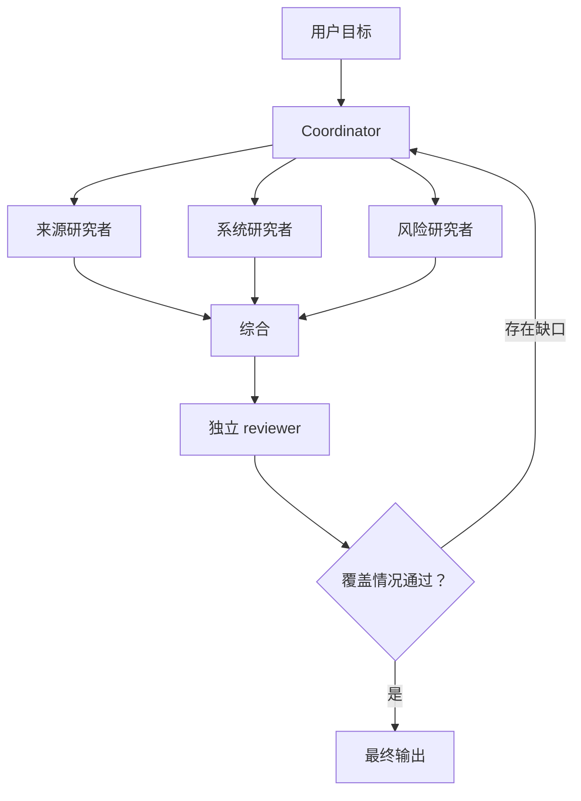

# Multi-Agent 编排与委派

> 委派一个边界明确的问题，而不是把你所有的不确定性都委派出去。

**Type:** Reference
**Languages:** Python
**Prerequisites:** [Tool 循环是受控委派](../../10-tool-use-and-agentic-loops/)；Phase 14，第 12 和 28 课
**Time:** ~135 分钟

## 学习目标

- 在 single-agent、coordinator、pipeline、并行和 reviewer 模式之间作出选择
- 编写包含范围、Tool、输出和完成标准的委派任务
- 使用 Context 隔离减少膨胀，并保护独立判断
- 区分确定性先决条件与自适应 Model 决策
- 合并部分结果，同时保留来源、错误和未解决的缺口

## 问题

一个研究 Agent 收到了一份极其庞大的 Prompt。它搜索六个来源、比较主张、
计算置信度、撰写报告、审查引用，并决定是否需要进一步研究。随着任务不断扩大，
它会忘记早期约束并重复搜索。团队把任务拆分给五个 Agent，为它们提供范围宽泛的
Tool，并要求它们“协作，直到报告足够出色”。

新系统成本更高，也更难调试。两个 Agent 研究了同一个主张。一个 Agent 返回了
散文，而 coordinator 期待的是 JSON。reviewer 看到了生成者的推理，于是重复了
它的假设。某个 Agent 悄无声息地失败了，但最终综合却把缺失的结果当成了反面证据。

Multi-Agent 架构并没有解决任务分解问题，只是让缺失契约的代价变得更高。

## 概念

### 明确为什么需要另一个 Context

只有当 subagent 能提供具体收益时，才创建它：

- 为边界明确的问题提供 Context 隔离
- 并行执行彼此独立的工作
- 使用专门的 Tool 或指令
- 在不接触生成者 Context 的情况下进行独立审查
- 保护 coordinator 的 Context 预算

如果子任务只是一个确定性函数，请使用 Tool。如果它是按需加载的可复用指导，
请使用 Skill。如果它需要自己的推理循环、证据和停止条件，则可能适合使用
subagent。

### 从五种模式开始



#### Single Agent

当一个 Context 能容纳所需证据，并且 Tool 执行轨迹较短时，这是最佳选择。
它也是最容易 Evaluation 的系统。

#### Sequential Pipeline

每个阶段都有固定的前置阶段。当顺序和先决条件已知时使用，例如先提取，
再验证、审查，最后渲染。

#### Parallel Fan-Out and Reduce

独立任务同时运行，然后由 reducer 合并结构化结果。它适用于逐文件审查或
独立来源研究。不要并行执行依赖彼此发现结果的步骤。

#### Coordinator and Specialists

coordinator 根据当前缺口选择并委派工作。当任务分解无法在开始时完全确定时，
使用这种模式。

#### Generator and Independent Reviewer

一个 Context 负责创建；另一个 Context 接收产物、证据和评分标准，但不接收
生成者具有说服倾向的内部叙述。真正的要求是独立性，而不是在同一段对话中
再征求一次意见。

### 编写委派契约

一个实用的委派任务包含：

```text
目标：由 subagent 负责的一项结果
范围：包含及排除的文件、来源、主张或系统
输入：权威证据和当前状态
允许使用的 Tool：最低限度的必要能力
约束：时间、轮次、成本、安全和格式
输出：包含来源和错误、可由机器检查的 schema
完成条件：完成、部分完成或受阻状态的可观测条件
交接：coordinator 应如何处理每种状态
```

“彻底研究这个主题”没有定义何为完成。“最多返回五项有证据支持的主张，
每项包含来源 ID、日期、引用片段引用、置信度类别、冲突列表和未解决问题”
才定义了完成。

### 将确定性顺序放在 Model 之外

如果审查必须在测试之后进行，就由代码强制执行该顺序。如果每个文件都必须先
接受局部审查，然后才能进行跨文件一致性审查，编排逻辑就应跟踪 manifest，
并在第一轮完成前阻止第二轮开始。

不要依赖 coordinator Prompt 在 Context 压力下记住硬性先决条件。

Claude 负责决定语义问题，例如缺失的哪项主张需要更多研究。代码负责决定
不变量，例如最大并发数、必需输出、审批状态和阶段顺序。

### 有意识地使用任务边界

在 Claude Code 和 Agent harness 中，任务或 subagent 边界可以提供隔离的
Context 和受限的 Tool 集。具体配置会随时间变化，因此应核验当前文档。
持久有效的设计原则包括：

- 只传递 subagent 所需的证据
- 使用显式 allowlist 限制 Tool
- 要求随结果返回结构化元数据
- 只有在独立调用互不依赖时才并行运行
- 由 coordinator 负责全局约束和最终状态
- 当探索替代方案不得改变原始会话时，fork 一个会话

隔离可以防止 Context 膨胀。如果所有 Agent 都收到相同的错误证据或评分标准，
隔离并不能保证事实判断上的独立性。

### 保留三种结果状态

每个子任务都应返回：

- complete：满足请求的契约
- partial：包含有效工作，以及明确指出的缺口或失败来源
- blocked：如果没有新的授权或状态，就无法安全推进

不要因为某些字段已经存在，就把 partial 转换成 complete。coordinator 必须将
缺失证据和结构化错误继续传递给综合阶段。

### 按身份和来源合并

reducer 需要稳定的 key。进行代码审查时，使用文件和发现项标识符。进行研究时，
使用主张和来源标识符。进行支持工作时，使用工单和操作标识符。

合并规则应明确：

- 重复项处理方式
- 冲突保留方式
- 来源优先级（如有）
- 时效性比较方式
- 不完整输入的处理方式
- 置信度聚合方式
- Agent 意见不一致时的升级机制

不要让 synthesizer 为了生成更流畅的文字而隐藏冲突。

### Evaluation 执行轨迹

即使最终输出看起来正确，编排过程仍可能浪费工作或越过边界。应测试：

- 是否选择了正确的 subagent
- 是否仅使用允许的 Tool
- 是否存在重复的任务所有权
- 是否遵循先决条件顺序
- 结果 schema 和错误是否正确传播
- 轮次和成本预算
- reviewer 的独立性
- 最终状态的完整性

使用合成的 Tool 故障和部分结果进行测试。顺利路径是最缺乏证明力的部分。

## 动手构建

## 交互式实验

```figure
16-multi-agent-topology
```

在添加 Agent 前使用拓扑探索器。比较单一 Context、sequential pipeline、
parallel fan-out、coordinator 和 independent reviewer；该图会揭示协调成本、
先决条件和部分结果风险。

## 实践实验

设计下面这个边界明确的研究 pipeline，然后移除一个不必要的 Context，并说明
可衡量的结果是否会发生变化。

## 交付产物

已填写的 [`outputs/orchestration-contract.md`](../outputs/orchestration-contract.md)
是一份具体的研究 pipeline 交接文档，而不是空白工作表。

## 验证

在本地验证它的任务身份、依赖顺序、预算、partial 状态和 reviewer 隔离：

```bash
cd certifications/claude/lessons/16-multi-agent-orchestration-and-delegation
python3 code/main.py
python3 -m unittest discover -s code/tests -v
```

修改一项依赖或删除 partial 状态规则，并确认验证器会阻止该数据包。课程测验会在
构建完成后测试拓扑决策能力。

## Capstone 关联

将经过验证的契约复用为 Architect Foundations 场景 Capstone 的编排部分。

为一项技术决策设计 Multi-Agent 研究 pipeline。

### 第 1 步：定义最终契约

在定义 Agent 之前，明确决策简报、主张 schema、来源要求以及未解决缺口的表示方式。

### 第 2 步：尝试 Single-Agent 基线

测量质量、成本、延迟、重复工作和 Context 增长。在基线没有失败之前，不要添加
Agent。

### 第 3 步：识别 Context 边界

只拆分那些能从隔离、并行、专业化或独立审查中获益的问题。记录每个新 Context
预期带来的改进。

### 第 4 步：编写任务契约

创建一个表格：

| 任务 | 范围 | 允许使用的 Tool | 输出 | 完成 | 部分完成 | 预算 |
|------|-------|---------------|--------|------|---------|--------|

### 第 5 步：编码先决条件

使用依赖图或状态机。在所有必需的研究状态达到 complete 或被明确标记为 partial
之前，reviewer 不得运行。

### 第 6 步：对合并过程进行 Red Team

注入重复主张、冲突日期、一个失败的 Agent、过时证据，以及一项 schema 错误的结果。
验证综合过程不会悄无声息地抹去失败。

## 实际应用

进行代码库审查时，一种可靠的结构是：

1. 构建文件和跨文件问题的 manifest。
2. 使用只读 Tool 并行运行边界明确的逐文件审查。
3. 将发现项规范化为共享 schema。
4. 基于 manifest 和规范化后的发现项运行一次跨文件审查。
5. 使用 independent reviewer 拒绝证据薄弱和重复的发现项。
6. 只有通过确定性测试和范围门禁后，才应用已接受的更改。

不要让每个 Agent 都检查整个 repository。这样会重复占用 Context，并导致所有权
含糊不清。

对于客户支持，应根据权限和专业能力共同分配角色。政策研究者可以读取文档。
退款建议者可以分析案例。只有单独获得批准的执行者才应获得写入权限。

## 考试决策模式

对先决条件和权限使用结构化强制机制。将 subagent 用于隔离推理，而不是确定性
utility 调用。

较强的选项通常会：

- 使用 coordinator 和边界明确的 specialists
- 按角色限制 Tool
- 返回结构化结果和 partial 状态
- 并行处理独立任务
- 在全新的 Context 中执行独立审查
- 保留来源和错误的 provenance
- 只对已识别出的缺口进行重新委派

较弱的选项会让更多 Agent 共享同一份范围宽泛的 Prompt 和 Tool 集。

## 常见陷阱

### 每个步骤一个 Agent

固定步骤不需要自治 Context。当操作具有确定性时，使用代码或 Tool。

### 默认并行

并行执行相互依赖的任务会使用过时假设，并需要高成本的合并修复。

### 将 Coordinator 当作数据仓库

原始 subagent 记录会使全局 Context 膨胀。应返回紧凑的结构化结果，并将详细证据
保留在 Prompt 之外。

### Reviewer 使用生成者的 Context

reviewer 会继承相同的叙事框架，并退化为文风编辑器。应在干净的 Context 中提供
产物、证据和评分标准。

## 练习

1. 将一份过度膨胀的 single-agent Prompt 转换为 Tool、Skill 和 subagent
   职责。说明每个边界的理由。
2. 设计三个来源研究者中的一个超时时，系统处理 partial 结果的行为。
3. 为逐文件和跨文件审查 pipeline 添加确定性先决条件。
4. 在同一 Evaluation 集上比较 sequential decomposition 和 adaptive decomposition。
5. 创建一个执行轨迹测试，当两个 Agent 的任务所有权重复时，该测试应失败。

## 关键术语

| 术语 | 人们通常怎么说 | 它的实际含义 |
|------|-----------------|------------------------|
| Coordinator | 最聪明的 Agent | 负责分解、全局约束、合并和完成状态的 Context |
| Subagent | 一次函数调用 | 具有边界明确的任务和 Tool、相互隔离的推理循环 |
| Fan-out | 使用许多 Agent | 并发运行边界明确的独立任务 |
| Reduce | 汇总所有内容 | 使用显式冲突和 partial 状态规则合并结构化结果 |
| Handoff | 发送一段文字 | 传递类型化状态、证据、错误和下一项职责 |
| Independent reviewer | 再问一次 | 在不受生成者说服影响的隔离 Context 中 Evaluation 产物和证据 |

## 延伸阅读

- [Claude Agent SDK 文档](https://platform.claude.com/docs/en/agent-sdk/overview)，了解当前的 subagent 和会话能力
- [构建高效 Agent](https://www.anthropic.com/research/building-effective-agents)，了解编排模式
- Phase 14，第 28 课，了解更全面的编排模式比较
- Phase 14，第 39 课，了解 independent reviewer 设计
