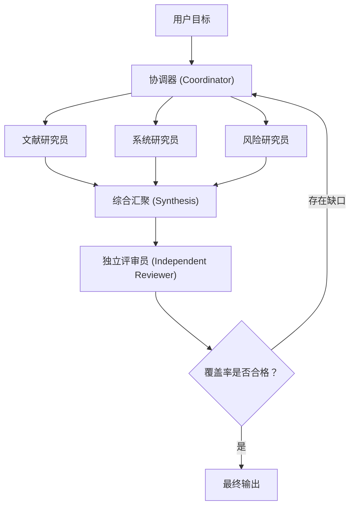

# 多 Agent 编排与任务委托 (Multi-Agent Orchestration and Delegation)

> 委托一个有明确边界的问题，而不是转嫁你的全部不确定性。

**Type:** Reference
**Languages:** Python
**Prerequisites:** [工具循环本质是受控委托](../../10-tool-use-and-agentic-loops/); Phase 14, Lessons 12 and 28
**Time:** ~135 minutes

## 学习目标

- 在单 Agent、协调器（Coordinator）、流水线（Sequential Pipeline）、并行扇出与规约（Parallel Fan-Out and Reduce）以及独立评审（Independent Reviewer）架构模式之间进行权衡与选型
- 编写包含职责范围（Scope）、工具白名单、结构化输出及完工标准（Completion Criteria）的委托任务契约
- 运用上下文隔离（Context Isolation）减少上下文膨胀并保护独立评审的裁决能力
- 区分代码保证的确定性先决条件（Deterministic Prerequisites）与模型的自适应推理决策
- 合并局部结果（Merge Partial Results），同时完整保留来源溯源（Provenance）、错误结构与未解决差距

## 问题背景

一个研究 Agent 拥有一个极其庞大的 Prompt。它需要搜索六个外部数据源、比对各方论据、评估置信度、撰写调研报告、审查引文真实性，并决定是否需要补充检索。随着任务推进，它逐渐遗忘早期的限制条件，陷入重复搜索的循环。为了解决这一问题，团队将其拆分为五个拥有宽泛工具权限的 Agent，并附加指令：“相互协作直至生成一份优秀的研究报告”。

重构后的系统成本成倍上升，且变得极难调试：两个 Agent 同时针对同一论点展开重复调研；一个 Agent 返回自由格式散文，而协调器期待解析 JSON；评审 Agent 看到了生成者的完整思考过程，先入为主地默认了其假设前提；某 Agent 在中间步骤发生静默失败，最终的综合报告却将缺失的结果误判为负面证据。

引入多 Agent 架构并未自动解决任务分解问题，反而让缺失的接口契约（Contracts）变得更加脆弱和昂贵。

## 核心概念

### 决定为何需要另一个上下文 (Decide Why Another Context Exists)

只有当引入 Subagent 能带来具体收益时，才应该创建新的上下文：

- 针对特定子任务的上下文隔离（Context Isolation），避免无关信息污染
- 独立并行执行互不依赖的工作，缩短总体延迟
- 配备专属的专业工具集合或专门领域的系统指令
- 在不受生成者思维偏见影响的前提下开展独立评审（Independent Review）
- 保护中央协调器的上下文窗口预算，避免超出限制

如果某个子任务是一段确定性计算逻辑，请直接封装为 Tool；如果它是一套按需加载的可复用操作规范，请使用 Skill；只有当它需要拥有独立的推理循环、证据收集与终止判定条件时，才应当分配一个 Subagent。

### 从五种基础模式出发 (Start With Five Patterns)


```mermaid
flowchart TD
    U["用户目标"] --> C["协调器 (Coordinator)"]
    C --> A["文献研究员"]
    C --> B["系统研究员"]
    C --> D["风险研究员"]
    A --> S["综合汇聚 (Synthesis)"]
    B --> S
    D --> S
    S --> R["独立评审员 (Independent Reviewer)"]
    R --> G{"覆盖率是否合格？"}
    G -->|"是"| O["最终输出"]
    G -->|"存在缺口"| C
```

#### 单 Agent 模式 (Single Agent)

当单个上下文窗口足以容纳所有必需证据，且工具调用轨迹较短时，单 Agent 是最佳选择。这是最容易评估、测试与排查故障的架构。

#### 顺序流水线模式 (Sequential Pipeline)

流水线中的每个阶段都有明确的前置阶段。当处理顺序和前置条件完全已知时使用此模式，例如依次执行：数据抽取、数据校验、合规审查、最终排版渲染。

#### 并行扇出与规约模式 (Parallel Fan-Out and Reduce)

同时触发多个相互独立的子任务，随后由规约器（Reducer）合并结构化结果。适用于逐个文件的代码审查或多数据源并发检索。切勿并行化相互依赖中间发现的步骤。

#### 协调器与专家模式 (Coordinator and Specialists)

由协调器（Coordinator）根据当前信息缺口自适应地选派与委托专家任务。适用于在初始阶段无法完全预先规划拆分步骤的复杂场景。

#### 生成者与独立评审者模式 (Generator and Independent Reviewer)

一个上下文负责生成内容；另一个上下文接收产物、原始证据与评审标准（Rubric），但在提示词中剥离生成者的内部说服性推导过程。评审的核心价值在于决策独立性，而非在同一对话上下文中自问自答。

### 编写任务委托契约 (Write a Delegation Contract)

一个清晰有效的委托任务应当包含以下要素：

```text
Goal (目标): Subagent 独立负责的一项明确业务成果
Scope (范围): 包含与排除的文件、数据源、论点或业务系统
Inputs (输入): 权威证据材料与当前上下文状态
Allowed tools (工具白名单): 完成任务所需的最小权限工具集
Constraints (约束): 执行时间、交互轮次、成本预算、安全策略与输出格式
Output (输出): 包含来源溯源与错误字段的机器可校验 Schema
Completion (完成条件): 判定为 done、partial 或 blocked 的可观测指标
Handoff (交接机制): 协调器接收到各状态后应当执行的具体动作
```

提示词中的“彻底调研该主题”并不能定义完工条件。而“返回至多 5 条经过验证的论点，每条均包含来源 ID、发布日期、引用原文字符段、置信度等级、冲突论据列表及未解决问题”，才是合格的完工契约。

### 将确定性顺序置于模型外部 (Keep Deterministic Sequence Outside the Model)

如果评审必须在单元测试通过后进行，代码逻辑必须强制确保这一执行顺序。如果每个文件在跨文件一致性检查前都必须先通过单文件独立审查，编排系统应当通过清单（Manifest）跟踪状态，并在首轮审查完成前严格阻塞第二轮处理。

切勿指望协调器在大上下文压力下仅凭 Prompt 自觉遵守刚性前置条件。

Claude 负责处理需要语义理解的决策（例如评估哪条缺失论点更需要补充调研）；程序代码则负责维系系统不变量（例如最大并发度、必需输出字段、审批流状态及阶段执行顺序）。

### 审慎运用任务边界 (Use the Task Boundary Deliberately)

在 Claude Code 和 Agent 运行时底座中，任务或 Subagent 边界提供了隔离的上下文和受限工具集。具体配置细节可能随版本演进，但以下设计原则持久不变：

- 仅向 Subagent 注入其完成任务所需的最少证据
- 采用明确的白名单严格限制可用工具
- 要求返回结果附带结构化的元数据
- 仅当并发子任务完全独立时才并行触发
- 始终由协调器把控全局约束与最终状态汇总
- 当需要探索分支假设且不能污染主链路时，对 Session 进行 Fork 分支派生

上下文隔离能有效杜绝上下文膨胀，但若所有 Agent 都接收了同等有缺陷的原始证据或评估标准，隔离本身并不能保证事实结论的正确性。

### 保留三种结果状态 (Preserve Three Result States)

每个子任务返回时，必须明确划分为以下三种状态之一：

- complete (完成): 契约要求的各项条件均已完全满足
- partial (部分完成): 完成了有效工作，但附带有明确命名的缺口或失败的数据源
- blocked (受阻): 在未获得新的授权或上下文状态前，无法安全继续推进

严禁仅仅因为返回了部分字段就将 partial 隐式转为 complete。协调器必须将缺失的证据和结构化错误完整传递给后续的综合汇聚阶段。

### 依据标识与来源进行合并 (Merge by Identity and Provenance)

规约器（Reducer）必须依赖稳定的业务标识键。在代码审查中，采用文件与 Issue 唯一标识；在研究调研中，采用论点与数据源标识；在客户服务中，采用工单与操作流水标识。

合并规则必须明确定义：

- 重复项去重逻辑
- 相互冲突论点的保留机制
- 权威数据源的优先级判定
- 证据时效性（Freshness）比对
- 不完整输入的补救或标记
- 置信度评分的聚合方式
- Agent 产生分歧时的向外升级（Escalation）机制

切勿为了生成读起来流畅和谐的文本而在综合阶段私自抹杀冲突信息。

### 评估执行轨迹 (Evaluate the Trajectory)

即使最终交付的报告看似正确无误，底层的 Agent 编排可能已经浪费了大量 Token 或逾越了权限边界。评估体系必须检查：

- 是否选派了正确的 Subagent 角色
- 是否遵守了工具白名单约束
- 是否存在任务职责的重复执行
- 是否严格遵守了前置依赖顺序
- 返回结果是否符合 Schema 并完整传递错误
- 交互轮次（Turns）与成本预算是否受控
- 评审 Agent 是否保持了真正的上下文独立
- 最终状态的完整性与事实核查

利用合成的工具故障和部分结果对编排逻辑进行压力测试。仅在正常路径（Happy Path）下运行是说服力最低的验证。

## 动手构建

## 交互式实验

```figure
16-multi-agent-topology
```

在引入多个 Agent 之前，请先使用拓扑交互图进行推演。对比单上下文（Single Context）、顺序流水线（Sequential Pipeline）、并行扇出（Parallel Fan-Out）、协调器专家（Coordinator）以及独立评审（Independent Reviewer）架构；交互图直观揭示了各个模式下的协调成本、前置依赖关系以及局部结果丢失风险。

## 实战演练

设计一个有边界的技术调研流水线，随后尝试移除其中一个不必要的上下文，并在量化评估中证明这一精简是否会影响最终的可度量指标。

## 交付产物

本课交付的产物位于 [`outputs/orchestration-contract.md`](../outputs/orchestration-contract.md)，它是一份具体可执行的调研流水线交接契约，而非空白模板。

## 验证方法

在本地验证任务标识、依赖顺序、资源预算、局部状态定义与评审隔离机制：

```bash
cd certifications/claude/lessons/16-multi-agent-orchestration-and-delegation
python3 code/main.py
python3 -m unittest discover -s code/tests -v
```

尝试修改其中的某条前置依赖或移除局部状态处理规则，确认校验工具能否立即拦截违规配置。课后测验将在构建完成后重点考查系统拓扑决策能力。

## 项目连接

将这份经过验证的编排契约，复用为架构师认证场景综合项目（Architect Foundations Scenario Capstone）中的 Multi-Agent 编排章节。

针对一项技术架构决策，设计完整的多 Agent 研究流水线：

### 步骤 1：定义最终交付契约

在划分任何 Agent 角色之前，首先明确决策备忘录（Decision Brief）、论点 Schema、数据源质量门禁以及未解决差距的具体表达形式。

### 步骤 2：建立单 Agent 基线

测量单 Agent 方案的生成质量、调用成本、响应延迟、重复劳动以及上下文增长曲线。若没有观察到单 Agent 基线的实际瓶颈，请勿盲目增加 Agent 数量。

### 步骤 3：识别清晰的上下文边界

仅当子任务能切实从上下文隔离、并发加速、专门领域或独立评审中获益时才进行拆分。记录每个新引入上下文的预期收益指标。

### 步骤 4：编写任务契约清单

梳理契约表格：

| 任务 | 职责范围 | 允许工具 | 输出规范 | 完成指标 | 局部结果处理 | 资源预算 |
|------|----------|----------|----------|----------|--------------|----------|

### 步骤 5：程序化硬编码前置条件

使用依赖图（DAG）或状态机来维系执行顺序。在所有前置研究任务处于 complete 或显式声明 partial 状态之前，严禁触发评审 Agent。

### 步骤 6：对结果合并逻辑开展红蓝对抗

故意注入重复论点、时间冲突的事实、人为构造失败的 Agent、过时的参考资料以及格式错误的输出对象。确保最后的综合汇报不会静默掩盖这些异常。

## 实践应用

在代码库审查场景中，推荐的稳定落地范式为：

1. 生成待审查文件及跨文件关联关注点的任务清单（Manifest）。
2. 使用只读工具并行触发针对每个文件的独立审查任务。
3. 将各个文件审查得出的缺陷统一标准化为公共 Schema。
4. 基于清单与标准化缺陷结果，启动一次跨文件全局一致性扫描。
5. 由独立的审查 Agent 剔除说服力不足的论据及重复告警。
6. 仅在确定性测试与作用域门禁校验通过后，才正式应用代码修改。

不要让每个 Agent 都盲目通读整个代码仓库，这不仅会导致大量重复上下文消耗，还会模糊任务权责边界。

在客户支持场景中，根据权限级别而非仅凭专业知识划分角色：政策研究员拥有只读权限；退款建议 Agent 负责案例分析；而只有通过独立审批的执行节点才能获取写权限以触发资金划转。

## 考试决策模式

在处理前置条件与权限边界时，优先选择确定性的程序控制；在需要隔离推理的场景中选择 Subagent，而非将其退化为确定性的常规工具调用。

在认证考试中，优秀架构设计通常具有以下特征：

- 采用协调器驱动具有严格边界的专家 Agent
- 针对每个角色实行精细化的工具权限白名单
- 必须返回结构化结果并妥善保留 partial 状态
- 仅在真正独立的任务间实施并行化
- 在干净独立的上下文中运行无偏见的独立评审
- 完整保留原始数据源与错误堆栈的溯源链路
- 仅针对明确识别出的信息缺口发起重新委托

而不佳的备选方案往往试图通过为更多 Agent 灌输宽泛模糊的 Prompt 和全量工具来解决协作问题。

## 常见陷阱

### 为每个步骤都生硬分配一个 Agent (Agent Per Step)

固定的线性处理步骤不需要自治的 Agent 上下文。对于确定性操作，直接使用代码逻辑或普通工具即可。

### 默认全面并行化 (Parallel by Default)

将存在逻辑依赖的任务并行化，会导致子任务基于过时的假设运行，最终需要付出极其高昂的合并修复成本。

### 协调器蜕变为数据仓库 (Coordinator as Data Warehouse)

将所有 Subagent 的原始交互转录（Transcripts）直接喂回协调器，会迅速挤爆主上下文窗口。应仅返回精简的结构化指标，而将大段证据保存在外部存储中。

### 评审者继承生成者的思考上下文 (Reviewer With Generator Context)

评审 Agent 若读取了生成者的完整推导脉络，往往会不自觉地陷入相同思维定势，最终退化为润色文字的修辞编辑。必须在纯净的全新上下文中提供待审产物、客观证据与评审细则。

## 课后习题

1. 将一段膨胀的单 Agent Prompt 重构为普通工具、Skill 与 Subagent 的职责分工，并论证每个边界的合理性。
2. 设计当三个并发文献研究员中有任意一个超时失效时的局部结果（Partial Result）应对机制。
3. 为单文件审查与跨文件一致性审查流水线添加确定性的代码前置门禁。
4. 在相同的基准评估集上，对比顺序流水线与自适应协调器模式的准确度、耗时与 Token 开销。
5. 编写一个轨迹测试用例：当两个 Agent 出现任务职责重复认领时，断言测试失败并报警。

## 核心术语

| 术语 | 通俗说法 | 严谨工程定义 |
|------|----------|--------------|
| 协调器 (Coordinator) | 最聪明的指挥官 | 负责任务分解、全局约束维持、结果合并与完工判定的中枢上下文 |
| 子智能体 (Subagent) | 一个函数调用 | 具有明确业务边界、独立工具集与自治推理循环的隔离执行环境 |
| 扇出 (Fan-out) | 多开几个 Agent | 并发触发多个输入输出相互独立的受限子任务 |
| 规约 (Reduce) | 把内容总结一下 | 依据显式冲突解决与局部状态处理规则合并结构化输出 |
| 交接 (Handoff) | 把文字发过去 | 传递类型化状态、支持证据、结构化错误及后续责任链的过程 |
| 独立评审员 (Independent Reviewer) | 再问一次第二意见 | 在完全剥离生成者思维引导的纯净上下文中评估产物与证据质量 |

## 延伸阅读

- [Claude Agent SDK 官方文档](https://platform.claude.com/docs/en/agent-sdk/overview)：查阅当前 Subagent 与 Session 管理能力
- [构建高效智能体 (Building Effective Agents)](https://www.anthropic.com/research/building-effective-agents)：深入掌握编排设计模式
- 本教程 Phase 14 第 28 课：不同编排架构的横向深度对比
- 本教程 Phase 14 第 39 课：独立评审员机制的详细架构设计
