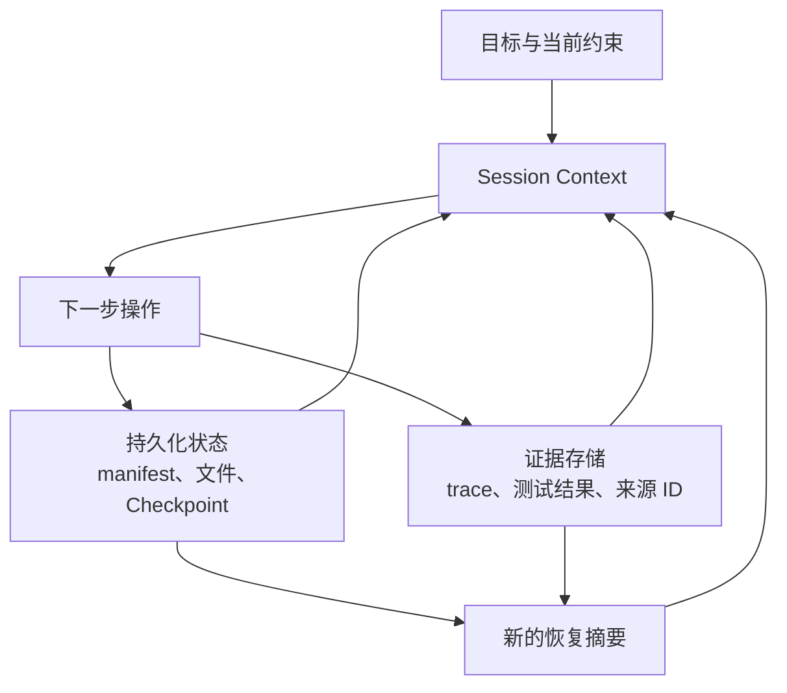

# Agent SDK Session、Subagent 与 Context

> 当连续性有帮助时恢复状态。当继承的假设成为风险时 fork Context。

**Type:** Reference
**Languages:** Python
**Prerequisites:** [Agent SDK 是执行框架，而不是权限](../../12-claude-agent-sdk-and-hooks/)、[Multi-Agent 编排与委派](../../16-multi-agent-orchestration-and-delegation/)；Phase 14，Lesson 17
**Time:** ~120 分钟

## Learning Objectives

- 区分持久化任务状态与对话 Context
- 根据失败风险选择新建、恢复、fork 和压缩 Session
- 使用 Subagent 隔离 Context 和 Tool
- 围绕确定性的生命周期事件设置 Hook
- 设计不会重放过时假设或重复产生副作用的恢复机制

## 问题

一个代码库迁移 Agent 已经运行了数小时。它的 Context 包含原始计划、Tool 输出、失败的实验、部分 patch、测试日志和若干摘要。依赖项发生变化后，团队恢复同一个 Session，并说：“从停止的地方继续。”

Agent 遵循了一个过时的计划。它重复执行了一个在超时之前已经成功的写入操作。Context 压缩保留了大致经过，却遗漏了一项关键的测试失败。一个审查 Subagent 收到了完整的父级历史记录，并假定旧有的依赖行为仍然成立。

系统混淆了三件事：

- 持久化外部状态
- 当前对话 Context
- 执行历史

它们彼此相关，但不应该被视为同一个存储。

## 概念

### Context 是工作集

Model Context 应该包含下一步决策所需的信息。对于已完成的工作、审批、文件、Checkpoint 或 Tool 副作用，它并不是权威数据库。



将持久化事实存储在 Context 之外：

- 当前任务 manifest 和状态
- 已完成的产物及版本
- 幂等性 key 和外部操作 ID
- 审批及其过期时间
- 最近一次验证的测试与部署结果
- 尚未解决的阻塞项
- 来源与 trace 引用

Session 启动或恢复时，根据这些状态重建紧凑的当前工作集。

### 在四种 Session 操作中进行选择

#### 新建 Session

当目标或信任边界发生变化、继承的 Context 不可靠，或之前的任务已经完成时，使用干净的 Session。根据权威状态提供结构化简报。

#### 恢复 Session

当任务、约束和证据仍然有效，而且对话连续性具有价值时恢复 Session。首先重新验证外部状态。Session ID 并不能证明外部世界没有变化。

#### Fork Session

当探索替代方案时需要保留原始分支，应 fork Session。适用场景包括相互竞争的架构方案、彼此独立的调试假设，或高风险的迁移选项。fork 会继承一个起点，但不应在缺少明确协调的情况下修改共享状态。

#### 压缩 Session

当 Context 持续增长，但当前工作仍能从连续性中受益时压缩 Session。良好的压缩摘要会保留决策、约束、产物 ID、测试状态、未解决的问题和下一步操作。将大型证据存储在外部，只保留引用。

压缩可以节省 Context。它不会创建持久化执行，不保证关键信息一定保留，也不会验证信息是否仍然有效。

### 使用结构化恢复包

```json
{
  "goal": "在不改变公开行为的情况下迁移请求 client",
  "scope": ["src/client.py", "tests/test_client.py"],
  "completed": [
    {"task": "inventory", "artifact": "work/inventory.json", "verified": true}
  ],
  "current_state": {
    "branch": "migration/client-v2",
    "dependency_version": "verified-at-resume",
    "tests": "12 个通过，1 个受阻"
  },
  "open_gaps": ["需要确定超时重试语义"],
  "constraints": ["不更改公开 API", "禁止写入生产环境"],
  "next_action": "根据契约测试比较重试行为"
}
```

该恢复包报告当前事实。不要汇总每一轮对话。

### 按职责隔离 Subagent Context

Subagent 应该接收：

- 一个目标及其范围
- 最少量的相关证据
- 受限的 Tool
- 明确的输出和错误 schema
- 轮次、时间和成本预算
- 完成与上报规则

它不应接收无关的父级历史记录。隔离可以保护 Attention，并有助于保持审查者的独立性。

协调器保留全局状态，并在合并返回结果前检查其契约。

### 使用 Hook 处理确定性的生命周期工作

Hook 在 Session 或 Tool 周围的指定事件上运行。具体事件名称和配置会发生变化，因此请查阅当前的 Agent SDK 和 Claude Code 文档。持久适用的放置规则是：

- 操作前 Hook 负责验证或阻止操作
- 操作后 Hook 负责规范化、记录或验证
- 停止 Hook 负责检查完成状态和清理工作
- Session Hook 负责加载或持久化受控状态

示例：

- 阻止在声明范围之外进行写入
- 在使用破坏性 Tool 前要求提供新的审批
- 截断或外部化过大的 Tool 输出
- 将 Tool 错误规范化为通用 schema
- 编辑后运行格式化程序或针对性测试
- 写入不可变的 trace 引用

不要将需要 Model 推理的语义判断放入脆弱的 shell 逻辑中。不要将强制授权规则放入 Prompt。

### 使副作用具备幂等性

超时后恢复可能会重复执行结果已经丢失的操作。每一次外部写入都需要幂等性或对账策略。

例如：

- 使用唯一请求 key 创建退款
- 在应用 patch 前记录预期文件 hash
- 重试前检查部署版本
- 持久化 Tool 调用 ID 和结果状态
- 再次写入前，对结果未知的操作进行对账

只有在完成错误分类后，“重试”才是安全的。

### 在边界处重新验证

继续之前：

1. 确认当前文件、依赖版本、分支和服务状态。
2. 与 Checkpoint 进行比较。
3. 标记过时的假设。
4. 重新运行能够确立安全下一步操作的最小验证。
5. 创建新的当前状态摘要。

如果环境发生了实质性变化，应使用新计划启动或 fork Session，而不是强迫旧 Session 重新解释自身。

### 规划 Context 预算

为以下内容分配 Context：

- 目标和硬性约束
- 当前计划和 manifest
- 下一次选择所需的近期证据
- 紧凑的相关 Tool 输出
- 最终输出契约

大型原始日志、完整代码库和重复的 Tool schema 应放在活跃工作集之外，或置于渐进式发现机制之后。

使用 Subagent 执行有明确边界的搜索，并返回带引用的摘要。即使名义上的 Context 窗口很大，Context 仍然是稀缺的推理空间。

## Build It

## Interactive Lab

```figure
17-session-context-budget
```

使用 Context 预算模拟器，在目标、约束、证据、Tool 结果和输出契约之间分配工作集。它可以直观展示为什么压缩能够减小体积，却不能证明状态仍然有效。

## Practice Lab

在迁移练习中使一个 Checkpoint 失效，并在不信任对话历史的情况下修复恢复包。

## Shipped Artifact

填写完成的 [`outputs/session-recovery-packet.md`](../outputs/session-recovery-packet.md) 记录了一次中断的迁移，其中包含 hash、结果未知的副作用以及安全的下一步操作。

## Verify It

验证其中是否包含持久化状态、重新验证、幂等性 key 和隔离审查：

```bash
cd certifications/claude/lessons/17-agent-sdk-sessions-subagents-and-context
python3 code/main.py
python3 -m unittest discover -s code/tests -v
```

测验会检查 Session 选择和恢复规则。

## Capstone Connection

将经过验证的恢复包附加到 Architect Foundations Capstone，作为恢复和 Context 管理证据。

创建一个持久化的三 Session 迁移练习。

### Session 1：清点与规划

生成一份包含文件、测试、公开契约、依赖项和风险的 manifest。将其持久化到对话之外。此时不要实现任何内容。

### Session 2：实现与验证

从 manifest 和代码库当前状态开始。使用受限的文件 Tool。持久化已完成的任务 ID、文件 hash、测试输出引用和尚未解决的问题。

在执行过程中，模拟文件写入后发生超时。在重试任何操作之前，通过核对文件 hash 恢复工作。

### Session 3：独立审查

Fork 一个全新的审查 Context。提供 diff、需求、测试和 rubric，而不是实现过程的 transcript。审查者返回包含证据的结构化发现。

### Hook 要求

- 写入前范围 gate
- 写入后针对性验证
- 带外部证据引用的 Tool 输出大小限制
- 结构化 trace 记录
- 停止检查，要求 manifest 已完成或明确记录部分完成状态

## Use It

对于客户支持 Agent，应将工单状态、检索到的证据 ID、审批和 Tool 结果存储在持久化 case 记录中。Session Context 包含当前问题和相关证据。如果人工操作员在数小时后返回，应根据 case 记录重建工作集，并重新验证政策是否仍然有效。

对于 CI，每次运行都应该从一个 commit 和声明的输入开始，使用干净状态。复用交互式 Session 可能会引入未声明的状态。应将持久化的发现或结构化摘要作为显式输入。

## 考试决策模式

对有效的连续性选择 resume，对隔离的替代方案选择 fork；当过时 Context 构成风险时，选择新 Session。压缩解决的是大小问题，而不是真实性问题。

优先选择以下答案：

- 将持久化状态保存在 Prompt 之外
- 恢复时重新验证当前环境
- 隔离 Subagent Context 和 Tool
- 使用 Hook 执行确定性 gate 和规范化
- 重试前对结果未知的副作用进行对账
- 传递带有产物引用的结构化摘要

避免选择将完整旧 transcript 提供给每一个新 Agent 的答案。

## 常见陷阱

### Session 等同于状态

对话历史无法提供事务、幂等性、版本控制或权威的外部事实。

### 压缩等同于恢复

摘要可能会遗漏唯一真正重要的失败。恢复依赖持久化状态和验证。

### Fork 等同于独立

Fork 可能会继承错误证据。审查者独立性还需要干净的 rubric 和受控输入。

### 到处使用 Hook

过多不透明的 Hook 会使行为难以调试。应保持 Hook 简洁、可观察、经过版本控制，并与一个具名不变量绑定。

## 练习

1. 为一个在部署过程中被中断的 Agent 设计恢复包。
2. 为一次高影响 Tool 调用添加幂等性和对账机制。
3. 判断五种场景应该使用 resume、fork、compact 还是新 Session。
4. 创建一个 Hook 映射，将语义 Model 工作与确定性 gate 分开。
5. 分别在提供和不提供生成器 transcript Context 的情况下测试审查者，并比较重复出现的假设。

## 关键术语

| 术语 | 人们常说的含义 | 实际含义 |
|------|-----------------|------------------------|
| Session | 持久化记忆 | 一种对话工作 Context，而不是权威系统状态 |
| Resume | 盲目继续 | 在核对当前外部状态后复用有效 Context |
| Fork | 复制所有内容 | 为隔离的替代工作从现有 Context 创建分支 |
| Compaction | 保存所有细节 | 压缩当前 Context，同时由外部状态保留权威证据 |
| Hook | 一个 Prompt | 附加到生命周期事件上的确定性代码 |
| Idempotency | 重试一次 | 对同一个请求身份重复执行操作时，不会产生额外影响 |

## 延伸阅读

- [Claude Agent SDK Session 文档](https://platform.claude.com/docs/en/agent-sdk/sessions)，了解当前 Session 行为
- [Claude Agent SDK Hook 文档](https://platform.claude.com/docs/en/agent-sdk/hooks)，了解当前生命周期事件
- Phase 14，Lesson 40：多 Session 交接
- Phase 15，Lesson 12：持久化执行
