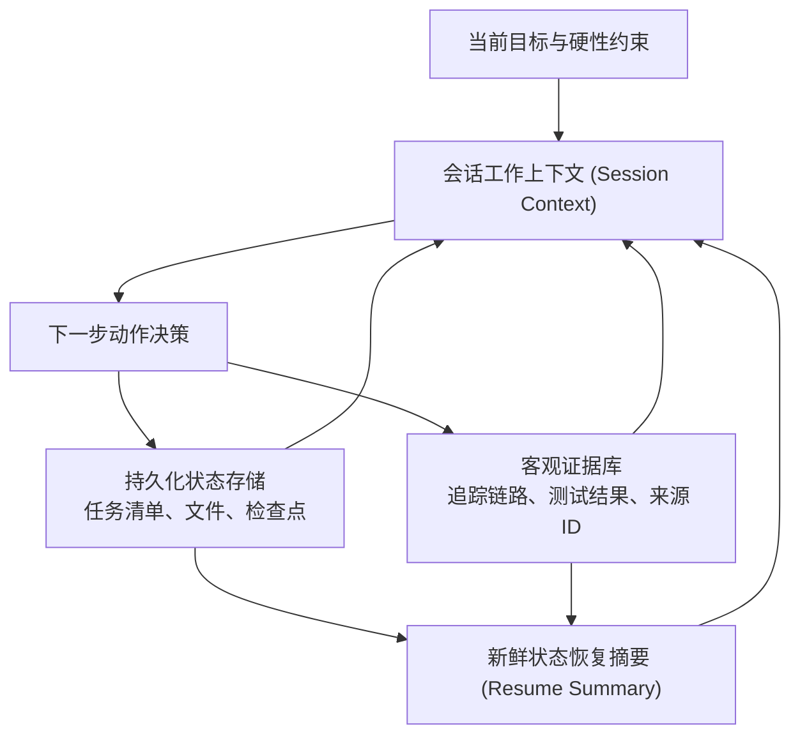

# Agent SDK 会话、Subagent 与上下文管理 (Agent SDK Sessions, Subagents, and Context)

> 当连续性有价值时恢复状态；当继承的假设成为系统风险时派生上下文。

**Type:** Reference
**Languages:** Python
**Prerequisites:** [Agent SDK 本质是运行底座而非权限放行](../../12-claude-agent-sdk-and-hooks/), [多 Agent 编排与任务委托](../../16-multi-agent-orchestration-and-delegation/); Phase 14, Lesson 17
**Time:** ~120 minutes

## 学习目标

- 将持久化任务状态（Durable Task State）与对话上下文（Conversational Context）彻底解耦
- 基于故障风险在新建（New）、恢复（Resume）、派生（Fork）与压缩（Compact）四种会话操作间做出正确抉择
- 使用 Subagent 隔离上下文窗口与工具权限
- 围绕确定性的生命周期事件部署生命周期钩子（Hooks）
- 设计不会重放过时假设或引发重复副作用（Side Effects）的健壮恢复机制

## 问题背景

一个代码库迁移 Agent 持续运行了数个小时。它的上下文窗口塞满了最初的迁移方案、繁杂的工具输出、失败的临时实验、部分生成的代码补丁、测试日志以及多次中间总结。随着某个底层依赖版本的变动，开发团队直接恢复了该会话并下达指令：“从刚才停下的地方继续执行”。

该 Agent 随即开始机械地遵循已经过时的旧方案。它重复执行了一个在之前超时前其实已经写入成功的写操作。上下文压缩（Compaction）保留了大体的故事梗概，却在压缩摘要中悄然遗漏了一次致命的测试失败记录。随后接入的评审 Subagent 继承了父级会话的全部历史，先入为主地认定旧依赖的行为依然成立。

该系统混淆了三个根本不同的概念：

- 持久化外部状态（Durable External State）
- 当前对话上下文（Current Conversational Context）
- 历史执行轨迹（Execution History）

这三者紧密相关，但绝不能被当作同一个存储实体混为一谈。

## 核心概念

### 上下文仅是工作集 (Context Is a Working Set)

模型上下文应当仅承载做出下一步决策所必需的关键信息。它绝不是用于记录已完成工作、审批记录、文件版本、检查点（Checkpoints）或工具副作用的权威数据源。


```mermaid
flowchart TD
    G["当前目标与硬性约束"] --> C["会话工作上下文 (Session Context)"]
    S["持久化状态存储\n任务清单、文件、检查点"] --> C
    E["客观证据库\n追踪链路、测试结果、来源 ID"] --> C
    C --> A["下一步动作决策"]
    A --> S
    A --> E
    S --> R["新鲜状态恢复摘要 (Resume Summary)"]
    E --> R
    R --> C
```

必须将持久化事实保存在上下文之外：

- 当前任务清单（Manifest）与各子任务状态
- 已完成的产物清单与文件校验版本
- 幂等键（Idempotency Keys）与外部系统操作唯一流水号
- 权限审批记录及其有效截止时间
- 最近一次通过验证的测试和部署基线
- 明确尚未解决的阻塞项（Blockers）
- 原始证据来源与分布式追踪引用

当一个 Session 启动或恢复时，系统应当从外部权威状态中重新组装出一个紧凑的当前工作集。

### 会话操作的四种选择 (Choose Among Four Session Moves)

#### 1. 新建会话 (New Session)

当业务目标发生漂移、信任边界切换、继承的上下文已被污染不可信，或者上一个阶段任务已彻底完成时，必须启动干净的新会话。通过结构化的状态简报（Brief）从外部权威存储中注入初始上下文。

#### 2. 恢复会话 (Resume Session)

仅当任务目标、约束条件与既有证据仍然有效，且对话的自然连续性能够带来明确收益时，才选择恢复会话。在恢复执行前，必须首先在代码层重新校验外部环境的实际状态。仅凭一个 Session ID 并不能证明外面的世界未发生变化。

#### 3. 派生会话 (Fork Session)

当探索分支备选方案需要保留原链路状态时使用 Fork。典型场景包括对比两种相互竞争的架构设计、验证两个相互独立的排错假说，或者尝试存在较高回滚风险的迁移路径。Fork 出来的新分支继承原有的起点，但在未经显式协调批准前，绝不允许私自修改共享的外部持久化状态。

#### 4. 压缩会话 (Compact Session)

当上下文长度逼近阈值但当前工作仍然极度依赖前文脉络时，触发压缩。一份合格的压缩摘要必须保留关键决策、核心约束、产物 ID、最新测试结论、遗留缺口以及下一步明确行动。大篇幅的原始证据应当剥离至外部存储，仅在上下文中保留引用链接。

压缩的作用是节省 Token 空间。它既不能创造持久化执行保证，也无法确保所有关键细节不被丢弃，更无法验证事实的新鲜度。

### 使用结构化恢复数据包 (Use a Structured Resume Packet)

```json
{
  "goal": "在不改变公共对外行为的前提下重构请求客户端",
  "scope": ["src/client.py", "tests/test_client.py"],
  "completed": [
    {"task": "inventory", "artifact": "work/inventory.json", "verified": true}
  ],
  "current_state": {
    "branch": "migration/client-v2",
    "dependency_version": "verified-at-resume",
    "tests": "12 passed, 1 blocked"
  },
  "open_gaps": ["超时重试语义仍需确认架构决策"],
  "constraints": ["严禁改动公共 API 签名", "严禁对生产环境发起写操作"],
  "next_action": "对照契约测试比对现有的重试行为"
}
```

恢复数据包呈现的是当前的客观真相，而不是机械性地罗列每一轮闲聊对话。

### 按职责严格隔离 Subagent 上下文 (Isolate Subagent Context by Responsibility)

分配给 Subagent 的上下文应当精准裁剪：

- 单一明确的目标与作用域
- 与子任务直接相关的最少证据
- 经严格白名单筛选的必要工具
- 显式的输出结构与错误 Schema
- 轮次、耗时与成本预算上限
- 完工标准与向上升级上报规则

切勿直接将父级会话的冗长历史全盘倾倒给 Subagent。上下文隔离保护了注意力机制，同时也是确保评审独立性的基石。

中央协调器始终掌管全局状态，并在合并子任务产物前对其契约进行合规性验证。

### 部署生命周期钩子以处理确定性逻辑 (Use Hooks for Deterministic Lifecycle Work)

Hooks 在围绕 Session 或 Tool 调用的固定生命周期事件点触发运行。虽然不同框架的配置语法可能不同，但工程上持久的设计原则为：

- 前置动作钩子（Pre-action Hooks）：负责拦截非法请求或前置安全门禁
- 后置动作钩子（Post-action Hooks）：负责标准化输出、记录审计日志或触发局部验证
- 终止钩子（Stop Hooks）：负责检验完工状态并执行环境清理
- 会话钩子（Session Hooks）：负责受控地加载或落盘持久化状态

常见工程实践包括：

- 拦截并阻止针对声明作用域之外的文件写操作
- 在调用高危破坏性工具前强制校验是否持有新鲜的人工审批凭证
- 对超出长度阈值的工具输出进行自动截断，并转储为外部文件引用
- 将各异的底层工具报错统一归一化为标准的错误 Schema
- 在代码编辑操作完成后自动运行代码格式化工具或定向单元测试
- 生成并记录不可篡改的分布式调用链 Trace ID

切勿将需要模型语义推理的复杂判断硬写进死板脆弱的脚本逻辑中，也切勿把刚性的鉴权授权逻辑寄托在脆弱的 Prompt 提示词上。

### 确保写操作与副作用具备幂等性 (Make Side Effects Idempotent)

在发生超时后恢复会话，如果上一次调用的返回结果中途丢失，极易引发重复执行。所有对外部系统的写操作都必须具备幂等性（Idempotency）或对账（Reconciliation）机制：

- 使用全局唯一的业务流水号或请求 ID 发起退款
- 在打补丁前严格比对目标文件的预期 Hash 摘要
- 在重试前核查目标部署版本是否已就绪
- 外部持久化工具调用 ID 及其最终执行结果状态
- 在下发新的写指令前，主动向外部系统对账未知结果

在完成错误归类并消除未知状态前，盲目的“再次重试”是极其危险的。

### 边界处必须重新验证 (Revalidate at the Boundary)

在从断点恢复执行之前，必须按以下步骤对齐现实：

1. 检查当前本地文件、依赖版本、Git 分支与外部服务的真实状态。
2. 将当前真实状态与检查点中的记录进行比对。
3. 显式标记所有已经过时的先验假设。
4. 重新执行范围最小的校验检查，为下一步动作建立安全基线。
5. 生成一份反映当前最新现状的上下文摘要。

如果外部环境已经发生实质性偏离，应基于新现状建立新会话或派生分支，而不是强迫原会话生搬硬套之前的思路。

### 规划上下文预算配额 (Plan Context Budgets)

合理规划有效上下文窗口的分配：

- 目标声明与不可违背的硬性约束
- 当前执行计划与动态任务清单
- 供下一步决策直接引用的近期核心证据
- 精简过滤后的直接工具返回值
- 最终输出所遵循的契约规格

大篇幅的原始日志、海量代码库全文以及冗余的工具 Schema 定义都属于主工作集之外的内容，应当借助外部存储或渐进式发现机制（Progressive Discovery）进行按需检索。

利用 Subagent 开展受限的数据检索，并仅向主链路返回附带引用凭证的浓缩摘要。即便底层模型宣称拥有百万级 Token 窗口，有效推理注意力依然是非常宝贵的核心资源。

## 动手构建

## 交互式实验

```figure
17-session-context-budget
```

运行上下文预算模拟器，直观模拟将工作集动态分配给目标、约束、证据链、工具结果与输出契约的过程。实验直观揭示了为什么单纯压缩体积并不能证明保留下来的状态具有时效性和真实性。

## 实战演练

在代码迁移实战中人为使某个检查点失效，在不依赖历史闲聊记录的前提下，仅依靠外部状态与验证逻辑修复恢复数据包（Resume Packet）。

## 交付产物

本课交付的标准产物位于 [`outputs/session-recovery-packet.md`](../outputs/session-recovery-packet.md)，它记录了一次因意外中断的代码迁移任务现场，包含精准的文件 Hash、未决的副作用判定以及可安全接续的下一步行动。

## 验证方法

在本地运行校验程序，确认恢复数据包中完整包含了持久化状态、重新验证逻辑、幂等校验键以及独立评审隔离约束：

```bash
cd certifications/claude/lessons/17-agent-sdk-sessions-subagents-and-context
python3 code/main.py
python3 -m unittest discover -s code/tests -v
```

课后测验将全面考察会话流转策略与断点恢复的设计准则。

## 项目连接

将经过校验的会话恢复数据包，无缝挂载到架构师基础场景大作业（Architect Foundations Capstone）中，作为恢复能力与上下文治理体系的核心支撑证据。

构建一个具备持久化容灾能力的跨三阶段迁移演练：

### 会话 1：资产清点与架构规划 (Inventory and Plan)

生成包含涉及文件、关联测试、对外公共契约、第三方依赖及潜在风险的完整清单（Manifest）。将该清单持久化至对话外部存储。本阶段不编写任何具体业务代码。

### 会话 2：代码实现与局部验证 (Implement and Verify)

从外部持久化的清单和当前代码仓库的真实状态启动。为 Agent 配备严格受限的文件操作工具。持久化记录已完成任务 ID、变更文件 Hash、测试输出引用以及遗留断点。

在执行中途，模拟在写入文件后发生网络超时。恢复程序在触发任何重试逻辑之前，必须先比对文件 Hash 展开对账。

### 会话 3：独立审查 (Independent Review)

Fork 派生一个全新的独立评审上下文。仅向其提供代码 Diff、需求文档、测试用例和评分细则（Rubric），严禁传入会话 2 的实现推导过程。评审者返回附带具体证据的结构化发现。

### 生命周期钩子需求清单 (Hook Requirements)

- 写操作前置作用域门禁校验（Pre-write Scope Gate）
- 写操作后置定向自动化回归测试（Post-write Verification）
- 工具输出体积阈值拦截与外部引用转储
- 结构化分布式调用链（Trace）自动打点
- 终止状态检查：校验清单完工状态或显式的 partial 异常声明

## 实践应用

在企业智能客服场景中，将工单最新状态、检索到的政策 ID、用户授权凭据以及工具调用结果持久化沉淀到案件数据库中。模型的会话上下文仅载入当前轮次的用户问题与最相关的证据。若用户在数小时后重新接入，系统直接从数据库重建工作上下文，并在调用前重新核验安全政策的有效性。

在持续集成（CI）流水线中，每次运行必须从特定 Git Commit 和明确声明的输入数据干净启动。复用交互式会话往往会隐蔽地带入未声明的环境状态。应当始终将外部持久化的分析结论或结构化摘要作为显式输入接入。

## 考试决策模式

当需要合法的逻辑连续性时选择 Resume；当需要隔离探索备选方案时选择 Fork；当面临过时上下文风险时果断开启干净的 New Session。上下文压缩仅解决空间容量问题，无法保证事实的绝对真实性。

在认证考试中，高分架构方案通常具备以下特征：

- 将持久化关键状态安全地沉淀在模型 Prompt 外部
- 在会话 Resume 恢复时显式重新验证当前外部环境
- 严格隔离 Subagent 的上下文窗口与工具权限
- 使用 Hooks 机制实现确定性门禁与输出标准化
- 在盲目重试前主动对账未知的写操作副作用
- 仅向下游传递附带制品引用的结构化紧凑摘要

坚决避免将冗长而充满历史噪音的完整交互记录直接倾倒给后续每一个 Agent。

## 常见陷阱

### 会话历史等同于系统状态 (Session Equals State)

普通的对话历史记录无法提供事务保证（Transactions）、幂等性支持、版本控制机制，更无法作为权威的外部事实根据。

### 会话压缩等同于系统恢复 (Compaction Equals Recovery)

一段由模型概括生成的摘要很可能会漏掉那次最致命的失败细节。真正的系统级容灾恢复依赖于确定性的持久化状态与可重复的验证脚本。

### 会话派生等同于独立裁决 (Fork Equals Independence)

Fork 出的上下文会全盘继承先前的认知偏差和有缺陷的证据链。实现真正的独立评审必须从外部提供纯净的评判细则与受控证据。

### 滥用生命周期钩子 (Hooks Everywhere)

部署过多隐式且晦涩的 Hooks 会让 Agent 系统的整体调试变成灾难。Hooks 必须保持单一职责、行为透明可观测、受版本控制管辖，并与明确命名的系统不变量绑定。

## 课后习题

1. 为一个在生产发布中途遭遇中断的部署 Agent，设计一份完整的恢复数据包（Resume Packet）。
2. 为一个高风险的支付划扣工具调用增加幂等键与状态主动对账机制。
3. 针对五个给定的业务突发场景，准确裁定应当采用 Resume、Fork、Compact 还是 New Session。
4. 绘制一份生命周期钩子映射表，明确划分哪些属于模型的语义推断范畴，哪些属于确定性的硬性代码门禁。
5. 分别在携带与剥离生成者推理记录的两种上下文中测试评审 Agent，量化比对其对既有假设的盲从程度。

## 核心术语

| 术语 | 通俗说法 | 严谨工程定义 |
|------|----------|--------------|
| 会话 (Session) | 永久记忆库 | 临时的对话推理工作上下文，绝非权威的系统状态存储源 |
| 恢复 (Resume) | 盲目接着跑 | 在对外部真实状态完成对账验证后，安全复用有效的历史上下文 |
| 派生 (Fork) | 全部拷一份 | 复制克隆当前上下文镜像，用于探索独立的分支路径且不污染主链路 |
| 压缩 (Compaction) | 把细节全存下 | 在外部持久化权威证据的前提下，在模型端对当前上下文进行浓缩摘要 |
| 钩子 (Hook) | 一段 Prompt 提示 | 挂载在特定生命周期事件点上的确定性程序逻辑 |
| 幂等性 (Idempotency) | 失败就重试 | 对于相同的请求标识，无论重复执行多少次，系统产生的外部副作用完全一致 |

## 延伸阅读

- [Claude Agent SDK Sessions 官方文档](https://platform.claude.com/docs/en/agent-sdk/sessions)：了解最新 Session 管理机制
- [Claude Agent SDK Hooks 官方文档](https://platform.claude.com/docs/en/agent-sdk/hooks)：掌握生命周期事件挂载规范
- 本教程 Phase 14 第 40 课：多会话状态无缝交接方案
- 本教程 Phase 15 第 12 课：分布式持久化执行架构
