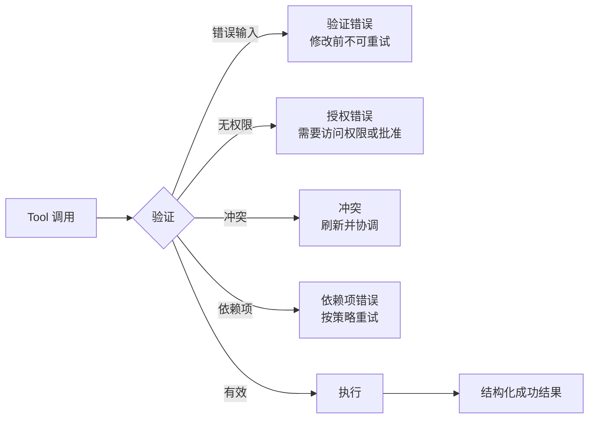

# Tool 契约、错误与渐进式发现

> Model 会从你描述的接口中进行选择。含糊的 Tool 会产生含糊的行为。

**Type:** 参考
**Languages:** Python
**Prerequisites:** [Tool 循环是受控委派](../../10-tool-use-and-agentic-loops/)、[MCP 将能力与 Host 分离](../../11-mcp-server-design-and-integration/)；Phase 13，第 05 课
**Time:** ~120 分钟

## 学习目标

- 编写边界互不重叠的 Tool 名称、描述和 schema
- 设计能够指导安全恢复的结构化 Tool 和 MCP 错误
- 有意识地使用 Tool choice 和精简的 Tool 分配
- 根据用户和项目用途限定 MCP 配置与 secret 的范围
- 对大型 Tool 目录应用渐进式发现，同时不丢失授权控制

## 问题

一个 Agent 看到三个 Tool：

- `search`
- `find`
- `lookup`

它们的描述都写着“查找信息”。其中一个搜索公共网页，一个查询内部客户记录，另一个检索已批准的政策。它们的 schema 都接受一个字符串。错误则返回任意文本。

Model 的选择不一致。公共研究任务查询了私有数据。政策问题却搜索了 Web。当某个 Tool 返回“失败”时，Agent 会不断重试，直到预算耗尽。

问题并不是 Model 不理解 Tool 使用方式，而是接口抹去了它进行安全选择所需的区别。

## 概念

### Tool 描述是决策界面的一部分

强健的 Tool 契约会说明：

- 一个动作及其对象
- 何时使用
- 何时不应使用
- 权威数据边界
- 所需身份或批准
- 参数含义与约束
- 结果和错误的结构
- 副作用及其可逆性

比较：

```json
{
  "name": "search",
  "description": "搜索信息",
  "input_schema": {
    "type": "object",
    "properties": {"q": {"type": "string"}}
  }
}
```

与：

```json
{
  "name": "search_active_support_policy",
  "description": "搜索适用于调用者所在地区、已批准且当前有效的支持政策文本。用于政策问题。不得用于客户账户事实或公共 Web 研究。返回带版本的政策段落及来源 ID。",
  "input_schema": {
    "type": "object",
    "properties": {
      "query": {"type": "string", "minLength": 3},
      "region": {"type": "string", "enum": ["uk", "eu", "us"]},
      "top_k": {"type": "integer", "minimum": 1, "maximum": 8}
    },
    "required": ["query", "region", "top_k"],
    "additionalProperties": false
  }
}
```

第二个接口提供了选择边界和结果承诺。服务仍必须在执行时验证身份和地区。

### 避免相互重叠的 Tool

当 Model 无法推断某个请求应由哪个 Tool 负责时，这两个 Tool 就存在重叠。可以通过以下方式修复接口：

- 将相同动作合并到一个 Tool 中
- 按可见对象或权限边界拆分
- 在名称中指出来源或副作用
- 添加正向和负向使用条件
- 在当前 API 支持时提供输入示例
- 针对容易混淆的 Tool 组合测试选择行为

不要通过添加 Prompt 规则来弥补不连贯的目录。

### 让 Schema 承载不变量

使用类型、枚举、必填字段、边界、模式和封闭对象。名为 `options` 的字符串会把验证工作推入自然语言。类型化字段让无效状态更难表达。

Schema 有效并不代表语义有效。服务仍必须检查账户是否存在、金额是否符合政策、用户是否拥有权限，以及引用的资源是否属于该租户。

### 将错误作为数据返回



错误契约应包含：

- 类别
- 是否可重试的标志
- 安全消息
- 适用时提供字段错误
- 部分结果及其来源
- 建议的安全后续动作
- trace 或 incident 引用

不要暴露 stack trace、secret、原始凭据或内部路径。不要将所有错误都标记为可重试。

对于 MCP Tool，应使用协议的结构化错误信号以及 client 可解释的内容正文。传输成功与 Tool 成功是两回事。请查阅当前规范以确认具体字段。

### 有意识地使用 Tool Choice

根据当前 API 界面，Tool-choice 控制可以要求使用 Tool、允许自动选择、选择特定 Tool，或禁止使用 Tool。

当应用需要类型化结果时，使用强制的结构化 Tool 输出。当判断是否使用 Tool 或使用哪个 Tool 是 Model 的职责时，允许自动选择。不要仅为了获得 JSON 而强制执行真实世界动作。将提取与执行分开。

如果允许并行使用 Tool，请确保各次调用彼此独立，并且 harness 能够将每个结果与正确的调用标识符关联起来。

### 分配更少的 Tool

Tool 列表会占用 Context 并增加选择数量。只向每个角色提供其所需的最小目录。

- 研究 Agent：只读 Web 和来源 Tool。
- 政策 Agent：当前有效的政策资源和搜索。
- 退款建议 Agent：读取案例并计算建议。
- 已获批准的执行者：一个带有最新批准、边界明确的写入 Tool。

不要为了方便而向一个 Agent 提供全部四类目录。

### 渐进式发现大型目录

从常用 Tool 和能力搜索机制开始。只有在任务明确建立需求后，才加载专用定义。

渐进式发现可以改善：

- Context 使用
- Tool 选择
- Prompt cache 稳定性
- 安全审查范围

发现过程必须应用身份和 scope。不得泄露受限能力的名称或描述。

### 限定 MCP 配置的 Scope

项目配置会为团队进行版本控制。用户配置适用于一个账户或一台机器上的多个项目。将共享 server 声明和安全默认值保留在项目 scope 中。不要将个人路径、本地选项和用户特定凭据放入已提交的文件。

对 secret 使用环境变量引用。绝不要提交实际值。审查 server 命令、参数、环境、transport、origin 和 Tool 界面。

MCP server 可以公开 Tool、resource 和 Prompt。根据控制方向选择 primitive：

- Tool：Model 请求执行动作
- resource：Host 或 Model 读取 Context 数据
- Prompt：用户或 Host 调用可复用模板

不要把每个静态文档都包装成动作 Tool。

### 根据意图选择 Claude Code 内置 Tool

持久可靠的边界：

- 使用 Read 读取已知文件内容
- 使用 Glob 发现路径
- 使用 Grep 搜索文本和符号
- 使用 Edit 对现有文件进行有限范围的修改
- 使用 Write 创建或替换完整文件
- 使用 Bash 执行没有更安全专用 Tool 可用的命令、测试和操作

根据任务限制 Bash 和写入 Tool。使用最具体、能够表达预期操作并产生可检查证据的接口。

## 动手构建

## 交互实验

```figure
18-tool-discovery-contract
```

使用发现契约图比较相互重叠的 Tool、渐进加载的 Tool 和执行授权。更改错误类别，观察在哪些情况下，重试、修改输入、批准或升级处理是唯一安全的后续操作。

## 实践实验

引入一个相互重叠的描述和一个可重试的授权错误，观察这两种失败，然后修复接口和恢复契约。

## 交付产物

填写完成的 [`outputs/tool-catalog-review.md`](../outputs/tool-catalog-review.md) 包含清晰区分的政策、账户和公共搜索边界，以及失败Matrix。

## 验证

运行确定性的契约审查：

```bash
cd certifications/claude/lessons/18-tool-contracts-errors-and-progressive-discovery
python3 code/main.py
python3 -m unittest discover -s code/tests -v
```

测验会检验相同的选择规则。

## Capstone 衔接

将该产物带入 Architect Foundations Capstone，作为 Tool 和 MCP 契约索引。

使用此检查清单审计 Tool 目录。

| 问题 | 证据 |
|----------|----------|
| 每个名称是否标识一个动作和对象？ | 选择测试 |
| 正向和负向使用场景是否清晰区分？ | 易混淆组合 eval |
| Schema 是否拒绝无效结构？ | Validator 测试 |
| 服务是否强制执行语义和授权规则？ | 集成测试 |
| 错误是否分类，并包含重试信息？ | 失败 fixture |
| 每个副作用是否都有名称和明确边界？ | Threat Model |
| 每个角色拥有的 Tool 是否保持最少？ | 能力Matrix |
| 大型目录能否渐进加载？ | Context 和 cache 测量 |
| 项目配置和用户配置是否分离？ | 配置审查 |
| Secret 是否只被引用、从不存储？ | Repository 扫描 |

创建至少十二个选择案例，其中包括可能同时匹配两个 Tool 的查询。只有当 Model 选择了正确的 Tool，或正确决定不使用 Tool 时，eval 才算通过。

注入验证、授权、冲突、rate-limit、timeout 和部分结果失败。断言 harness 会根据类别改变行为。

## 实际应用

对于结构化提取，定义一个无副作用的 Tool，其 schema 表示所需记录。当需要结构化记录时，强制使用该 Tool。然后验证语义约束和来源。不要复用生产环境中的写入 Tool 作为输出 schema。

对于大型企业目录，使用 registry 按任务和 scope 查找能力。仅加载选中的定义。监控目录大小、发现精度、Tool 选择、cache hit 和未授权发现尝试。

## 考试决策模式

Tool 问题通常是接口问题。在增加 Prompt 复杂度之前，先修复描述、边界、schema、分配方式和错误契约。

优先选择符合以下原则的答案：

- 为 Tool 提供清晰不同的名称和负向使用指导
- 返回带有重试语义的结构化 `isError` 风格结果
- 在适当情况下使用 Tool choice 强制获得类型化输出
- 将项目配置与用户 secret 分离
- 对 Context 数据使用 resource，对动作使用 Tool
- 对大型目录应用渐进式发现

## 常见陷阱

### 将 Tool 描述当作授权

“仅限管理员”只是一段文本。服务需要经过身份验证的 scope 和政策。

### 将错误文本当作恢复策略

Model 只能猜测“失败”意味着重试、修改输入、升级处理还是停止。应返回明确的类别和重试状态。

### 用一个 Tool 处理所有操作

庞大的 schema 和条件行为会增加选择、验证与授权的难度。应沿有意义的边界进行拆分。

### 在共享配置中存放 Secret

项目文件是为协作设计的。应引用环境变量名称，并在版本控制之外配置实际值。

## 练习

1. 重写五个含糊的 Tool 定义，使其具有清晰不同的边界。
2. 为内部搜索、公共搜索和政策搜索构建易混淆组合评估。
3. 为多来源搜索 timeout 设计结构化部分结果。
4. 将单体 MCP server 拆分为 Tool、resource 和 Prompt。
5. 创建不包含任何 secret 实际值的项目配置和用户配置示例。

## 关键术语

| 术语 | 人们常说的含义 | 实际含义 |
|------|-----------------|------------------------|
| Tool 契约 | Function 名称 | 选择指导、schema、结果、错误、权限和副作用边界 |
| 负向使用指导 | 额外的 Prompt 文本 | 明确说明应由其他接口负责请求的情况 |
| Tool choice | Tool 权限 | 在请求级别控制 Claude 是否必须调用 Tool，以及必须调用哪个 Tool |
| 渐进式发现 | 动态授权 | 在限定 scope 的发现完成后，按需加载相关能力 |
| MCP resource | 读取 Tool | 通过 resource primitive 标识和读取的 Context 数据 |
| 项目 scope | 全局配置 | 面向一个 repository 或团队的版本化配置 |

## 延伸阅读

- [Claude Tool 使用文档](https://platform.claude.com/docs/en/agents-and-tools/tool-use/overview)
- [MCP 规范](https://modelcontextprotocol.io/specification/latest)
- [Claude Code MCP 文档](https://docs.anthropic.com/en/docs/claude-code/mcp)
- Phase 13，第 05 课：Tool schema 设计
- Phase 13，第 15 课：Tool poisoning 威胁
