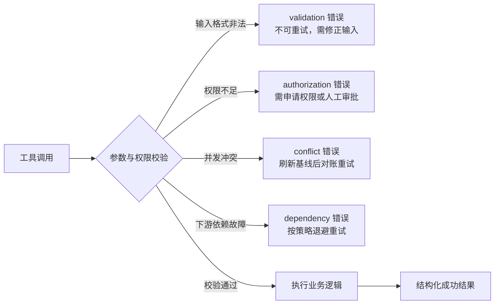

# 工具契约、错误处理与渐进式发现 (Tool Contracts, Errors, and Progressive Discovery)

> 模型完全基于你所定义的接口做出抉择。模糊的工具描述只会诱发模糊混乱的执行行为。

**Type:** Reference
**Languages:** Python
**Prerequisites:** [A Tool Loop Is Controlled Delegation](../../10-tool-use-and-agentic-loops/), [MCP Separates Capability From Host](../../11-mcp-server-design-and-integration/); Phase 13, Lesson 05
**Time:** ~120 minutes

## 学习目标

- 编写边界清晰、互不重叠的工具名称、功能描述与输入 Schema
- 设计引导模型安全自愈的结构化工具错误与 MCP 错误规范
- 审慎运用工具选择控制（Tool Choice）并按角色分配最少工具集
- 合理划分针对用户级与项目级的 MCP 作用域配置及凭据管理
- 在超大型工具库中落地渐进式发现（Progressive Discovery），同时牢固维系鉴权隔离

## 问题背景

一个 Agent 的可用工具列表中列出了三个工具：

- `search`
- `find`
- `lookup`

它们的描述都写着“用于查找信息”。然而在实现上，第一个工具用于抓取公开互联网网页，第二个工具用于查询企业内部客户核心档案，第三个工具用于检索经审批生效的法务合规政策。它们的输入 Schema 都只接收一个简单的字符串，遇到异常时直接返回一段自由格式的错误报错文本。

在实际运行中，模型的选择飘忽不定：处理外部公开调研时意外触发了私有客户数据库查询；回答合规政策疑问时却去调用搜索引擎抓取外网信息；当工具返回一段模糊的“failed”时，Agent 反复盲目重试，直到 Token 配额与交互轮次耗尽。

模型并没有失去工具调用能力，而是极其不规范的接口抹杀了做出正确决策所必需的所有区分边界。

## 核心概念

### 工具描述是模型决策面的核心部分 (A Tool Description Is Part of the Decision Surface)

一份严谨健壮的工具契约应当明确声明：

- 单一明确的操作动作与操作对象
- 何时应当使用该工具
- 何时严禁使用该工具（反向使用约束）
- 该工具访问的权威数据源边界
- 触发该操作所需的身份凭证或审批前置条件
- 各参数的业务语义及取值约束
- 成功返回与结构化异常的数据格式
- 伴随的外部系统副作用及其可逆性

请对比以下两个定义。模糊定义：

```json
{
  "name": "search",
  "description": "用于搜索信息",
  "input_schema": {
    "type": "object",
    "properties": {"q": {"type": "string"}}
  }
}
```

严谨定义：

```json
{
  "name": "search_active_support_policy",
  "description": "检索调用方所在地区已审批生效的服务支持政策文本。专用于政策条文与服务规范答疑。严禁用于查询客户账户明细或执行公开网页调研。返回附带权威数据源 ID 的带版本号政策段落。",
  "input_schema": {
    "type": "object",
    "properties": {
      "query": {"type": "string", "minLength": 3},
      "region": {"type": "string", "enum": ["uk", "eu", "us"]},
      "top_k": {"type": "integer", "minimum": 1, "maximum": 8}
    },
    "required": ["query", "region", "top_k"],
    "additionalProperties": false
  }
}
```

后一种接口不仅提供了精准的选择边界，还给出了输出格式承诺。后端服务在实际执行时，仍必须对用户身份凭证和地区权限进行刚性的安全校验。

### 坚决消除重叠工具 (Avoid Overlapping Tools)

当模型无法判断两个工具中究竟哪一个拥有该请求的处理权时，就发生了工具重叠。解决重叠的方法包括：

- 将功能相同的动作合并收敛到同一个工具之下
- 依据操作对象或权限边界进行清晰拆分
- 在工具命名中明确标示数据源类型或副作用性质
- 显式补充正面使用场景与反向禁用场景（Negative-use Guidance）
- 在 API 支持的前提下补充具有代表性的调用样例
- 针对容易混淆的工具对进行专门的模型选型评估测试

切勿试图在 System Prompt 中添加一堆打补丁式的提示词来掩盖工具库本身的混乱。

### 让 Schema 强制承载系统不变量 (Make Schemas Carry Invariants)

充分利用强类型、枚举值、必填字段、数值边界、正则约束以及关闭自由扩展属性（`additionalProperties: false`）。如果将入参定义为宽泛的字符串 `options`，校验压力就会被推给自然语言；通过类型化字段，能够让非法状态在语法层面就无法被表达。

然而，Schema 校验通过并不等同于业务语义合法。服务端在实际执行阶段，仍必须严密核查目标账户是否存在、操作金额是否合规、调用者是否具备执行授权，以及关联资源是否属于当前租户。

### 将错误作为结构化数据返回 (Return Errors as Data)


```mermaid
flowchart LR
    C["工具调用"] --> V{"参数与权限校验"}
    V -->|"输入格式非法"| E1["validation 错误\n不可重试，需修正输入"]
    V -->|"权限不足"| E2["authorization 错误\n需申请权限或人工审批"]
    V -->|"并发冲突"| E3["conflict 错误\n刷新基线后对账重试"]
    V -->|"下游依赖故障"| E4["dependency 错误\n按策略退避重试"]
    V -->|"校验通过"| X["执行业务逻辑"]
    X --> R["结构化成功结果"]
```

错误契约必须包含结构化字段：

- category (错误分类)
- retryable (是否允许重试的布尔标记)
- safe_message (可供模型理解的安全提示文案)
- field_errors (定位到具体字段的校验失败清单)
- partial_result (局部完成的结果及其溯源数据)
- suggested_next_action (建议采取的安全自愈动作)
- trace_id (便于排查审计的分布式调用追踪号)

严禁在错误信息中直接暴露堆栈异常、密码秘钥、原始凭据或内部服务器文件路径。切勿将所有错误一律盲目标记为可重试。

对于 MCP 工具，应当遵循协议规范中的结构化错误标识，并在内容主体中返回客户端能够解析的错误对象。网络传输成功与工具业务执行成功是完全独立的两个维度。

### 审慎运用工具选择策略 (Use Tool Choice Deliberately)

工具选择控制能够强制要求模型调用工具、允许自适应选择、指定必须调用某个特定工具，或者彻底禁用工具：

- 当业务流水线必须产生严格类型化的结构化对象时，使用强制工具选择（Forced Tool Choice）
- 当由模型自行决定是否需要借助外部能力时，使用自动选择（Automatic Choice）
- 严禁为了单纯获取 JSON 数据而强行触发具有现实破坏性副作用的写操作工具，应将信息抽取工具与业务执行工具解耦

在启用并行工具调用时，必须确保并发的工具调用彼此完全独立，且宿主运行时能够将各个执行结果与相应的调用 ID 准确关联对应。

### 实行最小权限的精简工具分发 (Distribute Fewer Tools)

工具清单不仅消耗上下文 Token，还会增加模型的抉择熵增。应根据 Agent 角色分配最小必需的工具集合：

- 文献调研 Agent：只分配只读性质的外部网页抓取和资料检索工具
- 合规审查 Agent：只分配生效政策库资源读取和政策搜索工具
- 退款评估 Agent：只分配案件阅读和退款金额测算工具
- 最终执行 Agent：仅分配具备明确边界的退款执行工具，且必须校验人工审批单

切勿为了开发图省事而将所有工具全量打包抛给每一个 Agent。

### 超大规模工具库采用渐进式发现 (Discover Large Catalogs Progressively)

对于包含数十乃至上百个工具的企业级平台，应当初始仅挂载常用核心工具与一个“能力发现与检索”工具。仅当当前任务确实展现出特定需求时，才动态加载专门工具的完整 Schema。

渐进式发现的优势在于：

- 极大地节约上下文窗口空间
- 减少候选干扰，大幅提升工具选型准确率
- 提高 Prompt Cache 的命中率与复用稳定性
- 显著缩小单次调用的安全审计暴露面

能力发现接口本身也必须实施租户隔离与身份鉴权，严禁向未授权上下文泄露高敏感工具的名称与参数细节。

### 严格划分 MCP 作用域与凭据配置 (Scope MCP Configuration)

项目级配置（Project Scope）纳入团队 Git 版本控制管理；用户级配置（User Scope）则适用于单台开发机或单个用户的全局环境。将团队共享的 MCP Server 声明与安全基准配置提交到项目仓库中；将本地个性化路径、私有调试选项以及个人认证 Token 隔离在受控环境之外。

在配置文件中通过环境变量引用敏感凭据，严禁将明文秘钥直接提交到版本库中。在接入 MCP Server 时，必须逐一严格审查其启动命令、入参、环境变量、传输协议来源及其暴露的所有工具接口。

MCP 协议包含 Tools、Resources 和 Prompts 三大基语，应根据控制流向审慎选型：

- Tool：由模型主动发起业务操作
- Resource：由宿主或模型按需读取上下文数据与文档
- Prompt：由用户或宿主调用的可复用提示词模版

切勿把所有静态的文档阅读逻辑全都不加思索地包装成具有调用开销的 Action Tool。

### 按意图选配 Claude Code 内置工具 (Choose Claude Code Built-In Tools by Intent)

遵循明确的工具职责分工：

- Read：读取已知路径的具体文件内容
- Glob：根据模式匹配快速扫描定位文件路径
- Grep：检索特定文本与代码符号
- Edit：对现有文件进行精准的受限局部补丁修改
- Write：从零创建全新文件或整文件覆盖
- Bash：用于运行构建命令、执行测试以及缺乏专门受限工具支持的运维操作

根据任务性质严格限制 Bash 与 Write 工具的分配。优先选用语义最明确、能够产生可审计审查证据的专门工具。

## Build It

## Interactive Lab

```figure
18-tool-discovery-contract
```

使用工具发现契约交互图，直观对比工具语义重叠、渐进式按需加载以及运行时执行鉴权的工作机制。动态切换不同的错误类别，观察系统何时应该触发重试、何时必须要求修正输入、何时需要申请审批，以及何时只能向上升级给人工处理。

## Practice Lab

人为构造一个存在重叠描述的工具定义，并将一个权限不足错误标记为允许重试。观察 Agent 陷入死循环的失控现场，随后重构该接口并修复错误恢复契约。

## Shipped Artifact

本课交付的标准评审产物位于 [`outputs/tool-catalog-review.md`](../outputs/tool-catalog-review.md)，其中明确划分了政策、账户和外部搜索的独立边界，并包含了完整的故障处理矩阵。

## Verify It

在本地执行工具契约的自动化静态审查：

```bash
cd certifications/claude/lessons/18-tool-contracts-errors-and-progressive-discovery
python3 code/main.py
python3 -m unittest discover -s code/tests -v
```

课后测验将全面考察针对工具接口设计、错误分类自愈与渐进式发现的核心考点。

## Capstone Connection

将这份经过审计的工具契约成果，作为工具规范与 MCP 接口索引直接接入到架构师基础场景大作业（Architect Foundations Capstone）中。

对照以下清单审计工具库的设计质量：

| 审查维度 | 核心验证手段 |
|----------|--------------|
| 每个工具名称是否清晰标识单一动作与对象？ | 工具选择评测集 |
| 正向使用与反向禁用场景是否界限分明？ | 混淆配对对比测试 |
| Schema 是否有效拦截非法数据形态？ | 输入校验单元测试 |
| 服务端是否严格实施语义核查与越权防护？ | 接口安全集成测试 |
| 错误信息是否结构化归类且明确重试语义？ | 故障注入测试用例 |
| 所有外部副作用是否均有明确命名与边界约束？ | 系统威胁建模分析 |
| 各角色的工具分配是否遵循最小可用集原则？ | 角色权限能力矩阵 |
| 超大规模工具集是否支持渐进式动态加载？ | 上下文与缓存命中监控 |
| 项目级共享配置与个人机密是否彻底分离？ | 配置文件安全审计 |
| 敏感秘钥是否采用环境变量引用而非硬编码？ | 代码仓库扫描拦截 |

构建至少包含 12 组用例的工具选择评估集，必须涵盖表面上可能同时匹配两个工具的歧义提问。只有当模型始终选对正确工具或正确判定无需使用任何工具时，评测才算通过。

注入参数校验失败、权限不足、并发冲突、频控超限、网络超时及局部返回等异常，验证运行时 Harness 是否严格根据错误类型采取差异化对策。

## Use It

在结构化信息抽取场景中，定义一个不产生外部副作用的专属 Tool，让该 Tool 的 Schema 精准匹配目标数据模型。在调用时配置强制工具调用。获取到数据后，必须由后端程序核查其业务语义合法性与溯源凭证。严禁把生产环境中具有写操作副作用的真实工具直接当作输出格式化模版来使用。

在大型企业级工具管理中，部署统一的工具注册表（Registry），基于具体业务域与租户权限执行按需检索。仅在上下文中动态装载筛选出的工具元数据。持续监测工具库整体体积、发现检索准确率、模型选型命中率、Prompt 缓存复用率以及未授权探测告警。

## Exam Decision Patterns

工具调用中出现的问题，本质上绝大多数都是接口设计问题。在试图增加繁琐的 Prompt 提示词之前，优先重构工具名称、正反边界说明、入参 Schema、按角色分发机制以及结构化错误协议。

在认证考核中，推荐的标准实践方案包括：

- 为工具赋予区分度极高的语义命名，并补充详尽的反向禁用指导
- 返回遵循 `isError` 标准的结构化对象，明确标定重试语义
- 在需要结构化返回值的节点通过 Tool Choice 实施类型约束
- 将团队共享的项目配置与个人私有秘钥坚决隔离
- 使用 Resource 承载只读上下文数据，使用 Tool 承载写操作动作
- 对庞大的工具集合实施动态的渐进式按需加载

坚决避免为了图一时方便而将所有工具全量倾倒在全局上下文中。

## Common Traps

### 误把工具描述当作权限防火墙 (Tool Description as Authorization)

在工具描述中写上一句“仅限管理员调用”，只是一段没有任何约束力的自然语言文本。服务端必须通过经过签名的身份凭证和授权策略来执行刚性拦截。

### 误把自然语言报错当作自愈指导 (Error Text as Recovery Policy)

当工具仅返回模糊的“failed”文本时，模型只能瞎猜应当重试、修改参数、请求授权还是立即放弃。必须返回机器可读的显式分类与重试指示。

### 设计无所不包的万能工具 (One Tool for Every Operation)

一个具有海量可选参数和复杂分支条件的超大工具，极难被模型准确选中，其参数校验和权限控制也会变得千疮百孔。应当沿着清晰的业务边界进行拆解。

### 将明文秘钥随项目配置一并提交 (Secrets in Shared Configuration)

项目级的配置文件是为团队版本协作设计的。敏感秘钥必须通过环境变量动态注入，严禁进入代码版本控制历史。

## Exercises

1. 重写五个存在语义模糊重叠的工具定义，为其划定泾渭分明的操作边界。
2. 针对内部数据、公开网页与合规政策检索场景，搭建一套混淆配对评估评测集。
3. 为多数据源并发检索中单源超时的场景，设计一份结构化的局部结果返回格式。
4. 将一个臃肿庞大的单体 MCP Server 拆分为独立的 Tools、Resources 与 Prompts 组合。
5. 编写一份符合规范的项目级与用户级 MCP 配置文件范式，确保不包含任何明文硬编码秘钥。

## Key Terms

| 术语 | 通俗说法 | 严谨工程定义 |
|------|----------|--------------|
| 工具契约 (Tool Contract) | 函数接口名 | 包含选择指导、输入 Schema、返回结构、异常分类、权限边界及副作用声明的完整协议 |
| 反向使用指导 (Negative-use Guidance) | 额外的补充说明 | 明确告知模型在哪些具体边界场景下严禁调用当前工具的约束文本 |
| 工具选择 (Tool Choice) | 工具开关权限 | 在请求级别显式控制 Claude 是否必须调用工具或指定调用特定工具的参数 |
| 渐进式发现 (Progressive Discovery) | 动态权限分配 | 依据当前上下文需求，在受控作用域内按需检索并动态装载工具能力的过程 |
| MCP 资源 (MCP Resource) | 一个读接口 | 依据标准协议通过 URI 寻址并读取的只读上下文数据实体 |
| 项目作用域 (Project Scope) | 全局公共配置 | 针对单一代码仓库或研发团队生效、受版本控制管辖的工程配置文件 |

## Further Reading

- [Claude 工具调用官方文档](https://platform.claude.com/docs/en/agents-and-tools/tool-use/overview)
- [MCP 开放协议最新规范](https://modelcontextprotocol.io/specification/latest)
- [Claude Code MCP 集成指引](https://docs.anthropic.com/en/docs/claude-code/mcp)
- 本教程 Phase 13 第 05 课：工具输入输出 Schema 设计规范
- 本教程 Phase 13 第 15 课：工具投毒（Tool Poisoning）威胁防御
