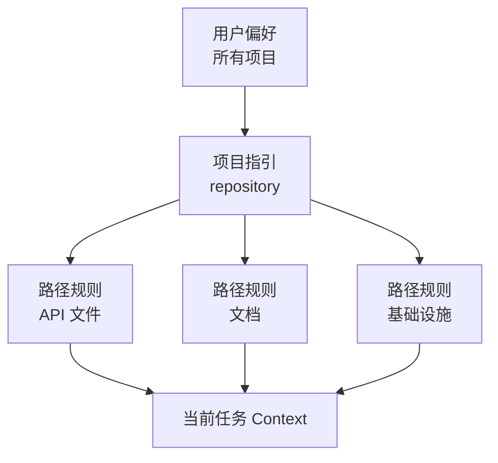

# Claude Code Memory、规则、Skills 与 CI

> 将稳定指引放在其适用范围内，将不可接受失败的约束落实为可执行机制。

**Type:** Reference
**Languages:** Python
**Prerequisites:** [Claude Code 通过共享约束实现规模化](../../15-claude-code-for-development-teams/), [Agent SDK Sessions、Subagents 与 Context](../../17-agent-sdk-sessions-subagents-and-context/)
**Time:** ~210 分钟

## Learning Objectives

- 设计不会造成 Context 膨胀的项目与用户指令层级
- 根据用途选择 CLAUDE.md、路径规则、Skills、Commands、Agents、Hooks 和 Settings
- 编写并分发具有严格 Tool 授权的真实多文件 `SKILL.md` 包
- 使用 Plan、直接执行和有边界的 Subagents，并提供明确的障碍报告
- 为可复现的 CI 证据配置 Headless Claude Code
- 防止陈旧 Memory、宽泛权限和隐藏的本地配置控制团队工作

## 问题

某个团队将所有指令都放在根目录的同一个 `CLAUDE.md` 中：架构历史、
格式规范、数据库规则、部署步骤、个人偏好、命令，以及六种语言的示例。
每项任务都会载入这些内容。

开发者添加了私有覆盖配置。CI 使用不同的配置。某个命令假定拥有写入权限。
一个范围宽泛的 Hook 会重新格式化不相关的文件。指令要求“始终运行所有测试”，
因此一次很小的文档编辑也会触发耗时 40 分钟的测试套件。当 Agent 忽略某条
安全规则时，团队就添加更多粗体文本。

问题不在于指令不足，而在于范围、优先级、渐进式披露，以及混淆了指引与强制执行。

## 概念

### 让机制匹配任务

| 机制 | 最佳用途 | 应避免 |
|-----------|----------|-------|
| `CLAUDE.md` | 简洁、稳定的 repository 指引和导航 | 完整手册、临时状态、机密信息 |
| 导入文件 | 保存在其负责人附近的共享辅助指令 | 循环或不可见的指令图 |
| 路径规则 | 仅适用于匹配文件的指引 | 复制到每项任务中的全局规则 |
| Skill | 在相关时载入的可复用流程或领域手册 | 一次性事实或硬性授权 |
| Command | 供用户显式调用的工作流兼容名称 | 缺少 Skill 结构的新多步骤包 |
| Agent | 具有隔离 Context 和 Tools 的有边界角色 | 确定性的实用函数 |
| Hook | 确定性验证、阻断、规范化或自动化 | 开放式语义判断 |
| Settings | 权限、Model、Plugin 和运行时配置 | 提交到 repository 的机密值 |

产品说明，已于 2026-08-09 核验：自定义 Commands 已合并到 Skills 中。
`.claude/commands/` 下的文件仍保持兼容，而
`.claude/skills/<name>/SKILL.md` 是新工作流的首选包结构。
确切字段、优先级和产品可用性可能发生变化。实施前请核验当前的
Claude Code 文档。2026 年 7 月的 CCAR-F 蓝图要求你理解层级、规则、
Commands、Skills、Agents、Memory、Plan 和 Headless 工作流。

### 保持根指令文件简洁

根文件应帮助有能力的新贡献者以正确方式开始工作。

应包含：

- 项目目的和不直观的架构边界
- 规范的构建、测试和格式化命令
- source-of-truth 文件
- 安全与范围约束
- 指向或导入更深入指引的链接
- 验证与贡献要求

应排除：

- 临时任务状态
- 生成的清单
- 冗长的 API 参考资料
- 个人编辑器设置
- 机密值
- 仅适用于某个目录的指令

将其视为 onboarding 路由器，而不是知识堆积区。

### 将指令放在其真实适用的最小范围内



用户范围保存不应定义团队行为的个人默认设置。项目范围保存受版本控制的共享决策。
仅当文件模式匹配时，才载入特定路径规则。任务指令包含当前请求。

当两条规则发生冲突时，应调查文档规定的优先级，并明确项目的 source of truth。
关键工作流不得依赖隐藏的本地覆盖配置。

### 导入稳定的辅助指引

使用导入机制，在保持根文件简洁的同时维持模块化归属。例如，数据库迁移政策
应放在数据库文档附近。根目录中的指针可以确保它容易被发现。

审计导入图：

- 每个目标都存在
- 不存在循环
- 不会因宽泛的文件导入而泄露机密或无关文本
- 负责人和更新触发条件清晰
- 指引被删除或重命名时会明确失败

Memory 检查命令可以帮助揭示当前生效的指令。使用它们调试配置，
不要用它们存储无法恢复的项目状态。

### 使用 Skills 实现渐进式披露

Skill 将可重复的方法、参考资料、脚本和产物打包在一起。它的 description
帮助 Agent 判断何时适用。只有选中 Skill 时才会载入完整正文，
从而为不相关工作保留 Context。

良好的 Skills 包括：

- 数据库迁移审查
- 事件分诊
- 发布说明生成
- 威胁建模检查清单
- 架构决策访谈

Skill 应定义输入、顺序、证据、输出和停止条件。它不应Embedding机密信息或授予权限。

真实的项目 Skill 位于 `.claude/skills/<skill-name>/SKILL.md`。
入口文件包含 YAML frontmatter 和 Markdown 指令：

```yaml
---
name: migration-review
description: 当变更在 migrations/ 下添加或修改路径时审查数据库迁移文件。在合并前使用它收集前向迁移、回滚、锁定和数据安全证据。
allowed-tools: Read Grep Glob Bash(python3 ${CLAUDE_SKILL_DIR}/scripts/check_scope.py *)
---
```

description 是触发契约。使用开发者实际会使用的语言说明 Skill 的作用及其适用时机。
测试应触发的请求以及不应触发的近似请求。当 Skill 只能通过显式
`/skill-name` 调用载入时，使用 `disable-model-invocation: true`。

`allowed-tools` 会为本次调用预先批准匹配的 Tools。它不会限制可用 Tool 集合、
覆盖 deny 规则或作为 Session 授权持续生效。将模式严格限定在已打包流程所需的范围内，
并在接受文件夹信任前审查项目 Skills。

将细节移出 `SKILL.md`，并有意引导到对应文件：

| Skill 文件 | 用途 | 载入条件 |
|---|---|---|
| `SKILL.md` | 触发条件、核心顺序、停止条件、输出契约 | 调用 Skill 时 |
| `references/review-checklist.md` | 详细的领域证据 | 核心顺序进入审查阶段时 |
| `scripts/check_scope.py` | 确定性的路径验证 | 读取请求的迁移文件前 |
| `examples/accepted.md` | 一种具有代表性的输出形式 | 格式存在歧义时 |

从 `SKILL.md` 引用每个辅助文件，使 Claude 知道为何以及何时打开它。
通过 `${CLAUDE_SKILL_DIR}` 解析包内路径，不要假定当前工作目录。
[`outputs/migration-review-skill/`](../outputs/migration-review-skill/)
下交付的包是一个可运行示例。

### 使用 Commands 表达显式用户意图

当用户有意调用可重复工作流时，Commands 很有用。应定义参数提示、允许使用的
Tools 和执行 Context。如果某个 Command 需要隔离，请在受到支持且适用时使用
forked Context。

示例：

- 审查一个迁移文件
- 根据访谈生成 ADR
- 运行定向测试计划
- 检查失败的 CI trace

避免使用会静默写入、部署或拥有宽泛 Bash 访问权限的 Commands。
名称和参数契约应明确说明后果。

对于新工作，应将这种显式工作流实现为用户可调用的 Skill。
现有 `.claude/commands/<name>.md` 文件仍会创建 `/<name>`，
并且可以在不中断用户使用的情况下迁移。如果流程需要脚本、参考资料、模板、
调用控制或通过 Plugin 分发，应优先选择 Skill 目录。

### 将 Subagents 用作有边界的证据收集者

运行 `/agents` 创建和管理可复用的 Subagent 定义。将项目 Agent 存储在
`.claude/agents/` 下，以便与 codebase 一起接受审查。
`description` 告知 Claude 何时委派；`tools` 限制其 Tool 池；
`maxTurns` 提供严格的轮次预算；`isolation: worktree` 为执行编辑的
Agent 提供独立 checkout。

```markdown
---
name: migration-auditor
description: 当变更涉及 migrations/ 时审计迁移安全性。返回证据和阻塞项；不要编辑。
tools: Read, Grep, Glob, Bash
maxTurns: 10
isolation: worktree
---

仅检查分配的迁移及相邻 schema 代码。
在十轮或二十分钟后停止，以先到者为准。
返回包含 status、evidence、blockers 和 next_step 的 JSON。
绝不要用假设替代缺失的证据。
```

轮次或时间限制是停止条件，不是完成证据。父 Session 验证结果并负责集成。
要求提供结构化障碍报告，使无法访问文件的 Subagent 返回
`status: blocked`、确切障碍、已尝试获取的证据和严格限定的 `next_step`，
而不是静默扩大 Tools 或范围。

只有当 Subagent 执行编辑时才使用 worktree 隔离。只读研究者通常只需要独立 Context。
Worktrees 隔离文件和分支，但不隔离网络、凭据、共享 Git 元数据或外部系统。

### 通过最小的共享表面分发

根据受众选择分发方式：

- 为单个 repository 提交 `.claude/skills/` 和 `.claude/agents/`。
- 当多个 repository 需要同一个受版本控制的包时，将 Skills、Agents、Hooks
  和 MCP 定义放入 Plugin。
- 通过经过审查的 marketplace 发布 Plugins，并固定 release 或 commit。
- 使用 managed Settings 管理组织政策和 marketplace 限制，
  不要将其作为存放每个团队流程的杂物区。

项目可以在 `.claude/settings.json` 中公布 marketplace 并启用经过审查的
Plugins：

```json
{
  "extraKnownMarketplaces": {
    "company-tools": {
      "source": {"source": "github", "repo": "company/claude-plugins"},
      "autoUpdate": false
    }
  },
  "enabledPlugins": {
    "migration-review@company-tools": true
  }
}
```

文件夹信任仍然重要，而 managed `strictKnownMarketplaces` 可以在任何网络或
文件系统操作前限制用户可添加的来源。审查发布者、版本、组件、脚本、Hooks、
MCP servers、权限、更新和回滚。项目默认值是团队配置；managed Settings
是不可覆盖的组织政策。

### 将路径规则用作局部政策

路径 glob 可以表达以下规则：

- API 变更需要契约测试
- 迁移文件只能追加
- 文档使用特定风格
- 生产配置不能包含字面量机密信息

测试 glob 行为。永不匹配的规则会制造虚假信心。匹配整个 repository 的 glob
则会再次造成根文件膨胀。

### 分离 Plan、探索和执行

当修改前需要批准范围或策略时，使用 Plan mode。对于原本会使主任务膨胀的只读
codebase 问题，使用探索型 Subagent。当变更已有明确边界，且下一项安全操作
显而易见时，直接执行。

需求缺失时，访谈模式很有用。询问会实质性改变实现的问题，记录决策，然后构建。

当示例和测试展现真实的验收边界时，它们能够提高一致性。不要添加只会重复指令的示例。

### 让测试成为对话契约的一部分

对于代码任务：

1. 确定行为和最小相关验证。
2. 在可行时建立或编写一个失败测试。
3. 进行有边界的变更。
4. 运行聚焦测试。
5. 运行与风险相称的更广泛关卡。
6. 检查实际产物或行为。
7. 报告确切证据和剩余不确定性。

Claude 可以提出并执行这一循环，但确定性 CI 决定关卡是否通过。

### Hook 决策需要精确契约

Claude Code 向 Hooks 发送 JSON。Command Hook 要么以 `0` 退出并向 stdout
打印一个结构化 JSON 对象，要么以 `2` 退出并向 stderr 写入阻塞原因。
不要混用两者，因为只有在退出码为 `0` 时才会解析 JSON。
对于大多数事件，退出码 `1` 不会阻塞。

事件 schema 不能互换。`PreToolUse` 使用
`hookSpecificOutput.permissionDecision`，其值可以是 `allow`、`deny`、
`ask` 或 `defer`。`PermissionRequest` 使用
`hookSpecificOutput.decision.behavior`，其值可以是 `allow` 或 `deny`。
已配置的 deny 和 ask 规则仍会被评估；allow 结果不会覆盖匹配的 deny 规则。

```json
{
  "hookSpecificOutput": {
    "hookEventName": "PermissionRequest",
    "decision": {
      "behavior": "deny",
      "message": "生产环境访问需要交互式批准"
    }
  }
}
```

确认退出码 `2` 是否可以阻塞所选事件。它会阻塞 `PreToolUse` 并拒绝
`PermissionRequest`；但无法撤销由 `PostToolUse` 观察到的操作。

### 将 Headless CI 设计为全新的审查者

Headless Claude Code 可以通过 print mode 和结构化输出进行非交互式运行。
使用前核验当前 flags 和 schemas。持久原则包括：

- 从干净的 commit 和声明的输入开始
- 使用最小权限的 Tools 和 Settings
- 固定或记录 Model 和配置
- 设置时间、轮次和成本限制
- 请求 JSON 或受 schema 约束的输出
- 将 findings 生成与变更应用分离
- 在需要时运行独立审查
- 检查修复时明确包含先前 findings
- 以确定性测试和政策关卡为权威

CI 不应继承开发者的交互式 Session。可复现性需要全新状态。

产品说明，已于 2026-08-09 核验：Anthropic 的 managed Code Review 产品
是 Team 和 Enterprise 计划的 research preview。它与官方 GitHub Action
是两种独立的运维选择。Managed Code Review 会报告 pull request findings，
但不会批准或阻止合并。
`anthropics/claude-code-action@v1` 在 repository 工作流中运行，
并显式指定事件、GitHub 权限、secret 来源、Settings、Tools、Model 和轮次限制。
两者都不能替代确定性关卡或受保护的合并路径。

### 跨运行保留 Findings

如果一次运行发现问题，另一次运行验证修复，请将 findings 存储为结构化产物，
其中包含稳定 ID、文件、证据、严重程度和状态。仅传递自然语言摘要可能丢失
正在验证的确切主张。

修复审查接收原始 finding、当前 diff、相关测试和验收规则。
它不需要接收完整的原始对话。

## Build It

## Interactive Lab

```figure
19-memory-rule-precedence
```

使用优先级探索器，将稳定的项目事实、特定路径指引、可复用 Skills、Commands
和确定性 Hooks 分配到其真实适用的最小范围。冲突的层级会说明为何隐藏的本地政策
不能管理 CI。

## Practice Lab

破坏一个已记录的路径 glob，检查哪些 fixture 路径会载入规则，然后修复范围，
同时不要将局部指引移回根文件。随后使用一个迁移路径和一次目录遍历尝试运行
已交付的 Skill 检查器：

```bash
python3 outputs/migration-review-skill/scripts/check_scope.py migrations/2026_add_index.sql
python3 outputs/migration-review-skill/scripts/check_scope.py ../secrets.sql
```

## Shipped Artifact

已填写的 [`outputs/configuration-scope-audit.md`](../outputs/configuration-scope-audit.md)
记录了经过测试的 glob fixtures、一个 allow 与 deny 边界、一个有边界的
Subagent、Plugin 分发、精确的 Hook 输出以及全新的 CI 契约。
[`outputs/migration-review-skill/`](../outputs/migration-review-skill/) 目录
交付一个真实的 `SKILL.md`、确定性脚本和按需载入的参考资料。

## Verify It

无需 Claude、网络访问或凭据即可验证：

```bash
cd certifications/claude/lessons/19-claude-code-memory-rules-skills-and-ci
python3 code/main.py
python3 -m unittest discover -s code/tests -v
```

测验检查机制选择和 CI 修复。

## Capstone Connection

在 Architect Foundations capstone 的 Claude Code 配置章节中复用结果。

为包含 Python API 代码、数据库迁移和文档的 repository 设计团队配置。

### 根目录指引

将其保持在一页可读内容以内。包含项目地图、规范命令、安全约束和路径规则链接。

### 路径规则

分别为以下路径创建规则：

- `src/api/**`：契约与授权测试
- `migrations/**`：只能追加和回滚要求
- `docs/**`：风格与链接检查

### Skills 与 Commands

将已交付的 migration-review 包安装为
`.claude/skills/migration-review/`，测试一次触发和一次近似但不触发的请求，
并保留其严格限定的 `allowed-tools` 授权。当显式 `/adr` Command 需要模板
或脚本时，将其迁移为 Skill。

通过 `/agents` 定义一个只读 migration-auditor。为其设置 `maxTurns`、
结构化的 `status` / `evidence` / `blockers` / `next_step` 结果，
并规定在证据缺失时停止而不是进行假设。

### Hooks

- 写入前：阻止声明范围之外的文件
- 编辑后：仅对已编辑文件运行 formatter
- Bash 前：拒绝破坏性命令或输出 secret 的命令
- 停止时：要求精确的验证证据

### CI 审查

运行全新的只读审查并输出 JSON findings。由独立 job 应用确定性测试和政策检查。
存储这两类产物。

随后测试配置调试：引入一个无法匹配的路径 glob，并证明审计能够发现它。

## Use It

配置应像代码一样接受审查。变更可能会改变权限、Context、Tools 和自动化行为。

以下变更需要审查：

- 新增 MCP servers 或 Plugins
- 扩大 Tool 权限
- 具有写入或命令效果的 Hooks
- Model 或 provider 变更
- 新增导入和路径模式
- 会访问外部系统的 Skills
- 拥有更广泛 Tools、更高轮次限制或 worktree 隔离的 Agents
- Plugin marketplaces、启用的 Plugins 和自动更新政策
- 可以应用变更的 CI 工作流

使用小型 fixture 任务记录当前行为。配置测试可以断言：迁移指引只针对迁移路径载入、
危险命令会被阻止，并且审查命令返回预期 schema。

## 考试决策模式

当指令过于庞大或仅适用于部分文件时，将其移至有范围限制的规则或 Skills。
当某项条件绝不能被违反时，应使用确定性的 Settings、权限、Hooks 或 CI，
而不是使用措辞更强硬的 Prompt。

优先选择符合以下条件的答案：

- 保持 `CLAUDE.md` 简洁并受版本控制
- 对局部指引使用导入和特定路径规则
- 将可复用工作流打包为 Skills 或显式 Commands
- 编写 Skill 触发 description、辅助文件和严格限定的调用授权
- 通过 Tool 集合、轮次、归属和结构化障碍报告限制 Subagents
- 直接分发单项目配置，并将跨项目包作为经过审查的 Plugins 分发
- 在需要时为隔离的 Command 工作 fork Context
- 在大范围编辑前使用 Plan 或探索
- 从干净状态运行 Headless CI，并生成结构化输出
- 根据先前 finding ID 验证修复

## 常见陷阱

### 将根文件用作百科全书

所有内容会在所有地方载入。重要约束与无关细节相互竞争，并在缺乏负责人时逐渐失效。

### 将私有配置用作团队政策

本地行为无法在 CI 中审查或复现。将共享决策放在项目范围内。

### 将 Hook 用作隐藏的构建系统

不透明的自动化会使命令产生意外效果，也会使失败难以定位。保持 Hooks 小巧且可观察。

### 将 AI 审查用作唯一关卡

Model findings 为判断提供支持。确定性测试、schemas、安全政策和批准机制负责强制执行不变量。

## 练习

1. 将过度膨胀的根指令文件精简为一页式路由器。
2. 设计路径规则并编写 fixture 路径，证明每个 glob 都能匹配。
3. 将一个 200 行工作流 Prompt 转换为包含触发测试、参考文件和确定性脚本的多文件 Skill。
4. 通过 `/agents` 创建一个只读 Subagent；限制轮次并测试其 blocked 障碍报告。
5. 使用各自不同的 JSON 结构验证一次 `PreToolUse` 拒绝和一次 `PermissionRequest` 拒绝。
6. 将 Skill 和 Agent 打包为 Plugin，将其固定在测试 marketplace 中，并记录回滚方式。
7. 创建带有稳定 finding ID 的只读 Headless 审查 schema。

## 关键术语

| 术语 | 人们怎么说 | 实际含义 |
|------|-----------------|------------------------|
| CLAUDE.md | 永久的 Model Memory | 根据文档规定的范围载入、受版本控制的项目指引 |
| 路径规则 | 额外 Prompt | 仅针对匹配文件路径激活的指引 |
| Skill | Command 别名 | 按需载入、包含指令、参考资料、Tools 和输出的可复用流程 |
| Command | 自动化魔法 | 用户显式调用、包含参数、Tools 和 Context 行为的工作流 |
| `allowed-tools` | sandbox | Skill 调用轮次中针对匹配 Tools 的临时预批准 |
| Subagent | 无限制的并行工作者 | 具有明确角色、Tools、轮次预算和结果契约的独立 Context |
| Plugin | Prompt 文件 | 包含 Skills、Agents、Hooks、MCP servers 和相关配置的受版本控制包 |
| Hook | Model 指令 | 围绕生命周期事件执行的确定性代码 |
| Headless mode | 没有 UI 的交互式聊天 | 基于声明输入、生成机器可读输出的非交互式执行 |

## 延伸阅读

- [Claude Code Memory 文档](https://code.claude.com/docs/en/memory)
- [Claude Code Skills](https://code.claude.com/docs/en/skills)
- [Claude Code Subagents](https://code.claude.com/docs/en/sub-agents)
- [Claude Code worktrees](https://code.claude.com/docs/en/worktrees)
- [Claude Code Settings](https://code.claude.com/docs/en/settings)
- [Claude Code Plugin marketplaces](https://code.claude.com/docs/en/plugin-marketplaces)
- [Claude Code Hooks](https://code.claude.com/docs/en/hooks)
- [Claude Code managed Code Review](https://code.claude.com/docs/en/code-review)
- [Claude Code GitHub Actions](https://code.claude.com/docs/en/github-actions)
- [Claude Code Headless mode](https://code.claude.com/docs/en/headless)
- Phase 14 的第 33 至 38 课，涵盖可执行指令、状态、范围和验证
