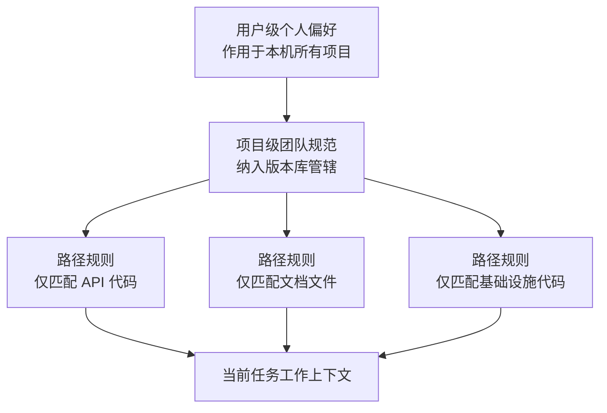

# Claude Code 记忆、规则、Skill 与持续集成 (Claude Code Memory, Rules, Skills, and CI)

> 将稳定的指导原则置于其真实生效的作用域内，而在绝不容许失败的关键卡点上部署确定性的可执行约束。

**Type:** Reference
**Languages:** Python
**Prerequisites:** [Claude Code 借助共享约束实现团队规模化应用](../../15-claude-code-for-development-teams/), [Agent SDK 会话、Subagent 与上下文管理](../../17-agent-sdk-sessions-subagents-and-context/)
**Time:** ~210 minutes

## 学习目标

- 设计避免上下文膨胀的项目级与用户级指令分层体系
- 依据具体业务目的精准选用 CLAUDE.md、路径规则（Path Rules）、Skills、命令（Commands）、Agents、Hooks 与系统设置
- 编写并分发包含狭窄工具授权的多文件标准 `SKILL.md` 扩展包
- 运用规划模式（Plan Mode）、直接执行以及附带显式障碍反馈的受限 Subagent
- 配置无头（Headless）Claude Code，输出具备高度可复现性的 CI 审查证据
- 防止过时记忆、宽泛权限以及隐式本地配置干扰团队协同开发

## 问题背景

一个研发团队将所有规范指令塞进了根目录下的 `CLAUDE.md`：架构演进历史、代码格式规范、数据库操作禁忌、生产部署步骤、个人偏好习惯、常用命令行缩写，甚至还包括六种编程语言的代码样例。这个巨大的文件在每一次任务启动时都会被全量复制进上下文。

随后，开发者们开始在本地各自添加私有覆盖规则；CI 流水线中又是另一套完全不同的配置；某个命令默认假设自己拥有本地文件的写权限；一个宽泛触发的 Hook 意外格式化了大量无关文件；指令中写着“每次修改必须运行全部测试”，导致一个微小的文档修改触发了长达 40 分钟的全量测试套件；而当 Agent 忽视某条安全规范时，团队唯一能想到的办法是在 Prompt 里追加更多加粗高亮的大写英文单词。

系统的真正症结从来不是指令不够详尽，而是作用域混乱、优先级缺失、未采用渐进式披露（Progressive Disclosure），以及将软性的文本指导与硬性的代码门禁混为一谈。

## 核心概念

### 将机制与具体任务精准匹配 (Match the Mechanism to the Job)

| 机制 | 最佳使用场景 | 必须避免的误用 |
|------|--------------|----------------|
| `CLAUDE.md` | 精炼稳定的代码库指引与外部导航入口 | 堆砌完整手册、存储临时状态、硬编码敏感秘钥 |
| 导入文件 (Imported files) | 按职责模块拆分、由各模块属主维护的共享指令 | 构造循环引用或隐蔽不可见的指令拓扑图 |
| 路径规则 (Path rules) | 仅对匹配特定文件路径模式生效的定向规则 | 变成通配全局规则，重新退化为上下文污染源 |
| Skill | 按需加载的可复用业务流程、领域规范或知识手册 | 记录一次性临时事实，或试图充当刚性鉴权门禁 |
| 命令 (Command) | 用户显式触发特定重复工作流的入口别名 | 编写复杂的多步骤流程而不采用标准的 Skill 目录包 |
| Agent | 具备独立上下文窗口与特化工具集的受限角色 | 包装确定性的单步基础工具函数 |
| Hook | 确定性的参数校验、拦截阻断、输出归一化或自动化构建 | 处理需要模型自适应语义理解的开放式裁决 |
| 设置 (Settings) | 权限控制、模型版本、插件启停及运行时核心配置 | 在受版本控制跟踪的文件中提交明文机密 |

产品细节说明（2026-08-09 校验）：Claude Code 已将自定义命令（Custom Commands）全面整合进 Skill 体系。`.claude/commands/` 目录下的老文件依然保持兼容，但对于新工作流，标准目录推荐采用 `.claude/skills/<name>/SKILL.md`。字段规范、继承优先级及产品功能细节可能会随版本演进，请在落地前核对当前 Claude Code 官方文档。2026 年 7 月发布的 CCAR-F 架构师认证考纲要求考生透彻理解层级体系、规则、命令、Skills、Agents、记忆机制、规划模式以及无头流水线。

### 保持根指令文件极其精炼 (Keep the Root Instruction File Small)

根目录下的指导文件应当扮演高水平新员工的“入职导引脚本”，确保新会话能够以极低开销快速切入正题。

应当包含的内容：

- 项目核心愿景、技术栈与非显而易见的架构边界
- 权威的本地构建、单元测试、语法检查与格式化命令
- 权威数据源与决策记录的位置指引
- 安全底线与受限操作边界声明
- 通往更深层次专业指导文档的链接或导入语句
- 质量验收与代码提交的贡献门禁标准

坚决排除的内容：

- 临时的任务待办进展与即时状态
- 机器自动生成的资源清单
- 大篇幅的 API 参考字典全文
- 开发者个人的 IDE 编辑器偏好
- 任何明文密码、API Token 或敏感连接串
- 仅适用于某单个子目录的局部规则

将其定位为轻量级路由分发器，而不是无所不包的知识倾倒场。

### 在最小真实作用域内放置指令 (Place Instructions at the Narrowest True Scope)


```mermaid
flowchart TD
    U["用户级个人偏好\n作用于本机所有项目"] --> P["项目级团队规范\n纳入版本库管辖"]
    P --> R1["路径规则\n仅匹配 API 代码"]
    P --> R2["路径规则\n仅匹配文档文件"]
    P --> R3["路径规则\n仅匹配基础设施代码"]
    R1 --> T["当前任务工作上下文"]
    R2 --> T
    R3 --> T
```

用户级作用域（User Scope）只承载个人的本地开发习惯，绝不能覆盖或定义团队协作行为；项目级作用域（Project Scope）沉淀纳入版本控制的团队共同决策；针对具体文件路径的定向规则（Path Rules），只有在其通配符真正匹配到待处理文件时才被激活注入；而任务提示词（Task Instructions）仅表述当前交互的具体需求。

当两条规则发生冲突时，应查阅官方文档规定的优先级层级，使项目级的权威事实来源显式可见。绝不能让关键的核心业务流水线依赖于某台机器上隐蔽的本地覆盖配置。

### 模块化导入稳定的支撑规范 (Import Stable Supporting Guidance)

借助导入机制（Imports），既能保持根目录文件的紧凑，又能保留领域指导的属主隔离。例如，数据库迁移的审查规范应当存放在数据库目录文档附近，根文件只需提供清晰的导入指针即可维持发现能力。

对导入依赖图进行审计：

- 每个导入目标路径必须真实存在
- 严禁出现互相导入的环形依赖（Cycles）
- 严禁通过宽泛的文件通配引入敏感秘钥或大量无关冗余文本
- 明确每个被导入规范的维护属主与更新触发条件
- 当引用的规范文件被误删或重命名时，系统必须能够显式报错拦截

可以利用内存检查命令（Memory Inspection）查看当前已激活的指令清单。这些命令应用于调试系统配置，而非用于暂存无法恢复的工程状态。

### 运用 Skill 实现渐进式披露 (Use Skills for Progressive Disclosure)

一个标准 Skill 是由重复流程、参考文档、辅助脚本与模版产物组成的完整封装包。其前置描述（Description）用于让 Agent 判断何时需要调用该技能。只有当其被准确命中触发时，完整的提示词正文才会被加载进上下文，从而避免对不相关的日常任务造成干扰和上下文浪费。

适合封装为 Skill 的场景包括：

- 数据库迁移安全审查
- 线上故障排查与分诊
- 发布版本变更日志（Release Notes）生成
- 威胁建模安全核对
- 架构设计决策访谈

Skill 必须清晰定义输入要求、执行次序、需收集的证据、预期输出以及终止判定条件。Skill 绝不能硬编码任何机密，也不应被赋予越权操作许可。

标准的项目级 Skill 存放在 `.claude/skills/<skill-name>/SKILL.md`。入口文件包含 YAML 元数据 Frontmatter 与 Markdown 正文说明：

```yaml
---
name: migration-review
description: 当修改或新增 migrations/ 目录下的文件时审查数据库迁移安全性。在代码合规合并前使用它收集前向变更、回滚方案、锁表风险以及数据安全证据。
allowed-tools: Read Grep Glob Bash(python3 ${CLAUDE_SKILL_DIR}/scripts/check_scope.py *)
---
```

前置描述本身就是一份触发契约。使用真实开发者下达指令的语言习惯，清晰界定该 Skill 能做什么以及何时应当生效。必须设计评测集，既测试理应命中的指令，也测试语义接近但应当排除的边缘指令。如果某个流程只允许通过显式的 `/<skill-name>` 斜杠命令触发，可配置 `disable-model-invocation: true`。

`allowed-tools` 字段会在执行该 Skill 的当前轮次对匹配的工具预先放行。它并不会缩小系统整体的可用工具范围，无法跨越明确的 Deny 拒绝规则，更不会永久改变后续会话的全局权限。应将工具白名单收敛到该技能所需的最小范围，并在拉取外部仓库的 Skills 时务必先审查其权限要求。

将冗长繁复的细节从 `SKILL.md` 剥离，通过目录分层按需调取：

| Skill 内部文件 | 核心职责 | 实际加载条件 |
|----------------|----------|--------------|
| `SKILL.md` | 触发条件、核心执行序列、终止门禁与输出契约 | 当该 Skill 被命中激活时加载 |
| `references/review-checklist.md` | 深入的领域规则与详尽核对项 | 当核心流程推进到专项审查环节时按需读取 |
| `scripts/check_scope.py` | 确定性的文件路径合法性校验脚本 | 在正式读取用户指定的迁移脚本前执行校验 |
| `examples/accepted.md` | 标准合格输出样例展示 | 当模型对产物输出格式存在歧义时参考 |

在 `SKILL.md` 中引用所有辅助文件，指导 Claude 何时以及为何需要打开它们。在脚本和命令中通过 `${CLAUDE_SKILL_DIR}` 解析包内相对路径，避免盲目假设当前命令行终端的工作目录。本课产物中的 [`outputs/migration-review-skill/`](../outputs/migration-review-skill/) 就是一个标准的可运行范例。

### 使用命令承载显式用户意图 (Use Commands for Explicit User Intent)

当开发者需要由人工主动触发某个高度可复现的工作流时，命令机制是极佳的入口。明确为其定义参数提示、授权工具集与运行上下文。如果该命令的操作存在潜在风险，可在支持的环境中为其配置派生隔离的上下文（Forked Context）。

典型应用场景：

- 针对单个指定文件触发数据库迁移审查
- 通过交互式问答访谈自动生成架构决策记录（ADR）
- 执行定向的测试用例验证计划
- 深入解析某次 CI 运行失败的分布式调用链路

坚决避免编写在后台静默修改文件、直接触发生产部署或滥用全局 Bash 权限的危险命令。命令的命名规范与参数契约必须让使用者对潜在后果一目了然。

对于新建工程，推荐将这类显式工作流统一规范为支持显式调用的 Skill。历史遗留的 `.claude/commands/<name>.md` 文件仍能映射为 `/<name>` 指令，可平滑迁移。当工作流程需要配合配套脚本、参考文档、输出模版或准备通过插件跨项目分发时，更应当采用标准的 Skill 目录结构。

### 将 Subagent 作为受限的证据收集器 (Use Subagents as Bounded Evidence Gatherers)

通过 `/agents` 交互界面可以方便地创建并统一维护可复用的 Subagent 定义。将项目级的 Agent 配置统一保存在 `.claude/agents/` 目录下，以便其角色设定与核心代码一同接受团队 Code Review。`description` 告知 Claude 何时应将任务下放给该 Agent；`tools` 强制约束其能够使用的工具池；`maxTurns` 设定不可逾越的交互轮次刚性上限；`isolation: worktree` 则为需要执行写操作的编辑 Agent 配备完全独立的 Git 工作区镜像。

```markdown
---
name: migration-auditor
description: 当改动触及 migrations/ 目录时审计迁移脚本安全性。专注于提取支持证据与阻塞性风险，严禁直接修改文件。
tools: Read, Grep, Glob, Bash
maxTurns: 10
isolation: worktree
---

仅允许检查指派给你的迁移脚本及直接相关的数据库 Schema 定义代码。
在完成 10 轮交互或耗时达到 20 分钟时必须强制停止（以先到者为准）。
必须返回包含 status、evidence、blockers 和 next_step 的标准 JSON。
严禁在缺乏权威事实依据时凭空推测或虚构假设。
```

轮次上限或超时机制只是防止失控死循环的终止保护网，绝不能当作任务已经圆满完成的证明。父级协调会话必须负责校验子任务交付的成果，并把控整体合并。强制要求子 Agent 具备结构化的障碍报告能力（Obstacle Reporting）：当遭遇无权访问的文件时，必须返回 `status: blocked`、精确记录遭遇的阻碍、已收集到的现有证据以及极其受限的 `next_step` 建议，严禁在遇阻时私自放宽工具权限或擅自扩大扫描范围。

仅在 Subagent 确实需要落盘修改代码时才分配 Worktree 隔离。对于只读性质的探索调研 Agent，通常只需要一个纯净独立的上下文即可。请清醒认识到：Worktree 仅隔离了文件系统的暂存区与分支指针，并不能隔离网络访问、系统环境变量、共享的 `.git` 元数据或远程外部系统。

### 通过最小共享表面分发能力 (Distribute Through the Smallest Shared Surface)

根据受众范围选择最合适的分发通道：

- 针对单一代码仓库：直接将 `.claude/skills/` 与 `.claude/agents/` 提交至版本库。
- 针对跨多个代码仓库复用相同标准套件：将 Skills、Agents、Hooks 与 MCP 服务定义打包为版本化插件（Plugin）。
- 插件发布：通过经过严格安全审查的私有 Marketplace 统一分发，并在配置中锁定具体的 Release 版本或 Git Commit 摘要。
- 组织全局策略：利用集中托管设置（Managed Settings）统管企业安全红线与插件市场准入白名单，切勿将其沦为堆砌各业务线琐碎流程的垃圾场。

项目可在 `.claude/settings.json` 中声明可信市场并启用指定版本的插件：

```json
{
  "extraKnownMarketplaces": {
    "company-tools": {
      "source": {"source": "github", "repo": "company/claude-plugins"},
      "autoUpdate": false
    }
  },
  "enabledPlugins": {
    "migration-review@company-tools": true
  }
}
```

目录可信度管理依然必不可少，企业托管的 `strictKnownMarketplaces` 配置能够在任何网络或文件操作触发前，从底层限制用户可以自行接入的外部插件源。接入前必须严格审计插件发布者、具体版本、包含组件、运行脚本、生命周期 Hooks、MCP 连接定义、申请权限、升级机制及紧急回滚方案。项目级配置代表团队开发共识，而集中托管配置代表绝不容许覆盖的组织安全合规红线。

### 采用路径规则实施局部策略 (Use Path Rules as Local Policy)

利用路径通配符（Path Globs）可以精准实施局部防线：

- 对 `src/api/**` 的改动必须同步提供契约测试
- `migrations/**` 目录下的 SQL 文件必须严格遵循只追加、不可原地篡改的规范
- 文档目录 `docs/**` 必须遵循统一的排版规范与死链检测
- 生产环境配置文件中严禁出现明文字符串秘钥

必须编写测试验证 Glob 通配规则的命中情况。一条从未成功匹配过的规则只会给团队带来虚假的安全感；而一条通配全局的宽泛规则又会重蹈根文件上下文膨胀的覆辙。

### 明确分离规划、探索与实际执行 (Separate Planning, Exploration, and Execution)

在对代码库造成任何实质性修改前，若操作涉及复杂范围或架构演进，必须优先启用规划模式（Plan Mode）以待人工审查批准。对于仅为了理解代码逻辑而发起的只读性全局检索，应派遣探索 Subagent 在隔离上下文中完成，防止无关文件的全文输出挤爆主会话。仅当修改范围已经极其清晰、下一步安全动作毫无争议时，才允许直接进入执行模式。

在需求存在模糊地带时，采用结构化访谈模式（Interview Pattern）。主动抛出能对系统实现产生决定性影响的关键抉择点，明确记录各方决策，随后再开始敲定实现方案。

代码示例与自动化测试能显著提升模型输出的稳定性，但前提是它们清晰界定了真实的验收边界。严禁盲目追加一堆仅仅重复自然语言指令的空洞代码范例。

### 将自动化测试融入对话契约 (Make Tests Part of the Conversation Contract)

面向代码修改的标准交互闭环：

1. 明确目标行为并定位最小的关联验证用例。
2. 尽可能优先复现或编写一个能够稳定红灯报错的失败测试。
3. 实施高内聚、有明确边界的代码局部修改。
4. 针对性运行受影响的定向测试用例。
5. 依据变更风险梯次触发更广泛的集成门禁。
6. 实地审查生成的代码产物与运行时真实表现。
7. 向用户汇报精确的测试证据与依然存在的不确定性风险。

Claude 可以自主提议并循环执行这一研发流程，但必须由确定性的持续集成（CI）工具来最终裁决卡点是否真正通过。

### 钩子决策必须遵循严格的输出协议 (Hook Decisions Need Exact Contracts)

Claude Code 运行时通过标准输入输出与 Hooks 交换 JSON 数据。一个脚本命令 Hook 要么退出码为 `0` 并在 stdout 打印唯一的合法 JSON 结构体，要么退出码为 `2` 并在 stderr 写入具体的拦截阻断原因。绝不能将二者混淆，因为退出码为 `0` 时 stdout 才会被当作 JSON 解析。对于大多数生命周期事件，退出码为 `1` 并不会导致执行被阻断。

不同的生命周期事件拥有完全不同的 JSON Schema：`PreToolUse` 事件依赖 `hookSpecificOutput.permissionDecision` 字段，枚举包括 `allow`、`deny`、`ask` 或 `defer`；而 `PermissionRequest` 事件则依赖 `hookSpecificOutput.decision.behavior` 字段，枚举仅包括 `allow` 或 `deny`。需要特别注意：系统配置好的显式 Deny 和 Ask 规则依然会先行计算，Hook 产生的 allow 决策绝不能覆盖已经命中的显式拒绝规则。

```json
{
  "hookSpecificOutput": {
    "hookEventName": "PermissionRequest",
    "decision": {
      "behavior": "deny",
      "message": "访问生产环境必须经过交互式人工审批确认"
    }
  }
}
```

部署前必须仔细核验退出码 `2` 是否能在目标事件点上有效拦截操作：它能成功阻断 `PreToolUse` 并拒绝 `PermissionRequest`；但对于已经触发完成的 `PostToolUse` 事件，退出码 `2` 无法撤销已经发生的实际工具调用。

### 将无头 CI 设计为纯净的独立审查者 (Design Headless CI as a Fresh Reviewer)

无头模式下的 Claude Code 支持在命令行中以非交互方式静默运行，并输出结构化审查产物。落地核心原则：

- 每次 CI 任务必须在全新的干净 Git Commit 检出与明确声明的入参下启动
- 配备遵循最小权限原则的受限工具集与系统配置
- 显式锁定具体的模型版本与环境参数
- 严格设定超时上限、交互轮次配额与成本阈值
- 强制要求输出机器可解析的 JSON 或受 Schema 约束的数据格式
- 将“缺陷审查报告”与“自动打补丁执行”彻底解耦为两个独立阶段
- 在高风险领域推行无干扰的独立二次评审机制
- 在验证问题整改时，显式将上一轮产生的缺陷 ID 作为输入传入
- 坚决以确定性的编译测试与安全策略扫描作为最终的权威裁判

CI 环境绝对不能继承开发者在本地交互调试时的历史上下文，可复现性必须建立在全新状态的基础之上。

关于官方产品的技术说明（2026-08-09 校验）：Anthropic 推出的托管式代码审查（Code Review）是面向 Team 与 Enterprise 订阅套餐的研究预览特性。它与官方提供的 GitHub Action 是两种截然不同的架构形态：托管式 Code Review 专注于在 Pull Request 中输出审查建议与隐患标记，但本身不负责直接批准或阻断合并；而 `anthropics/claude-code-action@v1` 则深度嵌入到仓库的自动化工作流中，能够精细化声明触发事件、GitHub 权限、秘钥注入方式、运行设置、工具白名单、模型基准与最大轮次。无论采用哪种产品形态，都不能取代确定性的静态测试与受保护的主干合并门禁。

### 跨运行周期妥善保留缺陷状态 (Preserve Findings Across Runs)

如果由前一个流程负责扫描识别缺陷，而后一个流程负责核验修复效果，缺陷必须以结构化制品的形态沉淀，包含持久稳定的 Issue ID、涉及文件路径、定位证据、严重程度等级以及当前状态。仅靠大语言模型总结的一段自然语言描述，极易在流转中丢失正在核验的核心事实依据。

负责修复核验的独立审查节点应当接收：原始缺陷记录、当前代码 Diff、针对性测试用例以及明确的验收准则。它不需要通读最初发现该缺陷时的整场历史对话。

## 动手构建

## 交互式实验

```figure
19-memory-rule-precedence
```

使用规则优先级交互图，演练将长期稳定的项目全局规范、定向生效的路径规则、按需载入的 Skills、显式命令以及确定性执行的生命周期 Hooks 分流至其最小生效作用域。观察层级冲突的发生机制，透彻理解为何隐秘的本地偏好无法作为 CI 流水线的判断准则。

## 实战演练

人为修改破坏一个已记录在案的路径 Glob 通配符，观察测试桩路径的匹配失效表现，在不将窄作用域规则倒退倾倒回根文件的原则下修复通配边界。随后在本地测试随课交付的 Skill 作用域校验脚本，分别验证一个合法的迁移路径和一个越权目录穿越尝试：

```bash
python3 outputs/migration-review-skill/scripts/check_scope.py migrations/2026_add_index.sql
python3 outputs/migration-review-skill/scripts/check_scope.py ../secrets.sql
```

## 交付产物

本课交付的核心审查报告位于 [`outputs/configuration-scope-audit.md`](../outputs/configuration-scope-audit.md)，记录了经实测验证的 Glob 路径规则用例、显式放行与阻断边界、受控 Subagent 定义、插件分发策略、精确的 Hook 输出规范以及无头 CI 审查契约。随附的 [`outputs/migration-review-skill/`](../outputs/migration-review-skill/) 目录提供了完整的真实 `SKILL.md`、确定性校验脚本以及按需查阅的合规清单。

## 验证方法

在脱离 Claude、无网络连接且无任何 API 秘钥的环境中直接运行离线验证：

```bash
cd certifications/claude/lessons/19-claude-code-memory-rules-skills-and-ci
python3 code/main.py
python3 -m unittest discover -s code/tests -v
```

课后测验将全面考查各机制的架构选型原则以及在 CI 中验证缺陷修复的工程方案。

## 项目连接

将经过校验的配置架构规范，作为 Claude Code 工程体系章节直接并入架构师基础场景大作业（Architect Foundations Capstone）中。

为包含 Python API 核心服务、数据库迁移脚本及系统架构文档的企业级代码仓库，设计整套团队协同配置：

### 根目录指引规范 (Root Guidance)

严格控制在单页易读篇幅内。包含项目架构地图、标准构建与测试命令、安全合规底线，以及直达各子目录专属规则的引用链接。

### 路径级定向规则 (Path Rules)

为不同目录建立专门规则：

- `src/api/**`：强制要求配套 API 契约测试与权限用例
- `migrations/**`：强制实施单向追加写入以及双向回滚方案要求
- `docs/**`：强制执行排版风格校验与死链检测

### Skills 与命令规划 (Skills and Commands)

将交付的数据库迁移审查套件部署至 `.claude/skills/migration-review/`，编写一组针对典型触发提问与边缘排除提问的测试用例，并保留其经过严格收敛的 `allowed-tools` 授权声明。当显式的 `/adr` 命令需要配套模版或外部脚本时，将其无缝平滑重构成标准化 Skill。

通过 `/agents` 注册一个只读特性的 migration-auditor。为其硬编码 `maxTurns` 轮次预算，要求输出包含 `status`、`evidence`、`blockers` 和 `next_step` 的严格 JSON 格式，并植入在证据缺失时强制停止并阻断、严禁凭空臆测的不变量规则。

### 生命周期钩子网络 (Hooks)

- pre-write：拦截针对未声明作用域之外的一切文件写操作
- post-edit：仅对刚刚发生过编辑的文件定向触发代码格式化工具
- pre-Bash：彻底阻断可能造成数据损坏或打印泄露明文秘钥的危险 Shell 指令
- stop：强制验证是否提供了完整且符合规范的测试执行证据

### 持续集成审查流水线 (CI Review)

在 CI 中启动干净只读的无头审查流程，标准化输出包含结构化缺陷的 JSON 制品。由独立的后续步骤执行编译断言、单元测试与合规性检查。系统对两组制品执行结构化持久归档。

开展配置调试实战测试：故意引入一个无法正常匹配的路径 Glob，验证你的审计工具能否精准将其捕获并报错报警。

## 实践应用

配置文件必须像核心业务代码一样纳入严格的代码审查（Code Review）流程。对配置文件的任何轻微改动，都可能在暗中颠覆权限边界、上下文消耗、可用工具以及自动化执行逻辑。

在发生以下变更时，必须强制触发团队同行评审：

- 引入新的 MCP Server 或外部第三方插件
- 申请扩大工具调用权限或放宽操作白名单
- 添加具备文件写操作或命令行执行副作用的生命周期 Hooks
- 切换底层大语言模型系列或更改 API 服务供应商
- 新增规范导入语句或调整路径规则通配模式
- 部署需要与外部系统进行网络通信的 Skills
- 调整 Subagent 的工具池、调高交互轮次上限或赋予 Worktree 隔离机制
- 变更插件市场信任源、启用的插件版本或自动升级策略
- 修改具备代码改动提交权限的 CI/CD 自动化流水线

通过小型的测试用例验证配置的实际行为：例如，断言数据库迁移审查规则仅在处理迁移路径时被激活、高危命令能够被底层 Hook 彻底拦截阻断，以及审查命令能够严格输出符合 Schema 的结构化结果。

## 考试决策模式

当提示词指导变得过于臃肿或仅对局部代码有效时，坚决将其拆分迁移至定向的路径规则或按需加载的 Skills 中。当某项业务约束绝对不容许被违背时，采用确定性的权限配置、生命周期 Hooks 或 CI 刚性门禁来捍卫，而不是寄希望于在 Prompt 中使用感叹号加粗强调。

在认证考核中，推荐的高分架构方案包括：

- 维持根目录 `CLAUDE.md` 的极度精炼并纳入版本控制
- 善用导入机制与路径级通配规则处理模块化规范
- 将可复用的标准操作流程封装为 Skills 或显式命令
- 为 Skill 编写精炼的触发描述、完备的支撑文件以及极其受限的临时授权
- 通过精简工具集、严格轮次上限、明确权责划分与结构化障碍反馈来约束 Subagent
- 将单一仓库的配置直接就地沉淀，将跨仓库复用的标准方案包装为受审查的插件统一分发
- 在执行具有潜在风险的命令时，按需为独立上下文派生 Fork 分支
- 在展开大范围修改前，强制先进入规划（Plan）或探索（Explore）模式
- 确保无头 CI 在全新且干净的环境下启动，并输出机器可读的结构化结果
- 对照上一轮运行输出的持久化缺陷 ID，开展精准的修复核验

坚决避免因配置不当而导致大篇幅规则全局无脑灌入、或在 CI 中复用开发者受污染的本地环境。

## 常见陷阱

### 误把根指令文件当成全能百科全书 (Root File as Encyclopedia)

所有内容无论何时何地全量加载。关键的核心业务约束淹没在海量琐碎的次要细节中，且随着时间推移无人维护逐步退化失效。

### 误把个人私有配置当成团队标准规范 (Private Configuration as Team Policy)

依赖单台开发机上的隐蔽本地偏好，导致团队其他成员无法重现相同行为，在 CI 流水线中频频离奇报错。共享决策必须明确写入项目级配置中。

### 误把生命周期钩子当成隐形构建系统 (Hook as Hidden Build System)

在后台挂载大量隐蔽、缓慢且缺乏透明度的自动化操作，导致常见命令的执行行为不可预测，一旦发生故障极难排查定位。Hooks 必须保持单一专注、极度轻量且具备高度可观测性。

### 误把 AI 代码审查当成唯一的质量守门员 (AI Review as the Only Gate)

大语言模型的代码审查意见仅能作为人类专家的辅助参考。确定性的静态代码测试、严格的输入 Schema、企业级安全扫描以及关键审批流，才是捍卫系统不变量的真正基石。

## 课后习题

1. 将一份超过 500 行的臃肿根目录指令文件，重构为篇幅在一页之内的轻量化路由分发入口。
2. 设计针对前端组件与核心算法库的局部路径规则，并编写测试路径集证明通配符的命中准确性。
3. 将一段长达 200 行的流程提示词，重构为一个包含触发测试、参考清单以及确定性校验脚本的多文件标准 Skill 包。
4. 通过 `/agents` 声明一个具备只读权限的 Subagent，为其限定交互轮次上限，并注入障碍断点以测试其受阻退出机制。
5. 编写测试脚本分别验证针对 `PreToolUse` 的拦截决策与针对 `PermissionRequest` 的拒绝决策，断言两者不同的 JSON 输出结构。
6. 将编写好的 Skill 和 Agent 打包为标准化插件，在测试插件市场中锁定版本，并编写对应的回滚应急方案。
7. 设计一份用于只读无头 CI 审查的输出 Schema，确保生成的每个缺陷都包含稳定且可追踪的唯一 ID。

## 核心术语

| 术语 | 通俗说法 | 严谨工程定义 |
|------|----------|--------------|
| CLAUDE.md | 模型的永久记忆 | 受版本控制管辖、在已声明作用域内被加载的项目级指导规范 |
| 路径规则 (Path rule) | 专属 Prompt 提示 | 仅当访问的文件路径命中指定通配模式时才被激活注入的局部指导规则 |
| 技能 (Skill) | 命令行的一个快捷别名 | 包含执行流程、参考文档、辅助工具和产物模版、按需动态加载的可复用业务能力包 |
| 命令 (Command) | 一键自动化魔术 | 由用户主动显式发起的标准化工作流，具备明确的参数契约、工具集与执行上下文 |
| `allowed-tools` | 安全沙箱隔离 | 在当前 Skill 被激活调用的这一轮对话中，对特定工具调用的临时预授权声明 |
| 子智能体 (Subagent) | 无限并发的后台小弟 | 拥有独立上下文窗口、显式声明的角色边界、严格工具白名单、交互轮次配额与结构化完工契约的执行单元 |
| 插件 (Plugin) | 一个提示词文件 | 包含 Skills、Agents、Hooks、MCP 服务定义及关联配置的版本化独立分发包 |
| 钩子 (Hook) | 给模型的硬性指令 | 挂载在特定生命周期事件点上被确定性触发执行的宿主程序逻辑 |
| 无头模式 (Headless mode) | 没有窗口的聊天窗口 | 在非交互环境下依据声明的输入数据纯静默运行，并产出机器可读结构化制品的执行模式 |

## 延伸阅读

- [Claude Code 记忆管理官方文档](https://code.claude.com/docs/en/memory)
- [Claude Code Skills 开发指南](https://code.claude.com/docs/en/skills)
- [Claude Code Subagents 配置手册](https://code.claude.com/docs/en/sub-agents)
- [Claude Code Worktrees 隔离机制](https://code.claude.com/docs/en/worktrees)
- [Claude Code 系统设置规范](https://code.claude.com/docs/en/settings)
- [Claude Code 插件市场与分发体系](https://code.claude.com/docs/en/plugin-marketplaces)
- [Claude Code 生命周期 Hooks 全解](https://code.claude.com/docs/en/hooks)
- [Claude Code 托管式代码审查机制](https://code.claude.com/docs/en/code-review)
- [Claude Code GitHub Actions 官方套件](https://code.claude.com/docs/en/github-actions)
- [Claude Code 无头模式运行指南](https://code.claude.com/docs/en/headless)
- 本教程 Phase 14 第 33 课至第 38 课：可执行指令、状态管理、作用域控制与持续验证
