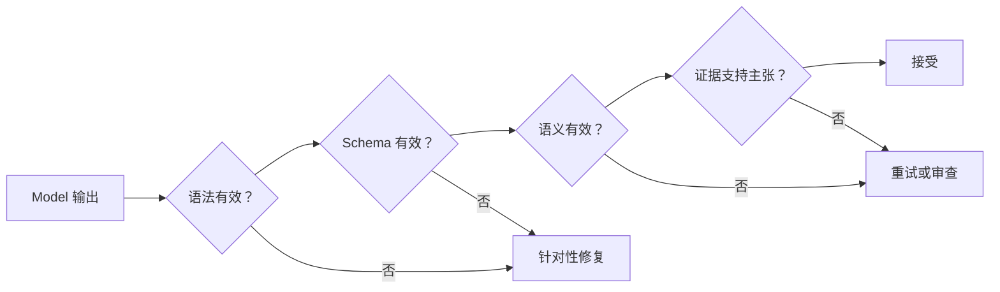

# 可靠的提取、Batch 与独立 Reviewer

> 有效的 JSON 证明结构得以保留，却无法证明事实正确。

**Type:** Reference
**Languages:** Python
**Prerequisites:** [验证主张，而非置信度](../../05-output-evaluation-and-validation/), [结构化输出是一份不可信的契约](../../09-structured-output-and-defensive-parsing/); Phase 14, Lesson 39
**Time:** ~135 分钟

## 学习目标

- 定义能够减少 false positive 和模糊 Label 的提取标准
- 有意识地使用 schema、示例、nullable 字段、enum 和证据片段
- 区分语法、schema、语义和来源验证
- 设计有界重试和独立 Reviewer 流程
- 根据工作流要求选择实时处理或 Batch 处理

## 问题

一个 pipeline 将合同义务提取为有效的 JSON。每条记录都符合
schema。法律 Reviewer 仍然拒绝了其中的 18%。

Model 使用看似合理的值填补缺失日期，将背景陈述标记为义务，
并把陌生类别映射到最接近的 enum。重试循环会反复提交相同的
Prompt，直到通过验证。由于验证只检查类型，虚构的值反而获得了
更为可信的格式。

团队解决了序列化问题，却误以为这就代表结果正确。

## 概念

### 先定义判断标准，再定义 Schema

schema 说明存在哪些字段。标准说明什么样的内容符合条件。

对于义务提取器，应定义：

- 义务承担方必须得到明确说明，或存在无歧义的关联
- 必须明确陈述所要求的行动，而不能只是对其进行讨论
- 仅在有依据时提取触发条件和截止日期
- 证据片段必须包含相关主张
- 未知值保持为 `null`
- 不受支持的类别使用 `other` 并附带说明，或者触发审查
- 例外和否定会改变结果

如果没有这些规则，标注人员、Model 和 evaluator 实际执行的将是不同任务。

### 使用 Few-Shot 示例说明边界

当判断合理的人可能得出不同结论时，示例最有价值。

应包括：

- 一个明确的正例
- 一个接近但不符合条件的案例
- 一项被否定的义务
- 以 `null` 表示缺失日期的案例
- 一个不在 enum 中的类别
- 同一段落中的两项义务
- 相互冲突的条款

每个示例都应展示原因，而不只是答案。不要用大量重复且简单的案例
填满 Context。

### 让“缺失”成为可表示的状态

如果某个字段可能未知，schema 就需要一个明确状态。强制要求字符串
会鼓励虚构内容。

```json
{
  "type": "object",
  "properties": {
    "party": {"type": ["string", "null"]},
    "action": {"type": "string"},
    "deadline": {"type": ["string", "null"]},
    "category": {
      "type": "string",
      "enum": ["payment", "delivery", "reporting", "other"]
    },
    "evidence_span": {"type": "string"},
    "needs_review": {"type": "boolean"}
  },
  "required": ["party", "action", "deadline", "category", "evidence_span", "needs_review"],
  "additionalProperties": false
}
```

required 与 nullable 结合会强制做出明确决策：提供有依据的值，或明确表示
已知的缺失。这样可以防止字段在无提示的情况下被省略。

### 使用 Tool Use 获取类型化输出

一个无副作用的提取 Tool 可以承载 schema。当应用需要类型化记录时，
可以通过 Tool choice 强制返回该记录。在当前 API 支持的情况下，
严格 schema 特性可以保证结构有效。

不要仅仅为了获取结构化输出而调用真正执行操作的 Tool。提取和执行
具有不同的权限。

### 分四层进行验证



#### 语法

payload 能否被解析？

#### Schema

字段、类型、enum 和边界是否有效？

#### 语义

跨字段关系是否成立？如果领域规则不允许，截止日期就不能早于
生效日期。当类别不受支持时，`needs_review` 不能为 false。

#### 来源

证据片段是否确实支持提取出的主张，并且是否来自正确的来源版本？

只有后两层能够检测出许多看似可信的 hallucination。

### 反馈最精简且有用的错误

修复时，返回结构化的验证反馈：

```json
{
  "category": "semantic_validation",
  "field": "deadline",
  "message": "提取的日期未出现在证据片段中。",
  "allowed_action": "将 deadline 设为 null，或选择有依据的片段。"
}
```

不要只说“再试一次”。保留原始来源和之前的结果。限制重试次数。
反复发生语义失败时应进行升级处理，而不是把不确定性转化为延迟和成本。

### 分离 Generator 与 Reviewer

Generator 负责提取。Reviewer 接收来源、候选记录和 rubric，并检查：

- 是否存在所需证据
- 片段是否支持每项非 null 主张
- 是否正确处理了否定和例外
- 类别是否符合定义
- 是否虚构了未知信息
- 是否标记了冲突和歧义

使用全新的 Context，以获得更强的独立性。Reviewer 返回 finding ID、
字段、证据和处置结论。它不会在无提示的情况下改写记录。

根据人工 Label 衡量 Reviewer 的 precision 和 recall。Model judge 是一种
测量工具，而不是 ground truth。

### 根据工作流选择 Batch

2026 年 7 月的 CCAR-F 公开指南规定，Message Batches 可降低 50% 的成本，
处理窗口最长为 24 小时且不保证延迟 SLA，并且单个 Batch 请求中不支持
多轮 Tool calling。这些是带有日期的考试参考事实，并不承诺定价或服务限制
会保持不变。部署前，请在
[Message Batches 文档](https://platform.claude.com/docs/en/build-with-claude/batch-processing)
中确认当前定价、限制、保留政策和 Feature 兼容性。

Batch 适用于：

- 大规模离线提取
- Evaluation Dataset
- 夜间 Classification
- 回填和重新处理
- 生成后的独立审查

实时处理适用于：

- 交互式用户响应
- 具有严格短延迟上限的任务
- 在同一请求中自适应使用 Tool
- 需要立即审批或反馈的工作流

当下一步依赖 Model 必须在请求过程中观察到的外部操作时，不要使用 Batch。
应预先计算输入，或将工作流拆分为多个作业。

### 让 Batch 作业能够对账

为每个条目提供稳定的 `custom_id`。持久化来源版本、schema 版本、
Prompt 版本和预期输出位置。结果可能以不同于提交时的顺序返回。

应处理：

- 成功
- 验证失败
- provider 失败
- 过期
- 重复提交
- 作业部分完成
- 来源变更后的重试

绝不要按数组位置关联结果与输入。

### 评估真正重要的错误

对于提取任务：

- 字段 precision 和 recall
- 在适用情况下使用 exact match 或 normalized match
- 证据支持率
- 高风险字段的 false-positive rate
- null calibration
- 类别 confusion matrix
- Reviewer 分歧
- 每条已接受记录的成本和延迟

平均值可能掩盖危险的 false-positive 类别。应按文档类型、语言、长度和
风险进行分层。

## 构建它

## 交互式实验

```figure
20-batch-review-confidence
```

使用置信度与审查 simulator，让记录依次通过语法、schema、语义和来源关卡。
调整 false-positive cost 和 Reviewer coverage，观察为什么有效的 JSON 和
Model 置信度不足以作为发布标准。

## 实践实验

将一个有依据的日期改为虚构值，运行四层验证，并将失败记录发送至
adjudication，而不是再次进行盲目重试。

## 交付产物

已填写的 [`outputs/extraction-review-report.md`](../outputs/extraction-review-report.md)
包含一个使用稳定 `custom_id` 值的 Batch 作业、nullable 未知值、乱序结果、
审查发现和 adjudication 状态。

## 验证它

运行其确定性 verifier：

```bash
cd certifications/claude/lessons/20-reliable-extraction-batch-and-reviewers
python3 code/main.py
python3 -m unittest discover -s code/tests -v
```

测验会检查修复、Batch 和 Reviewer 决策。

## Capstone 关联

将经过验证的报告带入 Architect Foundations 提取场景，作为全部四层验证的
证据。

为支持政策变更创建一条提取 pipeline。

### 输出契约

提取政策 ID、生效日期、受影响地区、操作类型、阈值、证据片段、
来源版本和审查状态。每个不确定字段都应为 nullable，或者具有明确的
`other` 状态。

### Dataset

构建至少 40 个示例：

- 15 个明确变更
- 10 个不包含变更的背景陈述
- 5 个否定或例外
- 5 个缺少日期或阈值的案例
- 5 个相互冲突的版本

### 处理流程

1. 使用严格 schema 的 Generator
2. 确定性的语法和 schema 验证
3. 语义关系验证
4. 独立证据 Reviewer
5. 对分歧进行人工 adjudication

### 实验

比较 zero-shot 标准、Few-Shot 边界示例，以及 Generator 加 Reviewer 的方案。
报告 false positive、证据支持率、成本和延迟。

### Batch 设计

使用稳定 ID 提交记录。在测试中随机打乱结果顺序。注入部分失败，并证明
对账过程会保留已完成的记录，且只重试可安全重试的条目。

## 使用它

在生产环境中，将原始来源与标准化提取结果分开存储。保留来源版本和证据
offset。当标准或 schema 发生变化时，创建新的输出版本，而不是覆盖历史决策。

如果人工修正了一条记录，应存储 reason code。在修改 Prompt 之前，先利用
分歧改进标准和 Evaluation set。

对于高风险提取，可以实施分层审查：审查每个高影响字段、低证据记录或新文档
类型，并从普通案例中随机抽样。

## 考试决策模式

当 JSON 有效但内容错误时，添加语义和证据验证。当判断边界处的一致性较弱时，
使用明确标准和 Few-Shot 示例。

优先选择符合以下原则的答案：

- 使用 `null` 或 `other`，而不是虚构内容
- 强制产生类型化输出，但不触发真实操作
- 反馈具体的验证错误，并设置重试限制
- 分离 Generator 和 Reviewer
- 对异步且不依赖 Tool 的工作负载使用 Batch
- 使用稳定 ID 对结果进行对账

## 常见陷阱

### Schema 等同于事实

类型无法证明某个值出现在来源中，或能从来源中推导出来。

### 必填且不可为 Null 的字段

由于契约无法表示缺失状态，Model 会虚构一个看似合理的值。

### 无限修复

同一份模糊来源会产生反复猜测。达到有界尝试次数后应升级处理。

### Reviewer 在无提示的情况下改写

系统会丢失哪项主张失败以及失败原因。执行任何受控修正之前，应先返回
结构化发现。

## 练习

1. 添加一条关联阈值和货币的语义规则。
2. 设计能够减少错误义务的负例。
3. 根据人工 Label 校准 Reviewer，并报告分歧。
4. 为乱序的 Batch 结果构建稳定 ID 对账机制。
5. 比较单流程 pipeline 和 Reviewer pipeline 中每条已接受记录的成本。

## 关键术语

| 术语 | 人们通常所说的含义 | 实际含义 |
|------|-----------------|------------------------|
| Structured output | 正确的数据 | 符合机器可读结构的数据 |
| Semantic validation | Schema validation | 检查值和关系对于相应领域是否合理 |
| Provenance validation | 有效引用 | 证明来源证据支持提取出的确切主张 |
| Nullable | 可选字段 | 用于表示未知或缺失值的明确受支持状态 |
| Batch | 更快的 API | 针对离线数据量以及不同成本或延迟约束优化的异步处理 |
| Adjudication | 重试 | 解决 evaluator 或 Label 分歧的合格决策 |

## 延伸阅读

- [Claude structured outputs 文档](https://platform.claude.com/docs/en/build-with-claude/structured-outputs)
- [Claude Message Batches 文档](https://platform.claude.com/docs/en/build-with-claude/message-batches)
- 从第一性原理讲解 structured outputs 的 Phase 11, Lesson 03
- 关于 Reviewer agents 的 Phase 14, Lesson 39
- 关于 Batch architecture 的 Phase 17, Lesson 15
