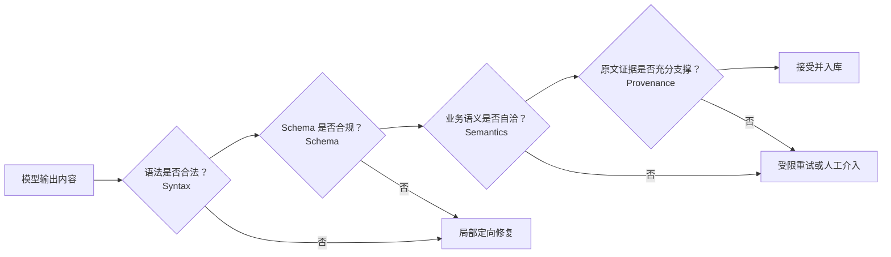

# 可靠信息抽取、Batch 批处理与独立评审 (Reliable Extraction, Batch, and Independent Reviewers)

> 合法的 JSON 仅证明数据结构得以存续，绝不证明事实内容真实无误。

**Type:** Reference
**Languages:** Python
**Prerequisites:** [Validate the Claim, Not the Confidence](../../05-output-evaluation-and-validation/), [Structured Output Is an Untrusted Contract](../../09-structured-output-and-defensive-parsing/); Phase 14, Lesson 39
**Time:** ~135 minutes

## 学习目标

- 定义能有效压低假阳性（False Positives）与模糊标注的精确抽取准则
- 审慎运用 Schema 约束、少样本（Few-shot）边界样例、可空字段（Nullable）、枚举与证据原文字符段（Evidence Spans）
- 严格解耦语法、Schema、语义与来源溯源（Provenance）这四层校验
- 设计有边界限制的重试自愈机制与独立二次评审（Independent Reviewer）链路
- 依据业务工作流的具体诉求在实时交互与 Batch 批处理模式间做出合理选型

## 问题背景

一条数据抽取流水线负责将法律合同条款抽取为标准合法的 JSON 格式。每一条输出记录在语法上都完美匹配定义的 Schema。然而在最终的法务人工审核环节，依然有 18% 的记录被直接驳回。

经过深入复盘发现：模型会使用看似非常合理的时间日期填补原文中缺失的信息；将合同前言中的一般性背景陈述硬贴上“法律义务”的标签；将未涵盖在系统枚举里的新奇类别强行归纳至最接近的既有枚举值中。而系统配备的自动重试循环只是将相同的 Prompt 原封不动重新投喂，直到校验通过。由于校验层仅仅比对字段类型，模型编造出来的虚假字段在一次次重试后反而呈现出更加自信的排版格式。

团队成功解决了数据序列化（Serialization）问题，却致命地将其误当成了业务事实的正确性。

## 核心概念

### 在敲定 Schema 之前必须首先确立判定准则 (Define the Judgment Before the Schema)

Schema 仅定义有哪些字段及其类型，而判定准则（Criteria）才决定什么样的内容才算合格。

针对法律义务抽取器，必须明确规定：

- 承担义务的主体必须在原文中被显式点名或无歧义指代
- 所要求的具体履约动作必须明确陈述，而非仅仅作为探讨议题被提及
- 仅当原文存在明确支撑依据时才抽取触发条件与截止日期
- 证据原文片段（Evidence Span）必须完整包含被抽取的论点
- 未知或原文未提及的值必须显式保留为 `null`
- 无法对应既有分类的值归入 `other` 并附带说明，或直接标记为待复核
- 例外条款与否定句式必须实质性改变抽取结果

若缺乏这些硬性准则，数据标注员、大语言模型以及评估系统在执行时其实是在遵循截然不同的任务标准。

### 运用少样本示例明确判定边界 (Use Few-Shot Examples for Boundaries)

在容易引发不同理性人员产生分歧的模糊灰色地带，示例具有无可替代的指导价值。

应当涵盖的示例类型：

- 一个清晰明确的正例
- 一个极易误判但应当排除的近似反例（Near Miss）
- 一个带有否定句式的免责或非义务条款
- 原文缺失截止日期时字段正确标记为 `null` 的样例
- 超出既有枚举范围的标准 `other` 处理样例
- 同一段落中并列包含两条独立法律义务的拆分样例
- 前后存在相互冲突条款时的取舍样例

每个示例都必须清晰展示做出该裁决的底层推导理由，而绝不仅是给出一个干瘪的标准答案。切勿在上下文提示词中堆砌大量毫无争议的简单平庸正例。

### 确保“缺失”在 Schema 中具备合法表达状态 (Make Absence Representable)

如果某个字段在客观现实中可能处于未知状态，Schema 必须为其提供显式的表达空间。如果强制要求必须返回非空字符串，无异于直接逼迫模型进行无中生有的幻觉伪造。

```json
{
  "type": "object",
  "properties": {
    "party": {"type": ["string", "null"]},
    "action": {"type": "string"},
    "deadline": {"type": ["string", "null"]},
    "category": {
      "type": "string",
      "enum": ["payment", "delivery", "reporting", "other"]
    },
    "evidence_span": {"type": "string"},
    "needs_review": {"type": "boolean"}
  },
  "required": ["party", "action", "deadline", "category", "evidence_span", "needs_review"],
  "additionalProperties": false
}
```

将字段设置为 `required` 同时允许类型为 `null`，能强制模型做出严肃选择：要么给出有据可查的具体值，要么明确确认该信息在原文中缺失。这能彻底根除模型私自漏填静默省略字段的恶习。

### 借助 Tool Use 获取强类型输出 (Use Tool Use for Typed Output)

可以声明一个不具备任何外部副作用的纯抽取 Tool，让其入参 Schema 充当目标数据模型。在 API 调用中配置强制工具选择（Forced Tool Choice），以确保在业务流水线中百分之百拿到类型完备的记录。在底层模型支持的前提下，可启用 Strict Schema 特性从语法层面杜绝格式漂移。

严禁为了获取格式化数据而直接调用具备真实业务影响的操作型工具。信息的结构化提取与业务动作的落地执行属于两套完全不同的权限与安全级别。

### 构筑四层防御性校验体系 (Validate in Four Layers)


```mermaid
flowchart LR
    O["模型输出内容"] --> J{"语法是否合法？\nSyntax"}
    J --> S{"Schema 是否合规？\nSchema"}
    S --> M{"业务语义是否自洽？\nSemantics"}
    M --> P{"原文证据是否充分支撑？\nProvenance"}
    P --> A["接受并入库"]
    J -->|"否"| R["局部定向修复"]
    S -->|"否"| R
    M -->|"否"| H["受限重试或人工介入"]
    P -->|"否"| H
```

#### 1. 语法校验 (Syntax)

返回的 Payload 是否能被 JSON 解析器正常解析，是否存在截断或转义错误。

#### 2. Schema 结构校验 (Schema)

所有声明的字段是否存在，数据类型、枚举值范围及数值边界是否完全符合定义。

#### 3. 业务语义校验 (Semantics)

字段与字段之间的跨维度逻辑关系是否自洽。例如：在特定法务场景中履约截止时间绝不能早于合同签署生效日期；当判定分类属于 `other` 时，`needs_review` 绝不能被标记为 false。

#### 4. 来源溯源校验 (Provenance)

引用的证据原文片段（Evidence Span）是否真的完整支撑所抽取的结论，且该片段是否确凿来自于指定版本的原始文件。

绝大多数高置信度的模型幻觉，只有在第三层（语义）和第四层（溯源）防御中才会被精准捕获。

### 反馈信息量最小的精准错误 (Feed Back the Smallest Useful Error)

在触发修复轮次时，应当向模型返回结构化的校验反馈，而不是简单一句“出错了”：

```json
{
  "category": "semantic_validation",
  "field": "deadline",
  "message": "抽取的截止日期未在所附的证据原文片段中出现。",
  "allowed_action": "请将 deadline 置为 null，或者重新选取能够支撑该日期的原文片段。"
}
```

切勿仅仅机械地提示“请重试”。保留原始待抽取的材料以及上一轮生成的候选结果，并严格限制重试次数。连续多次在语义层校验失败的样本，应当立即向上升级为人工作业，而不是盲目重试将不确定性转化为延迟飙升与 Token 浪费。

### 彻底分离生成者与独立评审者 (Separate Generator and Reviewer)

生成者 Agent 负责执行抽取；而评审者 Agent 接收原始输入文档、候选抽取结果以及客观评审细则（Rubric）。评审者重点核查：

- 必需的支撑证据是否存在
- 引用的原文字符串是否能完整支撑每一个非空字段结论
- 否定句式与豁免例外是否得到了正确处置
- 选取的类别是否符合准则定义
- 是否存在凭空捏造未提及信息的情况
- 潜在的矛盾与歧义是否已被显式标出

在干净的独立上下文中运行评审流程以保障客观独立性。评审者应当返回结构化的缺陷清单（包含 Issue ID、涉及字段、比对证据及裁决倾向），严禁由评审者在暗中擅自篡改原文记录。

对照专业人工标注基线，严密测量评审者的查准率（Precision）与查全率（Recall）。作为裁判的模型终究只是一种评估工具，绝不是不容置疑的客观真理。

### 依据业务工作流审慎选择 Batch 批处理 (Choose Batch for the Workflow)

2026 年 7 月发布的 CCAR-F 架构师认证官方考纲特别指出了几项经典参考指标：Message Batches 批处理 API 相比实时调用具备 50% 的显著成本优惠、标准处理窗口为最长 24 小时且不提供严格的确定性延迟 SLA 保障，以及在单次批处理请求内部不支持跨多轮交互的自适应工具调用。这些属于特定历史版本下的考试参考基准，随着底层基础设施演进，具体定价与配额策略可能会发生动态调整。在生产上线前，务必查阅当前最新的 [Message Batches 官方文档](https://platform.claude.com/docs/en/build-with-claude/batch-processing) 核验技术细节。

适合 Batch 批处理的典型场景：

- 海量历史存量数据的离线批量抽取
- 定期运行的大规模基准评估测试集
- 每日凌晨触发的存量文档打标与归类
- 数据回溯（Backfill）与重新加工流水线
- 在第一阶段生成后异步执行的独立离线二次审查

必须采用实时调用（Real-time）的场景：

- 需要即时响应的交互式前端用户会话
- 面临毫秒级或秒级严格延迟上限要求的关键链路
- 在同一个请求处理过程中依赖动态工具返回结果推进后续推理
- 必须立刻获取审批确认或人工即时反馈的工作流

切勿将 Batch 模式强行应用于后续逻辑高度依赖模型在请求中途观察外部副作用的场景。若需要此类能力，应预先计算输入参数，或将业务流解耦为多阶段独立作业。

### 确保批处理任务完全具备对账能力 (Make Batch Jobs Reconciliable)

为批处理任务中的每一个条目赋予全局稳定的业务唯一标识 `custom_id`。在元数据存储中持久化原始数据版本、Schema 版本、Prompt 模版版本以及预期的输出文件落盘位置。批处理的返回结果很可能是乱序到达的。

必须全面覆盖以下异常态的妥善处理：

- 业务执行成功
- 校验不通过
- 服务端底层临时故障
- 批处理任务超时失效
- 重复提交相同任务
- 任务部分成功部分失败（Partial Job Completion）
- 底层源数据变更后发起的重新提交

严禁依赖数组在内存中的物理索引位置去跟原始输入进行配对关联。

### 紧密围绕真实核心损失指标开展评估 (Evaluate the Error You Care About)

在评估抽取系统时，必须建立多维度的指标监控：

- 字段级别的精确率（Precision）与召回率（Recall）
- 关键数值或文本在归一化后的严格匹配率
- 证据链条的原文支撑覆盖率
- 高风险核心字段的假阳性率（False-Positive Rate）
- 缺失值（Null）填报的校准度（Calibration）
- 细分类别的混淆矩阵（Confusion Matrix）分布
- 独立评审者与生成者之间的分歧比例
- 产出单条合格可入库记录的综合成本与端到端耗时

平均值往往会掩盖某个特定高危字段的灾难性假阳性表现。务必根据文档类型、语种分布、文本长度以及业务风险等级实施精细的分层切片度量。

## Build It

## Interactive Lab

```figure
20-batch-review-confidence
```

运行置信度与审查模拟器，直观观察抽取记录依次穿透语法、Schema、业务语义与来源溯源四层门禁的完整过程。动态调整假阳性违约成本与独立评审抽检比例，深刻理解为什么仅仅保证 JSON 合法与模型自我感觉良好远远不足以作为系统上线放行的准绳。

## Practice Lab

将一个在原文中有据可查的截止日期人为替换为凭空编造的虚假值，依次跑通四层校验链路，观察系统准确识别出语义及溯源违规，并将该异常记录精准分流至人工裁决队列（Adjudication），而非陷入盲目重试。

## Shipped Artifact

本课交付的标准产物位于 [`outputs/extraction-review-report.md`](../outputs/extraction-review-report.md)，包含一个带有稳定 `custom_id` 的批处理作业范例、支持可空未知态的 Schema、处理乱序返回结果的机制、独立评审审查意见以及最终的人工裁决裁定状态。

## Verify It

在本地执行离线确定性校验器：

```bash
cd certifications/claude/lessons/20-reliable-extraction-batch-and-reviewers
python3 code/main.py
python3 -m unittest discover -s code/tests -v
```

课后测验将深入考察结构化自愈修复、Batch 架构设计以及独立评审员体系的决策准则。

## Capstone Connection

将这份经过严密校验的抽取报告，直接并入架构师基础场景大作业（Architect Foundations Capstone）的复杂信息抽取篇章，作为贯通四层校验防线的权威落地证据。

针对企业服务支持政策的变更通知，搭建高可用抽取流水线：

### 交付输出契约 (Output Contract)

抽取政策 ID、生效日期、影响地区、操作分类、数值门槛阈值、证据原文片段、源文件版本号以及审查流转状态。任何存在不确定性的字段均声明为可空（Nullable）或具备显式的 `other` 枚举状态。

### 基准评测集设计 (Dataset)

构建至少 40 组高质量评测样本：

- 15 组明确声明政策变更的标准样本
- 10 组仅包含背景陈述、无实质政策改动的干扰样本
- 5 组包含复杂否定或豁免条款的边界样本
- 5 组客观缺失生效日期或具体门槛的空值样本
- 5 组前后版本存在直接事实冲突的异常样本

### 处理流程设计 (Passes)

1. 配备严格 Schema 约束的生成者 Agent
2. 确定性的语法与 Schema 自动化静态校验
3. 跨字段业务语义自洽性校验
4. 纯净独立上下文中的证据溯源评审 Agent
5. 针对评审分歧引入终审人工裁决机制（Human Adjudication）

### 架构对比实验 (Experiment)

横向对比零样本准则提示（Zero-shot）、少样本边界指导（Few-shot）以及“生成者加独立评审者”三种架构模式。详实记录在假阳性率、证据支撑率、调用成本与响应延迟上的各项实测数据。

### Batch 批处理工程实现 (Batch Design)

为所有提交记录绑定稳定全局唯一 ID。在单元测试中故意打乱批处理返回顺序，并主动注入局部失败，验证对账模块能否无缝保留已成功的记录，并仅对安全的失败项发起定向重试。

## Use It

在企业生产落地中，原始文档与抽取归一化后的数据必须物理隔离存储。永久保留源文件 Hash 版本与证据在原文中的绝对字符偏移量（Offsets）。当业务准则或底层 Schema 发生迭代升级时，应当发布全新的数据版本，严禁直接覆盖历史上已经生效的存量决策记录。

若人工审核修正了某条记录，必须结构化录入具体的驳回原因码（Reason Code）。在急于改动 Prompt 之前，应当首先利用这些人工修正样本完善判定准则并扩充评估基准集。

针对高风险的抽取任务，采取分层抽检机制：对核心重大字段、低置信度证据记录或首次出现的新文档格式实施 100% 全量复审，而对普通低风险常规记录实施随机抽样审查。

## Exam Decision Patterns

当面对 JSON 结构合法但核心事实完全错误的现象时，应当果断构建业务语义校验与原文证据溯源校验。当模型在边界裁决上表现出不稳定性时，优先引入显式的正面与反面准则，并辅以少样本边界示例。

在认证考核中，推荐的标准架构方案包括：

- 使用 `null` 或 `other` 表达客观缺失，彻底杜绝凭空捏造
- 借助无副作用的类型化 Tool 强制规范输出，严禁滥用具备实际写权限的工具
- 向模型反馈包含具体字段与建议动作的细粒度错误信息，并设定重试次数上限
- 将生成者与评审者的上下文彻底物理隔离
- 对非实时、无需动态单步工具交互的批处理任务启用 Batch 模式
- 始终依赖全局稳定的唯一 ID 执行批处理乱序对账

## Common Traps

### 误把格式合规当作事实正确 (Schema Equals Truth)

数据类型的合法性绝对无法证明该数值真实出现在原文中，更无法证明其符合复杂的业务逻辑。

### 强制要求字段非空且不可为 Null (Required Non-Nullable Fields)

当接口契约中没有为“客观缺失”预留表达窗口时，模型为了通过校验不得不编造一个看似合理的数值。

### 陷入无限自愈修复循环 (Infinite Repair)

面对原本就模糊不清、缺乏关键信息的输入材料，反复重试只会让模型不断随机猜测。在有限重试失败后必须及时升级给人工裁决。

### 评审者在后台静默修改数据 (Reviewer Rewrites Silently)

这种做法会导致系统彻底丢失究竟是哪个字段发生了错误及其背后的推导线索。评审节点必须首先输出结构化的审查意见单，随后再触发受控的修正流程。

## Exercises

1. 编写一条跨字段语义校验规则：当业务门槛值大于零时，强制校验币种单位不得为空。
2. 针对容易被误判为法律义务的通用申明条款，设计两组高质量的负面少样本示例。
3. 对照人工标注黄金数据集校准评审 Agent 的判别标准，并输出分歧混淆矩阵。
4. 编写一段基于稳定 `custom_id` 的对账程序，正确处理乱序返回且包含部分失败的批处理结果。
5. 针对单阶段抽取与“生成者加独立评审者”双阶段抽取，对比计算产出单条合格入库记录的综合成本差异。

## Key Terms

| 术语 | 通俗说法 | 严谨工程定义 |
|------|----------|--------------|
| 结构化输出 (Structured output) | 正确的数据 | 严格符合机器可解析 Schema 规范的数据形态 |
| 语义校验 (Semantic validation) | 格式校验 | 检验各字段取值及其跨维度相互关系在具体业务领域中是否逻辑自洽 |
| 来源溯源校验 (Provenance validation) | 附带引文 | 严格检验所抽取的每一项事实主张在原文中是否均有确凿证据直接支撑 |
| 可空类型 (Nullable) | 选填项 | 在 Schema 中为客观未知或缺失的信息提供显式的合法表达机制 |
| 批处理 (Batch) | 更快的 API | 针对大规模离线数据设计、具备高性价比与宽松延迟窗口的异步吞吐处理模式 |
| 裁决 (Adjudication) | 再次重试 | 依据明确的权威规则解决不同评估器之间或模型与标注之间分歧的决断过程 |

## Further Reading

- [Claude 结构化输出官方文档](https://platform.claude.com/docs/en/build-with-claude/structured-outputs)
- [Claude Message Batches 官方开发指南](https://platform.claude.com/docs/en/build-with-claude/message-batches)
- 本教程 Phase 11 第 03 课：从第一性原理构建结构化输出
- 本教程 Phase 14 第 39 课：评审智能体（Reviewer Agents）系统设计
- 本教程 Phase 17 第 15 课：大规模批处理架构设计
