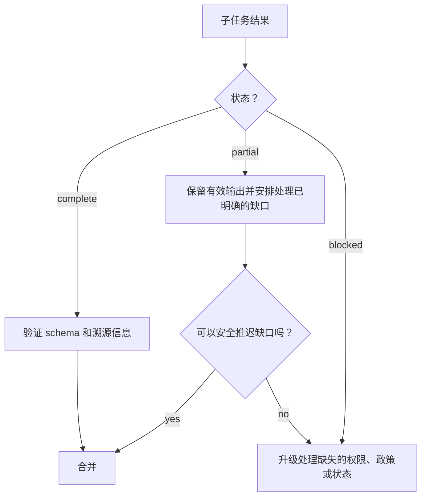

# 让大型 Context 可观测

> 大型 Context 窗口可以容纳更多证据，但无法告诉你哪些证据得到了注意、哪些是最新的、哪些具有权威性，以及哪些可以安全地作为行动依据。

**Type:** Reference
**Languages:** Python
**Prerequisites:** [Agent SDK 会话、Subagent 与 Context](../../17-agent-sdk-sessions-subagents-and-context/), [Tool 契约、错误与渐进式发现](../../18-tool-contracts-errors-and-progressive-discovery/), [可靠抽取、批处理与独立审阅者](../../20-reliable-extraction-batch-and-reviewers/)
**Time:** ~150 分钟

## 学习目标

- 放置和检索关键事实，减少 lost-in-the-middle 故障。
- 精简 Tool 输出，同时不丢失溯源信息、错误、冲突或与决策相关的细节。
- 在 Agent 工作流中传递完整、部分完成和阻塞的结果。
- 针对不同的大型代码库任务使用清单、暂存笔记、Subagent 和压缩。
- 根据证据和后果校准置信度并分层安排人工审阅。
- 在采集和渲染过程中保留来源身份、日期、冲突和内容类型。

## 问题

一名迁移协调者收到了 140 个文件、三份架构文档、一份依赖报告、测试日志，以及四个 Subagent 的结果。Prompt 可以放入标称的 Context 窗口中。

最终计划仍然违反了一项安全规则。这条规则只在一份很长的架构文档中部出现过一次。包含集成测试失败信息的 Tool 结果被缩短为“测试大多通过”。一个 Subagent 在审阅 24 个文件中的 18 个后超时，但它的文字摘要看起来像是完整的。一个 Markdown 表格在抽取过程中丢失了列之间的关系，因此一个已弃用的依赖看起来仍受支持。

没有任何内容超过标称 Token 限制。系统失败的原因是重要事实所处的位置不显眼、元数据消失、部分完成的工作看起来像完整结果，而且没有人定义升级处理规则。

Context 可靠性并不是容纳更多文本的能力，而是保留正确状态、暴露不确定性，并在证据不足时正确分派决策的能力。

## 概念

### Context 具有 Attention 拓扑

Model 不会在每项任务中都将所有 Token 视为同等有用。长输入可能让证据更难定位，尤其是当相关事实被相似或冲突的材料包围时。这通常称为 lost in the middle。

有意识地安排内容位置：

1. 将任务、决策、硬性约束和输出契约放在证据之前。
2. 按文件、声明、来源或子系统等稳定身份对证据分组。
3. 将当前问题放在 Model 必须回答它的位置之前。
4. 只在最终请求附近重复少数关键约束。
5. 为当前决策检索范围较窄的证据，而不是携带整个归档。

不要在两端重复每一条规则。重复会消耗 Context，并可能放大过时指令。只提升那些一旦遗漏便会造成实质性故障的不变量。

```text
目标和硬性约束
当前清单和未解决缺口
带元数据的相关证据块
针对具体决策的问题
必需的结果和升级处理 schema
```

如果能够可靠地选择证据，检索通常比一个巨大的 Prompt 更有效。大型 Context 窗口是应对剩余困难情况的容量，不是跳过信息架构的理由。

### 证据需要封套

仅有原始文本还不够。用结构化元数据包装每个重要单元：

```json
{
  "evidence_id": "policy-auth-017",
  "source_uri": "repo://docs/security/authentication.md",
  "source_version": "git:3a91c7e",
  "content_type": "text/markdown",
  "effective_date": "2026-07-15",
  "observed_at": "2026-08-08T10:30:00Z",
  "authority": "approved-architecture-policy",
  "scope": ["services/auth/**"],
  "extractor": "markdown-section-v2",
  "location": {"heading": "Token rotation", "lines": [88, 112]},
  "status": "active"
}
```

这些值仅作示例。封套可以回答文字叙述无法回答的问题：

- Agent 看到了哪个版本？
- 它是政策、草案，还是生成的摘要？
- 它约束哪些文件或声明？
- 能否检查原始片段？
- 是否存在更新或更具权威性的其他来源？

在每次交接过程中，始终将来源正文与元数据关联起来。没有身份信息的简洁摘要很难验证。

### 根据决策价值精简 Tool 输出

Tool 输出可能占据大部分 Context。精简时应该删除重复内容，而不是删除状态。

保留：

- Tool 调用 ID 和 trace ID
- 命令或查询及其限定目标
- 退出或完成状态
- 结构化错误及其是否可重试
- 受影响的文件、记录或声明
- 失败的断言和最小支持摘录
- 计数、总数和被省略项目数
- 来源版本和时间戳
- 冲突和未解决缺口
- 指向完整外部产物的引用

删除或外部化：

- 重复的进度行
- 重复的 stack frame
- 没有提供不同证据的成功记录行
- 装饰性格式
- 已经通过稳定引用存储的大段内容

尽可能使用确定性适配器：

```json
{
  "status": "partial",
  "summary": "已审阅 24 个文件中的 18 个；发现 2 个问题；有 6 个文件未处理",
  "findings": ["finding-014", "finding-015"],
  "errors": [
    {
      "category": "dependency_timeout",
      "retryable": true,
      "scope": ["services/payments/**"],
      "trace_id": "trace-8801"
    }
  ],
  "full_artifact": "artifact://review/run-224"
}
```

“大多通过”删除了最重要的区别：究竟是哪一部分没有通过。

### 完整、部分完成和阻塞都是一等状态

每个任务契约都应该定义三种结果：

- **完整：** 每个必需部分都满足输出契约。
- **部分完成：** 已存在有效工作，但缺少明确指出的范围或证据。
- **阻塞：** 若要安全继续，需要新的权限、政策、数据或外部状态。

部分完成不等于失败，也不等于完整。协调者可以保留有效发现，只重试符合条件的缺口，并防止综合过程将缺失工作解释为不存在问题。



错误需要包含类别、是否可重试、安全消息、受影响范围、部分结果引用和建议的下一步操作。超时可能可以重试。授权拒绝无法通过重试解决。含糊的政策需要负责人，而不是更多 Token。

### 升级处理原因，而不是焦虑

升级处理应该明确指出缺失的决策：

| 条件 | 安全响应 |
|---|---|
| 缺少证据 | 指明所需来源和受影响的结论 |
| 权威来源相互冲突 | 保留双方内容，应用有文档记录的优先级，或交由负责人处理 |
| 政策缺口 | 停止受政策约束的操作，并向政策负责人请求规则 |
| 权限缺口 | 请求限定范围的访问权限，或选择已批准的替代路径 |
| 反复出现语义失败 | 停止有界重试并请求裁决 |
| 外部副作用未知 | 重试前核对状态 |

不要以“Model 不确定”为由升级处理。应提供来源 ID、尝试过的检查、确切歧义、后果、截止期限，以及可用的安全选项。

### 大型代码库需要四种不同的记忆 Tool

这些机制彼此相关，但不能互换。

#### 清单

清单是一份持久映射，包含文件 ID、所有权、用途、依赖、审阅状态、哈希、发现和未解决工作。它支持覆盖检查和恢复。清单在对话之外仍然是权威记录。

#### 暂存笔记

暂存笔记用于支持当前有界任务中的临时推理，包括搜索假设、候选文件和后续检查。它可以被丢弃。绝不要把决策、批准或已完成操作的唯一副本存放在其中。

#### Subagent

Subagent 针对有边界的问题获得隔离的 Context。它返回带有文件和证据引用的结构化结果。隔离可以减少 Context 竞争，但协调者仍须执行覆盖和合并规则。

#### 压缩

压缩会将不断增长的会话压缩为当前目标、约束、已验证工作、未解决缺口、证据引用和下一步操作。它控制 Context 大小，但不能保证真实性或持久状态。

将它们结合使用：

```text
清单说明存在哪些内容以及已经完成哪些工作
暂存笔记帮助决定下一次有边界的搜索
Subagent 隔离一项推理职责
压缩重新构建一个更小的当前工作集
```

处理大型 repository 时，先从结构和依赖关系图开始，再检索最小的连通部分。让任务边界明确的 Subagent 检查特定子系统。将规范化后的发现返回清单。最终的跨文件检查应针对清单和已接受证据运行，而不是针对原始记录运行。

### 置信度应根据证据进行校准

Model 生成的百分比不会仅仅因为保留了两位小数就得到校准。通过可观测的证据表达置信度：

- 支持类别：直接、计算所得、间接、冲突或缺失
- 来源权威性和时效性
- 覆盖率：已审阅项目数除以必需项目数
- 评估者一致性和已知分歧
- 相对于已测试案例的新颖性
- 错误时的后果

决策记录可以这样写：

```text
证据类别：两个已批准来源中的直接证据
覆盖率：24 个必需文件中的 24 个
冲突：一项，已由架构负责人于 2026-08-07 解决
自动检查：18 项通过，0 项失败
剩余不确定性：尚未观察网络分区下的运行时行为
处置：生产环境 rollout 前需要人工审阅
```

这比“置信度为 92%”更有用。

### 人工审阅应该分层进行

当后果或政策要求时，审阅每个案例。否则，应根据风险分配人工注意力：

- 每项高影响决策
- 每项冲突或政策缺口
- 每项低证据或部分完成的结果
- 每种新的内容类型、语言或子系统
- 接近决策阈值的案例
- 普通通过案例的随机样本

随机样本能够发现未知的故障类别。如果只审阅被标记的案例，那么损坏的标记器可能始终无法被发现。

跟踪审阅者分歧和修正。使用这些信息更新 Evaluation 案例和分派阈值，而不只是计算没有实际意义的接受率指标。

### 内容类型会改变含义

采集和渲染必须尊重内容类型：

- Markdown 使用标题、列表、链接和 fenced code 作为结构。
- HTML 可能包含与可见文本不同的隐藏导航、脚本或无障碍标签。
- PDF 页面可能包含表格、脚注、分栏、图示和扫描图像。
- CSV 和电子表格通过行、列、公式和工作表表达关系。
- 源代码依赖符号、import、注释、生成文件和 repository 路径。
- 图像和图示需要视觉解读，以及指向原始资产的引用。

将每种格式都展平为不加区分的文本，可能会颠倒表格、分离脚注，或者将导航内容与证据合并。应存储原始内容类型、抽取方法、位置和渲染警告。当布局承载含义时，应测试实际渲染的产物。

将文档文本视为不受信任的数据。隐藏的 HTML 元素或代码注释可能包含不应覆盖任务或 Tool 政策的指令。

## 动手构建

## 交互式实验

```figure
21-provenance-escalation
```

使用溯源与升级处理模拟器埋藏、精简、制造冲突或删除证据，同时观察覆盖率和任务状态的变化。这一交互过程让 `partial` 和 `blocked` 变得可观测，防止流畅的摘要隐藏缺失工作。

## 实践实验

从数据包副本中删除被省略项目数或冲突负责人，观察错误完成风险，并修复证据封套。

## 交付产物

填写完成的 [`outputs/reliability-packet.md`](../outputs/reliability-packet.md) 记录了一次包含 24 个文件的审阅，其中包括一项冲突、明确的覆盖率、来源元数据，以及绑定负责人的升级处理。

## 验证

验证证据封套和审阅分层：

```bash
cd certifications/claude/lessons/21-long-context-reliability-provenance-and-escalation
python3 code/main.py
python3 -m unittest discover -s code/tests -v
```

测验检查内容放置、清单和恢复能力。

## Capstone 衔接

将该数据包用作 Architect Foundations Capstone 的 Context 可靠性附录。

为大型代码库安全审阅构建一个可靠性数据包。

### 第 1 步：创建清单

列出范围内的每个文件，包括子系统、负责人、哈希、内容类型、审阅状态、分配的 Subagent、发现 ID 和未解决缺口。添加确定性覆盖检查。

### 第 2 步：定义 Context 预算

为目标、硬性约束、当前清单片段、相关证据、结构化错误和输出契约预留空间。使用稳定引用在外部存储完整日志。

### 第 3 步：规范化 Tool 结果

为搜索、测试和文件检查编写适配器。注入超时、截断日志、权限拒绝和部分搜索结果。验证每项结果都保留受影响范围和正确的重试行为。

### 第 4 步：添加升级处理规则

为相互冲突的政策、未覆盖的文件、缺少授权和未知副作用创建 fixture。每个 fixture 都应指定负责人和安全的下一步操作。

### 第 5 步：校准审阅

审阅每项严重发现和部分完成的结果，并随机抽样检查通过项。将报告的证据类别与审阅者处置进行比较。根据测得的错误通过风险调整分派规则。

### 第 6 步：测试渲染

使用一份 Markdown 政策、一个包含大量表格的 PDF、一个 CSV 和一个源文件。确认引用能够解析到正确的章节、页面、单元格范围或代码行，并且依赖布局的事实得以保留。

## 投入使用

### 考试决策模式

对于长 Context 可靠性场景：

1. 将当前目标和关键约束放在清晰的边界位置。
2. 选择相关证据，并携带结构化的溯源封套。
3. 精简冗长内容，同时保留失败信息、计数、冲突和引用。
4. 显式传递完整、部分完成和阻塞状态。
5. 将政策、权限和歧义缺口升级给指定负责人。
6. 根据证据和覆盖率校准置信度。
7. 根据后果、不确定性、新颖性和随机抽样对人工审阅进行分层。

### 常见陷阱

- **能放入 Context，因此一定会被注意：** 将容量误认为可靠的 Attention。
- **将摘要当作证据：** 来源身份、日期和支持片段消失。
- **精简所有错误：** 唯一失败的断言与重复日志一起被删除。
- **部分完成意味着没有发现：** 未审阅的范围被转化为负面证据。
- **重试每次失败：** 授权和政策缺口只会消耗预算，而不会改变状态。
- **将暂存笔记用作数据库：** Context 改变时，持久决策随之消失。
- **将压缩当作验证：** 更小的摘要仍可能保留过时假设。
- **将百分比当作置信度：** 措辞的精确性被误认为校准。
- **对每种格式都使用纯文本采集：** 表格、脚注、代码结构和渲染含义都会丢失。

### 练习

1. 重新排列一个 50 页的 Context 数据包，让任务和关键政策保持可见，同时不重复每一条规则。
2. 将一份 5,000 行的测试日志转换为结构化的部分结果，并附上指向完整产物的引用。
3. 为一个包含 300 个文件的 repository 设计清单和三个 Subagent 契约。
4. 为缺少证据、政策冲突和未知副作用编写升级处理数据包。
5. 为 10,000 条抽取记录创建分层审阅计划。
6. 比较从 Markdown 表格及其渲染视图中进行的抽取。记录丢失的关系。

## 关键术语

- **Lost in the middle：** 对埋藏在长 Context 中的相关信息，其可靠利用程度降低。
- **溯源封套：** 保留来源身份、版本、日期、权威性、位置和抽取方法的元数据。
- **部分结果：** 已完成的有效工作，同时明确指出缺失范围或错误。
- **清单：** 关于范围、状态、所有权、证据和缺口的持久结构化清单。
- **暂存笔记：** 不属于权威状态的临时工作记录。
- **压缩：** 将对话 Context 压缩为更小的工作集。
- **置信度校准：** 使表达的确定性或分派方式与测得的证据和错误行为保持一致。
- **分层审阅：** 根据风险类别分配人工审阅，并辅以代表性抽样。
- **按内容类型渲染：** 保留原始格式的结构和视觉语义。

## 延伸阅读

- [Claude Certified Architect Foundations 考试指南](https://everpath-course-content.s3-accelerate.amazonaws.com/instructor%2F6nizmqk8tpzpfjvt6qmmav7rh%2Fpublic%2F1783542750%2FClaude+Certified+Architect+%E2%80%93+Foundations+Exam+Guide.pdf)
- [Anthropic：长 Context Prompt 技巧](https://platform.claude.com/docs/en/build-with-claude/prompt-engineering/long-context-tips)
- [Anthropic：Context 窗口](https://platform.claude.com/docs/en/build-with-claude/context-windows)
- [Anthropic：引用](https://platform.claude.com/docs/en/build-with-claude/citations)
- [Anthropic：Agent SDK Context 管理](https://platform.claude.com/docs/en/agent-sdk/context-management)
- [AI Engineering from Scratch：Context Engineering](../../../../../phases/11-llm-engineering/05-context-engineering/)
- [AI Engineering from Scratch：Repository 记忆与状态](../../../../../phases/14-agent-engineering/34-repo-memory-and-state/)
- [AI Engineering from Scratch：多会话交接](../../../../../phases/14-agent-engineering/40-multi-session-handoff/)

Context 限制、压缩行为、引用、SDK Feature、Model 支持和内容处理能力可能发生变化。这些参考资料已于 2026-08-08 检查。部署前请核验当前官方文档，并测试具体平台行为。
