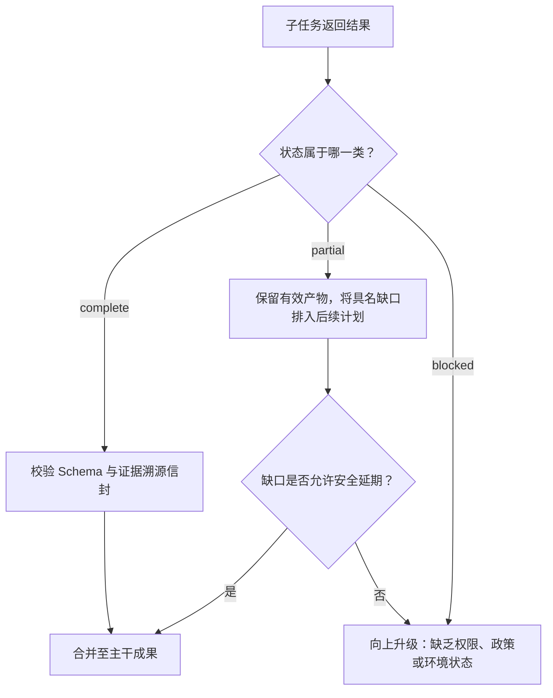

# 构建可观测的大上下文系统 (Make Large Context Observable)

> 超大上下文窗口能够容纳更多证据材料，但它无法向你证明：哪些证据被真正注意到、是否处于最新状态、是否具备权威性，以及依据它们采取行动是否安全。

**Type:** Reference
**Languages:** Python
**Prerequisites:** [Agent SDK 会话、Subagent 与上下文管理](../../17-agent-sdk-sessions-subagents-and-context/), [工具契约、错误处理与渐进式发现](../../18-tool-contracts-errors-and-progressive-discovery/), [可靠信息抽取、Batch 批处理与独立评审](../../20-reliable-extraction-batch-and-reviewers/)
**Time:** ~150 minutes

## 学习目标

- 合理编排并精准检索核心事实，显著降低“迷失在中间”（Lost in the Middle）的注意力衰减故障
- 在裁剪工具输出的同时，完整保留来源溯源（Provenance）、错误结构、冲突信息与决策关键细节
- 在 Agent 工作流中显式传递 Complete（完成）、Partial（部分完成）与 Blocked（受阻）三种一级状态
- 针对超大代码库协同任务，组合运用清单（Manifest）、草稿板（Scratchpad）、Subagent 与上下文压缩
- 基于客观证据链校准置信度（Calibration），并依据失败后果实施分层人工审查（Stratified Human Review）
- 在数据摄取与排版渲染全链路中，完整保留原始文档标识、日期版本、冲突记录与内容格式类型

## 问题背景

一个代码库迁移协调器接收了 140 个代码文件、三份核心架构设计文档、一份第三方依赖分析报告、详细的测试日志，以及四个 Subagent 提交的汇总结果。整个 Prompt 的 Token 消耗完全处于宣称的上下文窗口额度之内。

然而，最终输出的迁移执行方案依然严重违背了一条关键的安全红线。这条红线仅在一份长篇架构文档的偏中后段出现过一次。一个包含关键集成测试报错失败的工具输出，在被截断压缩时被草率地总结成一句“大部分测试已顺利通过”。某个负责文件审查的 Subagent 在完成 24 个文件中的 18 个后发生超时，但其返回的自然语言摘要表面上看起来完全是一份完整的报告。一份 Markdown 表格在抽取过程中丢失了列对齐关系，导致一个已被废弃的危险依赖项被误判为受官方支持。

整场交互没有任何地方超出名义上的 Token 容量限制。系统的彻底崩溃，是因为关键事实在上下文中摆放位置薄弱、核心元数据中途丢失、局部未完工成果伪装成了最终成果，并且没有任何人预先定义向外升级上报（Escalation）的处理规则。

上下文可靠性绝不仅指“塞下更多文本”的吞吐能力，而是指精确维持关键状态、暴露不确定性风险，并在证据不足时将决策安全流转到正确节点的系统工程能力。

## 核心概念

### 上下文拥有注意力拓扑结构 (Context Has an Attention Topology)

在大语言模型中，并非所有 Token 在每项任务中都能获得等权重的有效注意力。极长的上下文输入往往会让关键证据的定位变得极其困难，尤其是当核心事实被大量相似或相互冲突的背景材料所包围时。这种现象在学术界与工业界常被称为“迷失在中间”（Lost in the Middle）。

必须有意识地在空间位置上精细编排：

1. 将当前核心任务目标、终极裁决要求、硬性边界约束与输出契约置于大篇幅证据材料之前。
2. 依据稳定的业务唯一标识（如文件路径、论据 ID、权威源标识或子系统名）对证据进行结构化分组聚类。
3. 将当前待决的具体问题紧贴在模型即将产生输出的最终位置之前。
4. 仅在最接近最终请求的尾部位置，高保真重申极少数绝不容许妥协的系统不变量。
5. 针对当前的具体裁决步骤定向检索最小范围的支撑证据，而非全程背负整个历史归档。

切勿在上下文的首尾两端全量复制所有冗长规则。机械的重复不仅白白浪费 Token 窗口，还会放大陈旧失效规则的负面干扰。仅置顶那些一旦被遗漏就会引发实质性灾难的核心不变量。

```text
当前核心目标与系统级硬性约束
当前任务清单与未解决的阻塞缺口
附带元数据的相关证据块列表
针对当前决策的定向核心问题
要求的输出契约与向上升级上报 Schema
```

如果系统能够具备高精度的证据检索能力，定向精准检索的表现往往远胜于单次灌入一个无所不包的超大 Prompt。庞大的上下文窗口是为真正复杂的疑难场景保留的弹性容量，绝不能成为团队放弃信息架构设计（Information Architecture）的借口。

### 证据材料必须包裹标准元数据信封 (Evidence Needs an Envelope)

仅仅提供原始文本是远远不够的。必须为每一个关键证据单元封装统一的结构化元数据信封（Provenance Envelope）：

```json
{
  "evidence_id": "policy-auth-017",
  "source_uri": "repo://docs/security/authentication.md",
  "source_version": "git:3a91c7e",
  "content_type": "text/markdown",
  "effective_date": "2026-07-15",
  "observed_at": "2026-08-08T10:30:00Z",
  "authority": "approved-architecture-policy",
  "scope": ["services/auth/**"],
  "extractor": "markdown-section-v2",
  "location": {"heading": "Token rotation", "lines": [88, 112]},
  "status": "active"
}
```

这些字段取值展示了元数据信封的核心结构。信封能够解答纯自然语言无法明确的底层核心问题：

- Agent 当时究竟读取的是哪一个具体版本？
- 该材料是官方已生效的政策、临时草案还是 AI 生成的摘要？
- 它究竟管辖哪些具体的服务模块或业务论据？
- 是否能够快速追溯定位到源文件中的原始字符区间以供人工复核？
- 外部是否存在版本更新或权威等级更高的数据源？

在跨 Agent 的每一次数据流转与交接中，始终将证据正文与元数据信封绑定传递。缺乏明确来源标识的“精炼摘要”，在工程上根本无法被有效审计核查。

### 依据决策价值裁剪工具输出 (Trim Tool Output by Decision Value)

冗长膨胀的工具返回值极易迅速挤占主上下文。裁剪工具输出的核心宗旨是去除无意义的机械重复，而不是丢弃系统关键状态。

必须完整保留的关键信息：

- 工具调用 ID 与分布式链路 Trace ID
- 触发的具体指令或查询语句及其生效目标范围
- 进程退出码或调用完工状态标识
- 结构化错误明细与是否允许重试的判定标识
- 受到本次调用影响的文件、数据库记录或论据列表
- 发生断言失败的最小必要报错原文字符段
- 汇总统计计数、总计数量以及被省略的项目计数（Omitted-item Count）
- 目标数据源的版本号与时间戳
- 暴露出的冲突项与尚未解决的缺口明细
- 指向外部完整持久化日志制品的稳定寻址链接

应当积极剔除或剥离至外部存储的噪音：

- 持续轮询刷屏的重复进度条输出
- 多次重复打印的相同调用栈堆栈行
- 无法提供任何独特判定依据的海量执行成功流水行
- 纯粹用于控制台终端美化的装饰性排版边框
- 已经具备持久化访问链接的大文件内容主体

尽可能通过确定性的适配器（Adapter）将原始输出格式化为紧凑对象：

```json
{
  "status": "partial",
  "summary": "已完成 24 个文件中的 18 个审查；发现 2 处隐患；6 个文件尚未处理",
  "findings": ["finding-014", "finding-015"],
  "errors": [
    {
      "category": "dependency_timeout",
      "retryable": true,
      "scope": ["services/payments/**"],
      "trace_id": "trace-8801"
    }
  ],
  "full_artifact": "artifact://review/run-224"
}
```

一句模糊的“大部分测试通过”，实际上直接抹杀掉了工程排错中最核心的信息：究竟是哪个部分的测试没有通过。

### 将 Complete、Partial 与 Blocked 作为系统一级状态 (Complete, Partial, and Blocked Are First-Class States)

所有任务契约必须显式定义三类完工状态：

- **Complete (完全完成):** 契约要求的每一个组成部分均已彻底满足输出规范。
- **Partial (部分完成):** 产出了部分有效的工作成果，但存在明确命名的缺失范围或未完成证据。
- **Blocked (受阻挂起):** 在获得新的授权许可、合规政策、必要数据或外部环境状态前，无法安全继续前行。

Partial 既不等于彻底失败，也绝不等于圆满完成。协调器可以稳妥采纳其中已经过验证的有效成果，精准针对明确指明的缺口安排定向重试，并杜绝后续的综合报告将“未审查的部分”武断解读为“没有任何安全隐患”。


```mermaid
flowchart TD
    A["子任务返回结果"] --> B{"状态属于哪一类？"}
    B -->|"complete"| C["校验 Schema 与证据溯源信封"]
    B -->|"partial"| D["保留有效产物，将具名缺口排入后续计划"]
    B -->|"blocked"| E["向上升级：缺乏权限、政策或环境状态"]
    C --> F["合并至主干成果"]
    D --> G{"缺口是否允许安全延期？"}
    G -->|"是"| F
    G -->|"否"| E
```

异常错误必须包含分类代码、可重试标记、面向模型的安全提示文案、波及范围、局部结果指针以及建议采取的下一步行动。一次网络超时可能属于允许自动退避重试的错误；而鉴权失败绝不可能通过反复重试自行解决；政策上的模糊歧义需要责任人定夺，而非耗费更多 Token 去瞎猜。

### 升级具体的事实原因，而不是抛出焦虑 (Escalate the Reason, Not the Anxiety)

向上升级上报时，必须清晰指明究竟缺失了哪一项权威决策：

| 触发条件 | 安全标准的升级响应动作 |
|----------|------------------------|
| 关键证据缺失 | 明确指明所需的数据源名称，以及该缺失所影响的具体结论 |
| 权威数据源存在直接冲突 | 完整保留双方论据，应用已备案的优先级规则，或转交属主裁定 |
| 现行业务政策存在空白 | 立即终止受管辖的高危操作，向政策属主提请补充制定规则 |
| 运行权限不足 | 申请精准受限的访问权限，或选用经批准的安全替代路径 |
| 语义校验反复失败 | 立即终止盲目的有限重试，将问题分流至人工仲裁队列 |
| 外部写操作副作用处于未知态 | 在触发任何重试前，先执行外部真实状态对账 |

切勿向上汇报一句空洞模糊的“模型表示无法确定”。必须详实附带数据源 ID、已尝试过的验证步骤、准确的歧义点描述、潜在的业务后果、处理时效要求以及当前可选的安全备选方案。

### 超大代码库需要配合四种不同的记忆工具 (Large Codebases Need Four Different Memory Tools)

这四种机制相互协同，但绝不能混为一谈。

#### 1. 清单 (Manifest)

清单是系统的持久化资产总图：记录文件 ID、代码属主、业务功能、调用依赖、审查状态、Hash 校验码、已发现缺陷以及尚未解决的阻塞项。它是把控审查覆盖率与支持系统容灾断点恢复的根本依托。清单独立于对话生命周期，持久化保存在模型上下文之外。

#### 2. 草稿板 (Scratchpad)

草稿板用于为当前受限的临时子任务提供临时推理空间：暂存检索假说、候选比对文件以及下一步准备执行的核验项。任务完成后即可丢弃。严禁把一项正式决策、审批凭证或已完成动作的唯一记录仅仅保存在草稿板中。

#### 3. 子智能体 (Subagent)

Subagent 拥有独立的纯净上下文，专注于解决某一细分领域的特定问题。它向主系统交付结构化的结果，并附带明确的文件与证据引用。上下文隔离极大地降低了注意力的竞争干扰，但主协调器依然必须从全局视角把控覆盖完整性并执行合并准则。

#### 4. 上下文压缩 (Compaction)

上下文压缩将日益庞大的历史会话提炼浓缩为当前目标、核心约束、已确认工作、遗留缺口、证据引用指针以及明确的下一步行动。它的核心作用是遏制上下文体积无限膨胀。压缩本身并不能证明保留下来的事实具备时效性，也无法代替持久化状态。

四者配合的标准范式：

```text
Manifest (清单) 掌管全局：明确记录存在什么以及哪些已经完工
Scratchpad (草稿板) 辅助思考：指导下一步局部检索的发起
Subagent (子智能体) 隔离执行：专注于单一推理职责
Compaction (压缩) 控制体积：重构出紧凑精炼的当前工作集
```

在处理超大型代码仓库时，首先从全局架构与依赖拓扑图切入，随后仅定向拉取高度关联的代码切片。派出拥有严格权限边界的 Subagent 深入各个子系统开展隔离审查。将标准化后的缺陷结果写回全局清单中。最后在主干流程中，基于清单数据和已被验证的客观证据开展跨文件一致性汇总，而不是直接去硬嚼各个 Subagent 的原始交互转录全文。

### 置信度必须基于客观证据进行校准 (Confidence Should Be Evidence-Calibrated)

由大语言模型自己随口吐出的百分比数字，绝不会仅仅因为保留了两位小数就变得科学精准。系统应当基于可观测的客观证据来表述置信水平：

- 证据支撑等级：直接强支撑、计算推导得出、间接弱相关、相互冲突或完全缺失
- 数据源的权威等级及其时效新鲜度
- 覆盖率指标：已审查项在全部必需项中所占的真实比例
- 多个评估器之间的一致性比例及已记录的显式分歧
- 相比于已知测试用例的新颖度与未知偏差程度
- 一旦产生误判可能造成的业务破坏后果

一份合格的架构决策记录应当如下表述：

```text
Evidence class (证据等级): 来自两份经审批生效权威文档的直接强支撑
Coverage (覆盖完整度): 24 个必需文件中已完整审查 24 个
Conflicts (冲突处理): 包含 1 处分歧，已于 2026-08-07 由架构委员会属主完成裁定
Automated checks (自动化检查): 18 项全部通过，0 项失败
Residual uncertainty (残留不确定性): 尚未在真实网络脑裂分区环境下观测运行时表现
Disposition (处理决议): 在推向生产环境灰度前必须经过人工专家终审
```

这种严谨的工程证据，远比一句轻飘飘的“置信度 92%”具备高得多的决策价值。

### 人工审查必须实施分层抽检 (Human Review Should Be Stratified)

当潜在后果极其严重或企业合规政策有强制要求时，必须进行 100% 全量人工审查。在其他场景下，应当依据系统风险科学分配宝贵的人力注意力：

- 每一项具备重大业务影响的高危决策
- 所有存在事实冲突或涉及政策空白边界的样本
- 缺乏充分证据支撑或仅处于 Partial 状态的产物
- 首次引入的新内容格式类型、新编程语言或全新的子系统
- 处于判定阈值模糊边界上的临界样本
- 从普通正常通过的用例中抽取固定比例的随机对照样本（Random Sample）

保留随机抽样样本至关重要，它是发现未知故障分类的唯一雷达。如果系统仅仅审查被算法标记为可疑的样本，一旦负责标记的判定器自身发生失效，严重的系统性漏洞就会彻底隐形。

严密跟踪人工审核员与自动化系统之间的分歧和修正记录。将这些数据用于持续扩充评估基准集并校准路由分流阈值，而非仅仅用来计算一个表面光鲜的“一次性通过率”。

### 内容格式类型从根本上决定了信息的内在结构 (Content Type Changes Meaning)

在数据摄取（Ingestion）与展现渲染（Rendering）的整个链路中，必须给予原始数据格式应有的尊重：

- Markdown：利用多级标题、列表缩进、超链接与代码块表达严密的逻辑层级。
- HTML：包含可能与正文截然不同的隐藏式导航条、内嵌脚本或无障碍辅助元数据。
- PDF：单页内可能混合排版有数据表格、脚注说明、多栏文本、流程图以及低分辨率扫描图片。
- CSV 与电子表格：完全依赖行、列、计算公式与多 Sheet 关联来表达数据语义。
- 源代码：高度依赖作用域符号、模块导入、行内注释、自动生成的中间文件以及文件系统相对路径。
- 架构图与流程图：需要依赖多模态视觉空间推理，且必须保留对原图资源的强引用链接。

如果将所有格式无脑拍平成毫无结构的纯文本，极易导致表格行列倒置、脚注与主文脱钩，或者把导航栏的免责声明误当成核心技术规范。必须完整持久化原始 Content Type、提取算法、字符坐标，并在发生版面解析异常时发出告警。在排版布局承载关键业务语义的场景中，必须对实际渲染出来的产物进行严格比对测试。

时刻将外部文档文本视为不可信的外部输入（Untrusted Data）。一段隐蔽的 HTML 隐藏元素或一段代码注释，可能暗藏着恶意的 Prompt 注入指令，绝不能允许其逾越主任务的安全策略或工具权限准则。

## 动手构建

## 交互式实验

```figure
21-provenance-escalation
```

运行溯源与升级模拟器，演练在交互界面中故意深埋、不当裁剪、制造冲突或剔除关键证据，实时观察系统覆盖率与任务状态的变化轨迹。该交互实验让 `partial` 与 `blocked` 状态显式可见，而不是任由一段看似行云流水的 AI 摘要掩盖尚未完成的工作。

## 实战演练

从一份测试数据包中人为抹去被忽略项的统计计数（Omitted-item Count）或冲突属主标识，观察系统将未完工状态误判为全部完成的严重隐患，随后修复该证据元数据信封。

## 交付产物

本课交付的核心成果位于 [`outputs/reliability-packet.md`](../outputs/reliability-packet.md)，完整记录了一个包含 24 个文件的代码审查案例，内含显式的覆盖率清点（如 18 of 24）、单处事实冲突处理、数据源溯源信封以及明确绑定责任人的向上升级处置方案。

## 验证方法

在本地验证证据信封与分层人工审查策略的合规性：

```bash
cd certifications/claude/lessons/21-long-context-reliability-provenance-and-escalation
python3 code/main.py
python3 -m unittest discover -s code/tests -v
```

课后测验将全面考察针对上下文摆放策略、清单机制构建与容灾恢复的核心要点。

## 项目连接

将这份经过验证的可靠性数据包，直接作为架构师基础场景大作业（Architect Foundations Capstone）的上下文可靠性工程附录。

针对大规模代码库的安全审计场景，构建完整的可靠性数据包：

### 步骤 1：构建全局清单 (Manifest)

枚举作用域内的每一个目标文件，记录所属子系统、代码责任人、文件 Hash、Content Type、当前审查状态、指派的 Subagent、发现的 Issue ID 以及尚未闭环的缺口。配套编写确定性的覆盖率核查代码。

### 步骤 2：规划上下文预算配额 (Context Budget)

为主任务目标、刚性边界约束、当前清单局部切片、关联核心证据、结构化错误以及输出契约严格预留空间。将海量原始日志转储至外部对象存储中，仅在上下文中保留不可篡改的访问指针。

### 步骤 3：工具输出适配归一化 (Normalize Tool Results)

为代码检索、测试执行以及文件审查工具编写标准化适配器。主动注入网络超时、日志截断、权限拒绝以及局部搜索结果，验证适配层能否完整保留波及范围并准确标识可重试性。

### 步骤 4：健全向上升级流转机制 (Escalation Rules)

针对政策直接冲突、文件审查遗漏、鉴权凭据缺失以及未知副作用等异常场景分别编写处理用例，确保每一份上报工单均明确指明裁决责任人与安全的下一步动作。

### 步骤 5：校准人工审查分层机制 (Calibrate Review)

对所有严重风险隐患及 Partial 局部结果实施 100% 全量复核，并对正常通过的样本进行固定比例的随机抽检。对照人工实际判定结论校准自动化系统的证据等级，根据假阴性漏报风险动态调整后续的分流阈值。

### 步骤 6：测试多格式排版渲染保真度 (Test Rendering)

分别选取一份 Markdown 规范文档、一份包含密集数据表格的 PDF、一份 CSV 数据表以及一份核心源代码。确认提取出的引文能够精准跳转回对应的章节、页码、单元格区间或代码行号，确保依赖排版布局的关键事实在提取后毫发无损。

## 实践应用

### 考试决策核心范式 (Exam Decision Patterns)

在面对超长上下文可靠性场景时，优先遵循以下架构准则：

1. 将当前任务目标与核心约束明确放置在清晰的边界位置。
2. 精准筛选最相关的证据，并始终附带结构化的溯源信封。
3. 精简冗余输出，但坚决保留异常失败、忽略计数、事实冲突与制品指针。
4. 在全链路中显式传递并流转 Complete、Partial 和 Blocked 状态。
5. 遇到政策缺失、越权或模糊歧义时，果断向具名责任人发起向上升级。
6. 基于客观证据质量与覆盖率严谨校准置信度。
7. 结合业务后果、不确定性水平、新颖程度与底线随机抽样，构建分层人工复核体系。

### 常见工程陷阱 (Common Traps)

- **能塞进上下文，就代表被充分注意：** 致命地将模型的物理窗口容量误当成了高保真的有效注意力。
- **误把概括摘要当成客观证据：** 原始数据源的唯一标识、版本时间戳与直接支撑的原文片段全被抹杀。
- **裁剪日志时将关键错误一同抹去：** 在过滤重复日志时，那条唯一的断言失败行被不当清除。
- **局部完成被当成全无问题：** 未能来得及审查的代码范围，被后续流程武断当成了无安全隐患的负面证据。
- **面对所有故障一律盲目重试：** 遇到权限不足或政策缺失时不断空耗 Token，却无法改变任何系统状态。
- **把草稿板当成持久化数据库：** 上下文一旦切换，写在草稿板上的核心决策凭据瞬间灰飞烟灭。
- **把上下文压缩当成事实核查：** 一段由大语言模型生成的紧凑摘要，极易在内部延续已经过时的错误假设。
- **把浮点百分比当成真正校准的置信度：** 误把语言措辞的表面肯定当成了经过科学统计验证的确定性。
- **对所有文件格式一律无脑转为纯文本：** 表格关联性、脚注引用、代码缩进及视觉版面承载的核心逻辑被全部破坏。

### 课后练习 (Exercises)

1. 对一份长达 50 页的上下文输入包进行结构重排，确保核心任务与关键安全政策在上下文两端保持高度可见，同时避免冗余规则过度重复。
2. 将一份包含 5000 行的单元测试全量日志，适配压缩为一个紧凑的局部结果结构体，并附带指向外部完整日志制品的持久化链接。
3. 针对一个包含 300 个源码文件的代码仓库，设计一套全局清单架构及三组 Subagent 的分工交互契约。
4. 分别针对证据缺失、政策冲突以及未知副作用三种故障，编写规范的向上升级工单数据包。
5. 为一个包含 10000 条抽取记录的企业数据库，设计一份科学的分层人工抽检计划，包含高危全审与随机抽样。
6. 对比一段 Markdown 数据表格在纯文本形式与富文本渲染形式下的信息抽取表现，详细记录丢失的结构语义。

## 核心术语

- **迷失在中间 (Lost in the middle):** 当关键信息被深埋在超长上下文的中后段非核心区域时，模型有效提取与遵循该信息的能力出现显著衰减的现象。
- **溯源信封 (Provenance envelope):** 完整封装了数据源标识、版本快照、时间戳、权威等级、原始物理坐标及提取方式的标准化结构元数据。
- **局部结果 (Partial result):** 一种明确合法的中间状态，代表产出了一定比例的合格成果，但显式附带有未覆盖的作用域缺口或局部故障。
- **清单 (Manifest):** 独立于单次对话生命周期存在、持久化记录全部范围、状态、属主、证据与遗留缺陷的权威结构化总图。
- **草稿板 (Scratchpad):** 仅为当前正在推进的短期局部任务提供临时推理空间的暂存区，不可用于充当权威持久化事实存储。
- **上下文压缩 (Compaction):** 将不断拉长的对话会话浓缩为精炼的工作集，以控制 Token 消耗，但不具备验证事实新鲜度的功能。
- **置信度校准 (Confidence calibration):** 使系统表达的把握程度或路由决策，与经实测检验的客观证据强度和历史错误率保持统计一致。
- **分层审查 (Stratified review):** 依据业务破坏后果、不确定性等级划分风险梯次，辅以固定比例的代表性随机抽样的人工审核资源分配机制。
- **格式类型保真渲染 (Content-type rendering):** 在数据解析与呈现过程中，深度维系原始数据格式（如表格、代码、多栏 PDF）所固有结构与视觉语义的处理手段。

## 延伸阅读

- [Claude Certified Architect Foundations 官方考试指南](https://everpath-course-content.s3-accelerate.amazonaws.com/instructor%2F6nizmqk8tpzpfjvt6qmmav7rh%2Fpublic%2F1783542750%2FClaude+Certified+Architect+%E2%80%93+Foundations+Exam+Guide.pdf)
- [Anthropic 官方提示词工程指南：长上下文最佳实践](https://platform.claude.com/docs/en/build-with-claude/prompt-engineering/long-context-tips)
- [Anthropic 官方技术文档：上下文窗口机制](https://platform.claude.com/docs/en/build-with-claude/context-windows)
- [Anthropic 官方文档：引用溯源机制 (Citations)](https://platform.claude.com/docs/en/build-with-claude/citations)
- [Anthropic 官方开发指南：Agent SDK 上下文管理](https://platform.claude.com/docs/en/agent-sdk/context-management)
- 本教程 Phase 11 第 05 课：上下文工程核心原理与实战
- 本教程 Phase 14 第 34 课：代码仓库记忆体系与状态持久化
- 本教程 Phase 14 第 40 课：跨会话状态安全交接机制

上下文窗口上限、会话压缩机制、引用溯源特性、SDK 接口设计、底层模型支持以及富文本内容解析管道可能会随技术演进而持续升级。上述参考资料于 2026-08-08 完成核实。在生产环境部署之前，请务必核对当前最新的官方文档，并在目标平台上进行端到端验证。
