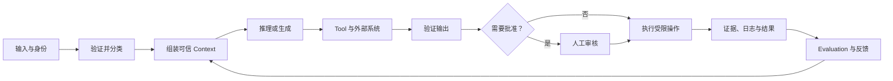

# 端到端架构与价值权衡

> 架构的艺术，在于只把复杂度投入真正能改变结果的地方。

**Type:** Reference
**Languages:** Python
**Prerequisites:** [业务探索、需求与 SLA](../../22-business-discovery-requirements-and-slas/)；Phase 14 的 Lessons 01、12 和 28
**Time:** ~135 分钟

## 学习目标

- 绘制从输入到反馈和运营的完整 Claude 系统
- 在增强型调用、工作流、Agent 和 Multi-Agent 系统之间进行选择
- 围绕证据、权限和验证边界拆解复杂工作
- 为成本、延迟、质量、安全性和可维护性之间的权衡进行辩护
- 识别增加 Model 能力仍无法修复结构性设计缺陷的情况

## 问题

某团队发布了一个合同审核助手。一个 Prompt 同时包含合同、政策库、提取 schema、谈判规则，以及生成最终修订稿的请求。演示可以运行，但生产环境不行。

大型合同超出了实际可用的 Context 预算。政策版本互相冲突。Model 返回了有效 JSON，但其中包含缺乏依据的法律结论。审核人员无法看出每项修改分别由哪个来源支持。重试只会增加成本，无法改变失败结果。更大的 Model 改善了措辞，却仍未解决来源追踪、权限和生命周期归属问题。

系统失败的原因并不是 Prompt 还少一句话，而是多个不同的职责被压缩进了同一个概率性步骤。

## 概念

### 绘制完整闭环

端到端架构包含的不只是 Model 调用。



对于每条连接，应询问：

- 哪些数据跨越了边界？
- 使用哪个身份及哪些权限？
- 强制执行什么 schema 或契约？
- 超时、含义不明确或部分失败时会发生什么？
- 保留哪些证据？
- 谁负责下一个决策？

没有失败路径的架构图只是一张营销图片。

### 选择满足需求的最小模式

有四种实用的起始模式。

#### Augmented Model Call

一次请求使用选定的 Context、检索结果或某个 Tool，并返回边界明确的输出。当步骤已知，且单轮调用能够容纳所需证据时，可将其用于 Classification、提取、起草或评分。

优势：

- 编排开销最低
- 最容易进行 Evaluation
- 延迟和成本可预测

局限：

- 不适合存在分支的工作
- 在多次外部操作之间的恢复能力有限

#### Deterministic Workflow

代码控制执行顺序，并在选定步骤调用 Claude。当业务流程稳定、可审计性很重要，或每次状态转换都需要清晰契约时，应使用该模式。

优势：

- 状态和重试明确
- 每个步骤的权限范围较窄
- 测试可复现

局限：

- 无法预先确定路径时较为脆弱
- 新的异常类别需要修改工作流

#### Adaptive Agent

Claude 根据观察结果选择下一项操作，直至满足停止条件。当证据发现过程决定执行路径，而穷举所有分支并不现实时，应使用该模式。

优势：

- 规划灵活
- 适合开放式研究和修复任务

局限：

- 延迟和成本存在波动
- 权限和 Evaluation 范围更大
- 存在循环、偏移和 Tool 错误风险

#### Multi-Agent System

协调器将相互隔离的问题委派给不同的专家或独立审核者。当工作可以分区、Context 隔离能够提高质量，或验证工作要求独立性时，应使用该模式。

优势：

- 并行执行
- 每个角色使用更小的 Context
- 独立审核

局限：

- 交接损失和重复工作
- 调用次数更多，追踪分析更困难
- 协调成本可能高于其节省的成本

不要因为 Multi-Agent 的图看起来成熟就选择它。只有具体的 Context、独立性、并行性或专业化需求足以抵偿协调成本时，才应选择它。

### 围绕契约进行拆解

糟糕的拆解方式只是按照文档章节或团队边界划分工作，却不考虑如何检查正确性。良好的拆解会在每次交接处建立契约。

对于合同审核系统：

1. 接收步骤验证文件类型、身份和司法管辖区元数据。
2. 条款分段步骤返回稳定标识符和来源区间。
3. 政策检索步骤返回带来源追踪信息的版本化证据。
4. 条款分析步骤根据 schema 返回发现结果。
5. 独立审核者检查证据覆盖情况和矛盾。
6. 修订稿生成步骤仅使用已接受的发现结果。
7. 人类法律顾问批准重大修改。
8. 系统记录决策证据和后续结果。

每个步骤的职责都比“审核这份合同”更窄。失败可以被定位。系统可以重试检索，而无需重新生成已经接受的条款分析；审核者也可以拒绝某一项发现，而不必丢弃全部工作。

### 分离语义控制和确定性控制

Claude 适合处理含义不明确的判断，例如某项条款是否实质性地改变了责任。代码更适合处理不变量，例如必填字段、权限检查、最大退款金额、允许的司法管辖区和文档版本。

使用以下规则：

```text
如果某个条件可以表示为可信数据上的稳定谓词，
就在 Model 之外强制执行它。
```

Prompt 指令能够引导行为，但不能建立安全边界。

### 为整个轨迹编制预算

成本不只是单次调用的输入 Token 加输出 Token。一次系统轨迹可能包括检索、多次 Model 调用、Tool 执行、重试、审核和人工劳动。

估算：

```text
预期任务成本 =
  Model 调用成本
  + 检索和 Tool 成本
  + 重试概率乘以重试成本
  + 人工审核分钟数乘以劳动力费率
  + 预期事件和纠正成本
```

如果较小的 Model 会导致更多重试，那么每项成功任务的成本反而可能更高。如果较大的 Model 能消除昂贵的审核步骤，它可能更便宜，但只有 Evaluation 才能证明这一点。

### 将延迟视为一种分布

平均延迟会掩盖用户实际经历的长尾。Model 耗时、Tool 耗时、排队、重试和人工批准会共同构成总延迟。

至少应使用 P50、P95 和超时率。对于交互式工作，除了总完成时间，还应追踪首次产生有用输出所需的时间。对于后台工作，吞吐量和完成期限可能比首个 Token 延迟更重要。

并行执行只对相互独立的工作有帮助。如果并行调用争用同一个速率限制，或者产生的结果仍需串行协调，那么它可能只会增加成本，而不会缩短端到端时间。

### 将反馈设计为产品界面

反馈不是一堆点赞事件。它必须将结果与输入、版本、轨迹和决策关联起来。

存储：

- 输入类别和风险等级
- Prompt、Model、Tool 和知识版本
- 检索到的证据标识符
- Tool 调用和结构化错误
- 输出和验证器结果
- 人工编辑和原因代码
- 下游结果

反馈闭环随后应支持作出决策：修改 Prompt、修复检索、调整路由、改进 Tool 或缩小范围。

## Build It

## Interactive Lab

```figure
23-architecture-tradeoff
```

使用架构权衡探索器，对增强型调用、工作流、Agent 和 Multi-Agent 设计在加权质量、延迟、成本、安全性、可审计性和变更成本证据方面进行比较。高总分无法抵消硬性约束。

## Practice Lab

从决策副本中移除一个被否决的备选方案或硬性安全关卡，观察就绪性检查失败，然后修复架构决策依据。

## Shipped Artifact

已填写的 [`outputs/architecture-decision.md`](../outputs/architecture-decision.md) 选择了确定性合同审核工作流，并记录了失败路径和反转条件。

## Verify It

运行确定性决策包验证器：

```bash
cd certifications/claude/lessons/23-end-to-end-architecture-and-value-tradeoffs
python3 code/main.py
python3 -m unittest discover -s code/tests -v
```

测验会检查相同的模式和控制决策。

## Capstone Connection

将 ADR 纳入 Architect Professional 结业项目的架构选项部分。

为一个业务工作流创建架构包。

### 第 1 步：绘制三个候选方案

分别绘制增强型调用、确定性工作流和 Adaptive Agent 设计。保持相同的输入、输出和约束，以确保比较公平。

### 第 2 步：为明确的权衡评分

采用一到五分的量表，并附上书面证据。

| 标准 | 权重 | 增强型调用 | 工作流 | Agent |
|-----------|-------:|---------------:|---------:|------:|
| 任务质量 | 25 | | | |
| P95 延迟 | 15 | | | |
| 每次成功的成本 | 15 | | | |
| 安全性与权限 | 20 | | | |
| 可审计性 | 15 | | | |
| 变更成本 | 10 | | | |

权重应来自探索结果，而不是习惯。如果受监管的操作使安全性成为硬性约束，不要用便利性对其进行平均抵消。

### 第 3 步：编写失败路径

为每个外部依赖项指定超时、重试、熔断行为、部分结果、用户消息和运营人员证据。对于 Agent，还应包含总轮次预算和成本预算。

### 第 4 步：定义 Evaluation

构建一个有代表性的集合，涵盖正常、含义不明确、对抗性和依赖失败案例。衡量最终质量、轨迹质量、成本、延迟和安全性。

### 第 5 步：记录反转条件

说明哪些证据会促使团队切换模式。架构是当前决策，而不是永久身份。

## Use It

考虑一个必须跨公司申报文件回答问题的研究系统。

如果一次检索查询能够可靠返回足够证据，单次增强型调用就适用。如果每项任务都遵循查询、检索、排序、回答和引用的步骤，则工作流适用。如果系统必须发现缺失实体、重新表述查询，并判断证据是否充足，则 Agent 适用。只有当并行来源研究或独立验证能够充分改善目标指标，足以证明协调成本合理时，Multi-Agent 设计才适用。

现在加入一小时的回答期限和严格的成本预算。最优设计可能随之改变。架构始终是在约束条件下的架构。

## 考试决策模式

当选项的复杂度不同时，应选择能够满足既定需求的最简单架构。先寻找结构性修复方案，再考虑修改 Prompt。

有力的答案通常会：

- 在代码中强制执行确定性规则
- 隔离高风险 Tool 和权限
- 对已知路径使用工作流，对真正需要自适应的路径使用 Agent
- 在独立性属于需求时增加独立审核者
- 在每次转换中保留来源追踪信息
- 定义停止、重试、部分结果和升级行为
- 优化每次成功结果的成本，而不是每次调用的成本

薄弱的答案往往只是增加更大的 Model、更长的 Prompt、更多 Agent 或更多 Tool，却没有处理真正的失败边界。

## 常见陷阱

### 能力膨胀

每个不必要的 Tool 都会扩大 Prompt 长度、选择歧义、攻击面和授权风险。仅公开当前角色所需的最小 Tool 集合。

### 试图用 Prompt 绕过缺失的契约

如果两个步骤在标识符、schema 或错误行为方面存在分歧，更清晰的自然语言指令也无法创建可靠接口。应明确定义契约。

### 将自我审核视为独立审核

要求相同 Context “再次检查”可能会重复相同的假设。当独立性很重要时，应使用具有明确评分标准和隔离证据的独立审核者。

### 只优化演示路径

生产质量体现在含义不明确、过时数据、权限错误、超时和部分失败等场景中。应在批准架构之前纳入这些场景。

## 练习

1. 为发票争议流程设计增强型调用、工作流和 Agent 候选方案。选择其中一个，并说明反转条件。
2. 在 AI 工作流中找出三个应该使用确定性代码强制执行的不变量。
3. 计算两个具有不同重试率和审核率的 Model 的每次成功任务成本。
4. 在 Multi-Agent 研究设计中加入一次 Tool 中断，并规定部分结果行为。
5. 编写一个 Evaluation，用于检测最终文案良好但轨迹浪费资源或不安全的系统。

## 关键术语

| 术语 | 人们通常所说的含义 | 实际含义 |
|------|-----------------|------------------------|
| Augmented call | 能力较弱的 Agent | 获得选定 Context 或 Tool 支持的边界明确的 Model 调用 |
| Workflow | 具有固定步骤的 Agent | 由代码负责、具有明确状态转换的编排 |
| Agent | 任何 LLM 应用 | 由 Model 驱动、根据观察结果选择操作的循环 |
| Multi-agent | 更高的智能水平 | 为实现隔离、并行或独立审核而协调的多个 Model Context |
| Contract | Prompt 指令 | 可由机器检查的数据、错误和责任边界 |
| Cost per success | Token 价格 | 每项获接受结果的预期 Model、Tool、重试、审核和纠正总成本 |

## 延伸阅读

- [Building effective agents](https://www.anthropic.com/research/building-effective-agents)，了解工作流和 Agent 模式
- [Claude Agent SDK documentation](https://platform.claude.com/docs/en/agent-sdk/overview)，了解当前的 Agent 运行框架能力
- Phase 14, Lesson 01：从基本原理构建 Agent 循环
- Phase 14, Lesson 28：编排权衡
- Phase 17, Lesson 08：有效吞吐量和延迟衡量
