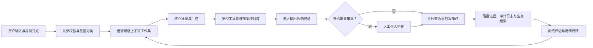

# 端到端系统架构与价值权衡 (End-to-End Architecture and Value Tradeoffs)

> 架构设计的真正精髓，在于仅在能够实质性改变业务结果的刀刃上投入系统复杂度。

**Type:** Reference
**Languages:** Python
**Prerequisites:** [业务调研、需求分析与服务等级目标](../../22-business-discovery-requirements-and-slas/); Phase 14, Lessons 01, 12, and 28
**Time:** ~135 minutes

## 学习目标

- 绘制从原始用户输入、安全过滤、推理执行到回流反馈及生产运维监控的完整 Claude 端到端系统闭环
- 在增强型模型调用（Augmented Call）、确定性工作流（Workflow）、自适应 Agent 与多智能体系统（Multi-Agent）间做出科学选型
- 围绕事实证据、权限边界与结果校验契约对复杂业务逻辑实施模块化拆解
- 全面评估并捍卫调用成本、响应延迟、交付质量、安全防护与可维护性之间的工程权衡
- 精准识别单纯提升模型参数规模无法治愈底层结构性设计缺陷的典型系统症状

## 问题背景

一个研发团队上线了一套法律合同审查助手。他们将整份合同原文、庞大的企业法务政策库、抽取字段的 JSON Schema、谈判妥协策略准则，以及最终生成修改标红（Redline）的指令，全部打包塞进了一个庞大的单阶段 Prompt 中。在局部的 Demo 演示中，系统表现惊艳；然而一旦推向生产环境，系统迅速崩溃。

超长的复杂合同直接挤爆了可用的有效上下文预算；前后不同时期的法务政策条文频繁发生逻辑冲突；模型偶尔返回一段符合语法的合法 JSON，但其包含的核心法务结论在原文中却毫无根据；人工复核律师完全无法追踪具体的修改建议究竟来自哪一份法务参考政策；失败时的自动重试机制只是在空耗 API 成本，并未改变生成逻辑的根本缺陷；团队随后尝试切换至参数规模更大的旗舰模型，虽然润色出的文本更加文雅流畅，但来源溯源缺失、越权风险以及缺乏全生命周期维护属主等结构性痼疾依然毫无改观。

这套系统的失败，绝不是因为 Prompt 里少写了一句规范要求，而是因为系统架构设计错误地将多个本应解耦的独立工程职责，粗暴地压缩进了单次充满不确定性的概率推理步骤中。

## 核心概念

### 绘制端到端全链路闭环 (Draw the Whole Loop)

一套企业级 AI 架构所涵盖的范围，远远超出单纯调用大语言模型 API 这一单步动作。


```mermaid
flowchart LR
    I["用户输入与身份凭证"] --> V["入参校验与意图分类"]
    V --> C["组装可信上下文工作集"]
    C --> R["核心推理与生成"]
    R --> T["受控工具与外部系统对接"]
    T --> O["多层输出防御校验"]
    O --> H{"是否需要审批？"}
    H -->|"是"| P["人工介入审查"]
    H -->|"否"| A["执行有边界的写操作"]
    P --> A
    A --> E["落盘证据、审计日志与业务结果"]
    E --> F["离线评估与反馈闭环"]
    F --> C
```

针对架构图中的每一条连线，架构师必须明确解答：

- 跨越该边界传递的具体数据结构是什么？
- 当前调用继承了哪类用户身份鉴权与权限作用域？
- 边界两端强制执行什么格式契约与数据 Schema？
- 遭遇网络超时、输入歧义或局部返回故障时如何处置？
- 必须持久化保存哪些可供追溯的审计证据链？
- 下一个环节决策的最终责任人是谁？

一张没有标注异常失败流转路径的架构拓扑图，只是一张用于营销宣讲的空洞插画。

### 始终选择能够满足需求的最简架构模式 (Choose the Smallest Pattern That Fits)

工程实践中存在四种经典的基准架构模式：

#### 1. 增强型模型调用模式 (Augmented Model Call)

单次 API 请求结合了精准筛选的上下文、RAG 检索片段或特定只读工具，并产出有明确边界的输出。适用于分类、抽取、文本起草或打分，且业务步骤完全已知、单轮交互足以容纳所需全部证据的场景。

核心优势：

- 编排复杂度最低，极简轻量
- 极其易于搭建确定性的离线基准评测
- 响应延迟与 Token 成本高度可预测

局限性：

- 难以应对高度复杂、动态分支的非线性任务
- 缺乏跨多个外部业务写操作之间的容灾自愈能力

#### 2. 确定性工作流模式 (Deterministic Workflow)

由程序代码硬编码控制全局流转逻辑，仅在特定选定节点上受控调用 Claude。适用于业务流程稳定已知、高度强调过程审计性，或各个流转状态之间必须实施严格契约校验的场景。

核心优势：

- 具备显式的状态机机理与受控重试逻辑
- 针对每一个特定步骤实施最小权限控制
- 测试用例高度可复现、可隔离排错

局限性：

- 当面对无法在编码阶段预先枚举所有分支的开放任务时显得僵化脆弱
- 出现新类型的业务异常时必须修改并重新发布工作流代码

#### 3. 自适应 Agent 模式 (Adaptive Agent)

由 Claude 根据上一步的执行观测结果自主决策下一步行动，循环推进直至达成终止条件。适用于任务路径高度取决于在执行中途动态发现的客观证据，且在前期枚举所有可能分支极其不现实的场景。

核心优势：

- 具备强大的自主动态规划能力
- 极其擅长处理开放式的探索研究与自动化排错修复

局限性：

- 整体响应延迟与 Token 开销存在极大的方差与不确定性
- 安全鉴权边界显著扩大，全链路评测难度成倍上升
- 伴随潜在的死循环、目标漂移与工具调用错误风险

#### 4. 多智能体系统模式 (Multi-Agent System)

由中央协调器（Coordinator）将解耦后的专项子任务分派给多个垂直领域的专家 Agent 或独立评审 Agent。适用于任务可以清晰正交拆分、上下文隔离能显著提升输出质量，或者业务核验必须依赖上下文物理独立性的高危场景。

核心优势：

- 支持高并发并行执行互不依赖的子任务
- 显著缩小各专业角色的单次上下文工作集
- 实现真正意义上剥离先验偏见的独立二次评审

局限性：

- 跨 Agent 交接存在信息衰减与重复调研的开销
- 整体网络请求次数暴增，分布式追踪与排错极其复杂
- 系统协同通信的损耗成本往往很容易超过其原本节约的推理开销

切勿仅仅因为架构图画出来显得前沿高级而盲目选用 Multi-Agent 架构。只有当明确的上下文隔离、决策独立性、并行吞吐或领域专业化收益能够远远覆盖掉昂贵的协同编排成本时，引入多 Agent 才具备正向的工程价值。

### 围绕严格的接口契约实施业务解耦 (Decompose Around Contracts)

拙劣的系统解耦往往机械地照搬文档的自然章节或现成的研发部门界限，而从未深入思考各个环节产出的正确性究竟该如何被验证。优秀的系统解耦在每一次跨边界交接点上均树立严格的契约。

以合同智能审查系统为例，标准的解耦流水线包括：

1. 准入接入阶段：严格校验文件类型格式、用户身份及合同适用的法律管辖区元数据。
2. 条款切片阶段：将长文切解为离散条款，返回全局稳定的唯一标识符与原文绝对字符区间。
3. 政策检索阶段：按需检索最新生效的法务合规政策，返回附带版本溯源信封的权威条文。
4. 条款审查阶段：基于输入契约比对条款与政策，输出符合强类型 Schema 的审查缺陷。
5. 独立评审阶段：由独立上下文中的评审 Agent 全面核验证据链支撑度与逻辑自洽性。
6. 标红生成阶段：仅基于经过独立评审放行的合法缺陷清单，产出修改建议标红。
7. 人工终审阶段：由专业执业律师对涉及重大利益的高危改动进行最终审核签字。
8. 业务归档阶段：全面持久化沉淀决策依据快照，并跟踪后续长期业务执行结果。

每一个细分步骤的职责范围都远比一句模糊的“审查这份合同”要清晰受控得多。系统故障能够被瞬间精确定位至特定节点：如果是检索不到位，系统可以定向触发检索重试，而无需推翻重跑前置已经验证通过的条款切片成果；独立评审也可以精准驳回单条有争议的修改意见，而无需将整份合同的全部工作全盘废弃。

### 明确解耦语义推断与确定性代码控制 (Separate Semantic and Deterministic Controls)

Claude 非常擅长处理充满主观裁决与模糊语义的定性判断（例如研判某项合同免责条款是否实质性加重了企业的违约赔偿责任）；而程序代码则更擅长坚守冷酷的系统不变量（例如必填字段校验、RBAC 鉴权拦截、单次退款上限、允许的法律管辖区白名单以及政策文档的版本校验）。

必须恪守以下工程铁律：

```text
凡是能够基于受信任数据表达为稳定布尔断言（Predicate）的业务条件，必须坚决在模型上下文外部由确定性代码强制执行。
```

写在 Prompt 提示词里的指令只是指导模型行为倾向的软性建议，绝不能将其误当成牢不可破的安全防御边界。

### 将系统预算核算贯穿于整个端到端执行轨迹 (Budget Across the Whole Trajectory)

真实系统的成本绝不能仅仅以单次模型 API 调用的输入加输出 Token 价格来狭隘估算。整个业务执行轨迹往往涵盖多次检索、多轮工具交互、失败重试、独立评审以及后续的人工介入复核。

综合任务期望成本估算模型：

```text
单次任务综合期望成本 =
  所有模型调用的 Token 开销总和
  + 外部知识检索与业务工具 API 调用开销
  + (单次重试概率 × 重试轮次平均成本)
  + (人工介入审查平均时长 × 人力工时单价)
  + (严重故障漏报概率 × 线上故障定损与救火成本)
```

选用参数规模更小、单价看似更便宜的模型，若在实际运行中因指令遵循能力弱而引发频繁的重试与更高比例的人工介入，其产出单条合格业务结果的综合成本反而往往远超旗舰模型。然而，究竟采用何种模型组合最具性价比，必须依靠客观真实的基准评估集数据说话，而非凭空臆测。

### 始终将响应延迟视为一条统计概率分布曲线 (Treat Latency as a Distribution)

平均延迟（Average Latency）极易粉饰太平，掩盖终端用户真实经历的长尾延迟灾难。模型生成耗时、外部工具网络 I/O、任务排队堆积、网络抖动重试以及人工审查滞留，会层层叠加并产生延迟放大效应。

在监控中必须重点追踪 P50、P95、P99 以及超时中断率（Timeout Rate）。对于前端交互式场景，首字生成时间（TTFT）与产出首个可用有效结构的时间往往比整场交互的终结耗时更加决定用户体验；而对于后台异步批处理任务，端到端吞吐量（Throughput）与批次交付截止时效的遵守率，则远比毫秒级的单步延迟更加关键。

盲目的并行执行仅对完全互不依赖的子任务有加速效果。若并发发起的多个请求共享同一个底层 API 频控上限（Rate Limit），或者并发产出的非结构化结果最终仍需在主干串行执行昂贵的人工对账合并，这种并行化不仅无法缩短端到端时延，反而会带来严重的成本虚耗。

### 将反馈闭环设计为严肃的系统级产品表面 (Design Feedback as a Product Surface)

反馈体系绝不是在界面上简单收集几个毫无上下文的“点赞”或“点踩”按钮。它必须能够将最终的业务表现结果，精准穿透并关联回最初的输入数据、环境快照、执行轨迹与核心决策。

必须结构化持久沉淀的核心要素：

- 输入用例的风险层级与业务分类打标
- 触发该决策时的 Prompt 模版版本、底层模型版本、工具 Schema 版本与知识库快照版本
- 实际检索调用的权威证据条目唯一标识
- 中途执行的全部工具调用入参及返回的结构化错误明细
- 模型输出产物及各层校验器拦截日志
- 人工介入专家修改后的最终版本及明确的驳回原因码（Reason Codes）
- 该业务记录在下游系统中产生的后续履约结果反馈

唯有掌握了如此高保真的追踪链路，反馈闭环才能真正驱动系统的科学迭代：指导工程师准确研判究竟应当优化 Prompt 引导词、修复外部知识检索策略、调整风控路由分流门限、重构底层工具契约，还是收缩该业务场景的自动开放范围。

## 动手构建

## 交互式实验

```figure
23-architecture-tradeoff
```

运行系统架构权衡交互图，在加权质量、P95 延迟、综合成本、安全合规、审计透明度以及维护改造成本六大维度上，横向比对增强型调用、确定性工作流、自治 Agent 与多 Agent 四大架构路线。交互实验深刻揭示了：当不可逾越的刚性安全门禁亮起红灯时，哪怕总分被其他便利性维度拉得再高，该方案依然属于不合格的危险设计。

## 实战演练

从一份现成的架构决策记录中，人为删去已被驳回的备选方案说明或硬性安全门禁条款，观察系统就绪性检查的报错拦截，随后补齐严谨的架构取舍技术论据。

## 交付产物

本课交付的标准架构产物位于 [`outputs/architecture-decision.md`](../outputs/architecture-decision.md)，详细记录了一个面向企业级合同审查场景的确定性工作流选型决议，附带详尽的异常故障流转分支设计与明确的架构推翻逆转条件（Reversal Condition）。

## 验证方法

在本地执行离线架构决策数据包的自动化验证：

```bash
cd certifications/claude/lessons/23-end-to-end-architecture-and-value-tradeoffs
python3 code/main.py
python3 -m unittest discover -s code/tests -v
```

课后测验将全面考查架构模式选型、系统不变量控制以及全生命周期价值权衡的核心设计思想。

## 项目连接

将这份沉淀完毕的架构决策记录（ADR），直接并入架构师专业级终极大作业（Architect Professional Capstone）的核心架构选型章节。

针对一项具体的企业核心业务工作流，构建完整的架构决策数据包：

### 步骤 1：梳理三套平行的候选架构设计

针对完全相同的业务输入、产出目标与不可妥协的硬性约束，分别绘制出增强型调用（Augmented Call）、确定性工作流（Deterministic Workflow）与自适应 Agent（Adaptive Agent）三套独立的方案设计图，确保评测环境公平公正。

### 步骤 2：对显式权衡维度进行量化评分

采用 1 到 5 分的打分体系，并强制为每一个打分附带严谨的书面事实论据。

| 核心评估维度 | 权重占比 | 增强型调用方案 | 确定性工作流方案 | 自适应 Agent 方案 |
|--------------|---------:|---------------:|-----------------:|------------------:|
| 核心任务质量 | 25 | | | |
| P95 响应延迟 | 15 | | | |
| 成功交付综合成本 | 15 | | | |
| 安全防护与权限收敛 | 20 | | | |
| 过程可审计性 | 15 | | | |
| 长期维护演进成本 | 10 | | | |

各维度的权重分配必须严格脱胎于前期的业务调研结论，而非凭个人直觉随意指派。若外部法规对某项高危写操作设立了刚性的法律合规底线，安全维度的要求即属于绝对不可妥协的一票否决项，绝不能被操作便捷性或响应速度等优势所折抵稀释。

### 步骤 3：详尽设计异常故障流转路径

针对系统涉及的每一个外部第三方依赖，逐一明确定义调用超时、退避重试、熔断降级（Circuit Break）、局部结果交付、面向终端用户的安全提示文案，以及提供给运维人员的排障审计证据。针对自适应 Agent 方案，必须硬编码不可逾越的交互轮次配额与综合 Token 成本预算。

### 步骤 4：构建全方位综合评估基准集

搭建具备高度代表性的评估样本库，全面覆盖常规黄金用例、边界模糊用例、恶意提示词注入用例以及下游接口故障注入用例。全方位度量最终输出质量、执行轨迹规范性、综合成本、延迟分布与安全防御拦截率。

### 步骤 5：白纸黑字记录架构推翻逆转条件

清晰阐明：未来在观测到哪些客观证据或业务条件发生变化时，团队应当果断推翻当前选型并平滑切换至另一种架构模式。架构设计是立足于当前现实约束下的科学阶段性决断，绝不是永久固化、不可撼动的教条图腾。

## 实践应用

以构建一套能够跨企业海量财务与法律年报开展精准穿透分析的深度问答系统为例：

- 当单次精准检索即可稳定召回充足且确凿的事实证据时，采用最轻量的**增强型模型调用模式**是性价比最高的明智之举。
- 当每项调研任务均严格遵循固定步骤（如“提取关键财务指标 -> 检索历史财报对应章节 -> 执行跨期数值校验比对 -> 汇总输出规范报告并精确标注来源引文”）时，采用**确定性工作流模式**能够获得无可比拟的稳定性、审计透明度与低延迟表现。
- 当必须依据中途偶然挖掘出的可疑线索动态展开多轮深度调查（例如发现某项异常对外担保，需临时决定进一步穿透核查其关联方交易背景，并动态研判现有证据是否足以支撑下定结论）时，赋予灵活规划能力的**自适应 Agent 模式**才是破局的核心利器。
- 只有当跨数据源的并行独立调研或剥离先验偏见的独立交叉核验能够成倍放大最终研报的可信度，且这一质量跃升的商业价值足以全面覆盖昂贵的系统协同损耗时，引入复杂的**多智能体系统模式**才真正具备正向的工程合理性。

此时，若业务方临时追加硬性约束：“系统必须在 30 秒内完成答复，且单次问答成本不得超过 0.05 美元”，原本的最优架构路线可能会瞬间发生逆转。脱离了现实资源与业务约束的架构设计，没有任何实际工程意义。

## 考试决策模式

当面临多个复杂度各异的备选方案时，始终选择**能够完全满足已知业务与安全约束的最简单架构**。在试图修补 Prompt 提示词之前，优先寻找系统结构层面的解耦治理之道。

在认证考核中，推荐优先选择具备以下特质的高分方案：

- 坚决将确定性的硬性规则在模型外部由代码强制守护
- 对高危破坏性工具与核心系统权限实施严格的物理隔离
- 对执行路径已知的业务采用确定性工作流，仅在真正需要自适应规划的环节选用 Agent
- 当业务客观要求必须进行无偏见验证时，引入纯净上下文中的独立评审员机制
- 在全链路的每一次数据转换与格式映射中，始终完整维系数据源的溯源链条
- 预先严密定义终止条件、退避重试策略、局部结果输出格式以及向上升级机制
- 紧密围绕“产出单次成功业务结果的综合成本”进行系统优化，而非孤立盯着单次调用的 Token 单价

坚决摒弃那些在未看清系统真实故障边界前，就轻率地试图通过换用更大模型、增加 Prompt 篇幅、无脑引入更多 Agent，或一股脑塞入更多工具的低级错误选项。

## 常见陷阱

### 工具能力无限膨胀 (Capability Bloat)

每增加一个缺乏必要性的边缘工具，都会无端增加 Prompt 的体积消耗、诱发模型产生选型歧义、放大潜在的系统受攻击面，并显著加剧安全越权漏洞的爆发概率。仅向当前角色暴露完成其特定职责所需的最小工具集。

### 试图通过优化 Prompt 来掩盖缺失的系统契约 (Prompting Around a Missing Contract)

如果系统上下游两个处理节点之间在数据主键标识、返回 Schema 格式或异常报错规范上缺乏统一标准，写再多洋洋洒洒的自然语言提示词也绝不可能凭空创造出一个高可靠的软件接口。必须老老实实建立确定性的数据契约。

### 误把自我审查当成客观独立评审 (Self-Review as Independence)

让同一个上下文窗口中的模型对自己刚刚生成的结论进行“二次复核检查”，极大概率只会机械地重复其最初推导时的先验思维定势。当客观独立性是一项关键安全合规要求时，必须使用一个剥离了生成者思考脉络的全新独立上下文，并注入明确的评审细则展开客观审核。

### 陷入面向 Demo 演示的局部优化陷阱 (Optimizing the Demo Path)

一套软件系统能否在生产环境中真正长期存活，完全取决于其对模糊歧义输入、陈旧失效数据、越权权限报错、网络 I/O 超时以及局部故障返回等海量长尾异常的处置能力。在架构方案正式定稿前，必须将这些非正常路径的处理机制全部清晰纳入考量。

## 课后习题

1. 针对企业发票争议仲裁业务流程，分别设计增强型调用、确定性工作流以及自适应 Agent 三套平行的架构草案，并明确阐述在何种条件下应当推翻选型并发生方案逆转。
2. 深入审查一个现有的复杂 AI 工作流，精准定位出三个应当立即剥离出来改由确定性代码硬编码实现的核心系统不变量。
3. 假设有两个候选模型，其中较小模型的单次 API 单价只有大模型的一半，但其重试率高出三倍且引发人工介入的概率高出四倍。请结合具体参数建立数学模型，精确计算产出单次成功业务结果的真实综合成本。
4. 在一个多智能体协同研究系统的架构设计中，主动注入外部工具突发宕机故障，详细编写系统在面临断点时应当返回的标准局部结果（Partial Result）数据结构。
5. 设计一套端到端基准评测方案，要求其不仅能够打分评估系统最终输出的文本质量，还能敏锐识别出在后台执行轨迹中存在浪费性 Token 空耗或潜在安全越权违规的劣质系统。

## 核心术语

| 术语 | 通俗说法 | 严谨工程定义 |
|------|----------|--------------|
| 增强型模型调用 (Augmented call) | 弱一点的 Agent | 仅供给精准上下文切片或受限只读工具的单次有明确边界的模型交互 |
| 确定性工作流 (Workflow) | 步骤固定的 Agent | 由宿主程序代码主导编排流转、具备显式状态转换机制的受控执行体系 |
| 智能体 (Agent) | 任何 LLM 应用 | 由大语言模型主导推理循环、依据环境观测结果动态自适应决定后续行动的闭环系统 |
| 多智能体系统 (Multi-agent) | 更高维的智慧 | 协调多个具备独立上下文窗口的模型实例，以实现上下文隔离、并行加速或无偏见独立评审的复合架构 |
| 接口契约 (Contract) | 一段 Prompt 提示 | 在系统各模块交接处用于规范数据格式、异常分类与权责归属的机器可校验刚性协议 |
| 单次成功综合成本 (Cost per success) | Token 单价 | 包含所有模型调用、工具执行、失败重试、人工复审及灾难挽回成本在内的综合端到端期望成本期望值 |

## 延伸阅读

- [Anthropic 官方研究报告：构建高效智能体 (Building Effective Agents)](https://www.anthropic.com/research/building-effective-agents)
- [Claude Agent SDK 官方全套开发指南](https://platform.claude.com/docs/en/agent-sdk/overview)
- 本教程 Phase 14 第 01 课：从第一性原理构建 Agent 推理循环
- 本教程 Phase 14 第 28 课：工作流与 Agent 编排模式横向对比与权衡
- 本教程 Phase 17 第 08 课：系统有效吞吐量（Goodput）与长尾响应延迟治理
