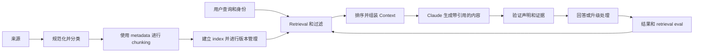

# RAG、Retrieval 与数据流水线

> 基于证据的答案，其可信度取决于到达 Model 的证据。

**Type:** Build
**Languages:** Python
**Prerequisites:** [端到端架构与价值权衡](../../23-end-to-end-architecture-and-value-tradeoffs/)；Phase 11，Lessons 06 和 07；Phase 5，Lesson 23
**Time:** ~150 分钟

## 学习目标

- 设计 ingestion、chunking、indexing、retrieval、generation 和 citation 边界
- 根据数据形态选择 sparse、dense、hybrid、filtered 和 iterative retrieval
- 在更改 Model 或 Prompt 之前诊断 retrieval 故障
- 分别衡量 retrieval 质量和答案质量
- 在整个流水线中保持时效性、访问控制和 provenance

## 问题

某个政策助手已经正常工作了数月。文档刷新后，它开始根据旧的退款阈值给出充满信心的答案。Model 版本、Prompt 和延迟均未发生变化。

团队在 Prompt 中加入“使用最新政策”。情况没有任何改善。Model 无法遵循从未收到的证据。index 同时包含两个政策版本，但缺少 metadata filter；由于过时 chunk 的措辞与查询匹配得更紧密，retriever 将它排在了第一位。

这是一起 retrieval 事故。将其当作 Model 事故处理会浪费时间，还可能掩盖真正的控制故障。

## 概念

### RAG 是一个数据系统

Retrieval-augmented generation 由两个相互连接、但故障模式不同的系统组成。



即使 Model 表现出色，系统仍可能因为以下原因而失败：

- 来源从未被 ingestion
- parsing 丢失了相关表格
- chunking 将条件与其例外情况拆开
- index 使用了过时或不兼容的表示
- filter 忽略了租户、司法辖区、日期或权限
- ranking 优先选择了关键词匹配，而不是权威来源
- Context 组装截断了最佳证据
- generation 引用了一个 chunk，却提出了超出该 chunk 支持范围的主张

应诊断最早发生故障的边界。

### 围绕含义和 Retrieval 设计 Chunk

固定 Token chunk 是一种基线方案，并非通用答案。chunk 的形态应保留人们会引用的完整单元。

对于政策类文章，标题和段落通常可以提供有效边界。对于 API 文档，应将方法签名与参数和错误放在一起。对于表格，应为每组行保留表头。对于工单，单条消息可能需要对话 Context。对于源代码，函数和类比任意字符窗口更合适。

当某项事实跨越边界时，重叠会有所帮助，但它也会复制证据、增大 index，并可能让几乎相同的文本挤占最终 Context。应对其进行衡量。

每个 chunk 都需要 metadata：

- 稳定的文档和 chunk 标识符
- 来源 URI 或记录系统标识符
- 版本和生效日期
- 租户、司法辖区、产品或内容类型
- 访问控制属性
- ingestion 和 parser 版本
- 父级标题和位置

metadata 让 retrieval 受到治理，而不只是追求相似性。

### 根据查询和数据形态选择 Retrieval

#### Sparse Retrieval

BM25-style retrieval 匹配显式术语。它非常适合标识符、产品名称、错误代码和政策短语，成本低且可解释。

#### Dense Retrieval

Embedding 匹配语义相似性。当用户改述某个概念，或者查询与来源所用词汇不同时，它们会有所帮助。它们可能遗漏精确标识符，也可能 retrieval 到语义相关但并非权威来源的文本。

#### Hybrid Retrieval

结合 sparse 和 dense 候选项，然后进行融合或 rerank。与单独使用任一方法相比，hybrid retrieval 往往能更好地处理自然语言与标识符混合的查询。

#### Filtered Retrieval

在证据到达 Model 之前，应用可信 metadata 和授权规则。不要让 Claude 忽略用户无权查看的 chunk。禁止访问的数据不应进入 Context。

#### Iterative Retrieval

Agent 可以重新表述查询、跟踪引用或识别缺失的证据。当发现过程确实需要自适应时，才使用这种方式。应设置查询次数、轮次、时间和成本预算。稳定的问答流水线默认不应承担 agentic 复杂性。

### 分别进行 Retrieval Evaluation 与答案 Evaluation

如果正确证据没有出现在排名靠前的候选项中，答案质量就会存在上限。应先衡量 retrieval。

有用的指标包括：

- recall at K：候选集合是否包含所需来源？
- precision at K：候选集合中有多少内容与查询相关？
- mean reciprocal rank：首个相关来源出现得有多早？
- nDCG：ranking 是否将高度相关的来源排在前面？
- freshness coverage：结果是否使用了当前有效版本？
- authorization leakage：是否有任何结果违反了调用者的访问权限？

然后对 generation 进行 Evaluation：

- 引用证据对声明的支持程度
- citation 的正确性和完整性
- 答案完整性
- 证据不足时是否拒绝作答
- 不同来源之间的冲突检测

单一的端到端评分无法告诉你应该修复哪一层。

### 将 Provenance 作为数据保留

不要让 provenance 只以答案生成后附加的说明文字形式存在。应让来源标识符贯穿 retrieval、Context 组装、输出 schema 和日志。

对于每项声明，应保留：

- 来源文档和 chunk 标识符
- 来源版本和生效日期
- 提供支持的确切文本范围
- retrieval score 和 rank
- transformation 或 summarization 步骤

如果来源存在冲突，应报告冲突。除非该领域存在显式的优先级规则，否则不要默默选择日期最新的来源。

### 使刷新过程具备原子性和可观测性

文档刷新可能会产生新旧 chunk 并存的混合 index。更安全的模式是构建新版本、对其进行验证，然后以原子方式切换 alias 或 pointer。在新 index 通过 retrieval 和 freshness 检查之前，应保留回滚能力。

监控以下项目：

- ingestion 成功率和延迟
- 已解析内容的数量和大小
- 各来源的有效版本
- Embedding 或 index 版本
- 空结果率和低分结果率
- retrieval 分布偏移
- Evaluation 中失败最多的查询

## 动手构建

## 交互实验

```figure
24-rag-ranking
```

在编辑代码之前，使用 ranking 实验比较词法匹配、metadata filter、过时来源排除和 top-K 行为。可见的 rank 会将一次 retrieval 决策与 recall、reciprocal rank、freshness 和 provenance 联系起来。

## 实践实验

向 fixture 的副本中添加一份过时或未经授权的文档，并证明它在 generation 之前无法进入候选集合。

## 交付产物

[`outputs/retrieval-evidence-report.json`](../outputs/retrieval-evidence-report.json)
是一份填写完整的基线报告，其中包含已排序的 chunk 标识、有效来源版本和 retrieval 指标。

## 验证

使用以下命令复现并验证：

```bash
cd certifications/claude/lessons/24-rag-retrieval-and-data-pipelines/code
python3 main.py
python3 -m unittest discover tests -v
```

六道题的测验会检查故障诊断和 retrieval 选择能力。

## 与综合项目的联系

将证据报告用于 Architect Professional 综合项目中的 RAG Evaluation 和 freshness 门禁。

该实验使用 Python standard library 实现了一个小型 BM25-style index。它有意保持透明。生产环境中的搜索系统速度更快、能力更强，但 scoring 和 metadata 边界不应再显得神秘。

运行方式：

```bash
cd certifications/claude/lessons/24-rag-retrieval-and-data-pipelines/code
python3 main.py
python3 -m unittest discover tests -v
```

### 第 1 步：规范化 Token

`tokenize` 将文本转换为小写并提取字母数字术语。生产流水线需要能够感知语言的 Tokenization、字段处理和 parser 测试。本课程仅保留 ranking 概念。

### 第 2 步：使用稳定标识进行 Chunking

`chunk_document` 创建相互重叠的词语窗口，同时保留文档 ID、位置、更新时间和稳定的 chunk ID。无效的重叠设置会尽早失败，而不会造成无限循环。

### 第 3 步：在建立 Index 前排除无效来源

`RetrievalIndex.build` 会忽略无效的文档版本。这是一个经过简化的 freshness 门禁。在生产环境中，版本激活应与经过验证的 index 版本和原子切换绑定。

### 第 4 步：以透明方式计算 Score

index 会计算 term frequency、document frequency、长度归一化和 inverse-document-frequency score。精确的查询术语可以提高真正包含当前有效政策内容的来源排名。

### 第 5 步：返回 Provenance

每个 `RetrievalHit` 都携带文档 ID、chunk ID、更新日期、文本和 score。generation 层应使用这些结构化证据，并返回指向相应证据的声明链接。

### 第 6 步：对 Retriever 进行 Evaluation

`evaluate_retrieval` 根据带 Label 的案例计算 recall at K 和 mean reciprocal rank。在更改 ranking 之前，应添加正常、歧义、过时版本、权限和对抗性查询。

## 应用它

生产系统通常会组合使用文档 parser、对象存储、sparse 或 Vector index、metadata filter、reranker 和 Evaluation 流水线。即使托管服务隐藏了实现，也应保留相同的契约。

针对该政策事故：

1. 复现查询并检查 retrieval 得到的 chunk ID。
2. 确认 index 中当前有效的来源版本。
3. 检查阈值及例外情况周围的 parsing 和 chunk 边界。
4. 验证身份和 metadata filter。
5. 比较 sparse、dense 和 hybrid 候选集合。
6. 在修复前后运行冻结的 retrieval Evaluation。
7. 以原子方式切换经过验证的 index，并保留回滚能力。
8. 在 generation 层重新运行声明支持度 Evaluation。

不要一开始就更改 temperature 或 Model 大小。它们都无法找回缺失或禁止访问的证据。

## 考试决策模式

如果答案在文档刷新后立即出错，而 Model 和延迟保持稳定，应首先调查 ingestion、indexing、filtering 和 retrieval。

可靠的架构选择包括：

- 根据精确标识符和语义改述选择 retrieval
- 在 generation 之前根据身份和 metadata 进行过滤
- 对来源和 index 进行版本管理
- 分别对 retrieval 和最终答案进行 Evaluation
- 让 provenance 贯穿输出契约
- 显式表示证据不足或证据冲突

薄弱的选择包括：

- 告诉 Model 记住最新文档
- 将所有来源加入 Context
- 在检查候选项之前替换 Model
- 依赖不带来源标识符的生成式 citation

## 常见陷阱

### 更多 Context 意味着更充分的依据

不相关的 Context 会争夺 Attention，并可能掩盖最佳证据。更好的 retrieval 和排序通常优于更大的 Context payload。

### 相似就意味着权威

语义相似性并不包含政策优先级、权限或生效日期。这些信息需要通过 metadata 和规则表达。

### Citation 有效就意味着声明有依据

citation 可能指向一个真实来源，但该来源并不能支持完整声明。应对 entailment 和 coverage 进行 Evaluation，而不只是验证链接是否有效。

### 刷新意味着追加

追加新 chunk 而不停用旧版本会产生相互矛盾的证据。应将刷新视为一次版本化部署。

## 练习

1. 添加能够感知字段的 boosting，使标题匹配得分高于正文匹配。
2. 添加司法辖区 filter，并编写测试证明未经授权的 chunk 永远不会出现在候选项中。
3. 基于两个已排序列表构建 hybrid rank-fusion 函数。
4. 创建十个 retrieval 案例，其中精确标识符和改述需要使用不同的策略。
5. 设计包含验证和回滚的原子 index 刷新检查清单。

## 关键术语

| 术语 | 人们常说的含义 | 它的实际含义 |
|------|-----------------|------------------------|
| Chunk | 固定数量的 Token | 具有标识和 metadata、可被 retrieval 和引用的单元 |
| Sparse retrieval | 旧式关键词搜索 | 基于术语的 ranking，尤其擅长处理精确词汇和标识符 |
| Dense retrieval | 语义真相 | Embedding 空间中的相似性，而非权威性或事实支持 |
| Hybrid retrieval | 两个数据库 | 将精确信号和语义信号结合起来的候选项融合 |
| Recall at K | 答案准确率 | 所需证据是否出现在 retrieval 得到的前 K 个项目中 |
| Provenance | 生成的脚注 | 从来源一直传递到声明的结构化血缘信息 |

## 延伸阅读

- [Claude citations 文档](https://platform.claude.com/docs/en/build-with-claude/citations)，了解当前的 citation 支持
- [Claude token counting 文档](https://platform.claude.com/docs/en/build-with-claude/token-counting)，了解 Context 预算
- Phase 11，Lesson 06：从第一性原理构建 RAG 流水线
- Phase 11，Lesson 07：高级 retrieval 和 reranking
- Phase 19，Lesson 65：hybrid sparse 和 dense retrieval
