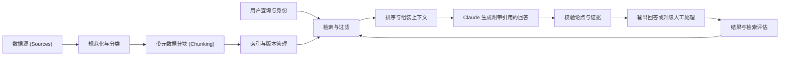

# RAG、检索与数据管道 (RAG, Retrieval, and Data Pipelines)

> 模型的回答之所以可信，完全取决于输入给它的证据是否真实可靠。

**Type:** Build
**Languages:** Python
**Prerequisites:** [End-to-End Architecture and Value Tradeoffs](../../23-end-to-end-architecture-and-value-tradeoffs/); Phase 11, Lessons 06 and 07; Phase 5, Lesson 23
**Time:** ~150 minutes

## 学习目标

- 设计数据摄取（Ingestion）、分块（Chunking）、索引（Indexing）、检索（Retrieval）、生成（Generation）与引用（Citation）的系统边界
- 根据数据形态精确匹配稀疏检索（Sparse）、稠密检索（Dense）、混合检索（Hybrid）、过滤检索（Filtered）与迭代检索（Iterative）
- 在修改模型或 Prompt 之前，优先排查与诊断检索层的故障
- 将检索质量评估与模型回答质量评估解耦并独立度量
- 确保在整个管道中贯穿数据时效性（Freshness）、访问控制（Access Control）和可追溯源头（Provenance）

## 问题背景

一个企业政策问答助手稳定运行了数月。在一次文档库更新后，它突然开始极为自信地依据旧的退款金额阈值回答问题。此时模型版本、Prompt 提示词以及系统延迟均未发生任何变动。

团队尝试在 Prompt 中追加“请使用最新政策”的指令，但收效甚微。模型根本无法遵循它从未接收到的证据：索引库中同时残留着新旧两个版本的政策文档，且缺失了元数据过滤字段（Metadata Filter）；检索器仅仅因为旧文档的用词与用户提问更吻合，就将其排在了最前面。

这是一起典型的检索层事故（Retrieval Incident）。如果误将其当作模型层问题处理，不仅徒劳无功，还会掩盖真正的系统控制缺陷。

## 核心概念

### RAG 是一个数据系统

检索增强生成（RAG）由两个紧密相连但具有完全不同故障模式的子系统组成。


```mermaid
flowchart LR
    S["数据源 (Sources)"] --> N["规范化与分类"]
    N --> C["带元数据分块 (Chunking)"]
    C --> I["索引与版本管理"]
    Q["用户查询与身份"] --> R["检索与过滤"]
    I --> R
    R --> K["排序与组装上下文"]
    K --> G["Claude 生成附带引用的回答"]
    G --> V["校验论点与证据"]
    V --> O["输出回答或升级人工处理"]
    O --> E["结果与检索评估"]
    E --> R
```

即使模型能力极为出色，整个系统依然可能因为以下原因而崩溃：

- 数据源根本未被摄取入库
- 文档解析（Parsing）时遗漏了核心表格
- 文本分块将先决条件与例外条款割裂到了不同块中
- 索引库使用了过时或不兼容的数据表示
- 过滤机制忽略了租户（Tenant）、司法管辖区（Jurisdiction）、生效日期或权限控制
- 排序算法优先考虑了表层关键词匹配，而非权威官方来源
- 上下文组装时截断了最关键的支撑证据
- 模型生成阶段虽然引用了某文本块，但回答内容超出了该证据的支撑范围

因此，排查故障必须从最上游出现裂痕的边界开始。

### 围绕语义与检索需求设计分块 (Chunking)

固定 Token 长度的分块只是一种基线兜底方案，绝非通用答案。分块的粒度应当保持为人类在引用该内容时所采用的自然语义单元。

对于政策类文本，标题与自然段往往是理想的边界；对于 API 文档，必须将函数签名、参数列表和错误说明保持在同一块中；对于表格，每组数据行必须保留其表头信息；对于客服工单，单条消息通常需要携带上下文对话流；对于源代码，函数与类结构远优于任意长度的字符滑动窗口。

分块重叠（Overlap）有助于缓解事实跨越边界被切断的问题，但它也会带来证据冗余、增大索引体积，并导致最终上下文中充斥着高度近似的重复文本。这一指标必须通过实测来评估平衡。

每一个文本块都必须携带结构化元数据：

- 全局稳定的文档与文本块标识符（Document / Chunk ID）
- 原始数据源 URI 或权威记录系统（System-of-Record）标识符
- 版本号与生效日期（Version & Effective Date）
- 租户、适用管辖区、产品线或内容分类
- 访问控制属性（Access-Control Attributes）
- 摄取管道与解析器版本
- 父级标题层级与文档中的绝对位置

元数据是让检索从单纯的“相似度匹配”转变为具备企业合规与治理能力的关键。

### 根据查询特征与数据形态选择检索机制

#### 稀疏检索 (Sparse Retrieval)

以 BM25 为代表的词法检索基于精确术语匹配。它在处理唯一标识符、产品代号、错误代码以及特定政策短语时表现极其强劲，且计算开销低、结果完全可解释。

#### 稠密检索 (Dense Retrieval)

基于向量 Embedding 的检索通过语义向量空间进行匹配。当用户提问使用同义转述、或者用户提问词汇与源文档表达不一致时，稠密检索能发挥巨大价值。然而，它容易忽略精确的特定标识符，并且可能检索出语义高度相关但缺乏权威性的无关文本。

#### 混合检索 (Hybrid Retrieval)

将稀疏检索与稠密检索的候选集结合，随后进行结果融合（Fusion）或重排（Rerank）。混合检索在应对混合了自然语言描述与专业标识符的复杂查询时，表现通常显著优于单一检索机制。

#### 过滤检索 (Filtered Retrieval)

在证据进入模型上下文之前，必须严格应用可信元数据与权限校验。绝不能依赖 Claude 去“忽略”用户无权查看的文本块。未经授权的数据绝不允许进入 Prompt 上下文。

#### 迭代检索 (Iterative Retrieval)

允许 Agent 重新改写查询、顺藤摸瓜追踪引用，或主动发现缺失的证据。仅在信息检索路径确实具有动态适应需求时才采用此模式，并务必设定查询次数、对话轮次、耗时和成本预算上限。常规稳定的问答管道切忌默认引入 Agent 复杂度。

### 解耦检索评估与回答评估

如果检索到的 Top-K 候选结果中根本没有正确证据，回答质量就注定存在不可逾越的上限。因此必须先独立度量检索质量。

常用的检索评估指标包括：

- Recall@K（召回率）：候选集中是否包含了必须引用的源文档？
- Precision@K（准确率）：候选集中有多少内容是真正相关的？
- MRR（Mean Reciprocal Rank，平均倒数排名）：第一个相关证据出现的位次有多靠前？
- nDCG（归一化折损累计增益）：排序算法是否成功将高相关度文档排在最前？
- 新鲜度覆盖率（Freshness Coverage）：检索结果是否全部来自当前生效的版本？
- 权限泄漏率（Authorization Leakage）：是否存在违背调用方权限的数据泄露？

在确认检索层达标后，再评估生成层：

- 论点支撑度（Claim Support）：回答中的每一项论断是否有引用证据严格支撑？
- 引用的准确性与完整性（Citation Correctness & Completeness）
- 回答完整度（Answer Completeness）
- 证据不足时的拒答能力（Abstention）
- 多源证据冲突时的识别能力（Conflict Detection）

切记：单一的端到端打分无法告诉你究竟需要修复哪一层。

### 将证据追溯链 (Provenance) 作为一等公民数据结构

切勿让溯源信息仅仅停留在模型生成后追加的一段自然语言说明中。应当让源文档标识符贯穿检索、上下文组装、输出 Schema 定义以及审计日志全流程。

对于模型给出的每一个论点，系统都应保留：

- 源文档与文本块唯一 ID
- 数据源版本与生效日期
- 精确的支撑文本切片（Supporting Span）
- 检索相关性得分与排名位置
- 所经历的数据转换或摘要步骤

若不同数据源之间存在事实冲突，系统必须明确指出冲突，除非当前业务领域具备硬性规定的优先级判定规则，否则不得悄然按时间戳默认覆盖。

### 保证刷新操作的原子性与可观测性

文档库的直接增量刷新极易导致新旧文本块在同一个索引中混杂共存。更为安全的架构是：在后台构建新版本索引，完成质量验证后，通过别名（Alias）或指针原子性地切换流量。在新索引通过检索质量与新鲜度双重门禁前，始终保留回滚能力。

生产环境必须监控的核心指标：

- 数据摄取成功率与处理延迟
- 解析后的文档数量与体量分布
- 各数据源的当前活跃版本号
- Embedding 模型或向量索引版本
- 空结果率（Empty-Result Rate）与低分查询占比
- 检索召回分布的漂移（Distribution Shift）
- 评估测试集中排名前列的高频失败查询

## Build It (动手构建)

本实验使用 Python 标准库实现了一个透明且易于调试的轻量级 BM25 风格检索索引。虽然生产级搜索系统具备更高的并发性能与特性，但底层评分计算与元数据边界的核心逻辑与之一致。

代码结构包含以下关键步骤：

- **步骤 1：Token 规范化**：`tokenize` 函数将输入文本转为小写并提取字母数字词元。生产管道需要支持多语言分词与字段映射。
- **步骤 2：稳定标识符分块**：`chunk_document` 在滑动窗口切分文本的同时，注入文档 ID、文本位置、更新时间以及全局唯一的块 ID，并在配置非法时尽早报错。
- **步骤 3：索引前排除失效源**：`RetrievalIndex.build` 自动过滤非活跃状态的文档版本，构成最小可行的新鲜度门禁。
- **步骤 4：透明化评分**：索引计算词频（TF）、文档频率（DF）、长度归一化因子与逆文档频率（IDF），确保包含最新政策条款的源文档能排在前列。
- **步骤 5：返回结构化溯源信息**：每次检索返回的 `RetrievalHit` 均包含完整元数据，供生成层进行精确引用绑定。
- **步骤 6：检索器指标评测**：`evaluate_retrieval` 针对标注数据集计算 Recall@K 和 MRR 指标。

## Interactive Lab (交互式实验)

```figure
24-rag-ranking
```

在修改代码前，请使用上述排序实验台对比词法匹配、元数据过滤、过期数据排除以及 Top-K 设定的行为表现。通过可视化的排序名次，直观理解检索策略对召回率、倒数排名、新鲜度以及数据溯源的深远影响。

## Practice Lab (实战演练)

在测试数据固件（Fixture）的副本中添加一份已过期或未经授权的文档，编写测试断言以证明该文档在证据进入生成阶段前已被确定性排除在候选集之外。

## Shipped Artifact (交付产物)

[`outputs/retrieval-evidence-report.json`](../outputs/retrieval-evidence-report.json) 包含了一份完整的基线报告，记录了带排名的文本块标识、当前活跃源版本以及各项检索评估指标。

## Verify It (验证方法)

使用以下命令重现并验证实验代码与测试套件：

```bash
cd certifications/claude/lessons/24-rag-retrieval-and-data-pipelines/code
python3 main.py
python3 -m unittest discover tests -v
```

课后配备的 6 道测试题目将全面检验你对检索故障排查及技术选型的掌握程度。

## Capstone Connection (项目连接)

请将此处的证据报告和时效性判定逻辑，迁移复用到 Architect Professional Capstone 项目中的 RAG 评估套件与时效门禁架构中。

## Use It (生产应用)

生产级系统通常组合使用文档解析器、对象存储、稀疏/向量索引、元数据过滤器、Reranker 重排器及离线评估管道。即使采用托管云服务，以下治理流程契约亦不可或缺。

面对政策失效类线上事故，标准的处置排查顺序如下：

1. 复现问题 Query，检查检索召回的具体 Chunk ID。
2. 确认当前索引库中被标记为活跃的源版本。
3. 检查针对关键阈值和例外条款的解析及分块边界是否发生语义断裂。
4. 验证调用方的身份标识与元数据过滤器配置。
5. 对比稀疏检索、稠密检索与混合检索的候选集差异。
6. 在修复前后运行冻结基准的检索评估集（Frozen Retrieval Eval）。
7. 原子性切换已通过验证的新索引，并保持旧索引秒级回滚能力。
8. 在生成层重新运行论点支撑度与引用合规性评估。

严禁在未排查候选集的情况下直接调低 Temperature 或更换更大参数的模型，参数微调无法凭空变出被检索层丢弃或拦截的关键证据。

## 考点决策模式 (Exam Decision Patterns)

当线上系统在文档库更新后立刻出现事实性错误，而模型版本与响应延迟保持稳定时，应首先调查数据摄取、索引版本、元数据过滤及检索排序机制。

优秀的架构决策：

- 针对精确代号采用词法检索，针对语义意图采用向量检索，并通过混合检索结合两者
- 在向模型输入证据前，在数据层完成身份与元数据过滤
- 对数据源和索引实现严格的版本化管理
- 将检索层质量与最终回答质量进行解耦度量
- 在输出契约中全程保留机器可读的溯源信息
- 对证据不足或多源事实冲突进行显式表示，而非强制生成

反模式与危险选择：

- 试图通过 Prompt 提示模型“请务必记住使用最新文档”
- 盲目扩大 Context Window 把所有源文档全部塞入
- 在排查候选证据集之前就匆忙替换模型
- 仅依赖模型自由生成的纯文本引用说明，而缺乏底层溯源 ID 支撑

## 常见陷阱 (Common Traps)

### 上下文越长，事实锚定越好 (More Context Means More Grounding)

输入无关的上下文会分散模型的注意力分配，甚至淹没最关键的直接证据。优质的检索过滤与上下文排序往往远比简单粗暴地塞入超大上下文更有效。

### 语义相似等于官方权威 (Similar Means Authoritative)

向量空间的余弦相似度并不代表政策文件的效力位阶、访问权限或生效日期。权威性必须依靠显式元数据与业务规则来保障。

### 引用有效等于论点成立 (Valid Citation Means Supported Claim)

回答中附带的引用链接可能指向一个真实存在的文档，但该文档并不支持回答中的具体论断。评估时必须检验语义蕴含（Entailment）与覆盖范围，不能仅做死链检查。

### 刷新等于追加 (Refresh Means Append)

在不注销旧版本文本块的前提下直接追加新内容，会导致索引中并存相互矛盾的事实。必须将数据刷新视同一次具有严格版本控制的系统发布。

## 课后练习 (Exercises)

1. 为检索器增加字段级权重加权（Field-aware Boosting），使标题匹配的得分权重高于正文匹配。
2. 添加司法管辖区（Jurisdiction）过滤字段，并编写单元测试证明越权数据块绝不会进入候选集。
3. 实现一个基于倒数排名融合（RRF，Reciprocal Rank Fusion）的混合多路重排函数。
4. 构建 10 个测试用例，分别展示精确编号查询与泛化同义转述查询在检索策略上的分流差异。
5. 设计一份具备自动化校验与快速回滚机制的原子性索引更新 SOP 清单。

## 核心术语 (Key Terms)

| 术语 (Term) | 常见误解 | 实际技术内涵 |
|---|---|---|
| 文本块 (Chunk) | 固定切分的 Token 片段 | 具有独立标识符与元数据、支持独立检索和引用的最小语义单元 |
| 稀疏检索 (Sparse retrieval) | 已经淘汰的旧式关键字搜索 | 基于词元词频的确定性排序，处理精确代码、人名与专业术语表现卓越 |
| 稠密检索 (Dense retrieval) | 掌握语义真理的向量技术 | 向量空间中的几何距离匹配，反映语义相似性而非事实权威性或正确性 |
| 混合检索 (Hybrid retrieval) | 简单并行查询两个数据库 | 将词法信号与语义信号在候选集层面进行科学融合排序的高鲁棒性架构 |
| Recall@K | 模型的最终回答准确率 | 在检索出的前 K 个结果中，包含所需关键证据的查询占比 |
| 溯源链 (Provenance) | 模型在末尾生成的参考引用脚注 | 贯穿从原始数据切片到最终论点成立的全生命周期机器可读谱系结构 |

## 延伸阅读 (Further Reading)

- [Claude citations documentation](https://platform.claude.com/docs/en/build-with-claude/citations) 查看 Claude 原生引用功能的规范与集成
- [Claude token counting documentation](https://platform.claude.com/docs/en/build-with-claude/token-counting) 了解上下文预算与计费测算
- Phase 11, Lesson 06 从底层原理构建 RAG 管道
- Phase 11, Lesson 07 进阶检索与重排算法
- Phase 19, Lesson 65 生产级稀疏与稠密混合检索实战
