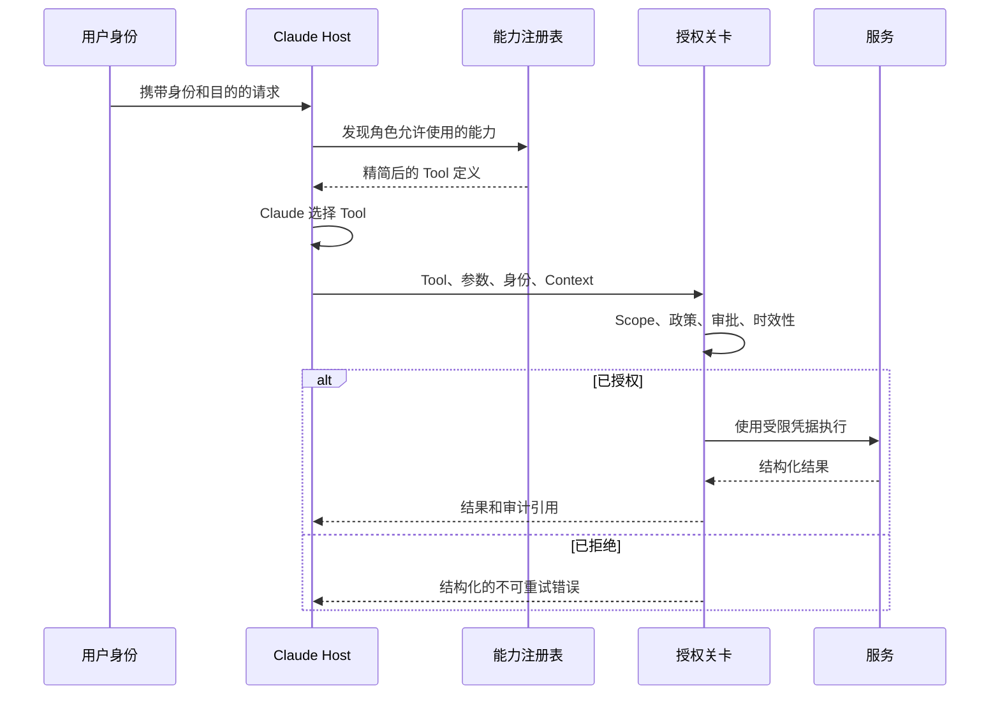

# 集成协议、身份与最小权限

> Tool 的安全性并不取决于 Claude 是否谨慎使用它。只有系统拒绝未授权使用时，它才是安全的。

**Type:** Build
**Languages:** Python
**Prerequisites:** [端到端架构与价值权衡](../../23-end-to-end-architecture-and-value-tradeoffs/)；Phase 13 的 Lessons 01、05、06、16 和 18
**Time:** ~150 分钟

## 学习目标

- 根据需求选择直接 API、CLI、MCP 或 Agent-to-agent 集成
- 将能力发现与执行授权分离
- 设计最小权限 Tool 集和身份传递机制
- 返回结构化、可操作且不会泄露秘密的错误
- 在执行边界设置审批、审计和撤销控制

## 问题

一个客服 Agent 可以读取工单、起草回复、发放退款和删除用户
账户。大多数客服人员只需要前两项能力。团队却始终启用
全部四个 Tool，并添加了一条 Prompt：“除非绝对必要，否则绝不发放退款或删除账户。”

这不是最小权限。危险能力仍然存在，Model 仍然可以看到它，
Prompt injection 也仍然可以将它作为目标。确认文本可以
减少意外使用，但无法替代授权。

结构性修复更加简单：不要暴露角色不需要的能力，传递调用者的身份，
并在 Tool 执行时实施 scope 和审批控制。

## 概念

### 根据边界选择集成形态

这些协议的能力有所重叠，但它们主要解决的问题不同。

| 形态 | 最适用的场景 | 主要权衡 |
|-------|----------|---------------|
| 直接 API | 应用已知单一服务契约，并且需要较低开销 | 服务紧耦合和自定义能力发现 |
| CLI | 围绕可执行程序进行本地或 CI 自动化 | 进程、环境和输出管理负担 |
| MCP | Host 需要跨 Server 以标准方式发现 Tool、资源或 Prompt | 需要运营额外的协议边界和授权 Model |
| Agent-to-agent | 一个 Agent 将任务委派给另一个自主服务 | 信任、身份、进度和失败语义更加复杂 |

MCP 并不能替代所有 API。对于稳定的内部服务调用，使用直接 API 可能更加清晰、
快速。当多个 Host 需要通过通用方式发现和调用能力，或者 Tool 所有权应保留在
Server 边界之后时，MCP 才能体现其价值。

CLI 适用于本地开发者工作流和 CI，但长时间运行的工作需要持久状态、取消能力和结果检索，
这些需求超出了脆弱子进程的能力范围。当远程参与方负责自主完成一项任务时，
Agent-to-agent 集成才有意义；如果它只是一个函数端点，则不适合使用这种方式。

### 分离发现、选择和执行



发现控制 Model 能看到什么。授权控制实际会发生什么。
两者缺一不可。

如果发现过程返回所有 Tool，Model 就要承担额外的 Context 和选择成本。
它还会看到危险操作的描述。如果缺少授权，
隐藏 Tool 只是在掩盖它。调用者仍然可能直接访问端点。

### 传递身份，不要替换身份

应用 API key 标识的是应用。它不会自动
代表发出请求的人类用户或服务。

需要携带：

- principal ID
- tenant 或 organization
- 已认证 session
- roles 和 scopes
- 政策要求时提供 purpose 或 case identifier
- 提权操作的 approval reference
- request ID 和 trace ID

下游系统应使用可信的身份声明自行作出授权决定。不要授予宽泛的
服务凭据，再要求 Claude 模拟用户权限。

### 在四个层级实施最小权限

1. Tool 集：仅暴露任务和角色所需的能力。
2. Tool schema：仅接受必要参数，并约束参数值。
3. 凭据：仅授予必需的服务 scope 和资源。
4. 操作：在执行时重新检查当前政策、对象所有权和审批。

权限会发生变化。审批会过期。Tool 定义可能在数分钟前就已加载。
执行时授权是最后一道控制。

### 将审批设计为一种能力

“先询问用户”含义模糊。可靠的审批应包含：

- 准确的拟执行操作及其参数
- 预期影响和可逆性
- 请求者身份
- 审批者身份和权限
- 过期时间
- 单次使用或受限使用语义
- 审计引用

获得审批后，应执行经过审核的准确操作。如果参数发生变化，应重新请求
审批。

### 返回结构化错误

Tool 的不同失败方式需要不同的恢复策略。

```json
{
  "ok": false,
  "error": {
    "category": "authorization",
    "retryable": false,
    "message": "需要 refunds:write scope",
    "safe_details": {
      "required_action": "请求经过授权的人工审核"
    }
  }
}
```

错误类别可以包括 validation、authorization、not-found、conflict、
rate-limit、dependency、timeout 和 internal。应告诉 Agent 重试是否安全，
以及什么条件可以改变结果。不要返回原始 stack trace、Token 或
包含秘密的上游消息。

### 渐进式发现可以减少能力膨胀

大型 Tool 目录会占用 Context，并增加选择错误。首先提供一个
小而稳定的集合，再配合搜索或注册表机制。任务确认存在需求后，
再加载专用 Tool。

渐进式发现仍应实施 principal 的 scope。搜索不得
泄露调用者无权知晓的能力名称或描述。

### MCP Scope 不定义业务授权

MCP 对能力交换进行了标准化。应用仍然负责身份、
tenant 隔离、同意、审批、政策、审计和凭据管理。
传输安全不等于授权，成功完成协议握手也不代表获得了所有 Tool 的使用权限。

## 构建它

## Interactive Lab

```figure
25-identity-permission-path
```

使用权限路径探索器，跟踪身份如何从已认证请求依次经过能力发现、
Model 选择、执行时授权、审批、服务调用和审计。通过更改 scope，
可以理解为什么发现和授权是相互独立的控制。

## Practice Lab

仅授予发现 scope，尝试执行操作，然后添加绑定审批，
观察哪个决策发生变化，以及哪个边界仍然得到实施。

## Shipped Artifact

[`outputs/least-privilege-review.json`](../outputs/least-privilege-review.json)
是一份填写完整的能力审查，其中展示了可见 Tool 和一次结构化的退款拒绝尝试。

## Verify It

复现该行为并运行所有授权测试：

```bash
cd certifications/claude/lessons/25-integration-protocols-identity-and-least-privilege/code
python3 main.py
python3 -m unittest discover tests -v
```

测验检查协议、身份、审批和重试规则。

## Capstone Connection

将该报告用作 Architect Professional capstone 中的身份和
最小权限证据。

这个 Lab 使用 Python stdlib 让边界清晰可见。

```bash
cd certifications/claude/lessons/25-integration-protocols-identity-and-least-privilege/code
python3 main.py
python3 -m unittest discover tests -v
```

### Step 1：选择主要形态

`select_protocol` 要求提供一个主要集成需求。动态发现映射到
MCP，本地自动化映射到 CLI，自主远程委派映射到 Agent-to-agent，
已知服务调用则映射到直接 API。遇到模糊需求时应失败，以便
架构师明确边界。

### Step 2：定义 Principal 和 Tool 契约

`Principal` 携带 scope 和仍然有效的审批。`ToolContract` 声明所需的
scope、风险以及是否需要审批。描述用于说明行为，但不授予权限。

### Step 3：过滤发现结果

`discover_tools` 移除超出 principal scope 的能力。负责起草回复的客服
永远不会看到删除账户的能力。

### Step 4：在执行时授权

`authorize` 检查当前 scope 和审批。当检查失败时，`execute_tool`
会拒绝调用，并返回结构化的不可重试错误。

这个简化系统没有实现加密身份、Token 验证或政策引擎。这些能力
属于生产基础设施。它保留了正确的决策位置。

## 使用它

对于客服系统，应创建按角色划分的 Tool bundle：

- triage：读取分配的工单、分类和路由
- responder：读取工单和政策、编写草稿
- refund reviewer：读取 case 和建议、批准或拒绝
- refund executor：仅执行特定的已审批操作
- administrator：在客服 Agent 路径之外维护账户

不能仅仅因为某项服务可以提供 administrator Tool，就把这些 Tool
交给 Model。高风险操作应使用与获批操作绑定的短期凭据，
并生成不可篡改的审计记录。

选择 MCP 或直接 API 时，应编写 ADR 比较：

- Host 的数量和多样性
- 是否需要动态发现
- 延迟预算
- 现有认证机制和 SDK 成熟度
- 部署和所有权边界
- 流式或长时间运行行为
- 可观测性和支持负担

协议潮流不是需求。

## 考试决策模式

如果某个角色永远不需要某项能力，就从配置中移除它。日志记录
和确认属于补偿性控制，而不是最小权限。

优先选择具备以下特征的答案：

- 传递已认证的用户或服务身份
- 严格限制 Tool 和凭据的 scope
- 在执行时再次授权
- 对高影响操作使用仍然有效的审批
- 返回经过分类且包含重试信息的错误
- 根据集成边界选择协议
- 在目录较大时渐进式发现能力

拒绝那些假定更好的 Prompt、更大的 Model 或成功的 MCP
连接可以解决授权问题的答案。

## 常见陷阱

### 所有用户共用一个服务账户

下游服务只能看到宽泛的应用权限。每用户限制会变成 Prompt 政策，
而不是可实施的政策。

### 确认未与操作绑定

用户批准了 50 美元的退款，随后参数却变成了 500。
审批必须与操作、参数、身份和时间绑定。

### 将 Tool 描述用作控制

描述有助于选择。从安全角度看，它们是不可信文本，
本身也可能携带 Prompt injection。

### 重试授权错误

重试不会产生权限。应将错误标记为不可重试，并路由到
正确的审批或访问流程。

## 练习

1. 添加资源级授权，使 principal 只能读取分配给自己的
   工单。
2. 创建带签名、单次使用的审批记录，并拒绝参数发生变化的操作。
3. 定义隐藏未授权 Tool 名称的渐进式发现接口。
4. 在 200 ms 延迟预算下，比较三个内部服务使用 MCP 和直接 API
   的差异。
5. 对 Tool 描述和结果开展间接 Prompt injection 红队测试。

## 关键术语

| 术语 | 人们通常所说的含义 | 实际含义 |
|------|-----------------|------------------------|
| Authentication | 执行操作的权限 | 身份证据 |
| Authorization | 登录 | 决定该身份是否可以执行此操作 |
| Scope | Prompt 规则 | 由可信凭据或政策决策携带的受限权限 |
| Discovery | Authorization | 查找能力，与执行该能力的权限相互独立 |
| Least privilege | 添加确认 | 移除不必要的能力，并尽量缩小每个剩余权限边界 |
| Approval | 用户表示同意 | 针对准确操作参数、受时间和身份约束的授权 |

## 延伸阅读

- [MCP specification](https://modelcontextprotocol.io/specification/latest)，了解当前协议行为
- [MCP authorization specification](https://modelcontextprotocol.io/specification/latest/basic/authorization)，了解协议级授权要求
- [Claude Tool use documentation](https://platform.claude.com/docs/en/agents-and-tools/tool-use/overview)，了解当前 Tool 契约
- Phase 13，Lesson 05，了解 schema 设计
- Phase 13，Lesson 18，了解生产环境中的 MCP authentication
- Phase 17，Lesson 25，了解秘密和审计控制
