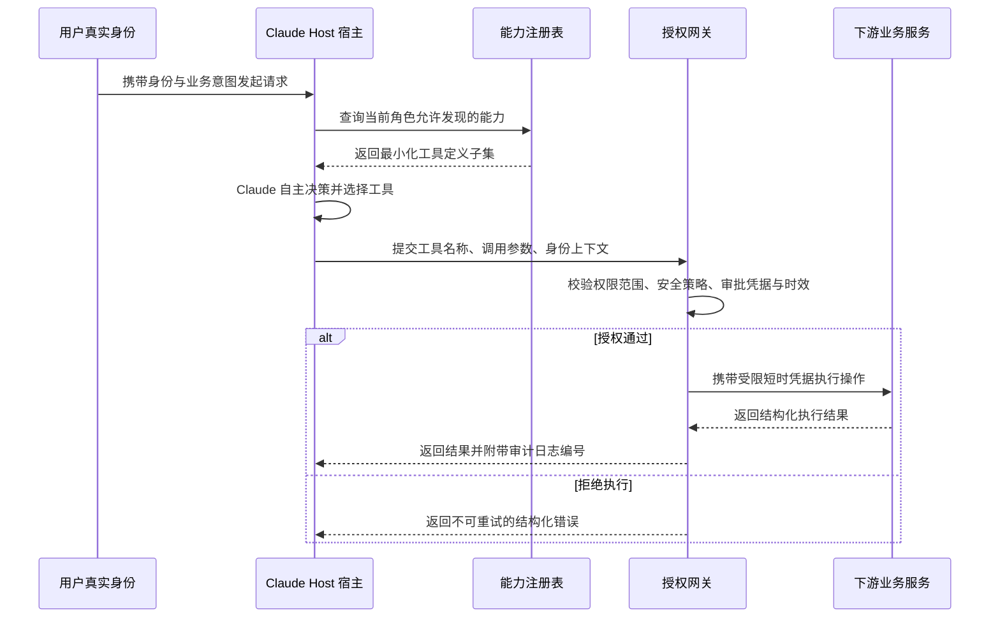

# 集成协议、身份凭据与最小权限原则 (Integration Protocols, Identity, and Least Privilege)

> 工具之所以安全，绝不是因为 Claude 会谨慎使用它，而是因为系统在底层能够坚决拒绝越权调用。

**Type:** Build
**Languages:** Python
**Prerequisites:** [端到端系统架构与价值权衡](../../23-end-to-end-architecture-and-value-tradeoffs/); Phase 13, Lessons 01, 05, 06, 16, and 18
**Time:** ~150 minutes

## 学习目标

- 根据业务需求准确评估并选型直接 API、CLI 命令行、MCP 协议或 Agent 间交互协议
- 将能力发现（Discovery）与执行授权（Execution Authorization）彻底解耦
- 设计符合最小权限原则的工具集与端到端身份凭据透传机制（Identity Propagation）
- 返回结构化、具备操作指引且杜绝机密信息泄漏的错误响应
- 在系统执行边界严格设立动态审批、审计日志与凭据吊销等控制机制

## 问题背景

某客服 Agent 被赋予了读取工单、起草回复、发放退款以及注销用户账号四项能力。然而，绝大多数一线客服人员实际上只需要前两项权限。工程团队为了省事保持全部四个工具始终启用，仅在 Prompt 提示词中追加了一行软性约束：“除非万不得已，否则严禁发放退款或注销账号”。

这根本不是最小权限原则（Least Privilege）。高危能力依然真实暴露，模型依然能读取到其定义，提示词注入攻击（Prompt Injection）随时可以绕过该约束。依靠 Prompt 中的文本确认或许能减少偶发的误操作，但它绝不可能取代确定性的系统授权机制。

根本性的架构解法更为直接与严谨：绝不向非必要角色暴露多余能力、在整条调用链路中完整透传调用者的真实身份，并在工具真正被执行的边界上强制核验权限范围与审批凭据。

## 核心概念

### 根据系统边界选择集成形态

不同集成协议虽然功能有所重叠，但各自解决的根本问题截然不同。

| 集成形态 | 最佳适用场景 | 核心权衡代价 |
|---|---|---|
| 直接 API (Direct API) | 应用程序对单一下游服务的调用契约十分明确，且对延迟开销极其敏感 | 服务间存在紧耦合，缺乏通用的动态发现机制 |
| CLI 命令行 | 本地开发工具链或 CI/CD 自动化流水线围绕可执行文件展开 | 需要承担子进程管理、环境变量隔离和标准输出流捕获的运维负担 |
| MCP 协议 | 宿主应用（Host）需要跨多个独立服务标准化发现工具、资源与 Prompt 模板 | 引入了额外的协议层开销，必须维护独立的安全与授权模型 |
| Agent 对 Agent (Agent-to-Agent) | 一个 Agent 需要将自主子任务委托给另一个自治独立服务 | 信任链、身份认证、任务进度同步及错误传播语义更加复杂 |

MCP 并不是所有直接 API 的替代品。对于稳定、专一的内部微服务调用，直接通过 SDK/API 通信往往更加简洁高效。只有当多个不同 Host 需要统一发现并调用多方能力，或者希望将工具的运维治理边界彻底解耦在独立 Server 之后时，MCP 才具有不可替代的架构价值。

CLI 非常适合开发者本地工作流及 CI 环境，但面对长耗时任务时，脆弱的子进程无法替代持久化状态存储、任务取消机制以及可靠的结果提取管道。只有当下游服务真正承载并调度一个具备自主决策流程的长任务时，采用 Agent 对 Agent 协作才具备合理性，切勿将其滥用于普通的确定性函数调用。

### 解耦发现、选择与执行阶段


```mermaid
sequenceDiagram
    participant U as 用户真实身份
    participant H as Claude Host 宿主
    participant R as 能力注册表
    participant G as 授权网关
    participant S as 下游业务服务
    U->>H: 携带身份与业务意图发起请求
    H->>R: 查询当前角色允许发现的能力
    R-->>H: 返回最小化工具定义子集
    H->>H: Claude 自主决策并选择工具
    H->>G: 提交工具名称、调用参数、身份上下文
    G->>G: 校验权限范围、安全策略、审批凭据与时效
    alt 授权通过
        G->>S: 携带受限短时凭据执行操作
        S-->>G: 返回结构化执行结果
        G-->>H: 返回结果并附带审计日志编号
    else 拒绝执行
        G-->>H: 返回不可重试的结构化错误
    end
```

能力发现决定了模型“能看见什么”，而执行授权决定了系统“允许发生什么”。两者不可或缺，缺一不可。

如果发现阶段无差别暴露全部工具，不仅白白耗费 Context 上下文预算并增加模型的选择失误率，还会将高危操作的参数定义直接呈现在模型面前。反之，如果没有执行层授权校验，仅仅在前端隐藏工具只是“通过隐蔽实现安全（Security through Obscurity）”，攻击者依然能够绕过前端直接调用底层端点。

### 透传端到端身份，而非粗暴替换

应用程序级别的服务 API Key 仅代表应用本身的技术身份，它绝不能等同于发起当前请求的真实自然人或调用方。

系统间调用必须持续透传：

- 访问主体唯一标识（Principal ID）
- 租户或企业组织标识（Tenant / Org ID）
- 已认证的会话标识（Authenticated Session）
- 角色与权限范围（Roles and Scopes）
- 业务理由或工单编号（满足合规审计所需）
- 提权操作关联的人工审批凭据引用
- 请求全局链路追踪标识（Request & Trace ID）

下游各个微服务必须基于可信的身份断言做出自主授权判定。绝不能为 LLM 接入拥有超管权限的通用服务账号，寄希望于让 Claude 在大脑中“模拟”不同用户的权限检查。

### 在四个层次上践行最小权限原则

1. **工具集层面（Tool set）**：仅向当前会话与特定角色暴露执行该任务绝对必需的能力清单。
2. **Schema 结构层面（Tool schema）**：严格限制参数列表，对枚举值、数值范围和字符串模式施加最严苛的校验规则。
3. **调用凭据层面（Credential）**：仅下发具有最小资源作用域与最短有效期的临时令牌。
4. **动作执行层面（Action）**：在真实执行的瞬间，二次校验最新安全策略、数据对象归属权以及审批单状态。

用户权限随时可能被回收，审批凭据随时可能过期，而工具定义往往在会话建立初期就已经加载。因此，执行时刻的实时授权检查是最后且不可逾越的安全底线。

### 将审批本身建模为一种一等能力

Prompt 中一句模糊的“请先征求用户同意”根本无法构建可靠的工程防线。工业级审批凭据必须具备如下要素：

- 拟执行操作的精确定义与完整不可变参数
- 预期影响评估与操作是否可逆的明确标记
- 申请操作的发起人身份
- 审批授权人的身份及其对应的签字权限级别
- 严格的时间戳与过期失效时限
- 单次使用（Single-use）或明确限定调用次数的语义保证
- 全局唯一的不可篡改审计追踪标识

审批通过后，系统仅允许严格执行当时经过审查的那一组参数。一旦模型或用户在后续交互中微调了任何入参，现有审批立即作废，必须重新触发全流程审批。

### 返回结构化错误响应

工具执行失败的原因多种多样，需要针对性地引导模型采取不同的恢复路径。

```json
{
  "ok": false,
  "error": {
    "category": "authorization",
    "retryable": false,
    "message": "refunds:write scope is required",
    "safe_details": {
      "required_action": "request authorized human review"
    }
  }
}
```

错误类别应清晰划分为：参数校验失败（validation）、授权拒绝（authorization）、资源不存在（not-found）、状态冲突（conflict）、频次受限（rate-limit）、依赖下游异常（dependency）、调用超时（timeout）以及内部异常（internal）。必须明确告知 Agent 该错误是否支持安全重试（retryable），以及采取何种行动能够改变当前结果。严禁将原始堆栈跟踪、内部 Token 或包含敏感信息的底层报错直接透传回模型。

### 渐进式发现机制避免能力膨胀

暴露庞大的工具列表会急剧消耗上下文 Token，并显著抬高模型的工具选择错误率。推荐架构是：初始阶段仅暴露极少数核心通用的基础工具以及一个搜索/检索注册表工具；仅当具体任务推演确立了明确需求时，再按需挂载特定领域的专业工具。

渐进式发现机制依然必须受调用主体权限范围的约束。搜索检索接口绝不能向未授权用户透出他们无权使用的工具名称与功能描述。

### MCP Scope 并不等同于业务授权

MCP 规范仅仅标准化了客户端与服务端之间交换工具与资源信息的协议格式。业务层面的租户隔离、最终用户身份识别、敏感操作知情同意、细粒度策略决策、合规审计以及凭据轮换，依然完全属于宿主应用的责任范畴。传输层安全（TLS）绝不等于授权，协议握手成功更不代表客户端自然拥有对所有暴露工具的调用许可。

## 动手构建

本实验使用 Python 标准库实现了一个清晰严密的工具权限与协议路由系统，将身份与授权控制的边界彻底透明化：

- **步骤 1：集成协议智能路由**：`select_protocol` 依据核心业务需求进行确定性分流。动态能力发现路由至 MCP，本地命令行交互路由至 CLI，跨服务自治委派路由至 Agent-to-Agent，确定性服务交互路由至直接 API。需求模糊时强制阻断以敦促架构师理清边界。
- **步骤 2：定义主体与工具契约**：`Principal` 携带角色权限 Scope 与时效性审批记录；`ToolContract` 显式声明该工具所需的权限 Scope、风险等级以及是否需要人工审批。
- **步骤 3：基于身份过滤能力发现**：`discover_tools` 根据主体的当前 Scope 动态剔除越权工具，确保普通工单处理人员甚至无法获知注销账号工具的存在。
- **步骤 4：执行时强制二次鉴权**：`authorize` 验证实时权限与审批有效性；校验失败时，`execute_tool` 返回不可重试的结构化错误对象，坚决拒绝执行。

## 交互式实验

```figure
25-identity-permission-path
```

使用上述权限路径探索器，完整跟踪一个请求从身份认证、能力动态发现、模型工具挑选、运行时拦截校验、人工审批绑定、实际下游调用到最终审计归档的全链路。通过调整测试主体的 Scope，亲身体验为什么能力发现与执行授权必须是两道相互独立的控制防线。

## 实战演练

为测试主体仅配置只读发现权限，尝试触发高危执行动作；随后为其注入一张限定参数的审批单，观察哪一步决策发生了转变，以及系统底层的安全边界是如何始终保持生效的。

## 交付产物

[`outputs/least-privilege-review.json`](../outputs/least-privilege-review.json) 包含一份完整的最小权限审查产物，记录了当前角色可见的工具清单，以及一次由于缺乏权限而被结构化拒绝的退款调用拦截证据。

## 验证方法

在本地环境中运行并验证完整的授权控制实现及测试套件：

```bash
cd certifications/claude/lessons/25-integration-protocols-identity-and-least-privilege/code
python3 main.py
python3 -m unittest discover tests -v
```

课程配套的 6 道自测题将重点检验你对集成协议适配、身份透传规范、审批绑定机制与错误分类设计的理解。

## 项目连接

请将此处的最小权限审查报告和结构化错误拦截逻辑，作为 Architect Professional Capstone 毕业设计中身份认证与最小权限架构的关键合规证据。

## 实践应用

针对客服系统案例，应将工具按职责划分为细粒度的角色权限包：

- 分拣专员（Triage）：仅能读取分配的工单、分类标签并流转路由
- 客服代表（Responder）：读取工单与知识库政策，撰写回复草稿
- 退款审查员（Refund Reviewer）：审查退款案例与模型建议，执行合规审批或驳回
- 退款执行器（Refund Executor）：仅能在持有合法审批单的前提下，执行特定金额的退款
- 平台管理员（Administrator）：在独立的后台管理通路中维护账号，严禁混入普通客服会话

绝不能仅仅因为某个后端微服务具备全量功能，就将超管工具直接抛给模型。高风险写操作必须采用与特定审批动作深度绑定的临时凭据，并记录不可篡改的审计追踪。

在决策采用 MCP 还是直接 API 时，应撰写架构决策记录（ADR），客观对比：

- 接入宿主应用的数量与技术多样性
- 是否确实具备动态发现工具与资源的需求
- 端到端调用延迟预算（Latency Budget）
- 现有系统的鉴权基础设施与 SDK 成熟度
- 部署与代码归属边界
- 是否涉及长连接流式传输或长时间后台运行
- 团队的可观测性基础设施与后期运维成本

严禁盲目追赶技术潮流，架构决策必须以工程指标为依归。

## 考试决策模式

如果某个业务角色在正常流程下永远不需要某项能力，请直接从配置中将其完全移除。依赖审计日志与文本二次确认只是事后补偿性手段，绝不是最小权限原则。

标准考试决策推导：

- 坚定透传经过认证的真实自然人或服务身份
- 将工具列表与服务凭据的作用域收敛到极致
- 在真正发生调用的执行时刻进行二次授权校验
- 针对高影响度操作必须要求新鲜、单次绑定的审批凭据
- 向 Agent 返回类别清晰、指明是否允许重试的结构化错误
- 依据集成边界与系统耦合度客观选择通信协议
- 工具数量庞大时采用渐进式动态发现，但发现本身依然受权限严格过滤

坚决排除的错误选项：

- 认为润色 Prompt 提示词即可解决安全越权问题
- 寄希望于更大参数的模型能更“懂事”地遵守规则
- 误以为建立了 MCP 协议连接就天然完成了系统鉴权

## 常见陷阱

### 全员共用同一个超级服务账号 (One Service Account for Every User)

当下游业务系统只能看到一个拥有极高权限的全局应用账号时，针对每个最终用户的额度控制与行级数据权限就会沦为一纸空文，退化成完全靠 Prompt 祈祷的脆弱防线。

### 脱离参数绑定的空头确认 (Confirmation Without Binding)

用户在界面上同意了一笔 50 元的退款，随后 Agent 却将实际调用参数篡改为了 500 元。合规的审批机制必须将授权签名与具体的行为、全套入参、主体身份以及有效时间窗口进行强力加密绑定。

### 将工具的文字描述当作权限控制 (Tool Descriptions as Controls)

工具描述的作用仅仅是辅助模型进行决策推理。在安全攻防视角下，任何文本描述都是不可信数据，甚至描述本身也可能遭受间接提示词注入（Indirect Prompt Injection）篡改。

### 盲目重试授权类错误 (Retrying Authorization Errors)

重复发送相同的请求不可能凭空获得权限。必须将鉴权错误明确标记为不可重试（`retryable: false`），并明确指示调用方转入正确的提权申请或人工审核流程。

## 课后习题

1. 为系统引入数据资源级权限控制（Resource-level Authorization），使得调用主体只能读取指派给自己的工单。
2. 实现一个基于数字签名的单次有效审批记录验证器，一旦检测到参数被篡改立即抛出异常。
3. 设计一个具备隐私保护的渐进式工具检索接口，确保未授权工具的名称与参数模式绝不向外暴露。
4. 针对 200ms 超时预算的三个核心内部微服务，撰写一份详尽的技术选型报告，深度对比 MCP 与直接 API 的性能与维护成本。
5. 对工具描述与返回内容进行红队对抗测试（Red-team Testing），防范间接提示词注入攻击。

## 核心术语

| 术语 (Term) | 常见误解 | 实际技术内涵 |
|---|---|---|
| 身份认证 (Authentication) | 执行某个动作的许可 | 验证并确立访问主体真实身份的过程与证据 |
| 授权 (Authorization) | 登录系统成功 | 判定特定身份当前是否有权对特定资源实施特定操作的策略决策 |
| 权限范围 (Scope) | Prompt 中的指令要求 | 由可信凭据或策略引擎颁发的受限操作许可 |
| 能力发现 (Discovery) | 拥有调用权限 | 宿主感知某项能力存在的协议流程，完全独立于执行该能力的授权判定 |
| 最小权限 (Least privilege) | 在界面上加个二次确认弹窗 | 彻底剥离一切非必要能力，将留存的每个权限边界收缩到绝对最小 |
| 审批单 (Approval) | 用户随口说了声“好的” | 针对精确入参、操作主体和有效时长进行严格绑定的单次授权凭证 |

## 延伸阅读

- [MCP specification](https://modelcontextprotocol.io/specification/latest) 阅读 MCP 协议规范了解当前标准行为
- [MCP authorization specification](https://modelcontextprotocol.io/specification/latest/basic/authorization) 学习协议层授权的硬性要求与最佳实践
- [Claude tool use documentation](https://platform.claude.com/docs/en/agents-and-tools/tool-use/overview) 掌握 Claude 工具调用的最新标准契约
- Phase 13, Lesson 05 严谨的 Tool Schema 结构设计
- Phase 13, Lesson 18 生产级 MCP 鉴权落地实战
- Phase 17, Lesson 25 凭据安全与全链路合规审计控制
