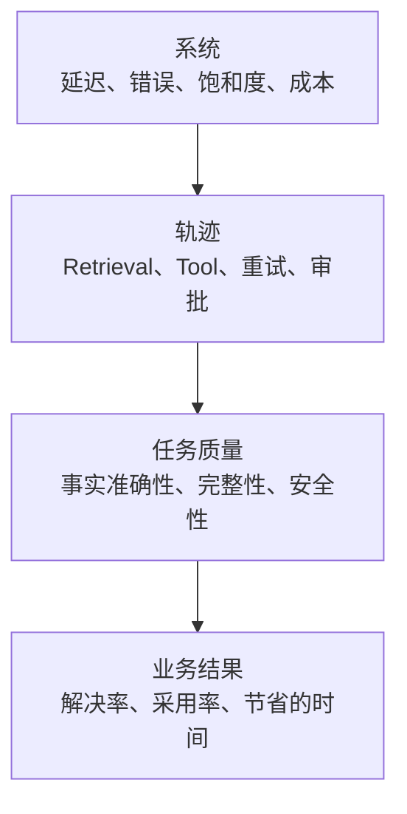

# 生产环境可观测性、延迟与成本

> 一次成功的 API 调用仍然可能意味着任务失败。

**Type:** Build
**Languages:** Python
**Prerequisites:** [RAG、Retrieval 与数据 Pipeline](../../24-rag-retrieval-and-data-pipelines/)；Phase 11, Lesson 10；Phase 17, Lessons 08, 13, and 27
**Time:** ~150 分钟

## 学习目标

- 区分系统可靠性、任务质量和业务结果
- 为 Claude 请求和 Agent 轨迹设计 Log、Metric 和 Trace
- 诊断 Model、Retrieval、Tool、队列和重试产生的延迟
- 衡量总成本以及每次成功结果的成本
- 根据服务目标定义告警和发布 gate

## 问题

生产环境 dashboard 报告 API 调用成功率达到 99.9%。客户却仍在投诉。

Model 返回 HTTP 200，但部分回答使用了过期来源。某个 Tool 超时后，Agent
悄无声息地继续执行。由于时间戳被放在开头附近，较长的 Prompt 无法命中
cache。P95 延迟翻了一倍，而平均值看起来仍可接受。更便宜的 Model 降低了
调用价格，却增加了重试和人工审核。

dashboard 衡量的是 transport 成功。产品依赖的是任务成功。
可观测性必须将二者联系起来。

## 概念

### 观察四个层面



系统信号告诉你各组件是否运行。轨迹信号告诉你应用执行了什么操作。
质量信号告诉你结果是否满足任务要求。业务信号告诉你工作流是否创造了价值。

不要把它们压缩到一个 `"success"` 字段中。

### Log、Metric 和 Trace 各有不同职责

Log 记录离散事件：请求已接受、Retrieval 未返回候选项、Tool 拒绝授权、
输出未通过 schema 验证、审核者执行了升级。使用结构化字段，以便运维人员
进行分组和筛选。

Metric 聚合一段时间内的行为：请求率、错误率、P95 延迟、Token 使用量、
cache 命中、Retrieval recall、任务通过率以及每次成功的成本。
它们用于驱动 dashboard 和告警。

Trace 连接完整轨迹。一个 Trace 应该展示 Model 调用、Retrieval、Tool 执行、
验证、重试和人工审批，并包含父子级计时关系。缺少 Trace 时，一个缓慢的请求
看起来只是一个不透明的整体。

### 追踪语义契约

捕获足够的信息，以便复现结果并对其分类：

- Trace、请求、session 和用户安全标识符
- 应用、Prompt、Model、Tool、知识和 eval 版本
- 输入类别和风险等级
- Token 数量以及 cache 读取或写入
- 停止原因和 Tool 名称
- Tool 持续时间和结构化错误类别
- 验证和政策决策
- evaluator 结果和人工修改
- 最终状态和下游结果

不要记录 secret、原始凭据或不必要的个人数据。对于敏感输入，应存储 hash、
类别、数量或受访问控制的引用，而不是明文。

### 区分系统成功与任务成功

系统成功关注请求是否按照协议完成。任务成功关注输出是否满足定义的 rubric。
有效的 JSON 响应可能在事实上是错误的。Agent 可以正常结束，却没有完成所请求的
状态变更。

对于 Agent 系统，应同时 Evaluation 以下两方面：

- 最终状态：预期产物或系统状态是否存在？
- 轨迹：Tool、权限、证据和预算是否得到正确使用？

仅进行文本匹配会同时遗漏这两方面。

### 分解延迟

端到端延迟包括：

```text
队列 + Context 组装 + Model + Retrieval + Tool + 验证 + 重试 + 审批
```

跟踪每个主要 span 的 P50 和 P95。P50 描述常规路径。P95 会暴露缓慢的 Tool、
过长的 Context、rate limit 和重试。

对于 streaming 体验，还应包括首次产生有用输出所需的时间。首个 Token 时间
可能表现良好，但用户仍在等待引用、Tool 结果或经过最终验证的答案。

对于后台和 batch 系统，应衡量是否按 deadline 完成以及 throughput。
如果整个 job 能在业务时间窗口内完成，那么单个 batch 项耗时 30 秒也可以接受。

### 根据证据进行优化

常见的延迟干预措施：

- 将简单工作路由到速度更快且合适的 Model
- 减少无关 Context
- 将稳定的 Prompt prefix 放置在利于 caching 的位置
- 检索数量更少、质量更高的候选项
- 并发运行相互独立的 Tool 调用
- 将非交互式工作负载转移到 batch
- 强制执行时间、turn 和重试预算
- 在 freshness 允许的情况下 cache 确定性的 Tool 结果

每种措施都可能改变质量或安全性。请在具有代表性的 Evaluation set 上衡量取舍。

### 衡量每次成功结果的成本

Token 价格只是其中一个组成部分。

```text
总成本 = Model + cache 写入与读取 + Tool + 基础设施 + 审核 + 修正
每次成功的成本 = 总成本 / 被接受的任务结果
```

失败的请求仍会产生成本。安全拒绝、重试、审核者时间和事故修正同样如此。
分别报告输入、输出、cache 和 Tool 成本，以便团队采取行动。

选择 Model 或架构方案时，真正重要的比较指标是每次成功结果的成本。

### 理解 Prompt Cache 的形态

Prompt caching 会复用稳定的 prefix。靠近开头的变更可能使其后的所有内容失效。
当当前文档支持这种 cache 布局时，应将稳定的 Tool 定义、system instructions
和大型参考资料放在动态用户内容之前。

跟踪 cache-read 和 cache-write Token。只有 cache feature flag 而没有
hit-rate Metric，并不能构成优化。

Tool 定义、Model 设置、thinking 配置和其他请求变更都可能影响 cache 行为。
由于具体细节会不断演变，请根据当前官方文档进行验证。

### 构建可执行的告警

应针对用户和运维人员需要作出的决策发送告警，而不是针对每次 Metric 波动。

良好的告警包括：

- 任务通过率在有意义的时间窗口内低于 SLO
- 安全控制失败或未授权操作尝试
- P95 延迟超过用户容忍范围
- Retrieval freshness 延迟
- Tool 错误类别激增
- 部署后 cache 命中率骤降
- 每次成功的成本超出预算
- evaluator 意见不一致或 Label drift

每个告警都需要 owner、runbook、证据链接和升级路径。如果没有人知道告警后
应该采取什么行动，那么它只是在装饰 dashboard。

### 使用发布流程限制证据风险

离线 Evaluation 是必要条件，但并不充分。生产流量包含新的查询、数据、负载和集成。

使用：

1. 不影响用户的 shadow Evaluation
2. 按 tenant 或流量百分比进行小规模 canary
3. 通过自动 rollback 进行受控扩展
4. 在质量、延迟、成本和安全 gate 全部通过后完整发布

与稳定的 baseline 比较，并按任务类别进行分层。总体提升可能掩盖高风险群体的
严重退化。

## Build It

## Interactive Lab

```figure
26-latency-cost-slo
```

使用 SLO explorer 分别调整任务成功率、cache rate、重试成本、P50 和 P95。
它会揭示一些方案：即使调用更便宜或 transport 健康，仍然无法通过用户、
质量或每次成功成本 gate。

## Practice Lab

添加一条成本较低但失败的 Trace，观察即使单价下降，每次成功的成本仍会上升。
然后找出应该阻止发布的第一个 gate。

## Shipped Artifact

[`outputs/release-scorecard.json`](../outputs/release-scorecard.json) 提供了一份
填写完整的 baseline 与 candidate 对比，其中包含相互独立的质量、延迟、cache
和经济性 gate。

## Verify It

复现并测试聚合过程：

```bash
cd certifications/claude/lessons/26-production-observability-latency-and-cost/code
python3 main.py
python3 -m unittest discover tests -v
```

测验会检查诊断和发布决策。

## Capstone Connection

将 scorecard 用于 Architect Professional capstone 的 Evaluation、
可观测性和 canary gate。

该实验仅使用 Python 聚合合成的 Trace 记录。

```bash
cd certifications/claude/lessons/26-production-observability-latency-and-cost/code
python3 main.py
python3 -m unittest discover tests -v
```

### 第 1 步：表示单个任务轨迹

`Trace` 存储一条紧凑的端到端记录：方案、延迟、Token 数量、成本、系统结果、
任务结果、cache 状态和错误类别。生产环境中的 Trace 会包含子 span 和受访问
控制的引用，而不是一个扁平对象。

### 第 2 步：在不隐藏失败的前提下进行聚合

`summarize` 分别报告系统成功和任务成功。它会计算 nearest-rank P50 和 P95、
cache-read rate、错误类别、总成本以及每次任务成功的成本。失败的尝试仍然包含在
成本分子中。

### 第 3 步：比较不同方案

`by_variant` 可以防止采用 cache 或 routing 的设计被平均到 baseline 中。
应同时比较质量、延迟和成本。

### 第 4 步：Evaluation 服务目标

`evaluate_objectives` 应用任务成功率下限以及延迟和成本上限。
一个方案必须通过每一个必要 gate。不要用较低的成本来平均掉安全或质量失败。

## Use It

从一个生产问题开始：“为什么发布后任务成功率下降了？”

按应用和发布版本筛选 Trace。按输入类别分层。先检查系统错误，再检查 Retrieval
和 Tool span，然后检查 validator 和 evaluator 结果。比较 Prompt、Model、
知识和 Tool 版本。找出与 baseline 轨迹最早出现差异的位置。

如果 P95 延迟上升而 P50 保持稳定，请检查慢路径行为：重试、rate limit、
大型输入、Tool 超时和审批等待。如果成本上升而 Token 价格稳定，请检查调用次数、
Context 长度、cache 命中和审核。

维护一份发布 scorecard：

| Gate | Baseline | Candidate | 要求 |
|------|----------|-----------|----------|
| 任务通过率 | | | 高风险分层中不得退化 |
| 安全通过率 | | | 硬性控制达到 100% |
| P95 延迟 | | | 位于 SLO 范围内 |
| 每次成功的成本 | | | 位于预算范围内 |
| Retrieval recall | | | 位于容差范围内 |
| 人工审核分钟数 | | | 不得存在隐藏的工作流负担 |

## 考试决策模式

如果 API 成功率很高，但用户报告结果不佳，请添加或检查语义质量和轨迹证据。
如果文档刷新后出现错误回答，应先追踪 Retrieval，再考虑更换 Model。

优先选择符合以下特征的答案：

- 结合使用 Log、Metric 和 Trace
- 区分 transport、任务和业务成功
- 监控 P95，而不是只监控平均值
- 比较每次成功结果的成本
- 对 Prompt、Model、Tool 和知识进行版本管理
- 根据质量、延迟、成本和安全性控制发布 gate
- 为每个告警指定 owner 和 runbook

## 常见陷阱

### 默认记录完整 Prompt

这可能泄露个人数据、secret 或受监管内容。只记录最低限度的安全证据，并对敏感
引用实施访问控制。

### 使用单一的总体质量分数

它可能掩盖不同语言、风险等级、任务或客户中的退化。应进行分层。

### 使用平均延迟

一小部分缓慢请求就可能损害体验，而平均值仍保持稳定。应跟踪 tail latency
和 timeout rate。

### 使用每次调用的成本

这会奖励廉价的失败。应使用每次被接受结果的成本，并计入审核和修正成本。

## 练习

1. 使用 Retrieval 和两个 Tool 的子 span 扩展实验。
2. 添加输入风险分层，并证明总体提升可能掩盖严重退化。
3. 创建 cache invalidation 实验，并衡量 hit rate、P95 和成本。
4. 为 Tool 授权失败设计告警，并指定 owner 和 runbook。
5. 编写一项 canary 政策，使其在任意硬性控制失败时 rollback。

## 关键术语

| 术语 | 人们通常所说的含义 | 它的实际含义 |
|------|-----------------|------------------------|
| Log | Debug 文本 | 包含安全证据和标识符的结构化事件 |
| Metric | 任意数字 | 用于理解或控制行为的时间序列聚合 |
| Trace | 请求 ID | 完整轨迹中相互连接的计时和结果 |
| 任务成功 | HTTP 200 | 所请求的结果满足其 rubric 和约束 |
| P95 延迟 | 最慢的请求 | 95% 的已测请求在该值以内完成 |
| 每次成功的成本 | Model 价格 | 预期总成本除以被接受的任务结果 |

## 延伸阅读

- [Claude usage and cost API documentation](https://platform.claude.com/docs/en/build-with-claude/usage-cost-api)，了解当前的用量报告方式
- [Prompt caching documentation](https://platform.claude.com/docs/en/build-with-claude/prompt-caching)，了解当前的 cache 行为
- Phase 17, Lesson 13，了解 LLM 可观测性
- Phase 17, Lesson 27，了解 LLM 财务运营
- Phase 17, Lessons 20 and 21，了解渐进式交付和 A/B testing
