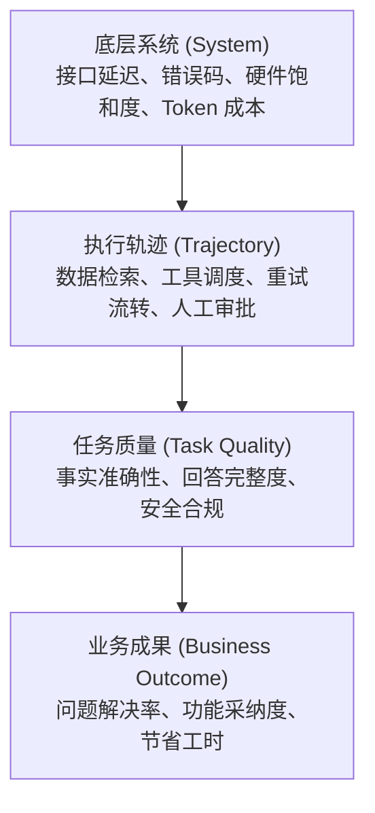

# 生产环境可观测性、延迟与成本 (Production Observability, Latency, and Cost)

> 一个返回成功的 API 调用，其对应的业务任务依然可能彻底失败。

**Type:** Build
**Languages:** Python
**Prerequisites:** [RAG, Retrieval, and Data Pipelines](../../24-rag-retrieval-and-data-pipelines/); Phase 11, Lesson 10; Phase 17, Lessons 08, 13, and 27
**Time:** ~150 minutes

## 学习目标

- 严格区分系统技术可靠性（System Reliability）、任务完成质量（Task Quality）与实际业务成果（Business Outcome）
- 针对 Claude 请求与 Agent 执行轨迹（Trajectory）设计日志、指标与分布式追踪
- 精确诊断涵盖模型生成、数据检索、工具执行、消息队列及错误重试的全链路延迟
- 科学度量端到端总体成本以及单次成功业务结果的实际成本（Cost per Successful Outcome）
- 基于服务等级目标（SLO）设定具备行动指引的告警阈值与发布灰度门禁

## 问题背景

生产环境监控大盘显示 API 调用的成功率高达 99.9%，但客服渠道却接到了铺天盖地的客户投诉。

排查发现：模型返回了标准的 HTTP 200 响应，但回答内容依据的却是早已作废的知识库源文档；某个关键工具调用超时后，Agent 忽略错误并悄无声息地继续执行；长文本 Prompt 缓存完全失效，原因仅仅是因为工程团队在 Prompt 最前端插入了一个动态时间戳；P95 延迟相比上月翻了一倍，但在整体平均延迟的掩盖下无人察觉；团队切换到了单价更便宜的模型，虽然账面调用费用下降，却导致输出质量劣化、重试次数激增以及人工复审介入成本暴涨。

传统的 APM 大盘度量的仅仅是“网络传输是否成功”，而商业产品的成败完全维系在“业务任务是否成功”。可观测性体系必须在两者之间架起可量化的桥梁。

## 核心概念

### 观测的四个关键层次


```mermaid
flowchart TD
    B["业务成果 (Business Outcome)\n问题解决率、功能采纳度、节省工时"]
    Q["任务质量 (Task Quality)\n事实准确性、回答完整度、安全合规"]
    T["执行轨迹 (Trajectory)\n数据检索、工具调度、重试流转、人工审批"]
    S["底层系统 (System)\n接口延迟、错误码、硬件饱和度、Token 成本"]
    S --> T --> Q --> B
```

系统信号反映基础设施各组件是否正常运行；轨迹信号揭示应用程序做出了哪些具体行为；质量信号度量生成结果是否真正达成了任务标准；业务信号衡量工作流是否切实创造了商业价值。

切忌将这些完全不同维度的指标粗暴合并为一个单一的“成功”字段。

### 日志、指标与链路追踪各司其职

- **日志 (Logs)** 记录离散发生的特定事件：请求已被接入、检索层未召回任何候选证据、工具拒绝鉴权、输出未能通过 Schema 格式校验、人工复审员介入升级。必须使用结构化字段（Structured Fields），以便运维人员能够精确执行分组聚合与过滤筛选。
- **指标 (Metrics)** 聚合系统在时间窗口内的统计特征：请求吞吐量（RPS）、系统错误率、P95 延迟分位数、Token 消耗量、缓存命中率、检索召回率、任务验收通过率以及单次成功任务成本。指标是大盘看板呈现与自动化告警触发的数据源头。
- **链路追踪 (Traces)** 串联 Agent 的完整执行轨迹。单条完整 Trace 应当清晰展示模型调用、检索耗时、工具执行、格式校验、重试回退以及人工审批的父子级时间嵌套关系。缺乏全链路 Trace，一个缓慢的请求就会退化为一个无法剖析的黑盒。

### 捕获语义契约全貌

为了精确复现并归因每一次任务结果，追踪系统必须捕获充足的语义凭据：

- 全局 Trace ID、请求 ID、用户会话 ID 与脱敏后的用户标识
- 应用程序版本、Prompt 提示词模板版本、模型版本、工具集版本、知识库索引版本与评估测试集版本
- 输入用例的业务分类（Input Class）与风险评级（Risk Tier）
- 输入/输出 Token 计数、Prompt 缓存写入（Cache Write）与缓存读取（Cache Read）量
- 模型的停止原因（Stop Reason）与调用的工具名称
- 各工具执行耗时与结构化错误分类
- 输出校验规则与安全策略执行决策
- 离线评估器打分与人工编辑修改记录
- 任务最终终止状态与下游系统承接结果

严禁直接记录未经脱敏的敏感凭据、系统密钥或用户个人隐私数据（PII）。面对敏感输入，应存储不可逆哈希、特征分类标签、字符长度统计或受访问控制保护的引用指针，杜绝明文落盘。

### 解耦系统成功与任务成功

系统成功关注请求是否符合通信协议并平稳结束；任务成功关注输出结果是否真正满足业务验收准则（Rubric）。一个格式完全合法且校验通过的 JSON 返回，其内容完全可能是捏造的事实；一个 Agent 完全可以正常退出循环，却根本未能在目标数据库中完成预期的状态修改。

对于智能体系统，必须同时评估两个核心维度：

- **最终状态 (Final state)**：预期生成的制品或系统状态是否真正完备存在？
- **执行轨迹 (Trajectory)**：工具调用、权限验证、证据采用与预算控制是否合规？

仅凭传统的纯文本字符串匹配算法无法捕获这两个维度的真实表现。

### 细粒度拆解延迟构成

端到端整体延迟由如下各个环节串联叠加而成：

```text
任务耗时 = 排队等待 + 上下文组装 + 模型推理 + 数据检索 + 工具执行 + 输出校验 + 故障重试 + 人工审批
```

必须在每个关键跨度（Span）上独立监控 P50 与 P95 分位数。P50 反映常规流程的标准表现；P95 则能精准揭示偶发的慢工具、超长上下文、频率限制排队以及连锁重试等长尾痛点。

针对打字机流式交互，必须重点监控“首个有效业务输出的时间”（Time to First Useful Output）。若用户在看到首个 Token 后仍需长时间等待外部引用解析、工具异步回调或最终校验，表面的首字时间（Time to First Token）将毫无意义。

针对离线后台与批量（Batch）处理系统，重点应度量作业吞吐量与商业截止期限履约率（Deadline Completion）。如果整个批处理任务能在业务窗口内顺利收敛，单条记录耗时 30 秒完全是可以接受的设计取舍。

### 基于实测证据实施性能优化

业界常见的延迟优化工程手段包括：

- 建立智能路由：将简单清晰的轻量任务分流至推理更快的适度规模模型
- 压缩冗余上下文：彻底剔除对当前决策毫无助益的冗余背景资料
- 规范 Prompt 结构：将不变的静态前缀置于前列以最大化命中 Prompt 缓存
- 优化检索阶段：检索更少但相关度极高的优质候选文本块
- 工具并发调用：针对相互独立的工具调用实施并行并发异步执行
- 非实时负载异步化：将非交互式的高耗时计算迁移至批量处理通道
- 严格预算约束：硬性设定总耗时、对话轮次与重试次数上限
- 结果确定性缓存：在数据时效性允许的范围内对确定性工具的结果进行缓存

上述任何优化均可能对最终质量或系统安全性产生潜在扰动，必须在代表性评估测试集上严格复测两者的权衡关系。

### 度量单次成功任务的综合成本

单纯对比每百万 Token 的标价是极具欺骗性的表面指标。

```text
总体成本 = 模型推理费用 + 缓存读写开销 + 工具网络与计算开销 + 基础设施折旧 + 人工复核工时 + 错误挽回支出
单次成功成本 = 总体成本 / 经业务验收确认的成功任务总数
```

失败的调用同样在真实消耗资金；安全拦截判定、失败重试、人工排查工时以及线上事故修复同样属于财务成本范畴。系统必须将输入 Token、输出 Token、缓存费用与工具费用分开独立归集核算。

单次成功任务的综合成本（Cost per Successful Outcome），才是评估模型选型与架构方案变更时最具商业指导意义的黄金指标。

### 深入理解 Prompt 缓存的结构机制

Prompt 缓存机制基于对稳定前缀（Stable Prefix）的高效复用。如果在前缀靠前的位置引入哪怕一个字符的变动，其后方的全部缓存内容都将遭遇连锁级穿透失效。因此，必须将长期不变的工具定义、系统指令以及大型基准参考资料固定在最前部，将高度动态的用户提问置于后部。

必须持续监控缓存读取 Token 量与缓存写入 Token 量。仅开启了缓存功能开关却缺乏命中率（Hit-rate）监控，根本谈不上真正落实了性能优化。

此外，工具 Schema 的微调、推理超参数变动以及 Thinking 思考配置的变化都可能改变底层缓存行为。请务必结合官方最新技术文档进行实测核验。

### 构建具备行动指引的告警体系

告警应当针对真正需要工程师与运维人员介入决策的严重异常，切勿对大盘上的每一次轻微数值波动草木皆兵。

高价值的关键告警示例：

- 某个时间窗口内任务验收通过率跌破业务 SLO 下限
- 安全防线遭遇穿透或侦测到底层未授权调用尝试
- P95 延迟显著突破最终用户的心理容忍极限
- 检索层的数据时效性出现明显滞后延迟
- 特定工具执行错误出现突发性脉冲尖峰
- 代码或配置发布后 Prompt 缓存命中率发生断崖式下跌
- 单次成功任务的综合成本突破预算警戒线
- 离线评估器打分与实际线上人工标注出现严重分布漂移

每一条生产告警都必须明确绑定负责人（Owner）、标准应急处置操作手册（Runbook）、事故证据排查看板链接以及明确的升级机制。缺乏明确处置预案的告警只是无意义的看板装饰。

### 依靠分级灰度发布控制业务风险

离线基准测试必不可少，但绝不足以替代线上实战。真实的线上流量往往潜藏着离线环境从未覆盖的新型 Query、数据倾斜、并发争抢与异构依赖。

标准发布流程应当包含：

1. **影子流量评估（Shadow Evaluation）**：将线上真实请求旁路复制到候选系统，结果不透传给用户，零业务影响；
2. **小流量金丝雀（Canary）**：按租户白名单或极小流量比例（如 1%）分流至新版本；
3. **设防灰度放量（Guarded Expansion）**：逐步扩大分流比例，并设定核心指标劣化时的全自动秒级回滚熔断；
4. **全量上线（Full Rollout）**：唯有在任务质量、延迟分布、总体成本与安全合规四大门禁全量达标后，方可切流完毕。

切忌仅观察全局均值。全局均值的轻微改善极有可能掩盖了某个高风险细分客户群体遭遇灾难性退化的严重事实。

## Build It (动手构建)

本实验使用标准库 Python 搭建了一个严谨的轨迹数据聚合与发布门禁评估系统：

- **步骤 1：构建单次任务轨迹数据结构**：`Trace` 类封装了单次任务的端到端全量凭据，包含候选方案名称、总耗时、Token 细分计数、财务成本、系统协议状态、任务业务验收状态、缓存状态以及错误分类。
- **步骤 2：穿透汇总避免掩盖故障**：`summarize` 函数将底层系统成功率与上层业务任务成功率拆解度量；采用最近秩次算法精确计算 P50 与 P95 延迟，并统计缓存复用率、错误分布与单次成功任务真实成本（失败尝试的开销被严密计入成本分子中）。
- **步骤 3：架构变体横向对比**：`by_variant` 机制杜绝将采用了缓存或路由优化的候选方案与原有基线进行粗暴混编平均，支持多维度并排评审。
- **步骤 4：严格裁定服务质量目标**：`evaluate_objectives` 设定硬性质量门禁与延迟/成本上限红线。候选方案必须同时通过每一个必选门禁，绝不允许用更低廉的模型成本去抵消质量与安全维度的滑坡。

## Interactive Lab (交互式实验)

```figure
26-latency-cost-slo
```

使用上述 SLO 探索台，独立调整任务成功率、缓存命中率、重试惩罚系数、P50 及 P95 延迟参数。直观观察在哪些场景下，调用单价更低廉或底层网络全绿的变体，会在上层任务质量或单次成功综合成本门禁前遭遇一票否决。

## Practice Lab (实战演练)

在数据流中人工注入一组调用单价极低但频繁失败重试的轨迹样本，观察单次成功任务综合成本是如何不降反升的，并精准指出哪一道发布门禁应当立刻阻断上线。

## Shipped Artifact (交付产物)

[`outputs/release-scorecard.json`](../outputs/release-scorecard.json) 包含一份完整的基线与候选版本对比记分卡，涵盖了质量、延迟、缓存效率与财务经济性等多维度的独立准入判定。

## Verify It (验证方法)

在本地环境中运行聚合计算程序并执行全量测试：

```bash
cd certifications/claude/lessons/26-production-observability-latency-and-cost/code
python3 main.py
python3 -m unittest discover tests -v
```

课程配套的 6 道自测题将深度考核你对生产故障定位归因、长尾延迟分析、成本科学核算与金丝雀放量策略的实战理解。

## Capstone Connection (项目连接)

请将此处的发布记分卡与门禁校验引擎，无缝集成到 Architect Professional Capstone 毕业设计中的全面可观测性架构与自动化金丝雀拦截策略中。

## Use It (生产应用)

面对生产环境的典型追问：“为什么新版本发布后，业务任务完成率显著暴跌？”

排查标准 SOP：

首先按照应用版本与发布批次过滤 Trace 链路；按输入业务类别进行分层拆解；检查最底层的系统级错误码；深入分析数据检索与工具调用的 Span 耗时及返回；核对格式校验器与评估器的打分细节；逐项比对 Prompt 提示词版本、模型型号、知识库快照以及工具 Schema 版本；精准锁定新版本轨迹相比旧版本基线发生背离的最早拐点。

若排查发现 P95 尾部延迟激增而 P50 保持稳定，应重点检查长尾慢路径：错误重试连锁、触发 API 限频、超大文本输入、下游工具调用超时以及长时间阻塞等待人工审批。若发现 Token 单价稳定但总成本飙升，应重点审计请求频次膨胀、上下文膨胀、Prompt 缓存穿透以及人工复审升级比例。

推行标准化的发布准入记分卡：

| 准入门禁 | 基线版本 | 候选版本 | 准入硬性要求 |
|---|---|---|---|
| 任务验收通过率 | | | 高风险业务分层内绝对零倒退 |
| 安全合规通过率 | | | 核心强制安全策略 100% 达标 |
| P95 响应延迟 | | | 严格收敛于业务 SLO 阈值之内 |
| 单次成功任务成本 | | | 严格控制在预算上限之内 |
| 检索召回率 (Recall) | | | 处于基线可接受容差区间内 |
| 人工复审介入工时 | | | 未转嫁隐性人工审查业务负担 |

## 考点决策模式 (Exam Decision Patterns)

如果系统层面 API 响应全绿，但业务方反馈大量劣质结果，必须立即引入或深入审查语义质量指标与 Agent 执行轨迹证据。如果文档刷新后出现事实错误，优先排查检索链路而非盲目切换模型。

标准架构决策指引：

- 将日志、指标与链路追踪协同部署，相互印证
- 将底层通信成功、上层任务成功与最终商业成果解耦度量
- 重点盯紧 P95 分位数而不是只看平均延迟
- 坚持以单次成功任务的综合成本作为财务核算核心
- 对 Prompt、模型、工具与知识库实施严格的版本化生命周期管理
- 建立覆盖质量、延迟、成本与安全的综合灰度门禁
- 确保每一项生产告警均具备明确负责人与处置 Runbook

## 常见陷阱 (Common Traps)

### 默认无差别记录完整 Prompt (Logging Full Prompts by Default)

该行为极易导致用户个人隐私（PII）、商业机密或合规监管数据在日志系统中发生严重泄露。必须只保留最小安全证据，对敏感信息实施权限受控的间接指针引用。

### 迷信单一的全局综合质量打分 (One Aggregate Quality Score)

全局平均分会抹平一切问题。它极易掩盖系统在特定小语种、特定高危场景或重点大客户业务上的严重倒退。必须按业务维度执行细分分层度量（Stratify）。

### 仅关注平均延迟 (Average Latency)

极少量的极端慢请求即可严重摧毁用户口碑，而平均数对此往往毫无波澜。必须全程监控长尾延迟分位数（P95/P99）与超时拦截率。

### 仅关注单次 API 调用单价 (Cost per Call)

这一视角会错误地奖赏那些便宜但高频失败的方案。评估必须以“促成一次成功业务交付”所花费的总体综合资金为基准，并纳入失败重试与人工救火的全部隐性成本。

## 课后练习 (Exercises)

1. 扩展实验代码中的 Trace 数据结构，为其挂载包含数据检索与两个工具调用的子级 Span 节点。
2. 引入输入风险分层逻辑（Risk Strata），构建一组测试数据证明全局指标提升完全可能伴随高风险分层的致命恶化。
3. 设计一组 Prompt 缓存穿透控制实验，定量测算缓存击穿对命中率、P95 延迟及账单费用的破坏程度。
4. 针对工具鉴权批量失败这一异常模式，编写包含明确责任人、告警阈值与排查步骤的生产 Runbook。
5. 制定一份金丝雀灰度发布策略方案，要求一旦监测到任何硬性安全控制失效即刻触发秒级全自动回滚。

## 核心术语 (Key Terms)

| 术语 (Term) | 常见误解 | 实际技术内涵 |
|---|---|---|
| 日志 (Log) | 随手打印的调试字符串 | 包含唯一标识符、经过脱敏且结构严谨的离散事件记录 |
| 指标 (Metric) | 随意记录的孤立数值 | 在特定时间窗口内进行统计聚合、用于系统分析与预警控制的时间序列数据 |
| 链路追踪 (Trace) | 简单的一个请求 ID | 串联单次任务全生命周期内所有父子组件耗时与状态的连贯轨迹图 |
| 任务成功 (Task success) | 接口返回 HTTP 200 | 模型与工具的最终交付成果完全满足预设的业务验收准则与逻辑约束 |
| P95 延迟 (P95 latency) | 系统中最慢的那一次请求 | 统计学分位数：代表 95% 的请求耗时均低于或等于该时间阈值 |
| 单次成功成本 (Cost per success) | 模型官方 Token 标价 | 整个系统为达成一次真正被业务验收认可的有效结果所支出的全口径资金期望 |

## 延伸阅读 (Further Reading)

- [Claude usage and cost API documentation](https://platform.claude.com/docs/en/build-with-claude/usage-cost-api) 查阅当前使用量与成本统计 API 的官方集成规范
- [Prompt caching documentation](https://platform.claude.com/docs/en/build-with-claude/prompt-caching) 深入掌握 Prompt 缓存的底层机制与最佳实践
- Phase 17, Lesson 13 大语言模型全链路可观测性建设实战
- Phase 17, Lesson 27 LLM 架构下的 FinOps 财务工程
- Phase 17, Lessons 20 and 21 渐进式交付与严谨的线上 A/B 测试
