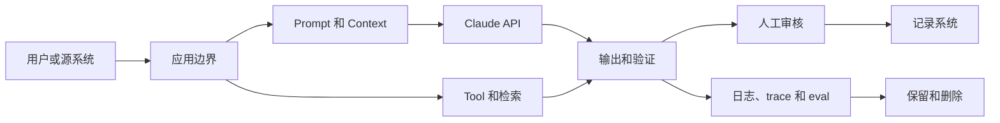

# 企业治理、合规与人工审核

> 治理是一套决定谁可以使用谁的数据承担何种风险的系统。

**Type:** Reference
**Languages:** Python
**Prerequisites:** [为能力设置权限边界](../../06-governance-safety-and-responsible-use/)，[集成协议、身份与最小权限](../../25-integration-protocols-identity-and-least-privilege/)；Phase 17，Lesson 26
**Time:** ~150 分钟

## 学习目标

- 将政策和监管义务转化为有明确负责人的技术控制
- 对数据进行分类，并映射数据在 Prompt、Tool、存储、日志和审核中的流转
- 根据风险、权限和可逆性设计人工审核
- 在具体情境中评估偏差、Fairness、透明度和可申诉性
- 为审批、监控、事件响应和审计构建证据

## 问题

某医疗团队提出了一个 Claude 工作流，用于总结患者消息、推荐路由类别并起草回复。设计文档写道：
“Model 不会保留数据，所有输出均由人工审核，且系统符合 HIPAA。”

这些陈述都不能构成架构。

数据可能出现在 API payload、文件、缓存、批处理存储、日志、trace、支持系统和审核人员使用的 Tool 中。“人工审核”并未说明审核人员的资质、证据、工作负载或权限。合规取决于具体用途、合同、配置、区域、控制措施和法律分析。架构师不能用一句话作出合规声明。

正确的回应并不是自动拒绝，而是设计一个受治理的系统，其中包含数据映射、风险决策、控制负责人、证据，以及在需要时向安全、隐私、法律、临床或合规专家升级的机制。

本课教授架构判断，不构成法律建议。

## 概念

### 从风险决策开始

治理首先需要识别：

- 系统会影响的决策或操作
- 可能受益或受到伤害的人
- 涉及的数据类别
- 错误和滥用模式
- 可逆性
- 所需权限
- 适用的组织内部义务和外部义务
- 接受剩余风险的负责人

不要从一份通用的防护措施清单开始。内容过滤器、审批队列或加密控制只有在特定边界上处理已明确命名的风险时才有价值。

### 映射整个系统中的数据流转



对于每一条边和每个存储位置，记录：

- 数据类别和用途
- 相关情况下的数据来源和数据主体
- 必需字段与可选字段
- 身份和访问权限
- 加密和密钥所有权
- 提供商和次级处理者边界
- 区域或数据驻留要求
- 保留和删除行为
- 是否用于 Model 改进或 Evaluation
- 事件和访问审计证据

不同产品功能可能具有不同的数据保留和适用资格规则。文件、批处理、代码执行、MCP connector、托管会话和标准 Messages 请求可能不会共享同一边界。请根据具体的功能组合检查当前官方文档和你的协议。

### 先最小化，再保护

当不必要的数据从未进入系统时，安全控制会更有效。

按照以下顺序执行：

1. 移除任务不需要的字段。
2. 在不需要身份信息时进行假名化或聚合。
3. 根据明确要求限制功能或提供商边界。
4. 限制身份、scope、保留期限和日志。
5. 通过加密、监控和事件控制保护剩余数据。

“告诉 Claude 不要记住”不是数据保留控制。数据保留由配置和合同约定的行为决定。

### 构建控制 Matrix

控制可以分为几种类型。

| 类型 | 目的 | 示例 |
|------|------|------|
| 预防性 | 阻止不安全事件 | scope gate 阻止未经授权的写入 |
| 检测性 | 揭示问题 | 对抽样输出中的敏感字段泄露发出警报 |
| 纠正性 | 限制或修复损害 | 撤销访问权限、回滚 Model 路由、修正受影响的记录 |
| 治理性 | 分配并审核权限 | 指定负责人在发生重大变更后重新审批用例 |

对于每项控制，记录负责人、实现方式、证据、测试、失败响应和审核频率。没有负责人和测试的控制只是一种期望。

### 对 Model 防护措施与系统防护措施进行分层

使用多个边界：

- 输入验证和分类
- 将可信来源与不可信内容分离
- Prompt 指令和示例
- 最小化 Tool 暴露
- 身份认证和授权
- schema 和语义输出验证
- 操作限制和审批
- 部署后监控和红队测试

Prompt 防护措施影响生成行为。系统防护措施强制执行不变量。二者不能相互替代。

### 将人工审核设计为一种控制

当审核人员能够改善决策，并且拥有完成审核所需的信息、时间、能力和权限时，human-in-the-loop 才有价值。

需要定义：

- 触发条件：风险类别、证据不足、冲突、不确定性或抽样案例
- 审核人员：角色和资质
- 审核材料包：来源证据、Model 输出、Tool 轨迹、标记和拟议操作
- 决策：批准、编辑、拒绝、升级或请求证据
- 服务级别：时间预算和队列容量
- fallback：无法进行审核时的安全行为
- 审计：身份、理由、时间戳和最终操作

避免自动化偏差。审核人员需要有理由检查证据，而不是面对一个容易促使其草率批准的精美答案。可以考虑先展示来源摘录，再展示生成的结论，或者要求提供结构化原因代码。

### 使审核方式与风险匹配

| 风险 | 示例 | 审核模式 |
|------|------|----------|
| 低 | 可轻松撤销的内部草稿 | 自动检查加抽样审核 |
| 中 | 面向客户的建议 | 基于阈值或异常情况的审核 |
| 高 | 金融、法律、临床或破坏性操作 | 操作前由具备资质的人员审批 |
| 未知 | 新用例或证据薄弱 | 暂停、升级并收集证据 |

由同一个 Model 输出的置信度并不是可靠的安全边界。应使用可观察证据、经过校准的 Evaluation、确定性条件和具备资质的审核。

### 将 Fairness 视为情境化要求

偏差是指可能使某些人处于不利地位的系统性错误或表征。Fairness 并不是一个通用指标。

需要询问：

- 正在作出什么决策？
- 哪些群体可能面临不同的错误率或访问机会？
- 存在哪些受保护或敏感属性，以及哪些属性会被推断或被代理变量间接表示？
- 哪种 Fairness 定义适合法律和伦理情境？
- 它与准确性、隐私和个体化对待之间存在哪些权衡？
- 谁有权选择和审核该标准？

在适当情况下，测试具有代表性的数据切片和交叉群体。小样本量会带来不确定性，应如实报告，而不是隐藏。

### 提供透明度和可申诉性

不同人需要不同的解释。

- 最终用户需要知道 AI 何时对交互产生实质性影响，以及如何质疑有害结果。
- 审核人员需要证据、不确定性和控制 Context。
- 运维人员需要版本、trace 和故障类别。
- 审计人员需要政策映射、测试、所有权和留存证据。
- 管理层需要剩余风险、业务影响和决策状态。

不要将 chain-of-thought 或敏感的系统指令作为解释公开。应提供基于来源的理由、已应用的规则、相关因素和人工申诉路径。

### 为变更制定计划

任何重要因素发生变化时，都应重新评估：

- 用例或受影响人群
- Model 或提供商
- Prompt 或 Tool 权限
- 数据源、保留期限或区域
- Evaluation 结果或事件模式
- 法律、政策或合同
- 部署规模

对风险评估和控制证据进行版本管理。一次发布审批不能涵盖未来与其无关的系统。

## Build It

## Interactive Lab

```figure
27-governance-approval-flow
```

使用审批流程探索器调整后果、可逆性、证据、审核人员资质、队列容量和 fallback。它可以直观展示人工审核标签何时是真正的控制，何时只是瓶颈。

## Practice Lab

从材料包副本中移除审核 fallback 或某个控制负责人，观察被阻止的状态，然后修复治理设计。

## Shipped Artifact

填写完毕的 [`outputs/governance-control-packet.md`](../outputs/governance-control-packet.md)
包含风险登记表、数据边界、预防性、检测性、纠正性和治理性控制，以及人员配置完善的审批路径。

## Verify It

通过确定性方式验证其所有权和失败响应：

```bash
cd certifications/claude/lessons/27-enterprise-governance-compliance-and-hitl
python3 code/main.py
python3 -m unittest discover -s code/tests -v
```

quiz 检查治理和重新评估决策。

## Capstone Connection

将此材料包带入 Architect Professional capstone 的治理和人工审核部分。

为一个高影响力 Claude 工作流创建治理材料包。

### 第 1 步：风险登记表

```markdown
| 风险 | 原因 | 受影响方 | 影响 | 可能性 | 控制 | 负责人 | 剩余风险 |
|------|------|----------|------|--------|------|--------|----------|
```

包括意外故障、滥用、Prompt injection、内部人员访问、依赖项故障、过时知识、不公平表现和审核人员过载。

### 第 2 步：数据映射

列出每个 payload、存储位置、日志、缓存、Evaluation set、人工界面和外部服务。标注数据用途、最少字段、保留期限、删除方式、身份、区域和合同边界。

### 第 3 步：控制 Matrix

```markdown
| 控制 | 处理的风险 | 边界 | 负责人 | 证据 | 测试 | 失败时的响应 |
|------|------------|------|--------|------|------|--------------|
```

至少包括一项预防性、检测性、纠正性和治理性控制。

### 第 4 步：人工审核设计

明确触发条件、审核人员资质、证据材料包、可执行操作、队列 SLO、fallback 和审计记录。计算预期审核量。如果队列无法满足 SLO，则设计尚不完整。

### 第 5 步：审批与重新评估

明确哪些技术、安全、隐私、领域和业务决策需要由不同负责人作出。定义重大变更触发条件和下一次审核日期。

## Use It

对于患者消息工作流，更安全的首次发布方式可能是：为具备资质的审核人员起草路由建议，但不发送回复，也不修改医疗记录。该方案仅使用必要字段和可信临床来源，实施严格的租户和角色授权，使输出与来源关联，执行高风险关键词和证据检查，并在审核队列不可用时采用安全 fallback。

随后，团队需要验证：

- 按消息类别划分的任务准确率
- 紧急案例中的假阴性表现
- 在允许且适当的情况下按人口特征和语言划分的数据切片
- 来源支持和过时数据处理
- 审核人员的一致性、耗时和推翻结果
- 隐私、访问、保留和删除控制
- 事件、回滚和审计行为

法律、隐私、安全和临床负责人决定现有证据是否满足适用义务。架构师提供映射、控制、测试和剩余风险声明。

## 考试决策模式

当场景涉及受监管或敏感数据时，不要推断内部用途就会自动获准。应最小化并分类数据，验证政策和合同，并让适当的负责人参与。

优先选择符合以下特征的答案：

- 移除不必要的标识符或对其进行匿名化
- 映射特定功能的数据边界和保留行为
- 对 Model 控制和确定性控制进行分层
- 将高影响力操作与具备资质的审批绑定
- 测试具有代表性的数据切片和不利案例
- 提供证据以及申诉或升级路径
- 明确控制负责人和重新评估触发条件

避免将 Prompt、Model 置信度、通用审核或供应商声明视为完整治理的答案。

## 常见陷阱

### 以产品名称判定合规

适用资格可能取决于功能、配置、协议、区域和数据流。应验证确切的架构。

### 将人工审核视为勾选项

缺乏资质、工作过载或没有证据的审核人员无法可靠地降低风险。

### 为审计记录日志却未进行最小化

详细日志可能形成新的敏感数据存储。应在适当的访问和删除控制下，仅保留最少的必要证据。

### 使用单一 Fairness 指标

不同 Fairness 定义可能相互冲突。应根据情境、法律、危害和利益相关者决策作出选择，然后报告权衡。

## 练习

1. 为使用文件、MCP connector、批量 Evaluation 和人工审核的支持工作流构建数据映射。
2. 为每日 10,000 个任务、触发率为 5% 的场景设计审核队列，并计算人员配置假设。
3. 编写一项控制测试，证明未经授权的租户数据绝不会进入 Model Context。
4. 为受到 AI 辅助决策伤害的用户定义可申诉路径。
5. 创建能够强制触发治理重新评估的重大变更标准。

## 关键术语

| 术语 | 人们通常所说的含义 | 实际含义 |
|------|--------------------|----------|
| 治理 | 一份政策文档 | 贯穿系统生命周期的决策、所有权、控制、证据和审核 |
| 数据最小化 | 加密一切 | 不收集或发送实现目的所不需要的字段 |
| Human-in-the-loop | 有人查看输出 | 具有明确触发条件、合格负责人、证据、权限和 fallback 的控制 |
| 剩余风险 | 一个隐藏问题 | 实施控制后仍然存在，并由授权负责人明确接受的风险 |
| Fairness | 准确率相同 | 具有权衡因素和受影响利益相关者的情境化标准 |
| 可申诉性 | 客户支持 | 对结果提出质疑、进行审核并予以纠正的有效路径 |

## 延伸阅读

- [Claude API 数据保留文档](https://platform.claude.com/docs/en/manage-claude/api-and-data-retention)，了解当前特定功能的边界
- [Anthropic Trust Center](https://trust.anthropic.com/)，获取当前安全与合规材料
- [Claude's Constitution](https://www.anthropic.com/constitution)，了解 Anthropic 公开的 Model 行为框架
- Phase 17，Lesson 26：合规架构
- Phase 18，Lessons 20 和 21：偏差与 Fairness
