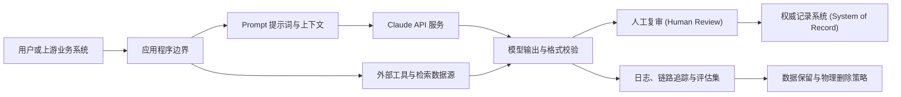

# 企业级治理、合规与人工复审 (Enterprise Governance, Compliance, and Human Review)

> 所谓治理，本质上就是一套决定谁有权使用谁的数据去承担何种风险的工程制度。

**Type:** Reference
**Languages:** Python
**Prerequisites:** [以制度权威规约技术能力](../../06-governance-safety-and-responsible-use/), [集成协议、身份凭据与最小权限原则](../../25-integration-protocols-identity-and-least-privilege/); Phase 17, Lesson 26
**Time:** ~150 minutes

## 学习目标

- 将企业政策与法律法规义务转化为具有明确负责人的技术控制措施
- 建立严密的数据分类机制，完整绘制其在 Prompt、工具、存储、日志与复审环节的流转拓扑
- 依据风险等级、签字权限与行为可逆性，科学设计人机协同（HITL）复审流程
- 在特定业务上下文中客观评估算法偏差、公平性、透明度与异议申诉机制（Contestability）
- 构建支撑合规审批、运行监控、应急响应与审计举证的完整证据链

## 问题背景

某医疗团队提议构建一个基于 Claude 的智能工作流，用于自动归纳患者留言、推荐分诊分类标签并起草初步回复。其方案设计文档中写道：“模型不会保留数据，所有输出均有人工复审把关，整个系统完全符合 HIPAA 合规标准。”

上述任何一句话，都算不上真正的系统架构设计。

在真实系统中，患者数据可能会出现在 API 请求体、本地文件、缓存层、批处理存储区、日志流、分布式追踪链路、客服系统以及人工复审界面中。“人工把关”四个字既未界定复审人员的专业资质，也未交代审查所需证据、并发吞吐负荷以及审批裁定权限。合规性取决于具体的业务场景、采购合同条款、服务配置、数据所在区域、技术控制措施以及专业法务分析，绝非系统架构师一句话就能凭空宣称的。

面对此类场景，正确的工程应对绝不是一刀切地直接驳回，而是给出一份具备全景数据流转图谱、量化风险决策、技术控制负责人清单、审计存证机制以及按需升级至安全、隐私、法务、临床或合规专家的严谨治理架构。

本课旨在培养架构师的工程判断力，不构成正式法律建议。

## 核心概念

### 从清晰的风险决策切入

系统治理必须始于对以下维度的清晰界定：

- 该系统将对哪项关键业务决策或物理动作产生实质性影响
- 哪些群体将从中受益，哪些群体可能承受潜在损害
- 涉及哪些敏感等级的数据资产分类
- 潜在的系统故障模式与恶意滥用攻击路径
- 相关操作是否具备可逆性（Reversibility）
- 触发该动作所需的法定或业务授权级别
- 适用的企业内部规章及外部法律监管约束
- 负责签批并承担系统残留风险（Residual Risk）的具体业务负责人

切勿从一份泛泛而谈的安全护栏清单起步。任何内容过滤器、审批工单队列或数据加密方案，只有在明确针对特定边界上的特定风险时，才具备真正的工程价值。

### 绘制全链路数据流转图谱


```mermaid
flowchart LR
    U["用户或上游业务系统"] --> A["应用程序边界"]
    A --> P["Prompt 提示词与上下文"]
    P --> M["Claude API 服务"]
    A --> T["外部工具与检索数据源"]
    M --> O["模型输出与格式校验"]
    T --> O
    O --> H["人工复审 (Human Review)"]
    O --> L["日志、链路追踪与评估集"]
    H --> R["权威记录系统 (System of Record)"]
    L --> D["数据保留与物理删除策略"]
```

针对上述拓扑中的每一条数据流向与存储节点，均须详尽记录：

- 数据分类等级与处理业务目的
- 涉及的数据主体（Data Subject）与数据源头
- 必填字段与可选冗余字段的明确界定
- 调用身份认证与细粒度访问控制权限
- 加密传输协议、落盘加密算法与密钥托管归属
- 云厂商与第三方子数据处理机构（Subprocessor）的安全边界
- 数据存储物理区域（Region）与主权驻留要求
- 生命周期保留期限与确定性物理销毁行为
- 是否会被用于模型持续训练或离线评测
- 安全突发事件响应机制与访问审计日志归档

不同的云服务功能特性往往遵循截然不同的数据保留与合规承诺。文件上传、批处理 API、代码沙箱执行、MCP 连接器、长会话托管与标准 Messages API 调用的安全边界并不完全一致。架构师必须结合当前最新的官方协议与企业采购合同条款，逐项核实技术组合的合规有效性。

### 数据最小化先于安全防护

安全防线最坚固的时刻，莫过于非必要数据从始至终未曾进入系统。

请严格遵循以下降噪防护顺序：

1. **源头剔除**：直接抹除与当前任务无关的一切非必要字段。
2. **假名化与聚合**：在无需追踪具体自然人身份的环节，实施脱敏、假名化（Pseudonymization）或宏观聚合。
3. **收敛边界**：基于最小业务需求，限定开启的功能集或供应商网络边界。
4. **收紧管控**：严格限制调用主体身份权限、操作范围、日志保留期与明文落盘。
5. **纵深防御**：对留存的核心数据应用强加密、运行监控及应急响应机制。

在 Prompt 中祈祷“请 Claude 忘记此信息”绝不是有效的数据保留控制。合规的数据保留完全取决于服务配置与合同法律效力。

### 构建结构化控制矩阵

企业技术控制措施通常划分为四大互补类型：

| 控制类型 | 核心目的 | 生产落地示例 |
|---|---|---|
| 预防性控制 (Preventive) | 阻断不安全事件的发生 | 权限网关在底层拦截无写入权限的越权调用 |
| 侦测性控制 (Detective) | 及时发现隐蔽的安全违规 | 采样监控告警输出内容中意外泄露的敏感字段 |
| 纠正性控制 (Corrective) | 遏制或修复已造成的破坏 | 立即吊销泄露凭据、秒级回滚模型路由、修正错误业务单据 |
| 治理性控制 (Governance) | 明确并审计签字决策权 | 当系统发生重大变更时，由指定业务负责人重新签署上线许可 |

每一项控制措施都必须绑定明确的责任人（Owner）、落地实现机制、存证依据、单元测试用例、失效应急处置预案以及周期性复审频次。缺乏负责人与测试用例的控制措施不过是空中楼阁。

### 多层级纵深防御安全护栏

必须建立多道纵深互补的防御纵深：

- 输入端参数校验与恶意风险意图分类
- 严格隔离受信任知识库内容与不可信外部用户输入
- 严密的 Prompt 系统指令与少样本示例约束
- 工具暴露列表的最小化动态裁减
- 强身份认证与细粒度权限动态鉴权
- 输出端的结构化 Schema 校验与语义合规过滤
- 敏感写操作的额度阈值限制与人工签字门禁
- 发布后的持续对抗红队测试（Red-team Testing）与离线监控

Prompt 护栏旨在正面引导模型的生成概率分布；系统护栏旨在底层强行捍卫系统的不可变不变式（Invariants）。两者各司其职，互不替代。

### 将人工复审严谨建模为核心控制项

人机协同（HITL）唯有在复审人员切实具备改进决策的能力，且拥有充裕的信息、工时、专业资质与权威签字权的前提下，才能真正发挥安全阀的作用。

工业级复审机制必须明确界定：

- **触发条件 (Trigger)**：特定风险评级、证据链不足、多源事实冲突、置信度低谷或随机质量采样
- **复审人资质 (Reviewer)**：明确业务角色与专业认证资质要求
- **证据包 (Packet)**：包含原始证据材料、模型输出草案、工具调用轨迹、风险警示标签与拟执行操作
- **裁定动作 (Decision)**：核准执行、人工修改、坚决驳回、向上升级或要求补充证据
- **服务等级协议 (SLO)**：单据处理时间预算与复审队列吞吐容量
- **安全降级预案 (Fallback)**：当复审队列发生阻塞或人员不可用时的保守默认行为
- **全链路审计 (Audit)**：完整记录复审人身份、修改理由、裁定时间戳与最终生效操作

坚决防范“自动化偏差（Automation Bias）”。如果界面直接呈现格式优美的结论文本，复审人员极易沦为机械点击“同意”的橡皮图章。优秀的工程设计应当在呈现生成结论之前，强制呈现源文档核心切片，或者要求复审人员必须勾选结构化的审核归因代码。

### 依据风险级别动态匹配复审策略

| 风险等级 | 典型场景 | 人机协同复审范式 |
|---|---|---|
| 低风险 | 内部知识库草稿起草，具备极易撤销能力 | 自动化规则校验为主，辅以后台离线随机抽检 |
| 中风险 | 面向普通客户的业务建议与方案推荐 | 设定置信度阈值或仅针对异常例外工单触发人工把关 |
| 高风险 | 涉及资金转账、法律文书、临床医疗或破坏性操作 | 必须在动作真正执行前，由持证专业人员签署不可篡改的审批凭据 |
| 未知风险 | 探索型业务试点或缺乏充分评估依据的新功能 | 全面挂起阻断，向上升级专家评估，收集安全证据 |

模型自身吐出的“自我置信度评分”绝不能作为可靠的安全判定分水岭。必须依赖客观可观测的证据链、校准过的外部评估器、确定性的业务规则以及高资质的人工复审。

### 将公平性视为强上下文相关的工程需求

算法偏差（Bias）指系统表现出的系统性偏见或错误分布，可能对特定人群造成事实上的不公待遇。在工程实践中，绝对的“通用公平性指标”并不存在。

架构师必须厘清：

- 系统当前正在辅助做出何种维度的业务决策？
- 哪些人群可能遭受更高比例的错误率或受到服务排斥？
- 哪些法定受保护属性（Protected Attributes）正在被显式包含、隐式推断或通过代理变量（Proxies）间接引入？
- 哪一种数学公平性定义（如机会均等、人口统计平等）契合当前的法律监管与伦理诉求？
- 提高某项维度的公平性会对整体准确率、数据隐私和个体精细化决策带来哪些不可避免的工程权衡？
- 谁拥有权威签字权来裁定并定期复审这一评估准则？

针对人口统计子群体与交叉群体（Intersectional Groups）实施严格的分层测试。小样本带来的统计不确定性应当被诚实披露，严禁人为隐匿。

### 提供充分的透明度与异议申诉通道

不同层级的利益相关方需要完全不同维度的技术解释：

- **终端用户**：需要获知当前交互何时受到了 AI 的实质性影响，并在遭受不利结果时拥有明确的异议申诉渠道（Contestability）；
- **复审专员**：需要清晰查看支撑证据、不确定性风险标签与控制规则上下文；
- **运维工程师**：需要掌握版本号、全链路 Trace 轨迹与具体的错误归类；
- **合规审计人员**：需要审阅技术控制措施与法规条文的映射矩阵、测试用例、责任人清单与存证材料；
- **管理决策层**：需要统揽残留风险敞口、商业价值影响与重大决策状态。

严禁将模型的内部思考流（Chain-of-thought）或敏感系统提示词直接作为面向用户的技术解释。应当提供基于源文档事实依据的业务说理、所依据的具体规则条款以及通畅的人工申诉受理路径。

### 为系统变更制定治理重评预案

当系统发生如下任何重大实质性变更时，必须强制触发全流程治理重评：

- 业务场景拓展或系统覆盖人群发生转变
- 底层模型升级或更换云服务供应商
- Prompt 提示词重构或工具执行权限发生扩张
- 新增数据源、延长保留周期或变更物理托管区域
- 评估测试表现明显劣化或线上出现安全事故聚集
- 外部监管法律、行业政策或商业合同发生更新
- 系统调用规模发生指数级膨胀

对风险评估档案与控制存证材料进行严格的版本控制。初次上线时的准入批复，绝不能自动豁免后续无关系统变更的安全责任。

## 动手构建

本实验使用标准库 Python 搭建了一套确定性的企业治理数据包与控制门禁校验引擎，确保系统上线前的合规基石坚如磐石：

- **步骤 1：风险登记表（Risk Register）**：以结构化表格详尽枚举潜在意外事故、恶意滥用、提示词注入、内部越权、外部依赖失效、知识过时、算法不公及复审人员疲劳风险，并量化评估严重度与残存风险。
- **步骤 2：全域数据映射表（Data Map）**：盘点全部通信载荷、数据仓库、追踪日志、评估测试集、人工界面与外部服务，清晰划定字段最小化范围、加密要求与保留周期。
- **步骤 3：控制矩阵（Control Matrix）**：明确绑定覆盖预防、侦测、纠错与治理四大层面的具体技术实现、测试用例与失效响应预案。
- **步骤 4：人机协同复审工程化（Human Review Design）**：严密计算预期复审单据量，设定触发条件、复审人员资质门槛、证据包内容契约与复审队列阻塞时的安全兜底。
- **步骤 5：审批决议与变更重评（Approval & Reassessment）**：明确安全、法务、业务领域专家的多方签字背书，明确设定变更重审红线。

## 交互式实验

```figure
27-governance-approval-flow
```

使用上述审批流探索器，独立调整操作后果等级、行为可逆性、证据链完整度、复审人员专业资质、队列吞吐容量与降级兜底预案。直观体验在何种临界条件下，所谓的“人工把关”标签能够成为一道坚不可摧的安全控制，又在何种情况下会退化为拖垮生产的无意义业务瓶颈。

## 实战演练

在测试数据包的副本中人为移除复审队列的降级预案或清空某项核心控制项的负责人，观察系统校验器是如何直接报红阻断的，并亲手修复该治理缺陷。

## 交付产物

[`outputs/governance-control-packet.md`](../outputs/governance-control-packet.md) 包含一份真实完整的治理控制数据包，涵盖了全套风险登记册、数据流动边界图、四层控制措施矩阵以及配有明确编制的人工复审架构方案。

## 验证方法

在本地环境中运行确定性治理校验工具，执行全量自动化验证：

```bash
cd certifications/claude/lessons/27-enterprise-governance-compliance-and-hitl
python3 code/main.py
python3 -m unittest discover -s code/tests -v
```

课程配套的 6 道自测题将重点考核你对合规风险转化、数据最小化落地、人机协同架构防线与重大变更重审机制的实战把控。

## 项目连接

请将此处的治理控制数据包与人工复审准入规范，作为 Architect Professional Capstone 毕业设计中企业级安全合规体系的核心交付依据。

## 实践应用

针对患者留言处理场景，一个更为稳健的初版上线策略应为：仅为具备专业临床资质的复审医护人员起草内部转诊分类建议，绝不在未经人工审阅前直接向患者下发回复，更不直接修改底层电子病历（EMR）。该工作流仅摄取绝对必要的非敏感字段，对接权威临床指南知识库，执行严格的租户与角色隔离，并在检测到高危症状关键词时强制跳过自动处理直通紧急人工通道。

上线前，工程与业务团队必须联合验证：

- 各类不同病症留言的任务分类准确率
- 针对急诊重症用例的假阴性漏报率（False-negative Rate）
- 合法合规前提下针对不同年龄、性别与语言群体的表现均衡性
- 输出引用的事实支撑度与陈旧临床数据的淘汰处理
- 人工复审员的一致性比例、平均审阅耗时与修改覆盖率
- 隐私防泄漏、最小访问授权、数据定期销毁的落实情况
- 突发故障排查、版本快速回滚与全链路审计日志的不可篡改性

最终是否满足监管合规要求，由法务、隐私、安全与临床领域的法定负责人共同签署裁定。架构师的职责是提供详实透明的数据拓扑、技术控制、测试证据与残余风险量化评估报告。

## 考试决策模式

当试题场景涉及受监管行业（如金融、医疗）或敏感隐私数据时，切勿假设“内部使用”就代表天然合规。必须坚持数据最小化、分类定级、核验合同配置，并促成法定授权部门的介入审查。

标准决策特征：

- 主动剔除或假名化非必要的用户标识字段
- 依据具体功能特性绘制清晰的数据保留与托管区域边界
- 协同构建模型层软性引导与系统层硬性校验的纵深防线
- 将具有重大业务影响的操作与高资质人工审批进行强力绑定
- 针对代表性业务子集与极端不利案例实施针对性评测
- 为终端用户提供充分的决策证据支持与人工异议申诉通道
- 为每一项关键技术控制指定明确责任人与变更重评触发红线

坚决排斥的错误选项：

- 误以为在 Prompt 中写明合规要求就能满足法律监管
- 盲目相信模型自身的输出置信度能够充当安全防线
- 引入没有明确操作标准与时间预算的泛泛“人工审核”
- 将云厂商通用的品牌合规背书直接等同于自己系统的业务合规

## 常见陷阱

### 依仗产品名称宣称合规 (Compliance by Product Name)

具体的合规资格取决于特定的产品功能开关、加密配置、服务合同条款、数据中心所在区域以及端到端的数据流转全貌。必须基于精确落地的系统架构进行独立评估。

### 将人工复审沦为形式主义勾选 (Human Review as a Checkbox)

未配备充分上下文证据、缺乏专业资质认证或承受超负荷单据压力的复审员，根本无法有效拦截业务风险，甚至会诱发严重的自动化偏见。

### 假借合规审计之名滥收日志 (Logging for Audit Without Minimization)

未经脱敏的详尽全量日志记录，往往会在无形中建立一个风险巨大的非受控敏感数据沉淀池。审计存证必须坚持最小必要证据原则，并施加严格的访问隔离与自动销毁机制。

### 迷信单一公平性指标 (One Fairness Metric)

不同的数学公平性定义在统计学上往往相互排斥。必须结合具体业务情境、法律法规、潜在危害与多方利益权衡，做出审慎选择并公开透明披露其技术代价。

## 课后习题

1. 针对一个融合了外部文件解析、MCP 连接器、批量评估任务与人工复审界面的复杂客服流水线，绘制全域数据流向拓扑图。
2. 针对日均 10,000 单业务、触发人工复审率为 5% 的系统，建立复审队列排队论模型，并推导合理的医护人员编制需求。
3. 编写一套自动化集成测试用例，从底层断言跨租户的越权数据绝对不可能进入模型上下文。
4. 为受到 AI 辅助决策不利影响的信贷申请用户，设计一套完备可执行的异议申诉与人工纠错全流程。
5. 梳理并制定一份重大变更评估清单（Material-change Criteria），明确列出哪些技术变动必须强制打回治理委员会重新签批。

## 核心术语

| 术语 (Term) | 常见误解 | 实际技术内涵 |
|---|---|---|
| 企业治理 (Governance) | 放在抽屉里的一叠制度文件 | 贯穿系统全生命周期的权力划分、责任归属、技术控制、审计存证与定期复评制度体系 |
| 数据最小化 (Data minimization) | 把所有收集到的数据全部加密 | 凡是实现当前业务目的非绝对必需的字段，从源头坚决不予采集、传输或存储 |
| 人机协同 (Human-in-the-loop) | 只要屏幕前坐着一个人就算 | 具备明确触发条件、专业资质要求、证据上下文支持、法定授权与安全降级预案的闭环技术控制项 |
| 残留风险 (Residual risk) | 假装不存在的潜在系统隐患 | 在实施全部既定技术控制之后依然客观存在的系统风险，且已由法定业务主管显式签字接纳 |
| 算法公平性 (Fairness) | 各群体间的准确率绝对拉平 | 紧密结合法律伦理语境、需公开披露技术权衡代价并由权威多方参与裁决的上下文特定准则 |
| 异议申诉权 (Contestability) | 客服热线随口应付 | 赋予受不利决策影响的用户一条有实质意义的质疑证据、触发复核并纠正系统裁决的法定通道 |

## 延伸阅读

- [Claude API data retention documentation](https://platform.claude.com/docs/en/manage-claude/api-and-data-retention) 了解各功能模块的数据保留周期与官方安全边界
- [Anthropic Trust Center](https://trust.anthropic.com/) 获取最新的安全合规白皮书与第三方认证审计报告
- [Claude's Constitution](https://www.anthropic.com/constitution) 了解 Anthropic 公开的模型价值对齐框架与训练准则
- Phase 17, Lesson 26 企业合规架构深度实战
- Phase 18, Lessons 20 and 21 机器学习系统的算法偏差与公平性评估
