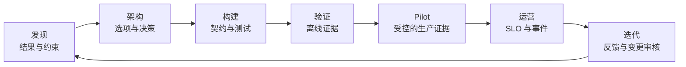

# 利益相关者沟通、ADR 与生命周期归属

> 架构并不是在图表完成时交付，而是在下一位负责人能够执行该决策时交付。

**Type:** Reference
**Languages:** Python
**Prerequisites:** [业务发现、需求与 SLA](../../22-business-discovery-requirements-and-slas/), [企业治理、合规与人工审核](../../27-enterprise-governance-compliance-and-hitl/); Phase 17, Lesson 23
**Time:** ~135 分钟

## 学习目标

- 面向高管、产品、工程和控制层级沟通同一套架构
- 编写能够保留权衡与逆转条件的决策记录
- 将设计转化为实施指导、rollout 门槛和明确的责任归属
- 定义交接验收和运营就绪条件
- 在整个系统生命周期中开展反馈和变更管理

## 问题

一名架构师向高管指导委员会展示了一张详细的 Multi-Agent 图。图中包含
Model 路由、MCP server、Vector 索引、事件队列、Evaluator 和 tracing。
但没有人能够回答三个基本问题：

- 正在批准哪项业务决策？
- 采取建议的控制措施后还剩下哪些风险？
- 系统上线后由谁负责？

之后，同一项设计以一张幻灯片的形式移交给工程团队。关键选择只存在于
会议记忆中。运营团队没有收到 SLO 或 rollback 规则。政策团队不知道自己
负责知识新鲜度。审核人员直到 pilot 期间才发现自己的队列。

设计即使在技术上正确，也可能无法交付。沟通和生命周期归属同样属于
架构职责。

## 概念

### 一个系统需要多种视图

不同的利益相关者需要不同的决策，而不是不同的事实。

| 受众 | 首要问题 | 最低限度的证据 |
|----------|------------------|------------------|
| 高管 | 价值是否值得承担残余风险和投入？ | 结果、baseline、目标、选项、成本范围、风险决策 |
| 产品与运营 | 工作流和用户体验将如何变化？ | 流程、例外、审核、SLO、采用计划 |
| 工程 | 必须构建什么，以及边界如何运作？ | 组件、契约、身份、错误、版本、测试 |
| 安全与隐私 | 数据和权限会在哪里跨越边界？ | 数据地图、威胁 Model、控制措施、保留策略、证据 |
| 领域负责人 | 输出对真实任务是否有效？ | Evaluation 案例、来源、政策、升级机制、变更归属 |
| SRE 与支持 | 如何检测、限制故障并从中恢复？ | telemetry、告警、runbook、rollback、依赖项 |

不要通过删除决策来简化内容。应当把同一项决策转化为各类受众所使用的证据。

### 构建架构叙事

有效的审核遵循以下决策顺序：

1. 当前工作流和可衡量的问题。
2. 决定解决方案形态的约束与风险。
3. 已考虑的选项。
4. 推荐的架构及其胜出原因。
5. 后果和被拒绝的替代方案。
6. 验证和 rollout 计划。
7. 残余风险和所需审批。
8. 贯穿运营和变更的责任归属。

一开始就展示组件图，会迫使受众自行重建这套逻辑。应当先向他们提供逻辑。

### 使用图表回答一个问题



Context 图回答谁以及什么会跨越系统边界。数据流图回答敏感数据会流向何处。
序列图回答一条轨迹如何运作。部署图回答运行时责任归属。控制地图回答在何处
预防、检测和纠正风险。

一张负载过重的图无法很好地回答其中任何一个问题。

### 记录决策，而不是会议实录

ADR 应当足够简短，便于阅读，同时也应足够完整，以便重新审视。

必需字段：

- 状态和决策负责人
- Context 与约束
- 选项与证据
- 决策与理由
- 后果与残余风险
- 被拒绝的替代方案
- 验证计划
- 逆转条件和审核日期

被拒绝的替代方案很重要。如果没有这些内容，未来的团队就会重复同样的分析，
或在不了解会破坏哪项约束的情况下变更设计。

明确表达置信程度。与其把未经测试的延迟或成本数字当作事实，不如坦诚地说
“我们估计”，这会更有用。

### 将架构转化为契约

实施指导需要可由机器检查的边界：

- 请求与响应 schema
- 身份和授权要求
- 版本控制与兼容性规则
- timeout、retry、cancellation 和 idempotency 行为
- 结构化错误类别
- 数据分类与保留策略
- Prompt、Model、Tool 和知识的责任归属
- Evaluation fixture 和发布门槛
- observability 字段与脱敏

架构包应当指向这些契约，而不是重复实现中的每一行内容。

### 按决策定义责任归属

“由 AI 团队负责”过于宽泛。

需要为以下事项指定负责人：

- 业务结果
- 产品工作流和用户沟通
- Prompt 与输出契约
- Model 选择与路由
- Tool 与集成服务
- 知识来源新鲜度
- 身份与权限
- Evaluation Label 与验收阈值
- 安全与合规控制
- 运行时 SLO 与事件响应
- 供应商与成本管理
- 弃用与退役

应当区分建议变更的人与有权接受其风险的人。

### 设计交接验收

只有当接收团队能够安全地运营和变更系统时，交接才算完成，而不是在发送
文档链接时完成。

验收标准：

- 已确认负责人和升级联系人
- 架构与 ADR 保持最新
- 依赖项和访问权限已配置
- dashboard 和告警已上线
- 已通过故障演练排练 runbook
- Evaluation suite 可运行，且 baseline 已存储
- rollback 已测试
- 数据保留和删除已验证
- 审核队列已配备人员
- 已沟通已知限制
- 已就变更与事件流程达成一致

使用联合验收审核。接收负责人应当演示如何从模拟故障中恢复。

### 将采用计划作为工作流的一部分

AI 系统会改变人们的工作方式。只培训如何使用界面是不够的。
用户需要知道：

- 哪些任务属于适用范围
- 应当检查哪些证据
- 何时应编辑、拒绝或升级
- 可以输入哪些数据
- 系统会记录什么
- 如何报告有害或错误行为
- 服务不可用时会发生什么

使用结果和质量衡量采用情况，而不能只看登录次数。高使用量可能反映的是
强制流程或重复返工。

### 按影响和决策沟通事件

在事件期间，应当区分已确认的事实、当前影响、缓解措施和未知事项。

```text
影响：哪些用户、任务或记录可能受到影响？
证据：哪些 telemetry 或 Evaluation 能够证实这一点？
遏制：禁用了哪些能力，或将其安全路由到了何处？
恢复：恢复服务前必须通过哪些检查？
后续：哪些控制措施、负责人或假设需要变更？
```

不要推测 Model 的意图。应当描述可观察到的系统行为和控制响应。

### 保持生命周期证据相互连接

每项生产结果都应当可以追溯到：

- 需求与决策
- 系统与配置版本
- 测试与审批证据
- 部署与运行时 trace
- 人工审核或 override
- 下游结果
- 当证据表明存在问题时提交的变更请求

这条链路有助于 debugging、治理和理性迭代。

## 构建它

## Interactive Lab

```figure
28-adr-lifecycle
```

使用 ADR 生命周期探索器，将一项决策从发现阶段推进到构建、验证、pilot、
运营、事件和重新考虑。改变证据或逆转条件，并观察接下来必须由哪位负责人
采取行动。

## Practice Lab

让陈旧检索的 tabletop 演练失败，将变化的证据追溯到其决策负责人，并更新
ADR，而不是只编辑图表。

## Shipped Artifact

填写完成的 [`outputs/delivery-handoff-packet.md`](../outputs/delivery-handoff-packet.md)
连接了高管决策、ADR、工程契约、运营演练和责任归属地图。

## Verify It

验证其中的决策、负责人、恢复证明和可衡量的逆转触发条件：

```bash
cd certifications/claude/lessons/28-stakeholder-communication-adrs-and-lifecycle
python3 code/main.py
python3 -m unittest discover -s code/tests -v
```

测验会检查沟通和生命周期决策。

## Capstone Connection

将已验证的交付包用作 Architect Professional capstone 的最终交接章节。

创建一个包含五项产物的交付包。

### 1. 高管决策简报

一页内容：问题、baseline、目标、选项、建议、投入范围、主要风险、
验证以及请求作出的决策。

### 2. 架构决策记录

记录所选模式和至少两个被拒绝的替代方案。包含逆转条件。

### 3. 工程契约索引

```markdown
| 边界 | 契约 | 负责人 | 版本规则 | 故障规则 | 测试 |
|----------|----------|-------|--------------|--------------|------|
```

### 4. 运营就绪检查清单

包含 dashboard、告警、runbook、访问权限、Evaluation、rollback、
依赖项、审核容量和事件沟通。

### 5. 责任归属与变更地图

```markdown
| 决策或资产 | 运营负责人 | 变更审批人 | 证据 | 审核触发条件 |
|-------------------|-----------------|-----------------|----------|----------------|
```

开展一次 tabletop 演练。模拟陈旧检索导致不安全建议、授权服务故障以及
Evaluator drift。接收团队应当识别影响、遏制相关能力、从已知安全版本恢复，
并记录后续责任归属。

## 使用它

对于企业研究助理，应提供以下视图：

- 高管：分析师周期时间缩短、证据质量目标、预算以及残余机密性风险。
- 产品：查询流程、证据不足状态、引用体验和反馈路径。
- 工程：检索、Model、Tool、身份和 Evaluation 契约。
- 安全：租户边界、来源权限、日志、保留策略和事件控制。
- 运营：新鲜度、延迟、成本、错误和质量 dashboard，以及 rollback 规则。

事实保持一致。细节应当符合每类受众所负责的决策。

在 pilot 结束时，不要只审核准确率。还要比较分析师耗时、引用检查、
审核人员工作量、按任务类别划分的采用情况、每份已接受报告的成本以及事件。
据此决定扩大、修订、限制还是停止。

## 考试决策模式

当场景询问如何沟通权衡时，应使用适合受众的语言说明业务后果、技术证据、
被拒绝的替代方案和残余风险。

优先选择符合以下特征的答案：

- 在作出承诺前开展结构化发现
- 记录 Context、选项和后果
- 为 Prompt、数据、Tool、控制措施、指标和运营分配负责人
- 定义实现与故障契约
- 要求完成运营就绪和交接验收
- 将反馈连接到有版本记录的变更决策

避免选择仅移交图表，却没有 SLO、runbook、Evaluator、责任归属或
rollback 的答案。

## 常见陷阱

### 面向所有受众使用同一份幻灯片

这样要么会让高管淹没在实现细节中，要么会让工程师只收到模糊的说法。
应当使用事实一致、针对决策调整的不同视图。

### 将架构视为上线产物

架构会随证据、规模、依赖项和风险而变化。在运营期间持续对决策和图表
进行版本管理。

### 按团队名称分配责任

团队标签无法说明由谁更新陈旧来源、接受 Evaluation 变更或响应告警。
应当分配具体决策。

### 采用等于价值

即使质量、审核负担或总处理时间变差，使用量仍可能上升。应当衡量结果。

## 练习

1. 将技术架构转化为一页高管决策简报。
2. 编写包含可衡量逆转条件的 ADR。
3. 为开始返回部分结果的 Tool 创建交接演练。
4. 为 RAG 应用中的每项可变更产物分配负责人。
5. 设计包含质量、返工和用户信任的采用记分卡。

## 关键术语

| 术语 | 人们通常所说的含义 | 它的实际含义 |
|------|-----------------|------------------------|
| 利益相关者 | 任何受邀参加会议的人 | 负责、影响或承受某项决策或结果的个人或群体 |
| ADR | 架构文档 | 对一项决策及其 Context、替代方案和后果的聚焦记录 |
| 交接 | 发送文档 | 以证据为基础转移运营能力和已接受的责任 |
| 运营就绪 | 部署成功 | 已证明负责人、控制措施、observability、恢复能力、Evaluation 和支持能力均已就绪 |
| 采用 | 用户数量 | 能够产生预期结果且不带来隐藏负担的持续工作流使用 |
| 逆转条件 | 缺乏信心 | 触发预定架构或范围变更的证据 |

## 延伸阅读

- [Claude Platform 文档](https://platform.claude.com/docs/en/home)，用于了解当前实现边界
- [构建有效的 Agent](https://www.anthropic.com/research/building-effective-agents)，用于说明工作流和 Agent 选择
- Phase 17, Lesson 23，了解 SRE 实践
- Phase 14, Lesson 40，了解结构化技术交接
- Phase 17, Lesson 24，了解事件响应和运营恢复
