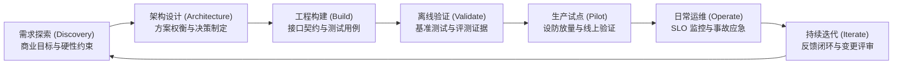

# 利益相关方沟通、架构决策记录 (ADR) 与全生命周期责任归属 (Stakeholder Communication, ADRs, and Lifecycle Ownership)

> 架构设计并非在画完架构图的那一刻宣告交付，而是在下一个接棒的负责人能够真正独立运维该决策时才算真正交付。

**Type:** Reference
**Languages:** Python
**Prerequisites:** [业务调研、需求分析与服务等级目标](../../22-business-discovery-requirements-and-slas/), [企业级治理、合规与人工复审](../../27-enterprise-governance-compliance-and-hitl/); Phase 17, Lesson 23
**Time:** ~135 minutes

## 学习目标

- 针对管理层、产品线、研发工程与安全合规等不同受众，清晰转译并呈现统一的系统架构
- 撰写高质量的架构决策记录（ADR），完整保留技术选型权衡、被否决的替代方案及架构逆转触发条件
- 将宏观架构方案切实转化为落地工程契约、发布灰度门禁与具有明确自然人归属的责任矩阵
- 制定严格的系统交接验收标准与运维就绪度（Operational Readiness）核验规范
- 在系统全生命周期中建立常态化的反馈闭环与变更管理机制

## 问题背景

一位架构师向高管决策委员会汇报了一张极其详尽的多 Agent 系统拓扑图。图上密密麻麻地标注了模型路由策略、MCP 服务器、向量索引库、事件驱动消息队列、独立评估器与分布式追踪链路。然而，在场的高管们提出了三个最基础的商业问题，汇报者却一个也答不上来：

- 本次评审究竟需要批准哪项核心业务决策？
- 在落实了所有提议的技术控制措施后，系统还会遗留哪些残余风险？
- 系统正式发布后，日常运维与业务成败的具体责任人是谁？

随后，该方案以几页 PPT 的形式直接抛给了研发工程团队。关键的技术选型取舍只停留在参会人员模糊的口头记忆中；SRE 团队没有收到任何明确的业务 SLO 指标或自动化回滚阈值；政策合规团队根本不知道自己需要对知识库的新鲜度负责；人工复审员直到上线试点前夕才惊愕地发现自己面前多出了一个堆积如山的待审工单队列。

一个在技术层面上无可挑剔的架构，依然可能因为交付与沟通的脱节而彻底沦为不可落地的空中楼阁。利益相关方沟通与全生命周期责任治理，本身就是系统架构师不可推卸的核心职责。

## 核心概念

### 同一个系统需要多重视角视图

不同的利益相关方需要依据架构做出完全不同维度的决策，但这绝不意味着向他们展示相互矛盾的“多套事实”。

| 目标受众 | 关注的核心问题 | 必需的最小证据支撑 |
|---|---|---|
| 高层管理人员 (Executive) | 预期业务价值是否值得承担相应的残余风险并投入预算？ | 商业产出、现状基线、预期目标、候选路径、成本区间、风险接纳声明 |
| 产品与业务运营 (Product & Ops) | 终端业务流程与最终用户体验将发生哪些实质改变？ | 用户旅程图、例外处置规范、人机复审队列、业务 SLO、推广落地规划 |
| 研发工程团队 (Engineering) | 具体的代码实现范围是什么？系统各交互边界的行为准则是什么？ | 模块拓扑、接口契约、身份透传规范、错误分类、版本策略、测试用例 |
| 安全与隐私合规 (Security & Privacy) | 数据资产与调用权限究竟在何处跨越了安全信任边界？ | 数据流向图、威胁建模分析、控制矩阵、数据保留策略、审计存证设计 |
| 领域专家/政策团队 (Domain Owner) | 模型的业务输出对于真实世界的工作任务是否真正有效？ | 评测标注集、权威数据源清单、行业合规条文、升级转派路线、规则维护责任 |
| SRE 与支持团队 (SRE & Support) | 线上系统故障如何被精准感知、范围控制与快速自愈？ | 遥测指标大盘、预警阈值、应急 Runbook、回滚机制、第三方依赖健康度 |

切勿为了迎合非技术听众而简单粗暴地隐瞒关键决策。正确的沟通方式是：保持底层事实完全一致，将同一个架构决策翻译为各方决策所需的专属工程证据。

### 构建层层递进的架构叙事逻辑

一场卓有成效的架构方案评审，必须遵循严密的逻辑推导链条：

1. 阐明当前的业务工作流痛点，并给出可量化的现状基线。
2. 列出制约该技术方案的核心硬性约束与关键风险边界。
3. 展示经过审慎评估的所有可能技术选项。
4. 阐述最终推荐的架构方案，并给出其胜出的充分依据。
5. 客观分析该选择所带来的衍生技术后果，并阐明为何放弃其他备选方案。
6. 给出严密的离线验证与线上分步放量发布计划。
7. 明确核算残余风险敞口，并明确请求特定业务负责人的最终审批签字。
8. 落实系统全生命周期运营与未来变更的责任人归属。

如果一上来就向与会者抛出一张错综复杂的组件关系图，实际上是强迫听众在脑海中自行反推上述全部设计逻辑。必须先理清逻辑脉络，再呈现技术载体。

### 让每一张架构图只聚焦回答一个核心问题


```mermaid
flowchart LR
    D["需求探索 (Discovery)\n商业目标与硬性约束"] --> A["架构设计 (Architecture)\n方案权衡与决策制定"]
    A --> B["工程构建 (Build)\n接口契约与测试用例"]
    B --> V["离线验证 (Validate)\n基准测试与评测证据"]
    V --> P["生产试点 (Pilot)\n设防放量与线上验证"]
    P --> O["日常运维 (Operate)\nSLO 监控与事故应急"]
    I --> D
    O --> I["持续迭代 (Iterate)\n反馈闭环与变更评审"]
```

系统上下文图旨在明确谁以及哪些外部系统会跨越系统交互边界；数据流向图旨在追踪敏感隐私数据究竟流经哪些节点；时序交互图旨在拆解单次任务轨迹的时序流转；部署拓扑图旨在明确计算与存储资源的物理归属与网络分区；控制分布图旨在标明各类风险在何处被有效预防、侦测与纠正。

试图用一张包罗万象的“大一统架构图”承载所有信息，结果往往是什么都无法清晰表达。

### 沉淀决策记录，而非会议速记

架构决策记录（ADR）的体量必须精炼到便于快速阅读，同时内容必须完备到在未来重新审视时能够自圆其说。

一份合格的 ADR 必须包含以下核心要素：

- 当前状态（拟定/已批准/已废弃）与决策签字责任人
- 决策背景与面临的客观技术/业务约束
- 纳入考量的候选方案及其量化对比证据
- 最终选定的架构决策及其核心技术理由
- 该决策带来的积极与消极后果，以及遗留的残余风险
- **被否决的备选方案及其被淘汰的明确原因**
- 针对该决策的验证与验收计划
- **明确的架构逆转触发条件（Reversal Conditions）与预定重审日期**

被否决的备选方案具有极高的工程价值。缺乏这部分记录，未来的团队极易在缺乏上下文的情况下重新踏入同一条河流，或者在打破关键约束的前提下盲目推翻现有架构。

在表述中必须保持诚实的置信度区间。白纸黑字写明“我们估算”远比将一个未经压测验证的延迟或成本数字当作不可动摇的既定事实要严谨得多。

### 将顶层架构具象化为机器可校验的工程契约

向研发团队下发的架构落地指南，必须包含可在代码中进行机器断言的确定性边界：

- 请求与响应的严谨数据 Schema 模式
- 身份透传与多级鉴权的具体协议实现标准
- 各微服务与接口的版本管理与向后兼容性约定
- 超时时限、重试退避策略、任务取消语义与操作幂等性（Idempotency）保障
- 规范统一的结构化错误分类体系
- 数据分类等级划分与自动销毁保留策略
- Prompt 提示词模板、模型版本、工具集与知识库切片的专属负责人
- 离线评估测试集固件（Fixtures）与生产金丝雀准入门禁
- 全链路可观测性埋点字段命名规范与敏感信息脱敏规则

架构交付包应当是指向上述工程契约的索引与指南，而不是去生搬硬套代码层面的每一行具体实现。

### 围绕具体决策界定责任归属

“由 AI 团队全权负责”是一种极不负责任且无法落地的泛化表述。

必须将责任落实到具体维度的自然人或明确岗位：

- 商业目标达成与投入产出比追踪负责人
- 产品业务工作流设计与终端用户沟通方案负责人
- Prompt 提示词工程与输出结构契约负责人
- 模型动态选型基准测试与路由策略负责人
- 工具开发、维护与下游服务集成接口负责人
- 知识库原始数据源新鲜度与作废淘汰负责人
- 身份认证体系与访问控制权限负责人
- 离线评估测试集真值标注与质量准入门槛签批人
- 安全防护措施有效性与监管合规负责人
- 线上运行时 SLO 达成与突发生产事故应急负责人
- 云厂商商业合同谈判与 Token 成本预算管控人
- 系统的平稳下线、数据彻底销毁与退役归档负责人

必须将“提出架构变更建议的人”与“有权在业务上签字接纳该变更风险的人”在制度上严格分离。

### 科学设计交接验收机制

只有当下游承接团队切实具备独立运维、排障并安全演进该系统的能力时，交接才算真正完成，绝非发出一封带有文档链接的邮件便可交差。

严密的交接验收准则清单：

- 各模块明确责任人与紧急升级联系人名单经过双向确认
- 架构白皮书与全量 ADR 决策记录保持最新版本
- 生产所有依赖服务与访问凭据均已完成规范配置
- 监控大盘实时在线，预警阈值全部配置就绪
- 经过故障演练实战检验的标准应急 Runbook 手册
- 离线自动化评估测试套件可在本地一键运行，历史基线归档完备
- 秒级回滚熔断机制经过线上真实验证
- 数据保留周期与定时物理删除策略通过合规检查
- 人工复审员编制已按排队论模型足额定岗就绪
- 系统当前已知的技术局限性已向各业务方书面充分披露
- 跨团队变更审批流程与重大事故协同机制已达成共识

强烈建议推行双向交接验收评审会：接收方团队必须通过一次模拟故障注入演练，现场演示其能够独立完成故障隔离与系统自愈。

### 将推广采纳纳入工作流工程考量

引入 AI 系统必然对原有的员工工作流带来深远冲击。仅仅对员工进行交互界面按钮培训是远远不够的。终端使用者必须清晰知晓：

- 该智能体能够处理哪些业务范围，哪些属于明确的非目标场景
- 在审核模型产出时，必须重点核验哪些底层源文档切片
- 在何种特定情形下，必须坚决驳回输出并向上人工转派
- 哪些业务数据允许输入，哪些机密数据严禁录入
- 系统在后台具体记录了哪些操作日志与行为轨迹
- 发现模型出现有害倾向或事实性错误时的正规举报通路
- 当 AI 服务发生故障宕机时，业务该如何平稳降级切换至传统人工流程

评估业务采纳度时，必须结合商业交付质量与返工率综合考量。高频的调用量完全可能是由于系统输出不合格、导致员工不得不被迫反复重试和返工所制造的虚假繁荣。

### 依据影响范围与决策链通报线上故障

在突发生产事故应急处置过程中，通报内容必须清晰剥离客观事实、受影响范围、止血举措与未知疑点。

```text
影响范围：哪些具体用户群体、核心业务单据或敏感数据可能受到波及？
客观证据：哪项遥测监控指标异常或离线评测用例报错确证了该事故？
遏制止血：采取了何种降级措施（如临时关停工具、路由至保守兜底方案）？
恢复标准：在全面恢复服务前，系统必须通过哪些硬性验证门禁？
后续根因：哪项技术控制、哪位负责人或原有假设被推翻并需要调整？
```

切勿在事故报告中对模型的“主观意图”展开主观臆测。必须专注于描述可观测的客观系统表现以及工程控制的响应闭环。

### 串联全生命周期的存证追溯链

任何一次在线上产生的最终业务决策，都必须能够沿着证据链层层向上追溯：

- 业务需求与批准该上线的原始 ADR 决策编号
- 该时刻运行的应用程序、Prompt 模板、模型版本与知识库快照
- 离线测试套件的验证打分与上线审批记录
- 生产运行时的分布式 Trace 链路拓扑
- 人工复审专员的修改记录或最终签字授权凭据
- 下游权威记录系统的落盘单据
- 后续如果暴露问题，对应触发的架构变更申请单

这条不可磨灭的存证追溯链，是支撑系统高效排障、满足外部审计合规以及驱动理性架构迭代的生命线。

## 动手构建

本实验使用标准库 Python 搭建了一套全流程交付包与 ADR 决策生命周期验证体系：

- **步骤 1：管理层决策简报（Executive Decision Brief）**：严格控制在一页纸内，提炼业务痛点、基线对比、候选方案优缺点、推荐理由、预算区间、核心风险与请求批准的决策项。
- **步骤 2：架构决策记录（ADR）**：详尽记录入选的系统架构模式，同时必须列出至少两个被否决的候选方案，并显式给出可量化的架构逆转触发条件。
- **步骤 3：工程契约索引表（Engineering Contract Index）**：在系统边界上明确规定调用契约、责任人、版本向后兼容原则、超时失败降级规则与自动化测试用例。
- **步骤 4：运维就绪度核查表（Operational Readiness Checklist）**：逐项检查监控看板、预警阈值、应急 Runbook、鉴权依赖、离线评估基准、回滚机制与复审队列容量。
- **步骤 5：责任归属与变更映射表（Ownership Map）**：为每一项核心资产与决策绑定运行负责人、变更签批人与变更重审红线。

## 交互式实验

```figure
28-adr-lifecycle
```

使用上述 ADR 决策全生命周期探索器，驱动一个具体的架构选型决策完整遍历需求探索、工程构建、离线验证、线上金丝雀、日常运维、突发事故及架构推翻重评的全流程。通过修改客观实测证据或逆转红线，直观观察系统会强制调度哪一位负责人出面采取行动。

## 实战演练

在模拟沙盘推演中故意触发知识库数据陈旧事故，顺着遥测证据链追溯到对应的架构决策负责人，亲自动手在 ADR 中追加针对时效性门禁的逆转触发规则，而不是仅仅在流程图上修改几个方块。

## 交付产物

[`outputs/delivery-handoff-packet.md`](../outputs/delivery-handoff-packet.md) 包含一份完整的系统交付交接包，将管理层决策要点、正式 ADR 架构决策、研发工程接口契约、SRE 运维演练记录及自然人责任矩阵严密集成为一个有机整体。

## 验证方法

在本地环境中运行确定性交付验证脚本，确保所有决策、负责人、自愈证明与逆转触发器均符合规范：

```bash
cd certifications/claude/lessons/28-stakeholder-communication-adrs-and-lifecycle
python3 code/main.py
python3 -m unittest discover -s code/tests -v
```

课程配套的 6 道自测题将深度考查你对利益相关方沟通降维、ADR 严谨撰写规范、工程交接防呆设计及全生命周期运维责任治理的实际掌握。

## 项目连接

请将此处的交付交接数据包与 ADR 决策追溯机制，作为 Architect Professional Capstone 最终答辩与项目结项交接阶段的最高级别交付产物。

## 实践应用

针对企业级智能研究助理系统的研发落地，架构师应当向不同角色提供以下视角：

- **面向管理决策层**：重点呈现分析师作业周期缩短百分比、证据质量目标达成率、总体预算投入以及企业核心机密未外泄的残余风险保障。
- **面向产品线团队**：清晰拆解用户查询旅程、证据不足时的优雅拒答状态、来源引用呈现交互以及用户纠错反馈入口。
- **面向研发工程团队**：严格定义知识库检索接口、模型调用参数、外部工具能力、身份鉴权透传以及自动化离线评测套件契约。
- **面向安全合规团队**：详尽绘制多租户数据隔离边界、源数据读取权限树、日志审计流转、数据保留周期与数据泄露应急预案。
- **面向 SRE 运维团队**：交付覆盖知识库时效滞后量、P95 响应延迟、Token 消耗成本、错误分类分布与核心输出质量指标的大盘面板，并附带秒级一键回滚操作规范。

底层的技术事实在所有报告中绝对一致，差异仅仅体现在根据各方所需行使的决策权量身定制细节深度。

在项目线上试点结束时，切忌仅仅核对简单的生成准确率指标。必须综合评估分析师工时节省幅度、引用查阅频次、复审人员负荷变化、各细分业务场景的采纳率、单次合格研究报告的综合资金成本以及突发异常工单。据此做出客观决策：是进一步扩大推广规模、实施技术重构、收缩使用边界，还是坚决果断止损下线。

## 考试决策模式

当试题考查如何就复杂技术方案与多方利益相关方沟通权衡时，必须依据受众的职责定位，使用恰当的语境准确转译商业后果、实测技术证据、被淘汰的备选路径以及最终的残余风险。

标准架构决策推导：

- 在正式立项前展开结构化的需求与技术可行性探索
- 详实记录决策背景、候选方案与引入的技术后果
- 为 Prompt、数据资产、工具集、安全控制、业务指标与线上运维明确绑定具体责任人
- 严格制定机器可执行的工程契约与失败降级策略
- 坚决要求满足运维就绪度硬性指标方可签署交接验收
- 将线上采集到的业务反馈机制与带有版本号的架构变更闭环关联

坚决排除的错误选项：

- 丢下一张复杂的架构图就以为完成了系统交付，缺乏 SLO、Runbook、评估集或回滚预案
- 试图用一套千篇一律的技术胶片向所有利益相关方做汇报
- 责任矩阵中通篇出现模糊的“研发团队”、“业务部门”等缺乏落地责任人的虚级概念

## 常见陷阱

### 一套胶片包打天下 (One Deck for Every Audience)

其必然结果要么是高管决策层被细枝末节的实现细节彻底淹没，要么是研发工程师面对假大空的宏观词汇无所适从。必须依据各方的决策诉求定制专属视图。

### 误将架构视为上线即告终结的一次性产物 (Architecture as a Launch Artifact)

系统架构必须随着线上实测证据积累、调用规模扩张、外部依赖变更与安全风险演进而持续迭代。必须在系统运行的全周期中保持对决策与架构图的版本化维护。

### 责任人以团队名称虚晃一枪 (Ownership by Team Name)

一个宽泛的团队标签根本无法解答到底谁该去更新过时的源文档、谁该对离线评估集标准的调整签字，或者谁该在半夜响应报警电话。责任必须具体到明确的角色和专人。

### 将调用量等同于业务价值 (Adoption Equals Value)

调用次数的上升可能仅仅反映出生成结果粗糙导致员工不得不被迫反复返工修正。唯有结合最终业务成果与人工处理耗时，才能度量真实的系统生产力价值。

## 课后习题

1. 将一份复杂的多 Agent 系统技术架构方案，浓缩改写为面向企业 CEO 的单页纸决策简报。
2. 针对模型选型与本地私有化部署决策，撰写一份包含可量化逆转触发条件的严谨 ADR 决策记录。
3. 针对某核心工具接口突然开始频繁返回部分截断数据这一异常场景，设计一份交接演练处置方案。
4. 梳理并盘点一个企业级 RAG 生产系统的全部可变组件，为其逐一指定具体的维护负责人与变更签批人。
5. 设计一套能够真实反映员工信任度、实际业务产出及人工返工比例的 AI 采纳度综合记分卡。

## 核心术语

| 术语 (Term) | 常见误解 | 实际技术内涵 |
|---|---|---|
| 利益相关方 (Stakeholder) | 被拉进会议室参会的任何人 | 拥有特定决策权、能够对系统产生实质影响，或必须直接承担系统运转后果的个人或集体 |
| 架构决策记录 (ADR) | 繁冗的系统架构设计说明书 | 专注于单个核心决策、完整记录上下文、备选方案优劣与权衡代价的标准化版本化工程档案 |
| 系统交接 (Handoff) | 把文档链接发在群里就算交接 | 凭借可复现的工程证据，将系统的日常运维能力、变更权力与事故处置责任进行可验证的正式转移 |
| 运维就绪度 (Operational readiness) | 代码部署上线成功且未报错 | 责任人、控制矩阵、可观测看板、故障自愈预案、评估套件与人工支持体系均已通过实战验证 |
| 业务采纳度 (Adoption) | 用户点击量或系统日活规模 | 深度嵌入日常生产工作流、能够持续产出预期业务价值且不转嫁隐性返工负担的良性使用状态 |
| 架构逆转条件 (Reversal condition) | 架构师心里觉得不靠谱 | 在 ADR 中预先白纸黑字写明的客观技术证据红线，一旦被触发即强制要求推翻重构现有方案 |

## 延伸阅读

- [Claude Platform documentation](https://platform.claude.com/docs/en/home) 查阅当前最新的架构实现边界与开发指南
- [Building effective agents](https://www.anthropic.com/research/building-effective-agents) 掌握如何清晰阐述工作流与 Agent 选型权衡
- Phase 17, Lesson 23 生产级站点可靠性工程（SRE）实践指南
- Phase 14, Lesson 40 结构化高可靠技术交接规范实战
- Phase 17, Lesson 24 线上事故应急响应与生产恢复标准 SOP
