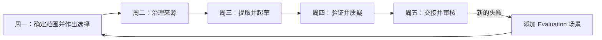

# 交付一周的工作成果，而不是一个完美的 Prompt

> 你的综合项目是一个受治理的决策工作流：输入来源、核验主张、保留人工权限，并完成状态交接。

**Type:** Build
**Languages:** Python
**Prerequisites:** [选择能够承载工作的最小界面](../../01-claude-product-and-model-landscape/), [将请求转化为可测试契约](../../03-prompting-and-task-decomposition/), [将每项事实放入正确类型的 Context](../../04-context-knowledge-memory-and-caching/), [验证主张，而非置信度](../../05-output-evaluation-and-validation/), [围绕能力设置权限](../../06-governance-safety-and-responsible-use/), [先设计交接，再设计自动化](../../07-workflow-design-and-human-handoffs/)
**Time:** 在一个模拟工作周内约 4 小时

## 学习目标

- 综合运用产品选择、Prompt、知识管理、验证、治理、故障排除和交接设计。
- 构建一个具有明确检查点、由来源支撑的每周简报工作流。
- 实现一个确定性的 Python 验证器，用于检查来源、主张、治理和交接就绪情况。
- 在建议发布之前运行正常和失败场景。
- 提供就绪证据，而不是声称工作流是安全的。

## 问题

你是 Northstar Field Services 的运营负责人，这是一家拥有七个区域团队的虚构公司。每周五，管理层都需要一份简报，涵盖服务延迟、影响客户的事件、政策例外，以及下周需要作出的两项决策。

当前流程非常脆弱。各区域负责人以不同格式发送更新。分析师将事实复制到文档中，核对相互冲突的日期，并请求三个人批准。最终简报有时会遗漏某个区域，或者引用旧消息中已被更正的数字。

管理层要求你“使用 Claude 自动生成周报”。这个要求并不是解决方案。简报会影响人员配置和客户沟通。某些输入包含客户详细信息。政策例外需要获得授权的负责人处理。没有证据的自信草稿可能会加速错误决策。

你的任务是设计一个有边界的 Claude 辅助工作流。Claude 可以提取、比较和起草内容。确定性检查负责验证精确属性。获得授权的人员负责发布和具有重大后果的决策。

## 概念

### 交付物是一条证明链

你将生成五项相互关联的产物：

1. 用例和产品选择记录。
2. 持续维护的来源注册表和固定的每周快照。
3. 分阶段 Prompt 契约。
4. 主张-证据和治理验证结果。
5. 包含回退方案的人工交接包。



每天都以一道关卡结束。如果关卡未通过，不要将不确定性推向下游。

### Python 验证器有意保持有限能力

综合项目代码不会调用 Claude。它展示了一条关键的架构边界：工作流的精确属性应由确定性代码处理。

验证器检查以下内容：

- 是否存在所有必需的交接包章节。
- 每个有效来源是否都有负责人、权威级别、日期、敏感度和稳定 ID。
- 主张是否引用已知来源。
- 具有重大后果的主张是否使用直接或计算得出的支撑。
- 过期和相互冲突的证据是否清晰可见。
- 所选界面是否获准处理相应数据类别。
- 高后果或不可逆工作是否有获得授权的人工负责人。
- 交接是否明确决策、截止时间、回退方案和下一位负责人。

它无法判断一项政策在伦理上是否充分、人工审核者是否胜任，也无法判断来源陈述是否真实。这些仍属于组织和人员的责任。

## 动手构建

## 交互式实验

```figure
29-associate-capstone-readiness
```

在整个五天构建过程中使用就绪看板。它将目的、来源、Prompt 阶段、主张支撑、权限、交接和回退方案连接起来，确保一份精美的简报无法掩盖未通过的关卡。

## 实践实验

完成下面的五天工作流，然后逐一故意破坏界面、来源、主张支撑、权限和交接关卡。

## 交付产物

交付的检查清单和填写完成的
[`outputs/demo-readiness-report.json`](../outputs/demo-readiness-report.json)
是实践产出。

## 验证

使用下面的命令复现通过检查的交接包以及所有失败优先测试；不需要网络访问或凭据。课程测验是最后的个人检查。

## 综合项目关联

完成的交接包是 Associate 路线的综合项目证据，将由另一人审核。

### 周一：确定决策范围和产品界面

用一句话描述决策：

```text
周五 15:00 前，运营总监将根据已批准的区域快照，为下一周选择不超过两项人员配置或流程变更。
```

定义范围之外的事项：

- 不自动发送客户消息。
- 不进行员工绩效排名。
- 不更改人员排班。
- 不作出法律或监管结论。
- 不使用受限数据。

比较候选界面。一次性对话很简单，但不适合维护指令和重复使用的来源集合。如果当前条款、计划控制和数据处理方式获得批准，Project 可能适合协作式、重复性工作。当需要以程序化方式进行数据摄取、验证和审计集成时，API 可能更合适。Research 适用于获取当前外部事实，不应用来取代内部批准的政策。

记录决策，而不只是产品名称：

```text
界面：
适用原因：
允许的数据类别：
当前条款检查日期：
不支持的需求：
回退界面或人工路径：
```

关卡：负责人批准目的、界面、数据类别和禁止的操作。

### 周二：冻结并治理证据

为以下来源创建注册表：

- 七份区域状态文件。
- 事件系统导出。
- 已批准的服务政策。
- 人员配置容量表。
- 上周的决策记录。

每个来源都需要稳定 ID、负责人、权威类别、生效日期、审核日期和敏感度。将讨论记录标记为参考资料，而不是政策。如果决策不需要客户姓名，则将其删除。

在有记录的时间点冻结每周来源快照。此后发生变化的事实应进入修订或例外流程。否则，草稿、审核者和管理者看到的可能是三个不同的事实版本。

定义权威顺序：

```text
1. 已批准的服务政策和签署确认的事件状态
2. 截止时间前提交的当前区域状态
3. 先前的决策记录
4. 讨论记录，仅用作线索，绝不能作为唯一支撑
```

关卡：所有七个区域均已包含或明确标记为缺失；来源通过新鲜度和权限检查；冲突已有负责人。

### 周三：分解工作

不要通过一个步骤直接请求最终简报。使用四个有边界的阶段。

**阶段 1，提取：** 返回结构化记录，包含区域、延迟、受影响的服务、事件 ID、政策例外、来源 ID 和不确定性。不要建议行动。

**阶段 2，核对：** 检查区域覆盖、总数、重复事件、日期冲突和无支撑字段。如果仍有阻塞项，则停止。

**阶段 3，分析：** 识别模式，并提出不超过三项候选行动。每项行动都需要支撑性发现、政策约束、可能收益、不利影响，以及能够授权该行动的负责人。

**阶段 4，起草：** 仅根据已验证的记录和已批准的分析生成管理层简报。包括需要作出的决策、证据、例外和已知不确定性。

每个阶段都使用 Prompt 契约。包括来源层级、弃答行为、输出形式和验收标准。保存各个版本，以便复现失败结果。

关卡：开始分析前，结构化提取结果已与快照核对一致。

### 周四：验证并质疑

运行随附的验证器：

```bash
cd certifications/claude/lessons/29-associate-workflow-capstone
python3 code/main.py
```

演示交接包应返回 `ready_for_human_review` 状态。现在故意破坏它：

- 将 `approved_surface` 设置为 false。
- 删除一个来源负责人。
- 引用一个不存在的来源 ID。
- 将一项具有重大后果的主张标记为推测。
- 删除决策负责人。
- 将行动设为不可逆。

运行单元测试：

```bash
python3 -m unittest discover -s code/tests -v
```

然后为实际草稿创建主张-证据 Matrix。引用必须支撑确切的主张。使用代码或电子表格验证总数，而不是使用 Model 评分器。向独立审核者提供评分标准和证据。要求审核者报告发现，而不是悄悄重写草稿。

使用以下发布级别：

- **阻止：** 未获批准的数据或界面、未知来源、无效总数、无支撑的重大后果主张、缺少决策权限。
- **修订：** 覆盖不完整、冲突未解决、来源过期、不确定性不清晰。
- **质量改进：** 内容重复、标题较弱或非关键的语气问题。

关卡：所有阻塞项均已解决。其余不确定性在人工交接包中清晰可见。

### 周五：交接并闭环

完成 [`outputs/checklist.md`](../outputs/checklist.md)。构建审核包：

```text
决策：选择最多两项下周干预措施。
负责人：运营总监。
截止时间：周五 15:00。
快照：每周来源注册表版本和截止时间。
候选项：简报版本和 Prompt 版本。
证据：主张 ID、来源 ID、计算结果。
检查：已通过、未通过和人工审核的项目。
不确定性：缺失区域、日期冲突或支撑薄弱。
选项：批准、修订、拒绝、升级。
回退方案：发布人工模板，或在通知后延期。
```

总监批准的是决策，而不是“AI”。记录谁根据哪个快照批准了什么。如果来源在批准后发生变化，则使发布关卡失效，并审核差异。

模拟发布后，进行一次简短回顾：

- 哪个阶段消耗的人工时间最多？
- 哪项检查发现了最严重的缺陷？
- 是否有任何重要判断变得更加困难？
- 哪个来源需要更明确的所有权？
- 哪项失败应加入 Evaluation 集？
- 该工作流应继续保持辅助模式、转为有限自动化，还是恢复人工处理？

## 实际应用

### 完整的证据包

你的提交内容应包括：

- 一份带有核验日期的界面选择记录。
- 一份包含十个来源的注册表，或者规模更小但涵盖每类必需来源的等效注册表。
- 四份 Prompt 阶段契约。
- 至少十个 Evaluation 场景：四个正常场景、三个边界场景、三个治理或对抗场景。
- 每项具有重大后果的主张对应的主张-证据 Matrix。
- 一个通过检查和三个未通过检查的交接包验证器输出。
- 通过的单元测试输出。
- 一份填写完成的人工交接检查清单。
- 一页回顾报告，其中包含一项具体的工作流变更。

### 综合项目决策模式

审核自己的工作或回答考试场景时，使用以下模式：

1. **没有获批准的目的，就停止。** 能力不会自动产生权限。
2. **没有权威证据，就弃答或升级。** 更多 Prompt 无法创造来源。
3. **精确属性，使用确定性检查。** 总数和 schema 不需要主观评分。
4. **后果重大，保留人工权限。** 向负责人提供证据和拒绝权。
5. **反复失败，修复系统。** 添加场景、控制措施或来源规则。
6. **可能变化的产品事实，实时核验。** 记录界面、日期和来源。

### 常见陷阱

- **从最终 Prompt 开始：** 范围和来源问题会变成文字表述问题。
- **上传整个归档：** 已被取代的证据会与有效政策竞争。
- **信任引用语法：** 被引用的来源可能无法推导出该主张。
- **让审核者重新发现状态：** 交接时间会吞噬承诺节省的时间。
- **优先自动发布：** 可逆性和权限会被忽略。
- **将测试视为安全证明：** 单元测试覆盖已实现的规则，而非组织事实。
- **在设计中固化当前产品细节：** 条款、Feature、Model、成本和限制都会变化。

### 练习

1. 用一个真实的重复性任务替换虚构场景，同时保留五天关卡。
2. 为你的工作流特有政策添加一条验证器规则。
3. 在实现该规则之前编写一个失败测试。
4. 使用相同的十个场景，比较一个巨型 Prompt 和四阶段流程。
5. 要求一名审核者仅使用你的交接包完成交接。记录审核者必须另行询问的每项事实。
6. 计算每份获接受简报的成本，包括审核和返工时间。

## 关键术语

- **决策工作流：** 将受治理的证据转化为经审核行动或建议的一系列步骤。
- **来源快照：** 一次运行所使用的固定、版本化证据集。
- **重大后果主张：** 对决策或行动产生实质性影响的主张。
- **验证包：** 发布前经过检查的结构化来源、主张、治理和交接状态。
- **发布级别：** 根据后果确定的阻止、修订或质量状态。
- **决策负责人：** 对最终选择拥有权限并承担责任的人。
- **差异审核：** 重新验证先前批准后引入的变更。
- **就绪证据：** 测试结果、失败场景、批准记录和回退证明，而不是笼统的保证。

## 延伸阅读

- [Claude Certified Associate Foundations 考试指南](https://everpath-course-content.s3-accelerate.amazonaws.com/instructor%2F6nizmqk8tpzpfjvt6qmmav7rh%2Fpublic%2F1783542847%2FClaude+Certified+Associate+%E2%80%93+Foundations+Exam+Guide.pdf)
- [Anthropic：构建有效的 Agent](https://www.anthropic.com/research/building-effective-agents)
- [Anthropic：定义成功标准并构建 Evaluation](https://platform.claude.com/docs/en/test-and-evaluate/develop-tests)
- [Anthropic：API 与数据保留](https://platform.claude.com/docs/en/manage-claude/api-and-data-retention)
- [AI Engineering from Scratch：范围契约](../../../../../phases/14-agent-engineering/36-scope-contracts/)
- [AI Engineering from Scratch：验证关卡](../../../../../phases/14-agent-engineering/38-verification-gates/)
- [AI Engineering from Scratch：多会话交接](../../../../../phases/14-agent-engineering/40-multi-session-handoff/)

官方考试蓝图和 Claude 产品行为可能发生变化。本综合项目与 2026 年 7 月生效的指南保持一致，所引用来源已于 2026-08-08 核验。在依赖特定版本的事实之前，请确认当前指南、产品条款、Model、限制和控制措施。
